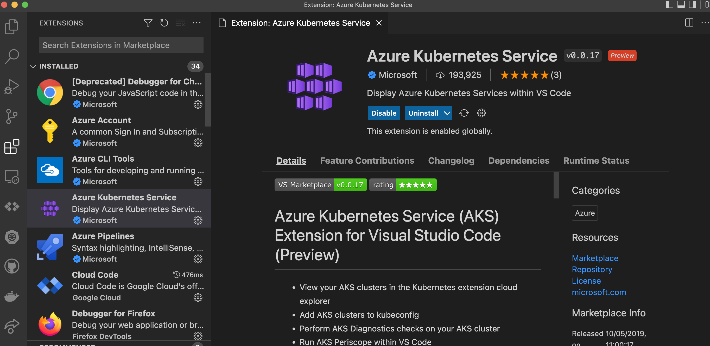
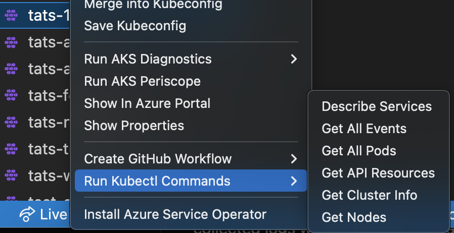

+++
title = "Azure Kubernetes Service"
date = 2024-01-12T22:36:24+08:00
weight = 60
type = "docs"
description = ""
isCJKLanguage = true
draft = false
+++

> 原文: [https://code.visualstudio.com/docs/azure/aksextensions](https://code.visualstudio.com/docs/azure/aksextensions)

# AKS tools and diagnostics in VS Code VS Code 中的 AKS 工具和诊断

This document will walk you through some of the ways you can interact with your AKS clusters directly from Visual Studio Code. [Azure Kubernetes Services](https://azure.microsoft.com/services/kubernetes-service/#overview) is a fully managed [Kubernetes](https://azure.microsoft.com/topic/what-is-kubernetes/#overview) service. Azure Kubernetes Service (AKS) offers serverless Kubernetes, an integrated continuous integration and continuous delivery (CI/CD) experience and enterprise-grade security and governance, is an open-source system for automating deployment, scaling, and management of containerized applications. We will show you how to run [diagnostic health-checks](https://learn.microsoft.com/azure/aks/concepts-diagnostics) on your AKS cluster, launch [AKS Periscope](https://github.com/azure/aks-periscope) for more in-depth troubleshooting, deploy [Azure Service Operator](https://github.com/Azure/azure-service-operator), or generate [GitHub Actions Starter Workflows](https://github.com/actions/starter-workflows).

&zeroWidthSpace;本指南将引导您了解可直接从 Visual Studio Code 与 AKS 集群进行交互的一些方法。Azure Kubernetes Services 是一项完全托管的 Kubernetes 服务。Azure Kubernetes Service (AKS) 提供无服务器 Kubernetes、集成的持续集成和持续交付 (CI/CD) 体验以及企业级安全性和治理，是一个用于自动执行容器化应用程序的部署、扩展和管理的开源系统。我们将向您展示如何在 AKS 集群上运行诊断性运行状况检查、启动 AKS Periscope 以进行更深入的故障排除、部署 Azure Service Operator 或生成 GitHub Actions Starter 工作流。

## [Before you begin 开始之前](https://code.visualstudio.com/docs/azure/aksextensions#_before-you-begin)

The [AKS VS Code Extension](https://marketplace.visualstudio.com/items?itemName=ms-kubernetes-tools.vscode-aks-tools) has parent dependency on [Kubernetes VS Code extension](https://marketplace.visualstudio.com/items?itemName=ms-kubernetes-tools.vscode-kubernetes-tools). You will need to download the [Kubernetes VS Code extension](https://code.visualstudio.com/docs/azure/kubernetes). You can follow this guide on an existing AKS cluster or you can [create AKS cluster](https://learn.microsoft.com/azure/aks/learn/quick-kubernetes-deploy-portal).

&zeroWidthSpace;AKS VS Code 扩展对 Kubernetes VS Code 扩展具有父级依赖关系。您需要下载 Kubernetes VS Code 扩展。您可以在现有 AKS 集群上按照本指南进行操作，也可以创建 AKS 集群。

## [Install the Azure Kubernetes Services extension 安装 Azure Kubernetes Services 扩展](https://code.visualstudio.com/docs/azure/aksextensions#_install-the-azure-kubernetes-services-extension)

For a fully integrated Azure Kubernetes diagnostics experience, you can install the [Azure Kubernetes Services Tools](https://marketplace.visualstudio.com/items?itemName=ms-kubernetes-tools.vscode-aks-tools) extension.

&zeroWidthSpace;对于完全集成的 Azure Kubernetes 诊断体验，您可以安装 Azure Kubernetes Services Tools 扩展。

With the extension you can easily view and manage your AKS clusters from your VS Code environment.

&zeroWidthSpace;借助该扩展，您可以轻松地从 VS Code 环境查看和管理 AKS 集群。

To install the Azure Kubernetes Services VS Code extension, open the Extensions view (Ctrl+Shift+X) and search for "AKS". Select the Microsoft [Azure Kubernetes Services](https://marketplace.visualstudio.com/items?itemName=ms-kubernetes-tools.vscode-aks-tools) extension.

&zeroWidthSpace;要安装 Azure Kubernetes Services VS Code 扩展，请打开扩展视图 (Ctrl+Shift+X) 并搜索“AKS”。选择 Microsoft Azure Kubernetes Services 扩展。

## [Installation 安装](https://code.visualstudio.com/docs/azure/aksextensions#_installation)

1. Download and install the [Azure Kubernetes Service extension](https://marketplace.visualstudio.com/items?itemName=ms-kubernetes-tools.vscode-aks-tools) for VS Code.

   &zeroWidthSpace;下载并安装适用于 VS Code 的 Azure Kubernetes Service 扩展。

2. Wait for the extension to finish installing then reload VS Code when prompted.

   &zeroWidthSpace;等待扩展安装完成，然后在出现提示时重新加载 VS Code。

3. Once the installation is complete, you'll see a section named **Azure** under **Clouds**.

   &zeroWidthSpace;安装完成后，您将在“云”下看到一个名为 Azure 的部分。

4. Sign in to your Azure Account by selecting **Sign in to Azure…**

   &zeroWidthSpace;通过选择“登录到 Azure…”登录到您的 Azure 帐户。

## [Features 特性](https://code.visualstudio.com/docs/azure/aksextensions#_features)

Once you successfully sign in with your Azure Account, you can view all AKS clusters in your Azure subscriptions(s) under the section named **Azure**. You can right-click on your AKS cluster and select a menu item to perform the following actions.

&zeroWidthSpace;成功使用您的 Azure 帐户登录后，您可以在“Azure”部分下查看 Azure 订阅中的所有 AKS 群集。您可以右键单击您的 AKS 群集并选择一个菜单项来执行以下操作。

Run AKS diagnostics on a cluster:

&zeroWidthSpace;对群集运行 AKS 诊断：

Start a GitHub workflow:

&zeroWidthSpace;启动 GitHub 工作流：

Run Kubectl Commands

&zeroWidthSpace;运行 Kubectl 命令

### [Merge into Kubeconfig 合并到 Kubeconfig](https://code.visualstudio.com/docs/azure/aksextensions#_merge-into-kubeconfig)

Right-click on your AKS cluster and select **Merge into Kubeconfig** to add the selected AKS cluster to your [active kubeconfig file](https://github.com/vscode-kubernetes-tools/vscode-kubernetes-tools#working-with-kubeconfigs).

&zeroWidthSpace;右键单击您的 AKS 集群，然后选择“合并到 Kubeconfig”以将选定的 AKS 集群添加到您的活动 kubeconfig 文件中。

### [Save Kubeconfig 保存 Kubeconfig](https://code.visualstudio.com/docs/azure/aksextensions#_save-kubeconfig)

Right-click on your AKS cluster and select **Save Kubeconfig** to save the kubeconfig of the selected AKS cluster as a new file.

&zeroWidthSpace;右键单击您的 AKS 集群，然后选择“保存 Kubeconfig”以将选定 AKS 集群的 kubeconfig 另存为新文件。

### [AKS Diagnostics AKS 诊断](https://code.visualstudio.com/docs/azure/aksextensions#_aks-diagnostics)

Right-click on your AKS cluster and select **Run AKS Diagnostics** to display diagnostics information based on your AKS cluster's backend telemetry for:

&zeroWidthSpace;右键单击您的 AKS 集群，然后选择“运行 AKS 诊断”以根据 AKS 集群的后端遥测显示诊断信息，包括：

- Best Practices
  最佳做法
- Create, Upgrade, Delete and Scale issues
  创建、升级、删除和缩放问题
- Identity and Security
  标识和安全
- Network and Connectivity issues
  网络和连接问题
- Node Health
  节点运行状况

To perform further checks on your AKS cluster to troubleshoot and get recommended solutions, select the AKS Diagnostics link at the top of the page to open it for the selected cluster. For more information on AKS Diagnostics, visit [AKS Diagnostics Overview](https://learn.microsoft.com/azure/aks/concepts-diagnostics).

&zeroWidthSpace;若要对 AKS 集群执行进一步检查以进行故障排除并获取建议的解决方案，请选择页面顶部的 AKS 诊断链接，以将其打开以用于选定的集群。有关 AKS 诊断的详细信息，请访问 AKS 诊断概述。

### [Navigating to your cluster in the Azure Portal 在 Azure 门户中导航到您的集群](https://code.visualstudio.com/docs/azure/aksextensions#_navigating-to-your-cluster-in-the-azure-portal)

Right-click on your AKS cluster and select **Show In Azure Portal** to open the Overview page for your cluster in the [Azure portal](https://portal.azure.com/).

&zeroWidthSpace;右键单击您的 AKS 集群，然后选择在 Azure 门户中显示以在 Azure 门户中打开集群的概述页面。

### [Show AKS cluster properties 显示 AKS 集群属性](https://code.visualstudio.com/docs/azure/aksextensions#_show-aks-cluster-properties)

Right click on your AKS cluster and select **Show Properties** to display the AKS cluster and agent pool properties like provisioning state, fqdn, k8s version, along with node properties like node version, vm type, vm size, o/s type, o/s disk size and nodes provisioning state.

&zeroWidthSpace;右键单击您的 AKS 集群，然后选择显示属性以显示 AKS 集群和代理池属性，如预配状态、fqdn、k8s 版本，以及节点属性，如节点版本、虚拟机类型、虚拟机大小、操作系统类型、操作系统磁盘大小和节点预配状态。

### [AKS Periscope](https://code.visualstudio.com/docs/azure/aksextensions#_aks-periscope)

Right-click on your AKS cluster and select **Run AKS Periscope** to extract detailed diagnostic information from your AKS cluster and export it to an Azure storage account. When you select the option, a web view will load providing you the option to generate a downloadable link for the collected logs as well as a shareable link with 7-day expiry.

&zeroWidthSpace;右键单击您的 AKS 集群，然后选择运行 AKS Periscope 以从您的 AKS 集群中提取详细的诊断信息并将其导出到 Azure 存储帐户。选择该选项后，将加载一个 Web 视图，为您提供生成收集的日志的可下载链接以及具有 7 天到期日的可共享链接的选项。

> If you are not seeing the logs for all the nodes, it is possible the logs were still uploading. Press the **Generate Link** button again to load more logs.
>
> &zeroWidthSpace;如果您没有看到所有节点的日志，则日志可能仍在上传。再次按“生成链接”按钮以加载更多日志。

For more information, visit [AKS Periscope](https://github.com/Azure/aks-periscope).

&zeroWidthSpace;有关更多信息，请访问 AKS Periscope。

**Configuring a Storage Account
配置存储帐户**

Running the AKS Periscope requires you to have a storage account associated with the Diagnostic settings of your AKS cluster. If you have only one storage account associated with the Diagnostic settings of your AKS cluster, the collected logs will be stored in the associated storage account by default. If you have more than one storage account associated with the Diagnostics settings of your AKS cluster, then the extension will prompt you to choose the storage account for saving collected logs. If you don't have a storage account configured in the Diagnostic settings, you can follow these instructions to enable it:

&zeroWidthSpace;运行 AKS Periscope 需要您拥有与 AKS 集群的诊断设置关联的存储帐户。如果您只有一个存储帐户与 AKS 集群的诊断设置关联，则收集的日志将默认存储在关联的存储帐户中。如果您有多个存储帐户与 AKS 集群的诊断设置关联，则扩展程序将提示您选择存储帐户以保存收集的日志。如果您在诊断设置中未配置存储帐户，则可以按照以下说明启用它：

1. Right-click on your AKS cluster and select **Show In Azure Portal**.

   &zeroWidthSpace;右键单击您的 AKS 集群，然后选择“在 Azure 门户中显示”。

2. Select **Diagnostic Settings** under **Monitoring** in the left navigation.

   &zeroWidthSpace;在左侧导航栏中，在“监视”下选择“诊断设置”。

3. Select **Add diagnostic setting**.

   &zeroWidthSpace;选择“添加诊断设置”。

4. Enter a name, such as myAKSClusterLogs, then select the option to **Archive to a storage account**.

   &zeroWidthSpace;输入名称，例如 myAKSClusterLogs，然后选择“存档到存储帐户”选项。

5. Select a storage account of your choice.

   &zeroWidthSpace;选择您选择的存储帐户。

6. In the list of available logs, select the logs you wish to enable.

   &zeroWidthSpace;在可用日志列表中，选择您希望启用的日志。

   > Note: The incurred cost is subject to your storage account usage and Azure Storage Policy.
   >
   > &zeroWidthSpace;注意：产生的费用取决于您的存储帐户使用情况和 Azure 存储策略。

7. When ready, select **Save** to enable collection of the selected logs.

   &zeroWidthSpace;准备就绪后，选择“保存”以启用所选日志的收集。

For more information on Diagnostics settings, visit [Create diagnostic settings to send platform logs and metrics to different destinations](https://learn.microsoft.com/azure/azure-monitor/essentials/diagnostic-settings).

&zeroWidthSpace;有关诊断设置的更多信息，请访问创建诊断设置以将平台日志和指标发送到不同的目标。

### [Install Azure Service Operator 安装 Azure 服务运营商](https://code.visualstudio.com/docs/azure/aksextensions#_install-azure-service-operator)

Right-click on your AKS cluster and select **Install Azure Service Operator** to easily deploy the latest version of Azure Service Operator (ASO) on your AKS cluster and provision Azure resources within Kubernetes. When you select this option, you'll be prompted for a service principal for ASO to use when performing Azure resource operations. This service principal must have appropriate permissions (typically Contributor at suitable scope). Fill out the service principal details and select **Submit** to kick off the installation of Azure Service Operator.

&zeroWidthSpace;右键单击您的 AKS 集群，然后选择“安装 Azure 服务运营商”，以便轻松地在您的 AKS 集群上部署最新版本的 Azure 服务运营商 (ASO) 并供应 Kubernetes 中的 Azure 资源。选择此选项时，系统会提示您输入 ASO 在执行 Azure 资源操作时要使用的服务主体。此服务主体必须具有适当的权限（通常是适当范围内的“参与者”）。填写服务主体详细信息，然后选择“提交”以启动 Azure 服务运营商的安装。

> Install Azure Service Operator can only be performed on an AKS cluster that has never had ASO installed before. If you have already initiated the installation manually, follow the instructions on [Azure Service Operator](https://azure.github.io/azure-service-operator/#installation) to complete.
>
> &zeroWidthSpace;仅可在之前从未安装过 ASO 的 AKS 集群上执行“安装 Azure 服务运营商”。如果您已手动启动安装，请按照 Azure 服务运营商上的说明完成安装。

For more information on Azure Service Operator, visit [Azure Service Operator (for Kubernetes)](https://github.com/Azure/azure-service-operator). If you are experiencing issues with Azure Service Operator, visit [Azure Service Operator (ASO) troubleshooting](https://github.com/Azure/azure-service-operator/blob/master/docs/troubleshooting.md).

&zeroWidthSpace;有关 Azure Service Operator 的更多信息，请访问 Azure Service Operator（适用于 Kubernetes）。如果您遇到 Azure Service Operator 问题，请访问 Azure Service Operator (ASO) 故障排除。

### [Create GitHub Workflow 创建 GitHub 工作流](https://code.visualstudio.com/docs/azure/aksextensions#_create-github-workflow)

Right-click on your AKS cluster and select **Create GitHub Workflow** to easily open and create a workflow starter template. This helps in quick generation of the workflow templates with pre-populated resource group and cluster name for:

&zeroWidthSpace;右键单击 AKS 集群，然后选择“创建 GitHub 工作流”，以便轻松打开并创建工作流启动器模板。这有助于快速生成工作流模板，其中预填充了以下内容的资源组和集群名称：

- [Starter Workflow
  启动器工作流](https://github.com/actions/starter-workflows/blob/main/deployments/azure-kubernetes-service.yml)
- [Helm Workflow
  Helm 工作流](https://github.com/actions/starter-workflows/blob/main/deployments/azure-kubernetes-service-helm.yml)
- [Kompose Workflow
  Kompose 工作流](https://github.com/actions/starter-workflows/blob/main/deployments/azure-kubernetes-service-kompose.yml)
- [Kustomize Workflow
  Kustomize 工作流](https://github.com/actions/starter-workflows/blob/main/deployments/azure-kubernetes-service-kustomize.yml)

### [Create cluster from Azure Portal 从 Azure 门户创建集群](https://code.visualstudio.com/docs/azure/aksextensions#_create-cluster-from-azure-portal)

Right-click on your AKS subscription and select **Create Cluster From Azure Portal** to easily navigate to the AKS create cluster page in the Azure Portal.

&zeroWidthSpace;右键单击 AKS 订阅，然后选择“从 Azure 门户创建集群”，以便轻松导航到 Azure 门户中的 AKS 创建集群页面。

### [Start or stop an AKS cluster 启动或停止 AKS 集群](https://code.visualstudio.com/docs/azure/aksextensions#_start-or-stop-an-aks-cluster)

Right-click on your AKS cluster and select **Show Properties** to display the AKS cluster properties. On the page, there is a **Stop/Start Cluster** button to start or stop the cluster.

&zeroWidthSpace;右键单击您的 AKS 集群并选择“显示属性”以显示 AKS 集群属性。页面上有一个“停止/启动集群”按钮，用于启动或停止集群。

### [Run Kubectl Commands from your AKS cluster 从您的 AKS 集群运行 Kubectl 命令](https://code.visualstudio.com/docs/azure/aksextensions#_run-kubectl-commands-from-your-aks-cluster)

Right-click on your AKS cluster and select **Run KubectlCommands** to run Kubectl commands on your cluster. Currently, the following Kubectl commands are available:

&zeroWidthSpace;右键单击您的 AKS 集群并选择“运行 Kubectl 命令”以在您的集群上运行 Kubectl 命令。目前，以下 Kubectl 命令可用：

- Describe Services
  描述服务
- Get All Pods
  获取所有 Pod
- API Resources
  API 资源
- Get Cluster Info
  获取集群信息
- Get Node
  获取节点
- Get All Events
  获取所有事件

Congratulations! You now know how to navigate through this VS Code extension.

&zeroWidthSpace;恭喜！您现在知道如何浏览此 VS Code 扩展。

## [Next steps 后续步骤](https://code.visualstudio.com/docs/azure/aksextensions#_next-steps)

- [Azure Extensions](https://code.visualstudio.com/docs/azure/extensions) - The VS Code Marketplace has hundreds of extensions for Azure and the cloud.
  Azure 扩展 - VS Code Marketplace 拥有数百个适用于 Azure 和云的扩展。
- [Azure Kubernetes Service Diagnostics (preview) overview
  Azure Kubernetes Service 诊断（预览版）概述](https://learn.microsoft.com/azure/aks/concepts-diagnostics)
- [Azure Service Operator](https://azure.github.io/azure-service-operator/#azure-service-operator-v2) - Learn about Azure Service Operator.
  Azure 服务运营商 - 了解 Azure 服务运营商。
- [AKS Periscope](https://github.com/azure/aks-periscope)
- [GitHub AKS Starter Workflow](https://github.com/actions/starter-workflows)
