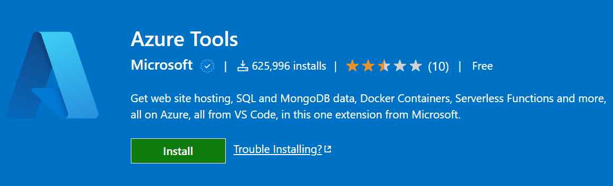
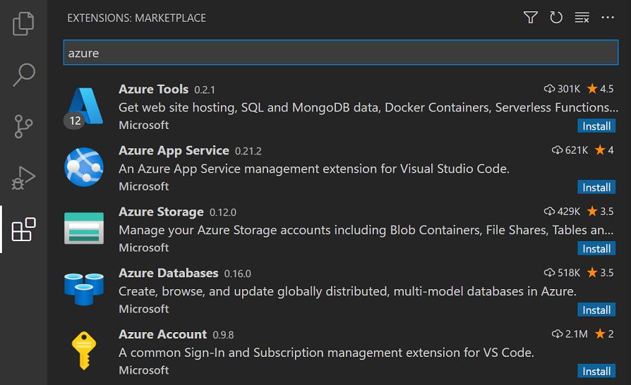

+++
title = "Extensions"
date = 2024-01-12T22:36:24+08:00
weight = 1
type = "docs"
description = ""
isCJKLanguage = true
draft = false
+++

> 原文: [https://code.visualstudio.com/docs/azure/extensions](https://code.visualstudio.com/docs/azure/extensions)

# Azure Extensions Azure 扩展

You can use [Azure](https://azure.microsoft.com/) directly from Visual Studio Code through extensions. Using either the [Azure CLI](https://marketplace.visualstudio.com/items?itemName=ms-vscode.azurecli) or the various extensions in the [Azure Tools](https://marketplace.visualstudio.com/items?itemName=ms-vscode.vscode-node-azure-pack) extension pack, you can have your application running in Azure in minutes.

​​​	您可以通过扩展直接从 Visual Studio Code 使用 Azure。使用 Azure CLI 或 Azure 工具扩展包中的各种扩展，您可以在几分钟内让您的应用程序在 Azure 中运行。

## [Visual Studio Code Marketplace](https://code.visualstudio.com/docs/azure/extensions#_visual-studio-code-marketplace)

There are many VS Code extensions on the [Marketplace](https://marketplace.visualstudio.com/search?term=azure&target=VSCode&category=All categories&sortBy=Relevance) that make it easy to build and host applications on Azure.

​​​	Marketplace 上有许多 VS Code 扩展，可以轻松地在 Azure 上构建和托管应用程序。

Azure Functions

2.3M

ms-azuretools

Azure Machine Learning

2.1M
210 万

ms-toolsai

Azure App Service

1.7M
170 万

ms-azuretools

Azure CLI Tools

1.6M

ms-vscode

Azure Databases
Azure 数据库

1.4M

ms-azuretools

Azure Storage
Azure 存储

1.3M

ms-azuretools

Azure Resource Manager (ARM) Tools
Azure 资源管理器 (ARM) 工具

1.2M

msazurermtools

Azure Developer CLI
Azure 开发人员 CLI

670.6K

ms-azuretools

> **Tip:** Click on an extension tile above to read the description and reviews in the Marketplace.
>
> ​​​	提示：单击上面的扩展磁贴以阅读 Marketplace 中的说明和评论。

## [Searching for extensions 正在搜索扩展](https://code.visualstudio.com/docs/azure/extensions#_searching-for-extensions)

You can also search for Azure or cloud extensions in the VS Code Extensions view (Ctrl+Shift+X) and type 'azure'.

​​​	您还可以在 VS Code 扩展视图 (Ctrl+Shift+X) 中搜索 Azure 或云扩展，然后键入“azure”。

## [Next steps 后续步骤](https://code.visualstudio.com/docs/azure/extensions#_next-steps)

- [Deploying to Azure](https://code.visualstudio.com/docs/azure/deployment) - Learn step-by-step how to deploy your application to Azure.
  在 Azure 中部署 - 逐步了解如何将应用程序部署到 Azure。
- [Working with Docker](https://code.visualstudio.com/docs/azure/docker) - Put your application in a Docker container for easy reuse and deployment.
  使用 Docker - 将您的应用程序放入 Docker 容器中，以便轻松重复使用和部署。
