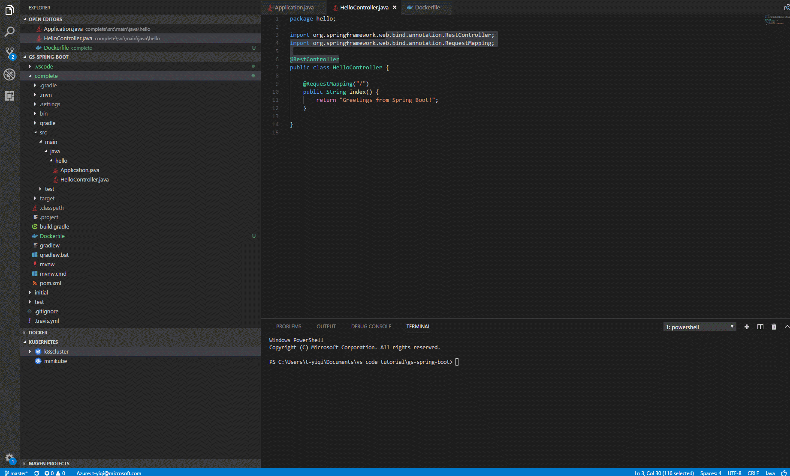

+++
title = "Kubernetes"
date = 2024-01-12T22:36:24+08:00
weight = 50
type = "docs"
description = ""
isCJKLanguage = true
draft = false
+++

> 原文: [https://code.visualstudio.com/docs/azure/kubernetes](https://code.visualstudio.com/docs/azure/kubernetes)

# Working with Kubernetes in VS Code 在 VS Code 中使用 Kubernetes

This document will walk you through the process of deploying an application to [Kubernetes](https://kubernetes.io/) with Visual Studio Code. [Kubernetes](https://kubernetes.io/) is an open-source system for automating deployment, scaling, and management of containerized applications. We will show you how to create a Kubernetes cluster, write a Kubernetes manifest file (usually written in YAML), which tells Kubernetes everything it needs to know about the application, and then finally deploy the application to the Kubernetes cluster.

​​​	本指南将引导您完成使用 Visual Studio Code 将应用程序部署到 Kubernetes 的过程。Kubernetes 是一个用于自动执行容器化应用程序的部署、扩展和管理的开源系统。我们将向您展示如何创建 Kubernetes 集群、编写 Kubernetes 清单文件（通常以 YAML 编写），该文件会告知 Kubernetes 有关应用程序所需的一切信息，然后最终将应用程序部署到 Kubernetes 集群。

## [Before you begin 开始之前](https://code.visualstudio.com/docs/azure/kubernetes#_before-you-begin)

You will need to have tools for [Docker](https://docker.com/) and [kubectl](https://kubernetes.io/docs/reference/kubectl/overview/). See the [Install Docker](https://docs.docker.com/install/) documentation for details on setting up Docker on your machine and [Install kubectl](https://kubernetes.io/docs/tasks/tools/install-kubectl/). Before proceeding further, verify you can run Docker and kubectl commands from the shell.

​​​	您需要具备 Docker 和 kubectl 的工具。有关在计算机上设置 Docker 的详细信息，请参阅安装 Docker 文档，有关安装 kubectl 的详细信息，请参阅安装 kubectl。在继续操作之前，请验证您可以从 shell 运行 Docker 和 kubectl 命令。

You can create a local Kubernetes cluster with [minikube](https://kubernetes.io/docs/getting-started-guides/minikube/) or an Azure Kubernetes cluster in [Azure Kubernetes Service (AKS)](https://learn.microsoft.com/azure/aks/). In this tutorial, we will use [Azure Kubernetes Service (AKS)](https://learn.microsoft.com/azure/aks/) and you will need to have your [Azure](https://www.azure.com/) account ready for the deployment steps.

​​​	您可以使用 minikube 创建本地 Kubernetes 集群，或在 Azure Kubernetes 服务 (AKS) 中创建 Azure Kubernetes 集群。在本教程中，我们将使用 Azure Kubernetes 服务 (AKS)，您需要准备好 Azure 帐户以进行部署步骤。

In addition, if you want to iteratively run and debug containers directly in MiniKube, Azure Kubernetes Service (AKS), or another Kubernetes provider, you can install the [Bridge to Kubernetes](https://marketplace.visualstudio.com/items?itemName=mindaro.mindaro) extension. To get started, see [Use Bridge to Kubernetes](https://learn.microsoft.com/visualstudio/bridge/bridge-to-kubernetes-vs-code).

​​​	此外，如果您想在 MiniKube、Azure Kubernetes 服务 (AKS) 或其他 Kubernetes 提供程序中迭代运行和调试容器，可以安装 Bridge to Kubernetes 扩展。若要开始，请参阅使用 Bridge to Kubernetes。

## [Install the Kubernetes extension 安装 Kubernetes 扩展](https://code.visualstudio.com/docs/azure/kubernetes#_install-the-kubernetes-extension)

For a fully integrated Kubernetes experience, you can install the [Kubernetes Tools](https://marketplace.visualstudio.com/items?itemName=ms-kubernetes-tools.vscode-kubernetes-tools) extension, which lets you quickly develop Kubernetes manifests and HELM charts. With the extension, you can also deploy containerized micro-service based applications to local or Azure Kubernetes clusters and debug your live applications running in containers on Kubernetes clusters. It also makes it easy to browse and manage your Kubernetes clusters in VS Code and provides seamless integration with [Draft](https://draft.sh/) to streamline Kubernetes development.

​​​	对于完全集成的 Kubernetes 体验，可以安装 Kubernetes 工具扩展，它使您可以快速开发 Kubernetes 清单和 HELM 图表。借助该扩展，您还可以将基于容器的微服务应用程序部署到本地或 Azure Kubernetes 群集，并调试在 Kubernetes 群集上的容器中运行的实时应用程序。它还使您能够轻松浏览和管理 VS Code 中的 Kubernetes 群集，并提供与 Draft 的无缝集成，以简化 Kubernetes 开发。

To install the Kubernetes extension, open the Extensions view (Ctrl+Shift+X) and search for "kubernetes". Select the Microsoft [Kubernetes](https://marketplace.visualstudio.com/items?itemName=ms-kubernetes-tools.vscode-kubernetes-tools) extension.

​​​	若要安装 Kubernetes 扩展，请打开扩展视图 (Ctrl+Shift+X) 并搜索“kubernetes”。选择 Microsoft Kubernetes 扩展。

## [Containerize and publish the application 将应用程序容器化并发布](https://code.visualstudio.com/docs/azure/kubernetes#_containerize-and-publish-the-application)

You can follow the [Working with Docker](https://code.visualstudio.com/docs/azure/docker) tutorial to build your project, generate a Docker image, and push it to a public or private container registry through the Microsoft [Docker Extension](https://marketplace.visualstudio.com/items?itemName=ms-azuretools.vscode-docker).

​​​	您可以按照使用 Docker 教程构建项目、生成 Docker 映像，并通过 Microsoft Docker 扩展将其推送到公共或专用容器注册表。

## [Create and config a Kubernetes cluster 创建和配置 Kubernetes 集群](https://code.visualstudio.com/docs/azure/kubernetes#_create-and-config-a-kubernetes-cluster)

You can create a Kubernetes cluster running on Azure using the Kubernetes extension in VS Code. Once you have installed the Kubernetes extension, you will see **KUBERNETES** in the Explorer. Click on **More** and choose **Create Cluster**. Follow the instructions to choose the cluster type (here we choose **Azure Kubernetes Service**), select your subscription, and set up the Azure cluster and Azure agent settings. It will take a few minutes to complete the whole workflow.

​​​	您可以使用 VS Code 中的 Kubernetes 扩展在 Azure 上运行 Kubernetes 集群。安装 Kubernetes 扩展后，您将在资源管理器中看到 KUBERNETES。单击“更多”并选择“创建集群”。按照说明选择集群类型（此处我们选择 Azure Kubernetes 服务），选择您的订阅，并设置 Azure 集群和 Azure 代理设置。完成整个工作流需要几分钟时间。

**Important**: To create a Kubernetes cluster on Azure, you need to install the [Azure CLI](https://learn.microsoft.com/cli/azure/get-started-with-azure-cli) and sign in.

​​​	重要提示：要在 Azure 上创建 Kubernetes 集群，您需要安装 Azure CLI 并登录。

**Tip**: You will encounter an error if you don't have an available RSA key file. Follow [create SSH public-private key](https://learn.microsoft.com/azure/virtual-machines/linux/mac-create-ssh-keys) to create your key before creating an Azure Kubernetes cluster.

​​​	提示：如果您没有可用的 RSA 密钥文件，您将遇到错误。在创建 Azure Kubernetes 集群之前，请按照创建 SSH 公钥-私钥创建您的密钥。

**Tip**: You might encounter an error indicating conflicting location and VM size when creating an Azure Kubernetes cluster. Pay attention to choose proper location and VM size.

​​​	提示：在创建 Azure Kubernetes 集群时，您可能会遇到指示位置和 VM 大小冲突的错误。注意选择合适的位置和 VM 大小。

## [Deploy the application to Azure Kubernetes Service 将应用程序部署到 Azure Kubernetes 服务](https://code.visualstudio.com/docs/azure/kubernetes#_deploy-the-application-to-azure-kubernetes-service)

The Kubernetes extension provides autocompletion, code snippets, and verification for the Kubernetes manifest file. For example, once you type 'Deployment' in an empty YAML file, a manifest file with fundamental structure is autogenerated for you. You only need to enter your app name, image, and port manually.

​​​	Kubernetes 扩展为 Kubernetes 清单文件提供自动完成、代码片段和验证。例如，一旦您在空 YAML 文件中键入“Deployment”，一个具有基本结构的清单文件将自动为您生成。您只需手动输入您的应用名称、镜像和端口。

Below is an example manifest file:

​​​	下面是一个清单文件示例：

Once your manifest file is ready, you only need one command to start a deployment. Open the **Command Palette** (Ctrl+Shift+P) and run **Kubernetes: Create**. It will deploy the application to your Kubernetes cluster and create objects according to the configuration in the open Kubernetes manifest file.

​​​	清单文件准备就绪后，您只需一个命令即可启动部署。打开命令面板 (Ctrl+Shift+P) 并运行 Kubernetes：创建。它会将应用程序部署到您的 Kubernetes 集群，并根据打开的 Kubernetes 清单文件中的配置创建对象。

### [Checking on your deployment 检查您的部署](https://code.visualstudio.com/docs/azure/kubernetes#_checking-on-your-deployment)

After deployment, the Kubernetes extension can help you check the status of your application. From the Explorer, click on **Workloads**, right click on **Pods** and then choose **Get** to see whether the application has started. To view the status of your app, select **Services**, right click on your app, and then click **Get**. The status will be printed to the Integrated Terminal. Once your application has an `EXTERNAL_IP`, you can open a browser and see your web app running.

​​​	部署后，Kubernetes 扩展可以帮助您检查应用程序的状态。在资源管理器中，单击工作负载，右键单击 Pod，然后选择获取以查看应用程序是否已启动。要查看应用的状态，请选择服务，右键单击您的应用，然后单击获取。状态将打印到集成终端。一旦您的应用程序具有 `EXTERNAL_IP` ，您就可以打开浏览器并查看正在运行的 Web 应用。

Congratulations! Now your app is successfully running in Azure Kubernetes Service!

​​​	恭喜！您的应用现已在 Azure Kubernetes Service 中成功运行！

## [Next steps 后续步骤](https://code.visualstudio.com/docs/azure/kubernetes#_next-steps)

- [Overview of Bridge to Kubernetes](https://learn.microsoft.com/visualstudio/bridge/overview-bridge-to-kubernetes) - Learn more about Bridge to Kubernetes, a rapid, iterative Kubernetes development experience for teams.
  Kubernetes 桥接概述 - 详细了解 Kubernetes 桥接，一种适用于团队的快速、迭代式 Kubernetes 开发体验。
- [Azure Extensions](https://code.visualstudio.com/docs/azure/extensions) - The VS Code Marketplace has hundreds of extensions for Azure and the cloud.
  Azure 扩展 - VS Code Marketplace 拥有数百个适用于 Azure 和云的扩展。
- [Deploying to Azure](https://code.visualstudio.com/docs/azure/deployment) - Learn step-by-step how to deploy your application to Azure.
  在 Azure 中部署 - 逐步了解如何将应用程序部署到 Azure。
