+++
title = "MongoDB"
date = 2024-01-12T22:36:24+08:00
weight = 40
type = "docs"
description = ""
isCJKLanguage = true
draft = false
+++

> 原文: [https://code.visualstudio.com/docs/azure/mongodb](https://code.visualstudio.com/docs/azure/mongodb)

# Working with MongoDB 使用 MongoDB

Visual Studio Code has great support for working with [MongoDB](https://www.mongodb.com/what-is-mongodb) databases, whether your own instance or in [Azure with MongoDB Atlas](https://www.mongodb.com/cloud/atlas/azure-mongodb?utm_campaign=marketplace&utm_source=&utm_medium=marketplace). With the [MongoDB for VS Code](https://marketplace.visualstudio.com/items?itemName=mongodb.mongodb-vscode) extension, you can create, manage, and query MongoDB databases from within VS Code.

​​​	Visual Studio Code 对使用 MongoDB 数据库（无论是您自己的实例还是使用 MongoDB Atlas 在 Azure 中）提供了极好的支持。借助 MongoDB for VS Code 扩展，您可以在 VS Code 中创建、管理和查询 MongoDB 数据库。

## [Install the extension 安装扩展]()

MongoDB support for VS Code is provided by the [MongoDB for VS Code](https://marketplace.visualstudio.com/items?itemName=mongodb.mongodb-vscode) extension. To install the MongoDB for VS Code extension, open the Extensions view by pressing Ctrl+Shift+X and search for 'MongoDB' to filter the results. Select the **MongoDB for VS Code** extension.

​​​	VS Code 的 MongoDB 支持由 MongoDB for VS Code 扩展提供。要安装 MongoDB for VS Code 扩展，请按 Ctrl+Shift+X 打开“扩展”视图，然后搜索“MongoDB”以筛选结果。选择 MongoDB for VS Code 扩展。

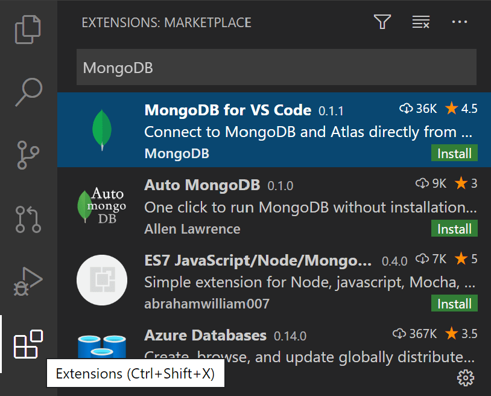

## [Connect to MongoDB 连接到 MongoDB]()

Once you've installed the MongoDB for VS Code extension, you'll notice there is a new **MongoDB** Activity Bar view. Select the MongoDB view and you'll see the MongoDB Explorer.

​​​	安装 MongoDB for VS Code 扩展后，您会注意到有一个新的 MongoDB 活动栏视图。选择 MongoDB 视图，您将看到 MongoDB 资源管理器。

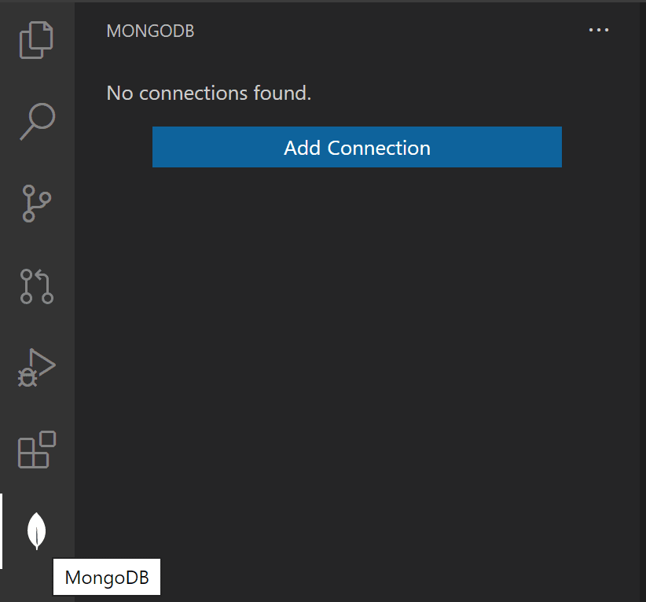

To connect to a MongoDB database, select **Add Connection** and enter the connection details for the database then **Connect**, the default is a local MongoDB server at `mongodb://127.0.0.1:27017`. You can also enter a connection string, click the "connect with a connection string" link and paste the connection string.

​​​	要连接到 MongoDB 数据库，请选择“添加连接”，然后输入数据库的连接详细信息，然后选择“连接”，默认情况下为 `mongodb://127.0.0.1:27017` 处的本地 MongoDB 服务器。您还可以输入连接字符串，单击“使用连接字符串连接”链接并粘贴连接字符串。

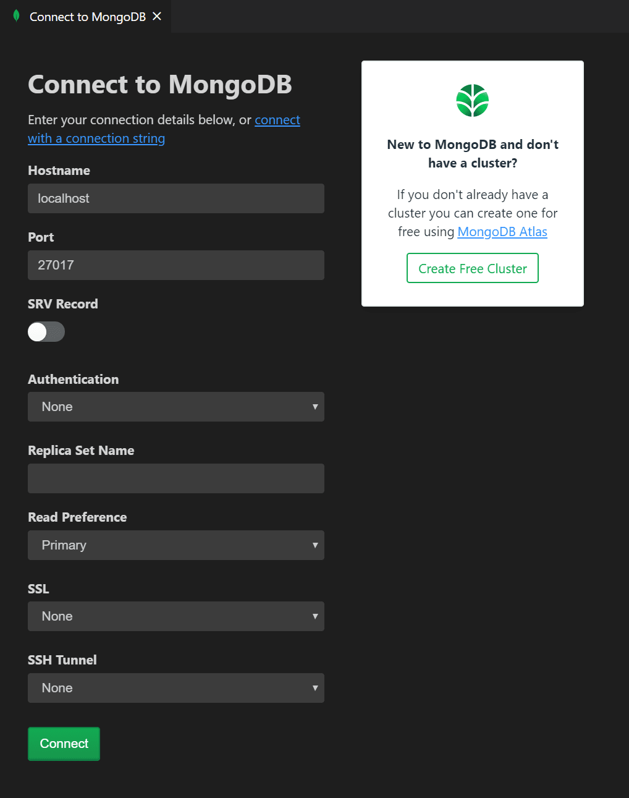

> **Note**: Make sure your MongoDB server (mongod.exe) is running if you are connecting to a local MongoDB server.
>
> ​​​	注意：如果您要连接到本地 MongoDB 服务器，请确保您的 MongoDB 服务器 (mongod.exe) 正在运行。

Once attached, you can work with the MongoDB server, managing MongoDB Databases, Collections, and Documents.

​​​	连接后，您可以使用 MongoDB 服务器，管理 MongoDB 数据库、集合和文档。

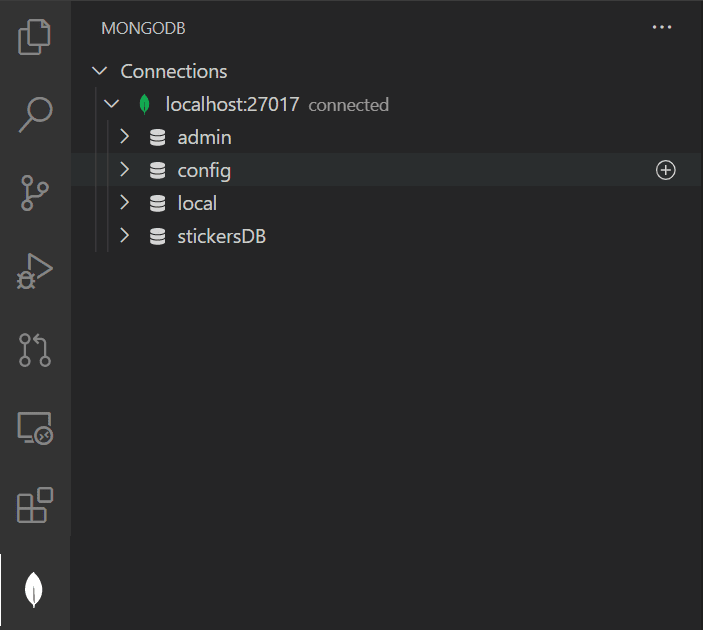

You can expand databases to view their collections with their schema and indexes and you can select individual MongoDB Documents to view their JSON.

​​​	您可以展开数据库以查看其集合及其架构和索引，还可以选择各个 MongoDB 文档以查看其 JSON。

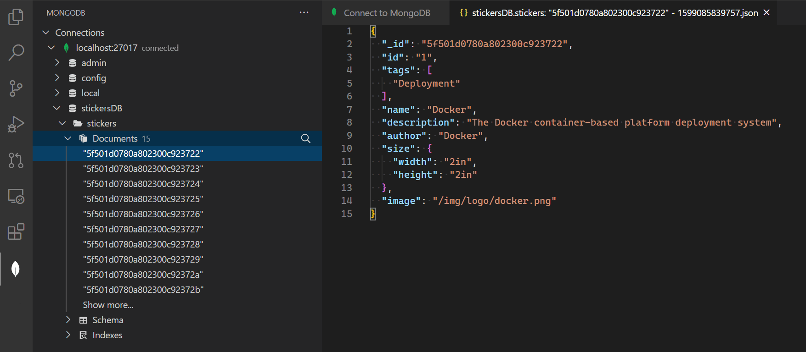

You can also attach a MongoDB shell to the active connection, simply by right-clicking on the connection itself.

​​​	您还可以通过右键单击连接本身，将 MongoDB shell 附加到活动连接。

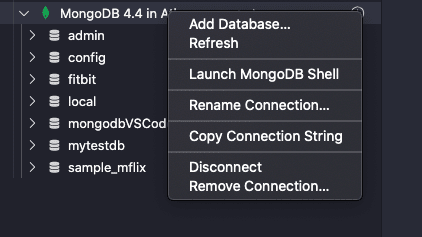

> **Note**: Make sure the MongoDB shell (`mongo` or `mongosh`) [is installed](https://docs.mongodb.com/mongodb-shell/install#mdb-shell-install) and is on your path. In the extension's settings, you can choose which shell you are using.
>
> ​​​	注意：确保已安装 MongoDB shell（ `mongo` 或 `mongosh` ）且位于您的路径中。在扩展的设置中，您可以选择要使用的 shell。

## [MongoDB Commands MongoDB 命令]()

There are MongoDB specific commands available in the VS Code **Command Palette** (Ctrl+Shift+P) as well as through Explorer context menus.

​​​	VS Code 命令面板（Ctrl+Shift+P）以及资源管理器上下文菜单中提供了 MongoDB 特定命令。

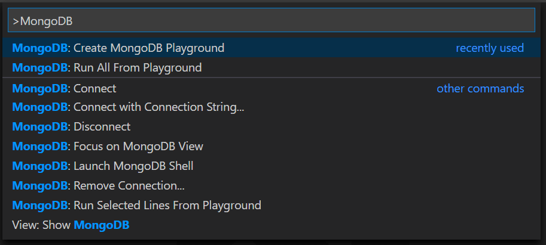

## [Using Playgrounds 使用游乐场]()

One of the most powerful features of the VS Code MongoDB integration is **Mongo Playgrounds**. Playgrounds let you create, run, and save MongoDB commands from a VS Code editor. Create a new playground with the **MongoDB: Create MongoDB Playground** command.

​​​	VS Code MongoDB 集成最强大的功能之一是 Mongo 游乐场。游乐场允许您从 VS Code 编辑器创建、运行和保存 MongoDB 命令。使用 MongoDB: 创建 MongoDB 游乐场命令创建新的游乐场。

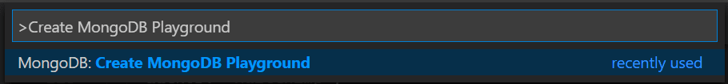

In a playground, you can reference MongoDB entities and commands and you get rich IntelliSense as you type. Playgrounds are useful for prototyping database operations and queries. Execute selected lines in the playground queries with the **MongoDB: Run Selected Lines From Playground** command.

​​​	在游乐场中，您可以引用 MongoDB 实体和命令，并在键入时获得丰富的 IntelliSense。游乐场可用于对数据库操作和查询进行原型设计。使用 MongoDB：从游乐场运行选定行命令执行游乐场查询中的选定行。

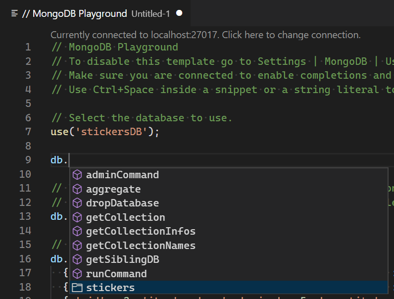

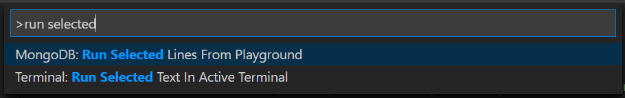

## [MongoDB on Azure Azure 上的 MongoDB]()

You can easily create a MongoDB cluster on Azure for **Free** with [MongoDB Atlas](https://www.mongodb.com/cloud/atlas/signup?utm_campaign=marketplace&utm_source=signup&utm_medium=marketplace).

​​​	您可以使用 MongoDB Atlas 在 Azure 上免费轻松创建 MongoDB 集群。

Choose **Create a New Cluster** from the dashboard and choose **Azure** as the Cloud Provider. Once the cluster is created, connect to using the connection string provided by **MongoDB Atlas**.

​​​	从仪表板中选择创建新集群，然后选择 Azure 作为云提供商。创建集群后，使用 MongoDB Atlas 提供的连接字符串进行连接。

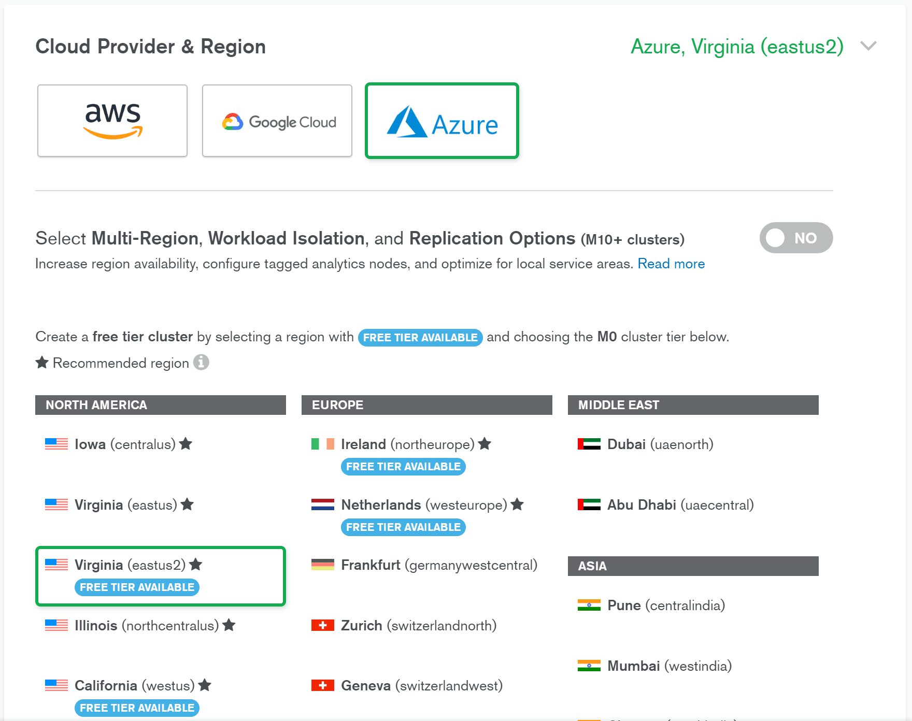

## [Next steps 后续步骤]()

- [Azure Extensions]() - The VS Code Marketplace has hundreds of extensions for Azure and the cloud.
  Azure 扩展 - VS Code Marketplace 拥有数百个适用于 Azure 和云的扩展。
- [Deploying to Azure]() - Learn step-by-step how to deploy your application to Azure.
  在 Azure 中部署 - 逐步了解如何将应用程序部署到 Azure。
- [Working with Docker]() - Put your application in a Docker container for easy reuse and deployment.
  使用 Docker - 将您的应用程序放入 Docker 容器中，以便轻松重复使用和部署。
