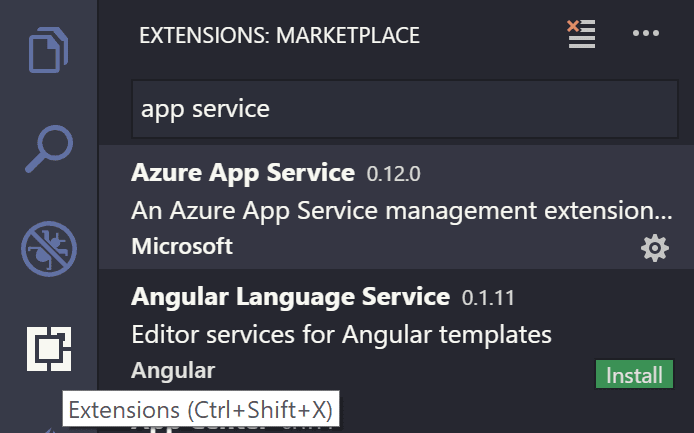
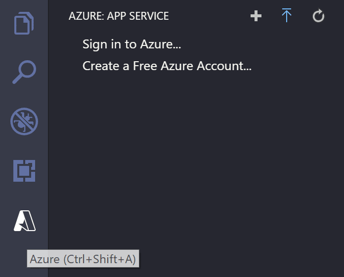
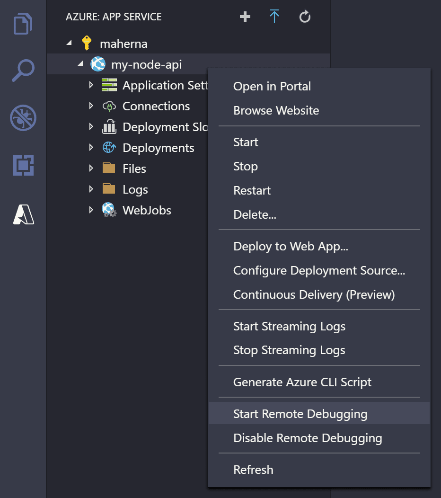
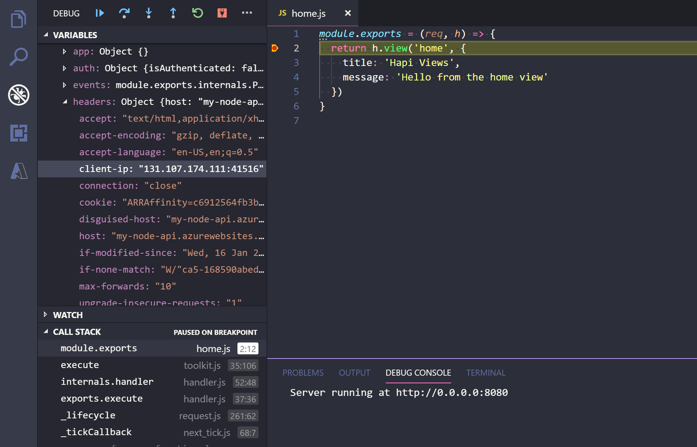

+++
title = "Remote Debugging for Node.js"
date = 2024-01-12T22:36:24+08:00
weight = 20
type = "docs"
description = ""
isCJKLanguage = true
draft = false
+++

> 原文: [https://code.visualstudio.com/docs/azure/remote-debugging](https://code.visualstudio.com/docs/azure/remote-debugging)

# Azure Remote Debugging for Node.js Azure Node.js 远程调试

Connect the Visual Studio Code debugger to your Node.js applications running on **Azure App Service** on **Linux**. The debugger works the same as when it's connected to a local Node.js process - including the use of Breakpoints and Logpoints.

​​​	将 Visual Studio Code 调试器连接到在 Linux 上的 Azure 应用服务上运行的 Node.js 应用程序。调试器的工作方式与连接到本地 Node.js 进程时相同，包括使用断点和日志点。

## [Install the extension 安装扩展](https://code.visualstudio.com/docs/azure/remote-debugging#_install-the-extension)

Remote debugging support for VS Code is provided by the [Azure App Service](https://marketplace.visualstudio.com/items?itemName=ms-azuretools.vscode-azureappservice) extension for apps deployed to Azure. To install the Azure App Service extension, open the Extensions view by pressing Ctrl+Shift+X and search for 'app service' to filter the results. Select the Microsoft **Azure App Service** extension.

​​​	VS Code 的远程调试支持由 Azure 应用服务扩展提供，该扩展适用于已部署到 Azure 的应用。若要安装 Azure 应用服务扩展，请按 Ctrl+Shift+X 打开扩展视图，然后搜索“应用服务”以筛选结果。选择 Microsoft Azure 应用服务扩展。

## [Connect to Azure 连接到 Azure](https://code.visualstudio.com/docs/azure/remote-debugging#_connect-to-azure)

Once you've installed the Azure App Service extension, you'll notice there is a new **Azure** Activity Bar view. Select the Azure view and you'll see the Azure App Service Explorer.

​​​	安装 Azure 应用服务扩展后，您会注意到有一个新的 Azure 活动栏视图。选择 Azure 视图，您将看到 Azure 应用服务资源管理器。

Select **Sign in to Azure** in the App Service Explorer or **Azure: Sign In** from the **Command Palette** (Ctrl+Shift+P) to sign in to your Azure Account. If you don't have an account, select **Create a Free Azure Account...** to create a free account and get $200 in Azure Credits to try out any combination of Azure services.

​​​	在应用服务资源管理器中选择“登录到 Azure”，或从命令面板（Ctrl+Shift+P）中选择“Azure: 登录”以登录到您的 Azure 帐户。如果您没有帐户，请选择“创建一个免费 Azure 帐户...”以创建一个免费帐户，并获得 200 美元的 Azure 积分，以便试用任意组合的 Azure 服务。

> **Tip:** If you don't have an app deployed to Azure App Service, start by following [this tutorial](https://learn.microsoft.com/azure/app-service/tutorial-nodejs-mongodb-app) to get an app deployed.
>
> ​​​	提示：如果您没有已部署到 Azure 应用服务的应用，请首先按照本教程部署一个应用。

## [Start a remote debugging session 启动远程调试会话](https://code.visualstudio.com/docs/azure/remote-debugging#_start-a-remote-debugging-session)

Right-click your app in the App Service explorer and select **Start Remote Debugging**. This process requires that the app be restarted with the debugger enabled - you'll be prompted to confirm the restart.

​​​	右键单击 App Service 资源管理器中的应用，然后选择“开始远程调试”。此过程要求在启用调试器的情况下重新启动应用 - 系统会提示您确认重新启动。

Once restarted, VS Code will connect to the app's debugging port via an SSH tunnel. It may take a little time to establish the connection. Once connected, VS Code will switch into debugging mode and work the same as it does when debugging an app locally.

​​​	重新启动后，VS Code 将通过 SSH 隧道连接到应用的调试端口。建立连接可能需要一点时间。连接后，VS Code 将切换到调试模式，其工作方式与在本地调试应用时相同。

When you're ready to end your remote debugging session, disconnect from the debugger as you would normally and confirm that you want to restart the app.

​​​	当您准备结束远程调试会话时，请像往常一样断开与调试器的连接，并确认要重新启动应用。

## [Next steps 后续步骤](https://code.visualstudio.com/docs/azure/remote-debugging#_next-steps)

- [Logpoints](https://code.visualstudio.com/docs/editor/debugging#_logpoints) - Use Logpoints to log to the console without "breaking" in the debugger.
  日志点 - 使用日志点记录到控制台，而无需在调试器中“中断”。
- [Azure Extensions](https://code.visualstudio.com/docs/azure/extensions) - The VS Code Marketplace has hundreds of extensions for Azure and the cloud.
  Azure 扩展 - VS Code Marketplace 拥有数百个适用于 Azure 和云的扩展。
- [Deploying to Azure](https://code.visualstudio.com/docs/azure/deployment) - Learn step-by-step how to deploy your application to Azure.
  在 Azure 中部署 - 逐步了解如何将应用程序部署到 Azure。
