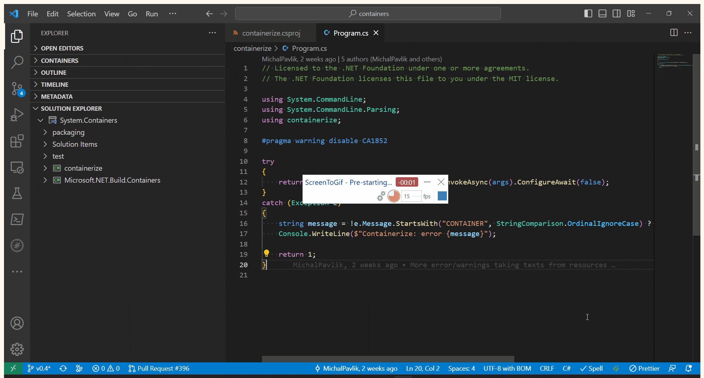
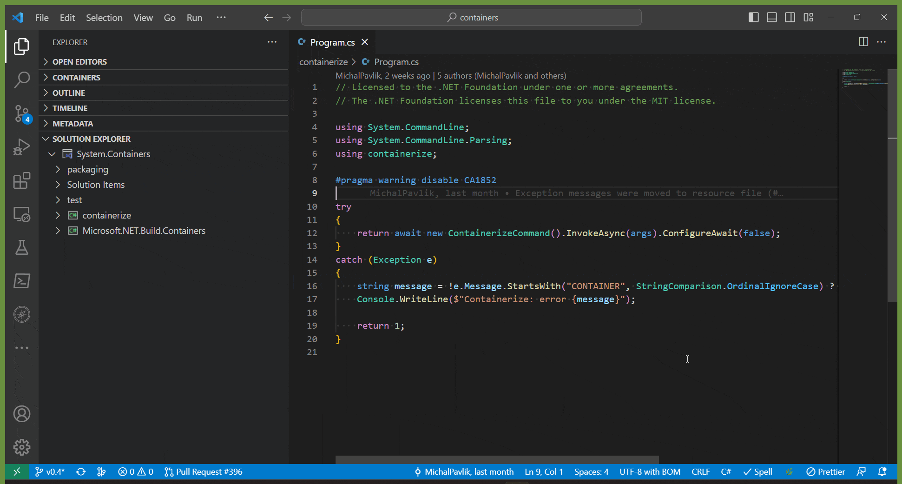

+++
title = "Build Tools"
date = 2024-01-12T22:36:24+08:00
weight = 70
type = "docs"
description = ""
isCJKLanguage = true
draft = false
+++

> 原文: [https://code.visualstudio.com/docs/csharp/build-tools](https://code.visualstudio.com/docs/csharp/build-tools)

# Build Tools 构建工具

This document is an overview of how to build your C# projects and solutions in the C# tools for Visual Studio Code. It covers the features provided by the [C# Dev Kit](https://marketplace.visualstudio.com/items?itemName=ms-dotnettools.csdevkit) extension.

​​​	此文档概述了如何在 Visual Studio Code 的 C# 工具中构建 C# 项目和解决方案。它涵盖了 C# Dev Kit 扩展提供的功能。

## [Building a solution 构建解决方案](https://code.visualstudio.com/docs/csharp/build-tools#_building-a-solution)

When a solution is loaded, the C# Dev Kit extension provides several tasks that operate on the solution and the projects contained in it. In addition to the ability to right-click and build on any solution or project in the Solution Explorer, you can build your entire solution using the `.NET: Build` command:

​​​	加载解决方案后，C# Dev Kit 扩展提供对解决方案及其包含的项目进行操作的若干任务。除了能够在解决方案资源管理器中对任何解决方案或项目右键单击并进行构建外，您还可以使用 `.NET: Build` 命令构建整个解决方案：

You can also build your solution using the Tasks feature of Visual Studio Code. C# Dev Kit integrates with the Task system and registers several tasks under the `dotnet` grouping. Here's what that looks like:

​​​	您还可以使用 Visual Studio Code 的任务功能构建解决方案。C# Dev Kit 与任务系统集成，并在 `dotnet` 分组下注册了若干任务。其外观如下：

The `build` task builds the open solution via the [dotnet build](https://learn.microsoft.com/dotnet/core/tools/dotnet-build) command, and the `clean` task cleans all solution outputs via the [dotnet clean](https://learn.microsoft.com/dotnet/core/tools/dotnet-clean) command.

​​​	 `build` 任务通过 dotnet build 命令构建打开的解决方案， `clean` 任务通过 dotnet clean 命令清除所有解决方案输出。

You can also `watch` specific projects with these tasks. Watching a project means looking at the project's files and rebuilding the project whenever those change. This is the same as running the [dotnet watch](https://learn.microsoft.com/dotnet/core/tools/dotnet-watch) command against the project directly, only integrated into your editor.

​​​	您还可以使用这些任务 `watch` 特定项目。监视项目意味着查看项目的源文件，并在这些文件发生更改时重新构建项目。这与直接对项目运行 dotnet watch 命令相同，只是集成到了您的编辑器中。

## [Managing project files 管理项目文件](https://code.visualstudio.com/docs/csharp/build-tools#_managing-project-files)

The project file is an extensible XML document that describes how your project should build. You can learn more about .NET Project files in the [.NET project SDKs documentation](https://learn.microsoft.com/dotnet/core/project-sdk/overview), but in general you modify your build by adding Properties (XML elements with inner values) and Items (XML elements with attributes).

​​​	项目文件是一个可扩展的 XML 文档，用于描述项目的构建方式。您可以在 .NET 项目 SDK 文档中了解有关 .NET 项目文件的更多信息，但通常您通过添加属性（具有内部值的 XML 元素）和项（具有属性的 XML 元素）来修改构建。

To add editor features like code completion for properties and items, syntax highlighting, and tooltips for common project properties, you can install the [MSBuild project tools](https://marketplace.visualstudio.com/items?itemName=tintoy.msbuild-project-tools) extension. Note that this extension is a community project and is not directly supported by Microsoft.

​​​	若要添加编辑器功能（如属性和项的代码完成功能、语法突出显示以及常见项目属性的工具提示），可以安装 MSBuild 项目工具扩展。请注意，此扩展是一个社区项目，Microsoft 不直接提供支持。
