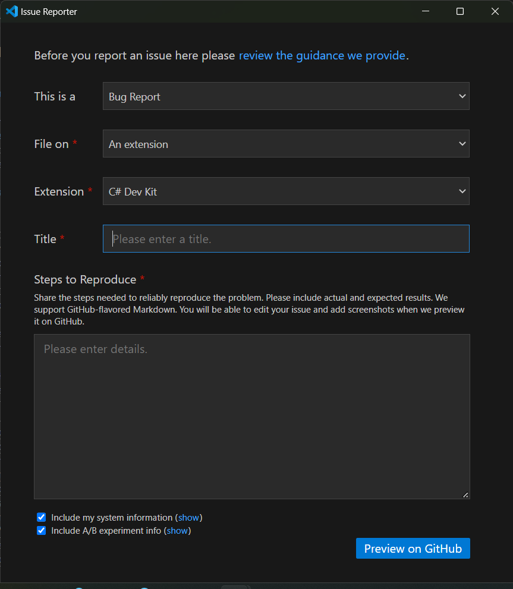
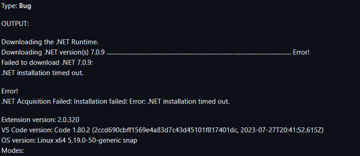
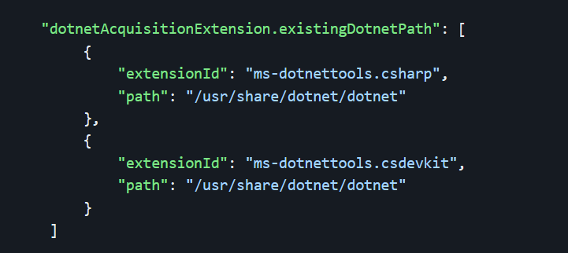
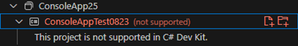
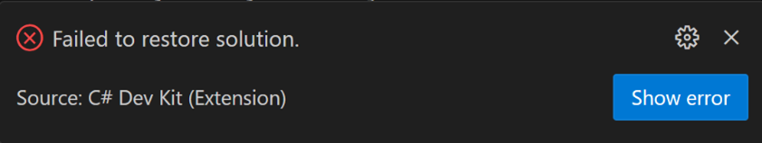
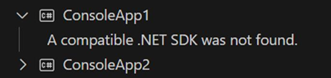
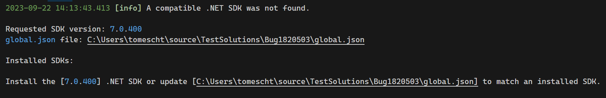
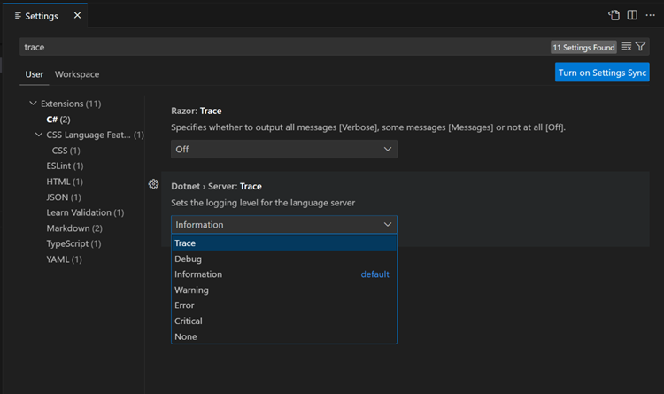
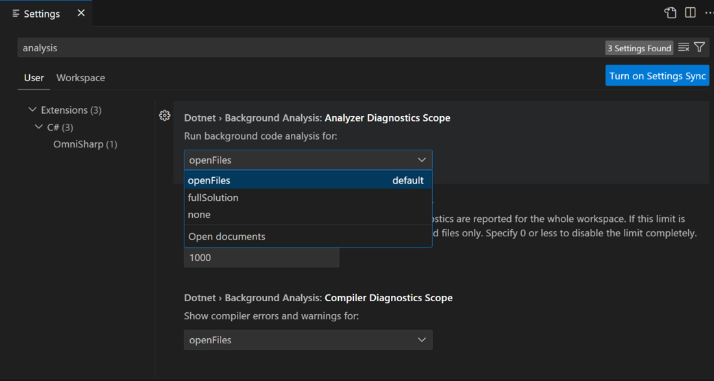
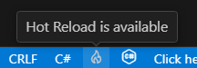

+++
title = "FAQ"
date = 2024-01-12T22:36:24+08:00
weight = 110
type = "docs"
description = ""
isCJKLanguage = true
draft = false
+++

> 原文: [https://code.visualstudio.com/docs/csharp/cs-dev-kit-faq](https://code.visualstudio.com/docs/csharp/cs-dev-kit-faq)

# C# Dev Kit FAQ C# 开发工具包常见问题解答


Use this FAQ (Frequently Asked Questions) topic to learn more about the C# Dev Kit extension and troubleshoot issues you may be experiencing.

​​​	使用此常见问题解答 (FAQ) 主题来详细了解 C# Dev Kit 扩展并对您可能遇到的问题进行故障排除。

## [General 常规](https://code.visualstudio.com/docs/csharp/cs-dev-kit-faq#_general)

### [What is C# Dev Kit? 什么是 C# Dev Kit？](https://code.visualstudio.com/docs/csharp/cs-dev-kit-faq#_what-is-c-dev-kit)

[C# Dev Kit](https://marketplace.visualstudio.com/items?itemName=ms-dotnettools.csdevkit) is an extension created to enhance your C# development experience in Visual Studio Code. It aims to bring a more expansive, productive, and reliable C# experience to VS Code. The Dev Kit does not replace the [existing C# extension](https://marketplace.visualstudio.com/items?itemName=ms-dotnettools.csharp) but adds on top of the great language service features it provides. Developers can choose to continue using the updated version of the existing C# extension or enhance their experience by adding the C# Dev Kit.

​​​	C# Dev Kit 是一个扩展，旨在增强您在 Visual Studio Code 中的 C# 开发体验。它旨在为 VS Code 带来越广泛、更高效和更可靠的 C# 体验。Dev Kit 不会取代现有的 C# 扩展，而是对其提供的出色语言服务功能进行补充。开发人员可以选择继续使用现有 C# 扩展的更新版本，或通过添加 C# Dev Kit 来增强其体验。

### [What project types are currently supported? 当前支持哪些项目类型？](https://code.visualstudio.com/docs/csharp/cs-dev-kit-faq#_what-project-types-are-currently-supported)

C# Dev Kit supports building web apps, console apps, class library projects, and test projects for .NET Core, often also called .NET. The [.NET MAUI extension](https://marketplace.visualstudio.com/items?itemName=ms-dotnettools.dotnet-maui) and the [Unity extension](https://marketplace.visualstudio.com/items?itemName=visualstudiotoolsforunity.vstuc) are built on top of C# Dev Kit and provide additional support for building [.NET Multi-platform App UI (MAUI)](https://dotnet.microsoft.com/apps/maui) apps and Unity apps. These extensions support the modern .NET project format, also known as "sdk-style" projects. If you are building non-SDK-format projects such as [.NET Framework](https://learn.microsoft.com/dotnet/standard/choosing-core-framework-server) apps and Xamarin apps, see the [Project System](https://code.visualstudio.com/docs/csharp/cs-dev-kit-faq#_project-system) section.

​​​	C# Dev Kit 支持构建 Web 应用、控制台应用、类库项目和 .NET Core（通常也称为 .NET）的测试项目。.NET MAUI 扩展和 Unity 扩展构建在 C# Dev Kit 之上，并为构建 .NET 多平台应用 UI (MAUI) 应用和 Unity 应用提供额外支持。这些扩展支持最新的 .NET 项目格式，也称为“sdk 样式”项目。如果您正在构建非 SDK 格式项目（如 .NET Framework 应用和 Xamarin 应用），请参阅项目系统部分。

### [What extensions are included in C# Dev Kit? C# Dev Kit 中包含哪些扩展？](https://code.visualstudio.com/docs/csharp/cs-dev-kit-faq#_what-extensions-are-included-in-c-dev-kit)

Today the extensions included in the C# Dev Kit family are:

​​​	目前 C# Dev Kit 系列中包含的扩展有：

- [C# Dev Kit](https://marketplace.visualstudio.com/items?itemName=ms-dotnettools.csdevkit)
- [IntelliCode for C# Dev Kit
  适用于 C# Dev Kit 的 IntelliCode](https://marketplace.visualstudio.com/items?itemName=ms-dotnettools.vscodeintellicode-csharp)
- [.NET MAUI](https://marketplace.visualstudio.com/items?itemName=ms-dotnettools.dotnet-maui)
- [Unity](https://aka.ms/vscode-unity)

Use of these extensions are governed under the [EULA for the C# Dev Kit family of extensions](https://aka.ms/vs/csdevkit/license).

​​​	这些扩展的使用受 C# Dev Kit 系列扩展的 EULA 管辖。

These extensions also have dependencies that carry their own licensing – for example, the C# Dev Kit extension depends on the [C# extension](https://marketplace.visualstudio.com/items?itemName=ms-dotnettools.csharp).

​​​	这些扩展还具有自己的许可证的依赖项，例如，C# Dev Kit 扩展依赖于 C# 扩展。

### [Who can use C# Dev Kit? 谁可以使用 C# Dev Kit？](https://code.visualstudio.com/docs/csharp/cs-dev-kit-faq#_who-can-use-c-dev-kit)

C# Dev Kit is available via a Community License for those who qualify and is also included as another addition to existing [Visual Studio Subscriptions](https://visualstudio.microsoft.com/subscriptions). This means that C# Dev Kit is available to use today for developers with active Visual Studio subscriptions.

​​​	C# Dev Kit 通过社区许可证提供给符合条件的人员，并且还作为现有 Visual Studio 订阅的另一项补充内容提供。这意味着拥有有效 Visual Studio 订阅的开发人员现在可以使用 C# Dev Kit。

For personal, academic, and open-source projects, the C# Dev Kit can be used at no cost. For commercial purposes, teams of up to 5 can also use the C# Dev Kit at no cost. For 6+ developers, those users will need a Visual Studio Professional (or higher) subscription. The C# Dev Kit is also included in GitHub Codespaces and Microsoft Dev Box, so users of those products have access to the C# Dev Kit at no additional charge.

​​​	对于个人、学术和开源项目，可以使用 C# Dev Kit，且无需付费。对于商业用途，最多 5 人的团队也可以免费使用 C# Dev Kit。对于 6 位及以上开发人员，这些用户需要 Visual Studio Professional（或更高版本）订阅。C# Dev Kit 还包含在 GitHub Codespaces 和 Microsoft Dev Box 中，因此这些产品的用户无需额外付费即可访问 C# Dev Kit。

### [Where do I submit feedback and suggestions? 我可以在哪里提交反馈和建议？](https://code.visualstudio.com/docs/csharp/cs-dev-kit-faq#_where-do-i-submit-feedback-and-suggestions)

Users can report an issue or a suggestion through VS Code's **Help > Report Issue**. Select whether it is a bug, feature request, or performance issue, file on **An extension**, and select **C# Dev Kit** from the list of extensions.

​​​	用户可以通过 VS Code 的“帮助”>“报告问题”报告问题或建议。选择是错误、功能请求还是性能问题，在扩展上归档，然后从扩展列表中选择 C# Dev Kit。



### [Is C# Dev Kit open source? Why not? C# Dev Kit 是开源的吗？为什么不是？](https://code.visualstudio.com/docs/csharp/cs-dev-kit-faq#_is-c-dev-kit-open-source-why-not)

No. C# Dev Kit is closed source but depends upon the C# for VS Code extension, which is open source, and both communicate with open-source components such as [Roslyn](https://github.com/dotnet/roslyn) and [Razor](https://github.com/dotnet/razor). One of our goals with C# Dev Kit is to provide an improved productivity experience for C# developers who use VS Code. To achieve this, C# Dev Kit includes some proprietary, closed-source features that are shared with our other tools. To make these experiences available to VS Code users, we needed to introduce C# Dev Kit as a closed source extension.

​​​	否。C# Dev Kit 是闭源的，但依赖于 C# for VS Code 扩展，后者是开源的，并且两者都与 Roslyn 和 Razor 等开源组件通信。我们使用 C# Dev Kit 的目标之一是为使用 VS Code 的 C# 开发人员提供改进的生产力体验。为了实现这一点，C# Dev Kit 包含一些专有闭源功能，这些功能与我们的其他工具共享。为了让 VS Code 用户可以使用这些体验，我们需要将 C# Dev Kit 引入为闭源扩展。

### [How can I contribute? 我可以如何做出贡献？](https://code.visualstudio.com/docs/csharp/cs-dev-kit-faq#_how-can-i-contribute)

The C# extension, which is a part of the C# Dev Kit, is fully open source and is subject to [these license terms](https://devdiv.visualstudio.com/DevDiv/_git/vscode-csharp-next?path=/RuntimeLicenses/license.txt). The source code to this extension is available on https://github.com/dotnet/vscode-csharp and licensed under the MIT license.

​​​	C# 扩展是 C# Dev Kit 的一部分，它是完全开源的，并受这些许可条款约束。此扩展的源代码可在 https://github.com/dotnet/vscode-csharp 上获得，并根据 MIT 许可证获得许可。

This project has adopted the code of conduct defined by the [Contributor Covenant](https://www.contributor-covenant.org/) to clarify expected behavior in our community. For more information, see the [.NET Foundation Code of Conduct](https://dotnetfoundation.org/about/policies/code-of-conduct). By signing the [CLA](https://cla.dotnetfoundation.org/), the community is free to use your contribution to .NET Foundation projects.

​​​	本项目采用了贡献者契约定义的行为准则，以明确我们社区中的预期行为。有关详细信息，请参阅 .NET Foundation 行为准则。通过签署 CLA，社区可以自由地将您的贡献用于 .NET Foundation 项目。

## [.NET SDK](https://code.visualstudio.com/docs/csharp/cs-dev-kit-faq#_net-sdk)

### [Install script timed out 安装脚本超时](https://code.visualstudio.com/docs/csharp/cs-dev-kit-faq#_install-script-timed-out)

Note that, depending on your network speed, installing the .NET Core runtime might take some time. By default, the installation terminates unsuccessfully if it takes longer than 4.5 minutes to finish. If you believe this is too little (or too much) time to allow for the download, you can change the timeout value by setting `dotnetAcquisitionExtension.installTimeoutValue` to a custom value.

​​​	请注意，根据您的网络速度，安装 .NET Core 运行时可能需要一些时间。默认情况下，如果安装完成花费的时间超过 4.5 分钟，则安装将终止并失败。如果您认为允许下载的时间太短（或太长），可以通过将 `dotnetAcquisitionExtension.installTimeoutValue` 设置为自定义值来更改超时值。

[Learn more about configuring VS Code settings](https://code.visualstudio.com/docs/getstarted/settings) and see below for an example of a custom timeout in a `settings.json` file. In this example, the custom timeout value is 180 seconds, or 3 minutes:

​​​	详细了解如何配置 VS Code 设置，并参阅以下内容以了解 `settings.json` 文件中的自定义超时示例。在此示例中，自定义超时值为 180 秒或 3 分钟：

```
{
  "dotnetAcquisitionExtension.installTimeoutValue": 180
}
```

### [Error acquiring .NET 7 获取 .NET 7 时出错](https://code.visualstudio.com/docs/csharp/cs-dev-kit-faq#_error-acquiring-net-7)



Note: If you are located in China, your .NET download may be blocked and cause a timeout.

​​​	注意：如果您位于中国，您的 .NET 下载可能会被阻止并导致超时。

You will need to make sure you have .NET 7 installed. As a workaround, you can point the .NET runtime acquisition extension to an existing .NET 7 install:

​​​	您需要确保已安装 .NET 7。作为解决方法，您可以将 .NET 运行时获取扩展指向现有的 .NET 7 安装：



### [How do I manually install .NET? 如何手动安装 .NET？](https://code.visualstudio.com/docs/csharp/cs-dev-kit-faq#_how-do-i-manually-install-net)

If .NET installation is failing or you want to reuse an existing installation of .NET, you can use the `dotnetAcquisitionExtension.existingDotnetPath` setting. .NET can be manually installed from the [.NET website](https://dotnet.microsoft.com/download). To direct the extension to that installation, update your settings with the extension ID and the path as illustrated below:

​​​	如果 .NET 安装失败或您想重复使用现有的 .NET 安装，您可以使用 `dotnetAcquisitionExtension.existingDotnetPath` 设置。可以从 .NET 网站手动安装 .NET。若要将扩展定向到该安装，请使用扩展 ID 和路径更新您的设置，如下所示：

#### [Windows](https://code.visualstudio.com/docs/csharp/cs-dev-kit-faq#_windows)

```
{
  "dotnetAcquisitionExtension.existingDotnetPath": [
    {
      "extensionId": "msazuretools.azurerm-vscode-tools",
      "path": "C\\Program Files\\dotnet\\dotnet.exe"
    }
  ]
}
```

#### [macOS](https://code.visualstudio.com/docs/csharp/cs-dev-kit-faq#_macos)

```
{
  "dotnetAcquisitionExtension.existingDotnetPath": [
    {
      "extensionId": "msazuretools.azurerm-vscode-tools",
      "path": "/usr/local/share/dotnet/dotnet"
    }
  ]
}
```

### [The extension thinks I am offline with error response of 400 or 407, and I have a proxy 扩展认为我处于脱机状态，错误响应为 400 或 407，并且我有一个代理](https://code.visualstudio.com/docs/csharp/cs-dev-kit-faq#_the-extension-thinks-i-am-offline-with-error-response-of-400-or-407-and-i-have-a-proxy)

If your system uses a proxy and has registry access disabled, you need to explicitly set the proxy URL in the extension settings. Proxies are automatically detected when set via environment variables and the registry, but if your proxy is only managed via registry keys and registry access is disabled, the extension cannot find it. To set the proxy URL, add the extension setting below:

​​​	如果您的系统使用代理并且禁用了注册表访问，则需要在扩展设置中明确设置代理 URL。通过环境变量和注册表设置时会自动检测代理，但如果您的代理仅通过注册表项管理并且禁用了注册表访问，则扩展找不到它。若要设置代理 URL，请添加以下扩展设置：

```
{
  "dotnetAcquisitionExtension.proxyUrl": "https://your_proxy_url:port"
}
```

## [Project System 项目系统](https://code.visualstudio.com/docs/csharp/cs-dev-kit-faq#_project-system)

### [The Solution Explorer reports that my project is not supported in C# Dev Kit 解决方案资源管理器报告我的项目在 C# Dev Kit 中不受支持](https://code.visualstudio.com/docs/csharp/cs-dev-kit-faq#_the-solution-explorer-reports-that-my-project-is-not-supported-in-c-dev-kit)

This is usually because the project targets .NET Framework rather than .NET Core/.NET. At this time, C# Dev Kit does not support .NET Framework projects.

​​​	这通常是因为项目面向 .NET Framework，而不是 .NET Core/.NET。目前，C# Dev Kit 不支持 .NET Framework 项目。



To resolve this issue, you have two options.

​​​	要解决此问题，您有两个选择。

You can [update your project](https://learn.microsoft.com/dotnet/core/porting) to an SDK-style project to access all available C# Dev Kit features.

​​​	您可以将项目更新为 SDK 样式项目，以访问所有可用的 C# Dev Kit 功能。

Alternatively, you can delegate project and solution load to the [C# extension](https://marketplace.visualstudio.com/items?itemName=ms-dotnettools.csharp), using the **Prefer CSharp Extension** workspace setting in the Settings editor. Keep in mind that some C# Dev Kit features will not be available with this setting. To access this setting, go to the Settings editor and select the **Workspace** tab. Then, search for "Prefer CSharp" in the search bar and check the box next to the **Prefer CSharp Extension** setting. If you're trying to load a .NET Framework project, C# Dev Kit will automatically display a notification asking you to either update your project to an SDK-style project or have the C# extension load your project or solution by selecting **Use C# Extension** from the notification. This option will automatically select the **Prefer CSharp Extension** setting. Note that you'll need to reload VS Code for this setting to take effect.

​​​	或者，您可以使用“设置”编辑器中的“首选 CSharp 扩展”工作区设置，将项目和解决方案加载委托给 C# 扩展。请记住，启用此设置后，某些 C# Dev Kit 功能将不可用。若要访问此设置，请转到“设置”编辑器并选择“工作区”选项卡。然后，在搜索栏中搜索“首选 CSharp”，然后选中“首选 CSharp 扩展”设置旁边的框。如果您尝试加载 .NET Framework 项目，C# Dev Kit 会自动显示一条通知，询问您是要将项目更新为 SDK 样式项目，还是要通过从通知中选择“使用 C# 扩展”让 C# 扩展加载您的项目或解决方案。此选项会自动选择“首选 CSharp 扩展”设置。请注意，您需要重新加载 VS Code 才能使此设置生效。

### [I clicked on the "Create .NET Project" button and nothing happened 我单击了“创建 .NET 项目”按钮，但没有任何反应](https://code.visualstudio.com/docs/csharp/cs-dev-kit-faq#_i-clicked-on-the-create-net-project-button-and-nothing-happened)

This usually occurs when there is an extension version mismatch. C# Dev Kit requires version 2.0 or greater of the [C# extension](https://marketplace.visualstudio.com/items?itemName=ms-dotnettools.csharp). If you are on v1 of the C# extension, C# Dev Kit, and the C# Dev Kit related commands will not work properly. To fix this, upgrade the C# extension to the latest version.

​​​	这通常发生在扩展版本不匹配时。C# Dev Kit 需要 C# 扩展的 2.0 或更高版本。如果您使用的是 C# 扩展的 v1，C# Dev Kit 和 C# Dev Kit 相关命令将无法正常工作。要解决此问题，请将 C# 扩展升级到最新版本。

### [The Project System reports that it ran into a problem 项目系统报告遇到问题](https://code.visualstudio.com/docs/csharp/cs-dev-kit-faq#_the-project-system-reports-that-it-ran-into-a-problem)

When an internal Project System error occurs, you'll generally see a notification like this pop up in a corner of VS Code:

​​​	当发生内部项目系统错误时，您通常会看到此类通知弹出在 VS Code 的某个角落：



Select the **Open log** button to open a view showing a stack trace of where the problem occurred. Select and copy all the text in the log. Report the issue through VS Code and make sure to include the copied text from the log.

​​​	选择“打开日志”按钮以打开一个视图，其中显示问题发生位置的堆栈跟踪。选择并复制日志中的所有文本。通过 VS Code 报告问题，并确保包含从日志中复制的文本。

### [When I open my solution, I get the notification "Failed to restore solution" 当我打开解决方案时，我收到通知“未能还原解决方案”](https://code.visualstudio.com/docs/csharp/cs-dev-kit-faq#_when-i-open-my-solution-i-get-the-notification-failed-to-restore-solution)

Select **Show error**. This opens the Output panel for NuGet. Read through the error to determine why the package restore was unable to complete. If you are unable to resolve the problem, report the issue through VS Code.

​​​	选择“显示错误”。这将打开 NuGet 的“输出”面板。仔细阅读错误以确定为什么无法完成包还原。如果您无法解决问题，请通过 VS Code 报告问题。

### [The Solution Explorer displays "A compatible .NET SDK was not found" 解决方案资源管理器显示“未找到兼容的 .NET SDK”](https://code.visualstudio.com/docs/csharp/cs-dev-kit-faq#_the-solution-explorer-displays-a-compatible-net-sdk-was-not-found)

The most likely cause of this error is a `global.json` file that specifies a different SDK than what is installed on the system.

​​​	此错误最可能的原因是 `global.json` 文件指定了与系统上安装的 SDK 不同的 SDK。



Open the Output window and switch to the **Projects** pane to look for more information. You should see something like this:

​​​	打开输出窗口并切换到项目窗格以查找更多信息。您应该会看到类似以下内容：



To fix the issue, either update the `global.json` to specify an installed SDK or install the specified SDK from the [Download .NET](https://aka.ms/dotnet/download) page.

​​​	要修复此问题，请更新 `global.json` 以指定已安装的 SDK，或从下载 .NET 页面安装指定的 SDK。

Next, close and reopen the workspace.

​​​	接下来，关闭并重新打开工作区。

It is also possible that the SDK is not installed in a location known to C# Dev Kit. This can happen, for example, if the SDK was installed by a package manager rather than through the Microsoft-provided installers. To fix this, uninstall the SDK via the package manager, and then install it via [Download .NET](https://aka.ms/dotnet/download).

​​​	SDK 也有可能未安装在 C# Dev Kit 已知的位置。例如，如果 SDK 是由包管理器而不是通过 Microsoft 提供的安装程序安装的，则可能会发生这种情况。要解决此问题，请通过包管理器卸载 SDK，然后通过下载 .NET 安装它。

## [Test Explorer 测试资源管理器](https://code.visualstudio.com/docs/csharp/cs-dev-kit-faq#_test-explorer)

### [Why don't my tests appear in the Test Explorer panel? 为什么我的测试未显示在测试资源管理器面板中？](https://code.visualstudio.com/docs/csharp/cs-dev-kit-faq#_why-dont-my-tests-appear-in-the-test-explorer-panel)

Make sure your solution includes a test project. Only test projects that are part of the opened solution will be included. To see if the test project is part of the solution, open the Solution Explorer view in the File Explorer and see if the project appears in the tree. Right-click on the solution node to add existing test projects, or to create a new test project in the solution.

​​​	确保您的解决方案包含一个测试项目。只有作为已打开解决方案一部分的测试项目才会包含在内。若要查看测试项目是否属于解决方案的一部分，请在文件资源管理器中打开解决方案资源管理器视图，并查看该项目是否显示在树中。右键单击解决方案节点以添加现有测试项目，或在解决方案中创建新的测试项目。

C# Dev Kit also requires that it has built your project successfully before tests appear in the Test Explorer panel. Also, if a **Clean** is done on your project/solution, the test dlls are removed from the Test Explorer panel.

​​​	C# Dev Kit 还要求在测试出现在测试资源管理器面板中之前成功构建了项目。此外，如果对项目/解决方案执行了清理，则测试 dll 将从测试资源管理器面板中删除。

Once you have validated that your test project is part of the solution, build your solution by right-clicking on the solution in the Solution Explorer and select **Build** or use Ctrl+Shift+B. Once the build has been completed, your tests will appear in the Test Explorer panel.

​​​	验证测试项目是解决方案的一部分后，通过在解决方案资源管理器中右键单击解决方案并选择“生成”或使用 Ctrl+Shift+B 来构建解决方案。构建完成后，测试将出现在测试资源管理器面板中。

### [My tests appear in the Test Explorer panel, but I cannot debug them 我的测试出现在测试资源管理器面板中，但我无法调试它们](https://code.visualstudio.com/docs/csharp/cs-dev-kit-faq#_my-tests-appear-in-the-test-explorer-panel-but-i-cannot-debug-them)

Make sure that your tests are targeting NET Core. C# Dev Kit does not support .NET Framework projects, although .NET Framework projects may load and appear to work. The debugger in VS Code does not support .NET Framework.

​​​	确保测试针对的是 NET Core。C# Dev Kit 不支持 .NET Framework 项目，尽管 .NET Framework 项目可能会加载并显示为正在工作。VS Code 中的调试器不支持 .NET Framework。

### [I just added new tests to my test project, and they are not appearing in the Test Explorer panel? 我刚刚向测试项目添加了新测试，但它们未出现在测试资源管理器面板中？](https://code.visualstudio.com/docs/csharp/cs-dev-kit-faq#_i-just-added-new-tests-to-my-test-project-and-they-are-not-appearing-in-the-test-explorer-panel)

C# Dev Kit requires that it has built your project successfully before tests will appear in the Test Explorer panel.

​​​	C# Dev Kit 要求在测试出现在测试资源管理器面板中之前成功构建了项目。

Build your solution by right-clicking on the solution in the Solution Explorer and select **Build** or Ctrl+Shift+B. Once the build has been completed, your tests will appear in the Test Explorer panel.

​​​	通过在解决方案资源管理器中右键单击解决方案并选择“生成”或 Ctrl+Shift+B 来构建解决方案。构建完成后，测试将出现在测试资源管理器面板中。

## [Debugger 调试器](https://code.visualstudio.com/docs/csharp/cs-dev-kit-faq#_debugger)

### [When I F5, nothing happens 按 F5 时，没有任何反应](https://code.visualstudio.com/docs/csharp/cs-dev-kit-faq#_when-i-f5-nothing-happens)

Make sure you have a C# project open or that the active document is a `.cs` or `.razor` file. If the debugger still fails to load, make sure that both the C# Dev Kit and the C# extensions have been activated.

​​​	确保已打开 C# 项目或活动文档是 `.cs` 或 `.razor` 文件。如果调试器仍无法加载，请确保已激活 C# Dev Kit 和 C# 扩展。

### [When I F5, it asks me to "Select a Debugger". How do I know which one to pick? 按 F5 时，系统提示我“选择调试器”。我如何知道选择哪一个？](https://code.visualstudio.com/docs/csharp/cs-dev-kit-faq#_when-i-f5-it-asks-me-to-select-a-debugger-how-do-i-know-which-one-to-pick)

If you're trying to debug .NET Console Applications, Blazor Server Apps, Blazor WebAssembly, or Web Applications, make sure to select the **C#** option. The other options may be part of other extensions such as **Node** for JavaScript debugging or **Python** for Python debugging, and are not part of C# Dev Kit.

​​​	如果您尝试调试 .NET 控制台应用程序、Blazor Server 应用、Blazor WebAssembly 或 Web 应用程序，请务必选择 C# 选项。其他选项可能是其他扩展的一部分，例如用于 JavaScript 调试的 Node 或用于 Python 调试的 Python，不属于 C# Dev Kit。

### [Why is debugging not working? 为什么调试不起作用？](https://code.visualstudio.com/docs/csharp/cs-dev-kit-faq#_why-is-debugging-not-working)

If you're trying to debug a library or a test project, it's likely that you'll need to take some extra steps to ensure that your code is properly debugged. To debug a library, you can create a console or web application that interacts with the library. For a test project, you can use the Test Explorer to debug your code effectively.

​​​	如果您尝试调试库或测试项目，则可能需要采取一些额外的步骤来确保正确调试代码。若要调试库，可以创建一个与库交互的控制台或 Web 应用程序。对于测试项目，可以使用测试资源管理器有效地调试代码。

### [While debugging, my breakpoints aren't binding 调试时，我的断点未绑定](https://code.visualstudio.com/docs/csharp/cs-dev-kit-faq#_while-debugging-my-breakpoints-arent-binding)

The process you're debugging is not built in Debug, make sure to build as debugging before debugging the process.

​​​	您正在调试的进程未在调试模式下构建，请务必在调试进程之前构建为调试模式。

## [C# Editor C# 编辑器](https://code.visualstudio.com/docs/csharp/cs-dev-kit-faq#_c-editor)

### [How do I get IntelliSense to work correctly? 如何让 IntelliSense 正确工作？](https://code.visualstudio.com/docs/csharp/cs-dev-kit-faq#_how-do-i-get-intellisense-to-work-correctly)

Make sure that you have a project or solution open. If you have multiple solutions, the extension will automatically open one or prompt you to open one. Next, search for "Trace" in the Settings search bar, and set the **Dotnet** > **Server:** to **Trace** from the drop-down. This option provides more output information to help the developer team diagnose the issue.

​​​	确保您已打开项目或解决方案。如果您有多个解决方案，扩展程序会自动打开一个或提示您打开一个。接下来，在“设置”搜索栏中搜索“跟踪”，然后从下拉菜单中将“Dotnet > 服务器:”设置为“跟踪”。此选项提供更多输出信息，以帮助开发团队诊断问题。



Once you've made this change, reload the window by opening the Command Palette (Ctrl+Shift+P), then typing "Reload Window" and pressing Enter. After reloading the window, check the project log in the Output panel (Ctrl+Shift+U) and selecting **Projects** from the drop-down. This will show any errors related to your project not being fully loaded. Copy all the text in the Output panel and report the issue through VS Code, making sure to include the copied text.

​​​	完成此更改后，通过打开命令面板（Ctrl+Shift+P），然后键入“重新加载窗口”并按 Enter，重新加载窗口。重新加载窗口后，检查“输出”面板（Ctrl+Shift+U）中的项目日志，并从下拉菜单中选择“项目”。这将显示与项目未完全加载相关的任何错误。复制“输出”面板中的所有文本，并通过 VS Code 报告问题，确保包括复制的文本。

### [C# extension fails to launch the server C# 扩展程序无法启动服务器](https://code.visualstudio.com/docs/csharp/cs-dev-kit-faq#_c-extension-fails-to-launch-the-server)

As a workaround, you can point the .NET runtime acquisition extension to an existing .NET 7 install with the `dotnetAcquisitionExtension.existingDotnetPath` setting:

​​​	作为一种解决方法，您可以使用 `dotnetAcquisitionExtension.existingDotnetPath` 设置将 .NET 运行时获取扩展程序指向现有的 .NET 7 安装：

```
{
  "dotnetAcquisitionExtension.existingDotnetPath": [
    {
      "extensionId": "msazuretools.azurerm-vscode-tools",
      "path": "C\\Program Files\\dotnet\\dotnet.exe"
    }
  ]
}
```

### [I have too many diagnostics or I don't have enough diagnostics 我有太多诊断或我没有足够的诊断](https://code.visualstudio.com/docs/csharp/cs-dev-kit-faq#_i-have-too-many-diagnostics-or-i-dont-have-enough-diagnostics)

The [C# extension](https://marketplace.visualstudio.com/items?itemName=ms-dotnettools.csharp) allows you to configure various background code analysis settings. To access the settings, go to **File** > **Preferences** > **Settings** or use the keyboard shortcut (Ctrl+,). In the search bar, type "analysis" to narrow down the settings related to code analysis. Under **Run background code analysis for:**, you can choose the analysis scope from a drop-down menu. The default setting is to analyze open files, but you can customize it to full solution, none, or open documents.

​​​	C# 扩展允许您配置各种后台代码分析设置。若要访问这些设置，请转到“文件”>“首选项”>“设置”或使用键盘快捷键 (Ctrl+,)。在搜索栏中，键入“分析”以缩小与代码分析相关的设置范围。在“针对以下内容运行后台代码分析：”下，您可以从下拉菜单中选择分析范围。默认设置是分析打开的文件，但您可以将其自定义为完整解决方案、无或打开的文档。



You can also use an EditorConfig file to configure diagnostics and code analysis. To learn more about EditorConfig, check out the [documentation](https://learn.microsoft.com/dotnet/fundamentals/code-analysis/code-style-rule-options).

​​​	您还可以使用 EditorConfig 文件来配置诊断和代码分析。若要详细了解 EditorConfig，请查看文档。

If you're not seeing enough diagnostics or none at all, it's possible that your project isn't fully loaded. To check if this is the case, refer to the section [How do I get IntelliSense to work correctly?](https://code.visualstudio.com/docs/csharp/cs-dev-kit-faq#_how-do-i-get-intellisense-to-work-correctly) It provides instructions on how to verify if your project is fully loaded.

​​​	如果您没有看到足够的诊断或根本没有看到诊断，则可能是您的项目未完全加载。若要检查是否如此，请参阅“如何让 IntelliSense 正常工作？”一节。它提供了有关如何验证您的项目是否已完全加载的说明。

## [Razor Editor Razor 编辑器](https://code.visualstudio.com/docs/csharp/cs-dev-kit-faq#_razor-editor)

### [Most or all Blazor components show up with warnings 大多数或所有 Blazor 组件都显示警告](https://code.visualstudio.com/docs/csharp/cs-dev-kit-faq#_most-or-all-blazor-components-show-up-with-warnings)

Before Blazor components can be discovered, C# Dev Kit needs to load your project successfully. Additionally, the Razor language server requires a `project.razor.vscode.json` file to be generated in order to understand the state of your projects. If this file isn't generated, or is generated without any components, the Razor experience may be affected.

​​​	在 Blazor 组件被发现之前，C# Dev Kit 需要成功加载您的项目。此外，Razor 语言服务器需要生成一个 `project.razor.vscode.json` 文件，以便了解项目的状况。如果未生成此文件，或在未包含任何组件的情况下生成此文件，则 Razor 体验可能会受到影响。

To improve performance, the extension sometimes defers generating or loading this file until you open your first `.razor` or `.cshtml` file. To ensure that there are no errors in the Solution Explorer for the project you're trying to use, check it carefully.

​​​	为了提高性能，该扩展有时会延迟生成或加载此文件，直到您打开第一个 `.razor` 或 `.cshtml` 文件。为了确保您尝试使用的项目的解决方案资源管理器中没有错误，请仔细检查它。

If your project has loaded correctly, verify that a `project.razor.vscode.json` file exists in the `obj\Debug\<tfm>` folder on your file system. In that file, make sure that there isn't an empty array of `TagHelpers`.

​​​	如果您的项目已正确加载，请验证 `obj\Debug\<tfm>` 文件夹的文件系统中是否存在 `project.razor.vscode.json` 文件。在该文件中，确保没有 `TagHelpers` 的空数组。

To force the file to regenerate, close any open `.razor` or `.cshtml` files, reload the VS Code window, and once the project has loaded correctly, open any `.razor` or `.cshtml` file to trigger the regeneration process.

​​​	要强制重新生成文件，请关闭任何打开的 `.razor` 或 `.cshtml` 文件，重新加载 VS Code 窗口，并在项目正确加载后，打开任何 `.razor` 或 `.cshtml` 文件以触发重新生成过程。

### [Target framework errors are mentioned in Razor files 目标框架错误在 Razor 文件中提及](https://code.visualstudio.com/docs/csharp/cs-dev-kit-faq#_target-framework-errors-are-mentioned-in-razor-files)

The Razor language server generally does not have a concept of a "solution", but instead loads projects based on the presence of a `project.razor.vscode.json` file in the projects `obj\Debug\<tfm>` folder. Sometimes, old files from target frameworks that are no longer in use can cause confusion, making the Razor server think a project is multi-targeted or that some components are still referenced when they're not.

​​​	Razor 语言服务器通常没有“解决方案”的概念，而是根据项目 `obj\Debug\<tfm>` 文件夹中是否存在 `project.razor.vscode.json` 文件来加载项目。有时，不再使用的目标框架中的旧文件可能会导致混淆，使 Razor 服务器认为某个项目是多目标的，或者某些组件在不再被引用时仍然被引用。

To resolve this issue, clear out old folders from within the `obj` folder or clear all of them. Then, reload the VS Code window and open a `.razor` file. This should ensure that new JSON files are generated, and the old ones are removed.

​​​	要解决此问题，请清除 `obj` 文件夹中或全部清除旧文件夹。然后，重新加载 VS Code 窗口并打开 `.razor` 文件。这应确保生成新的 JSON 文件，并删除旧文件。

## [IntelliCode](https://code.visualstudio.com/docs/csharp/cs-dev-kit-faq#_intellicode)

### [I am not getting whole line completions 我没有获得整行补全](https://code.visualstudio.com/docs/csharp/cs-dev-kit-faq#_i-am-not-getting-whole-line-completions)

Whole line completions are disabled when the [GitHub Copilot](https://marketplace.visualstudio.com/items?itemName=GitHub.copilot) extension is enabled to allow you to take advantage of the more advanced [AI completion](https://code.visualstudio.com/docs/editor/github-copilot) capabilities. You can verify that Copilot is enabled by checking if the Copilot logo is present in the lower right corner of VS Code.

​​​	在启用 GitHub Copilot 扩展时，整行补全功能被禁用，以便您可以利用更高级的 AI 补全功能。您可以通过检查 VS Code 右下角是否存在 Copilot 徽标来验证是否启用了 Copilot。

## [Hot Reload 热重载](https://code.visualstudio.com/docs/csharp/cs-dev-kit-faq#_hot-reload)

### [Hot Reload icon not appearing after I started debugging 开始调试后热重载图标未出现](https://code.visualstudio.com/docs/csharp/cs-dev-kit-faq#_hot-reload-icon-not-appearing-after-i-started-debugging)

The debugger only starts a Hot Reload session if the option for Hot Reload is enabled in the C# Dev Kit [debugger settings](https://code.visualstudio.com/docs/csharp/debugging#_user-settings). If the option is enabled, it is expected that the Hot Reload icon appears in the status bar while debugging:

​​​	只有在 C# Dev Kit 调试器设置中启用了热重载选项时，调试器才会启动热重载会话。如果启用了该选项，则在调试时，状态栏中应会显示热重载图标：



You can either click on the Hot Reload icon or can see diagnostic information by opening the **C# Hot Reload** Output window. If you don't see either of those, the project may not be supported by C# Dev Kit extension, see [Hot Reload supported projects](https://code.visualstudio.com/docs/csharp/debugging#_supported-projects-and-scenarios).

​​​	您可以单击热重载图标，也可以通过打开 C# 热重载输出窗口来查看诊断信息。如果您看不到这些内容，则该项目可能不受 C# Dev Kit 扩展支持，请参阅热重载支持的项目。

### [What types of edits are supported with Hot Reload? 热重载支持哪些类型的编辑？](https://code.visualstudio.com/docs/csharp/cs-dev-kit-faq#_what-types-of-edits-are-supported-with-hot-reload)

See [Supported code changes](https://learn.microsoft.com/visualstudio/debugger/supported-code-changes-csharp?view=vs-2022) for a list of the supported C# code changes with Hot Reload.

​​​	有关热重载支持的 C# 代码更改列表，请参阅支持的代码更改。
