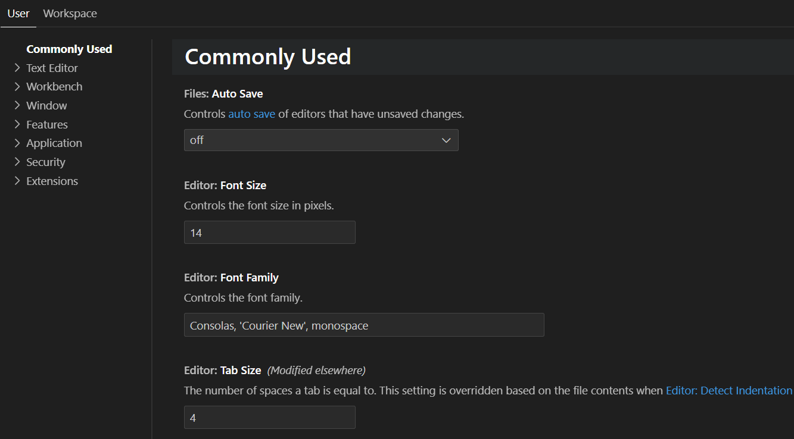
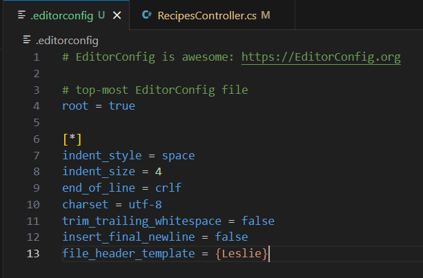

+++
title = "Formatting and Linting"
date = 2024-01-12T22:36:24+08:00
weight = 50
type = "docs"
description = ""
isCJKLanguage = true
draft = false
+++

> 原文: [https://code.visualstudio.com/docs/csharp/formatting-linting](https://code.visualstudio.com/docs/csharp/formatting-linting)

# Formatting and Linting 格式化和 Linting

You can format your C# source code using the [C# Dev Kit extension](https://marketplace.visualstudio.com/items?itemName=ms-dotnettools.csdevkit), a lightweight extension to enhance your C# development experience in Visual Studio Code.

​​​	您可以使用 C# Dev Kit 扩展来格式化 C# 源代码，这是一个轻量级扩展，可增强您在 Visual Studio Code 中的 C# 开发体验。

Navigate to **File** > **Preferences** > **Settings** (Ctrl+,) to customize how your `.cs` files are formatted. The Settings editor gives you a list of different formatting options (particularly under **Commonly Used** and **Text Editor**) that you can adjust across your specific workspace or your entire user profile.

​​​	导航到“文件”>“首选项”>“设置”(Ctrl+,)，以自定义格式化 `.cs` 文件的方式。设置编辑器会提供一个不同的格式化选项列表（尤其是在“常用”和“文本编辑器”下），您可以在特定工作区或整个用户配置文件中调整这些选项。

## [How to support EditorConfig with C# Dev Kit 如何使用 C# Dev Kit 支持 EditorConfig]()

**EditorConfig (.editorconfig) files** are supported with the [EditorConfig for VS Code extension](https://marketplace.visualstudio.com/items?itemName=EditorConfig.EditorConfig), letting you customize formatting options in your C# project. These files are also used to override the user/workspace settings with the settings you specify in them.

​​​	EditorConfig（.editorconfig）文件受 VS Code 的 EditorConfig 扩展支持，使您能够自定义 C# 项目中的格式化选项。这些文件还用于使用您在其中指定的设置来覆盖用户/工作区设置。

### Was this documentation helpful?
