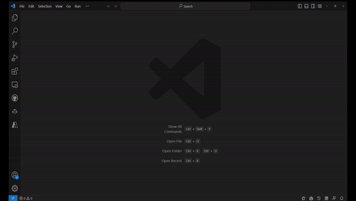

+++
title = "Get Started"
date = 2024-01-12T22:36:24+08:00
weight = 10
type = "docs"
description = ""
isCJKLanguage = true
draft = false
+++

> 原文: [https://code.visualstudio.com/docs/csharp/get-started](https://code.visualstudio.com/docs/csharp/get-started)

# Getting Started with C# in VS Code 在 VS Code 中开始使用 C#


This getting started guide introduces you to C# and .NET for Visual Studio Code through the following tasks:
本入门指南通过以下任务向您介绍适用于 Visual Studio Code 的 C# 和 .NET：

1. Installing and setting up your VS Code environment for C#.
   为 C# 安装和设置 VS Code 环境。
2. Writing and running a simple "Hello World" application using C#.
   使用 C# 编写并运行简单的“Hello World”应用程序。
3. Introduce you to other learning resources for C# in VS Code.
   向您介绍 VS Code 中 C# 的其他学习资源。

Keep in mind, that this guide won't teach you C#. Instead, it teaches you how to get set up for C# development in VS Code. If you're looking for resources to learn C#, check out our C# curriculum.
请记住，本指南不会教您 C#。相反，它教您如何在 VS Code 中为 C# 开发做好准备。如果您正在寻找学习 C# 的资源，请查看我们的 C# 课程。

[Learn C# Curriculum
学习 C# 课程](https://aka.ms/selfguidedcsharp)

## [Necessary tools 必要的工具]()

- [Visual Studio Code](https://code.visualstudio.com/)
- [C# Dev Kit](https://marketplace.visualstudio.com/items?itemName=ms-dotnettools.csdevkit) extension
  C# Dev Kit 扩展
- For .NET Development, the [.NET SDK](https://dotnet.microsoft.com/download)
  对于 .NET 开发，.NET SDK

## [Install 安装]()

### [Installing VS Code and extensions 安装 VS Code 和扩展]()

1. If you haven't already done so, [install VS Code](https://code.visualstudio.com/).
   如果您尚未执行此操作，请安装 VS Code。
2. Next, install [C# Dev Kit](https://marketplace.visualstudio.com/items?itemName=ms-dotnettools.csdevkit) from the Visual Studio Marketplace. For additional details on installing extensions, read [Extension Marketplace](). The C# extension is called **C# Dev Kit** and it's published by Microsoft.
   接下来，从 Visual Studio Marketplace 安装 C# Dev Kit。有关安装扩展的更多详细信息，请阅读扩展 Marketplace。C# 扩展名为 C# Dev Kit，由 Microsoft 发布。

> **Note**: C# Dev Kit supports cloud native development. To do cross-platform mobile and desktop development, you can use C# Dev Kit with the [.NET MAUI extension](https://aka.ms/mauidevkit-marketplace). Learn [how to get set up](https://aka.ms/mauidevkit-docs) with .NET MAUI in VS Code.
> 注意：C# Dev Kit 支持云原生开发。若要进行跨平台移动和桌面开发，您可以将 C# Dev Kit 与 .NET MAUI 扩展结合使用。了解如何在 VS Code 中设置 .NET MAUI。

Upon installation, C# Dev Kit launches an extension walkthrough. You can follow the steps of this walkthrough to learn more about the features of the C# extension. Reopen the walkthrough at any time by opening the Command Palette (Ctrl+Shift+P) and selecting **Welcome: Open Walkthrough**. Here, select **Get Started with C# Dev Kit**.
安装后，C# Dev Kit 将启动扩展演练。您可以按照此演练的步骤了解有关 C# 扩展的功能的更多信息。随时通过打开命令面板 (Ctrl+Shift+P) 并选择欢迎：打开演练来重新打开演练。在此处，选择开始使用 C# Dev Kit。



> **Note**: You are required to sign in to a Visual Studio subscription to use C# Dev Kit. Check out the [Signing in to C# Dev Kit](https://code.visualstudio.com/docs/csharp/signing-in) documentation to learn more.
> 注意：您需要登录 Visual Studio 订阅才能使用 C# Dev Kit。查看登录到 C# Dev Kit 文档以了解更多信息。

### [Installing the .NET Coding Pack for students 为学生安装 .NET 编码包]()

If you're a student, we recommend installing the **.NET Coding Pack** for an easier setup experience. The Coding Pack includes VS Code, the .NET SDK, and essential .NET extensions. The Coding Pack can be used as a clean installation, or to update or repair an existing development environment.
如果您是学生，我们建议安装 .NET Coding Pack 以获得更轻松的设置体验。Coding Pack 包括 VS Code、.NET SDK 和必要的 .NET 扩展。Coding Pack 可用作全新安装，或用于更新或修复现有开发环境。

[Install the .NET Coding Pack - Windows
安装 .NET Coding Pack - Windows](https://aka.ms/dotnet-coding-pack-win)

[Install the .NET Coding Pack - macOS
安装 .NET Coding Pack - macOS](https://aka.ms/dotnet-coding-pack-mac)

> **Note**: The .NET Coding Pack is only available for Windows and macOS. For other operating systems, you need to manually install the .NET SDK, VS Code, and .NET extensions.
> 注意：.NET Coding Pack 仅适用于 Windows 和 macOS。对于其他操作系统，您需要手动安装 .NET SDK、VS Code 和 .NET 扩展。

## [Open folder 打开文件夹]()

By starting VS Code in a folder, that folder becomes your "workspace". VS Code stores [settings]() that are specific to that workspace in `.vscode/settings.json`, which are separate from user settings that are stored globally.
通过在文件夹中启动 VS Code，该文件夹将成为您的“工作区”。VS Code 将特定于该工作区且与全局存储的用户设置分开的设置存储在 `.vscode/settings.json` 中。

Using a terminal, create an empty folder called "hello", navigate into it, and open VS Code (code) in that folder (.) by entering the following commands:
使用终端，创建一个名为“hello”的空文件夹，导航到其中，然后通过输入以下命令在该文件夹 (.) 中打开 VS Code (code)：

```
mkdir hello
cd hello
code .
```

Alternatively, you can run VS Code through the operating system UI, then use **File** > **Open Folder** to open the project folder.
或者，您可以通过操作系统 UI 运行 VS Code，然后使用“文件”>“打开文件夹”打开项目文件夹。

## [Create a Hello World app 创建一个 Hello World 应用程序]()

First, ensure you are within the new folder (workspace) that you created. From here, you can create the project in two ways.
首先，确保您位于您创建的新文件夹（工作区）中。在此处，您可以通过两种方式创建项目。

### [Use the Command Palette 使用命令面板]()

1. Bring up the Command Palette using Ctrl+Shift+P and then type ".NET".
   使用 Ctrl+Shift+P 调出命令面板，然后键入“.NET”。
2. Find and select the **.NET: New Project** command.
   查找并选择 .NET: 新建项目命令。
3. After selecting the command, you'll need to choose the project template. Choose **Console app**.
   选择命令后，您需要选择项目模板。选择控制台应用。
4. To run your app, select **Run > Start Debugging** in the upper menu, or use the F5 keyboard shortcut. To learn more about debugging your C# project, read the [debugging documentation]().
   若要运行应用，请在顶部菜单中选择运行 > 开始调试，或使用 F5 键盘快捷键。若要详细了解如何调试 C# 项目，请阅读调试文档。


### [Use the terminal 使用终端]()

1. Open a terminal/command prompt and navigate to the folder in which you'd like to create the app. Enter the following command in the command shell:
   打开终端/命令提示符，并导航到您想要创建应用的文件夹。在命令外壳中输入以下命令：

   ```
   dotnet new console
   ```

2. When the project folder is first opened in VS Code:
   当项目文件夹首次在 VS Code 中打开时：

   A "Required assets to build and debug are missing. Add them?" notification appears at the bottom right of the window.
   窗口右下角会显示“缺少生成和调试所需的资产。添加它们？”通知。

   Select **Yes**.
   选择是。

3. Run the app by entering the following command in the command shell:
   通过在命令外壳中输入以下命令来运行应用：

   ```
   dotnet run
   ```

## [Learn more 了解更多信息]()

Explore all the features the C# extension has to offer by looking for **.NET** in the Command Palette. For more information on these features, refer to the other documentation pages.
通过在命令面板中查找 .NET，探索 C# 扩展提供的所有功能。有关这些功能的更多信息，请参阅其他文档页面。

For learning materials on C# and .NET, check out the following resources:
有关 C# 和 .NET 的学习资料，请查看以下资源：

1. [Learn to program using C#
   使用 C# 学习编程](https://aka.ms/selfguidedcsharp)
2. [Learn to build with .NET in VS Code
   学习在 VS Code 中使用 .NET 进行构建](https://learn.microsoft.com/training/paths/build-dotnet-applications-csharp/)
3. [Learn to build web applications
   学习构建 Web 应用程序](https://learn.microsoft.com/training/paths/build-web-apps-with-blazor/)

## [Join the community 加入社区]()

Find community resources and connect with user groups.
查找社区资源并与用户组建立联系。

[.NET developer community](https://dotnet.microsoft.com/platform/community) - Meet with like-minded developers
.NET 开发人员社区 - 与志同道合的开发人员会面
