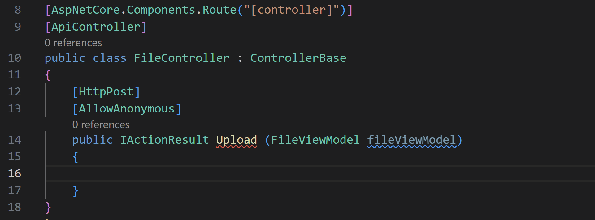
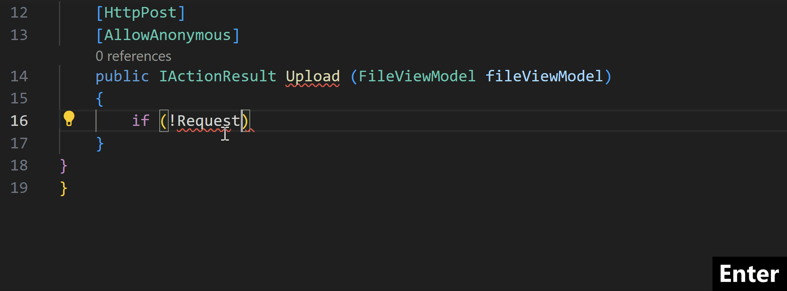
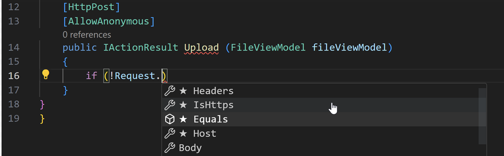

+++
title = "IntelliCode"
date = 2024-01-12T22:36:24+08:00
weight = 30
type = "docs"
description = ""
isCJKLanguage = true
draft = false
+++

> 原文: [https://code.visualstudio.com/docs/csharp/intellicode](https://code.visualstudio.com/docs/csharp/intellicode)

# IntelliCode for C# Dev Kit IntelliCode for C# 开发工具包

For users of the [C# Dev Kit](https://marketplace.visualstudio.com/items?itemName=ms-dotnettools.csdevkit) extension in Visual Studio Code, the [IntelliCode for C# Dev Kit](https://marketplace.visualstudio.com/items?itemName=ms-dotnettools.vscodeintellicode-csharp) extension is available to provide IntelliCode support. Predictions of up to a whole-line of code, along with ranking methods and properties in the IntelliSense list are available for C# Dev Kit users.

​​​	对于 Visual Studio Code 中的 C# Dev Kit 扩展的用户，IntelliCode for C# Dev Kit 扩展可用于提供 IntelliCode 支持。C# Dev Kit 用户可以使用最多一行代码的预测，以及 IntelliSense 列表中的排名方法和属性。

## [Whole line suggestions 整行建议]()

**Scenario 1**: When grey-text is shown, press Tab to accept the prediction (suggestion).

​​​	场景 1：当显示灰色文本时，按 Tab 键接受预测（建议）。

**Scenario 2**: When grey-text is shown along with the IntelliSense list, press Tab to accept the IntelliSense list selection, then Tab again to accept the rest of the multi-token prediction. In this scenario, you can use the IntelliSense list selection to steer the multi-token prediction offered by IntelliCode.

​​​	场景 2：当显示灰色文本以及 IntelliSense 列表时，按 Tab 键接受 IntelliSense 列表选择，然后再次按 Tab 键接受其余的多标记预测。在此场景中，您可以使用 IntelliSense 列表选择来引导 IntelliCode 提供的多标记预测。

Additionally, if the model is suggesting that a string should exist, but does not have a suggestion for the string, pressing Tab places the cursor into the empty string, making it easier for you to complete your line of code.

​​​	此外，如果模型建议存在一个字符串，但没有字符串建议，则按 Tab 键会将光标置于空字符串中，从而使您能够更轻松地完成代码行。

This model makes predictions on what you'll type next based on a rich knowledge of what you have coded so far, which includes:

​​​	此模型根据您到目前为止已编码内容的丰富知识来预测您接下来要键入的内容，其中包括：

- Variable names and positions
  变量名称和位置
- Libraries you're using
  您正在使用的库
- Functions in nearby code
  附近代码中的函数
- The IntelliSense list
  IntelliSense 列表

## [Starred suggestions 星标建议]()

This extension provides AI-assisted IntelliSense by showing recommended completion items for your code context at the top of the completions list.

​​​	此扩展通过在完成列表顶部显示针对您的代码上下文的推荐完成项，提供 AI 辅助的 IntelliSense。

When it comes to overloads, rather than taking the time to cycle through the alphabetical list of member, IntelliCode presents the most relevant one first. This extension not only ranks known methods, but its deep learning model also ranks methods that are unique to your code.

​​​	对于重载，IntelliCode 会首先显示最相关的重载，而不是花时间循环浏览成员的字母列表。此扩展不仅对已知方法进行排名，其深度学习模型还会对您的代码特有的方法进行排名。

To see AI-assisted ranking in the IntelliSense list, you must first open a C# file that is a part of a solution. C# files that aren't a part of a solution won't have this functionality available.

​​​	若要查看 IntelliSense 列表中的 AI 辅助排名，您必须首先打开一个作为解决方案一部分的 C# 文件。不属于解决方案一部分的 C# 文件将无法使用此功能。

## [Security and Privacy 安全性和隐私]()

All your code stays local – the model runs right on your computer - so there's no need to transmit code to a remote server for custom model training. This is enabled by our machine learning system design, which led to dramatically reduced memory footprint and improved inference speed.

​​​	您的所有代码都保持本地 - 模型直接在您的计算机上运行 - 因此无需将代码传输到远程服务器以进行自定义模型训练。这是由我们的机器学习系统设计实现的，这极大地减少了内存占用并提高了推理速度。

Since models powering IntelliCode features run on your local machine, this allows IntelliCode support to be available in offline and air gapped environments.

​​​	由于为 IntelliCode 功能提供支持的模型在您的本地计算机上运行，因此可以在离线和气隙环境中使用 IntelliCode 支持。

## [Get support for other languages 获取对其他语言的支持]()

To get IntelliCode whole-line autocompletions for Python, JavaScript, and TypeScript in VS Code, install the general [IntelliCode](https://marketplace.visualstudio.com/items?itemName=VisualStudioExptTeam.vscodeintellicode) extension. The general extension also ranks methods and properties in the IntelliSense list with stars for Python and SQL, in addition to the languages supported for whole-line autocomplete.

​​​	要在 VS Code 中为 Python、JavaScript 和 TypeScript 获取 IntelliCode 整行自动完成功能，请安装通用 IntelliCode 扩展。通用扩展还会对 IntelliSense 列表中的方法和属性进行排名，并为 Python 和 SQL 添加星号，以及支持整行自动完成功能的语言。

## [Prerequisites 先决条件]()

In order to use this extension, you must have both the C# Dev Kit and .NET 6 installed and enabled on your machine. This extension supports the following platforms and operating systems:

​​​	要使用此扩展，您必须在计算机上安装并启用 C# Dev Kit 和 .NET 6。此扩展支持以下平台和操作系统：

- Windows

  : x64 and ARM

  
  Windows：x64 和 ARM

  - x64 & ARM tested on Windows 11 22H2
    在 Windows 11 22H2 上测试了 x64 和 ARM

- macOS

  : x64 and ARM.

  
  macOS：x64 和 ARM。

  - x64 tested on OS X Monterey v12.6.5
    在 OS X Monterey v12.6.5 上测试了 x64
  - ARM tested on OS X v PENDING
    在 OS X v PENDING 上测试了 ARM

- Linux

  : x64 and ARM.

  
  Linux：x64 和 ARM。

  - x64 Tested on Ubuntu 22.04
    在 Ubuntu 22.04 上测试了 x64

## [How do I report feedback and issues 如何报告反馈和问题]()

You can file an issue on our IntelliCode for VS Code extension [GitHub feedback repo](https://github.com/MicrosoftDocs/intellicode/issues).

​​​	您可以在我们的 IntelliCode for VS Code 扩展 GitHub 反馈存储库中提交问题。
