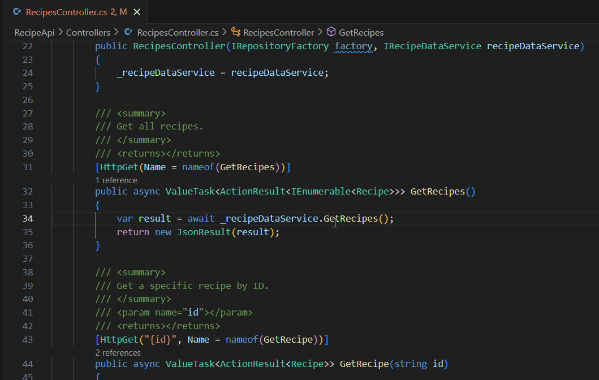
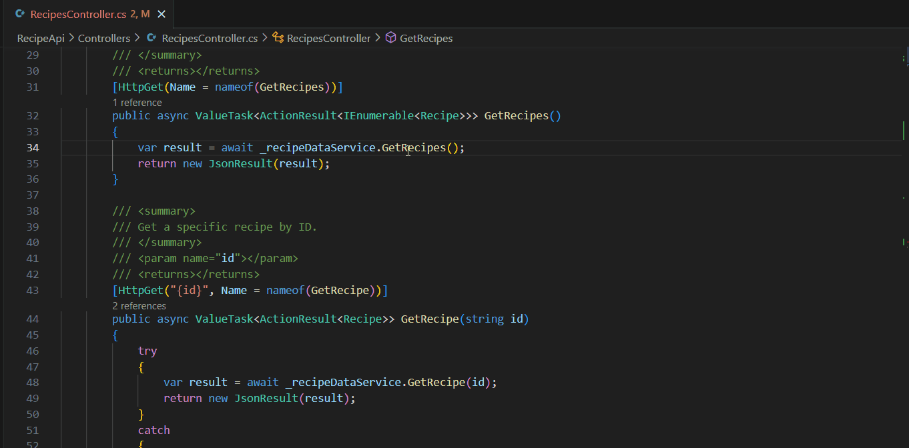
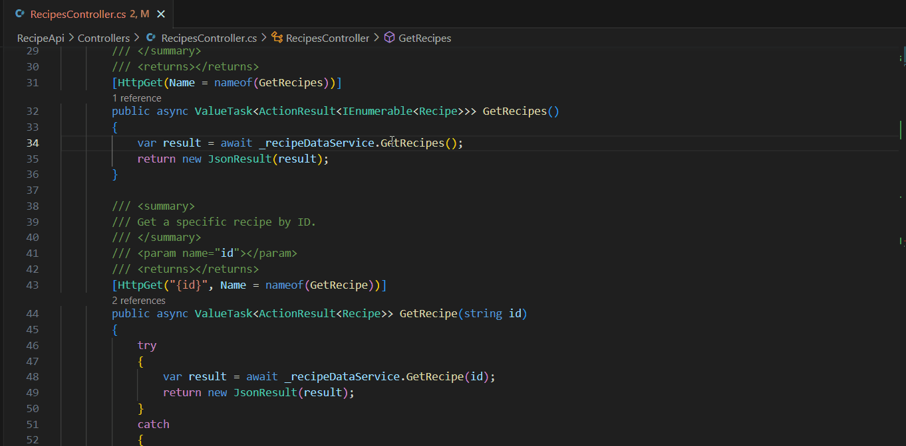
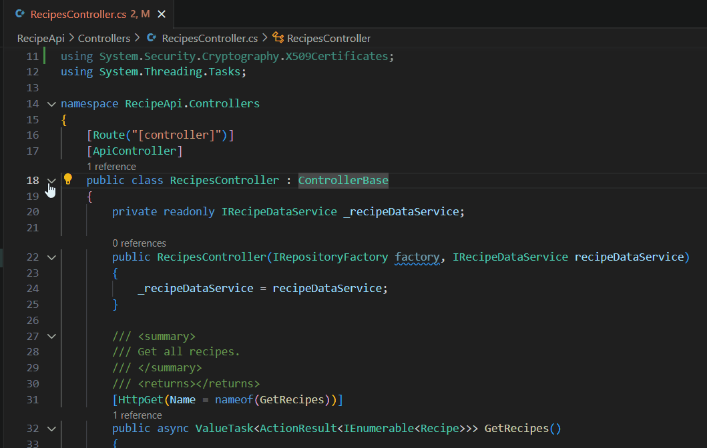

+++
title = "Navigate and Edit"
date = 2024-01-12T22:36:24+08:00
weight = 20
type = "docs"
description = ""
isCJKLanguage = true
draft = false
+++

> 原文: [https://code.visualstudio.com/docs/csharp/navigate-edit](https://code.visualstudio.com/docs/csharp/navigate-edit)

# Navigate and Edit 导航和编辑

The navigation and editing tools described in this overview are enabled by the [C# Dev Kit](https://marketplace.visualstudio.com/items?itemName=ms-dotnettools.csdevkit) extension, a lightweight extension to enhance your C# development experience in Visual Studio Code.

​​​	概述中所述的导航和编辑工具由 C# Dev Kit 扩展启用，这是一个轻量级扩展，可增强您在 Visual Studio Code 中的 C# 开发体验。

## [Code Navigation 代码导航](https://code.visualstudio.com/docs/csharp/navigate-edit#_code-navigation)

With the [Outline view](https://code.visualstudio.com/docs/getstarted/userinterface#_outline-view), you can conveniently navigate the members within the current file. Installing the C# Dev Kit extension also gives you the [Solution Explorer view](https://code.visualstudio.com/docs/csharp/project-management). This view helps you add, manage, and modify your projects contained within a larger solution without switching between the command line and the editor.

​​​	借助“大纲”视图，您可以方便地导航当前文件中的成员。安装 C# Dev Kit 扩展还将为您提供“解决方案资源管理器”视图。此视图可帮助您添加、管理和修改包含在较大解决方案中的项目，而无需在命令行和编辑器之间切换。

## [Go To Definition 转到定义](https://code.visualstudio.com/docs/csharp/navigate-edit#_go-to-definition)

The **Go To Definition** feature navigates to the source or file of a type or member, and opens the result in a new tab. If you are a keyboard user, place your text cursor somewhere inside the symbol name and press F12. If you are a mouse user, either right-click the symbol name and select **Go To Definition** from the context menu or Ctrl+click the symbol name. You can also use Ctrl+Alt+click to open the definition on the side.

​​​	“转到定义”功能可导航到类型或成员的源或文件，并在新选项卡中打开结果。如果您是键盘用户，请将文本光标放在符号名称内的某个位置，然后按 F12。如果您是鼠标用户，请右键单击符号名称，然后从上下文菜单中选择“转到定义”，或按 Ctrl+单击符号名称。您还可以使用 Ctrl+Alt+单击在侧面打开定义。

## [Peek Definition 查看定义](https://code.visualstudio.com/docs/csharp/navigate-edit#_peek-definition)

You can take a quick look at how a symbol was defined by using the **Peek Definition** feature. This feature displays a few lines of code near the definition inside a peek window, so you can take a look without navigating away from your current location.

​​​	您可以使用“查看定义”功能快速查看符号的定义方式。此功能会在一个预览窗口中显示定义附近的几行代码，以便您无需离开当前位置即可查看。

To peek at a symbol's definition, place your cursor on the symbol anywhere it's used in your source code and then press Alt+F12. Alternatively, you can choose **Peek Definition** from the context menu (right-click, then choose **Peek > Peek Definition**).

​​​	要查看符号的定义，请将光标放在源代码中使用该符号的任何位置，然后按 Alt+F12。或者，您可以从上下文菜单中选择“查看定义”（右键单击，然后选择“查看”>“查看定义”）。

## [Peek Implementations 查看实现](https://code.visualstudio.com/docs/csharp/navigate-edit#_peek-implementations)

You can take a quick, inline view at how and where a class, method, or symbol was implemented using the **Peek Implementations** feature.

​​​	您可以使用“查看实现”功能快速、内联地查看类、方法或符号的实现方式和位置。

To view the list of implementation locations, place the cursor on the symbol anywhere it's used in your source code and then press Ctrl+Shift+F12. Alternatively, you can choose **Peek Implementations** from the context menu (right-click, then choose **Peek > Peek Implementations**).

​​​	要查看实现位置列表，请将光标放在源代码中使用该符号的任何位置，然后按 Ctrl+Shift+F12。或者，您可以从上下文菜单中选择“查看实现”（右键单击，然后选择“查看”>“查看实现”）。

## [Peek References 查看引用](https://code.visualstudio.com/docs/csharp/navigate-edit#_peek-references)

You can get an inline list of sources where a selected symbol has been referenced in your code using the **Peek References** feature. Place the cursor on the symbol anywhere it's used in your source code, right-click, then choose **Peek > Peek References**.

​​​	您可以使用“查看引用”功能获取代码中所选符号的引用源的内联列表。将光标放在源代码中使用该符号的任何位置，右键单击，然后选择“查看”>“查看引用”。

## [Collapse or expand code snippets 折叠或展开代码片段](https://code.visualstudio.com/docs/csharp/navigate-edit#_collapse-or-expand-code-snippets)

To better view the source code, hover over the editor gutter to collapse or expand code snippets using the caret that appears.

​​​	为了更好地查看源代码，将鼠标悬停在编辑器边距上，使用出现的插入符号折叠或展开代码片段。

## [Smart selection 智能选择](https://code.visualstudio.com/docs/csharp/navigate-edit#_smart-selection)

With [smart selection](https://code.visualstudio.com/updates/v1_33#_smart-select-api) (semantic selection), you can expand or shrink the selection range based on the semantic information of the caret position in your source code.

​​​	使用智能选择（语义选择），您可以根据源代码中插入符号位置的语义信息来扩展或缩小选择范围。

- To expand the selection, use Shift+Alt+Right
  要扩展选择，请使用 Shift+Alt+向右
- To shrink the selection, use Shift+Alt+Left
  要缩小选择，请使用 Shift+Alt+向左
