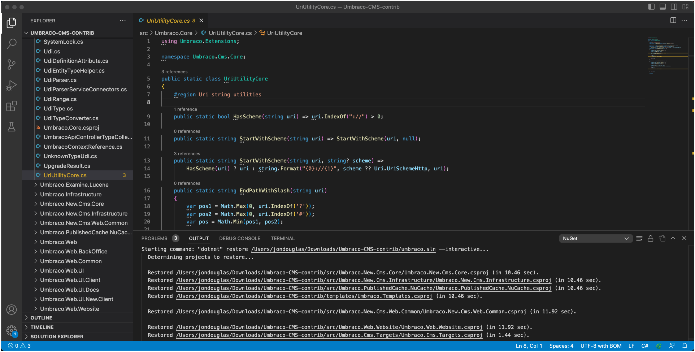
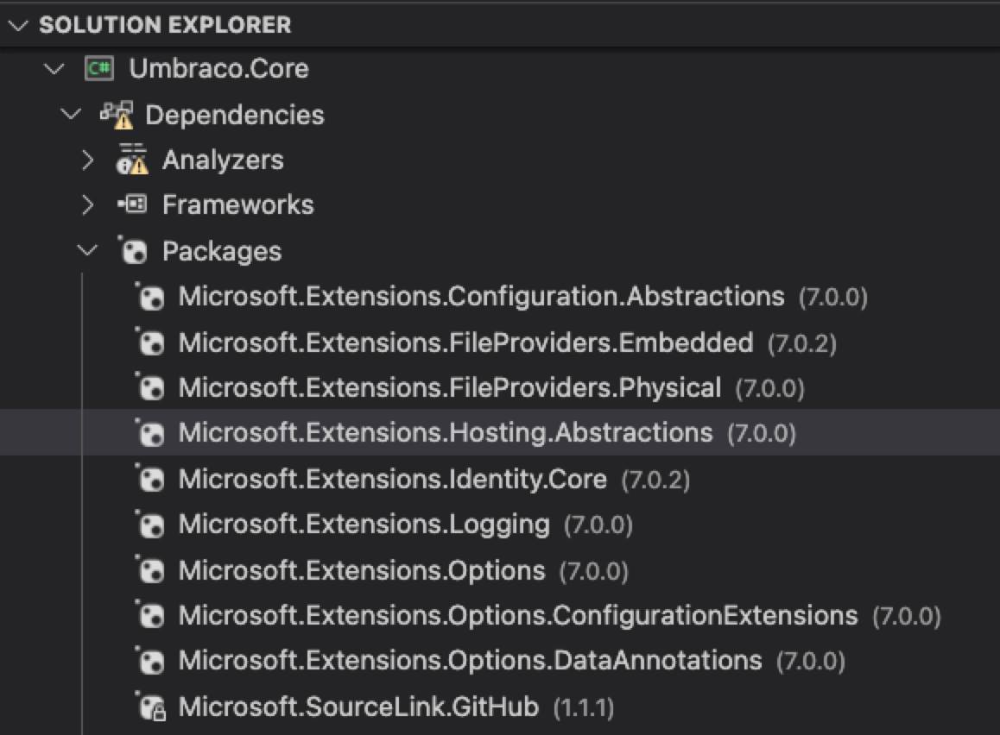

+++
title = "Package Management"
date = 2024-01-12T22:36:24+08:00
weight = 80
type = "docs"
description = ""
isCJKLanguage = true
draft = false
+++

> 原文: [https://code.visualstudio.com/docs/csharp/package-management](https://code.visualstudio.com/docs/csharp/package-management)

# NuGet in Visual Studio Code Visual Studio Code 中的 NuGet

NuGet is the package manager for .NET. It defines how packages for .NET are created, hosted, and consumed, and provides the tools for each of those roles. Importantly, NuGet also manages the dependency tree on behalf of a project, so you only need to focus on the packages that you're directly using in a project. For more information, go to the [NuGet documentation](https://learn.microsoft.com/nuget/what-is-nuget).

​​​	NuGet 是 .NET 的包管理器。它定义了 .NET 包的创建、托管和使用方式，并为每个角色提供工具。重要的是，NuGet 还代表项目管理依赖项树，因此您只需关注在项目中直接使用的包即可。有关详细信息，请转到 NuGet 文档。

## [Dependency management 依赖管理]()

### [Automatic NuGet restore 自动 NuGet 还原]()

For a .NET project, a package restore happens automatically when you create a project from a template, build, load, or make changes to an SDK-style project.

​​​	对于 .NET 项目，当您从模板创建项目、生成、加载或对 SDK 样式项目进行更改时，将自动发生包还原。

For projects that use `<PackageReference>`, you can see the package references in the **Solution Explorer** section of Visual Studio Code.

​​​	对于使用 `<PackageReference>` 的项目，您可以在 Visual Studio Code 的解决方案资源管理器部分中看到包引用。

Packages that don't install properly when a restore happens or you run a build will show error icons in **Solution Explorer**.

​​​	在还原发生或您运行生成时未正确安装的包将在解决方案资源管理器中显示错误图标。

**Note**: At this time, you cannot right-click on projects to manage your NuGet packages and there is not a NuGet Package Manager user interface in Visual Studio Code. For more information on managing packages, see [Install and manage NuGet packages with the dotnet CLI](https://learn.microsoft.com/nuget/consume-packages/install-use-packages-dotnet-cli).

​​​	注意：此时，您无法右键单击项目来管理 NuGet 包，并且 Visual Studio Code 中没有 NuGet 包管理器用户界面。有关管理包的详细信息，请参阅使用 dotnet CLI 安装和管理 NuGet 包。
