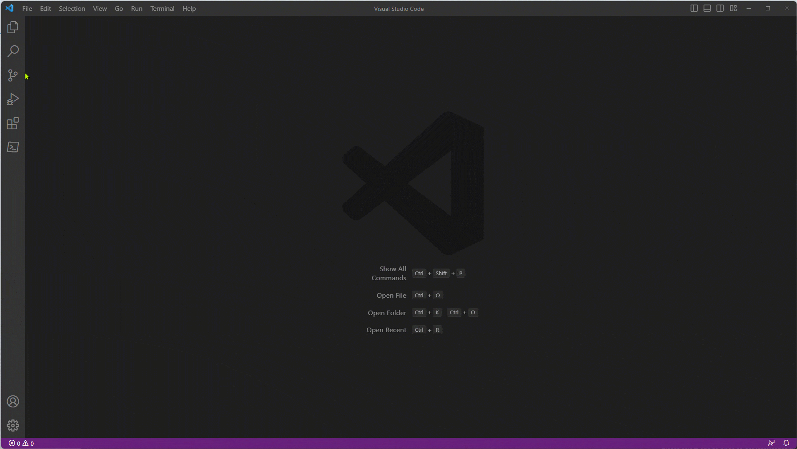
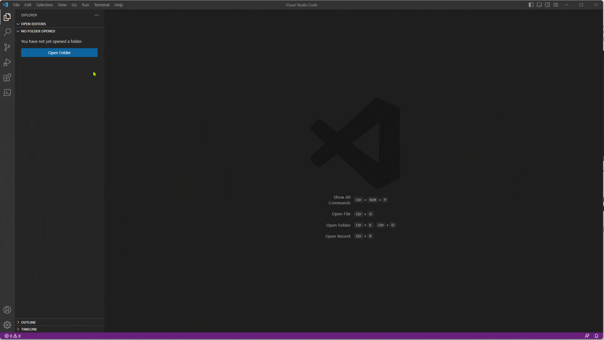
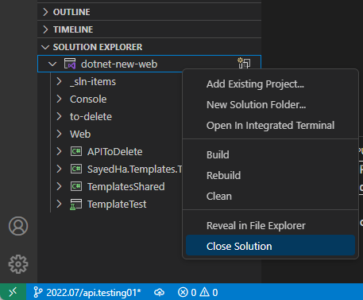
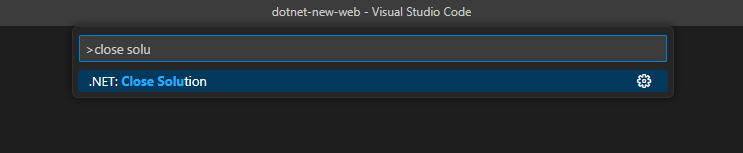
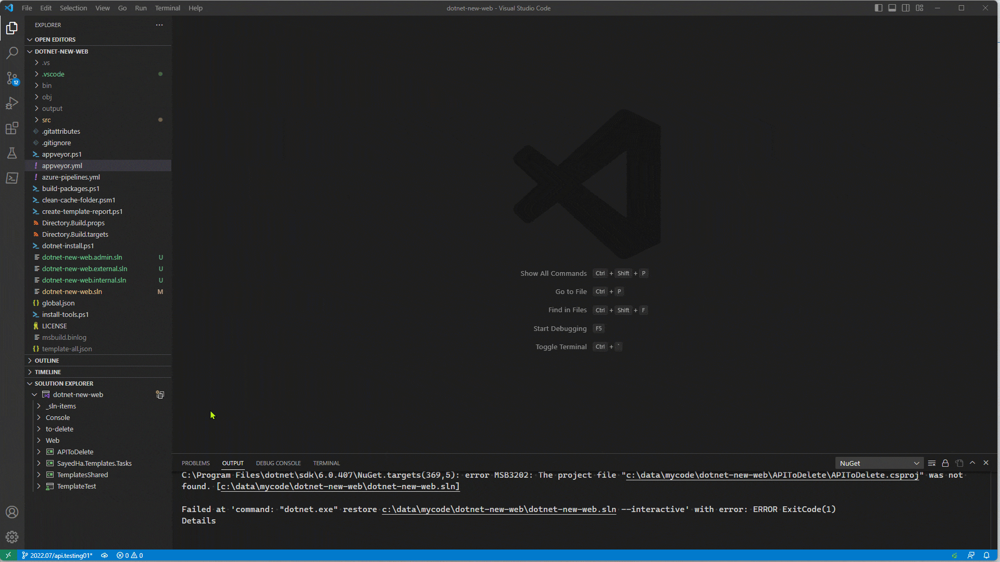
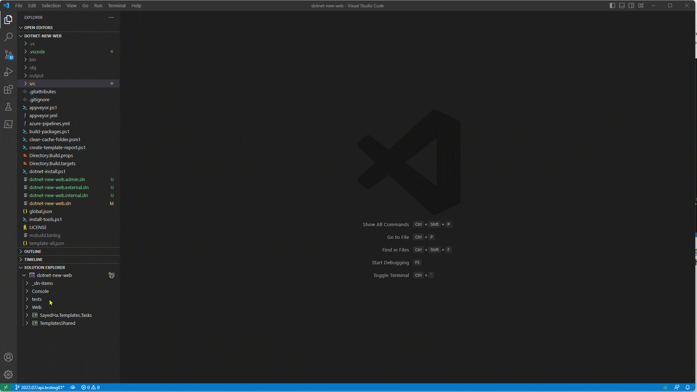
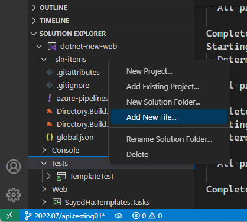
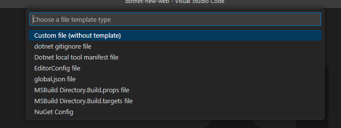
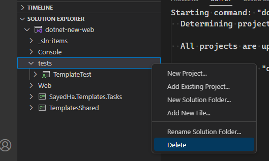
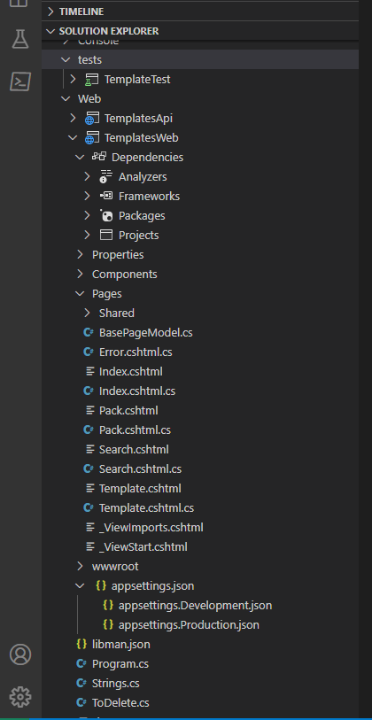

+++
title = "Project Management"
date = 2024-01-12T22:36:24+08:00
weight = 60
type = "docs"
description = ""
isCJKLanguage = true
draft = false
+++

> 原文: [https://code.visualstudio.com/docs/csharp/project-management](https://code.visualstudio.com/docs/csharp/project-management)

# Project management 项目管理

When you create a C# application in Visual Studio Code, you start with a **project**. A project contains all files (such as source code, images, etc.) that are compiled into an executable, library, or website. All of your related projects can then be stored in a container called a **solution**. This article shows you how you can maintain all your projects and their respective files via the **Solution Explorer** view.

&zeroWidthSpace;在 Visual Studio Code 中创建 C# 应用程序时，您从一个项目开始。项目包含所有编译成可执行文件、库或网站的文件（例如源代码、图像等）。然后，您所有相关的项目都可以存储在一个称为解决方案的容器中。本文介绍如何通过解决方案资源管理器视图维护所有项目及其各自的文件。

> **Note**: The [C# Dev Kit extension](https://marketplace.visualstudio.com/items?itemName=ms-dotnettools.csdevkit) is required to use the Solution Explorer view in VS Code.
>
> &zeroWidthSpace;注意：使用 VS Code 中的解决方案资源管理器视图需要 C# Dev Kit 扩展。

## [Solution Explorer 解决方案资源管理器](https://code.visualstudio.com/docs/csharp/project-management#_solution-explorer)

The new C# Dev Kit extension contains a new view in the Primary Sidebar, the **Solution Explorer**. This view provides a structured view of your application, its solutions, and its projects for effortless, central project management. When you open a Workspace that contains .NET solution files or project files, the Solution Explorer will automatically appear.

&zeroWidthSpace;新的 C# Dev Kit 扩展在主侧边栏中包含一个新视图，即解决方案资源管理器。此视图提供应用程序、其解决方案及其项目的结构化视图，以便轻松进行集中项目管理。当您打开包含 .NET 解决方案文件或项目文件的 Workspace 时，解决方案资源管理器将自动出现。

If you have a single solution file (.sln file) in the workspace, the Solution Explorer will detect that file and automatically load it after the workspace is loaded. For example, take a look at the animation below showing the experience of opening a workspace with a single solution file.

&zeroWidthSpace;如果工作区中有一个解决方案文件（.sln 文件），解决方案资源管理器将检测到该文件并在工作区加载后自动加载它。例如，请看下面的动画，其中演示了打开具有单个解决方案文件的工作区的体验。

In the animation above, the workspace was loaded into VS Code for the first time. After the workspace is loaded, the Solution Explorer detects the lone `.sln` file and automatically loads that.

&zeroWidthSpace;在上面的动画中，工作区首次加载到 VS Code 中。工作区加载后，解决方案资源管理器检测到单独的 `.sln` 文件并自动加载该文件。

When you have more than one solution file in the workspace, you will be prompted to select the specific solution file to load. After a solution file is loaded for a workspace, the extension will remember which solution file was loaded last and automatically reload that file when the workspace is loaded in VS Code. In the animation below, you can see the experience of opening a workspace with multiple solution files for the first time.

&zeroWidthSpace;当工作区中有多个解决方案文件时，系统会提示您选择要加载的特定解决方案文件。为工作区加载解决方案文件后，扩展将记住上次加载的解决方案文件，并在 VS Code 中加载工作区时自动重新加载该文件。在下面的动画中，您可以看到首次打开包含多个解决方案文件的工作区的体验。

In the video above, after the workspace is loaded, the Solution Explorer detects that the workspace contains multiple solution files and you are prompted to select the solution to load with the standard VS Code notification. Going forward when you open the same workspace, the Solution Explorer remembers which solution file was loaded last and automatically reload that.

&zeroWidthSpace;在上面的视频中，工作区加载后，解决方案资源管理器检测到工作区包含多个解决方案文件，系统会提示您选择要使用标准 VS Code 通知加载的解决方案。以后当您打开相同的工作区时，解决方案资源管理器会记住上次加载的解决方案文件并自动重新加载该文件。

When you have a solution loaded in the Solution Explorer and you would like to close that solution, you can use the **Close Solution** command. You can find this command in the context menu when you right-click on a solution in the Solution Explorer.

&zeroWidthSpace;当您在解决方案资源管理器中加载了某个解决方案并想要关闭该解决方案时，可以使用“关闭解决方案”命令。右键单击解决方案资源管理器中的某个解决方案时，可以在上下文菜单中找到此命令。

You can also invoke this command in the Command Palette. You can open the Command Palette with Ctrl+Shift+P. This is shown in the following image.

&zeroWidthSpace;您还可以在命令面板中调用此命令。可以使用 Ctrl+Shift+P 打开命令面板。下图对此进行了说明。

After closing the solution, the Solution Explorer will show a button so that you can open a solution file from the workspace later. You can also invoke that command with the Command Palette with the **.NET: Open Solution** command.

&zeroWidthSpace;关闭解决方案后，解决方案资源管理器将显示一个按钮，以便您稍后可以从工作区打开解决方案文件。您还可以使用命令面板中的 .NET：打开解决方案命令调用该命令。

When you invoke the **Open Solution** command, if there is a single solution file in the workspace, it will automatically load that. When there are multiple solution files, you'll be prompted to select the solution file to load. This is the same experience when you first open a workspace with one, or more, solution files. Let's move on to discuss the support for Solution Folders in the Solution Explorer.

&zeroWidthSpace;调用“打开解决方案”命令时，如果工作区中只有一个解决方案文件，它将自动加载该文件。如果有多个解决方案文件，系统会提示您选择要加载的解决方案文件。当您首次打开包含一个或多个解决方案文件的工作区时，也会出现同样的情况。我们接着讨论解决方案资源管理器中对解决方案文件夹的支持。

## [Solution Folders 解决方案文件夹](https://code.visualstudio.com/docs/csharp/project-management#_solution-folders)

In the Solution Explorer, if a solution contains Solution Folders (virtual folders used to group projects in a solution), they will be displayed. Here, you can interact with Solution Folder contents. To add a new Solution Folder, you can right-click the solution and select the **New Solution Folder** menu item. Take a look at the short video below.

&zeroWidthSpace;在解决方案资源管理器中，如果解决方案包含解决方案文件夹（用于对解决方案中的项目进行分组的虚拟文件夹），则会显示它们。您可以在此处与解决方案文件夹内容进行交互。若要添加新的解决方案文件夹，您可以右键单击解决方案并选择“新建解决方案文件夹”菜单项。请观看下面的简短视频。

In the video above, a new Solution Folder named "tests" was created. After creating a Solution Folder, you can add a project into it with the **Add Existing Project** context menu. The animation below shows this experience.

&zeroWidthSpace;在上面的视频中，创建了一个名为“tests”的新解决方案文件夹。创建解决方案文件夹后，您可以使用“添加现有项目”上下文菜单将项目添加到其中。下面的动画演示了此体验。

You can also add a new file to the Solution Folder with the **Add New File** context menu shown in the following image.

&zeroWidthSpace;您还可以使用以下图像中所示的“添加新文件”上下文菜单将新文件添加到解决方案文件夹。

After you invoke this command, you will be prompted to select the file template to be used in the Command Palette. The image below shows this.

&zeroWidthSpace;调用此命令后，系统会提示您在命令面板中选择要使用的文件模板。下图对此进行了说明。

This list shows the file templates that the extension currently supports for Solution Folders. To create a file without using a template (to create a blank file), select **Custom file (without template)**.

&zeroWidthSpace;此列表显示了扩展目前对解决方案文件夹支持的文件模板。若要创建不使用模板的文件（创建空白文件），请选择“自定义文件（无模板）”。

To remove a Solution Folder, you can use the **Remove** context menu option.

&zeroWidthSpace;若要删除解决方案文件夹，可以使用“删除”上下文菜单选项。

When you remove a Solution Folder from a solution, the Solution Folder and its contents are removed from the solution. The files, and/or projects, that it contains are not deleted from disk. Now that we've discussed Solution Folders, let's move on to see how to interact more with projects in the Solution Explorer.

&zeroWidthSpace;从解决方案中移除解决方案文件夹时，解决方案文件夹及其内容将从解决方案中移除。其中包含的文件和/或项目不会从磁盘中删除。现在我们已经讨论了解决方案文件夹，接下来让我们看看如何在解决方案资源管理器中与项目进行更多交互。

## [Working with projects 使用项目](https://code.visualstudio.com/docs/csharp/project-management#_working-with-projects)

In the Solution Explorer, there are a number of features to enable you to work with projects. When you first open a solution, you will see the projects and Solution Folders. You can expand Solution Folders or projects to see its contents. The image below shows the Solution Explorer with a few nodes expanded.

&zeroWidthSpace;在解决方案资源管理器中，有一些功能可用于您使用项目。首次打开解决方案时，您将看到项目和解决方案文件夹。您可以展开解决方案文件夹或项目以查看其内容。下图显示了已展开几个节点的解决方案资源管理器。

In the image above, we can see the Solution Explorer with a couple Solution Folders expanded, as well as the `TemplatesWeb` project. There is minimal file nesting supported in this release, we will expand on that support to be more consistent with the file nesting that is seen in Visual Studio IDE.

&zeroWidthSpace;在上图中，我们可以看到解决方案资源管理器中展开了一些解决方案文件夹，以及 `TemplatesWeb` 项目。此版本中支持最少的文件嵌套，我们将扩展该支持以与 Visual Studio IDE 中看到的文件嵌套保持一致。

From here, you can open files by double clicking them in the Solution Explorer. You can also right-click items in the Solution Explorer to get a context specific menu for available actions. For example, to add a new file to a project, right-click on the project and select **Add New File**. When you select that option, you'll be prompted to choose the file template to be used for the default content. You'll get the best experience here if you are working on a project targeting .NET 7.0.200 or above.

&zeroWidthSpace;从这里，您可以通过在解决方案资源管理器中双击文件来打开它们。您还可以右键单击解决方案资源管理器中的项目以获取可用的操作的上下文特定菜单。例如，要将新文件添加到项目，请右键单击该项目并选择“添加新文件”。选择该选项时，系统会提示您选择要用于默认内容的文件模板。如果您正在处理针对 .NET 7.0.200 或更高版本的项目，您将获得最佳体验。

You can also add files into projects by creating files as you normally would in VS Code and save them under the folder containing the project file. By default, new files added to the project folder will automatically be added to the project.

&zeroWidthSpace;您还可以通过在 VS Code 中像往常一样创建文件并将它们保存在包含项目文件的文件下，将文件添加到项目中。默认情况下，添加到项目文件夹的新文件将自动添加到项目中。

In the project view, you can also see the dependencies that the project has, both for **Project References** as well as **Package References**. In this version of the C# Dev Kit, you don't have the ability to modify the dependencies. To add a dependency to a project or package reference, you can use the `dotnet add` command line tool. To add a package reference, see [dotnet add package command - .NET CLI](https://learn.microsoft.com/dotnet/core/tools/dotnet-add-package) and to add a project reference, see [dotnet add reference command - .NET CLI](https://learn.microsoft.com/dotnet/core/tools/dotnet-add-reference). To remove a reference, use `dotnet remove`. You can read more information at [how to remove a package reference](https://learn.microsoft.com/dotnet/core/tools/dotnet-remove-reference) and [how to remove a package](https://learn.microsoft.com/dotnet/core/tools/dotnet-remove-package).

&zeroWidthSpace;在项目视图中，您还可以看到项目具有的依赖项，包括项目引用和包引用。在此版本的 C# Dev Kit 中，您无法修改依赖项。若要向项目或包引用添加依赖项，可以使用 `dotnet add` 命令行工具。若要添加包引用，请参阅 dotnet add package 命令 - .NET CLI；若要添加项目引用，请参阅 dotnet add reference 命令 - .NET CLI。若要删除引用，请使用 `dotnet remove` 。您可以在如何删除包引用和如何删除包中阅读更多信息。

If you would like to see or edit a project file, select the Project node in the Solution Explorer, and the project file will be opened in the editor. This is the same behavior you'll find when selecting a file in the Solution Explorer.

&zeroWidthSpace;如果您想查看或编辑项目文件，请选择“解决方案资源管理器”中的“项目”节点，项目文件将在编辑器中打开。这是您在“解决方案资源管理器”中选择文件时会发现的相同行为。

Using the Solution Explorer, you can also perform common actions such as **Build**, **Rebuild**, and **Clean** using the context menus. You will see these context menus when you have selected the Solution node or project node in the Solution Explorer. This will Build/Rebuild/Clean the selected item as well as its dependencies.

&zeroWidthSpace;使用“解决方案资源管理器”，您还可以使用上下文菜单执行常见操作，如生成、重新生成和清理。当您在“解决方案资源管理器”中选择“解决方案”节点或项目节点时，您将看到这些上下文菜单。这将生成/重新生成/清理所选项目及其依赖项。
