+++
title = "Refactoring"
date = 2024-01-12T22:36:24+08:00
weight = 40
type = "docs"
description = ""
isCJKLanguage = true
draft = false
+++

> 原文: [https://code.visualstudio.com/docs/csharp/refactoring](https://code.visualstudio.com/docs/csharp/refactoring)

# C# Quick Actions and Refactorings C# 快速操作和重构

Visual Studio Code gives you many ways to refactor your source code as well as Quick Fixes to generate code and fix issues while you're coding. To access them, click on the 'light bulb' icon that appears or use the command **Quick Fix** command Ctrl+. to display a list of Quick Fixes and refactoring options. You can also right-click the editor and select **Refactor** Ctrl+Shift+R to only display refactoring options.

​​​	Visual Studio Code 为您提供了多种重构源代码的方法，以及快速修复功能，以便在您编码时生成代码并修复问题。若要访问它们，请单击出现的“灯泡”图标或使用命令快速修复命令 Ctrl+. 以显示快速修复和重构选项的列表。您还可以右键单击编辑器并选择重构 Ctrl+Shift+R，以仅显示重构选项。

## [Supported refactorings and Quick Fixes 支持的重构和快速修复]()

- [Add `await`
  添加 `await`]()
- [Add constructor parameters from members
  从成员添加构造函数参数]()
- [Add `DebuggerDisplay` attribute
  添加 `DebuggerDisplay` 属性]()
- [Add explicit cast
  添加显式强制转换]()
- [Add file header
  添加文件头]()
- [Add missing `usings` / imports
  添加缺少的 `usings` / 导入]()
- [Add named argument
  添加命名参数]()
- [Convert anonymous type to class
  将匿名类型转换为类]()
- [Convert between auto property and full property
  在自动属性和完整属性之间转换]()
- [Convert between direct cast and `as` expression
  在直接强制转换和 `as` 表达式之间转换]()
- [Convert between `for` loop and `foreach` statement
  在 `for` 循环和 `foreach` 语句之间转换]()
- Convert between Get method and property
  在 Get 方法和属性之间转换
  - [Convert Get method to property
    将 Get 方法转换为属性]()
  - [Convert property to Get method
    将属性转换为 Get 方法]()
- [Convert between `if` and `switch` statements
  在 `if` 和 `switch` 语句之间转换]()
- [Convert between regular string and verbatim string
  在常规字符串和原义字符串之间转换]()
- [Convert class to record
  将类转换为记录]()
- [Convert local function to method
  将局部函数转换为方法]()
- [Convert numeric literal to hex, decimal, or binary number
  将数字文字转换为十六进制、十进制或二进制数字]()
- [Convert placeholder to interpolated string
  将占位符转换为插值字符串]()
- [Convert regular string to interpolated string
  将常规字符串转换为插值字符串]()
- [Convert tuple to struct
  将元组转换为结构]()
- [Encapsulate field
  封装字段]()
- [Generate comparison operators
  生成比较运算符]()
- [Generate default constructors
  生成默认构造函数]()
- [Generate parameter
  生成参数]()
- [Implement all members explicitly
  显式实现所有成员]()
- [Implement all members implicitly
  隐式实现所有成员]()
- [Inline method
  内联方法]()
- [Inline temporary variable
  内联临时变量]()
- [Introduce local variable for expression
  为表达式引入局部变量]()
- [Introduce parameter
  引入参数]()
- [Introduce `using` statement
  引入 `using` 语句]()
- [Invert conditional expressions and logical operations
  反转条件表达式和逻辑运算]()
- [Invert `if`
  反转 `if`]()
- [Make member static
  使成员变为静态]()
- [Move declaration near reference
  将声明移至引用附近]()
- [Move type to matching file
  将类型移至匹配的文件]()
- [Reverse `for` statement
  反转 `for` 语句]()
- [Split or merge `if` statements
  拆分或合并 `if` 语句]()
- [Use explicit type
  使用显式类型]()
- [Use implicit type
  使用隐式类型]()
- [Use lambda expression or block body
  使用 lambda 表达式或块主体]()
- [Use recursive patterns
  使用递归模式]()
- Wrap, indent, and align refactorings
  换行、缩进和对齐重构
  - [Wrap and align call chains
    换行和对齐调用链]()
  - [Wrap, indent, and align parameters or arguments
    换行、缩进和对齐参数或参数]()
  - [Wrap binary expressions
    换行二进制表达式]()

## [Add await 添加 await]()

**What:** Adds `await` keyword to a function call.

​​​	操作：向函数调用添加 `await` 关键字。

**When:** When you're calling a function within an asynchronous method.

​​​	时机：在异步方法中调用函数时。

**How-to:
操作方法：**

1. Place carat by the function call (will most likely be underlined in red).
   将插入符号放在函数调用旁边（很可能以红色下划线显示）。
2. Press Ctrl+.to trigger the **Quick Actions and Refactorings** menu.
   按 Ctrl+. 触发“快速操作和重构”菜单。
3. Select **Add `await`**.
   选择“添加 `await` ”。

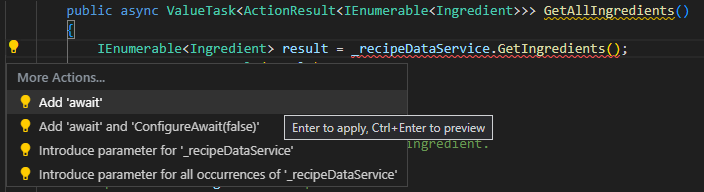

## [Add constructor parameters from members 从成员添加构造函数参数]()

**What:** Generate a new constructor with parameters based on selected class members.

​​​	操作：根据所选类成员生成带参数的新构造函数。

**When:** You introduce a new constructor and want to properly declare it automatically with all the correct parameters.

​​​	时机：引入新构造函数并希望自动正确声明所有参数时。

**Why:** You could declare the constructor before using it, however this feature generates it automatically.

​​​	原因：您可以在使用构造函数之前声明它，但此功能会自动生成它。

**How-to:
操作方法：**

1. Highlight the class members you want to add as parameters in the constructor.
   突出显示您想要作为构造函数中的参数添加的类成员。
2. Press Ctrl+.to trigger the **Quick Actions and Refactorings** menu.
   按 Ctrl+. 触发快速操作和重构菜单。
3. Select **Generate constructor <classname>(<membertype>, <membertype>, <etc.>)**.
   选择生成构造函数 (, , ).

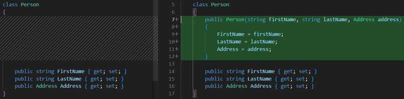

## [Add DebuggerDisplay attribute 添加 DebuggerDisplay 特性]()

**What:** The [DebuggerDisplay Attribute](https://learn.microsoft.com/visualstudio/debugger/using-the-debuggerdisplay-attribute?view=vs-2022) controls how an object, property, or field is displayed in the debugger variable windows.

​​​	作用：DebuggerDisplay 特性控制对象、属性或字段在调试器变量窗口中的显示方式。

**When:** You want to [pin properties](https://learn.microsoft.com/visualstudio/debugger/view-data-values-in-data-tips-in-the-code-editor?view=vs-2022#pin-properties-in-data-tips) within the debugger programmatically in your code.

​​​	时机：您希望在代码中以编程方式在调试器中固定属性。

**Why:** Pinning properties allows you to quickly inspect objects by their properties by bubbling up that property to the top of the object's property list within the debugger.

​​​	原因：固定属性允许您通过将该属性冒泡到调试器中对象属性列表的顶部，从而按属性快速检查对象。

**How-to:
操作方法：**

1. Place your cursor on either a type, delegate, property, or field.
   将光标放在类型、委托、属性或字段上。
2. Press Ctrl+.to trigger the **Quick Actions and Refactorings** menu and select **Add `DebuggerDisplay` attribute**.
   按 Ctrl+. 触发“快速操作和重构”菜单，然后选择“添加 `DebuggerDisplay` 特性”。
3. The `DebuggerDisplay` attribute is added along with an auto method that returns the default `ToString()`.
   `DebuggerDisplay` 特性将与返回默认 `ToString()` 的自动方法一起添加。

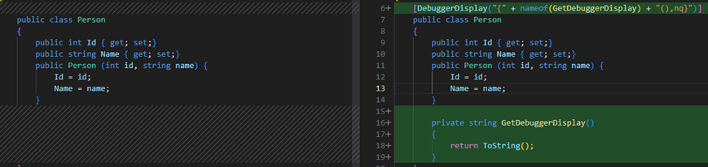

## [Add explicit cast 添加显式强制转换]()

**What:** Lets you automatically add an explicit cast to an expression, based on usage.

​​​	作用：允许您根据用法自动将显式强制转换添加到表达式。

**When:** You need to add an explicit cast to an expression and want to properly assign it automatically.

​​​	何时：您需要向表达式添加显式强制转换并希望自动正确地分配它。

**Why:** You could add an explicit cast to an expression manually, however this feature adds it automatically based on the code context.

​​​	原因：您可以手动向表达式添加显式强制转换，但是此功能会根据代码上下文自动添加它。

**How-to:
操作方法：**

1. Place your caret on the error.
   将插入符号放在错误上。
2. Press Ctrl+.to trigger the **Quick Actions and Refactorings** menu.
   按 Ctrl+. 触发“快速操作和重构”菜单。
3. Select **Add explicit cast**.
   选择“添加显式强制转换”。

## [Add file header 添加文件头]()

**What:** Add file headers to existing files, projects, and solutions using an [EditorConfig](https://marketplace.visualstudio.com/items?itemName=EditorConfig.EditorConfig).

​​​	内容：使用 EditorConfig 向现有文件、项目和解决方案添加文件头。

**When:** You want to easily add a file header to files, projects, and solutions.

​​​	何时：您希望轻松地向文件、项目和解决方案添加文件头。

**Why:** Your team requires you to include a file header for copyright purposes.

​​​	原因：您的团队要求您出于版权目的包含文件头。

**How-to:
操作方法：**

1. Add an [EditorConfig](https://marketplace.visualstudio.com/items?itemName=EditorConfig.EditorConfig) to a project or solution if you do not already have one.
   如果还没有，请将 EditorConfig 添加到项目或解决方案。
2. Add the following rule to your EditorConfig file: `file_header_template`.
   将以下规则添加到 EditorConfig 文件： `file_header_template` .
3. Set the value of the rule to equal the header text you would like applied. You can use `{fileName}` as a placeholder for the file name.
   将规则的值设置为要应用的头文件文本。您可以使用 `{fileName}` 作为文件名占位符。
4. Place your caret on the first line of any C# file.
   将光标放在任何 C# 文件的第一行。
5. Press Ctrl+.to trigger the **Quick Actions and Refactorings** menu.
   按 Ctrl+. 触发“快速操作和重构”菜单。
6. Select **Add file header**.
   选择“添加文件头”。

## [Add missing usings / imports 添加缺少的 using/import]()

**What:** Lets you immediately add the necessary imports or using directives for copy-and-pasted code.

​​​	作用：可立即为复制粘贴的代码添加必要的 import 或 using 指令。

**When:** It's common practice to copy code from different places in your project or other sources and paste it in to new code. This Quick Action finds missing imports directives for copy-and-pasted code and then prompts you to add them. This code fix can also add references from project to project.

​​​	时机：通常做法是从项目或其他源的不同位置复制代码，然后将其粘贴到新代码中。此快速操作可查找复制粘贴的代码中缺少的 import 指令，然后提示您添加它们。此代码修复还可以添加项目之间的引用。

**Why:** Because the Quick Action automatically adds necessary imports, you don't need to manually copy the using directives that your code needs.

​​​	原因：因为快速操作会自动添加必要的导入，您无需手动复制代码所需的 using 指令。

**How-to:
操作方法：**

1. Copy code from a file and paste it into a new one without including the necessary using directives. The resulting error is accompanied by a code fix that adds the missing using directives.
   从一个文件中复制代码并将其粘贴到另一个文件中，而不包括必要的 using 指令。结果错误会伴随一个代码修复，该修复会添加缺少的 using 指令。
2. Select Ctrl+.to open the **Quick Actions and Refactorings** menu.
   选择 Ctrl+. 打开快速操作和重构菜单。
3. Select **Using <your reference>** to add the missing reference.
   选择 Using 以添加缺少的引用。

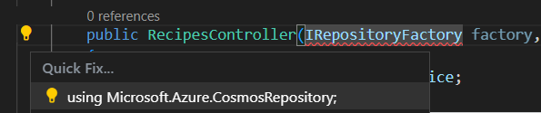

## [Add named argument 添加命名参数]()

**What:** Append a named argument to the specified parameter value in a function call.

​​​	内容：在函数调用中将命名参数追加到指定的参数值。

**When:** If you have a method with a lot of parameters, you can add named arguments to make your code more readable.

​​​	何时：如果您有一个包含大量参数的方法，则可以添加命名参数以使代码更具可读性。

**How-to:
操作方法：**

1. Place your cursor in a parameter within your function call.
   将光标放在函数调用中的参数中。
2. Press Ctrl+.to trigger the **Quick Actions and Refactorings** menu.
   按 Ctrl+. 触发快速操作和重构菜单。
3. Select **Add argument name <parameter name>**.
   选择添加参数名称 <参数名称>。

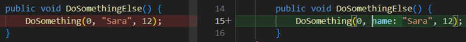

## [Convert anonymous type to class 将匿名类型转换为类]()

**What:** Convert an anonymous type to class.

​​​	用途：将匿名类型转换为类。

**When:** You have an anonymous type that you want to continue to build on in a class.

​​​	时机：当您有一个匿名类型并希望在类中继续构建它时。

**Why:** Anonymous types are useful if you're only using them locally. As your code grows, it's nice to have an easy way to promote them to a class.

​​​	原因：如果您仅在本地使用匿名类型，它们非常有用。随着代码的增长，最好有一种简单的方法将它们提升为类。

**How-to:
操作方法：**

1. Place your cursor in an anonymous (`var`) type.
   将光标放在匿名 ( `var` ) 类型中。
2. Press Ctrl+.to trigger the **Quick Actions and Refactorings** menu.
   按 Ctrl+. 触发快速操作和重构菜单。
3. Select **Convert to class**.
   选择转换为类。

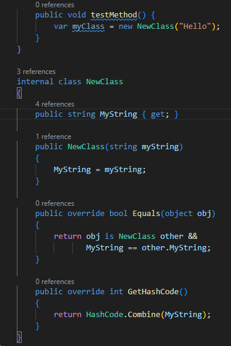

## [Convert between auto property and full property 在自动属性和完整属性之间转换]()

**What:** Convert between an auto-implemented property to a full property.

​​​	内容：在自动实现的属性和完整属性之间转换。

**When:** The logic of the property has changed.

​​​	时机：属性的逻辑已更改。

**Why:** You can convert between an auto-implemented property to a full property manually, however this feature will automatically do the work for you.

​​​	原因：您可以手动在自动实现的属性和完整属性之间转换，但是此功能会自动为您完成这项工作。

**How-to:
操作方法：**

1. Place your cursor on the property name.
   将光标放在属性名称上。
2. Press Ctrl+.to trigger the **Quick Actions and Refactorings** menu.
   按 Ctrl+. 触发快速操作和重构菜单。
3. Select from the following two options:
   从以下两个选项中选择：

Select **Convert to full property.**

​​​	选择转换为完整属性。

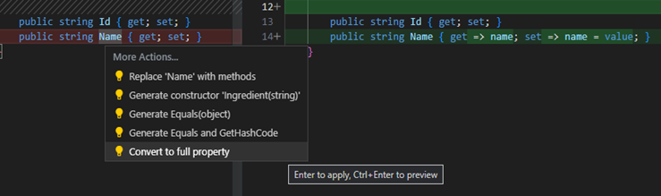

Select **Use auto property.**

​​​	选择使用自动属性。

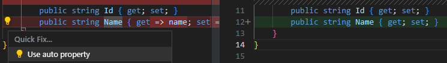

## [Convert between direct cast and 'as' expression 在直接强制转换和“as”表达式之间转换]()

**What:** Convert a variable between a regular cast and a try cast using the `as` keyword.

​​​	内容：使用 `as` 关键字在常规强制转换和尝试强制转换之间转换变量。

**When:** When you expect the cast to fail under certain scenarios (`as`) or if you never expect the cast to fail (direct cast).

​​​	时机：当您希望强制转换在某些情况下失败（ `as` ）或您从不希望强制转换失败（直接强制转换）时。

**How-to:
操作方法：**

1. Place your cursor on the variable.
   将光标放在变量上。
2. Press Ctrl+. to trigger the **Quick Actions and Refactorings** menu.
   按 Ctrl+. 触发“快速操作和重构”菜单。
3. Select from the following two options:
   从以下两个选项中进行选择：

Select **Change to cast**.

​​​	选择“更改为强制转换”。

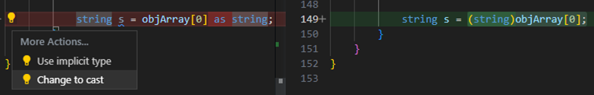

Select **Change to `as` expression.**

​​​	选择“更改为 `as` 表达式”。

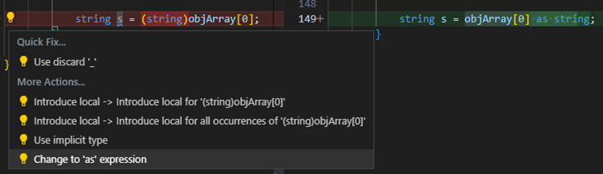

## [Convert between for loop and foreach statement 在 for 循环和 foreach 语句之间转换]()

**What:** If you have a [for](https://learn.microsoft.com/dotnet/csharp/language-reference/keywords/for) loop in your code, you can use this refactoring to convert it to a [foreach](https://learn.microsoft.com/dotnet/csharp/language-reference/keywords/foreach-in) statement.

​​​	内容：如果您在代码中有一个 for 循环，您可以使用此重构将其转换为 foreach 语句。

**Why:** Reasons you might want to convert a for loop to a foreach statement include:

​​​	原因：您可能希望将 for 循环转换为 foreach 语句的原因包括：

- You don't use the local loop variable inside the loop except as an index to access items.
  您在循环中不使用局部循环变量，除了用作访问项的索引。
- You want to simplify your code and reduce the likelihood of logic errors in the initializer, condition, and iterator sections.
  您希望简化代码并减少初始化程序、条件和迭代器部分中出现逻辑错误的可能性。

Reasons you might want to convert a foreach statement to a for loop include:

​​​	您可能希望将 foreach 语句转换为 for 循环的原因包括：

- You want to use the local loop variable inside the loop for more than just accessing the item.
  您希望在循环中使用局部循环变量，而不仅仅是访问项。
- You are iterating through a multi-dimensional array and you want more control over the array elements.
  您正在遍历多维数组，并且您希望对数组元素有更多控制。

**How-to:
操作方法：**

1. Place your caret in the `foreach` or `for` keyword.
   将插入符号放在 `foreach` 或 `for` 关键字中。
2. Press Ctrl+.to trigger the **Quick Actions and Refactorings** menu.
   按 Ctrl+. 触发快速操作和重构菜单。
3. Select from the following two options:
   从以下两个选项中选择：

Select **Convert to `for`**.

​​​	选择转换为 `for` 。

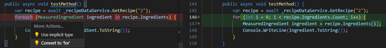

Select **Convert to `foreach`**.

​​​	选择转换为 `foreach` 。

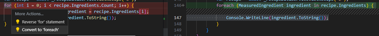

## [Convert between Get method and property 在 Get 方法和属性之间转换]()

### [Convert Get method to property 将 Get 方法转换为属性]()

**What:** Lets you convert a Get method into a property (and optionally your Set method).

​​​	内容：允许您将 Get 方法转换为属性（还可以选择 Set 方法）。

**When:** You have a Get method that does not contain any logic.

​​​	时机：您有一个不包含任何逻辑的 Get 方法。

**How-to:
操作方法：**

1. Place your cursor in your Get method name.
   将光标放在 Get 方法名称中。
2. Press Ctrl+.to trigger the **Quick Actions and Refactorings** menu.
   按 Ctrl+. 触发快速操作和重构菜单。
3. (Optional) If you have a Set method, you can also convert your Set method at this time. Select **Replace <Get method or Set method name> with property**.
   （可选）如果您有 Set 方法，您也可以此时转换您的 Set 方法。选择用属性替换 <获取方法或 Set 方法名称>。

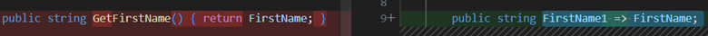

### [Convert property to Get method 将属性转换为获取方法]()

**What:** Lets you convert a property to a Get method

​​​	作用：允许您将属性转换为获取方法

**When:** You have a property that involves more than immediately setting and getting a value

​​​	时机：您有一个属性，它涉及的不仅仅是立即设置和获取值

**How-to:
操作方法：**

1. Place your cursor in your Get method name.
   将光标放在您的获取方法名称中。
2. Press Ctrl+.to trigger the **Quick Actions and Refactorings** menu.
   按 Ctrl+. 触发快速操作和重构菜单。
3. Select **Replace <property name> with method**.
   选择用方法替换 <属性名称>。

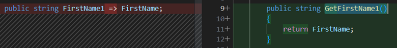

## [Convert between if and switch statements 在 if 和 switch 语句之间进行转换]()

**What:** Convert an `if` statement to a [switch statement](https://learn.microsoft.com/dotnet/csharp/language-reference/keywords/switch) or to the C# 8.0 [switch expression](https://learn.microsoft.com/dotnet/csharp/whats-new/csharp-8#switch-expressions).

​​​	作用：将 `if` 语句转换为 switch 语句或 C# 8.0 switch 表达式。

**When:** You want to convert an `if` statement to a `switch` statement or a `switch` expression and vice versa.

​​​	何时：您想将 `if` 语句转换为 `switch` 语句或 `switch` 表达式，反之亦然。

**Why:** If you are using an `if` statement, this refactoring enables an easy transition to switch statements or switch expressions.

​​​	原因：如果您正在使用 `if` 语句，此重构可轻松转换到 switch 语句或 switch 表达式。

**How-to:
操作方法：**

1. Place your cursor in the `if` keyword.
   将光标放在 `if` 关键字中。
2. Press Ctrl+.to trigger the **Quick Actions and Refactorings** menu.
   按 Ctrl+. 触发“快速操作和重构”菜单。
3. Select from the following options:
   从以下选项中选择：

Select **Convert to `switch` statement**.

​​​	选择转换为 `switch` 语句。

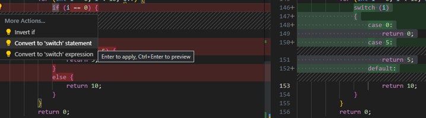

Select **Convert to `switch` expression**.

​​​	选择转换为 `switch` 表达式。

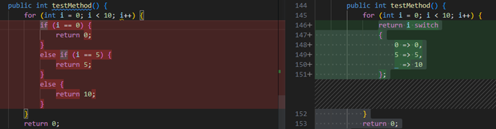

Select **Convert to `if` statement**.

​​​	选择转换为 `if` 语句。

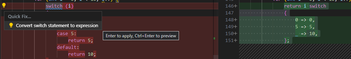

## [Convert between regular string and verbatim string 在常规字符串和原义字符串之间转换]()

**What:** Lets you convert between regular string and verbatim string literals.

​​​	内容：允许您在常规字符串和原义字符串文本之间进行转换。

**When:** You either want to save space or provide more clarity in your code.

​​​	时机：当您想要节省空间或在代码中提供更多清晰度时。

**Why:** Converting a verbatim string literal to a regular string literal can help save space. Converting a regular string literal to a verbatim string literal can provide more clarity.

​​​	原因：将原义字符串文本转换为常规字符串文本有助于节省空间。将常规字符串文本转换为原义字符串文本可以提供更多清晰度。

**How-to:
操作方法：**

1. Place your caret on either the regular string or verbatim string literal:
   将光标放在常规字符串或原义字符串文本上：
2. Press Ctrl+.to trigger the **Quick Actions and Refactorings** menu.
   按 Ctrl+. 触发快速操作和重构菜单。
3. Select from one of the following options:
   从以下选项中选择一个：

Select **Convert to regular string**.

​​​	选择转换为常规字符串。

Select **Convert to verbatim string**.

​​​	选择转换为原义字符串。

## [Convert class to record 将类转换为记录]()

**What:** Convert your class to a C# record.

​​​	内容：将类转换为 C# 记录。

**When:** When you want to quickly change your class to a record, which is tailored for storing data and immutability.

​​​	时机：当您想快速将类更改为记录时，记录专为存储数据和不可变性而设计。

**How-to:
操作方法：**

1. Place your cursor on the class name.
   将光标放在类名上。
2. Press Ctrl+.to trigger the **Quick Actions and Refactorings** menu.
   按 Ctrl+. 触发“快速操作和重构”菜单。
3. Select **Convert to positional record**.
   选择“转换为位置记录”。

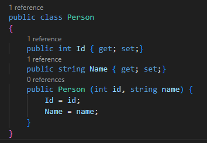

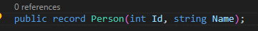

## [Convert local function to method 将局部函数转换为方法]()

**What:** Convert a local function to a method.

​​​	内容：将局部函数转换为方法。

**When:** You have a local function that you want to define outside your current local context.

​​​	时机：您有一个局部函数，您想在当前局部上下文之外定义它。

**Why:** You want to convert a local function into a method so that you can call it outside your local context. You might want to convert to a method when your local function is getting too long. When you define the function in a separate method, your code is easier to read.

​​​	原因：您想将局部函数转换为方法，以便可以在局部上下文之外调用它。当局部函数过长时，您可能需要转换为方法。当您在单独的方法中定义函数时，代码更易于阅读。

**How-to:
操作方法：**

1. Place your cursor in the local function.
   将光标放在本地函数中。
2. Press Ctrl+.to trigger the **Quick Actions and Refactorings** menu.
   按 Ctrl+. 触发快速操作和重构菜单。
3. Select **Convert to method**.
   选择转换为方法。

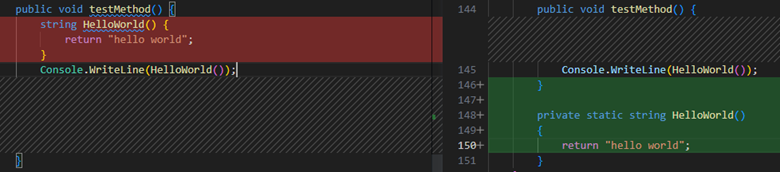

## [Convert numeric literal to hex, decimal, or binary number 将数字文字转换为十六进制、十进制或二进制数字]()

**What:** Convert a number between a hexadecimal, binary, or decimal number.

​​​	用途：在十六进制、二进制或十进制数字之间转换数字。

**When:** Use when you want to automatically convert a number to the desired base without having to manually calculate the conversion.

​​​	时机：当您想要自动将数字转换为所需进制而不必手动计算转换时使用。

**How-to:
操作方法：**

1. Place your cursor on the numeric literal.
   将光标放在数字文字上。
2. Press Ctrl+.to trigger the **Quick Actions and Refactorings** menu.
   按 Ctrl+. 触发快速操作和重构菜单。
3. Select one of the following options:
   选择以下选项之一：

Select **Convert to decimal**.

​​​	选择转换为十进制。

Select **Convert to hex**.

​​​	选择转换为十六进制。

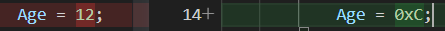

Select **Convert to binary**.

​​​	选择转换为二进制。

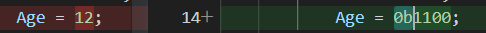

## [Convert placeholder to interpolated string 将占位符转换为插值字符串]()

**What:** Convert a `String.Format` formatted result string (or placeholder) to an interpolated string.

​​​	内容：将 `String.Format` 格式的结果字符串（或占位符）转换为插值字符串。

**When:** Use when you want to an interpolated string quickly.

​​​	时机：当您想快速获得插值字符串时使用。

**Why:** Interpolated strings can give you a more readable version of `String.Format` and can let you access your variable name directly.

​​​	原因：插值字符串可以为您提供更具可读性的 `String.Format` 版本，并且可以直接访问您的变量名。

**How-to:
操作方法：**

1. Place your cursor on the `String.Format` placeholder.
   将光标放在 `String.Format` 占位符上。
2. Press Ctrl+.to trigger the **Quick Actions and Refactorings** menu.
   按 Ctrl+. 触发快速操作和重构菜单。
3. Select **Convert to interpolated string**.
   选择转换为插值字符串。

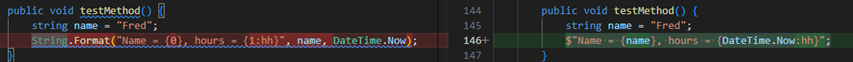

## [Convert regular string to interpolated string 将常规字符串转换为插值字符串]()

**What:** Change a regular string to an interpolated string.

​​​	作用：将常规字符串更改为插值字符串。

**When:** Use when you want to clean up your code and make it more readable.

​​​	时机：在您想要清理代码并使其更具可读性时使用。

**How-to:
操作方法：**

1. Place your cursor on the string you want to convert.
   将光标放在要转换的字符串上。
2. Press Ctrl+.to trigger the **Quick Actions and Refactorings** menu.
   按 Ctrl+. 触发快速操作和重构菜单。
3. Select **Convert to interpolated string**.
   选择转换为插值字符串。

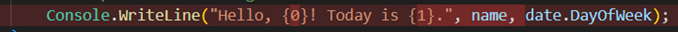

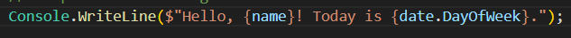

## [Convert tuple to struct 将元组转换为结构]()

**What:** Convert your tuple to a `struct`

​​​	内容：将元组转换为 `struct`

**When:** Use when want to quickly change your tuple to a `struct` and want to have fixed data you want to access multiple times.

​​​	时机：当您想快速将元组更改为 `struct` 并希望拥有固定数据以便多次访问时使用。

**How-to:
操作方法：**

1. Place your cursor on the tuple.

   ​​​	将光标放在元组上。

2. Press Ctrl+.to trigger the **Quick Actions and Refactorings** menu.

   ​​​	按 Ctrl+. 触发快速操作和重构菜单。

3. Select one of the following options:

   ​​​	选择以下选项之一：

   - Select **Convert to `struct` -> updating usages in containing member**
     选择转换为 `struct` -> 更新包含成员中的用法
   - Select **Convert to `struct` -> updating usages in containing type**
     选择转换为 `struct` -> 更新包含类型中的用法
   - Select **Convert to `struct` -> updating usages in containing project**
     选择转换为 `struct` -> 更新包含项目中的用法
   - Select **Convert to `struct` -> updating usages in in dependent projects**
     选择转换为 `struct` -> 更新依赖项目中的用法

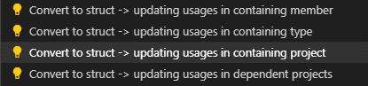

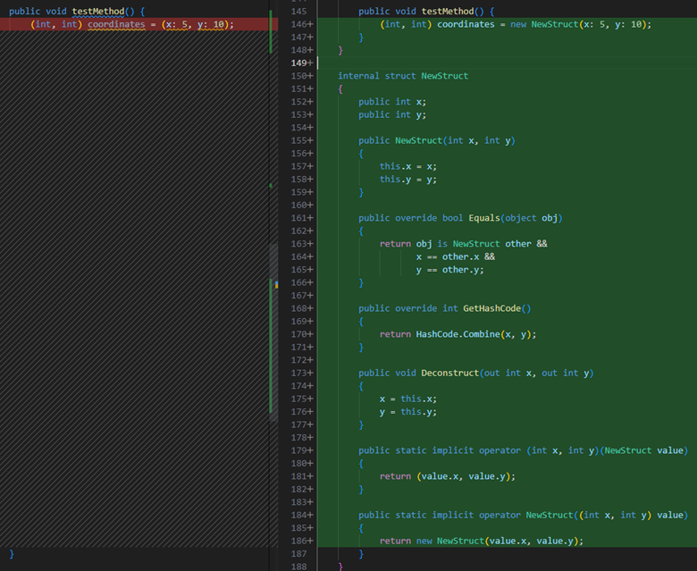

## [Encapsulate field 封装字段]()

**What:** Lets you turn a field into a property, and update all usages of that field to use the newly created property.

​​​	作用：允许您将字段转换为属性，并将该字段的所有用法更新为使用新创建的属性。

**When:** You want to move a field into a property, and update all references to that field.

​​​	时机：当您想将字段移至属性并更新对该字段的所有引用时。

**Why:** You want to give other classes access to a field, but don't want those classes to have direct access. By wrapping the field in a property, you could write code to verify the value being assigned, for example.

​​​	原因：您想让其他类访问字段，但不想让这些类具有直接访问权限。例如，通过将字段包装在属性中，您可以编写代码来验证正在分配的值。

**How-to:
操作方法：**

1. Place your cursor inside the name of the field to encapsulate.
   将光标放在要封装的字段名称内。
2. Press Ctrl+.to trigger the **Quick Actions and Refactorings** menu.
   按 Ctrl+. 触发快速操作和重构菜单。
3. Select one of the following:
   选择以下选项之一：

Select **Encapsulate field: <fieldname> (and use property)**.

​​​	选择封装字段：<字段名>（并使用属性）。

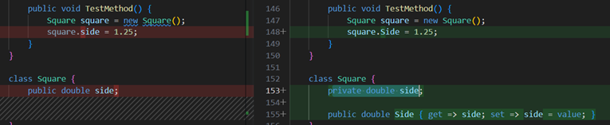

Select **Encapsulate field: <fieldname> (but still use field)**.

​​​	选择封装字段：<字段名>（但仍使用字段）。

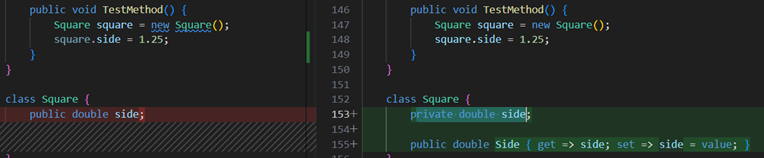

## [Generate comparison operators 生成比较运算符]()

**What:** Lets you generate Comparison operators for types that implement `IComparable`.

​​​	作用：允许您为实现 `IComparable` 的类型生成比较运算符。

**When:** You have a type that implements `IComparable` we will automatically add the comparison operators.

​​​	时机：当您拥有实现 `IComparable` 的类型时，我们将自动添加比较运算符。

**Why:** If you are implementing a value type, you should consider overriding the `Equals` method to gain increased performance over the default implementation of the `Equals` method on `ValueType`.

​​​	原因：如果您正在实现值类型，则应考虑重写 `Equals` 方法，以提高 `ValueType` 上 `Equals` 方法的默认实现的性能。

**How-to:
操作方法：**

1. Place your cursor either inside the class or on the IComparable keyword.
   将光标置于类内或 IComparable 关键字上。
2. Press Ctrl+.to trigger the **Quick Actions and Refactorings** menu.
   按 Ctrl+. 触发“快速操作和重构”菜单。
3. Select **Generate comparison operators** from the drop-down menu.
   从下拉菜单中选择“生成比较运算符”。

## [Generate default constructors 生成默认构造函数]()

**What:** Lets you immediately generate the code for a new default constructor on a class.

​​​	作用：允许您立即为类生成新默认构造函数的代码。

**When:** You introduce a new default constructor and want to properly declare it automatically.

​​​	何时：您引入一个新的默认构造函数并希望自动正确声明它。

**Why:** You could declare the constructor before using it, however this feature generates it automatically.

​​​	原因：您可以在使用构造函数之前声明它，但是此功能会自动生成它。

**How-to:
操作方法：**

1. Place your cursor on the class name.
   将光标放在类名上。
2. Press Ctrl+.to trigger the **Quick Actions and Refactorings** menu.
   按 Ctrl+. 触发快速操作和重构菜单。
3. Select **Generate constructor <classname>()**.
   选择生成构造函数 ()。

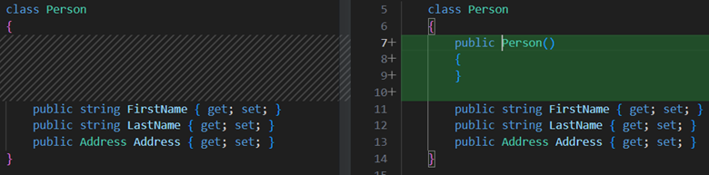

## [Generate parameter 生成参数]()

**What:** Automatically generates a method parameter.

​​​	内容：自动生成一个方法参数。

**When:** You reference a variable in a method that doesn't exist in the current context and receive an error; you can generate a parameter as a code fix.

​​​	何时：您在方法中引用了一个在当前上下文中不存在的变量并收到错误；您可以生成一个参数作为代码修复。

**Why:** You can quickly modify a method signature without losing context.

​​​	原因：您可以在不丢失上下文的情况下快速修改方法签名。

**How-to:
操作方法：**

1. Place your cursor in the variable name.
   将光标放在变量名中。
2. Press Ctrl+. to trigger the **Quick Actions and Refactoring**s menu.
   按 Ctrl+. 触发快速操作和重构菜单。
3. Select **Generate parameter**.
   选择生成参数。

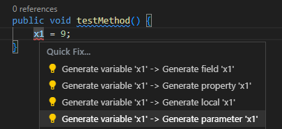

## [Implement all members explicitly 显式实现所有成员]()

**What:** Define your interface's methods explicitly in a class. An explicit interface implementation is a class member that is only called through the specified interface.

​​​	内容：在类中显式定义接口的方法。显式接口实现是仅通过指定接口调用的类成员。

**When:** Use when:

​​​	时机：在以下情况下使用：

- You don't want the same implementation to be called for multiple interfaces.
  您不希望对多个接口调用相同的实现。
- You want to resolve cases where two interfaces each declare different members of the same name such as a property and a method.
  您希望解决两种接口分别声明相同名称的不同成员（例如属性和方法）的情况。

**How-to:
操作方法：**

1. Place your cursor on an interface being implemented in a class.
   将光标放在类中正在实现的接口上。
2. Press Ctrl+.to trigger the **Quick Actions and Refactorings** menu.
   按 Ctrl+. 触发快速操作和重构菜单。
3. Select **Implement all members explicitly**:
   选择显式实现所有成员：

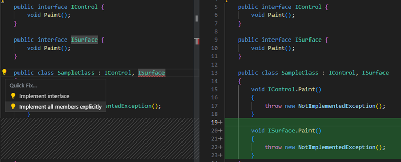

## [Implement all members implicitly 隐式实现所有成员]()

**What:** Define your interface's methods implicitly in a class. An implicit interface implementation is when an interface's methods and properties are directly added to the class as public methods.

​​​	作用：在类中隐式定义接口的方法。隐式接口实现是指将接口的方法和属性作为公共方法直接添加到类中。

**How-to:
方法：**

1. Place your cursor on an interface being implemented in a class.
   将光标放在类中正在实现的接口上。
2. Press Ctrl+.to trigger the **Quick Actions and Refactorings** menu.
   按 Ctrl+. 触发快速操作和重构菜单。
3. Select **Implement interface**:
   选择实现接口：

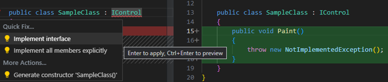

## [Inline method 内联方法]()

**What:** Inline method refactoring.

​​​	作用：内联方法重构。

**When:** You want to replace usages of a static, instance, and extension method within a single statement body with an option to remove the original method declaration.

​​​	何时：当您想用一个选项来替换单个语句体中静态方法、实例方法和扩展方法的使用情况，同时删除原始方法声明时。

**Why:** This refactoring provides a clearer syntax.

​​​	原因：此重构提供了更清晰的语法。

**How-to:
操作方法：**

1. Place your caret on the usage of the method.
   将光标放在方法的使用情况上。
2. Press Ctrl+.to trigger the **Quick Actions and Refactorings** menu.
   按 Ctrl+. 触发“快速操作和重构”菜单。
3. Select from one of the following options:
   从以下选项中选择一个：

Select **Inline <QualifiedMethodName>** to remove the inline method declaration:

​​​	选择“内联 ”以删除内联方法声明：

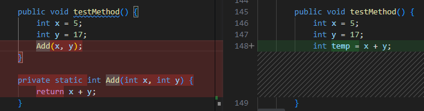

Select **Inline and keep <QualifiedMethodName>** to preserve the original method declaration:

​​​	选择“内联并保留 ”以保留原始方法声明：

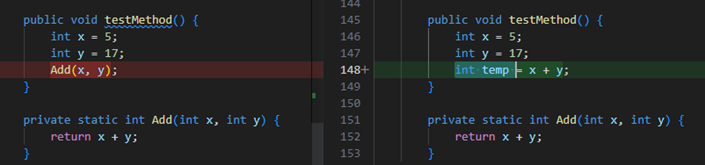

## [Inline temporary variable 内联临时变量]()

**What:** Lets you remove a temporary variable and replace it with its value instead.

​​​	内容：允许您删除临时变量并用其值替换它。

**When:** The use of the temporary variable makes the code harder to understand.

​​​	何时：使用临时变量会使代码更难理解。

**Why:** Removing a temporary variable may make the code easier to read.

​​​	原因：删除临时变量可能会使代码更易于阅读。

**How-to:
操作方法：**

1. Place your cursor inside the temporary variable to be inlined.
   将光标放在要内联的临时变量内。
2. Press Ctrl+.to trigger the **Quick Actions and Refactorings** menu.
   按 Ctrl+. 触发快速操作和重构菜单。
3. Select **Inline temporary variable**.
   选择内联临时变量。

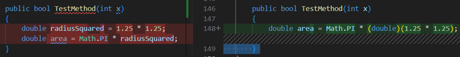

## [Introduce local variable for expression 为表达式引入局部变量]()

**What:** Lets you immediately generate a local variable to replace an existing expression.

​​​	作用：允许您立即生成一个局部变量来替换现有表达式。

**When:** You have code that could be easily reused later if it were in a local variable.

​​​	何时：如果您有可以轻松地在局部变量中重复使用的代码。

**Why:** You could copy and paste the code multiple times to use it in various locations, however it would be better to perform the operation once, store the result in a local variable, and use the local variable throughout.

​​​	原因：您可以复制并粘贴代码多次以在各个位置使用它，但是最好执行一次操作，将结果存储在局部变量中，并在整个过程中使用局部变量。

**How-to:
操作方法：**

1. Place your caret on the expression that you want to assign to a new local variable.
   将光标放在要分配给新局部变量的表达式上。
2. Press Ctrl+.to trigger the **Quick Actions and Refactorings** menu.
   按 Ctrl+. 触发快速操作和重构菜单。
3. Select from the following options:
   从以下选项中选择：

Select **Introduce local -> Introduce local for <expression>**

​​​	选择引入局部 -> 为 引入局部

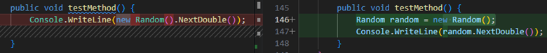

Select **Introduce local -> Introduce local for all occurrences of <expression>**

​​​	选择引入局部 -> 为 的所有出现引入局部

## [Introduce parameter 引入参数]()

**What:** Lets you immediately generate a new parameter to replace an existing expression.

​​​	作用：允许您立即生成一个新参数来替换现有表达式。

**When:** You have code that could be easily reused later if it were in a parameter.

​​​	时机：如果您有可以轻松地在参数中重复使用的代码。

**Why:** You could copy and paste the code multiple times to use it in various locations, however it would be better to perform the operation once, store the result in a parameter, and use the parameter throughout.

​​​	原因：您可以多次复制和粘贴代码以在各个位置使用它，但是最好执行一次操作，将结果存储在参数中，并在整个过程中使用该参数。

**How-to:
操作方法：**

1. Place your caret on the expression that you want to assign to a new parameter.
   将光标放在要分配给新参数的表达式上。
2. Press Ctrl+.to trigger the **Quick Actions and Refactorings** menu.
   按 Ctrl+. 触发快速操作和重构菜单。
3. Select from the following options:
   从以下选项中选择：

Select **Introduce parameter for <expression> -> and update call sites directly**

​​​	选择为 引入参数 -> 并直接更新调用站点

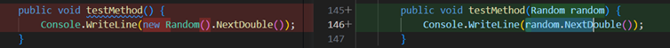

Select **Introduce parameter for <expression> -> into extracted method**

​​​	选择为 引入参数 -> 到提取的方法中

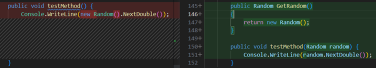

Select **Introduce parameter for <expression> -> into new overload**

​​​	选择为 引入参数 -> 到新的重载中

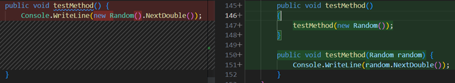

## [Introduce using statement 引入 using 语句]()

**What:** Add a `using` statement / code block to your `IDisposable` instance.

​​​	内容：向 `IDisposable` 实例添加 `using` 语句/代码块。

**When:** You have an `IDisposable` instance that you want to ensure is acquired, used, and disposed correctly.

​​​	时机：当您有一个 `IDisposable` 实例，您希望确保正确获取、使用和处置它时。

**How-to:
操作方法：**

1. Place your caret on the expression that you want to assign to a new parameter.
   将光标放在要分配给新参数的表达式上。
2. Press Ctrl+.to trigger the **Quick Actions and Refactorings** menu.
   按 Ctrl+. 触发快速操作和重构菜单。
3. Select **Introduce `using` statement**.
   选择引入 `using` 语句。

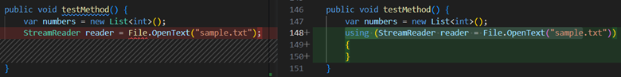

## [Invert conditional expressions and logical operations 反转条件表达式和逻辑运算]()

**What:** Lets you invert a conditional expression or a conditional `and` \ `or` operator.

​​​	作用：允许您反转条件表达式或条件 `and` \ `or` 运算符。

**When:** You have a conditional expression or conditional `and` \ `or` operator that would be better understood if inverted.

​​​	时机：当您有条件表达式或条件 `and` \ `or` 运算符，反转后更易理解时。

**Why:** Inverting an expression or conditional `and` \ `or` operator by hand can take much longer and possibly introduce errors. This code fix helps you do this refactoring automatically.

​​​	原因：手动反转表达式或条件 `and` \ `or` 运算符可能需要更长时间，并且可能会引入错误。此代码修复可帮助您自动执行此重构。

**How-to:
操作方法：**

1. Place your cursor in a conditional expression or a conditional `and` \ `or` operator.
   将光标放在条件表达式或条件 `and` \ `or` 运算符中。
2. Press Ctrl+.to trigger the **Quick Actions and Refactorings** menu.
   按 Ctrl+. 触发快速操作和重构菜单。
3. Select **Invert conditional** or **Replace `&&` with `||`**
   选择反转条件或用 `||` 替换 `&&`

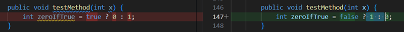

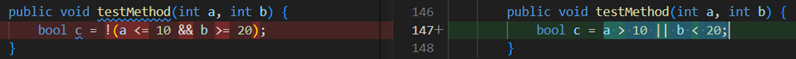

## [Invert if 反转 if]()

**What:** Lets you invert an `if` or `if else` statement without changing the meaning of the code.

​​​	用途：允许您反转 `if` 或 `if else` 语句，而无需更改代码的含义。

**When:** When you have an `if` or `if else` statement that would be better understood when inverted.

​​​	时机：当您有 `if` 或 `if else` 语句时，反转后会更容易理解。

**Why:** Inverting an `if` or `if else` statement by hand can take much longer and possibly introduce errors. This code fix helps you do this refactoring automatically.

​​​	原因：手动反转 `if` 或 `if else` 语句可能需要更长时间，并且可能会引入错误。此代码修复可帮助您自动执行此重构。

**How-to:
操作方法：**

1. Place your cursor in an `if` or `if else` statement.
   将光标放在 `if` 或 `if else` 语句中。
2. Press Ctrl+.to trigger the **Quick Actions and Refactorings** menu.
   按 Ctrl+. 触发快速操作和重构菜单。
3. Select **Invert `if`**.
   选择反转 `if` 。

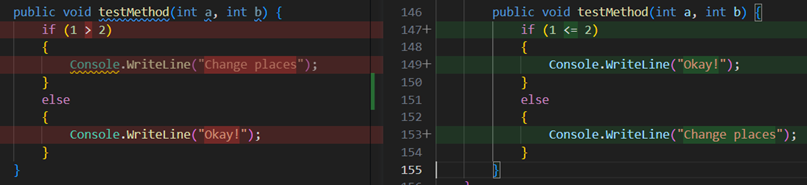

## [Make member static 使成员变为静态]()

**What:** Make a member static.

​​​	作用：使成员变为静态。

**When:** You want a non-static member to be static.

​​​	时机：您希望非静态成员变为静态时。

**Why:** Static members improve readability: knowing that specific code is isolated makes it easier to understand, reread, and reuse.

​​​	原因：静态成员提高了可读性：知道特定代码是隔离的，这使得理解、重读和重用变得更容易。

**How-to:
操作方法：**

1. Place your caret on the member name.
   将光标放在成员名称上。
2. Press Ctrl+.to trigger the **Quick Actions and Refactorings** menu.
   按 Ctrl+. 触发快速操作和重构菜单。
3. Select **Make static**.
   选择“使成员变为静态”。

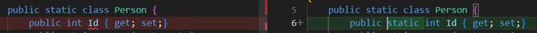

## [Move declaration near reference 将声明移至引用附近]()

**What:** Lets you move variable declarations closer to their usage.

​​​	作用：允许您将变量声明移至更靠近其使用位置。

**When:** You have variable declarations that can be in a narrower scope.

​​​	何时：您有可以缩小范围的变量声明。

**Why:** You could leave it as it is, but that may cause readability issues or information hiding. This is a chance to refactor to improve readability.

​​​	原因：您可以保持原样，但这可能会导致可读性问题或信息隐藏。这是一个重构以提高可读性的机会。

**How-to:
操作方法：**

1. Place your cursor in the variable declaration.
   将光标放在变量声明中。
2. Press Ctrl+.to trigger the **Quick Actions and Refactorings** menu.
   按 Ctrl+. 触发快速操作和重构菜单。
3. Select **Move declaration near reference**.
   选择将声明移至引用附近。

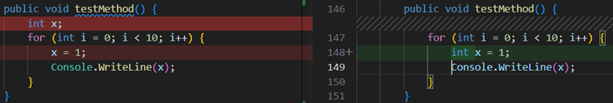

## [Move type to matching file 将类型移至匹配的文件]()

**What:** Lets you move the selected type to a separate file with the same name.

​​​	内容：允许您将选定的类型移至具有相同名称的单独文件中。

**When:** You have multiple classes, structs, interfaces, etc. in the same file that you want to separate.

​​​	何时：您在同一文件中有多个类、结构、接口等，您希望将它们分开。

**Why:** Placing multiple types in the same file can make it difficult to find these types. By moving types to files with the same name, code becomes more readable and easier to navigate.

​​​	原因：将多个类型放在同一个文件中可能会使查找这些类型变得困难。通过将类型移至具有相同名称的文件，代码变得更具可读性和更易于导航。

**How-to:
操作方法：**

1. Place the cursor inside the name of the type where it is defined.
   将光标放在定义类型的名称内。
2. Press Ctrl+.to trigger the **Quick Actions and Refactorings** menu.
   按 Ctrl+. 触发“快速操作和重构”菜单。
3. Select **Move type to <typename>.cs**.
   选择“将类型移至 .cs”。

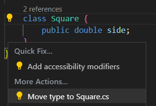

## [Reverse for statement 反向 for 语句]()

**What:** Lets you invert a `for` statement.

​​​	作用：允许您反转 `for` 语句。

**When:** Use when you want to reverse the meaning of a `for` statement and how it iterates.

​​​	时机：当您想要反转 `for` 语句的含义及其迭代方式时使用。

**Why:** Inverting a `for` statement by hand can take much longer and possibly introduce errors. This code fix helps you do this refactoring automatically.

​​​	原因：手动反转 `for` 语句可能需要更长时间，并且可能会引入错误。此代码修复可帮助您自动执行此重构。

**How-to:
操作方法：**

1. Place your cursor in the `for` statement.
   将光标放在 `for` 语句中。
2. Press Ctrl+.to trigger the **Quick Actions and Refactorings** menu.
   按 Ctrl+. 触发快速操作和重构菜单。
3. Select **Reverse `for` statement**.
   选择反转 `for` 语句。

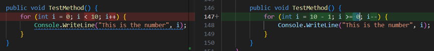

## [Split or merge if statements 拆分或合并 if 语句]()

**What:** Split or merge `if` statements.

​​​	内容：拆分或合并 `if` 语句。

**When:** You want to split an `if` statement that uses the `&&` or `||` operators into a nested `if` statement, or merge an `if` statement with an outer `if` statement.

​​​	时机：当您想将使用 `&&` 或 `||` 运算符的 `if` 语句拆分为嵌套 `if` 语句，或将 `if` 语句与外部 `if` 语句合并时。

**Why:** It's a matter of style preference.

​​​	原因：这是一种风格偏好问题。

**How-to:
操作方法：**

If you want to split the `if` statement:

​​​	如果您想拆分 `if` 语句：

1. Place your cursor in the `if` statement by the `&&` or `||` operator.
   将光标放在 `if` 语句中的 `&&` 或 `||` 运算符旁边。
2. Press Ctrl+.to trigger the **Quick Actions and Refactorings** menu.
   按 Ctrl+. 触发快速操作和重构菜单。
3. Select **Split into nested `if` statements**.
   选择拆分为嵌套 `if` 语句。

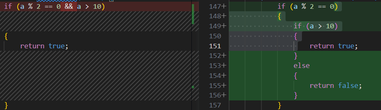

If you want to merge the inner `if` statement with the outer `if` statement:

​​​	如果要将内部 `if` 语句与外部 `if` 语句合并：

1. Place your cursor in the inner `if` keyword.
   将光标放在内部 `if` 关键字中。
2. Press Ctrl+.to trigger the **Quick Actions and Refactorings** menu.
   按 Ctrl+. 触发“快速操作和重构”菜单。
3. Select **Merge with nested `if` statement**.
   选择“与嵌套 `if` 语句合并”。

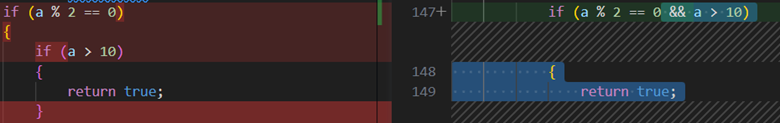

## [Use explicit type 使用显式类型]()

**What:** Use this refactoring to replace `var` in a local variable declaration with an explicit type.

​​​	作用：使用此重构可将局部变量声明中的 `var` 替换为显式类型。

**Why:** To improve the code's readability or when you don't want to initialize the variable in the declaration.

​​​	原因：为了提高代码的可读性，或者当您不想在声明中初始化变量时。

However, [var](https://learn.microsoft.com/dotnet/csharp/language-reference/keywords/var) must be used when a variable is initialized with an anonymous type and the properties of the object are accessed at a later point. For more information, see [Implicitly typed local variables (C#)](https://learn.microsoft.com/dotnet/csharp/programming-guide/classes-and-structs/implicitly-typed-local-variables).

​​​	但是，当使用匿名类型初始化变量并在稍后访问对象的属性时，必须使用 var。有关详细信息，请参阅隐式类型化局部变量 (C#)。

**How-to:
操作方法：**

1. Place the caret on the `var` keyword.
   将插入符号放在 `var` 关键字上。
2. Press Ctrl+.to trigger the **Quick Actions and Refactorings** menu.
   按 Ctrl+. 触发快速操作和重构菜单。
3. Select **Use explicit type instead of `var`**.
   选择使用显式类型代替 `var` 。

## [Use implicit type 使用隐式类型]()

**What:** Use this refactoring to replace an explicit type in a local variable declaration with `var`.

​​​	用途：使用此重构来用 `var` 替换局部变量声明中的显式类型。

**Why:** To fit your personal coding conventions and to have less code displayed. [Var](https://learn.microsoft.com/dotnet/csharp/language-reference/keywords/var) must be used when a variable is initialized with an anonymous type and the properties of the object are accessed at a later point. For more information, see [Implicitly typed local variables (C#)](https://learn.microsoft.com/dotnet/csharp/programming-guide/classes-and-structs/implicitly-typed-local-variables).

​​​	原因：为了符合您的个人编码约定并减少显示的代码。当使用匿名类型初始化变量并在稍后访问对象的属性时，必须使用 Var。有关详细信息，请参阅隐式类型局部变量 (C#)。

**How-to:
操作方法：**

1. Place the caret on the explicit type keyword.
   将插入符号放在显式类型关键字上。
2. Press Ctrl+.to trigger the **Quick Actions and Refactorings** menu.
   按 Ctrl+. 触发快速操作和重构菜单。
3. Select **Use implicit type**.
   选择使用隐式类型。

## [Use lambda expression or block body 使用 lambda 表达式或块主体]()

**What:** Lets you refactor a lambda expression to use an expression body or a block body.

​​​	内容：允许您重构 lambda 表达式以使用表达式主体或块主体。

**When:** You prefer lambda expressions to use either an expression body or a block body.

​​​	时机：您希望 lambda 表达式使用表达式主体或块主体。

**Why:** Lambda expressions can be refactored to improve readability according to your user preference.

​​​	原因：可以根据您的用户偏好重构 lambda 表达式以提高可读性。

**How-to:
操作方法：**

1. Place your cursor on the right of a lambda operator.
   将光标放在 lambda 运算符的右侧。
2. Press Ctrl+.to trigger the **Quick Actions and Refactorings** menu.
   按 Ctrl+. 触发快速操作和重构菜单。
3. Select one of the following:
   选择以下选项之一：

Select **Use block body for lambda expressions**.

​​​	选择对 lambda 表达式使用块主体。

Select **Use expression body for lambda expressions**.

​​​	选择对 lambda 表达式使用表达式主体。

## [Use recursive patterns 使用递归模式]()

**What:** Converts a code block to using a recursive pattern. This refactoring works with switch statements, property pattern matching, tuple pattern matching, and positional pattern matching.

​​​	内容：将代码块转换为使用递归模式。此重构适用于 switch 语句、属性模式匹配、元组模式匹配和位置模式匹配。

**When:** Using recursive patterns can make your code more readable / cleaner.

​​​	时机：使用递归模式可以使您的代码更具可读性/更简洁。

**How-to:
操作方法：**

1. Place your cursor on the expression you want to convert to a recursive pattern.
   将光标放在要转换为递归模式的表达式上。
2. Press Ctrl+.to trigger the **Quick Actions and Refactorings** menu.
   按 Ctrl+. 触发快速操作和重构菜单。
3. Select one of the following:
   选择以下选项之一：

Select **Convert `switch` statement to expression**.

​​​	选择将 `switch` 语句转换为表达式。

Select **Use recursive patterns**.

​​​	选择使用递归模式。

## [Wrap, indent, and align refactorings 换行、缩进和对齐重构]()

### [Wrap and align call chains 换行并对齐调用链]()

**What:** Lets you wrap and align chains of method calls.

​​​	作用：允许您换行并对齐方法调用链。

**When:** You have a long chain consisting of several method calls in one statement.

​​​	时机：当您在一个语句中具有由多个方法调用组成的长链时。

**Why:** Reading a long list is easier when they're wrapped or indented according to user preference.

​​​	原因：根据用户偏好换行或缩进时，阅读长列表会更容易。

**How-to:
操作方法：**

1. Place your cursor in any of the call chains.
   将光标放在任何调用链中。
2. Press Ctrl+.to trigger the **Quick Actions and Refactorings** menu.
   按 Ctrl+. 触发快速操作和重构菜单。
3. Select **Wrap call chain** or **Wrap and align call chain** to accept the refactoring.
   选择换行调用链或换行并对齐调用链以接受重构。

### [Wrap, indent, and align parameters or arguments 换行、缩进并对齐参数或参数]()

**What:** Lets you wrap, indent, and align parameters or arguments.

​​​	作用：允许您换行、缩进并对齐参数或参数。

**When:** You have a method declaration or call that has multiple parameters or arguments.

​​​	何时：您有一个具有多个参数或自变量的方法声明或调用。

**Why:** Reading a long list of parameters or arguments is easier when they're wrapped or indented according to user preference.

​​​	原因：根据用户偏好换行或缩进长参数或自变量列表时，阅读起来更轻松。

**How-to:
操作方法：**

1. Place your cursor in a parameter list.
   将光标放在参数列表中。
2. Press Ctrl+.to trigger the **Quick Actions and Refactorings** menu.
   按 Ctrl+. 触发快速操作和重构菜单。
3. Select from the following options:
   从以下选项中选择：

Select **Wrap every parameter -> Align wrapped parameters**

​​​	选择换行每个参数 -> 对齐换行的参数

Select **Wrap every parameter -> Indent all parameters**

​​​	选择换行每个参数 -> 缩进所有参数

Select **Wrap every parameter -> Indent wrapped parameters**

​​​	选择换行每个参数 -> 缩进换行的参数

### [Wrap binary expressions 换行二元表达式]()

**What:** Lets you wrap binary expressions.

​​​	作用：允许您包装二进制表达式。

**When:** You have a binary expression.

​​​	时机：您有一个二进制表达式。

**Why:** Reading a binary expression is easier when it is wrapped to user preference.

​​​	原因：当二进制表达式包装成用户首选项时，阅读起来更容易。

**How-to:
操作方法：**

1. Place your cursor in the binary expression.
   将光标放在二进制表达式中。
2. Press Ctrl+.to trigger the **Quick Actions and Refactorings** menu.
   按 Ctrl+. 触发快速操作和重构菜单。
3. Select **Wrap expression** to accept the refactoring.
   选择包装表达式以接受重构。

