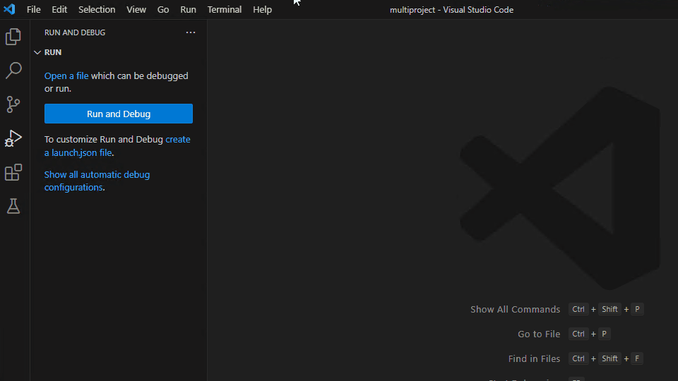
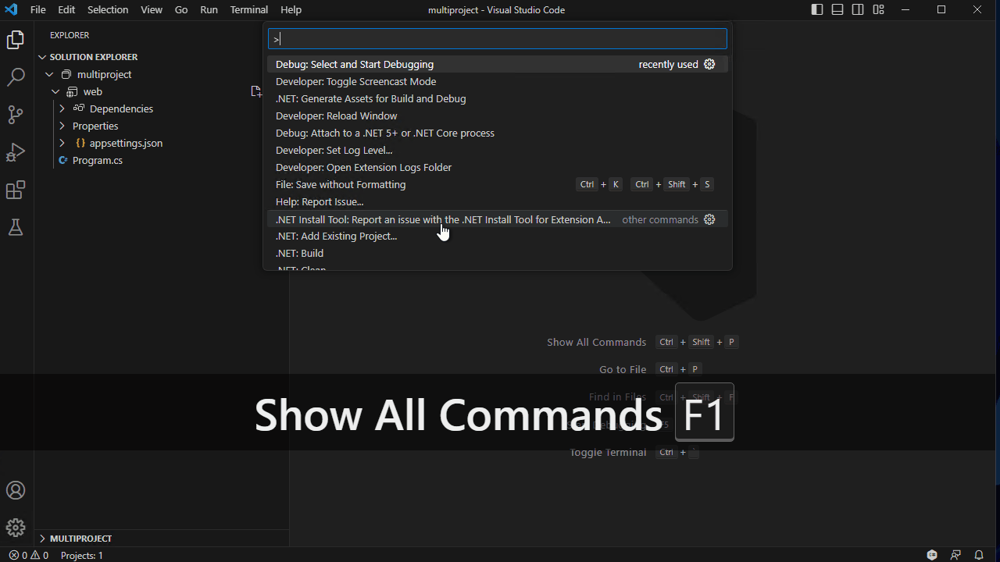
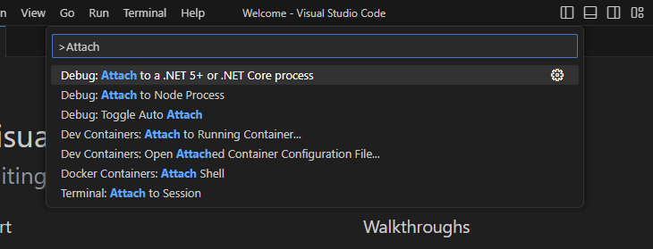
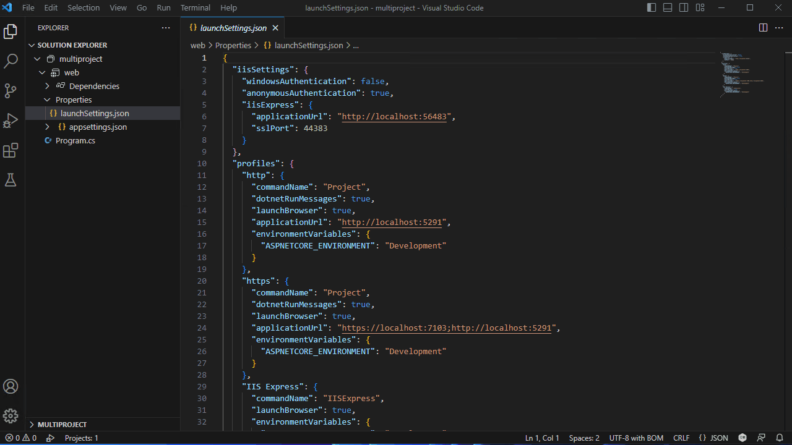
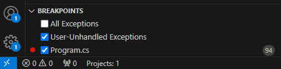

+++
title = "Run and Debug"
date = 2024-01-12T22:36:24+08:00
weight = 90
type = "docs"
description = ""
isCJKLanguage = true
draft = false
+++

> 原文: [https://code.visualstudio.com/docs/csharp/debugging](https://code.visualstudio.com/docs/csharp/debugging)

# Debugging 调试


You can debug C# applications in Visual Studio Code using the [Microsoft C#](https://marketplace.visualstudio.com/items?itemName=ms-dotnettools.csharp) extension.

​​​	您可以在 Visual Studio Code 中使用 Microsoft C# 扩展调试 C# 应用程序。

## [Run and Debug 运行和调试]()

The [C#](https://marketplace.visualstudio.com/items?itemName=ms-dotnettools.csharp) extension along with [C# Dev Kit](https://marketplace.visualstudio.com/items?itemName=ms-dotnettools.csdevkit) provides multiple ways to run and debug your C# application.

​​​	C# 扩展与 C# Dev Kit 一起提供了多种运行和调试 C# 应用程序的方法。

To run and debug without C# Dev Kit, see [Microsoft C# extension's GitHub page](https://aka.ms/vscode/coreclr/debug) for documentation.

​​​	若要运行和调试而不使用 C# Dev Kit，请参阅 Microsoft C# 扩展的 GitHub 页面以获取文档。

### [Debug with F5 使用 F5 调试]()

With the C# Dev Kit extension installed and no debug configurations available to select in the Debug view, you can start debugging your project by having a `.cs` file opened and then pressing F5. The debugger will automatically find your project and start debugging. If you have multiple projects, it will prompt for which project you would like to start debugging.

​​​	安装了 C# Dev Kit 扩展且在“调试”视图中没有可供选择的调试配置时，您可以通过打开 `.cs` 文件然后按 F5 来开始调试项目。调试器将自动查找您的项目并开始调试。如果您有多个项目，它将提示您要开始调试哪个项目。

You can also start a debugging session from the **Run and Debug** view from the side bar of VS Code. See more at [Debugging in VS Code]().

​​​	您还可以从 VS Code 侧边栏的“运行和调试”视图开始调试会话。请参阅 VS Code 中的调试了解更多信息。


### [Debug with Solution Explorer 使用解决方案资源管理器调试]()

With the C# Dev Kit extension installed, there is a **Debug** context menu when you right-click on your project in the Solution Explorer.

​​​	安装了 C# Dev Kit 扩展后，在解决方案资源管理器中右键单击项目时，会出现“调试”上下文菜单。

There are three options:

​​​	有三个选项：

- **Start New Instance** - This starts your project with a debugger attached.
  启动新实例 - 这将启动您的项目并附加调试器。
- **Start without Debugging** - This runs your project without a debugger attached.
  不带调试启动 - 这会在不附加调试器的情况下运行您的项目。
- **Step into New Instance** - This starts your project with a debugger attached but stops at the entrypoint of your code.
  进入新实例 - 这会启动您的项目，并附加调试器，但在代码的入口点处停止。


### [Debug with Command Palette 使用命令面板进行调试]()

With the C# Dev Kit extension installed, you can also start debugging from the Command Palette Ctrl+Shift+P by using the **Debug: Select and Start Debugging** command.

​​​	安装了 C# Dev Kit 扩展后，您还可以通过使用“调试：选择并开始调试”命令，从命令面板 Ctrl+Shift+P 开始调试。

Note: This adds a launch configuration entry to your debug dropdown list.

​​​	注意：这会向您的调试下拉列表中添加一个启动配置条目。


### [Debug with dynamic (in-memory) launch configurations 使用动态（内存中）启动配置进行调试]()

With the C# Dev Kit extension installed, you can create dynamic launch configurations. How you create them depends if your project has an existing `launch.json` file.

​​​	安装了 C# Dev Kit 扩展后，您可以创建动态启动配置。创建方式取决于您的项目是否有现有的 `launch.json` 文件。

#### [Existing launch.json 现有的 launch.json]()

If you have an existing `launch.json`, you can go to the Debug view, select the dropdown, and select the `C#` option. This should give you a selection of launch targets that you can add to your dropdown list. After selecting, you can hit F5 or **Start Debugging** with the newly generated configuration.

​​​	如果您有现有的 `launch.json` ，则可以转到“调试”视图，选择下拉列表，然后选择 `C#` 选项。这应该会为您提供一些启动目标，您可以将它们添加到您的下拉列表中。选择后，您可以按 F5 或使用新生成的配置开始调试。


#### [No launch.json 没有 launch.json]()

If you do not have a `launch.json` in your project, you can add and access these dynamic configurations in the **Show all automatic debug configurations** in the Debug view.

​​​	如果您的项目中没有 `launch.json` ，您可以在“调试”视图中显示所有自动调试配置，以添加和访问这些动态配置。



#### [Removing dynamic (in-memory) launch configurations 删除动态（内存中）启动配置]()

You can remove the generated configurations with Command Palette Ctrl+Shift+P and using the command **Debug: Select and Start Debugging**.

​​​	您可以使用命令面板 Ctrl+Shift+P 和命令“调试：选择并开始调试”删除生成的配置。

In the dropdown, it lists all your existing debug configurations. If you hover over the dynamic configurations, a clickable trashcan icon appears on the right. You can select that icon to remove the dynamic configuration.

​​​	在下拉列表中，它会列出您所有现有的调试配置。如果您将鼠标悬停在动态配置上，右侧会出现一个可点击的垃圾桶图标。您可以选择该图标以删除动态配置。



### [Debug with launch.json 使用 launch.json 进行调试]()

If you are using the C# Dev Kit, we recommend not using this option. However, if you have the need to modify the debug configuration directly, see [Configuring launch.json for C# debugging](https://code.visualstudio.com/docs/csharp/debugger-settings).

​​​	如果您使用的是 C# Dev Kit，我们建议不要使用此选项。但是，如果您需要直接修改调试配置，请参阅针对 C# 调试配置 launch.json。

## [Attaching to a process 附加到进程]()

You can attach to a C# process using with the Command Palette Ctrl+Shift+P and running the **Debug: Attach to a .NET 5+ or .NET Core process** command.

​​​	您可以使用命令面板 Ctrl+Shift+P 并运行“调试：附加到 .NET 5+ 或 .NET Core 进程”命令，附加到 C# 进程。



## [Configuration options 配置选项]()

There are many options and settings available to configure the debugger. You can use `launchSettings.json`, VS Code [User Settings]() to modify your debug options, or directly modify your `launch.json`.

​​​	有很多选项和设置可用于配置调试器。您可以使用 `launchSettings.json` 、VS Code 用户设置来修改您的调试选项，或直接修改您的 `launch.json` 。

### [launchSettings.json]()

If you have `launchSettings.json` from Visual Studio, you should see your profiles listed using [Run from F5]() or [Run from Command Palette]().

​​​	如果您从 Visual Studio 中拥有 `launchSettings.json` ，您应该会看到使用 F5 运行或从命令面板运行列出的配置文件。



Refer to [Configuring C# debugging](https://code.visualstudio.com/docs/csharp/debugger-settings) for more details.

​​​	有关更多详细信息，请参阅配置 C# 调试。

### [User settings 用户设置]()

If you have settings that you wish to change while using the C# debugger, you can find these options under **File** > **Preferences** > **Settings** (Ctrl+,) and searching for these options.

​​​	如果您在使用 C# 调试器时希望更改设置，您可以在“文件”>“首选项”>“设置”(Ctrl+,) 下找到这些选项并搜索这些选项。

- `csharp.debug.stopAtEntry` - If true, the debugger should stop at the entry point of the target. This option defaults to `false`.
  `csharp.debug.stopAtEntry` - 如果为 true，调试器应在目标的入口点处停止。此选项默认为 `false` 。

- ```
  csharp.debug.console
  ```

   

  \- When launching console projects, indicates which console the target program should be launched into.

   

  Note:

   

  This option is only used for the 'dotnet' debug configuration type.

  
  `csharp.debug.console` - 启动控制台项目时，指示应将目标程序启动到哪个控制台。注意：此选项仅用于“dotnet”调试配置类型。

  - `internalConsole` [Default] - VS Code's Debug Console. This mode allows you to see messages from both the debugger and the target program in one place. Refer to [full documentation](https://code.visualstudio.com/docs/csharp/debugger-settings#_console-terminal-window) for more details.
    `internalConsole` [默认] - VS Code 的调试控制台。此模式允许您在一个位置查看来自调试器和目标程序的消息。有关更多详细信息，请参阅完整文档。
  - `integratedTerminal` - VS Code's integrated terminal.
    `integratedTerminal` - VS Code 的集成终端。
  - `externalTerminal` - External terminal that can be configured via user settings.
    `externalTerminal` - 可通过用户设置配置的外部终端。

- `csharp.debug.sourceFileMap` - Maps build-time paths to local source locations. All instances of build-time path will be replaced with the local source path.
  `csharp.debug.sourceFileMap` - 将生成时路径映射到本地源位置。生成时路径的所有实例都将替换为本地源路径。
    Example:
  示例：
      `{\"<build-path>\":\"<local-source-path>\"}`

- `csharp.debug.justMyCode` - When enabled (the default), the debugger only displays and steps into user code ("My Code"), ignoring system code and other code that is optimized or that does not have debugging symbols. [More information](https://code.visualstudio.com/docs/csharp/debugger-settings#_just-my-code).
  `csharp.debug.justMyCode` - 启用时（默认），调试器仅显示和逐步执行用户代码（“我的代码”），忽略系统代码和其他经过优化或没有调试符号的代码。更多信息。

- `csharp.debug.requireExactSource` - Flag to require current source code to match the pdb. This option defaults to `true`.
  `csharp.debug.requireExactSource` - 标记以要求当前源代码与 pdb 匹配。此选项默认为 `true` 。

- `csharp.debug.enableStepFiltering` - Flag to enable stepping over Properties and Operators. This option defaults to `true`.
  `csharp.debug.enableStepFiltering` - 标记以启用跨属性和运算符的单步执行。此选项默认为 `true` 。

- `csharp.debug.logging.exceptions` - Flag to determine whether exception messages should be logged to the output window. This option defaults to `true`.
  `csharp.debug.logging.exceptions` - 标记以确定是否应将异常消息记录到输出窗口。此选项默认为 `true` 。

- `csharp.debug.logging.moduleLoad` - Flag to determine whether module load events should be logged to the output window. This option defaults to `true`.
  `csharp.debug.logging.moduleLoad` - 标记以确定是否应将模块加载事件记录到输出窗口。此选项默认为 `true` 。

- `csharp.debug.logging.programOutput` - Flag to determine whether program output should be logged to the output window when not using an external console. This option defaults to `true`.
  `csharp.debug.logging.programOutput` - 标记以确定在不使用外部控制台时是否应将程序输出记录到输出窗口。此选项默认为 `true` 。

- `csharp.debug.logging.diagnosticsLog` - Various settings used to diagnose issues with the debugger.
  `csharp.debug.logging.diagnosticsLog` - 用于诊断调试器问题的各种设置。

- `csharp.debug.logging.browserStdOut` - Flag to determine if stdout text from the launching the web browser should be logged to the output window. This option defaults to `true`.
  `csharp.debug.logging.browserStdOut` - 标记以确定是否应将从启动 Web 浏览器中获得的 stdout 文本记录到输出窗口。此选项默认为 `true` 。

- `csharp.debug.logging.elapsedTiming` - If true, engine logging includes `adapterElapsedTime` and `engineElapsedTime` properties to indicate the amount of time, in microseconds, that a request took. This option defaults to `false`.
  `csharp.debug.logging.elapsedTiming` - 如果为 true，引擎日志记录将包含 `adapterElapsedTime` 和 `engineElapsedTime` 属性，以指示请求花费的时间（以微秒为单位）。此选项默认为 `false` 。

- `csharp.debug.logging.threadExit` - Controls if a message is logged when a thread in the target process exits. This option defaults to `false`.
  `csharp.debug.logging.threadExit` - 控制在目标进程中的线程退出时是否记录消息。此选项默认为 `false` 。

- `csharp.debug.logging.processExit` - Controls if a message is logged when the target process exits, or debugging is stopped. This option defaults to `true`.
  `csharp.debug.logging.processExit` - 控制在目标进程退出或停止调试时是否记录消息。此选项默认为 `true` 。

- `csharp.debug.suppressJITOptimizations` - If true, when an optimized module (.dll compiled in the Release configuration) loads in the target process, the debugger asks the Just-In-Time compiler to generate code with optimizations disabled. [More information](https://code.visualstudio.com/docs/csharp/debugger-settings#_suppress-jit-optimizations)
  `csharp.debug.suppressJITOptimizations` - 如果为 true，当优化后的模块（在 Release 配置中编译的 .dll）加载到目标进程中时，调试器会要求及时 (JIT) 编译器生成已禁用优化的代码。更多信息

- `csharp.debug.symbolOptions.searchPaths` - Array of symbol server URLs (example: `http://MyExampleSymbolServer`) or directories (example: /build/symbols) to search for .pdb files. These directories will be searched in addition to the default locations next to the module and the path where the pdb was originally dropped to.
  `csharp.debug.symbolOptions.searchPaths` - 符号服务器 URL 数组（示例： `http://MyExampleSymbolServer` ）或要搜索 .pdb 文件的目录（示例：/build/symbols）。除了模块旁边的默认位置和最初放置 pdb 的路径之外，还将搜索这些目录。

- `csharp.debug.symbolOptions.searchMicrosoftSymbolServer` - If `true` the Microsoft Symbol server (`https://msdl.microsoft.com/download/symbols`) is added to the symbols search path. If unspecified, this option defaults to `false`.
  `csharp.debug.symbolOptions.searchMicrosoftSymbolServer` - 如果 `true` 将 Microsoft 符号服务器 ( `https://msdl.microsoft.com/download/symbols` ) 添加到符号搜索路径。如果未指定，此选项默认为 `false` 。

- `csharp.debug.symbolOptions.searchNuGetOrgSymbolServer` - If `true` the NuGet.org symbol server (`https://symbols.nuget.org/download/symbols`) is added to the symbols search path. If unspecified, this option defaults to `false`.
  `csharp.debug.symbolOptions.searchNuGetOrgSymbolServer` - 如果将 NuGet.org 符号服务器 ( `https://symbols.nuget.org/download/symbols` ) 添加到符号搜索路径中。如果未指定，此选项默认为 `false` 。

- ```
  csharp.debug.symbolOptions.cachePath
  ```

   

  \- Directory where symbols downloaded from symbol servers should be cached. If unspecified, on Windows the debugger defaults to

   

  ```
  %TEMP%\\SymbolCache
  ```

  , and on Linux and macOS the debugger defaults to

   

  ```
  ~/.dotnet/symbolcache
  ```

  . *-

   

  ```
  csharp.debug.symbolOptions.moduleFilter.mode
  ```

   

  \- Controls which of the two basic operating modes the module filter operates in.

  
  `csharp.debug.symbolOptions.cachePath` - 应缓存从符号服务器下载的符号的目录。如果未指定，在 Windows 上，调试器默认为 `%TEMP%\\SymbolCache` ，在 Linux 和 macOS 上，调试器默认为 `~/.dotnet/symbolcache` 。 *- `csharp.debug.symbolOptions.moduleFilter.mode` - 控制模块筛选器在两种基本操作模式中的哪一种模式下运行。

  - `loadAllButExcluded` - Load symbols for all modules unless the module is in the `excludedModules` array.
    `loadAllButExcluded` - 加载所有模块的符号，除非该模块位于 `excludedModules` 数组中。
  - `loadOnlyIncluded` - Do not attempt to load symbols for ANY module unless it is in the `includedModules` array, or it is included through the `includeSymbolsNextToModules` setting.
    `loadOnlyIncluded` - 不要尝试加载任何模块的符号，除非它位于 `includedModules` 数组中，或者它通过 `includeSymbolsNextToModules` 设置包含在内。

- `csharp.debug.symbolOptions.moduleFilter.excludedModules` - Array of modules that the debugger should NOT load symbols for. Wildcards (example: MyCompany.*.dll) are supported. This property is ignored unless `mode` is set to `loadAllButExcluded`.
  `csharp.debug.symbolOptions.moduleFilter.excludedModules` - 调试器不应加载符号的模块数组。支持通配符（例如：MyCompany.*.dll）。除非将 `mode` 设置为 `loadAllButExcluded` ，否则将忽略此属性。

- `csharp.debug.symbolOptions.moduleFilter.includedModules` - Array of modules that the debugger should load symbols for. Wildcards (example: MyCompany.*.dll) are supported. This property is ignored unless `mode` is set to `loadOnlyIncluded`.
  `csharp.debug.symbolOptions.moduleFilter.includedModules` - 调试器应加载符号的模块数组。支持通配符（例如：MyCompany.*.dll）。除非将 `mode` 设置为 `loadOnlyIncluded` ，否则将忽略此属性。

- `csharp.debug.symbolOptions.moduleFilter.includeSymbolsNextToModules` - If true, for any module NOT in the `includedModules` array, the debugger will still check next to the module itself and the launching executable, but it will not check paths on the symbol search list. This option defaults to `true`. This property is ignored unless `mode` is set to `loadOnlyIncluded`
  `csharp.debug.symbolOptions.moduleFilter.includeSymbolsNextToModules` - 如果为真，对于不在 `includedModules` 数组中的任何模块，调试器仍会检查模块本身和启动的可执行文件旁边，但它不会检查符号搜索列表中的路径。此选项默认为 `true` 。除非将 `mode` 设置为 `loadOnlyIncluded` ，否则将忽略此属性。

- `csharp.debug.allowFastEvaluate` - When true (the default state), the debugger will attempt faster evaluation by simulating execution of simple properties and methods.
  `csharp.debug.allowFastEvaluate` - 为真时（默认状态），调试器将尝试通过模拟执行简单属性和方法来进行更快的评估。

- `csharp.experimental.debug.hotReload` - When true, the debugger will enable applying changes while debugging if the target application supports hot reload.
  `csharp.experimental.debug.hotReload` - 为真时，如果目标应用程序支持热重载，调试器将启用在调试时应用更改。

- `csharp.debug.hotReloadOnSave` - When true (the default state), the debugger will automatically apply code changes when the file is saved.
  `csharp.debug.hotReloadOnSave` - 为真时（默认状态），调试器将在保存文件时自动应用代码更改。

- `csharp.debug.hotReloadVerbosity` - Controls the logging verbosity for the **C# Hot Reload** Output window. It can be set from `minimal` (default), `detailed` or `diagnostic`. It is recommended to increase the verbosity level if hot reload starts behaving unexpectedly.
  `csharp.debug.hotReloadVerbosity` - 控制 C# 热重载输出窗口的日志记录详细程度。可以从 `minimal` （默认值）、 `detailed` 或 `diagnostic` 中进行设置。如果热重载开始出现意外行为，建议提高详细程度级别。

## [Breakpoints 断点]()

The C# Debugger supports various breakpoints, such as source line breakpoints, conditional breakpoints, and logpoints.

​​​	C# 调试器支持各种断点，例如源代码行断点、条件断点和日志点。

### [Breakpoint - conditional breakpoint 断点 - 条件断点]()

With the help of expression evaluation, the debugger also supports conditional breakpoint. You can set your breakpoint to break when expression evaluates to true.

​​​	借助表达式评估，调试器还支持条件断点。当表达式评估为 true 时，您可以设置断点以中断。


### [Breakpoint - Logpoints 断点 - 日志点]()

Logpoints (also known as Tracepoints in Visual Studio) allow you to send output to Debug Console without editing code. They're different from breakpoints because they don't stop the execution flow of your application.

​​​	Logpoint（在 Visual Studio 中也称为 Tracepoint）允许您将输出发送到调试控制台，而无需编辑代码。它们不同于断点，因为它们不会停止应用程序的执行流。

To add a Logpoint, right-click in the far-left margin next to a line of code. Select **Add Logpoint** and type the message you want to log. Any expression between curly braces ('{' and '}') will be evaluated when the Logpoint is hit.

​​​	要添加 Logpoint，请右键单击代码行旁边的最左侧边距。选择“添加 Logpoint”，然后键入要记录的消息。当 Logpoint 命中时，将计算大括号（“{”和“}”）之间的任何表达式。

The following tokens are also supported in the log message:

​​​	日志消息中还支持以下标记：

| Token 令牌                                                   | Description 说明                                             | Example Output 示例输出                                      |
| :----------------------------------------------------------- | :----------------------------------------------------------- | :----------------------------------------------------------- |
| $FILEPOS                                                     | Current source file location 当前源文件位置                  | C:\sources\repos\Project\Program.cs:4                        |
| $FUNCTION                                                    | Current function name 当前函数名称                           | Program.<Main>$                                              |
| $ADDRESS 地址                                                | Current instruction 当前指令                                 | 0x00007FFF83A54001                                           |
| $TID 线程 ID                                                 | Thread ID 线程 ID                                            | 20668                                                        |
| $PID 进程 ID                                                 | Process ID 线程名称                                          | 10028                                                        |
| $TNAME <无线程名称>                                          | Thread name                                                  | <No Thread Name>                                             |
| $PNAME $PNAME <保持此符号>进程名称 <保持此符号>C:\sources\repos\Project\bin\Debug\net7.0\console.exe <保持此符号>$CALLER <保持此符号>调用函数名称 <保持此符号>void console.dll!Program.Foo() <保持此符号>$CALLSTACK <保持此符号>void console.dll!Program.Bar() <保持此符号>void console.dll!Program.Foo()<保持此符号>void console.dll!Program.$(string[] args) | Process name                                                 | C:\sources\repos\Project\bin\Debug\net7.0\console.exe        |
| $CALLER                                                      | Calling function name                                        | void console.dll!Program.Foo()                               |
| $CALLSTACK                                                   | Call stack 调用堆栈                                          | void console.dll!Program.Bar() void console.dll!Program.Foo() void console.dll!Program.<Main>$(string[] args) [External Code] [外部代码] |
| $TICK                                                        | Tick count (from Windows GetTickCount) 刻度计数（来自 Windows GetTickCount） | 28194046                                                     |
| $HITCOUNT                                                    | Number of times this breakpoint has been hit 此断点被命中的次数 | 5                                                            |


## [Stopping on exceptions 在异常处停止]()

The C# debugger supports configuration options for when the debugger stops when exceptions are thrown or caught. This is done through two different entries in the **BREAKPOINTS** section of the **Run** view:

​​​	C# 调试器支持在异常被引发或捕获时调试器停止的配置选项。这是通过“运行”视图的“断点”部分中的两个不同条目完成的：



Note that the **BREAKPOINTS** section will be missing these entries until the first time that the folder has been debugged with the C# debugger.

​​​	请注意，“断点”部分在使用 C# 调试器首次调试文件夹之前不会显示这些条目。

Checking **All Exceptions** will configure the debugger to stop when an exception is thrown. If [Just My Code](https://code.visualstudio.com/docs/csharp/debugger-settings#_just-my-code) is enabled (which it is by default), the debugger will not break if an exception is internally thrown and caught in library code. However, if the exception is thrown in library code and returned to user code, the debugger will break.

​​​	选中“所有异常”将配置调试器以便在引发异常时停止。如果启用了“仅限我的代码”（默认情况下已启用），如果异常在库代码中被内部引发并捕获，调试器将不会中断。但是，如果异常在库代码中引发并返回到用户代码，调试器将中断。

Checking **User-Unhandled Exceptions** will configure the debugger to stop when an exception is caught in non-user code after having been thrown in user code or traveled through user code. Exceptions that become user-unhandled aren't always a bug in the process being debugged -- it could be that user code is implementing an API and is expected to raise an exception. In many cases there is an actual problem, so, by default, the debugger will stop when an exception becomes user-unhandled.

​​​	检查用户未处理的异常将配置调试器，以便在异常在用户代码中引发后或在用户代码中传播后在非用户代码中捕获时停止。成为用户未处理的异常并不总是正在调试的进程中的错误——可能是用户代码正在实现 API，并且应该引发异常。在许多情况下存在实际问题，因此，默认情况下，当异常成为用户未处理时，调试器将停止。

### [Exception Conditions 异常条件]()

Both checkboxes support conditions to break on only selected exception types. To edit the condition, select the pencil icon (see image above) or right-click on the entry and invoke **Edit Condition**. The condition is a comma-separated list of exception types to break on, or if the list starts with '!', a list of exception types to ignore.

​​​	两个复选框都支持仅在选定的异常类型上中断的条件。要编辑条件，请选择铅笔图标（见上图）或右键单击条目并调用编辑条件。该条件是中断的异常类型的逗号分隔列表，或者如果列表以“！”开头，则为要忽略的异常类型的列表。

Examples conditions:

​​​	示例条件：

| Example condition value 示例条件值                           | Result 结果                                                  |
| :----------------------------------------------------------- | :----------------------------------------------------------- |
| System.NullReferenceException                                | This will only break on null reference exceptions. 这只会中断空引用异常。 |
| System.NullReferenceException, System.InvalidOperationException | This will break on both null reference exceptions and invalid operation exceptions. 这将中断空引用异常和无效操作异常。 |
| !System.Threading.Tasks.TaskCanceledException                | This will break on all exceptions except for task canceled. 除了任务取消之外，这将在所有异常上中断。 |
| !System.Threading.Tasks.TaskCanceledException, System.NotImplementedException ！System.Threading.Tasks.TaskCanceledException, System.NotImplementedException | This will break on all exceptions except for task canceled and not implemented. 除了任务已取消和未实现之外，这将在所有异常中中断。 |

## [Expression evaluation 表达式评估]()

The debugger also lets you evaluate expressions in the **WATCH** window as well as the Debug Console.

​​​	调试器还允许您在 WATCH 窗口以及调试控制台中评估表达式。

## [Hot Reload 热重载]()

With the C# Dev Kit extension installed, the debugger allows you to apply C# code changes while debugging.

​​​	安装了 C# Dev Kit 扩展后，调试器允许您在调试时应用 C# 代码更改。


In order to enable Hot Reload, `csharp.experimental.debug.hotReload` must be set to true, see [User settings]() for more information. The Hot Reload session will only start if the target debugger engine supports applying code changes.

​​​	为了启用热重载， `csharp.experimental.debug.hotReload` 必须设置为 true，有关更多信息，请参阅用户设置。仅当目标调试器引擎支持应用代码更改时，热重载会话才会启动。

### [Supported projects and scenarios 支持的项目和方案]()

C# Dev Kit supports the "classic" Hot Reload experience, also known as Edit and Continue. You can apply code changes while debugging regardless if you are stopped at a breakpoint or the program is running.

​​​	C# Dev Kit 支持“经典”热重载体验，也称为编辑并继续。无论您是在断点处停止还是程序正在运行，您都可以在调试时应用代码更改。

As of November 2023, some features such as `MetadataUpdateHandler`, which enables ASP.NET Core applications to automatically refresh the browser [after a change is made](https://learn.microsoft.com/dotnet/api/system.reflection.metadata.metadataupdatehandlerattribute?view=net-8.0), are not available yet. Applying code changes without debugging is also not supported.

​​​	截至 2023 年 11 月，某些功能（例如 `MetadataUpdateHandler` ）尚未推出，该功能使 ASP.NET Core 应用程序在进行更改后自动刷新浏览器。也不支持在不调试的情况下应用代码更改。

The runtime added support for applying changes while debugging on Linux/macOS in .NET 8, so a runtime version of .NET 8+ is required when applying code changes for .NET apps running on these operating systems.

​​​	运行时在 .NET 8 中添加了对在 Linux/macOS 上调试时应用更改的支持，因此在为运行在这些操作系统上的 .NET 应用应用代码更改时，需要 .NET 8+ 的运行时版本。

| Application Type 应用程序类型   | Supports Hot Reload with C# Dev Kit 支持使用 C# Dev Kit 进行热重载 | .NET 8+ Required .NET 8+ 必需     |
| :------------------------------ | :----------------------------------------------------------- | :-------------------------------- |
| Console 控制台                  | ✅                                                            | Linux/macOS Only 仅限 Linux/macOS |
| Test Projects 测试项目          | ✅                                                            | Linux/macOS Only 仅限 Linux/macOS |
| Class Library Projects 类库项目 | ✅                                                            | Linux/macOS Only 仅限 Linux/macOS |
| ASP.NET Core                    | ⚠️* *Currently only supports changes on `.cs` files* ⚠️* 目前仅支持对 `.cs` 文件的更改 | Linux/macOS Only 仅限 Linux/macOS |
| MAUI                            | ❌* *Available soon* ❌* 即将推出                              | --                                |
| Unity                           | ❌                                                            | --                                |

See [supported projects]() for more information on projects currently supported by C# Dev Kit. Also see the [C# Dev Kit FAQ]() for more information on troubleshooting other unsupported scenarios.

​​​	有关 C# Dev Kit 当前支持的项目，请参阅受支持的项目，了解更多信息。有关对其他不受支持的方案进行故障排除的更多信息，请参阅 C# Dev Kit 常见问题解答。

### [How to apply code changes 如何应用代码更改]()

Once a Hot Reload session starts and new changes are made, you can apply these changes to your application with any of the following actions:

​​​	热重载会话开始并做出新的更改后，您可以通过以下任一操作将这些更改应用到您的应用程序：

| Action 操作                                                  | Explanation 说明                                             |
| :----------------------------------------------------------- | :----------------------------------------------------------- |
| Hot Reload 热重载 Ctrl+Shift+Enter                           | Apply code changes, available from the **Debug Toolbar**. 应用代码更改，可从调试工具栏中获得。 |
| Save File 保存文件 Ctrl+S                                    | Start applying code changes if `csharp.debug.hotReloadOnSave` is set to true. See [User settings]() for more information. 如果 `csharp.debug.hotReloadOnSave` 设置为 true，则开始应用代码更改。有关更多信息，请参阅用户设置。 |
| Continue / Step Over / Step Into / Step Out 继续/单步执行/单步进入/单步退出 F5 / F10 / F11 / Shift+F11 | When changes were made while on a break state (for example, while stopped at a breakpoint), these commands will automatically apply them. 在处于中断状态时（例如，在断点处停止时）进行更改，这些命令将自动应用这些更改。 |


## [Next steps 后续步骤]()

Read on to find out about:

​​​	继续阅读以了解：

- [Debugging]() - Find out how to use the debugger in VS Code with your project for any language.
  调试 - 了解如何将调试器与任何语言的项目一起在 VS Code 中使用。
