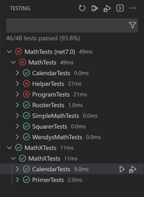
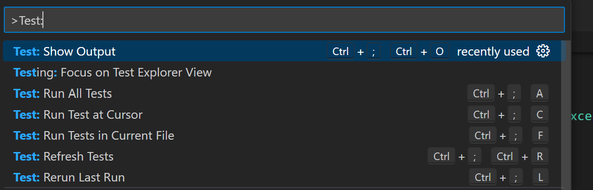
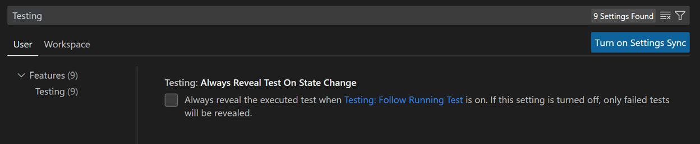

+++
title = "Testing"
date = 2024-01-12T22:36:24+08:00
weight = 100
type = "docs"
description = ""
isCJKLanguage = true
draft = false
+++

> 原文: [https://code.visualstudio.com/docs/csharp/testing](https://code.visualstudio.com/docs/csharp/testing)

# Testing with C# Dev Kit 使用 C# Dev Kit 进行测试


Testing in C# in Visual Studio Code is enabled by the C# Dev Kit extension. It's a lightweight extension to enhance your C# development experience.

​​​	Visual Studio Code 中的 C# 测试由 C# Dev Kit 扩展启用。这是一个轻量级扩展，可增强您的 C# 开发体验。

## [Overview 概述]()

The extension supports the following test frameworks:

​​​	该扩展支持以下测试框架：

- [xUnit](https://learn.microsoft.com/dotnet/core/testing/unit-testing-with-dotnet-test)
- [NUnit](https://learn.microsoft.com/dotnet/core/testing/unit-testing-with-nunit)
- [MSTest](https://learn.microsoft.com/dotnet/core/testing/unit-testing-with-mstest)

The C# Dev Kit extension provides the following features:

​​​	C# Dev Kit 扩展提供以下功能：

- Run/Debug tests cases
  运行/调试测试用例
- View test report
  查看测试报告
- View tests in Testing Explorer
  在测试资源管理器中查看测试

## [Requirements 要求]()

- [.NET 6.0 SDK or later
  .NET 6.0 SDK 或更高版本](https://dotnet.microsoft.com/download)
- Visual Studio Code (version 1.58.0 or later)
  Visual Studio Code（版本 1.58.0 或更高版本）
- [C# Dev Kit](https://marketplace.visualstudio.com/items?itemName=ms-dotnettools.csdevkit)

## [Project setup 项目设置]()

> Note: If you have already set up your C# test framework in your project, you can skip to the Features section.
>
> ​​​	注意：如果您已在项目中设置了 C# 测试框架，则可以跳至“功能”部分。

### [Enable testing and adding test framework packages to your project 启用测试并将测试框架包添加到您的项目]()

You can enable a test framework for your project with just a few steps in the Solution Explorer:

​​​	只需在解决方案资源管理器中执行几个步骤，即可为您的项目启用测试框架：

**xUnit**

Open the Command Palette and select **.NET:New Project..** then select **xUnit Test Project** and provide name and location for the new project. This will create a new project and directory that uses xUnit as the test library and configures the test runner by adding the following `<PackageReference />` elements to the project file.

​​​	打开命令面板并选择 .NET:New Project..，然后选择 xUnit 测试项目并为新项目提供名称和位置。这将创建一个新项目和目录，该项目和目录使用 xUnit 作为测试库，并通过将以下 `<PackageReference />` 元素添加到项目文件来配置测试运行器。

- Microsoft.NET.Test.Sdk
- xunit
- xunit.runner.visualstudio
- coverlet.collector

From the Terminal, run the following command:

​​​	在终端中，运行以下命令：

```
dotnet add [location of your test csproj file] reference [location of the csproj file for project to be tested]
```

**NUnit**

Open the Command Palette and select **.NET:New Project..** then select **NUnit3 Test Project** and provide name and location for the new project. This will create a new project and directory that uses NUnit as the test library and configures the test runner by adding the following `<PackageReference />` elements to the project file.

​​​	打开命令面板并选择“.NET：新建项目..”，然后选择“NUnit3 测试项目”，并为新项目提供名称和位置。这将创建一个新项目和目录，该项目和目录使用 NUnit 作为测试库，并通过将以下 `<PackageReference />` 元素添加到项目文件来配置测试运行器。

- Microsoft.NET.Test.Sdk
- nunit
- NUnit3TestAdapter

From the Terminal, run the following command:

​​​	在终端中，运行以下命令：

```
dotnet add [location of your test csproj file] reference [location of the csproj file for project to be tested]
```

**MSTest**

Open the Command Palette and select **.NET:New Project..** then select **MSTest Test Project** and provide name and location for the new project. This will create a new project and directory that uses MSTest as the test library and configures the test runner by adding the following `<PackageReference />` elements to the project file.

​​​	打开命令面板并选择“.NET：新建项目..”，然后选择“MSTest 测试项目”，并为新项目提供名称和位置。这将创建一个新项目和目录，该项目和目录使用 MSTest 作为测试库，并通过将以下 `<PackageReference />` 元素添加到项目文件来配置测试运行器。

- Microsoft.NET.Test.Sdk
- MSTest.TestAdapter
- MSTest.TestFramework
- coverlet.collector

From the Terminal, run the following command:

​​​	从终端运行以下命令：

```
dotnet add [location of your test csproj file] reference [location of the csproj file for project to be tested]
```

## [Features 特性]()

### [Run/Debug test cases 运行/调试测试用例]()

[C# Dev Kit](https://marketplace.visualstudio.com/items?itemName=ms-dotnettools.csdevkit) will generate shortcuts (the green play button) on the left side of the class and method definition. To run the target test cases, select the green play button. You can also right-click on it to see more options.

​​​	C# Dev Kit 将在类和方法定义的左侧生成快捷方式（绿色播放按钮）。要运行目标测试用例，请选择绿色播放按钮。您还可以右键单击它以查看更多选项。

### [Test Explorer 测试资源管理器]()

The Test Explorer is a tree view to show all the test cases in your workspace. You can select the beaker button on the left-side Activity bar of Visual Studio Code to open it. You can also run/debug your test cases and view their test results from there.

​​​	测试资源管理器是一个树视图，用于显示工作区中的所有测试用例。您可以选择 Visual Studio Code 左侧活动栏上的烧杯按钮来打开它。您还可以从此处运行/调试测试用例并查看其测试结果。

### [View test results 查看测试结果]()

After running/debugging the test cases the state of the related test items will be updated in both editor decorations and the Test Explorer.

​​​	在运行/调试测试用例后，相关测试项的状态将在编辑器装饰和测试资源管理器中更新。



You can select the links in the stack trace to navigate to the source location.

​​​	您可以选择堆栈跟踪中的链接以导航到源位置。

### [VS Code testing commands VS Code 测试命令]()

There are testing commands (for example, **Run All Tests**) that can be found by searching for **Test:** in the Command Palette (Ctrl+Shift+P).

​​​	可以通过在命令面板（Ctrl+Shift+P）中搜索 Test: 来找到测试命令（例如，运行所有测试）。



### [VS Code testing settings VS Code 测试设置]()

There are VS Code settings specific to testing that can be found by searching for **Testing** in the Settings editor (Ctrl+,).

​​​	可以通过在设置编辑器（Ctrl+,）中搜索 Testing 来找到特定于测试的 VS Code 设置。


