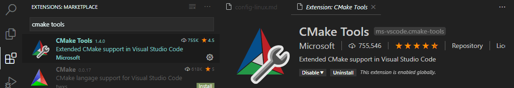
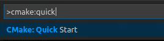
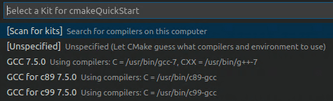
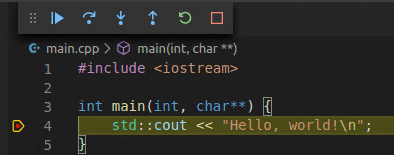

+++
title = "CMake Tools on Linux"
date = 2024-01-12T22:36:24+08:00
weight = 70
type = "docs"
description = ""
isCJKLanguage = true
draft = false
+++

> 原文: [https://code.visualstudio.com/docs/cpp/cmake-linux](https://code.visualstudio.com/docs/cpp/cmake-linux)

# Get started with CMake Tools on Linux 在 Linux 上开始使用 CMake 工具


CMake is an open-source, cross-platform tool that uses compiler and platform independent configuration files to generate native build tool files specific to your compiler and platform.

&zeroWidthSpace;CMake 是一款开源跨平台工具，它使用编译器和平台无关的配置文件来生成特定于您的编译器和平台的原生构建工具文件。

The CMake Tools extension integrates Visual Studio Code and CMake to make it easy to configure, build, and debug your C++ project.

&zeroWidthSpace;CMake Tools 扩展集成了 Visual Studio Code 和 CMake，以便轻松配置、构建和调试您的 C++ 项目。

In this tutorial, you'll use the CMake Tools extension for Visual Studio Code to configure, build, and debug a simple C++ CMake project on Linux. Aside from installing CMake, your compiler, debugger, and build tools, the steps in this tutorial apply generally to how you'd use CMake on other platforms, like Windows.

&zeroWidthSpace;在本教程中，您将使用 Visual Studio Code 的 CMake Tools 扩展来配置、构建和调试 Linux 上的简单 C++ CMake 项目。除了安装 CMake、编译器、调试器和构建工具外，本教程中的步骤通常适用于您在其他平台（如 Windows）上使用 CMake 的方式。

If you have any trouble, please file an issue for this tutorial in the [VS Code documentation repository](https://github.com/microsoft/vscode-docs/issues). Also, for more information about CMake Tools in general, see [CMake Tools for Visual Studio Code documentation](https://github.com/microsoft/vscode-cmake-tools/blob/main/docs/README.md)

&zeroWidthSpace;如果您遇到任何问题，请在此教程中提交 VS Code 文档存储库中的问题。此外，有关 CMake Tools 的更多信息，请参阅 Visual Studio Code 文档中的 CMake Tools

## [Prerequisites 先决条件](https://code.visualstudio.com/docs/cpp/cmake-linux#_prerequisites)

To complete this tutorial on Ubuntu, install the following:

&zeroWidthSpace;要在 Ubuntu 上完成本教程，请安装以下内容：

1. [Visual Studio Code](https://code.visualstudio.com/download).

   &zeroWidthSpace;Visual Studio Code。

2. [C++ extension for VS Code](https://marketplace.visualstudio.com/items?itemName=ms-vscode.cpptools). Install the C/C++ extension by searching for 'c++' in the **Extensions** view (Ctrl+Shift+X).

   &zeroWidthSpace;VS Code 的 C++ 扩展。通过在扩展视图（Ctrl+Shift+X）中搜索“c++”来安装 C/C++ 扩展。

   

3. [CMake Tools extension for VS Code](https://marketplace.visualstudio.com/items?itemName=ms-vscode.cmake-tools). Install the CMake Tools extension by searching for 'CMake tools' in the **Extensions** view (Ctrl+Shift+X).

   &zeroWidthSpace;VS Code 的 CMake Tools 扩展。通过在扩展视图（Ctrl+Shift+X）中搜索“CMake tools”来安装 CMake Tools 扩展。

   

4. You'll also need to install CMake, a compiler, a debugger, and build tools.

   &zeroWidthSpace;您还需要安装 CMake、编译器、调试器和构建工具。

### [Ensure that CMake is installed 确保已安装 CMake](https://code.visualstudio.com/docs/cpp/cmake-linux#_ensure-that-cmake-is-installed)

The VS Code CMake Tools extension does its work by using CMake installed on your system. For best results, use CMake version 3.27 or greater.

&zeroWidthSpace;VS Code CMake Tools 扩展通过使用系统上安装的 CMake 来完成其工作。为了获得最佳结果，请使用 CMake 3.27 或更高版本。

See if CMake is already installed on your system. Open a Terminal window and enter the following command:

&zeroWidthSpace;查看系统上是否已安装 CMake。打开“终端”窗口并输入以下命令：

```
cmake --version
```

To install CMake, or to get a later version if you don't at least have version 3.27, see the instructions for your platform at [Kitware APT Repository](https://apt.kitware.com/). Install version 3.27 or greater.

&zeroWidthSpace;要安装 CMake，或者在您至少没有 3.27 版本的情况下获取更高版本，请参阅 Kitware APT 存储库中针对您平台的说明。安装 3.27 或更高版本。

### [Ensure that development tools are installed 确保已安装开发工具](https://code.visualstudio.com/docs/cpp/cmake-linux#_ensure-that-development-tools-are-installed)

Although you'll use VS Code to edit your source code, you'll compile and debug the source code using the compiler, debugger, and build tools (such as `make`) installed on your system.

&zeroWidthSpace;虽然您将使用 VS Code 编辑源代码，但您将使用系统上安装的编译器、调试器和构建工具（例如 `make` ）来编译和调试源代码。

For this tutorial on Ubuntu, we'll use the GCC compiler, GDB to debug, and `make` to build the project. These tools are not installed by default on Ubuntu, so you need to install them. Fortunately, that's easy.

&zeroWidthSpace;对于 Ubuntu 上的本教程，我们将使用 GCC 编译器、GDB 进行调试，以及 `make` 来构建项目。这些工具默认情况下未安装在 Ubuntu 上，因此您需要安装它们。幸运的是，这很容易。

### [Check if GCC is installed 检查是否已安装 GCC](https://code.visualstudio.com/docs/cpp/cmake-linux#_check-if-gcc-is-installed)

To see if GCC is already installed on your system, open a Terminal window and enter the following command:

&zeroWidthSpace;要查看系统上是否已安装 GCC，请打开“终端”窗口并输入以下命令：

```
gcc -v
```

If GCC isn't installed, run the following command from the Terminal window to update the Ubuntu package lists. An out-of-date Linux distribution can interfere with getting the latest packages.

&zeroWidthSpace;如果未安装 GCC，请从终端窗口运行以下命令以更新 Ubuntu 软件包列表。过时的 Linux 发行版可能会妨碍获取最新软件包。

```
sudo apt-get update
```

Next, install the GNU compiler, `make`, and the GDB debugger with this command:

&zeroWidthSpace;接下来，使用此命令安装 GNU 编译器 `make` 和 GDB 调试器：

```
sudo apt-get install build-essential gdb
```

## [Create a CMake project 创建 CMake 项目](https://code.visualstudio.com/docs/cpp/cmake-linux#_create-a-cmake-project)

If you have an existing CMake project that already has a `CMakeLists.txt` file in the root directory, you can skip to [Select a kit](https://code.visualstudio.com/docs/cpp/cmake-linux#_select-a-kit) to configure your existing project.

&zeroWidthSpace;如果您有现有 CMake 项目，且其根目录中已有 `CMakeLists.txt` 文件，则可以跳至选择工具包以配置现有项目。

Otherwise, create a folder for a new project. From the Terminal window, create an empty folder called `cmakeQuickStart`, navigate into it, and open VS Code in that folder by entering the following commands:

&zeroWidthSpace;否则，为新项目创建一个文件夹。在终端窗口中，创建一个名为 `cmakeQuickStart` 的空文件夹，导航至其中，然后通过输入以下命令在该文件夹中打开 VS Code：

```
mkdir cmakeQuickStart
cd cmakeQuickStart
code .
```

The `code .` command opens VS Code in the current working folder, which becomes your "workspace".

&zeroWidthSpace; `code .` 命令在当前工作文件夹中打开 VS Code，该文件夹将成为您的“工作区”。

### [Create a CMake hello world project 创建 CMake hello world 项目](https://code.visualstudio.com/docs/cpp/cmake-linux#_create-a-cmake-hello-world-project)

The CMake Tools extension can create the files for a basic CMake project for you. Open the Command Palette (Ctrl+Shift+P) and run the **CMake: Quick Start** command:

&zeroWidthSpace;CMake Tools 扩展可以为您创建基本 CMake 项目的文件。打开命令面板 (Ctrl+Shift+P) 并运行 CMake：快速入门命令：



Enter a project name. This will be written to `CMakeLists.txt` and a few initial source files.

&zeroWidthSpace;输入项目名称。这将写入 `CMakeLists.txt` 和一些初始源文件。

Next, select **Executable** as the project type to create a basic source file (`main.cpp`) that includes a basic `main()` function.

&zeroWidthSpace;接下来，选择可执行文件作为项目类型，以创建一个包含基本 `main()` 函数的基本源文件 ( `main.cpp` )。


**Note:** If you had wanted to create a basic source and header file, you would have selected **Library** instead. But for this tutorial, **Executable** will do. If you are prompted to configure IntelliSense for the folder, select **Allow**.

&zeroWidthSpace;注意：如果您想创建一个基本源文件和头文件，您应该选择库。但对于本教程，可执行文件即可。如果您收到配置文件夹的 IntelliSense 的提示，请选择允许。

This creates a hello world CMake project containing `main.cpp`, `CMakeLists.txt` (which tells the CMake tools how to build your project), and a folder named `build` for your build files:

&zeroWidthSpace;这将创建一个包含 `main.cpp` 、 `CMakeLists.txt` （告诉 CMake 工具如何构建您的项目）的 hello world CMake 项目，以及一个名为 `build` 的文件夹，用于您的构建文件：


### [Select a kit 选择工具包](https://code.visualstudio.com/docs/cpp/cmake-linux#_select-a-kit)

Before you can use the CMake Tools extension to build a project, you need to configure it to know about the compilers on your system. Do that by scanning for 'kits'. A kit represents a toolchain, which is the compiler, linker, and other tools used to build your project. To scan for kits:

&zeroWidthSpace;在您可以使用 CMake 工具扩展构建项目之前，您需要对其进行配置，以了解系统上的编译器。通过扫描“工具包”来执行此操作。工具包表示工具链，即用于构建项目的编译器、链接器和其他工具。要扫描工具包，请执行以下操作：

1. Open the Command Palette (Ctrl+Shift+P) and run **CMake: Select a Kit**. The extension will automatically scan for kits on your computer and create a list of compilers found on your system.

   &zeroWidthSpace;打开命令面板 (Ctrl+Shift+P) 并运行 CMake：选择工具包。该扩展将自动扫描计算机上的工具包，并创建系统上找到的编译器列表。

2. Select the compiler you want to use. For example, depending on the compilers you have installed, you might see something like:

   &zeroWidthSpace;选择您要使用的编译器。例如，根据您已安装的编译器，您可能会看到类似以下内容：

   

## [Configure Hello World 配置 Hello World](https://code.visualstudio.com/docs/cpp/cmake-linux#_configure-hello-world)

There are two things you must do to configure your CMake project: select a kit (which you just did) and select a variant.

&zeroWidthSpace;您必须执行两项操作来配置 CMake 项目：选择工具包（您刚刚执行了此操作）和选择变体。

The kit you selected previously is shown in the **Project Status** view in the CMake Tools sidebar. For example:

&zeroWidthSpace;您之前选择的工具包显示在 CMake 工具边栏的“项目状态”视图中。例如：


To change the kit, you can click on the kit in the **Project Status** view in the CMake Tools sidebar, or run the **CMake: Select a Kit** command again from the Command Palette. If you don't see the compiler you're looking for, you can edit the `cmake-tools-kits.json` file in your project. To edit the file, open the Command Palette (Ctrl+Shift+P) and run the **CMake: Edit User-Local CMake Kits** command.

&zeroWidthSpace;要更改工具包，您可以在 CMake 工具边栏的“项目状态”视图中单击工具包，或从命令面板再次运行 CMake: 选择工具包命令。如果您没有看到您要查找的编译器，您可以在项目中编辑 `cmake-tools-kits.json` 文件。要编辑该文件，请打开命令面板 (Ctrl+Shift+P) 并运行 CMake: 编辑用户本地 CMake 工具包命令。

### [Select a variant 选择一个变体](https://code.visualstudio.com/docs/cpp/cmake-linux#_select-a-variant)

A variant contains instructions for how to build your project. By default, the CMake Tools extension provides four variants, each corresponding to a default build type: `Debug`, `Release`, `MinRelSize`, and `RelWithDebInfo`. These options do the following:

&zeroWidthSpace;变体包含有关如何构建项目的说明。默认情况下，CMake 工具扩展提供四个变体，每个变体对应一个默认构建类型： `Debug` 、 `Release` 、 `MinRelSize` 和 `RelWithDebInfo` 。这些选项执行以下操作：

`Debug`: disables optimizations and includes debug info. `Release` : Includes optimizations but no debug info. `MinRelSize` : Optimizes for size. No debug info. `RelWithDebInfo` : Optimizes for speed and includes debug info.

&zeroWidthSpace; `Debug` ：禁用优化并包含调试信息。 `Release` ：包含优化但不包含调试信息。 `MinRelSize` ：针对大小进行优化。无调试信息。 `RelWithDebInfo` ：针对速度进行优化并包含调试信息。

To select a variant, open the Command Palette (Ctrl+Shift+P) run the **CMake: Select Variant** command.

&zeroWidthSpace;要选择一个变体，请打开命令面板 (Ctrl+Shift+P) 并运行 CMake: 选择变体命令。


Select **Debug** to include debug information with your build.

&zeroWidthSpace;选择调试以在您的构建中包含调试信息。


The selected variant will appear in the Status bar next to the active kit.

&zeroWidthSpace;选定的变体将显示在状态栏中，位于活动工具包旁边。

### [CMake: Configure CMake：配置](https://code.visualstudio.com/docs/cpp/cmake-linux#_cmake-configure)

Now that you've selected a kit and a variant, open the Command Palette (Ctrl+Shift+P) and run the **CMake: Configure** command to configure your project. This generates build files in the project's build folder using the kit and variant you selected.

&zeroWidthSpace;现在您已选择一个工具包和一个变体，请打开命令面板（Ctrl+Shift+P）并运行 CMake：配置命令以配置您的项目。这将在项目的构建文件夹中使用您选择的工具包和变体生成构建文件。

## [Build hello world 构建 hello world](https://code.visualstudio.com/docs/cpp/cmake-linux#_build-hello-world)

After configuring your project, you're ready to build. Open the Command Palette (Ctrl+Shift+P) and run the **CMake: Build** command, or select the **Build** button from the status bar.

&zeroWidthSpace;配置项目后，您就可以进行构建了。打开命令面板（Ctrl+Shift+P）并运行 CMake：构建命令，或从状态栏中选择构建按钮。


You can select which targets you'd like to build by selecting **CMake: Set Build Target** from the Command Palette. By default, CMake Tools builds all targets. The selected target will appear in the **Project Status** view in the CMake Tools sidebar underneath the **Build** node and can be set from there as well.

&zeroWidthSpace;您可以通过从命令面板中选择 CMake：设置构建目标来选择要构建的目标。默认情况下，CMake 工具会构建所有目标。选定的目标将显示在 CMake 工具侧边栏中的项目状态视图中，位于构建节点下方，也可以从那里进行设置。


## [Debug hello world 调试 hello world](https://code.visualstudio.com/docs/cpp/cmake-linux#_debug-hello-world)

To run and debug your project, open `main.cpp` and put a breakpoint on the `std::cout` line. Then open the Command Palette (Ctrl+Shift+P) and run **CMake: Debug**. The debugger will stop on the `std::cout` line:

&zeroWidthSpace;要运行和调试项目，请打开 `main.cpp` 并对 `std::cout` 行设置一个断点。然后打开命令面板（Ctrl+Shift+P）并运行 CMake：调试。调试器将在 `std::cout` 行停止：



Go ahead and press F5 to continue.

&zeroWidthSpace;继续并按 F5 继续。

You've now used the VS Code CMake Tools extension to use CMake to build and debug a C++ app on Ubuntu. The steps are the same for other platforms; the difference being how you install CMake and the compiler/debugger for the platform of your choice. For instructions on setting up compilers/debuggers for other platforms, see the following:

&zeroWidthSpace;您现在已使用 VS Code CMake 工具扩展使用 CMake 在 Ubuntu 上构建和调试 C++ 应用。其他平台的步骤相同；不同之处在于您如何安装 CMake 以及您选择的平台的编译器/调试器。有关为其他平台设置编译器/调试器的说明，请参阅以下内容：

- [Microsoft C++ on Windows
  Windows 上的 Microsoft C++](https://code.visualstudio.com/docs/cpp/config-msvc)
- [Clang on macOS
  macOS 上的 Clang](https://code.visualstudio.com/docs/cpp/config-clang-mac)
- [GCC on Windows Subsystem for Linux
  适用于 Linux 的 Windows 子系统上的 GCC](https://code.visualstudio.com/docs/cpp/config-wsl)

## [Next steps 后续步骤](https://code.visualstudio.com/docs/cpp/cmake-linux#_next-steps)

- Explore the [CMake Tools](https://aka.ms/cmaketoolsdocumentation) documentation
  探索 CMake 工具文档
- Review the [Overview of the C++ extension](https://code.visualstudio.com/docs/languages/cpp)
  查看 C++ 扩展概述
