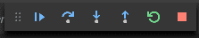
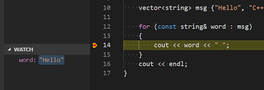
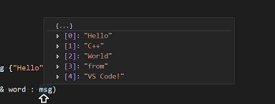

+++
title = "Clang on macOS"
date = 2024-01-12T22:36:24+08:00
weight = 40
type = "docs"
description = ""
isCJKLanguage = true
draft = false
+++

> 原文: [https://code.visualstudio.com/docs/cpp/config-clang-mac](https://code.visualstudio.com/docs/cpp/config-clang-mac)

# Using Clang in Visual Studio Code 在 Visual Studio Code 中使用 Clang


In this tutorial, you configure Visual Studio Code on macOS to use the Clang/LLVM compiler and debugger.

&zeroWidthSpace;在本教程中，您将配置 macOS 上的 Visual Studio Code 以使用 Clang/LLVM 编译器和调试器。

After configuring VS Code, you will compile and debug a C++ program in VS Code. This tutorial does not teach you about Clang or the C++ language. For those subjects, there are many good resources available on the Web.

&zeroWidthSpace;配置 VS Code 后，您将在 VS Code 中编译和调试一个 C++ 程序。本教程不会教您有关 Clang 或 C++ 语言的知识。对于这些主题，网上有很多很好的资源。

If you have any trouble, feel free to file an issue for this tutorial in the [VS Code documentation repository](https://github.com/microsoft/vscode-docs/issues).

&zeroWidthSpace;如果您遇到任何问题，请随时在 VS Code 文档存储库中为此教程提交问题。

## [Prerequisites 先决条件](https://code.visualstudio.com/docs/cpp/config-clang-mac#_prerequisites)

To successfully complete this tutorial, you must do the following steps:

&zeroWidthSpace;要成功完成本教程，您必须执行以下步骤：

1. Install [Visual Studio Code on macOS](https://code.visualstudio.com/docs/setup/mac).

   &zeroWidthSpace;在 macOS 上安装 Visual Studio Code。

2. Install the [C++ extension for VS Code](https://marketplace.visualstudio.com/items?itemName=ms-vscode.cpptools). You can install the C/C++ extension by searching for 'C++' in the Extensions view (Ctrl+Shift+X).

   &zeroWidthSpace;为 VS Code 安装 C++ 扩展。您可以在扩展视图（Ctrl+Shift+X）中搜索“C++”来安装 C/C++ 扩展。

   

### [Ensure Clang is installed 确保已安装 Clang](https://code.visualstudio.com/docs/cpp/config-clang-mac#_ensure-clang-is-installed)

Clang might already be installed on your Mac. To verify that it is, open a macOS Terminal window and enter the following command:

&zeroWidthSpace;您的 Mac 上可能已安装 Clang。要验证是否已安装，请打开 macOS 终端窗口并输入以下命令：

```
clang --version
```

If Clang isn't installed, enter the following command to install the command line developer tools, which include Clang:

&zeroWidthSpace;如果未安装 Clang，请输入以下命令来安装包含 Clang 的命令行开发人员工具：

```
xcode-select --install
```

## [Create Hello World app 创建 Hello World 应用](https://code.visualstudio.com/docs/cpp/config-clang-mac#_create-hello-world-app)

From the macOS Terminal, create an empty folder called `projects` where you can store all your VS Code projects, then create a subfolder called `helloworld`, navigate into it, and open VS Code in that folder by entering the following commands in the terminal window:

&zeroWidthSpace;在 macOS 终端中，创建一个名为 `projects` 的空文件夹，您可以在其中存储所有 VS Code 项目，然后创建一个名为 `helloworld` 的子文件夹，导航到其中，并通过在终端窗口中输入以下命令在该文件夹中打开 VS Code：

```
mkdir projects
cd projects
mkdir helloworld
cd helloworld
code .
```

The `code .` command opens VS Code in the current working folder, which becomes your "workspace". As you go through the tutorial, three files are created in the `.vscode` folder in your workspace:

&zeroWidthSpace;命令在当前工作文件夹中打开 VS Code，该文件夹将成为您的“工作区”。在您完成教程时，将在工作区中的 `.vscode` 文件夹中创建三个文件：

- `tasks.json` (compiler build settings)
  `tasks.json` （编译器构建设置）
- `launch.json` (debugger settings)
  `launch.json` （调试器设置）
- `c_cpp_properties.json` (compiler path and IntelliSense settings)
  `c_cpp_properties.json` （编译器路径和 IntelliSense 设置）

### [Add a hello world source code file 添加一个 hello world 源代码文件](https://code.visualstudio.com/docs/cpp/config-clang-mac#_add-a-hello-world-source-code-file)

In the File Explorer title bar, select the **New File** button and name the file `helloworld.cpp`.

&zeroWidthSpace;在文件资源管理器标题栏中，选择“新建文件”按钮，并将文件命名为 `helloworld.cpp` 。


Paste in the following source code:

&zeroWidthSpace;粘贴以下源代码：

```
#include <iostream>
#include <vector>
#include <string>

using namespace std;

int main()
{
    vector<string> msg {"Hello", "C++", "World", "from", "VS Code", "and the C++ extension!"};

    for (const string& word : msg)
    {
        cout << word << " ";
    }
    cout << endl;
}
```

Now press Ctrl+S to save the file. Notice that your files are listed in the **File Explorer** view (Ctrl+Shift+E) in the side bar of VS Code:

&zeroWidthSpace;现在按 Ctrl+S 保存文件。请注意，您的文件列在 VS Code 侧边栏的文件资源管理器视图 (Ctrl+Shift+E) 中：


You can also enable [Auto Save](https://code.visualstudio.com/docs/editor/codebasics#_save-auto-save) to automatically save your file changes, by selecting **File** > **Auto Save**. You can find out more about the other views in the VS Code [User Interface documentation](https://code.visualstudio.com/docs/getstarted/userinterface).

&zeroWidthSpace;您还可以通过选择“文件”>“自动保存”来启用自动保存，以自动保存文件更改。您可以在 VS Code 用户界面文档中了解有关其他视图的更多信息。

> **Note**: When you save or open a C++ file, you may see a notification from the C/C++ extension about the availability of an Insiders version, which lets you test new features and fixes. You can ignore this notification by selecting the `X` (**Clear Notification**).
>
> &zeroWidthSpace;注意：当您保存或打开 C++ 文件时，您可能会看到来自 C/C++ 扩展的通知，其中包含有关 Insider 版本可用性的信息，该版本允许您测试新功能和修复程序。您可以通过选择 `X` （清除通知）来忽略此通知。

## [Explore IntelliSense 探索 IntelliSense](https://code.visualstudio.com/docs/cpp/config-clang-mac#_explore-intellisense)

[IntelliSense](https://code.visualstudio.com/docs/editor/intellisense) is a tool to help you code faster and more efficiently by adding code editing features such as code completion, parameter info, quick info, and member lists.

&zeroWidthSpace;IntelliSense 是一种工具，可通过添加代码编辑功能（如代码补全、参数信息、快速信息和成员列表）来帮助您更快、更高效地编写代码。

To see IntelliSense in action, hover over `vector` or `string` to see their type information. If you type `msg.` in line 10, you can see a completion list of recommended member functions to call, all generated by IntelliSense:

&zeroWidthSpace;要查看 IntelliSense 的实际操作，请将鼠标悬停在 `vector` 或 `string` 上以查看其类型信息。如果您在第 10 行中键入 `msg.` ，您会看到 IntelliSense 生成的建议成员函数的补全列表，供您调用：


You can press the Tab key to insert the selected member. Then, when you add the opening parenthesis, information about arguments that the function requires is displayed.

&zeroWidthSpace;您可以按 Tab 键插入选定的成员。然后，当您添加左括号时，将显示有关函数所需参数的信息。

If IntelliSense is not already configured, open the Command Palette (Ctrl+Shift+P) and enter **Select IntelliSense Configuration**. From the dropdown of compilers, select `Use clang++` to configure. More information can be found in the [IntelliSense configuration documentation](https://code.visualstudio.com/docs/cpp/configure-intellisense).

&zeroWidthSpace;如果尚未配置 IntelliSense，请打开命令面板 (Ctrl+Shift+P) 并输入“选择 IntelliSense 配置”。从编译器下拉列表中，选择 `Use clang++` 进行配置。您可以在 IntelliSense 配置文档中找到更多信息。

## [Run helloworld.cpp 运行 helloworld.cpp](https://code.visualstudio.com/docs/cpp/config-clang-mac#_run-helloworldcpp)

Remember, the C++ extension uses the C++ compiler you installed on your machine to build your program. Make sure you have a C++ compiler, such as Clang, installed before attempting to run and debug `helloworld.cpp` in VS Code.

&zeroWidthSpace;请记住，C++ 扩展使用您安装在计算机上的 C++ 编译器来构建您的程序。确保在尝试在 VS Code 中运行和调试 `helloworld.cpp` 之前，已安装 C++ 编译器，例如 Clang。

1. Open `helloworld.cpp` so that it is the active file.

   &zeroWidthSpace;打开 `helloworld.cpp` ，使其成为活动文件。

2. Press the play button in the top right corner of the editor.

   &zeroWidthSpace;按编辑器右上角的播放按钮。

   

3. Choose **C/C++: clang++ build and debug active file** from the list of detected compilers on your system.

   &zeroWidthSpace;从系统上检测到的编译器列表中选择 C/C++: clang++ 构建并调试活动文件。

   

You are only asked to choose a compiler the first time you run `helloworld.cpp`. This compiler is the "default" compiler set in `tasks.json` file.

&zeroWidthSpace;仅在您首次运行 `helloworld.cpp` 时，系统会要求您选择编译器。此编译器是 `tasks.json` 文件中设置的“默认”编译器。

1. After the build succeeds, your program's output will appear in the integrated **Debug Console**.

   &zeroWidthSpace;构建成功后，程序的输出将显示在集成调试控制台中。

   

Congratulations! You've just run your first C++ program in VS Code!

&zeroWidthSpace;恭喜！您刚刚在 VS Code 中运行了第一个 C++ 程序！

### [Understanding tasks.json 了解 tasks.json](https://code.visualstudio.com/docs/cpp/config-clang-mac#_understanding-tasksjson)

The first time you run your program, the C++ extension creates `tasks.json`, located in your project's `.vscode` folder. `tasks.json` stores build configurations.

&zeroWidthSpace;首次运行程序时，C++ 扩展会创建 `tasks.json` ，该文件位于项目的 `.vscode` 文件夹中。 `tasks.json` 存储构建配置。

Here is a sample of a `tasks.json` file on macOS:

&zeroWidthSpace;下面是 macOS 上 `tasks.json` 文件的示例：

```
{
  "tasks": [
    {
      "type": "cppbuild",
      "label": "C/C++: clang++ build active file",
      "command": "/usr/bin/clang++",
      "args": [
        "-fcolor-diagnostics",
        "-fansi-escape-codes",
        "-g",
        "${file}",
        "-o",
        "${fileDirname}/${fileBasenameNoExtension}"
      ],
      "options": {
        "cwd": "${fileDirname}"
      },
      "problemMatcher": ["$gcc"],
      "group": {
        "kind": "build",
        "isDefault": true
      },
      "detail": "Task generated by Debugger."
    }
  ],
  "version": "2.0.0"
}
```

> **Note**: You can learn more about `tasks.json` variables in the [variables reference](https://code.visualstudio.com/docs/editor/variables-reference).
>
> &zeroWidthSpace;注意：您可以在变量参考中了解有关 `tasks.json` 变量的更多信息。

The `command` setting specifies the program to run. In this case, that is`clang++`.

&zeroWidthSpace;设置 `command` 指定要运行的程序。在本例中，即为 `clang++` 。

The `args` array specifies the command-line arguments that are passed to clang++. These arguments must be specified in the order expected by the compiler.

&zeroWidthSpace;数组 `args` 指定传递给 clang++ 的命令行参数。这些参数必须按照编译器预期的顺序指定。

This task tells the C++ compiler to take the active file (`${file}`), compile it, and create an output file (`-o` switch) in the current directory (`${fileDirname}`) with the same name as the active file but without the file extension (`${fileBasenameNoExtension}`). This process creates `helloworld`.

&zeroWidthSpace;此任务指示 C++ 编译器获取活动文件 ( `${file}` )，对其进行编译，并在当前目录 ( `${fileDirname}` ) 中创建一个输出文件 ( `-o` 开关)，其名称与活动文件相同，但没有文件扩展名 ( `${fileBasenameNoExtension}` )。此过程会创建 `helloworld` 。

The `label` value is what you see in the tasks list, which is based on your personal preference.

&zeroWidthSpace;值 `label` 是您在任务列表中看到的内容，它基于您的个人偏好。

The `detail` value is the description of the task in the tasks list. Update this string to differentiate it from similar tasks.

&zeroWidthSpace;值 `detail` 是任务列表中任务的说明。更新此字符串以使其与类似任务区分开来。

The `problemMatcher` value selects the output parser to use for finding errors and warnings in the compiler output. For clang++, the `$gcc` problem matcher creates the best results.

&zeroWidthSpace;值 `problemMatcher` 选择用于在编译器输出中查找错误和警告的输出解析器。对于 clang++， `$gcc` 问题匹配器可创建最佳结果。

From now on, the play button always reads from `tasks.json` to figure out how to build and run your program. You can define multiple build tasks in `tasks.json`, and whichever task is marked as the default is the one used by the play button. In case you need to change the default compiler, you can run **Tasks: Configure Default Build Task** in the Command Palette. Alternatively you can modify the `tasks.json` file and remove the default by replacing this segment:

&zeroWidthSpace;从现在开始，播放按钮始终从 `tasks.json` 读取以了解如何构建和运行程序。您可以在 `tasks.json` 中定义多个构建任务，而标记为默认的任务是播放按钮使用的任务。如果您需要更改默认编译器，则可以在命令面板中运行任务：配置默认构建任务。或者，您可以修改 `tasks.json` 文件并通过替换此段来删除默认值：

```
    "group": {
        "kind": "build",
        "isDefault": true
    },
```

with this:

```
    "group": "build",
```

### [Modifying tasks.json 修改 tasks.json](https://code.visualstudio.com/docs/cpp/config-clang-mac#_modifying-tasksjson)

You can modify your `tasks.json` to build multiple C++ files by using an argument like `"${workspaceFolder}/*.cpp"` instead of `"${file}"`. This builds all `.cpp` files in your current folder. You can also modify the output filename by replacing `"${fileDirname}/${fileBasenameNoExtension}"` with a hard-coded filename (for example `"${workspaceFolder}/myProgram.out"`).

&zeroWidthSpace;您可以通过使用 `"${workspaceFolder}/*.cpp"` 之类的参数而不是 `"${file}"` 来修改 `tasks.json` 以构建多个 C++ 文件。这将构建当前文件夹中的所有 `.cpp` 文件。您还可以通过将 `"${fileDirname}/${fileBasenameNoExtension}"` 替换为硬编码文件名（例如 `"${workspaceFolder}/myProgram.out"` ）来修改输出文件名。

## [Debug helloworld.cpp 调试 helloworld.cpp](https://code.visualstudio.com/docs/cpp/config-clang-mac#_debug-helloworldcpp)

To debug your code,

&zeroWidthSpace;要调试您的代码，

1. Go back to `helloworld.cpp` so that it is the active file.

   &zeroWidthSpace;返回 `helloworld.cpp` ，使其成为活动文件。

2. Set a breakpoint by clicking on the editor margin or using F9 on the current line.

   &zeroWidthSpace;通过单击编辑器边距或在当前行上使用 F9 来设置断点。

   

3. From the drop-down next to the play button, select **Debug C/C++ File**.

   &zeroWidthSpace;从播放按钮旁边的下拉列表中，选择调试 C/C++ 文件。

   

4. Choose **C/C++: clang++ build and debug active file** from the list of detected compilers on your system (you'll only be asked to choose a compiler the first time you run or debug `helloworld.cpp`).

   &zeroWidthSpace;从系统上检测到的编译器列表中选择 C/C++：clang++ 构建并调试活动文件（仅在您首次运行或调试 `helloworld.cpp` 时才会要求您选择编译器）。

   

5. You will see the task execute and print out the output to the **Terminal** window.

   &zeroWidthSpace;您将看到任务执行并将输出打印到终端窗口。

   

The play button has two modes: **Run C/C++ File** and **Debug C/C++ File**. The default is the last-used mode. If you see the debug icon in the play button, you can select the play button to debug, instead of selecting the drop-down menu item.

&zeroWidthSpace;播放按钮具有两种模式：运行 C/C++ 文件和调试 C/C++ 文件。默认模式是上次使用的模式。如果在播放按钮中看到调试图标，则可以选择播放按钮进行调试，而不是选择下拉菜单项。

## [Explore the debugger 探索调试器](https://code.visualstudio.com/docs/cpp/config-clang-mac#_explore-the-debugger)

Before you start stepping through the code, let's take a moment to notice several changes in the user interface:

&zeroWidthSpace;在开始逐步执行代码之前，我们花点时间注意用户界面中的几个更改：

- The Integrated Terminal appears at the bottom of the source code editor. In the **Debug Console** tab, you see output that indicates the debugger is up and running.

  &zeroWidthSpace;集成终端显示在源代码编辑器的底部。在“调试控制台”选项卡中，您会看到指示调试器已启动并正在运行的输出。

- The editor highlights the line where you set a breakpoint before starting the debugger:

  &zeroWidthSpace;编辑器突出显示您在启动调试器之前设置断点的行：

  

- The **Run and Debug** view in the Activity Bar shows debugging information.

  &zeroWidthSpace;活动栏中的运行和调试视图显示调试信息。

- At the top of the code editor, a debugging control panel appears. You can move this around the screen by grabbing the dots on the left side.

  &zeroWidthSpace;在代码编辑器的顶部，出现一个调试控制面板。您可以通过抓取左侧的点来在屏幕上移动它。

  

## [Step through the code 逐步执行代码](https://code.visualstudio.com/docs/cpp/config-clang-mac#_step-through-the-code)

Now you're ready to start stepping through the code.

&zeroWidthSpace;现在，您可以开始逐步执行代码了。

1. Select the **Step over** icon in the debugging control panel so that the `for (const string& word : msg)` statement is highlighted.

   &zeroWidthSpace;在调试控制面板中选择单步执行图标，以便突出显示 `for (const string& word : msg)` 语句。

   

   The **Step Over** command skips over all the internal function calls within the `vector` and `string` classes that are invoked when the `msg` variable is created and initialized. Notice the change in the **Variables** window. The contents of `msg` are visible because that statement has completed.

   &zeroWidthSpace;单步执行命令跳过在创建和初始化 `msg` 变量时调用的 `vector` 和 `string` 类中的所有内部函数调用。注意变量窗口中的变化。由于该语句已完成，因此 `msg` 的内容可见。

2. Press **Step over** again to advance to the next statement (skipping over all the internal code that is executed to initialize the loop). Now, the **Variables** window shows information about the loop variable.

   &zeroWidthSpace;再次按单步执行以进入下一条语句（跳过执行以初始化循环的所有内部代码）。现在，变量窗口显示有关循环变量的信息。

3. Press **Step over** again to execute the `cout` statement.

   &zeroWidthSpace;再次按单步执行以执行 `cout` 语句。

4. If you like, you can keep pressing **Step over** until all the words in the vector have been printed to the console. But if you are curious, try pressing the **Step Into** button to step through source code in the C++ standard library!

   &zeroWidthSpace;如果您愿意，可以一直按“单步执行”，直到向量中的所有单词都已打印到控制台。但如果您好奇，请尝试按“单步进入”按钮以逐步执行 C++ 标准库中的源代码！

## [Set a watch 设置监视](https://code.visualstudio.com/docs/cpp/config-clang-mac#_set-a-watch)

You might want to keep track of the value of a variable as your program executes. You can do this by setting a **watch** on the variable.

&zeroWidthSpace;您可能希望在程序执行时跟踪变量的值。您可以通过监视变量来执行此操作。

1. Place the insertion point inside the loop. In the **Watch** window, select the plus sign and type `word` in the text box. This is the name of the loop variable. Now view the **Watch** window as you step through the loop.

   &zeroWidthSpace;将插入点放在循环内。在监视窗口中，选择加号并在文本框中键入 `word` 。这是循环变量的名称。现在，在您逐步执行循环时查看监视窗口。

   

2. Add another watch by adding this statement before the loop: `int i = 0;`. Then, inside the loop, add this statement: `++i;`. Now add a watch for `i` as you did in the previous step.

   &zeroWidthSpace;通过在循环前添加此语句来添加另一个监视： `int i = 0;` 。然后，在循环内，添加此语句： `++i;` 。现在，像您在上一步中所做的那样为 `i` 添加一个监视。

3. To quickly view the value of any variable while execution is paused, you can hover over it with the mouse pointer.

   &zeroWidthSpace;要在执行暂停时快速查看任何变量的值，您可以将鼠标指针悬停在其上。

   

## [Customize debugging with launch.json 使用 launch.json 自定义调试](https://code.visualstudio.com/docs/cpp/config-clang-mac#_customize-debugging-with-launchjson)

When you debug with the play button or F5, the C++ extension creates a dynamic debug configuration on the fly.

&zeroWidthSpace;当您使用播放按钮或 F5 调试时，C++ 扩展将动态创建调试配置。

There are cases where you'd want to customize your debug configuration, such as specifying arguments to pass to the program at runtime. You can define custom debug configurations in a `launch.json` file.

&zeroWidthSpace;在某些情况下，您需要自定义调试配置，例如指定在运行时传递给程序的参数。您可以在 `launch.json` 文件中定义自定义调试配置。

To create `launch.json`, choose **Add Debug Configuration** from the play button drop-down menu.

&zeroWidthSpace;要创建 `launch.json` ，请从播放按钮下拉菜单中选择“添加调试配置”。


You'll then see a dropdown for various predefined debugging configurations. Choose **C/C++: clang++ build and debug active file**.

&zeroWidthSpace;然后，您将看到一个下拉菜单，其中包含各种预定义的调试配置。选择 C/C++：clang++ 构建并调试活动文件。

VS Code creates a `launch.json` file, which looks something like this:

&zeroWidthSpace;VS Code 创建一个 `launch.json` 文件，如下所示：

```
{
  "configurations": [
    {
      "name": "C/C++: clang++ build and debug active file",
      "type": "cppdbg",
      "request": "launch",
      "program": "${fileDirname}/${fileBasenameNoExtension}",
      "args": [],
      "stopAtEntry": false,
      "cwd": "${fileDirname}",
      "environment": [],
      "externalConsole": false,
      "MIMode": "lldb",
      "preLaunchTask": "C/C++: clang++ build active file"
    }
  ],
  "version": "2.0.0"
}
```

The `program` setting specifies the program you want to debug. Here it is set to the active file folder `${fileDirname}` and active filename `${fileBasenameNoExtension}`, which if `helloworld.cpp` is the active file will be `helloworld`. The `args` property is an array of arguments to pass to the program at runtime.

&zeroWidthSpace; `program` 设置指定了您要调试的程序。此处将其设置为活动文件文件夹 `${fileDirname}` 和活动文件名 `${fileBasenameNoExtension}` ，如果 `helloworld.cpp` 是活动文件，则为 `helloworld` 。 `args` 属性是运行时要传递给程序的参数数组。

By default, the C++ extension does not add any breakpoints to your source code and the `stopAtEntry` value is set to `false`.

&zeroWidthSpace;默认情况下，C++ 扩展不会向源代码添加任何断点，并且 `stopAtEntry` 值设置为 `false` 。

Change the `stopAtEntry` value to `true` to cause the debugger to stop on the `main` method when you start debugging.

&zeroWidthSpace;将 `stopAtEntry` 值更改为 `true` 以便在开始调试时使调试器在 `main` 方法上停止。

Ensure that the `preLaunchTask` value matches the `label` of the build task in the `tasks.json` file.

&zeroWidthSpace;确保 `preLaunchTask` 值与 `tasks.json` 文件中构建任务的 `label` 匹配。

> From now on, the play button and F5 will read from your `launch.json` file when launching your program for debugging.
>
> &zeroWidthSpace;从现在开始，播放按钮和 F5 将在启动程序进行调试时从 `launch.json` 文件中读取。

## [Adding additional C/C++ settings 添加其他 C/C++ 设置](https://code.visualstudio.com/docs/cpp/config-clang-mac#_adding-additional-cc-settings)

For more control over the C/C++ extension, create a `c_cpp_properties.json` file, which allows you to change settings such as the path to the compiler, include paths, which C++ standard to compile against (such as C++17), and more.

&zeroWidthSpace;要对 C/C++ 扩展进行更多控制，请创建一个 `c_cpp_properties.json` 文件，该文件允许您更改设置，例如编译器的路径、包含路径、要针对其进行编译的 C++ 标准（例如 C++17）等。

View the C/C++ configuration UI by running the command **C/C++: Edit Configurations (UI)** from the Command Palette (Ctrl+Shift+P).

&zeroWidthSpace;通过从命令面板 (Ctrl+Shift+P) 运行命令 C/C++: 编辑配置 (UI) 来查看 C/C++ 配置 UI。


This opens the **C/C++ Configurations** page.

&zeroWidthSpace;这将打开 C/C++ 配置页面。


Visual Studio Code places these settings in `.vscode/c_cpp_properties.json`. If you open that file directly, it should look something like this:

&zeroWidthSpace;Visual Studio Code 将这些设置放在 `.vscode/c_cpp_properties.json` 中。如果您直接打开该文件，它应该看起来像这样：

```
{
  "configurations": [
    {
      "name": "Mac",
      "includePath": ["${workspaceFolder}/**"],
      "defines": [],
      "macFrameworkPath": [
        "/Library/Developer/CommandLineTools/SDKs/MacOSX.sdk/System/Library/Frameworks"
      ],
      "compilerPath": "/usr/bin/clang",
      "cStandard": "c11",
      "cppStandard": "c++17",
      "intelliSenseMode": "macos-clang-arm64"
    }
  ],
  "version": 4
}
```

You only need to modify the **Include path** setting if your program includes header files that are not in your workspace or the standard library path.

&zeroWidthSpace;仅当程序包含不在工作区或标准库路径中的头文件时，才需要修改包含路径设置。

### [Compiler path 编译器路径](https://code.visualstudio.com/docs/cpp/config-clang-mac#_compiler-path)

The extension uses the `compilerPath` setting to infer the path to the C++ standard library header files. When the extension knows where to find those files, it can provide features like smart completions and **Go to Definition** navigation.

&zeroWidthSpace;扩展使用 `compilerPath` 设置来推断 C++ 标准库头文件的路径。当扩展知道在哪里查找这些文件时，它可以提供智能完成和转到定义导航等功能。

The C/C++ extension attempts to populate `compilerPath` with the default compiler location based on what it finds on your system. The `compilerPath` search order is:

&zeroWidthSpace;C/C++ 扩展尝试使用系统中找到的默认编译器位置填充 `compilerPath` 。

- Your PATH for the names of known compilers. The order the compilers appear in the list depends on your PATH.
  搜索顺序为：
- Then hard-coded Xcode paths are searched, such as `/Applications/Xcode.app/Contents/Developer/Toolchains/XcodeDefault.xctoolchain/usr/bin/`
  已知编译器名称的 PATH。编译器在列表中出现的顺序取决于 PATH。

For more information, see the [IntelliSense configuration documentation](https://code.visualstudio.com/docs/cpp/configure-intellisense).

&zeroWidthSpace;然后搜索硬编码的 Xcode 路径，例如

### [Mac framework path 有关详细信息，请参阅 IntelliSense 配置文档。](https://code.visualstudio.com/docs/cpp/config-clang-mac#_mac-framework-path)

On the C/C++ Configuration screen, scroll down and expand **Advanced Settings** and ensure that **Mac framework path** points to the system header files. For example: `/Library/Developer/CommandLineTools/SDKs/MacOSX.sdk/System/Library/Frameworks`

&zeroWidthSpace;Mac 框架路径

## [Troubleshooting 故障排除](https://code.visualstudio.com/docs/cpp/config-clang-mac#_troubleshooting)

### [Compiler and linking errors 编译器和链接错误](https://code.visualstudio.com/docs/cpp/config-clang-mac#_compiler-and-linking-errors)

The most common cause of errors (such as `undefined _main`, or `attempting to link with file built for unknown-unsupported file format`, and so on) occurs when `helloworld.cpp` is not the active file when you start a build or start debugging. This is because the compiler is trying to compile something that isn't source code, like your `launch.json`, `tasks.json`, or `c_cpp_properties.json` file.

&zeroWidthSpace;最常见的错误原因（例如 `undefined _main` 或 `attempting to link with file built for unknown-unsupported file format` 等）是当您开始构建或开始调试时 `helloworld.cpp` 不是活动文件。这是因为编译器正在尝试编译不是源代码的内容，例如您的 `launch.json` 、 `tasks.json` 或 `c_cpp_properties.json` 文件。

If you see build errors mentioning "C++11 extensions", you might not have updated your `tasks.json` build task to use the clang++ argument `--std=c++17`. By default, clang++ uses the C++98 standard, which doesn't support the initialization used in `helloworld.cpp`. Make sure to replace the entire contents of your `tasks.json` file with the code block provided in the [Run helloworld.cpp](https://code.visualstudio.com/docs/cpp/config-clang-mac#_run-helloworldcpp) section.

&zeroWidthSpace;如果看到提及“C++11 扩展”的构建错误，则可能尚未更新 `tasks.json` 构建任务以使用 clang++ 参数 `--std=c++17` 。默认情况下，clang++ 使用 C++98 标准，该标准不支持 `helloworld.cpp` 中使用的初始化。请务必使用在运行 helloworld.cpp 部分中提供的代码块替换 `tasks.json` 文件的全部内容。

### [Terminal won't launch for input 无法启动终端以获取输入](https://code.visualstudio.com/docs/cpp/config-clang-mac#_terminal-wont-launch-for-input)

On macOS Catalina and onwards, you might have the issue where you are unable to enter input, even after setting `"externalConsole": true`. A terminal window opens, but it does not actually allow you to type any input.

&zeroWidthSpace;在 macOS Catalina 及更高版本上，您可能会遇到即使在设置 `"externalConsole": true` 后也无法输入内容的问题。终端窗口会打开，但实际上不允许您键入任何输入。

The issue is currently tracked [#5079](https://github.com/microsoft/vscode-cpptools/issues/5079).

&zeroWidthSpace;此问题目前正在跟踪 #5079。

The workaround is to have VS Code launch the terminal once. You can do this by adding and running this task in your `tasks.json`:

&zeroWidthSpace;解决方法是让 VS Code 启动终端一次。您可以通过在 `tasks.json` 中添加并运行此任务来执行此操作：

```
{
  "label": "Open Terminal",
  "type": "shell",
  "command": "osascript -e 'tell application \"Terminal\"\ndo script \"echo hello\"\nend tell'",
  "problemMatcher": []
}
```

You can run this specific task using **Terminal** > **Run Task...** and select **Open Terminal**.

&zeroWidthSpace;您可以使用“终端”>“运行任务...”运行此特定任务，然后选择“打开终端”。

Once you accept the permission request, then the external console should appear when you debug.

&zeroWidthSpace;接受权限请求后，在调试时应会显示外部控制台。

## [Next steps 后续步骤](https://code.visualstudio.com/docs/cpp/config-clang-mac#_next-steps)

- Explore the [VS Code User Guide](https://code.visualstudio.com/docs/editor/codebasics).
  浏览 VS Code 用户指南。
- Review the [Overview of the C++ extension](https://code.visualstudio.com/docs/languages/cpp)
  查看 C++ 扩展概述
- Create a new workspace, copy your .json files to it, adjust the necessary settings for the new workspace path, program name, and so on, and start coding!
  创建一个新工作区，将您的 .json 文件复制到其中，调整新工作区路径、程序名称等必要的设置，然后开始编码！
