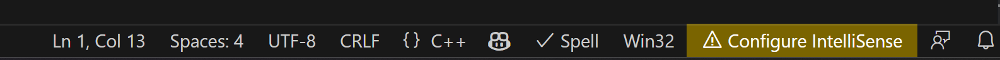
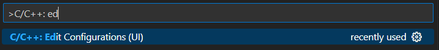
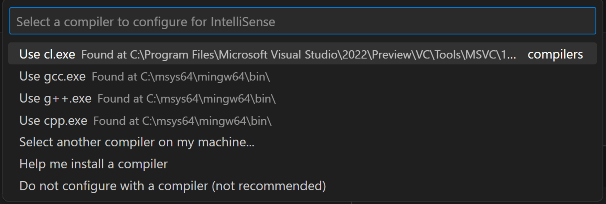
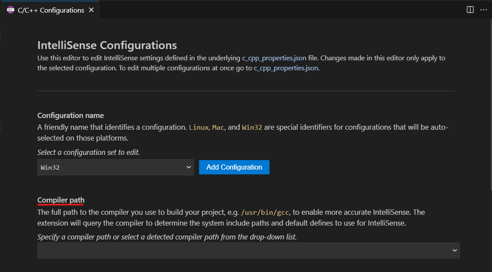
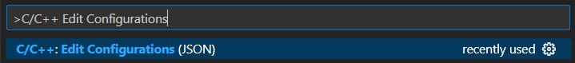
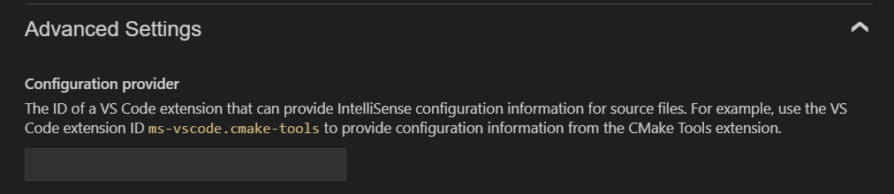
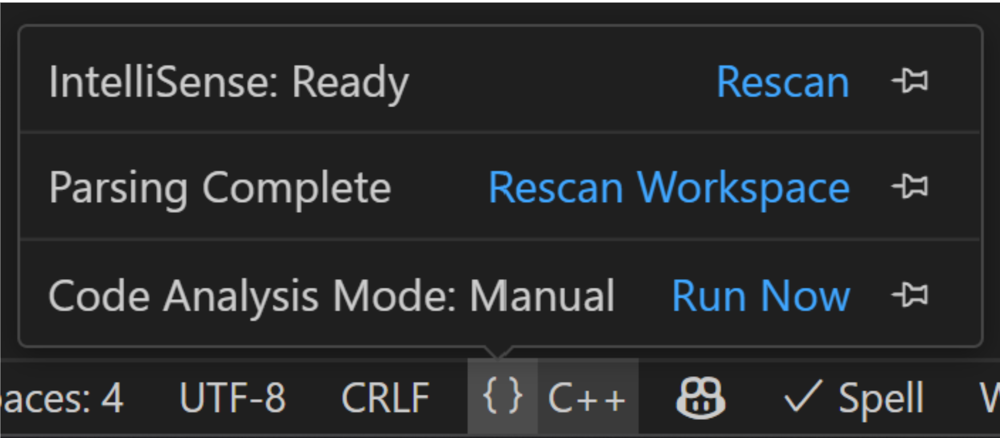

+++
title = "Configure IntelliSense"
date = 2024-01-12T22:36:24+08:00
weight = 120
type = "docs"
description = ""
isCJKLanguage = true
draft = false
+++

> 原文: [https://code.visualstudio.com/docs/cpp/configure-intellisense](https://code.visualstudio.com/docs/cpp/configure-intellisense)

# Configure C/C++ IntelliSense 配置 C/C++ IntelliSense

This article is about configuring the [C/C++](https://marketplace.visualstudio.com/items?itemName=ms-vscode.cpptools) extension to provide C++ specific [IntelliSense]() suggestions in Visual Studio Code. IntelliSense is a helpful tool built into VS Code that provides various code editing features to help you code faster and more efficiently. For example, code completion, parameter info, syntax highlighting, Code Actions (light bulbs), and member lists are all generated using IntelliSense.

​​​	本文介绍如何配置 C/C++ 扩展，以便在 Visual Studio Code 中提供 C++ 特定的 IntelliSense 建议。IntelliSense 是 VS Code 中内置的一个有用的工具，它提供各种代码编辑功能，帮助您更快、更高效地编写代码。例如，代码补全、参数信息、语法突出显示、代码操作（灯泡）和成员列表都是使用 IntelliSense 生成的。

C/C++ IntelliSense only requires a C/C++ compiler to be installed on your system. The C/C++ compiler provides C++ specific information to IntelliSense, such as the locations of system include paths and other settings. For project level configurations, reference [Project level IntelliSense configuration]() section.

​​​	C/C++ IntelliSense 只需要在您的系统上安装一个 C/C++ 编译器。C/C++ 编译器向 IntelliSense 提供 C++ 特定的信息，例如系统包含路径的位置和其他设置。对于项目级别的配置，请参考项目级别的 IntelliSense 配置部分。

## [When will the C/C++ extension configure core IntelliSense features for me? C/C++ 扩展何时会为我配置核心 IntelliSense 功能？]()

A compiler is the only requirement to configure core IntelliSense functionality. To identify a compiler for IntelliSense, the C/C++ extension scans common paths on your machine for compilers such as Clang, GCC, MinGW, cygwin, cygwin64, and MSVC. If any of these compilers are identified and in a secure location, they are automatically configured for IntelliSense. Otherwise, a notification is displayed asking you to confirm that this compiler should be configured for IntelliSense. In either of these scenarios, the compiler selected is also set as the default compiler.

​​​	配置核心 IntelliSense 功能的唯一要求是编译器。为了识别 IntelliSense 的编译器，C/C++ 扩展会扫描计算机上的常见路径，以查找 Clang、GCC、MinGW、cygwin、cygwin64 和 MSVC 等编译器。如果识别出其中任何编译器且位于安全位置，则会自动将其配置为 IntelliSense。否则，会显示一条通知，要求您确认是否应将此编译器配置为 IntelliSense。在这两种情况下，选定的编译器还将设置为默认编译器。

## [How to check whether IntelliSense is configured 如何检查 IntelliSense 是否已配置]()

If you don't have IntelliSense configured, the C/C++ extension shows a yellow indicator in the status bar with a warning sign labeled **Configure IntelliSense**.

​​​	如果您尚未配置 IntelliSense，C/C++ 扩展会在状态栏中显示一个黄色指示器，其中包含标记为“配置 IntelliSense”的警告标志。

To configure, select the status bar indicator, which brings up the [configuration Quick Pick](). The Quick Pick can help you select or install a C/C++ compiler.

​​​	要配置，请选择状态栏指示器，这会调出配置快速选择。快速选择可以帮助您选择或安装 C/C++ 编译器。

If you do not see a status bar indicator, you can also check your project's `c_cpp_properties.json` file. This file stores all of your IntelliSense configuration settings. Navigate to this file by selecting **C/C++: Edit Configurations (UI)** from the Command Palette (Ctrl+Shift+P). Check the `IntelliSense mode` to find your configuration. To learn more about the `c_cpp_properties.json` file, you can review the [schema reference](https://code.visualstudio.com/docs/cpp/c-cpp-properties-schema-reference).

​​​	如果看不到状态栏指示器，还可以检查项目的 `c_cpp_properties.json` 文件。此文件存储所有 IntelliSense 配置设置。通过从命令面板 (Ctrl+Shift+P) 中选择 C/C++: 编辑配置 (UI) 来导航到此文件。检查 `IntelliSense mode` 以查找配置。若要详细了解 `c_cpp_properties.json` 文件，可以查看架构参考。

## [How to configure IntelliSense 如何配置 IntelliSense]()

IntelliSense configuration is stored in the `c_cpp_properties.json` file, which is automatically created in your workspace. All three of the following options are different ways of editing the `c_cpp_properties.json` file:

​​​	IntelliSense 配置存储在 `c_cpp_properties.json` 文件中，该文件会在工作区中自动创建。以下三个选项都是编辑 `c_cpp_properties.json` 文件的不同方式：

### [Option 1. Select a configuration option through the configuration Quick Pick 选项 1. 通过配置快速选择选择配置选项]()

Open the Quick Pick by entering **Select IntelliSense Configuration** in the Command Palette (Ctrl+Shift+P), which shows you a dropdown with all of the configuration options found by the C/C++ extension on your machine.

​​​	通过在命令面板 (Ctrl+Shift+P) 中输入选择 IntelliSense 配置来打开快速选择，这会显示一个下拉列表，其中包含计算机上的 C/C++ 扩展找到的所有配置选项。

Select one of the options available. If you select a compiler, this compiler is used by IntelliSense by default. You can return to the **Configure IntelliSense** Quick Pick at any point to change which option is used to configure IntelliSense.

​​​	选择一个可用选项。如果选择编译器，则此编译器将默认由 IntelliSense 使用。可以随时返回配置 IntelliSense 快速选择，以更改用于配置 IntelliSense 的选项。

If no options are available in the Quick Pick, no compiler could be identified in your system. You can browse your machine manually or install a C/C++ compiler. To install on a Windows machine, select the **Help me install a compiler** option that redirects you to the step-by-step walkthrough of how to install a C/C++ compiler. On a macOS or Linux machine, select **Install a compiler** and navigate through the prompts to have a C++ compiler installed on your machine.

​​​	如果快速选择中没有可用选项，则系统中未识别到编译器。您可以手动浏览计算机或安装 C/C++ 编译器。要在 Windows 计算机上安装，请选择“帮助我安装编译器”选项，该选项会将您重定向到有关如何安装 C/C++ 编译器的分步演练。在 macOS 或 Linux 计算机上，选择“安装编译器”并按照提示操作，以便在计算机上安装 C++ 编译器。

### [Option 2. Edit your IntelliSense configurations through the UI 选项 2. 通过 UI 编辑 IntelliSense 配置]()

Open your IntelliSense configuration by selecting **C/C++: Edit Configurations (UI)** from the Command Palette (Ctrl+Shift+P). This view is a user interface for the `c_cpp_properties.json` file.

​​​	通过从命令面板 (Ctrl+Shift+P) 中选择“C/C++: 编辑配置 (UI)”来打开 IntelliSense 配置。此视图是 `c_cpp_properties.json` 文件的用户界面。

Set the **Compiler path** field to the full path of the compiler you're using to build your project. For example, when using the default install path for GCC on Linux, the compiler path is `/usr/bin/gcc`. Set the **IntelliSense mode** to the architecture-specific variant of the compiler you're using.

​​​	将“编译器路径”字段设置为用于构建项目的编译器的完整路径。例如，在 Linux 上使用 GCC 的默认安装路径时，编译器路径为 `/usr/bin/gcc` 。将 IntelliSense 模式设置为所用编译器的特定于体系结构的变体。

### [Option 3. Edit the c_cpp_properties.json file directly 选项 3. 直接编辑 c_cpp_properties.json 文件]()

You can edit the `c_cpp_properties.json` file directly to customize your configuration. Use the **C/C++ Edit Configurations (JSON)** command from the Command Palette (Ctrl+Shift+P), then the `c_cpp_properties.json` file is created in the `.vscode` folder of your workspace.

​​​	您可以直接编辑 `c_cpp_properties.json` 文件以自定义您的配置。从命令面板（Ctrl+Shift+P）中使用 C/C++ 编辑配置（JSON）命令，然后在工作区的 `.vscode` 文件夹中创建 `c_cpp_properties.json` 文件。

Use the `compilerPath` variable to add a compiler. This variable is the full path of the compiler you're using to build your project. For example, when using the default install path for GCC on Linux, the compiler path is `/usr/bin/gcc`.

​​​	使用 `compilerPath` 变量添加编译器。此变量是用于构建项目的编译器的完整路径。例如，在 Linux 上使用 GCC 的默认安装路径时，编译器路径为 `/usr/bin/gcc` 。

For more information about the `c_cpp_properties.json` file, review the [schema reference](https://code.visualstudio.com/docs/cpp/c-cpp-properties-schema-reference).

​​​	有关 `c_cpp_properties.json` 文件的更多信息，请查看架构参考。

Select the sample below based on your operating system for a `c_cpp_configuration.json` file:

​​​	根据您的操作系统选择以下示例作为 `c_cpp_configuration.json` 文件：

<b data-immersive-translate-walked="5f8dca87-5e6a-4374-906c-2591c5e11885" data-immersive-translate-paragraph="1" style="box-sizing: border-box; font-family: &quot;Segoe UI&quot;, &quot;Helvetica Neue&quot;, Helvetica, Arial, sans-serif; font-weight: 600;">&gt; Sample c_cpp_configuration.json on Windows &gt; Windows 上的 c_cpp_configuration.json 示例</b>
 
  
<pre class="shiki" style="box-sizing: border-box; font-family: Menlo, Monaco, Consolas, &quot;Courier New&quot;, monospace !important; overflow: auto; font-size: 13px; display: block; padding: 0.5em 0.7em; margin: 1em 0px; line-height: 1.42857; color: rgb(51, 51, 51); word-break: break-all; overflow-wrap: break-word; background-color: rgb(255, 255, 255); border: 1px solid rgb(148, 148, 148); border-radius: 4px;"><code style="box-sizing: border-box; font-family: Menlo, Monaco, Consolas, &quot;Courier New&quot;, monospace !important; font-size: inherit; padding: 0px; color: inherit; background-color: transparent; border-radius: 0px; white-space: pre-wrap; tab-size: 2;"></code></pre>

<b data-immersive-translate-walked="5f8dca87-5e6a-4374-906c-2591c5e11885" data-immersive-translate-paragraph="1" style="box-sizing: border-box; font-family: &quot;Segoe UI&quot;, &quot;Helvetica Neue&quot;, Helvetica, Arial, sans-serif; font-weight: 600;">&gt; Sample c_cpp_configuration.json on macOS &gt; macOS 上的 c_cpp_configuration.json 示例</b>
  <pre class="shiki" style="box-sizing: border-box; font-family: Menlo, Monaco, Consolas, &quot;Courier New&quot;, monospace !important; overflow: auto; font-size: 13px; display: block; padding: 0.5em 0.7em; margin: 1em 0px; line-height: 1.42857; color: rgb(51, 51, 51); word-break: break-all; overflow-wrap: break-word; background-color: rgb(255, 255, 255); border: 1px solid rgb(148, 148, 148); border-radius: 4px;"><code style="box-sizing: border-box; font-family: Menlo, Monaco, Consolas, &quot;Courier New&quot;, monospace !important; font-size: inherit; padding: 0px; color: inherit; background-color: transparent; border-radius: 0px; white-space: pre-wrap; tab-size: 2;"></code></pre>

<b data-immersive-translate-walked="5f8dca87-5e6a-4374-906c-2591c5e11885" data-immersive-translate-paragraph="1" style="box-sizing: border-box; font-family: &quot;Segoe UI&quot;, &quot;Helvetica Neue&quot;, Helvetica, Arial, sans-serif; font-weight: 600;">&gt; Sample c_cpp_configuration.json on Linux &gt; Linux 上的 c_cpp_configuration.json 示例</b>
  <pre class="shiki" style="box-sizing: border-box; font-family: Menlo, Monaco, Consolas, &quot;Courier New&quot;, monospace !important; overflow: auto; font-size: 13px; display: block; padding: 0.5em 0.7em; margin: 1em 0px; line-height: 1.42857; color: rgb(51, 51, 51); word-break: break-all; overflow-wrap: break-word; background-color: rgb(255, 255, 255); border: 1px solid rgb(148, 148, 148); border-radius: 4px;"><code style="box-sizing: border-box; font-family: Menlo, Monaco, Consolas, &quot;Courier New&quot;, monospace !important; font-size: inherit; padding: 0px; color: inherit; background-color: transparent; border-radius: 0px; white-space: pre-wrap; tab-size: 2;"></code></pre>

## [Project level IntelliSense configuration 项目级别 IntelliSense 配置]()

Configuring IntelliSense with a compiler provides you with core IntelliSense features. This setup is called the base configuration. For more complex usage scenarios, such as setting up a project that requires:

​​​	使用编译器配置 IntelliSense 可为您提供核心 IntelliSense 功能。此设置称为基本配置。对于更复杂的使用场景，例如设置需要以下内容的项目：

- Additional include paths, such as references to one or multiple different libraries
  其他包含路径，例如对一个或多个不同库的引用
- Specific compiler arguments that influence the behavior of the language(and therefore IntelliSense)
  影响语言行为（因此也影响 IntelliSense）的特定编译器参数

There are multiple other ways to configure IntelliSense. You can provide these additional configurations either through:

​​​	有多种其他方式可用于配置 IntelliSense。您可以通过以下方式提供这些其他配置：

- The `c_cpp_properties.json` file and related settings
  `c_cpp_properties.json` 文件和相关设置
- A custom configuration provider in the form of another VS Code extension (for example, the [Makefile Tools](https://marketplace.visualstudio.com/items?itemName=ms-vscode.makefile-tools) or [CMake Tools]() extensions)
  另一个 VS Code 扩展形式的自定义配置提供程序（例如，Makefile Tools 或 CMake Tools 扩展）
- A `compile_commands.json` file
  `compile_commands.json` 文件

### [Configuration providers 配置提供程序]()

A custom configuration provider is another extension in VS Code that can potentially provide more accurate C++ IntelliSense configuration than the C/C++ extension. For example, for the CMake or Make build systems, where the [Makefile Tools](https://marketplace.visualstudio.com/items?itemName=ms-vscode.makefile-tools) or [CMake Tools]() extensions can be configuration providers. To add an extension as a configuration provider, either select the extension through the configuration Quick Pick, add it to configuration UI by editing the **Configuration provider** field under **Advanced Settings**, or add the `configurationProvider` field to your `c_cpp_properties.json` file. For example, for the CMake extension, the path to add would be `ms-vscode.cmake-tools`.

​​​	自定义配置提供程序是 VS Code 中的另一个扩展，它可能比 C/C++ 扩展提供更准确的 C++ IntelliSense 配置。例如，对于 CMake 或 Make 构建系统，Makefile Tools 或 CMake Tools 扩展可以是配置提供程序。若要将扩展添加为配置提供程序，请通过配置快速选取选择扩展，通过编辑高级设置下的配置提供程序字段将其添加到配置 UI，或将 `configurationProvider` 字段添加到 `c_cpp_properties.json` 文件。例如，对于 CMake 扩展，要添加的路径为 `ms-vscode.cmake-tools` 。

The C/C++ extension scans your system for custom configuration providers. If it identifies only one custom configuration provider, this configuration provider is automatically configured for IntelliSense. If there are multiple configuration providers identified, you need to select which the extension should use by opening the [configuration Quick Pick]().

​​​	C/C++ 扩展会扫描您的系统以查找自定义配置提供程序。如果它仅识别到一个自定义配置提供程序，则会自动为 IntelliSense 配置此配置提供程序。如果识别到多个配置提供程序，则需要通过打开配置快速选取来选择扩展应使用哪个配置提供程序。

### [compile_commands.json file compile_commands.json 文件]()

Another option to provide IntelliSense configuration is a [compile_commands.json](https://clang.llvm.org/docs/HowToSetupToolingForLLVM.html) file, which describes the exact compile commands used for every file in a project. This file is often generated by a build system, such as CMake or Bazel, by setting command line arguments when configuring your project. A `compile_commands.json` file can be selected for configuration through the same methods as discussed in the [How to configure IntelliSense]() section via the configuration Quick Pick, editing configurations through the UI, or editing the `c_cpp_properties.json` file directly. In the configuration UI, the file can be added under **Advanced Configurations** and the **Compile commands** field. For example, if your `compile_commands.json` file is in the root of your workspace, enter `${workspaceFolder}/compile_commands.json` in the **Compile commands** field. Otherwise, it can be added to the `c_cpp_properties.json` file directly using the `compileCommands` configuration property.

​​​	提供 IntelliSense 配置的另一个选项是 compile_commands.json 文件，它描述了项目中每个文件使用的确切编译命令。此文件通常由构建系统（如 CMake 或 Bazel）生成，方法是在配置项目时设置命令行参数。可以通过与在“如何配置 IntelliSense”部分中讨论的方法相同的方法选择 `compile_commands.json` 文件进行配置，即通过配置快速选择、通过 UI 编辑配置或直接编辑 `c_cpp_properties.json` 文件。在配置 UI 中，可以在“高级配置”和“编译命令”字段下添加该文件。例如，如果您的 `compile_commands.json` 文件位于工作区的根目录中，请在“编译命令”字段中输入 `${workspaceFolder}/compile_commands.json` 。否则，可以使用 `compileCommands` 配置属性将其直接添加到 `c_cpp_properties.json` 文件中。

If the compile commands database does not contain an entry for the translation unit that corresponds to the file you opened in the editor, your base configuration (found in `c_cpp_properties.json`) is used instead (such as your `includePath` and `defines`). If the C/C++ extension reverts to the base configuration, the [language status bar indicator]() shows you the label **Configure IntelliSense** in the status bar.

​​​	如果编译命令数据库不包含与您在编辑器中打开的文件相对应的翻译单元的条目，则会使用基本配置（在 `c_cpp_properties.json` 中找到）作为替代（例如您的 `includePath` 和 `defines` ）。如果 C/C++ 扩展还原为基本配置，则语言状态栏指示器会在状态栏中显示标签“配置 IntelliSense”。

If you specified a custom configuration provider and a `compile_commands.json` file, the custom configuration provider is queried first for an IntelliSense configuration.

​​​	如果您指定了自定义配置提供程序和 `compile_commands.json` 文件，则会首先查询自定义配置提供程序以获取 IntelliSense 配置。

If your program includes header files that aren't in your workspace or that aren't in the standard library path, you can modify the **Include Path**. The C/C++ extension populates the include path by querying the compiler specified by **Compiler path**. If the extension can't find the path for the target system libraries, you can enter the include path manually.

​​​	如果您的程序包含不在工作区中或不在标准库路径中的头文件，则可以修改包含路径。C/C++ 扩展通过查询编译器路径中指定的编译器来填充包含路径。如果扩展无法找到目标系统库的路径，则可以手动输入包含路径。

### [Check IntelliSense activity using the language status bar 使用语言状态栏检查 IntelliSense 活动]()

You can determine if IntelliSense is actively working on your file using the language status bar. To invoke the language status bar, open a C++ file. The status bar shows the text **{} C++**. Hover over the **{}** symbol to open the language status bar flyout. The top item in the flyout indicates the IntelliSense status. Here are the different statuses and their meanings:

​​​	您可以使用语言状态栏来确定 IntelliSense 是否正在您的文件中主动工作。若要调用语言状态栏，请打开一个 C++ 文件。状态栏显示文本 {} C++。将鼠标悬停在 {} 符号上以打开语言状态栏弹出窗口。弹出窗口中的第一项指示 IntelliSense 状态。以下是不同的状态及其含义：

- **IntelliSense: Ready** = IntelliSense is configured for the C/C++ extension and automatically activates if you interact with the editor, for example, by writing code.
  IntelliSense：已就绪 = IntelliSense 已针对 C/C++ 扩展进行配置，并且如果您与编辑器进行交互（例如，通过编写代码），它会自动激活。
- **IntelliSense: Updating** = IntelliSense is actively working to determine any code completions, syntax highlighting, etc. based on changes you're making to your code.
  IntelliSense：正在更新 = IntelliSense 正在积极地根据您对代码所做的更改来确定任何代码补全、语法突出显示等。

You can select the pin icon on the right of any item in the language status bar flyout to permanently pin it to your status bar.

​​​	您可以选择语言状态栏弹出窗口中任何项目右侧的图钉图标，以将其永久固定到您的状态栏。

## [Next steps 后续步骤]()

- For more information about IntelliSense configuration, see [Customizing default settings]().
  有关 IntelliSense 配置的更多信息，请参阅自定义默认设置。
- If you have trouble configuring the settings, please start a discussion at [GitHub discussions](https://github.com/microsoft/vscode-cpptools/discussions), or if you find an issue that needs to be fixed, file an issue at [GitHub issues](https://github.com/microsoft/vscode-cpptools/issues).
  如果您在配置设置时遇到问题，请在 GitHub 讨论中发起讨论，或者如果您发现需要修复的问题，请在 GitHub 问题中提交问题。
- Explore the [c_cpp_properties schema](https://code.visualstudio.com/docs/cpp/c-cpp-properties-schema-reference).
  探索 c_cpp_properties 架构。
- Review the [Overview of the C++ extension]().
  查看 C++ 扩展概述。
