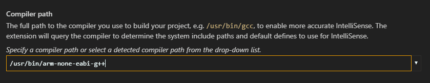
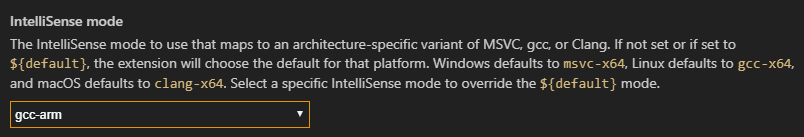
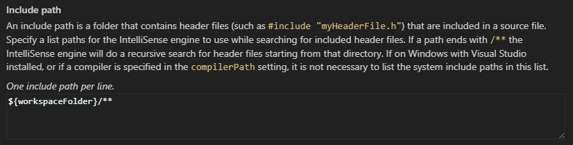

+++
title = "Configure IntelliSense for cross-compiling"
date = 2024-01-12T22:36:24+08:00
weight = 130
type = "docs"
description = ""
isCJKLanguage = true
draft = false
+++

> 原文: [https://code.visualstudio.com/docs/cpp/configure-intellisense-crosscompilation](https://code.visualstudio.com/docs/cpp/configure-intellisense-crosscompilation)

# IntelliSense for cross-compiling 交叉编译的 IntelliSense


This article is about configuring the C/C++ extension to provide proper IntelliSense (e.g. code completions) in Visual Studio Code when you compile for a different architecture than your development host machine. For example, when your host machine is x64 but you are compiling for Arm.

&zeroWidthSpace;本文介绍如何配置 C/C++ 扩展，以便在您为与开发主机不同的体系结构编译时在 Visual Studio Code 中提供适当的 IntelliSense（例如代码补全）。例如，当您的主机是 x64 但您正在为 Arm 编译时。

The C/C++ extension isn't a compiler -- it provides rich language features such as syntax highlighting and IntelliSense. For the extension to provide correct IntelliSense suggestions and to reflect the right sizes of data types, you need to configure the C++ extension to emulate the target architecture.

&zeroWidthSpace;C/C++ 扩展不是编译器——它提供丰富的语言功能，如语法突出显示和 IntelliSense。为了让扩展提供正确的 IntelliSense 建议并反映数据类型的正确大小，您需要配置 C++ 扩展以模拟目标体系结构。

These configuration settings are stored in your project's `c_cpp_properties.json` file. To edit this file, in VS Code, select **C/C++: Edit Configurations (UI)** from the Command Palette (Ctrl+Shift+P):

&zeroWidthSpace;这些配置设置存储在项目的 `c_cpp_properties.json` 文件中。若要编辑此文件，请在 VS Code 中从命令面板（Ctrl+Shift+P）中选择 C/C++：编辑配置（UI）：


## [Example IntelliSense configuration IntelliSense 配置示例](https://code.visualstudio.com/docs/cpp/configure-intellisense-crosscompilation#_example-intellisense-configuration)

The following shows configuring the C/C++ extension for a Linux x64 host machine that targets Linux Arm. It configures the following IntelliSense settings:

&zeroWidthSpace;以下内容演示如何为针对 Linux Arm 的 Linux x64 主机计算机配置 C/C++ 扩展。它配置以下 IntelliSense 设置：

- **Compiler path**: the extension queries your compiler at this location to retrieve system libraries and compiler defines.
  编译器路径：扩展在此位置查询您的编译器以检索系统库和编译器定义。
- **IntelliSense mode**: emulates the target architecture and compiler so that the extension can provide correct IntelliSense and reflect the right sizes of data types such as `pointer`, `size_t`, `long`, and so on.
  IntelliSense 模式：模拟目标体系结构和编译器，以便扩展可以提供正确的 IntelliSense 并反映数据类型（如 `pointer` 、 `size_t` 、 `long` 等）的正确大小。

At a minimum, setting **compiler path** and **IntelliSense mode** provides enough information for the extension to emulate your project's target architecture, although setting **IntelliSense mode** may not be needed if the extension is able to choose it correctly based on the defines returned from querying the **compiler path**.

&zeroWidthSpace;至少，设置编译器路径和 IntelliSense 模式可为扩展提供足够的信息来模拟项目的目标体系结构，尽管如果扩展能够根据从查询编译器路径返回的定义正确选择 IntelliSense 模式，则可能不需要设置 IntelliSense 模式。

### [Compiler path 编译器路径](https://code.visualstudio.com/docs/cpp/configure-intellisense-crosscompilation#_compiler-path)

Set to the full path of the compiler you are using to build your project.

&zeroWidthSpace;设置为用于构建项目的编译器的完整路径。

For example:

&zeroWidthSpace;例如：



### [IntelliSense mode IntelliSense 模式](https://code.visualstudio.com/docs/cpp/configure-intellisense-crosscompilation#_intellisense-mode)

Set to the architecture-specific variant of the compiler you are using.

&zeroWidthSpace;设置为所用编译器的特定于体系结构的变体。

For example:

&zeroWidthSpace;例如：



### [Include path 包含路径](https://code.visualstudio.com/docs/cpp/configure-intellisense-crosscompilation#_include-path)

You only need to modify the **Include path** if your program includes header files that aren't in your workspace or that are not in the standard library path.

&zeroWidthSpace;仅当程序包含不在工作区中或不在标准库路径中的头文件时，才需要修改包含路径。

The C/C++ extension populates the include path by querying the compiler specified by **Compiler path**. If the extension can't find the path for the target system libraries, you can enter the include path manually:

&zeroWidthSpace;C/C++ 扩展通过查询编译器路径指定的编译器来填充包含路径。如果扩展找不到目标系统库的路径，可以手动输入包含路径：



Given the settings above, your `c_cpp_configuration.json` file will look something like the following. You can open it by selecting **C/C++: Edit Configurations (JSON)** from the Command Palette:

&zeroWidthSpace;根据以上设置，您的 `c_cpp_configuration.json` 文件将类似于以下内容。您可以通过从命令面板中选择 C/C++: 编辑配置 (JSON) 来打开它：

```
{
  "configurations": [
    {
      "name": "myConfigurationName",
      "includePath": ["${workspaceFolder}/**"],
      "defines": [],
      "compilerPath": "/usr/bin/arm-none-eabi-g++",
      "cStandard": "c11",
      "cppStandard": "c++14",
      "IntelliSenseMode": "gcc-arm"
    }
  ],
  "version": 4
}
```

## [Next steps 后续步骤](https://code.visualstudio.com/docs/cpp/configure-intellisense-crosscompilation#_next-steps)

- For more information about IntelliSense configuration, see [Customizing default settings](https://code.visualstudio.com/docs/cpp/customize-default-settings-cpp).
  有关 IntelliSense 配置的更多信息，请参阅自定义默认设置。
- If you have trouble configuring the settings, please start a discussion at [GitHub discussions](https://github.com/microsoft/vscode-cpptools/discussions), or if you find an issue that needs to be fixed, file an issue at [GitHub issues](https://github.com/microsoft/vscode-cpptools/issues).
  如果您在配置设置时遇到问题，请在 GitHub 讨论中发起讨论，或者如果您发现需要修复的问题，请在 GitHub 问题中提交问题。
- Explore the [c_cpp_properties schema](https://code.visualstudio.com/docs/cpp/c-cpp-properties-schema-reference).
  探索 c_cpp_properties 架构。
- Review the [Overview of the C++ extension](https://code.visualstudio.com/docs/languages/cpp).
  查看 C++ 扩展概述。
