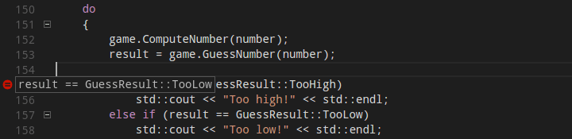
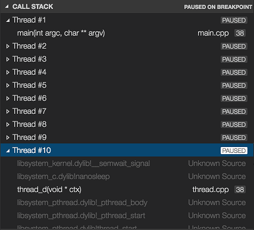

+++
title = "Debugging"
date = 2024-01-12T22:36:24+08:00
weight = 90
type = "docs"
description = ""
isCJKLanguage = true
draft = false
+++

> 原文: [https://code.visualstudio.com/docs/cpp/cpp-debug](https://code.visualstudio.com/docs/cpp/cpp-debug)

# Debug C++ in Visual Studio Code 在 Visual Studio Code 中调试 C++


After you have set up the basics of your debugging environment as specified in the configuration tutorials for each target compiler/platform, you can learn more details about debugging C/C++ in this section.

&zeroWidthSpace;在您按照针对每个目标编译器/平台的配置教程中指定的方式设置好调试环境的基础知识后，您可以在本部分中了解有关调试 C/C++ 的更多详细信息。

Visual Studio Code supports the following debuggers for C/C++ depending on the operating system you are using:

&zeroWidthSpace;Visual Studio Code 支持以下适用于 C/C++ 的调试器，具体取决于您使用的操作系统：

- **Linux**: GDB
  Linux：GDB
- **macOS**: LLDB or GDB
  macOS：LLDB 或 GDB
- **Windows**: the Visual Studio Windows Debugger or GDB (using Cygwin or MinGW)
  Windows：Visual Studio Windows 调试器或 GDB（使用 Cygwin 或 MinGW）

## [Windows debugging with GDB 使用 GDB 进行 Windows 调试](https://code.visualstudio.com/docs/cpp/cpp-debug#_windows-debugging-with-gdb)

You can debug Windows applications created using Cygwin or MinGW by using VS Code. To use Cygwin or MinGW debugging features, the debugger path must be set manually in the launch configuration (`launch.json`). To debug your Cygwin or MinGW application, add the `miDebuggerPath` property and set its value to the location of the corresponding gdb.exe for your Cygwin or MinGW environment.

&zeroWidthSpace;您可以使用 VS Code 调试使用 Cygwin 或 MinGW 创建的 Windows 应用程序。若要使用 Cygwin 或 MinGW 调试功能，必须在启动配置中手动设置调试器路径（ `launch.json` ）。若要调试 Cygwin 或 MinGW 应用程序，请添加 `miDebuggerPath` 属性，并将其值设置为 Cygwin 或 MinGW 环境中相应 gdb.exe 的位置。

For example:

&zeroWidthSpace;例如：

```
    "miDebuggerPath": "c:\\mingw\\bin\\gdb.exe"
```

Cygwin/MinGW debugging on Windows supports both attach and launch debugging scenarios.

&zeroWidthSpace;Windows 上的 Cygwin/MinGW 调试支持附加和启动调试方案。

To learn more, see [Configure C/C++ debugging](https://code.visualstudio.com/docs/cpp/launch-json-reference).

&zeroWidthSpace;若要了解详细信息，请参阅配置 C/C++ 调试。

If you are debugging with GDB on Windows, see [Windows Debugging with MinGW64](https://code.visualstudio.com/docs/cpp/config-mingw).

&zeroWidthSpace;如果您在 Windows 上使用 GDB 进行调试，请参阅使用 MinGW64 进行 Windows 调试。

## [Conditional breakpoints 条件断点](https://code.visualstudio.com/docs/cpp/cpp-debug#_conditional-breakpoints)

Conditional breakpoints enable you to break execution on a particular line of code only when the value of the condition is true. To set a conditional breakpoint, right-click on an existing breakpoint and select **Edit Breakpoint**. This opens a small peek window where you can enter the condition that must evaluate to true in order for the breakpoint to be hit during debugging.

&zeroWidthSpace;条件断点使您仅在条件值为 true 时才在特定代码行上中断执行。要设置条件断点，请右键单击现有断点并选择“编辑断点”。这将打开一个小预览窗口，您可以在其中输入条件，该条件必须计算为 true，才能在调试期间命中断点。



In the editor, conditional breakpoints are indicated by a breakpoint symbol that has a black equals sign inside of it. You can place the cursor over a conditional breakpoint to show its condition.

&zeroWidthSpace;在编辑器中，条件断点由断点符号指示，其中包含一个黑色的等号。您可以将光标放在条件断点上以显示其条件。

## [Function breakpoints 函数断点](https://code.visualstudio.com/docs/cpp/cpp-debug#_function-breakpoints)

Function breakpoints enable you to break execution at the beginning of a function instead of on a particular line of code. To set a function breakpoint, on the **Run** view right-click inside the **Breakpoints** section, then choose **Add Function Breakpoint** and enter the name of the function on which you want to break execution.

&zeroWidthSpace;函数断点使您能够在函数开头中断执行，而不是在特定代码行上中断执行。要设置函数断点，请在“运行”视图中右键单击“断点”部分，然后选择“添加函数断点”，并输入要中断执行的函数的名称。

## [Expression evaluation 表达式评估](https://code.visualstudio.com/docs/cpp/cpp-debug#_expression-evaluation)

VS Code supports expression evaluation in several contexts:

&zeroWidthSpace;VS Code 在多种上下文中支持表达式求值：

- You can type an expression into the **Watch** section of the **Run** view and it will be evaluated each time a breakpoint is hit.
  您可以在“运行”视图的“监视”部分中键入表达式，每次命中断点时都会对其进行求值。
- You can type an expression into the **Debug Console** and it will be evaluated only once.
  您可以在“调试控制台”中键入表达式，它只会被求值一次。
- You can evaluate any expression that appears in your code while you're stopped at a breakpoint.
  在您在断点处停止时，您可以评估代码中出现的任何表达式。

Expressions in the **Watch** section take effect in the application being debugged; an expression that modifies the value of a variable will modify that variable for the duration of the program.

&zeroWidthSpace;监视部分中的表达式在正在调试的应用程序中生效；修改变量值的表达式将在程序持续期间修改该变量。

## [Multi-threaded debugging 多线程调试](https://code.visualstudio.com/docs/cpp/cpp-debug#_multithreaded-debugging)

The C/C++ extension for VS Code has the ability to debug multi-threaded programs. All threads and their call stacks appear in the **Call Stack** section:

&zeroWidthSpace;VS Code 的 C/C++ 扩展程序能够调试多线程程序。所有线程及其调用堆栈都显示在“调用堆栈”部分中：



## [Memory dump debugging 内存转储调试](https://code.visualstudio.com/docs/cpp/cpp-debug#_memory-dump-debugging)

The C/C++ extension for VS Code also has the ability to debug memory dumps. To debug a memory dump, open your `launch.json` file and add the `coreDumpPath` (for GDB or LLDB) or `dumpPath` (for the Visual Studio Windows Debugger) property to the **C++ Launch** configuration, set its value to be a string containing the path to the memory dump. This will even work for x86 programs being debugged on an x64 machine.

&zeroWidthSpace;VS Code 的 C/C++ 扩展程序还能够调试内存转储。若要调试内存转储，请打开您的 `launch.json` 文件，并将 `coreDumpPath` （适用于 GDB 或 LLDB）或 `dumpPath` （适用于 Visual Studio Windows 调试器）属性添加到 C++ 启动配置中，将其值设置为包含内存转储路径的字符串。这甚至适用于在 x64 机器上调试的 x86 程序。

## [Additional symbols 其他符号](https://code.visualstudio.com/docs/cpp/cpp-debug#_additional-symbols)

If there are additional directories where the debugger can find symbol files (for example, `.pdb` files for the Visual Studio Windows Debugger), they can be specified by adding the `additionalSOLibSearchPath` (for GDB or LLDB) or `symbolSearchPath` (for the Visual Studio Windows Debugger).

&zeroWidthSpace;如果还有其他目录，调试器可以在其中找到符号文件（例如，Visual Studio Windows 调试器的 `.pdb` 文件），则可以通过添加 `additionalSOLibSearchPath` （适用于 GDB 或 LLDB）或 `symbolSearchPath` （适用于 Visual Studio Windows 调试器）来指定这些目录。

For example:

&zeroWidthSpace;例如：

```
    "additionalSOLibSearchPath": "/path/to/symbols;/another/path/to/symbols"
```

or

```
    "symbolSearchPath": "C:\\path\\to\\symbols;C:\\another\\path\\to\\symbols"
```

## [Locate source files 查找源文件](https://code.visualstudio.com/docs/cpp/cpp-debug#_locate-source-files)

The source file location can be changed if the source files are not located in the compilation location. This is done by simple replacement pairs added in the `sourceFileMap` section. The first match in this list will be used.

&zeroWidthSpace;如果源文件未位于编译位置，则可以更改源文件位置。这是通过在 `sourceFileMap` 部分中添加简单的替换对来完成的。将使用此列表中的第一个匹配项。

For example:

&zeroWidthSpace;例如：

```
"sourceFileMap": {
    "/build/gcc-4.8-fNUjSI/gcc-4.8-4.8.4/build/i686-linux-gnu/libstdc++-v3/include/i686-linux-gnu": "/usr/include/i686-linux-gnu/c++/4.8",
    "/build/gcc-4.8-fNUjSI/gcc-4.8-4.8.4/build/i686-linux-gnu/libstdc++-v3/include": "/usr/include/c++/4.8"
}
```

## [GDB, LLDB, and LLDB-MI Commands (GDB/LLDB) GDB、LLDB 和 LLDB-MI 命令 (GDB/LLDB)](https://code.visualstudio.com/docs/cpp/cpp-debug#_gdb-lldb-and-lldbmi-commands-gdblldb)

For the `C++ (GDB/LLDB)` debugging environment, you can execute GDB, LLDB and LLDB-MI commands directly through the debug console with the `-exec` command, but be careful, executing commands directly in the debug console is untested and might crash VS Code in some cases.

&zeroWidthSpace;对于 `C++ (GDB/LLDB)` 调试环境，您可以使用 `-exec` 命令直接通过调试控制台执行 GDB、LLDB 和 LLDB-MI 命令，但请小心，在调试控制台中直接执行命令未经测试，在某些情况下可能会导致 VS Code 崩溃。

## [Other debugging features 其他调试功能](https://code.visualstudio.com/docs/cpp/cpp-debug#_other-debugging-features)

- Unconditional breakpoints
  无条件断点
- Watch window
  监视窗口
- Call stack
  调用堆栈
- Stepping
  单步执行

For more information on debugging with VS Code, see this introduction to [debugging in VS Code](https://code.visualstudio.com/docs/editor/debugging).

&zeroWidthSpace;有关使用 VS Code 进行调试的详细信息，请参阅 VS Code 中的调试简介。

For additional ways to configure the launch.json file so that you can debug your C/C++ app, see [Configure C/C++ debugging](https://code.visualstudio.com/docs/cpp/launch-json-reference).

&zeroWidthSpace;有关配置 launch.json 文件以便调试 C/C++ 应用程序的其他方法，请参阅配置 C/C++ 调试。

### [Natvis framework Natvis 框架](https://code.visualstudio.com/docs/cpp/cpp-debug#_natvis-framework)

You create custom views of C++ object in the debugger with the [Natvis](https://learn.microsoft.com/visualstudio/debugger/create-custom-views-of-native-objects) framework. You can read the [Custom views for native objects](https://code.visualstudio.com/docs/cpp/natvis) topic for details on using Natvis with the C/C++ extension.

&zeroWidthSpace;您可以使用 Natvis 框架在调试器中创建 C++ 对象的自定义视图。您可以阅读本机对象的自定义视图主题，了解有关将 Natvis 与 C/C++ 扩展一起使用的详细信息。

### [Debug remotely 远程调试](https://code.visualstudio.com/docs/cpp/cpp-debug#_debug-remotely)

For information about attaching to a remote process, such as debugging a process in a Docker container, see [Pipe transport](https://code.visualstudio.com/docs/cpp/pipe-transport).

&zeroWidthSpace;有关附加到远程进程（例如调试 Docker 容器中的进程）的信息，请参阅管道传输。

### [Debug the debugger 调试调试器](https://code.visualstudio.com/docs/cpp/cpp-debug#_debug-the-debugger)

If you are experiencing a debugging problem with the extension that we can't diagnose based on information in your issue report, we might ask you to enable logging and send us your logs. See [Enable logging for the debug adapter](https://code.visualstudio.com/docs/cpp/enable-logging-cpp#_enable-logging-for-the-debug-adapter) to learn how to get C/C++ extension logs.

&zeroWidthSpace;如果您在扩展中遇到我们无法根据问题报告中的信息诊断的调试问题，我们可能会要求您启用日志记录并向我们发送您的日志。请参阅为调试适配器启用日志记录，了解如何获取 C/C++ 扩展日志。

## [Known limitations 已知限制](https://code.visualstudio.com/docs/cpp/cpp-debug#_known-limitations)

### [Symbols and code navigation 符号和代码导航](https://code.visualstudio.com/docs/cpp/cpp-debug#_symbols-and-code-navigation)

All platforms:

&zeroWidthSpace;所有平台：

- Because the extension doesn't parse function bodies, **Peek Definition** and **Go to Definition** don't work for symbols defined inside the body of a function.
  由于扩展不解析函数体，因此 Peek Definition 和 Go to Definition 不适用于函数体内部定义的符号。

### [Debugging 调试](https://code.visualstudio.com/docs/cpp/cpp-debug#_debugging)

Windows:

&zeroWidthSpace;Windows：

- GDB on Cygwin and MinGW cannot break a running process. To set a breakpoint when the application is running (not stopped under the debugger), or to pause the application being debugged, press Ctrl-C in the application's terminal.
  Cygwin 和 MinGW 上的 GDB 无法中断正在运行的进程。要在应用程序运行时（未在调试器下停止）设置断点，或暂停正在调试的应用程序，请在应用程序的终端中按 Ctrl-C。
- GDB on Cygwin cannot open core dumps.
  Cygwin 上的 GDB 无法打开核心转储。

Linux:

&zeroWidthSpace;Linux：

- You may see an error saying:

   

  ```
  ptrace: Operation not permitted
  ```

  . This is due to GDB needing elevated permissions in order to attach to a process. This can be solved using the solutions below:

  
  您可能会看到一条错误消息，内容为： `ptrace: Operation not permitted` 。这是因为 GDB 需要提升的权限才能附加到进程。可以使用以下解决方案解决此问题：

  1. When using *attach to process*, you need to provide your password before the debugging session can begin.

     &zeroWidthSpace;使用附加到进程时，您需要在调试会话开始前提供密码。

  2. To disable this error temporarily, use the following command:

     &zeroWidthSpace;要暂时禁用此错误，请使用以下命令：

     `echo 0 | sudo tee /proc/sys/kernel/yama/ptrace_scope`

  3. To remove the error permanently, add a file called `10-ptrace.conf` to `/etc/sysctl.d/` and add the following `kernel.yama.ptrace_scope = 0`.

     &zeroWidthSpace;要永久消除错误，请将名为 `10-ptrace.conf` 的文件添加到 `/etc/sysctl.d/` 并添加以下 `kernel.yama.ptrace_scope = 0` 。

macOS:

&zeroWidthSpace;macOS：

- LLDB:

  
  LLDB：

  - When debugging with LLDB, if the Terminal window is closed while in break mode, debugging does not stop. Debugging can be stopped by pressing the **Stop** button.
    使用 LLDB 调试时，如果在中断模式下关闭“终端”窗口，调试不会停止。可以通过按“停止”按钮来停止调试。
  - When debugging is stopped the Terminal window is not closed.
    停止调试时，终端窗口不会关闭。

- GDB:

  
  GDB：

  - Additional manual install steps are required to use GDB on macOS. See *Manual Installation of GDB for OS X* in the [README](https://marketplace.visualstudio.com/items?itemName=ms-vscode.cpptools).
    在 macOS 上使用 GDB 需要执行其他手动安装步骤。请参阅自述文件中的 macOS 的 GDB 手动安装。
  - When attaching to a process with GDB, the application being debugged cannot be interrupted. GDB will only bind breakpoints set while the application is not running (either before attaching to the application, or while the application is in a stopped state). This is due to [a bug in GDB](https://sourceware.org/bugzilla/show_bug.cgi?id=20035).
    使用 GDB 附加到进程时，无法中断正在调试的应用程序。GDB 仅会绑定在应用程序未运行时（在附加到应用程序之前或应用程序处于停止状态时）设置的断点。这是由于 GDB 中存在一个错误。
  - Core dumps cannot be loaded when debugging with GDB because GDB [does not support the core dump format used in macOS](https://www.sourceware.org/ml/gdb/2014-01/msg00036.html).
    使用 GDB 调试时无法加载核心转储，因为 GDB 不支持 macOS 中使用的核心转储格式。
  - When attached to a process with GDB, break-all will end the process.
    使用 GDB 附加到进程时，break-all 将结束该进程。

## [Next steps 后续步骤](https://code.visualstudio.com/docs/cpp/cpp-debug#_next-steps)

Read on to find out about:

&zeroWidthSpace;继续阅读以了解：

- [Configure VS Code for Windows Subsystem for Linux
  为 Linux 的 Windows 子系统配置 VS Code](https://code.visualstudio.com/docs/cpp/config-wsl)
- [Configure VS Code for Mingw-w64 and GCC
  为 Mingw-w64 和 GCC 配置 VS Code](https://code.visualstudio.com/docs/cpp/config-mingw)
- [Configure VS Code for macOS
  为 macOS 配置 VS Code](https://code.visualstudio.com/docs/cpp/config-clang-mac)
- [Configure C/C++ debugging](https://code.visualstudio.com/docs/cpp/launch-json-reference) - Learn about additional debugger configuration options.
  配置 C/C++ 调试 - 了解其他调试器配置选项。
- [Basic Editing](https://code.visualstudio.com/docs/editor/codebasics) - Learn about the powerful Visual Studio Code editor.
  基本编辑 - 了解功能强大的 Visual Studio Code 编辑器。
- [Code Navigation](https://code.visualstudio.com/docs/editor/editingevolved) - Move quickly through your source code.
  代码导航 - 快速浏览源代码。
- [Tasks](https://code.visualstudio.com/docs/editor/tasks) - use tasks to build your project and more.
  任务 - 使用任务构建项目等。
- [Debugging](https://code.visualstudio.com/docs/editor/debugging) - find out about the Visual Studio Code debugger.
  调试 - 了解 Visual Studio Code 调试器。

If you have any other questions or run into any issues, please file an issue on [GitHub](https://github.com/microsoft/vscode-cpptools/issues).

&zeroWidthSpace;如果您有任何其他问题或遇到任何问题，请在 GitHub 上提交问题。
