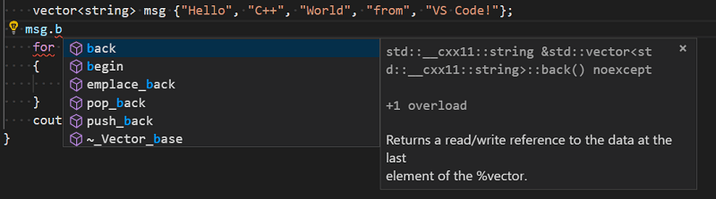
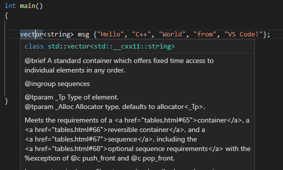
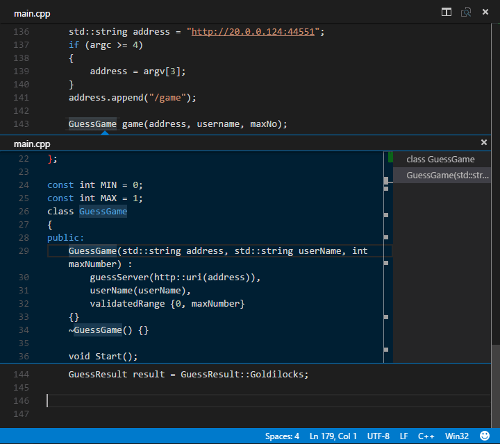
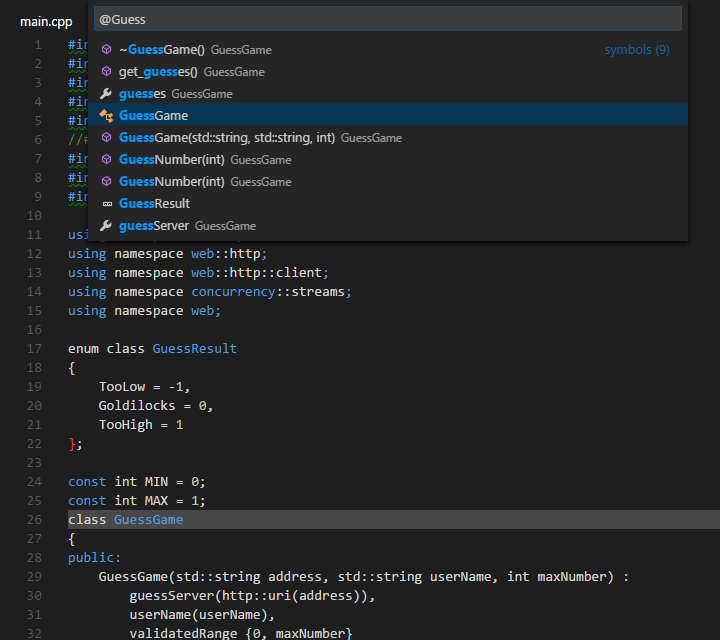
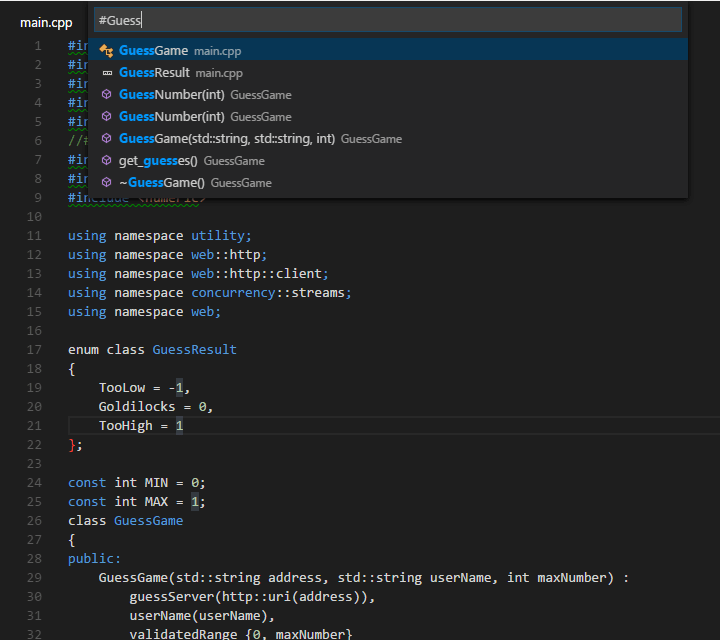

+++
title = "Editing"
date = 2024-01-12T22:36:24+08:00
weight = 80
type = "docs"
description = ""
isCJKLanguage = true
draft = false
+++

> 原文: [https://code.visualstudio.com/docs/cpp/cpp-ide](https://code.visualstudio.com/docs/cpp/cpp-ide)

# Edit C++ in Visual Studio Code 在 Visual Studio Code 中编辑 C++


This topic provides a quick overview of general C/C++ editor features, as well as some that are specific to C/C++. For more information about editing in Visual Studio Code, see [Basic Editing](https://code.visualstudio.com/docs/editor/codebasics) and [Code Navigation](https://code.visualstudio.com/docs/editor/editingevolved).

​​​	本主题快速概述了常规 C/C++ 编辑器功能，以及一些特定于 C/C++ 的功能。有关在 Visual Studio Code 中进行编辑的详细信息，请参阅基本编辑和代码导航。

The C/C++ extension supports [Remote Development](https://code.visualstudio.com/docs/remote/remote-overview).

​​​	C/C++ 扩展支持远程开发。

## [Editing features 编辑功能](https://code.visualstudio.com/docs/cpp/cpp-ide#_editing-features)

The C/C++ extension for VS Code has many features that help you write code, understand it, and navigate around in your source files. To provide the best experience, the extension needs to know where it can find each header file referenced in your code. By default, the extension searches the current source directory, its sub-directories, and some platform-specific locations. If a referenced header file can't be found, VS Code displays a green squiggle underneath each #include directive that references it.

​​​	VS Code 的 C/C++ 扩展具有许多功能，可帮助您编写代码、理解代码并在源文件中四处导航。为了提供最佳体验，扩展需要知道它可以在哪里找到代码中引用的每个头文件。默认情况下，扩展会搜索当前源目录、其子目录以及一些特定于平台的位置。如果找不到引用的头文件，VS Code 会在引用它的每个 #include 指令下方显示一个绿色波浪线。

To specify additional include directories to be searched, place your cursor over any #include directive that displays a green squiggle, then click the lightbulb action when it appears. This opens the file `c_cpp_properties.json` for editing; here you can specify additional include directories for each platform configuration individually by adding more directories to the 'browse.path' property.

​​​	若要指定要搜索的其他包含目录，请将光标置于显示绿色波浪线的任何 #include 指令上，然后在出现灯泡操作时单击它。这会打开文件 `c_cpp_properties.json` 以便进行编辑；您可以在此处通过向“browse.path”属性添加更多目录，分别为每个平台配置指定其他包含目录。

## [List members 列出成员](https://code.visualstudio.com/docs/cpp/cpp-ide#_list-members)

When you type a member access symbol (`.` or `->`) the editor will display a list of members. As you type additional letters, the list is filtered in real time:

​​​	当您键入成员访问符号（ `.` 或 `->` ）时，编辑器将显示成员列表。随着您键入更多字母，列表会实时过滤：



### [Code formatting 代码格式化](https://code.visualstudio.com/docs/cpp/cpp-ide#_code-formatting)

The C/C++ extension for Visual Studio Code supports source code formatting using [clang-format](https://clang.llvm.org/docs/ClangFormat.html) which is included with the extension.

​​​	Visual Studio Code 的 C/C++ 扩展支持使用 clang-format 格式化源代码，clang-format 与该扩展一起提供。

You can format an entire file with **Format Document** (Shift+Alt+F) or just the current selection with **Format Selection** (Ctrl+K Ctrl+F) in right-click context menu. You can also configure auto-formatting with the following [settings](https://code.visualstudio.com/docs/getstarted/settings):

​​​	您可以使用“格式化文档”（Shift+Alt+F）格式化整个文件，或在右键单击上下文菜单中使用“格式化选定内容”（Ctrl+K Ctrl+F）仅格式化当前选定内容。您还可以使用以下设置配置自动格式化：

- `editor.formatOnSave` - to format when you save your file.
  `editor.formatOnSave` - 在保存文件时进行格式化。
- `editor.formatOnType` - to format as you type (triggered on the ; character).
  `editor.formatOnType` - 在键入时进行格式化（在 ; 字符上触发）。

By default, the clang-format style is set to "file" which means it looks for a `.clang-format` file inside your workspace. If the `.clang-format` file is found, formatting is applied according to the settings specified in the file. If no `.clang-format` file is found in your workspace, formatting is applied based on a default style specified in the `C_Cpp.clang_format_fallbackStyle` [setting](https://code.visualstudio.com/docs/getstarted/settings) instead. Currently, the default formatting style is "Visual Studio" which is an approximation of the default code formatter in Visual Studio.

​​​	默认情况下，clang-format 样式设置为“file”，这意味着它会在您的工作区内查找 `.clang-format` 文件。如果找到 `.clang-format` 文件，则会根据文件中指定的设置应用格式。如果在您的工作区中找不到 `.clang-format` 文件，则会根据 `C_Cpp.clang_format_fallbackStyle` 设置中指定的默认样式应用格式。目前，默认格式化样式为“Visual Studio”，它是 Visual Studio 中默认代码格式化程序的近似值。

The Visual Studio clang-format style is not yet an official clang-format style but it implies the following clang-format settings:

​​​	Visual Studio clang-format 样式目前还不是官方的 clang-format 样式，但它暗示了以下 clang-format 设置：

```
UseTab: (VS Code current setting)
IndentWidth: (VS Code current setting)
BreakBeforeBraces: Allman
AllowShortIfStatementsOnASingleLine: false
IndentCaseLabels: false
ColumnLimit: 0
```

To use a different version of clang-format than the one that ships with the extension, change the `C_Cpp.clang_format_path` [setting](https://code.visualstudio.com/docs/getstarted/settings) to the path where the clang-format binary is installed.

​​​	若要使用扩展附带的 clang-format 的不同版本，请将 `C_Cpp.clang_format_path` 设置更改为安装 clang-format 二进制文件的路径。

For example, on the Windows platform:

​​​	例如，在 Windows 平台上：

```
  "C_Cpp.clang_format_path": "C:\\Program Files (x86)\\LLVM\\bin\\clang-format.exe"
```

### [Enhanced semantic colorization 增强的语义着色](https://code.visualstudio.com/docs/cpp/cpp-ide#_enhanced-semantic-colorization)

When IntelliSense is enabled, the Visual Studio Code C/C++ extension supports semantic colorization. See [Enhanced colorization](https://code.visualstudio.com/docs/cpp/colorization-cpp) for more details about setting colors for classes, functions, variables and so on.

​​​	启用 IntelliSense 时，Visual Studio Code C/C++ 扩展支持语义着色。有关为类、函数、变量等设置颜色的详细信息，请参阅增强的着色。

### [Quick Info 快速信息](https://code.visualstudio.com/docs/cpp/cpp-ide#_quick-info)

You can hover over a symbol to see an inline view of its definition:

​​​	您可以将鼠标悬停在符号上以查看其定义的内联视图：



### [Peek Definition 查看定义](https://code.visualstudio.com/docs/cpp/cpp-ide#_peek-definition)

The **Peek Definition** feature displays a few lines of code near the definition inside a *peek window*, so that you don't have to navigate away from your current location.

​​​	Peek Definition 功能在预览窗口中显示定义附近的几行代码，这样您不必离开当前位置。

To peek at a symbol's definition, place your cursor on the symbol anywhere it's used in your source code and then press Alt+F12. Alternatively, you can choose **Peek Definition** from the context menu (right-click, then choose **Peek Definition**).

​​​	要查看符号的定义，请将光标放在源代码中使用该符号的任何位置，然后按 Alt+F12。或者，您可以从上下文菜单中选择“查看定义”（右键单击，然后选择“查看定义”）。



Currently, the C/C++ extension doesn't parse code in a way that helps it distinguish between competing definitions based on how the symbol is used. These competing definitions arise when the symbol defines different things in different contexts, such as occurs with overloaded functions, classes and their constructors, and other situations. When this happens, each of the competing definitions is listed in the right-hand side of the peek window with the source code of the current selection displayed on the left.

​​​	目前，C/C++ 扩展不会以有助于它根据符号的使用方式区分竞争定义的方式来解析代码。当符号在不同上下文中定义不同内容时，就会出现这些竞争定义，例如重载函数、类及其构造函数以及其他情况。发生这种情况时，每个竞争定义都会列在右侧的窥视窗口中，左侧显示当前选区的源代码。

With the peek window open, you browse the list of competing definitions to find the one you're interested in. If you want to navigate to the location of one of the definitions just double-click the definition you're interested in, or by double-clicking anywhere in the source code displayed on the left-hand side of the peek window.

​​​	在窥视窗口打开的情况下，您可以浏览竞争定义列表以找到您感兴趣的定义。如果您想导航到其中一个定义的位置，只需双击您感兴趣的定义，或双击窥视窗口左侧显示的源代码中的任意位置。

## [Navigate source code 导航源代码](https://code.visualstudio.com/docs/cpp/cpp-ide#_navigate-source-code)

The source code navigation features provided by the C/C++ extension are powerful tools for understanding and getting around in your codebase. These features are powered by tags stored in a local database of symbol information. With the C/C++ extension installed, this database is generated whenever a folder containing C++ source code files is loaded into VS Code. The database icon appears next to the active configuration name ("Win32" in the image below) while the tag-parser is generating this information.

​​​	C/C++ 扩展提供的源代码导航功能是用于理解和浏览代码库的强大工具。这些功能由存储在符号信息本地数据库中的标记提供支持。安装 C/C++ 扩展后，只要将包含 C++ 源代码文件的文件夹加载到 VS Code 中，就会生成此数据库。在标记解析器生成此信息时，数据库图标会显示在活动配置名称旁边（下图中的“Win32”）。标记所有符号后，图标会消失。


The icon disappears when all the symbols have been tagged.

​​​	若要搜索当前文件中的符号，请按 Ctrl+Shift+O，然后输入要查找的符号的名称。将显示潜在匹配项列表；它会在您键入时进行筛选。从匹配项列表中选择以导航到其位置。

### [Search for symbols 搜索符号](https://code.visualstudio.com/docs/cpp/cpp-ide#_search-for-symbols)

You can search for symbols in the current file or workspace to navigate your code more quickly.

​​​	您可以在当前文件或工作区中搜索符号，以便更快地浏览代码。

To search for a symbol in the current file, press Ctrl+Shift+O, then enter the name of the symbol you're looking for. A list of potential matches will appear; it is filtered as you type. Choose from the list of matches to navigate to its location.

​​​	若要搜索当前工作区中的符号，请按 Ctrl+T，然后输入符号的名称。潜在匹配项列表将如前所述显示。如果您选择在尚未打开的文件中找到的匹配项，则在导航到匹配项的位置之前，该文件将被打开。



To search for a symbol in the current workspace, press Ctrl+T, then enter the name of the symbol. A list of potential matches will appear as before. If you choose a match that was found in a file that's not already open, the file will be opened before navigating to the match's location.



You can also search for symbols by accessing these commands through the **Command Palette**. Use **Quick Open** (Ctrl+P) then enter the '@' command to search the current file, or the '#' command to search the current workspace. Ctrl+Shift+O and Ctrl+T are just shortcuts for the '@' and '#' commands, so everything works the same.

​​​	您还可以通过命令面板访问这些命令来搜索符号。使用快速打开（Ctrl+P），然后输入“@”命令来搜索当前文件，或输入“#”命令来搜索当前工作区。Ctrl+Shift+O 和 Ctrl+T 只是“@”和“#”命令的快捷方式，因此所有操作方式相同。

### [Go to Definition 转到定义](https://code.visualstudio.com/docs/cpp/cpp-ide#_go-to-definition)

You can also quickly navigate to where a symbol is defined by using the **Go to Definition** feature.

​​​	您还可以使用转到定义功能快速导航到定义符号的位置。

To go to a symbol's definition, place your cursor on the symbol anywhere it is used in your source code and then press F12. Or, choose **Go to Definition** from the context menu (right-click, then choose **Go to Definition**). When there's only one definition of the symbol, you'll navigate directly to its location, otherwise the competing definitions are displayed in a peek window as described in the previous section and you have to choose the definition that you want to go to.

​​​	要转到符号的定义，请将光标放在源代码中使用该符号的任何位置，然后按 F12。或者，从上下文菜单中选择“转到定义”（右键单击，然后选择“转到定义”）。如果符号只有一个定义，您将直接导航到其位置，否则将在预览窗口中显示竞争定义，如上一节所述，您必须选择要转到的定义。

## [Next steps 后续步骤](https://code.visualstudio.com/docs/cpp/cpp-ide#_next-steps)

Read on to find out about:

​​​	继续阅读以了解：

- [Configure VS Code for Windows Subsystem for Linux
  为 Linux 的 Windows 子系统配置 VS Code](https://code.visualstudio.com/docs/cpp/config-wsl)
- [Configure VS Code for MSVC
  为 MSVC 配置 VS Code](https://code.visualstudio.com/docs/cpp/config-msvc)
- [Configure VS Code for Mingw-w64 and GCC
  为 Mingw-w64 和 GCC 配置 VS Code](https://code.visualstudio.com/docs/cpp/config-mingw)
- [Configure VS Code for macOS
  为 macOS 配置 VS Code](https://code.visualstudio.com/docs/cpp/config-clang-mac)
- [Configure IntelliSense for cross-compiling
  配置用于交叉编译的 IntelliSense](https://code.visualstudio.com/docs/cpp/configure-intellisense-crosscompilation)
- [Basic Editing](https://code.visualstudio.com/docs/editor/codebasics) - Learn about the powerful VS Code editor.
  基本编辑 - 了解功能强大的 VS Code 编辑器。
- [Code Navigation](https://code.visualstudio.com/docs/editor/editingevolved) - Move quickly through your source code.
  代码导航 - 快速浏览源代码。
- [Tasks](https://code.visualstudio.com/docs/editor/tasks) - use tasks to build your project and more
  任务 - 使用任务构建项目等
- [Debugging](https://code.visualstudio.com/docs/editor/debugging) - find out how to use the debugger with your project
  调试 - 了解如何将调试器与项目配合使用

If you have any other questions or run into any issues, please file an issue on [GitHub](https://github.com/microsoft/vscode-cpptools/issues). You may be asked to provide logging information from the extension to help diagnose the issue. See [C/C++ extension logging](https://code.visualstudio.com/docs/cpp/enable-logging-cpp) for help on providing extension logs.

​​​	如果您有任何其他问题或遇到任何问题，请在 GitHub 上提交问题。您可能需要提供扩展程序的日志信息以帮助诊断问题。有关提供扩展程序日志的帮助，请参阅 C/C++ 扩展程序日志记录。
