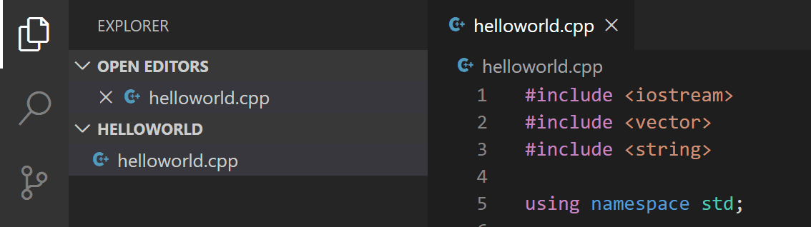
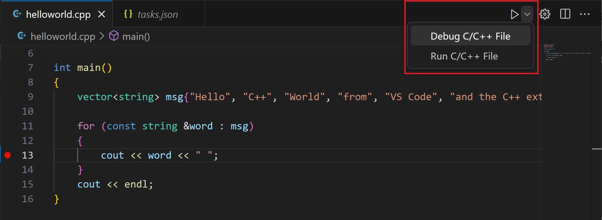
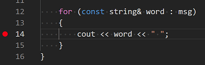

+++
title = "GCC on Linux"
date = 2024-01-12T22:36:24+08:00
weight = 10
type = "docs"
description = ""
isCJKLanguage = true
draft = false
+++

> 原文: [https://code.visualstudio.com/docs/cpp/config-linux](https://code.visualstudio.com/docs/cpp/config-linux)

# Using C++ on Linux in VS Code 在 VS Code 中使用 Linux 上的 C++


In this tutorial, you will configure Visual Studio Code to use the GCC C++ compiler (g++) and GDB debugger on Linux. GCC stands for GNU Compiler Collection; GDB is the GNU debugger.

&zeroWidthSpace;在本教程中，您将配置 Visual Studio Code 以在 Linux 上使用 GCC C++ 编译器 (g++) 和 GDB 调试器。GCC 代表 GNU 编译器集合；GDB 是 GNU 调试器。

After configuring VS Code, you will compile and debug a simple C++ program in VS Code. This tutorial does not teach you GCC, GDB, Ubuntu or the C++ language. For those subjects, there are many good resources available on the Web.

&zeroWidthSpace;配置 VS Code 后，您将在 VS Code 中编译和调试一个简单的 C++ 程序。本教程不会教您 GCC、GDB、Ubuntu 或 C++ 语言。对于这些主题，网上有很多很好的资源。

If you have trouble, feel free to file an issue for this tutorial in the [VS Code documentation repository](https://github.com/microsoft/vscode-docs/issues).

&zeroWidthSpace;如果您遇到问题，请随时在 VS Code 文档存储库中为此教程提交问题。

## [Prerequisites 先决条件](https://code.visualstudio.com/docs/cpp/config-linux#_prerequisites)

To successfully complete this tutorial, you must do the following:

&zeroWidthSpace;要成功完成本教程，您必须执行以下操作：

1. Install [Visual Studio Code](https://code.visualstudio.com/download).

   &zeroWidthSpace;安装 Visual Studio Code。

2. Install the [C++ extension for VS Code](https://marketplace.visualstudio.com/items?itemName=ms-vscode.cpptools). You can install the C/C++ extension by searching for 'c++' in the Extensions view (Ctrl+Shift+X).

   &zeroWidthSpace;为 VS Code 安装 C++ 扩展。您可以通过在扩展视图 (Ctrl+Shift+X) 中搜索“c++”来安装 C/C++ 扩展。

   

### [Ensure GCC is installed 确保已安装 GCC](https://code.visualstudio.com/docs/cpp/config-linux#_ensure-gcc-is-installed)

Although you'll use VS Code to edit your source code, you'll compile the source code on Linux using the g++ compiler. You'll also use GDB to debug. These tools are not installed by default on Ubuntu, so you have to install them. Fortunately, that's easy.

&zeroWidthSpace;虽然您将使用 VS Code 编辑源代码，但您将在 Linux 上使用 g++ 编译器编译源代码。您还将使用 GDB 进行调试。默认情况下，Ubuntu 上未安装这些工具，因此您必须安装它们。幸运的是，这很容易。

First, check to see whether GCC is already installed. To verify whether it is, open a Terminal window and enter the following command:

&zeroWidthSpace;首先，检查 GCC 是否已安装。要验证它是否已安装，请打开一个终端窗口并输入以下命令：

```
gcc -v
```

If GCC isn't installed, run the following command from the terminal window to update the Ubuntu package lists. An out-of-date Linux distribution can sometimes interfere with attempts to install new packages.

&zeroWidthSpace;如果未安装 GCC，请从终端窗口运行以下命令以更新 Ubuntu 软件包列表。过时的 Linux 发行版有时会干扰安装新软件包的尝试。

```
sudo apt-get update
```

Next install the GNU compiler tools and the GDB debugger with this command:

&zeroWidthSpace;接下来，使用此命令安装 GNU 编译器工具和 GDB 调试器：

```
sudo apt-get install build-essential gdb
```

## [Create Hello World 创建 Hello World](https://code.visualstudio.com/docs/cpp/config-linux#_create-hello-world)

From the terminal window, create an empty folder called `projects` to store your VS Code projects. Then create a subfolder called `helloworld`, navigate into it, and open VS Code in that folder by entering the following commands:

&zeroWidthSpace;在终端窗口中，创建一个名为 `projects` 的空文件夹来存储 VS Code 项目。然后创建一个名为 `helloworld` 的子文件夹，导航到其中，并通过输入以下命令在该文件夹中打开 VS Code：

```
mkdir projects
cd projects
mkdir helloworld
cd helloworld
code .
```

The `code .` command opens VS Code in the current working folder, which becomes your "workspace". As you go through the tutorial, you will create three files in a `.vscode` folder in the workspace:

&zeroWidthSpace; `code .` 命令在当前工作文件夹中打开 VS Code，该文件夹成为您的“工作区”。在完成本教程时，您将在工作区中的 `.vscode` 文件夹中创建三个文件：

- `tasks.json` (compiler build settings)
  `tasks.json` （编译器构建设置）
- `launch.json` (debugger settings)
  `launch.json` （调试器设置）
- `c_cpp_properties.json` (compiler path and IntelliSense settings)
  `c_cpp_properties.json` （编译器路径和 IntelliSense 设置）

### [Add hello world source code file 添加 hello world 源代码文件](https://code.visualstudio.com/docs/cpp/config-linux#_add-hello-world-source-code-file)

In the File Explorer title bar, select **New File** and name the file `helloworld.cpp`.

&zeroWidthSpace;在文件资源管理器标题栏中，选择新建文件，并将文件命名为 `helloworld.cpp` 。


Paste in the following source code:

&zeroWidthSpace;粘贴以下源代码：

```
#include <iostream>
#include <vector>
#include <string>

using namespace std;

int main()
{
    vector<string> msg {"Hello", "C++", "World", "from", "VS Code", "and the C++ extension!"};

    for (const string& word : msg)
    {
        cout << word << " ";
    }
    cout << endl;
}
```

Now press Ctrl+S to save the file. Notice that your files are listed in the **File Explorer** view (Ctrl+Shift+E) in the side bar of VS Code:

&zeroWidthSpace;现在按 Ctrl+S 保存文件。请注意，您的文件列在 VS Code 侧边栏的文件资源管理器视图 (Ctrl+Shift+E) 中：



You can also enable [Auto Save](https://code.visualstudio.com/docs/editor/codebasics#_save-auto-save) to automatically save your file changes, by checking **Auto Save** in the main **File** menu.

&zeroWidthSpace;您还可以通过选中主文件菜单中的“自动保存”来启用“自动保存”，以自动保存您的文件更改。

The Activity Bar on the edge of Visual Studio Code lets you open different views such as **Search**, **Source Control**, and **Run**. You'll look at the **Run** view later in this tutorial. You can find out more about the other views in the VS Code [User Interface documentation](https://code.visualstudio.com/docs/getstarted/userinterface).

&zeroWidthSpace;Visual Studio Code 边缘的活动栏可让您打开不同的视图，例如“搜索”、“源代码管理”和“运行”。您将在本教程的后面部分查看“运行”视图。您可以在 VS Code 用户界面文档中了解有关其他视图的更多信息。

> **Note**: When you save or open a C++ file, you may see a notification from the C/C++ extension about the availability of an Insiders version, which lets you test new features and fixes. You can ignore this notification by selecting the `X` (**Clear Notification**).
>
> &zeroWidthSpace;注意：当您保存或打开 C++ 文件时，您可能会看到来自 C/C++ 扩展的通知，其中包含有关 Insider 版本可用性的信息，该版本允许您测试新功能和修复程序。您可以通过选择 `X` （清除通知）来忽略此通知。

## [Explore IntelliSense 探索 IntelliSense](https://code.visualstudio.com/docs/cpp/config-linux#_explore-intellisense)

In the `helloworld.cpp` file, hover over `vector` or `string` to see type information. After the declaration of the `msg` variable, start typing `msg.`as you would when calling a member function. You should immediately see a completion list that shows all the member functions, and a window that shows the type information for the `msg` object:

&zeroWidthSpace;在 `helloworld.cpp` 文件中，将鼠标悬停在 `vector` 或 `string` 上以查看类型信息。在声明 `msg` 变量后，开始键入 `msg.` ，就像调用成员函数一样。您应该会立即看到一个完成列表，其中显示所有成员函数，以及一个显示 `msg` 对象的类型信息的窗口：


You can press the Tab key to insert the selected member. Then, when you add the opening parenthesis, you'll see information about arguments that the function requires.

&zeroWidthSpace;您可以按 Tab 键插入选定的成员。然后，当您添加左括号时，您将看到有关函数所需参数的信息。

## [Run helloworld.cpp 运行 helloworld.cpp](https://code.visualstudio.com/docs/cpp/config-linux#_run-helloworldcpp)

Remember, the C++ extension uses the C++ compiler you have installed on your machine to build your program. Make sure you have a C++ compiler installed before attempting to run and debug `helloworld.cpp` in VS Code.

&zeroWidthSpace;请记住，C++ 扩展使用您计算机上安装的 C++ 编译器来构建您的程序。在尝试在 VS Code 中运行和调试 `helloworld.cpp` 之前，请确保已安装 C++ 编译器。

1. Open `helloworld.cpp` so that it is the active file.

   &zeroWidthSpace;打开 `helloworld.cpp` ，使其成为活动文件。

2. Press the play button in the top right corner of the editor.

   &zeroWidthSpace;按编辑器右上角的播放按钮。

   

3. Choose **g++ build and debug active file** from the list of detected compilers on your system.

   &zeroWidthSpace;从系统上检测到的编译器列表中选择 g++ 构建并调试活动文件。

   

You'll only be asked to choose a compiler the first time you run `helloworld.cpp`. This compiler will be set as the "default" compiler in `tasks.json` file.

&zeroWidthSpace;您只会在第一次运行 `helloworld.cpp` 时被要求选择编译器。此编译器将被设置为 `tasks.json` 文件中的“默认”编译器。

1. After the build succeeds, your program's output will appear in the integrated **Terminal**.

   &zeroWidthSpace;构建成功后，程序的输出将显示在集成终端中。

   

The first time you run your program, the C++ extension creates `tasks.json`, which you'll find in your project's `.vscode` folder. `tasks.json` stores build configurations.

&zeroWidthSpace;第一次运行程序时，C++ 扩展会创建 `tasks.json` ，您可以在项目的 `.vscode` 文件夹中找到它。 `tasks.json` 存储构建配置。

Your new `tasks.json` file should look similar to the JSON below:

&zeroWidthSpace;您的新 `tasks.json` 文件应类似于下面的 JSON：

```
{
  "version": "2.0.0",
  "tasks": [
    {
      "type": "shell",
      "label": "C/C++: g++ build active file",
      "command": "/usr/bin/g++",
      "args": ["-g", "${file}", "-o", "${fileDirname}/${fileBasenameNoExtension}"],
      "options": {
        "cwd": "/usr/bin"
      },
      "problemMatcher": ["$gcc"],
      "group": {
        "kind": "build",
        "isDefault": true
      },
      "detail": "Task generated by Debugger."
    }
  ]
}
```

> **Note**: You can learn more about `tasks.json` variables in the [variables reference](https://code.visualstudio.com/docs/editor/variables-reference).
>
> &zeroWidthSpace;注意：您可以在变量参考中了解有关 `tasks.json` 变量的更多信息。

The `command` setting specifies the program to run; in this case that is g++. The `args` array specifies the command-line arguments that will be passed to g++. These arguments must be specified in the order expected by the compiler.

&zeroWidthSpace; `command` 设置指定要运行的程序；在本例中，该程序是 g++。 `args` 数组指定将传递给 g++ 的命令行参数。这些参数必须按照编译器预期的顺序指定。

This task tells g++ to take the active file (`${file}`), compile it, and create an executable file in the current directory (`${fileDirname}`) with the same name as the active file but without an extension (`${fileBasenameNoExtension}`), resulting in `helloworld` for our example.

&zeroWidthSpace;此任务告诉 g++ 获取活动文件 ( `${file}` )，对其进行编译，并在当前目录 ( `${fileDirname}` ) 中创建一个可执行文件，该文件的名称与活动文件相同，但没有扩展名 ( `${fileBasenameNoExtension}` )，在我们的示例中，结果为 `helloworld` 。

The `label` value is what you will see in the tasks list; you can name this whatever you like.

&zeroWidthSpace; `label` 值是您将在任务列表中看到的内容；您可以随意命名。

The `detail` value is what you will as the description of the task in the tasks list. It's highly recommended to rename this value to differentiate it from similar tasks.

&zeroWidthSpace; `detail` 值是您将在任务列表中作为任务描述的内容。强烈建议重命名此值，以使其与类似任务区分开来。

From now on, the play button will read from `tasks.json` to figure out how to build and run your program. You can define multiple build tasks in `tasks.json`, and whichever task is marked as the default will be used by the play button. In case you need to change the default compiler, you can run **Tasks: Configure default build task**. Alternatively you can modify the `tasks.json` file and remove the default by replacing this segment:

&zeroWidthSpace;从现在开始，播放按钮将从 `tasks.json` 读取以了解如何构建和运行您的程序。您可以在 `tasks.json` 中定义多个构建任务，而标记为默认的任务将由播放按钮使用。如果您需要更改默认编译器，则可以运行任务：配置默认构建任务。或者，您可以修改 `tasks.json` 文件，并通过用此段替换来删除默认值：

```
    "group": {
        "kind": "build",
        "isDefault": true
    },
```

with this:

```
    "group": "build",
```

### [Modifying tasks.json 修改 tasks.json](https://code.visualstudio.com/docs/cpp/config-linux#_modifying-tasksjson)

You can modify your `tasks.json` to build multiple C++ files by using an argument like `"${workspaceFolder}/*.cpp"` instead of `"${file}"`.This will build all `.cpp` files in your current folder. You can also modify the output filename by replacing `"${fileDirname}/${fileBasenameNoExtension}"` with a hard-coded filename (for example 'helloworld.out').

&zeroWidthSpace;您可以通过使用 `"${workspaceFolder}/*.cpp"` 这样的参数而不是 `"${file}"` 来修改您的 `tasks.json` 以构建多个 C++ 文件。这将构建您当前文件夹中的所有 `.cpp` 文件。您还可以通过用硬编码文件名（例如“helloworld.out”）替换 `"${fileDirname}/${fileBasenameNoExtension}"` 来修改输出文件名。

## [Debug helloworld.cpp 调试 helloworld.cpp](https://code.visualstudio.com/docs/cpp/config-linux#_debug-helloworldcpp)

To debug your code,

&zeroWidthSpace;要调试您的代码，

1. Go back to `helloworld.cpp` so that it is the active file.
   返回 `helloworld.cpp` ，使其成为活动文件。
2. Set a breakpoint by clicking on the editor margin or using F9 on the current line.
   通过单击编辑器边距或在当前行上使用 F9 来设置断点。
3. From the drop-down next to the play button, select **Debug C/C++ File**.
   从播放按钮旁边的下拉列表中，选择调试 C/C++ 文件。
4. Choose **C/C++: g++ build and debug active file** from the list of detected compilers on your system (you'll only be asked to choose a compiler the first time you run or debug `helloworld.cpp`).
   从系统上检测到的编译器列表中选择 C/C++：g++ 构建并调试活动文件（您只会在首次运行或调试 `helloworld.cpp` 时被要求选择编译器）。

The play button has two modes: **Run C/C++ File** and **Debug C/C++ File**. It will default to the last-used mode. If you see the debug icon in the play button, you can just select the play button to debug, instead of selecting the drop-down menu item.

&zeroWidthSpace;播放按钮有两种模式：运行 C/C++ 文件和调试 C/C++ 文件。它将默认为上次使用的模式。如果您在播放按钮中看到调试图标，则可以选择播放按钮进行调试，而无需选择下拉菜单项。

## [Explore the debugger 探索调试器](https://code.visualstudio.com/docs/cpp/config-linux#_explore-the-debugger)

Before you start stepping through the code, let's take a moment to notice several changes in the user interface:

&zeroWidthSpace;在开始逐步执行代码之前，我们花点时间注意用户界面中的几个更改：

- The Integrated Terminal appears at the bottom of the source code editor. In the **Debug Output** tab, you see output that indicates the debugger is up and running.

  &zeroWidthSpace;集成终端出现在源代码编辑器的底部。在“调试输出”选项卡中，您会看到指示调试器已启动并正在运行的输出。

- The editor highlights line 12, which is a breakpoint that you set before starting the debugger:

  &zeroWidthSpace;编辑器突出显示第 12 行，这是您在启动调试器之前设置的断点：

  

- The **Run and Debug** view on the left shows debugging information. You'll see an example later in the tutorial.

  &zeroWidthSpace;左侧的“运行和调试”视图显示调试信息。您将在本教程的后面看到一个示例。

- At the top of the code editor, a debugging control panel appears. You can move this around the screen by grabbing the dots on the left side.

  &zeroWidthSpace;在代码编辑器的顶部，出现一个调试控制面板。您可以通过抓取左侧的点来在屏幕上移动它。

  

If you already have a launch.json file in your workspace, the play button will read from it when figuring out how run and debug your C++ file. If you don’t have launch.json, the play button will create a temporary “quick debug” configuration on the fly, eliminating the need for launch.json altogether!

&zeroWidthSpace;如果您的工作区中已有 launch.json 文件，则播放按钮将在确定如何运行和调试 C++ 文件时从中读取。如果您没有 launch.json，则播放按钮将临时创建一个“快速调试”配置，从而完全无需 launch.json！

## [Step through the code 逐步执行代码](https://code.visualstudio.com/docs/cpp/config-linux#_step-through-the-code)

Now you're ready to start stepping through the code.

&zeroWidthSpace;现在，您可以开始逐步执行代码了。

1. Click or press the **Step over** icon in the debugging control panel.

   &zeroWidthSpace;单击或按下调试控制面板中的“单步执行”图标。

   

   This will advance program execution to the first line of the for loop, and skip over all the internal function calls within the `vector` and `string` classes that are invoked when the `msg` variable is created and initialized. Notice the change in the **Variables** window on the side.

   &zeroWidthSpace;这会将程序执行推进到 for 循环的第一行，并跳过在创建和初始化 `vector` 变量时调用的 `vector` 和 `string` 类中的所有内部函数调用。注意侧面的“变量”窗口中的变化。

   

2. Press **Step over** again to advance to the next statement in this program (skipping over all the internal code that is executed to initialize the loop). Now, the **Variables** window shows information about the loop variables.

   &zeroWidthSpace;再次按“单步执行”以推进到此程序中的下一条语句（跳过执行以初始化循环的所有内部代码）。现在，“变量”窗口显示有关循环变量的信息。

3. Press **Step over** again to execute the `cout` statement. (Note that the C++ extension does not print any output to the **Debug Console** until the last cout executes.)

   &zeroWidthSpace;再次按“单步执行”以执行 `cout` 语句。（请注意，C++ 扩展不会在最后一个 cout 执行之前向调试控制台打印任何输出。）

4. If you like, you can keep pressing **Step over** until all the words in the vector have been printed to the console. But if you are curious, try pressing the **Step Into** button to step through source code in the C++ standard library!

   &zeroWidthSpace;如果您愿意，可以一直按“单步执行”，直到向量中的所有单词都已打印到控制台。但如果您好奇，请尝试按“单步进入”按钮以逐步执行 C++ 标准库中的源代码！

   

   To return to your own code, one way is to keep pressing **Step over**. Another way is to set a breakpoint in your code by switching to the `helloworld.cpp` tab in the code editor, putting the insertion point somewhere on the `cout` statement inside the loop, and pressing F9. A red dot appears in the gutter on the left to indicate that a breakpoint has been set on this line.

   &zeroWidthSpace;要返回您自己的代码，一种方法是不断按步过。另一种方法是在代码编辑器中切换到 `helloworld.cpp` 选项卡，将插入点放在循环内的 `cout` 语句的某个位置，然后按F9来在代码中设置一个断点。左边的边距中会出现一个红点，表示已在此行上设置了一个断点。

   

   Then press F5 to start execution from the current line in the standard library header. Execution will break on `cout`. If you like, you can press F9 again to toggle off the breakpoint.

   &zeroWidthSpace;然后按F5从标准库头文件中的当前行开始执行。执行将在 `cout` 处中断。如果您愿意，可以再次按F9来切换断点。

   When the loop has completed, you can see the output in the **Debug Console** tab of the integrated terminal, along with some other diagnostic information that is output by GDB.

   &zeroWidthSpace;循环完成后，您可以在集成终端的“调试控制台”选项卡中看到输出，以及GDB输出的一些其他诊断信息。

   

## [Set a watch 设置监视](https://code.visualstudio.com/docs/cpp/config-linux#_set-a-watch)

To keep track of the value of a variable as your program executes, set a **watch** on the variable.

&zeroWidthSpace;要跟踪程序执行时变量的值，请对该变量设置监视。

1. Place the insertion point inside the loop. In the **Watch** window, click the plus sign and in the text box, type `word`, which is the name of the loop variable. Now view the Watch window as you step through the loop.

   &zeroWidthSpace;将插入点放在循环内。在“监视”窗口中，单击加号，然后在文本框中键入 `word` ，它是循环变量的名称。现在，在您逐步执行循环时查看“监视”窗口。

   

2. To quickly view the value of any variable while execution is paused on a breakpoint, you can hover over it with the mouse pointer.

   &zeroWidthSpace;要在执行在断点处暂停时快速查看任何变量的值，您可以将鼠标指针悬停在其上。

   

Next, you'll create a `tasks.json` file to tell VS Code how to build (compile) the program. This task will invoke the g++ compiler to create an executable file from the source code.

&zeroWidthSpace;接下来，您将创建一个 `tasks.json` 文件，以告诉 VS Code 如何构建（编译）程序。此任务将调用 g++ 编译器，以从源代码创建可执行文件。

It's important to have `helloworld.cpp` open in the editor because the next step uses the active file in the editor for context to create the build task in the next step.

&zeroWidthSpace;在编辑器中打开 `helloworld.cpp` 非常重要，因为下一步使用编辑器中的活动文件作为上下文，以便在下一步中创建构建任务。

## [Customize debugging with launch.json 使用 launch.json 自定义调试](https://code.visualstudio.com/docs/cpp/config-linux#_customize-debugging-with-launchjson)

When you debug with the play button or F5, the C++ extension creates a dynamic debug configuration on the fly.

&zeroWidthSpace;当您使用播放按钮或 F5 调试时，C++ 扩展将动态创建调试配置。

There are cases where you'd want to customize your debug configuration, such as specifying arguments to pass to the program at runtime. You can define custom debug configurations in a `launch.json` file.

&zeroWidthSpace;在某些情况下，您需要自定义调试配置，例如指定在运行时传递给程序的参数。您可以在 `launch.json` 文件中定义自定义调试配置。

To create `launch.json`, choose **Add Debug Configuration** from the play button drop-down menu.

&zeroWidthSpace;要创建 `launch.json` ，请从播放按钮下拉菜单中选择“添加调试配置”。


You'll then see a dropdown for various predefined debugging configurations. Choose **g++ build and debug active file**.

&zeroWidthSpace;然后，您将看到一个用于各种预定义调试配置的下拉菜单。选择 g++ 构建并调试活动文件。


VS Code creates a `launch.json` file, which looks something like this:

&zeroWidthSpace;VS Code 创建一个 `launch.json` 文件，如下所示：

```
{
  "version": "0.2.0",
  "configurations": [
    {
      "name": "C/C++: g++ build and debug active file",
      "type": "cppdbg",
      "request": "launch",
      "program": "${fileDirname}/${fileBasenameNoExtension}",
      "args": [],
      "stopAtEntry": false,
      "cwd": "${workspaceFolder}",
      "environment": [],
      "externalConsole": false,
      "MIMode": "gdb",
      "miDebuggerPath": "/usr/bin/gdb",
      "setupCommands": [
        {
          "description": "Enable pretty-printing for gdb",
          "text": "-enable-pretty-printing",
          "ignoreFailures": true
        }
      ],
      "preLaunchTask": "C/C++: g++ build active file"
    }
  ]
}
```

In the JSON above, `program` specifies the program you want to debug. Here it is set to the active file folder `${fileDirname}` and active filename without an extension `${fileBasenameNoExtension}`, which if `helloworld.cpp` is the active file will be `helloworld`. The `args` property is an array of arguments to pass to the program at runtime.

&zeroWidthSpace;在上面的 JSON 中， `program` 指定要调试的程序。此处将其设置为活动文件文件夹 `${fileDirname}` 和不带扩展名的活动文件名 `${fileBasenameNoExtension}` ，如果 `helloworld.cpp` 是活动文件，则为 `helloworld` 。 `args` 属性是一个参数数组，用于在运行时传递给程序。

By default, the C++ extension won't add any breakpoints to your source code and the `stopAtEntry` value is set to `false`.

&zeroWidthSpace;默认情况下，C++ 扩展不会向源代码添加任何断点，并且 `stopAtEntry` 值设置为 `false` 。

Change the `stopAtEntry` value to `true` to cause the debugger to stop on the `main` method when you start debugging.

&zeroWidthSpace;将 `stopAtEntry` 值更改为 `true` 以便在开始调试时使调试器在 `main` 方法上停止。

> From now on, the play button and F5 will read from your `launch.json` file when launching your program for debugging.
>
> &zeroWidthSpace;从现在开始，播放按钮和 F5 将在启动程序进行调试时从 `launch.json` 文件中读取。

## [C/C++ configurations C/C++ 配置](https://code.visualstudio.com/docs/cpp/config-linux#_cc-configurations)

If you want more control over the C/C++ extension, you can create a `c_cpp_properties.json` file, which will allow you to change settings such as the path to the compiler, include paths, C++ standard (default is C++17), and more.

&zeroWidthSpace;如果您想对 C/C++ 扩展进行更多控制，可以创建一个 `c_cpp_properties.json` 文件，该文件允许您更改设置，例如编译器路径、包含路径、C++ 标准（默认为 C++17）等。

You can view the C/C++ configuration UI by running the command **C/C++: Edit Configurations (UI)** from the Command Palette (Ctrl+Shift+P).

&zeroWidthSpace;您可以通过从命令面板 (Ctrl+Shift+P) 运行命令 C/C++: 编辑配置 (UI) 来查看 C/C++ 配置 UI。


This opens the **C/C++ Configurations** page. When you make changes here, VS Code writes them to a file called `c_cpp_properties.json` in the `.vscode` folder.

&zeroWidthSpace;这将打开 C/C++ 配置页面。当您在此处进行更改时，VS Code 会将它们写入 `.vscode` 文件夹中名为 `c_cpp_properties.json` 的文件中。


You only need to modify the **Include path** setting if your program includes header files that are not in your workspace or in the standard library path.

&zeroWidthSpace;如果您的程序包含不在工作区或标准库路径中的头文件，则只需修改 Include 路径设置。

Visual Studio Code places these settings in `.vscode/c_cpp_properties.json`. If you open that file directly, it should look something like this:

&zeroWidthSpace;Visual Studio Code 将这些设置放在 `.vscode/c_cpp_properties.json` 中。如果您直接打开该文件，它应该看起来像这样：

```
{
  "configurations": [
    {
      "name": "Linux",
      "includePath": ["${workspaceFolder}/**"],
      "defines": [],
      "compilerPath": "/usr/bin/gcc",
      "cStandard": "c11",
      "cppStandard": "c++17",
      "intelliSenseMode": "clang-x64"
    }
  ],
  "version": 4
}
```

## [Reusing your C++ configuration 重复使用 C++ 配置](https://code.visualstudio.com/docs/cpp/config-linux#_reusing-your-c-configuration)

VS Code is now configured to use gcc on Linux. The configuration applies to the current workspace. To reuse the configuration, just copy the JSON files to a `.vscode` folder in a new project folder (workspace) and change the names of the source file(s) and executable as needed.

&zeroWidthSpace;VS Code 现在配置为在 Linux 上使用 gcc。该配置适用于当前工作区。要重复使用该配置，只需将 JSON 文件复制到新项目文件夹（工作区）中的 `.vscode` 文件夹，并根据需要更改源文件和可执行文件的名称。

## [Troubleshooting 故障排除](https://code.visualstudio.com/docs/cpp/config-linux#_troubleshooting)

### [Compiler and linking errors 编译器和链接错误](https://code.visualstudio.com/docs/cpp/config-linux#_compiler-and-linking-errors)

The most common cause of errors (such as `undefined _main`, or `attempting to link with file built for unknown-unsupported file format`, and so on) occurs when `helloworld.cpp` is not the active file when you start a build or start debugging. This is because the compiler is trying to compile something that isn't source code, like your `launch.json`, `tasks.json`, or `c_cpp_properties.json` file.

&zeroWidthSpace;最常见的错误原因（例如 `undefined _main` 或 `attempting to link with file built for unknown-unsupported file format` 等）是当您开始构建或开始调试时 `helloworld.cpp` 不是活动文件。这是因为编译器正在尝试编译不是源代码的内容，例如您的 `launch.json` 、 `tasks.json` 或 `c_cpp_properties.json` 文件。

## [Next steps 后续步骤](https://code.visualstudio.com/docs/cpp/config-linux#_next-steps)

- Explore the [VS Code User Guide](https://code.visualstudio.com/docs/editor/codebasics).
  浏览 VS Code 用户指南。
- Review the [Overview of the C++ extension](https://code.visualstudio.com/docs/languages/cpp).
  查看 C++ 扩展概述。
- Create a new workspace, copy your .json files to it, adjust the necessary settings for the new workspace path, program name, and so on, and start coding!
  创建一个新工作区，将您的 .json 文件复制到其中，调整新工作区路径、程序名称等必要的设置，然后开始编码！
