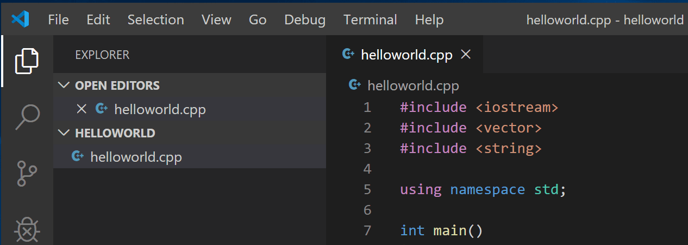

+++
title = "GCC on Windows"
date = 2024-01-12T22:36:24+08:00
weight = 20
type = "docs"
description = ""
isCJKLanguage = true
draft = false
+++

> 原文: [https://code.visualstudio.com/docs/cpp/config-mingw](https://code.visualstudio.com/docs/cpp/config-mingw)

# Using GCC with MinGW 使用 GCC 和 MinGW


In this tutorial, you configure Visual Studio Code to use the GCC C++ compiler (g++) and GDB debugger from [mingw-w64](http://mingw-w64.org/) to create programs that run on Windows. After configuring VS Code, you will compile, run, and debug a Hello World program.

&zeroWidthSpace;在本教程中，您将配置 Visual Studio Code 以使用 mingw-w64 中的 GCC C++ 编译器 (g++) 和 GDB 调试器来创建可在 Windows 上运行的程序。配置 VS Code 后，您将编译、运行和调试一个 Hello World 程序。

This tutorial does not teach you about GCC, GDB, minGW-w64, or the C++ language. For those subjects, there are many good resources available on the Web.

&zeroWidthSpace;本教程不教您有关 GCC、GDB、minGW-w64 或 C++ 语言的知识。对于这些主题，网上有很多很好的资源可用。

If you have any problems, feel free to file an issue for this tutorial in the [VS Code documentation repository](https://github.com/microsoft/vscode-docs/issues/new).

&zeroWidthSpace;如果您遇到任何问题，请随时在 VS Code 文档存储库中为此教程提交问题。

## [Prerequisites 先决条件](https://code.visualstudio.com/docs/cpp/config-mingw#_prerequisites)

To successfully complete this tutorial, you must do the following steps:

&zeroWidthSpace;要成功完成本教程，您必须执行以下步骤：

1. Install [Visual Studio Code](https://code.visualstudio.com/download).

   &zeroWidthSpace;安装 Visual Studio Code。

2. Install the [C/C++ extension for VS Code](https://marketplace.visualstudio.com/items?itemName=ms-vscode.cpptools). You can install the C/C++ extension by searching for 'C++' in the Extensions view (Ctrl+Shift+X).

   &zeroWidthSpace;为 VS Code 安装 C/C++ 扩展。您可以通过在扩展视图 (Ctrl+Shift+X) 中搜索“C++”来安装 C/C++ 扩展。

   

## [Installing the MinGW-w64 toolchain 安装 MinGW-w64 工具链](https://code.visualstudio.com/docs/cpp/config-mingw#_installing-the-mingww64-toolchain)

Get the latest version of MinGW-w64 via [MSYS2](https://www.msys2.org/), which provides up-to-date native builds of GCC, MinGW-w64, and other helpful C++ tools and libraries. This will provide you with the necessary tools to compile your code, debug it, and configure it to work with [IntelliSense](https://code.visualstudio.com/docs/editor/intellisense).

&zeroWidthSpace;通过 MSYS2 获取最新版本的 MinGW-w64，它提供了 GCC、MinGW-w64 和其他有用的 C++ 工具和库的最新原生版本。这将为您提供必要的工具来编译您的代码、调试它并将其配置为与 IntelliSense 配合使用。

To install the MinGW-w64 toolchain, check out this video or follow the steps below:

&zeroWidthSpace;要安装 MinGW-w64 工具链，请查看此视频或按照以下步骤操作：

<iframe width="560" height="315" src="https://www.youtube.com/embed/oC69vlWofJQ?si=cj-xpNS28xNBMEcP" title="Installing MinGW to build C++ code on Windows" frameborder="0" allow="accelerometer; autoplay; clipboard-write; encrypted-media; gyroscope; picture-in-picture; web-share" allowfullscreen="" style="box-sizing: border-box; font-family: &quot;Segoe UI&quot;, &quot;Helvetica Neue&quot;, Helvetica, Arial, sans-serif; width: 616.662px; max-width: 100%; height: 400px; color: rgb(36, 36, 36); font-size: 16px; font-style: normal; font-variant-ligatures: normal; font-variant-caps: normal; font-weight: 400; letter-spacing: normal; orphans: 2; text-align: start; text-indent: 0px; text-transform: none; widows: 2; word-spacing: 0px; -webkit-text-stroke-width: 0px; white-space: normal; background-color: rgb(255, 255, 255); text-decoration-thickness: initial; text-decoration-style: initial; text-decoration-color: initial;"></iframe>


1. You can download the latest installer from the MSYS2 page or use this [**direct link to the installer**](https://github.com/msys2/msys2-installer/releases/download/2023-05-26/msys2-x86_64-20230526.exe).

   &zeroWidthSpace;您可以从 MSYS2 页面下载最新的安装程序，或使用此直接链接到安装程序。

2. Run the installer and follow the steps of the installation wizard. Note that MSYS2 requires 64 bit Windows 8.1 or newer.

   &zeroWidthSpace;运行安装程序并按照安装向导的步骤进行操作。请注意，MSYS2 需要 64 位 Windows 8.1 或更高版本。

3. In the wizard, choose your desired Installation Folder. Record this directory for later. In most cases, the recommended directory is acceptable. The same applies when you get to setting the start menu shortcuts step. When complete, ensure the **Run MSYS2 now** box is checked and select **Finish**. This will open a MSYS2 terminal window for you.

   &zeroWidthSpace;在向导中，选择您想要的安装文件夹。记录此目录以备后用。在大多数情况下，推荐的目录是可以接受的。在设置开始菜单快捷方式步骤时也是如此。完成后，确保选中立即运行 MSYS2 框，然后选择完成。这将为您打开一个 MSYS2 终端窗口。

4. In this terminal, install the MinGW-w64 toolchain by running the following command:

   &zeroWidthSpace;在此终端中，通过运行以下命令安装 MinGW-w64 工具链：

   ```
   pacman -S --needed base-devel mingw-w64-ucrt-x86_64-toolchain
   ```

5. Accept the default number of packages in the `toolchain` group by pressing Enter.

   &zeroWidthSpace;通过按 Enter 键接受 `toolchain` 组中的默认软件包数。

   

6. Enter `Y` when prompted whether to proceed with the installation.

   &zeroWidthSpace;在提示是否继续安装时输入 `Y` 。

7. Add the path to your MinGW-w64 `bin` folder to the Windows `PATH` environment variable by using the following steps:

   &zeroWidthSpace;通过以下步骤将路径添加到 Windows `PATH` 环境变量中的 MinGW-w64 `bin` 文件夹：

   1. In the Windows search bar, type **Settings** to open your Windows Settings.
      在 Windows 搜索栏中，键入设置以打开 Windows 设置。
   2. Search for **Edit environment variables for your account**.
      搜索编辑帐户的环境变量。
   3. In your **User variables**, select the `Path` variable and then select **Edit**.
      在用户变量中，选择 `Path` 变量，然后选择编辑。
   4. Select **New** and add the MinGW-w64 destination folder you recorded during the installation process to the list. If you used the default settings above, then this will be the path: `C:\msys64\ucrt64\bin`.
      选择新建并添加您在安装过程中记录的 MinGW-w64 目标文件夹到列表中。如果您使用了上述默认设置，那么此路径将为： `C:\msys64\ucrt64\bin` 。
   5. Select **OK** to save the updated PATH. You will need to reopen any console windows for the new PATH location to be available.
      选择确定以保存更新的 PATH。您需要重新打开所有控制台窗口，才能使用新的 PATH 位置。

### [Check your MinGW installation 检查您的 MinGW 安装](https://code.visualstudio.com/docs/cpp/config-mingw#_check-your-mingw-installation)

To check that your MinGW-w64 tools are correctly installed and available, open a **new** Command Prompt and type:

&zeroWidthSpace;要检查您的 MinGW-w64 工具是否正确安装并可用，请打开新的命令提示符并键入：

```
gcc --version
g++ --version
gdb --version
```

You should see output that states which versions of GCC, g++ and GDB you have installed. If this is not the case:

&zeroWidthSpace;您应该会看到输出，其中指出您已安装的 GCC、g++ 和 GDB 的版本。如果不是这种情况：

1. Make sure your PATH variable entry matches the MinGW-w64 binary location where the toolchain was installed. If the compilers do not exist at that PATH entry, make sure you followed the previous instructions.
   确保您的 PATH 变量条目与安装工具链的 MinGW-w64 二进制文件位置匹配。如果编译器不存在于该 PATH 条目中，请确保您按照之前的说明进行操作。

2. If

    

   ```
   gcc
   ```

    

   has the correct output but not

    

   ```
   gdb
   ```

   , then you need to install the packages you are missing from the MinGW-w64 toolset.

   
   如果 `gcc` 有正确的输出，但 `gdb` 没有，那么您需要从 MinGW-w64 工具集中安装缺少的软件包。

   - If on compilation you are getting the "The value of miDebuggerPath is invalid." message, one cause can be you are missing the `mingw-w64-gdb` package.
     如果在编译时收到“miDebuggerPath 的值无效。”消息，一个原因可能是您缺少 `mingw-w64-gdb` 软件包。

## [Create a Hello World app 创建 Hello World 应用](https://code.visualstudio.com/docs/cpp/config-mingw#_create-a-hello-world-app)

First, lets get a project set up.

&zeroWidthSpace;首先，让我们设置一个项目。

1. Launch a Windows command prompt (Enter **Windows command prompt** in the Windows search bar).
   启动 Windows 命令提示符（在 Windows 搜索栏中输入 Windows 命令提示符）。
2. Run the following commands. These will create an empty folder called `projects` where you can place all your VS Code projects. There, the next commands will create and navigate to a subfolder called `helloworld`. From there, you will open `helloworld` directly in VS Code.
   运行以下命令。这些命令将创建一个名为 `projects` 的空文件夹，您可以在其中放置所有 VS Code 项目。在那里，下一个命令将创建并导航到名为 `helloworld` 的子文件夹。从那里，您将直接在 VS Code 中打开 `helloworld` 。

```
mkdir projects
cd projects
mkdir helloworld
cd helloworld
code .
```

The "code ." command opens VS Code in the current working folder, which becomes your "workspace". Accept the [Workspace Trust](https://code.visualstudio.com/docs/editor/workspace-trust) dialog by selecting **Yes, I trust the authors** since this is a folder you created.

&zeroWidthSpace;“code .” 命令在当前工作文件夹中打开 VS Code，该文件夹成为您的“工作区”。通过选择“是，我信任作者”接受工作区信任对话框，因为这是您创建的文件夹。

As you go through the tutorial, you will see three files created in a `.vscode` folder in the workspace:

&zeroWidthSpace;在您完成本教程时，您将在工作区中的 `.vscode` 文件夹中看到创建的三个文件：

- `tasks.json` (build instructions)
  `tasks.json` （构建说明）
- `launch.json` (debugger settings)
  `launch.json` （调试器设置）
- `c_cpp_properties.json` (compiler path and IntelliSense settings)
  `c_cpp_properties.json` （编译器路径和 IntelliSense 设置）

### [Add a Hello World source code file 添加 Hello World 源代码文件](https://code.visualstudio.com/docs/cpp/config-mingw#_add-a-hello-world-source-code-file)

In the File Explorer title bar, select the **New File** button and name the file `helloworld.cpp`.

&zeroWidthSpace;在文件资源管理器标题栏中，选择“新建文件”按钮，并将文件命名为 `helloworld.cpp` 。


### [Add hello world source code 添加 hello world 源代码](https://code.visualstudio.com/docs/cpp/config-mingw#_add-hello-world-source-code)

Now paste in this source code:

&zeroWidthSpace;现在粘贴此源代码：

```
#include <iostream>
#include <vector>
#include <string>

using namespace std;

int main()
{
    vector<string> msg {"Hello", "C++", "World", "from", "VS Code", "and the C++ extension!"};

    for (const string& word : msg)
    {
        cout << word << " ";
    }
    cout << endl;
}
```

Now press Ctrl+S to save the file. Notice how the file you just added appears in the **File Explorer** view (Ctrl+Shift+E) in the side bar of VS Code:

&zeroWidthSpace;现在按 Ctrl+S 保存文件。请注意，您刚刚添加的文件如何显示在 VS Code 侧边栏中的文件资源管理器视图（Ctrl+Shift+E）中：



You can also enable [Auto Save](https://code.visualstudio.com/docs/editor/codebasics#_save-auto-save) to automatically save your file changes, by selecting **File** > **Auto Save**. You can find out more about the other views in the VS Code [User Interface documentation](https://code.visualstudio.com/docs/getstarted/userinterface).

&zeroWidthSpace;您还可以通过选择“文件”>“自动保存”来启用自动保存，以自动保存文件更改。您可以在 VS Code 用户界面文档中了解有关其他视图的更多信息。

> **Note**: When you save or open a C++ file, you may see a notification from the C/C++ extension about the availability of an Insiders version, which lets you test new features and fixes. You can ignore this notification by selecting the `X` (**Clear Notification**).
>
> &zeroWidthSpace;注意：当您保存或打开 C++ 文件时，您可能会看到来自 C/C++ 扩展的通知，其中包含有关 Insider 版本可用性的信息，该版本允许您测试新功能和修复程序。您可以通过选择 `X` （清除通知）来忽略此通知。

## [Explore IntelliSense 探索 IntelliSense](https://code.visualstudio.com/docs/cpp/config-mingw#_explore-intellisense)

[IntelliSense](https://code.visualstudio.com/docs/editor/intellisense) is a tool to help you code faster and more efficiently by adding code editing features such as code completion, parameter info, quick info, and member lists.

&zeroWidthSpace;IntelliSense 是一种工具，可通过添加代码编辑功能（如代码补全、参数信息、快速信息和成员列表）来帮助您更快、更高效地编写代码。

To see IntelliSense in action, hover over `vector` or `string` to see their type information. If you type `msg.` in line 10, you can see a completion list of recommended member functions to call, all generated by IntelliSense:

&zeroWidthSpace;要查看 IntelliSense 的实际操作，请将鼠标悬停在 `vector` 或 `string` 上以查看其类型信息。如果您在第 10 行中键入 `msg.` ，您会看到 IntelliSense 生成的建议成员函数的补全列表，供您调用：


You can press the Tab key to insert a selected member. If you then add open parenthesis, IntelliSense will show information on which arguments are required.

&zeroWidthSpace;您可以按 Tab 键插入选定的成员。如果您随后添加左括号，IntelliSense 将显示有关需要哪些参数的信息。

If IntelliSense is not already configured, open the Command Palette (Ctrl+Shift+P) and enter **Select IntelliSense Configuration**. From the dropdown of compilers, select `Use gcc.exe` to configure. More information can be found in the [IntelliSense configuration documentation](https://code.visualstudio.com/docs/languages/cpp#_intellisense-configuration).

&zeroWidthSpace;如果尚未配置 IntelliSense，请打开命令面板 (Ctrl+Shift+P) 并输入“选择 IntelliSense 配置”。从编译器下拉列表中，选择 `Use gcc.exe` 进行配置。您可以在 IntelliSense 配置文档中找到更多信息。

## [Run helloworld.cpp 运行 helloworld.cpp](https://code.visualstudio.com/docs/cpp/config-mingw#_run-helloworldcpp)

Remember, the C++ extension uses the C++ compiler you have installed on your machine to build your program. Make sure you have completed the "Installing the MinGW-w64 toolchain" step before attempting to run and debug `helloworld.cpp` in VS Code.

&zeroWidthSpace;请记住，C++ 扩展使用您已安装在计算机上的 C++ 编译器来构建您的程序。在尝试在 VS Code 中运行和调试 `helloworld.cpp` 之前，请确保您已完成“安装 MinGW-w64 工具链”步骤。

1. Open `helloworld.cpp` so that it is the active file.

   &zeroWidthSpace;打开 `helloworld.cpp` ，使其成为活动文件。

2. Press the play button in the top right corner of the editor.

   &zeroWidthSpace;按编辑器右上角的播放按钮。

   

3. Choose **C/C++: g++.exe build and debug active file** from the list of detected compilers on your system.

   &zeroWidthSpace;从系统上检测到的编译器列表中选择 C/C++: g++.exe 构建并调试活动文件。

   

You'll only be asked to choose a compiler the first time you run `helloworld.cpp`. This compiler will be set as the "default" compiler in `tasks.json` file.

&zeroWidthSpace;您只会在第一次运行 `helloworld.cpp` 时被要求选择编译器。此编译器将被设置为 `tasks.json` 文件中的“默认”编译器。

1. After the build succeeds, your program's output will appear in the integrated **Terminal**.

   &zeroWidthSpace;构建成功后，程序的输出将显示在集成终端中。

   

Congratulations! You've just run your first C++ program in VS Code!

&zeroWidthSpace;恭喜！您刚刚在 VS Code 中运行了第一个 C++ 程序！

### [Understanding tasks.json 了解 tasks.json](https://code.visualstudio.com/docs/cpp/config-mingw#_understanding-tasksjson)

The first time you run your program, the C++ extension creates a `tasks.json` file, which you'll find in your project's `.vscode` folder. `tasks.json` stores your build configurations.

&zeroWidthSpace;首次运行程序时，C++ 扩展会创建一个 `tasks.json` 文件，您可以在项目的 `.vscode` 文件夹中找到它。 `tasks.json` 存储您的构建配置。

Your new `tasks.json` file should look similar to the JSON below:

&zeroWidthSpace;您的新 `tasks.json` 文件应类似于下面的 JSON：

```
{
  "tasks": [
    {
      "type": "cppbuild",
      "label": "C/C++: g++.exe build active file",
      "command": "C:\\msys64\\ucrt64\\bin\\g++.exe",
      "args": [
        "-fdiagnostics-color=always",
        "-g",
        "${file}",
        "-o",
        "${fileDirname}\\${fileBasenameNoExtension}.exe"
      ],
      "options": {
        "cwd": "${fileDirname}"
      },
      "problemMatcher": ["$gcc"],
      "group": {
        "kind": "build",
        "isDefault": true
      },
      "detail": "Task generated by Debugger."
    }
  ],
  "version": "2.0.0"
}
```

> **Note**: You can learn more about `tasks.json` variables in the [variables reference](https://code.visualstudio.com/docs/editor/variables-reference).
>
> &zeroWidthSpace;注意：您可以在变量参考中了解有关 `tasks.json` 变量的更多信息。

The `command` setting specifies the program to run; in this case that is `g++`.

&zeroWidthSpace; `command` 设置指定要运行的程序；在本例中为 `g++` 。

The `args` array specifies the command-line arguments passed to g++. These arguments are listed in this file in the specific order expected by the compiler.

&zeroWidthSpace; `args` 数组指定传递给 g++ 的命令行参数。这些参数按编译器预期的特定顺序列在此文件中。

This task tells g++ to take the active file (`${file}`), compile it, and create an output file (`-o` switch) in the current directory (`${fileDirname}`) with the same name as the active file but with the `.exe` extension (`${fileBasenameNoExtension}.exe`). For us, this results in `helloworld.exe`.

&zeroWidthSpace;此任务告诉 g++ 获取活动文件 ( `${file}` )，编译它，并在当前目录 ( `${fileDirname}` ) 中创建一个输出文件 ( `-o` 开关)，其名称与活动文件相同，但扩展名为 `.exe` ( `${fileBasenameNoExtension}.exe` )。对我们来说，这会导致 `helloworld.exe` 。

The `label` value is what you will see in the tasks list; you can name this whatever you like.

&zeroWidthSpace; `label` 值是您将在任务列表中看到的内容；您可以随意命名。

The `detail` value is what you will as the description of the task in the tasks list. It's highly recommended to rename this value to differentiate it from similar tasks.

&zeroWidthSpace; `detail` 值是您将在任务列表中作为任务描述的内容。强烈建议重命名此值，以使其与类似任务区分开来。

The `problemMatcher` value selects the output parser to use for finding errors and warnings in the compiler output. For GCC, you'll get the best results if you use the `$gcc` problem matcher.

&zeroWidthSpace;值 `problemMatcher` 选择输出解析器，用于在编译器输出中查找错误和警告。对于 GCC，如果您使用 `$gcc` 问题匹配器，您将获得最佳结果。

From now on, the play button will read from `tasks.json` to figure out how to build and run your program. You can define multiple build tasks in `tasks.json`, and whichever task is marked as the default will be used by the play button. In case you need to change the default compiler, you can run **Tasks: Configure Default Build Task** in the Command Palette. Alternatively you can modify the `tasks.json` file and remove the default by replacing this segment:

&zeroWidthSpace;从现在开始，播放按钮将从 `tasks.json` 读取，以了解如何构建和运行您的程序。您可以在 `tasks.json` 中定义多个构建任务，而标记为默认的任务将由播放按钮使用。如果您需要更改默认编译器，您可以在命令面板中运行任务：配置默认构建任务。或者，您可以修改 `tasks.json` 文件，并通过替换此段来删除默认值：

```
    "group": {
        "kind": "build",
        "isDefault": true
    },
```

with this:

```
    "group": "build",
```

### [Modifying tasks.json 修改 tasks.json](https://code.visualstudio.com/docs/cpp/config-mingw#_modifying-tasksjson)

You can modify your `tasks.json` to build multiple C++ files by using an argument like `"${workspaceFolder}/*.cpp"` instead of `"${file}"`.This will build all `.cpp` files in your current folder. You can also modify the output filename by replacing `"${fileDirname}\\${fileBasenameNoExtension}.exe"` with a hard-coded filename (for example `"${workspaceFolder}\\myProgram.exe"`).

&zeroWidthSpace;您可以修改 `tasks.json` ，以使用 `"${workspaceFolder}/*.cpp"` 这样的参数而不是 `"${file}"` 来构建多个 C++ 文件。这将构建您当前文件夹中的所有 `.cpp` 文件。您还可以通过将 `"${fileDirname}\\${fileBasenameNoExtension}.exe"` 替换为硬编码的文件名（例如 `"${workspaceFolder}\\myProgram.exe"` ）来修改输出文件名。

## [Debug helloworld.cpp 调试 helloworld.cpp](https://code.visualstudio.com/docs/cpp/config-mingw#_debug-helloworldcpp)

To debug your code,

&zeroWidthSpace;要调试您的代码，

1. Go back to `helloworld.cpp` so that it is the active file.
   返回 `helloworld.cpp` ，使其成为活动文件。
2. Set a breakpoint by clicking on the editor margin or using F9 on the current line.
   通过单击编辑器边距或在当前行上使用 F9 来设置断点。
3. From the drop-down next to the play button, select **Debug C/C++ File**.
   从播放按钮旁边的下拉列表中，选择调试 C/C++ 文件。
4. Choose **C/C++: g++ build and debug active file** from the list of detected compilers on your system (you'll only be asked to choose a compiler the first time you run or debug `helloworld.cpp`).
   从系统上检测到的编译器列表中选择 C/C++：g++ 构建并调试活动文件（您只会在首次运行或调试 `helloworld.cpp` 时被要求选择编译器）。

The play button has two modes: **Run C/C++ File** and **Debug C/C++ File**. It will default to the last-used mode. If you see the debug icon in the play button, you can just select the play button to debug, instead of using the drop-down.

&zeroWidthSpace;播放按钮有两种模式：运行 C/C++ 文件和调试 C/C++ 文件。它将默认为上次使用的模式。如果您在播放按钮中看到调试图标，则您可以选择播放按钮进行调试，而无需使用下拉菜单。

## [Explore the debugger 探索调试器](https://code.visualstudio.com/docs/cpp/config-mingw#_explore-the-debugger)

Before you start stepping through the code, let's take a moment to notice several changes in the user interface:

&zeroWidthSpace;在开始逐步执行代码之前，我们花点时间注意用户界面中的几个更改：

- The Integrated Terminal appears at the bottom of the source code editor. In the **Debug Console** tab, you see output that indicates the debugger is up and running.

  &zeroWidthSpace;集成终端显示在源代码编辑器的底部。在“调试控制台”选项卡中，您会看到指示调试器已启动并正在运行的输出。

- The editor highlights the line where you set a breakpoint before starting the debugger:

  &zeroWidthSpace;编辑器突出显示您在启动调试器之前设置断点的行：

  

- The **Run and Debug** view on the left shows debugging information. You'll see an example later in the tutorial.

  &zeroWidthSpace;左侧的“运行和调试”视图显示调试信息。您将在本教程的后面看到一个示例。

- At the top of the code editor, a debugging control panel appears. You can move this around the screen by grabbing the dots on the left side.

  &zeroWidthSpace;在代码编辑器的顶部，出现一个调试控制面板。您可以通过抓取左侧的点来在屏幕上移动它。

  

### [Step through the code 逐步执行代码](https://code.visualstudio.com/docs/cpp/config-mingw#_step-through-the-code)

Now you're ready to start stepping through the code.

&zeroWidthSpace;现在，您可以开始逐步执行代码了。

1. Select the **Step over** icon in the debugging control panel.

   &zeroWidthSpace;选择调试控制面板中的“单步执行”图标。

   

   This will advance program execution to the first line of the for loop, and skip over all the internal function calls within the `vector` and `string` classes that are invoked when the `msg` variable is created and initialized. Notice the change in the **Variables** window on the left.

   &zeroWidthSpace;这会将程序执行推进到 for 循环的第一行，并跳过在创建和初始化 `vector` 变量时调用的 `string` 和 `msg` 类中的所有内部函数调用。注意左侧“变量”窗口中的变化。

   

   In this case, the errors are expected because, although the variable names for the loop are now visible to the debugger, the statement has not executed yet, so there is nothing to read at this point. The contents of `msg` are visible, however, because that statement has completed.

   &zeroWidthSpace;在这种情况下，出现错误是预期的，因为虽然循环的变量名现在对调试器可见，但语句尚未执行，因此此时没有任何内容可供读取。 `msg` 的内容是可见的，因为该语句已完成。

2. Press **Step over** again to advance to the next statement in this program (skipping over all the internal code that is executed to initialize the loop). Now, the **Variables** window shows information about the loop variables.

   &zeroWidthSpace;再次按“单步执行”以推进到此程序中的下一条语句（跳过执行以初始化循环的所有内部代码）。现在，“变量”窗口显示有关循环变量的信息。

3. Press **Step over** again to execute the `cout` statement. (Note that the C++ extension does not print any output to the **Debug Console** until the loop exits.)

   &zeroWidthSpace;再次按“单步执行”以执行 `cout` 语句。（请注意，C++ 扩展不会在循环退出之前向“调试控制台”打印任何输出。）

4. If you like, you can keep pressing **Step over** until all the words in the vector have been printed to the console. But if you are curious, try pressing the **Step Into** button to step through source code in the C++ standard library!

   &zeroWidthSpace;如果您愿意，可以一直按“单步执行”，直到向量中的所有单词都已打印到控制台。但如果您好奇，请尝试按“单步进入”按钮以逐步执行 C++ 标准库中的源代码！

   To return to your own code, one way is to keep pressing **Step over**. Another way is to set a breakpoint in your code by switching to the `helloworld.cpp` tab in the code editor, putting the insertion point somewhere on the `cout` statement inside the loop, and pressing F9. A red dot appears in the gutter on the left to indicate that a breakpoint has been set on this line.

   &zeroWidthSpace;要返回您自己的代码，一种方法是不断按步过。另一种方法是在代码编辑器中切换到 `helloworld.cpp` 选项卡，将插入点放在循环内的 `cout` 语句的某个位置，然后按F9来在代码中设置一个断点。左边的边距中会出现一个红点，表示已在此行上设置了一个断点。

   

   Then press F5 to start execution from the current line in the standard library header. Execution will break on `cout`. If you like, you can press F9 again to toggle off the breakpoint.

   &zeroWidthSpace;然后按F5从标准库头文件中的当前行开始执行。执行将在 `cout` 处中断。如果您愿意，可以再次按F9来切换断点。

   When the loop has completed, you can see the output in the Integrated Terminal, along with some other diagnostic information that is output by GDB.

   &zeroWidthSpace;循环完成后，您可以在集成终端中看到输出，以及 GDB 输出的一些其他诊断信息。

   

### [Set a watch 设置监视](https://code.visualstudio.com/docs/cpp/config-mingw#_set-a-watch)

Sometimes you might want to keep track of the value of a variable as your program executes. You can do this by setting a **watch** on the variable.

&zeroWidthSpace;有时您可能希望在程序执行时跟踪变量的值。您可以通过设置变量监视来做到这一点。

1. Place the insertion point inside the loop. In the **Watch** window, select the plus sign and in the text box, type `word`, which is the name of the loop variable. Now view the Watch window as you step through the loop.

   &zeroWidthSpace;将插入点放在循环内。在监视窗口中，选择加号并在文本框中键入 `word` ，这是循环变量的名称。现在，在您逐步执行循环时查看监视窗口。

   

2. Add another watch by adding this statement before the loop: `int i = 0;`. Then, inside the loop, add this statement: `++i;`. Now add a watch for `i` as you did in the previous step.

   &zeroWidthSpace;通过在循环前添加此语句来添加另一个监视： `int i = 0;` 。然后，在循环内，添加此语句： `++i;` 。现在，像您在上一步中所做的那样为 `i` 添加一个监视。

3. To quickly view the value of any variable while execution is paused on a breakpoint, you can hover over it with the mouse pointer.

   &zeroWidthSpace;要在执行在断点处暂停时快速查看任何变量的值，您可以将鼠标指针悬停在其上。

   

## [Customize debugging with launch.json 使用 launch.json 自定义调试](https://code.visualstudio.com/docs/cpp/config-mingw#_customize-debugging-with-launchjson)

When you debug with the play button or F5, the C++ extension creates a dynamic debug configuration on the fly.

&zeroWidthSpace;当您使用播放按钮或 F5 调试时，C++ 扩展将动态创建调试配置。

There are cases where you'd want to customize your debug configuration, such as specifying arguments to pass to the program at runtime. You can define custom debug configurations in a `launch.json` file.

&zeroWidthSpace;在某些情况下，您需要自定义调试配置，例如指定在运行时传递给程序的参数。您可以在 `launch.json` 文件中定义自定义调试配置。

To create `launch.json`, choose **Add Debug Configuration** from the play button drop-down menu.

&zeroWidthSpace;要创建 `launch.json` ，请从播放按钮下拉菜单中选择“添加调试配置”。


You'll then see a dropdown for various predefined debugging configurations. Choose **C/C++: g++.exe build and debug active file**.

&zeroWidthSpace;然后，您将看到一个用于各种预定义调试配置的下拉菜单。选择 C/C++：g++.exe 构建并调试活动文件。


VS Code creates a `launch.json` file in the `.vscode` folder`, which looks something like this:

&zeroWidthSpace;VS Code 在 `.vscode` 文件夹中创建一个 `launch.json` 文件，它看起来像这样：

```
{
  "configurations": [
    {
      "name": "C/C++: g++.exe build and debug active file",
      "type": "cppdbg",
      "request": "launch",
      "program": "${fileDirname}\\${fileBasenameNoExtension}.exe",
      "args": [],
      "stopAtEntry": false,
      "cwd": "${fileDirname}",
      "environment": [],
      "externalConsole": false,
      "MIMode": "gdb",
      "miDebuggerPath": "C:\\msys64\\ucrt64\\bin\\gdb.exe",
      "setupCommands": [
        {
          "description": "Enable pretty-printing for gdb",
          "text": "-enable-pretty-printing",
          "ignoreFailures": true
        },
        {
          "description": "Set Disassembly Flavor to Intel",
          "text": "-gdb-set disassembly-flavor intel",
          "ignoreFailures": true
        }
      ],
      "preLaunchTask": "C/C++: g++.exe build active file"
    }
  ],
  "version": "2.0.0"
}
```

In the JSON above, `program` specifies the program you want to debug. Here it is set to the active file folder (`${fileDirname}`) and active filename with the `.exe` extension (`${fileBasenameNoExtension}.exe`), which if `helloworld.cpp` is the active file will be `helloworld.exe`. The `args` property is an array of arguments to pass to the program at runtime.

&zeroWidthSpace;在上面的 JSON 中， `program` 指定您要调试的程序。此处将其设置为活动文件文件夹 ( `${fileDirname}` ) 和具有 `.exe` 扩展名的活动文件名 ( `${fileBasenameNoExtension}.exe` )，如果 `helloworld.cpp` 是活动文件，则为 `helloworld.exe` 。 `args` 属性是一个数组，用于在运行时将参数传递给程序。

By default, the C++ extension won't add any breakpoints to your source code and the `stopAtEntry` value is set to `false`.

&zeroWidthSpace;默认情况下，C++ 扩展不会向源代码添加任何断点，并且 `stopAtEntry` 值设置为 `false` 。

Change the `stopAtEntry` value to `true` to cause the debugger to stop on the `main` method when you start debugging.

&zeroWidthSpace;将 `stopAtEntry` 值更改为 `true` 以便在开始调试时使调试器在 `main` 方法上停止。

> From now on, the play button and F5 will read from your `launch.json` file when launching your program for debugging.
>
> &zeroWidthSpace;从现在开始，播放按钮和 F5 将在启动程序进行调试时从 `launch.json` 文件中读取。

## [Adding additional C/C++ settings 添加其他 C/C++ 设置](https://code.visualstudio.com/docs/cpp/config-mingw#_adding-additional-cc-settings)

If you want more control over the C/C++ extension, you can create a `c_cpp_properties.json` file, which will allow you to change settings such as the path to the compiler, include paths, C++ standard (default is C++17), and more.

&zeroWidthSpace;如果您想对 C/C++ 扩展进行更多控制，可以创建一个 `c_cpp_properties.json` 文件，该文件允许您更改设置，例如编译器路径、包含路径、C++ 标准（默认为 C++17）等。

You can view the C/C++ configuration UI by running the command **C/C++: Edit Configurations (UI)** from the Command Palette (Ctrl+Shift+P).

&zeroWidthSpace;您可以通过从命令面板 (Ctrl+Shift+P) 运行命令 C/C++: 编辑配置 (UI) 来查看 C/C++ 配置 UI。


This opens the **C/C++ Configurations** page. When you make changes here, VS Code writes them to a file called `c_cpp_properties.json` in the `.vscode` folder.

&zeroWidthSpace;这将打开 C/C++ 配置页面。当您在此处进行更改时，VS Code 会将它们写入 `.vscode` 文件夹中名为 `c_cpp_properties.json` 的文件中。

Here, we've changed the **Configuration name** to **GCC**, set the **Compiler path** dropdown to the g++ compiler, and the **IntelliSense mode** to match the compiler (**gcc-x64**).

&zeroWidthSpace;在此，我们将配置名称更改为 GCC，将编译器路径下拉菜单设置为 g++ 编译器，并将 IntelliSense 模式设置为与编译器 (gcc-x64) 匹配。


Visual Studio Code places these settings in `.vscode\c_cpp_properties.json`. If you open that file directly, it should look something like this:

&zeroWidthSpace;Visual Studio Code 将这些设置放在 `.vscode\c_cpp_properties.json` 中。如果您直接打开该文件，它应该看起来像这样：

```
{
  "configurations": [
    {
      "name": "GCC",
      "includePath": ["${workspaceFolder}/**"],
      "defines": ["_DEBUG", "UNICODE", "_UNICODE"],
      "windowsSdkVersion": "10.0.22000.0",
      "compilerPath": "C:/msys64/mingw64/bin/g++.exe",
      "cStandard": "c17",
      "cppStandard": "c++17",
      "intelliSenseMode": "windows-gcc-x64"
    }
  ],
  "version": 4
}
```

You only need to add to the **Include path** array setting if your program includes header files that are not in your workspace or in the standard library path.

&zeroWidthSpace;仅当程序包含不在工作区或标准库路径中的头文件时，才需要添加到包含路径数组设置中。

### [Compiler path 编译器路径](https://code.visualstudio.com/docs/cpp/config-mingw#_compiler-path)

The extension uses the `compilerPath` setting to infer the path to the C++ standard library header files. When the extension knows where to find those files, it can provide features like smart completions and **Go to Definition** navigation.

&zeroWidthSpace;扩展使用 `compilerPath` 设置来推断 C++ 标准库头文件的路径。当扩展知道在哪里查找这些文件时，它可以提供智能完成和转到定义导航等功能。

The C/C++ extension attempts to populate `compilerPath` with the default compiler location based on what it finds on your system. The extension looks in several common compiler locations.

&zeroWidthSpace;C/C++ 扩展尝试根据在系统中找到的内容使用默认编译器位置填充 `compilerPath` 。扩展在几个常见的编译器位置中查找。

The `compilerPath` search order is:

&zeroWidthSpace; `compilerPath` 搜索顺序为：

- First check for the Microsoft Visual C++ compiler
  首先检查 Microsoft Visual C++ 编译器
- Then look for g++ on Windows Subsystem for Linux (WSL)
  然后在 Windows Subsystem for Linux (WSL) 上查找 g++
- Then g++ for MinGW-w64.
  然后为 MinGW-w64 查找 g++。

If you have Visual Studio or WSL installed, you might need to change `compilerPath` to match the preferred compiler for your project. For example, if you installed MinGW-w64 version 8.1.0 using the i686 architecture, Win32 threading, and sjlj exception handling install options, the path would look like this: `C:\Program Files (x86)\mingw-w64\i686-8.1.0-win32-sjlj-rt_v6-rev0\mingw64\bin\g++.exe`.

&zeroWidthSpace;如果您安装了 Visual Studio 或 WSL，您可能需要更改 `compilerPath` 以匹配您项目的首选编译器。例如，如果您使用 i686 架构、Win32 线程和 sjlj 异常处理安装选项安装了 MinGW-w64 版本 8.1.0，则路径应如下所示： `C:\Program Files (x86)\mingw-w64\i686-8.1.0-win32-sjlj-rt_v6-rev0\mingw64\bin\g++.exe` 。

## [Troubleshooting 故障排除](https://code.visualstudio.com/docs/cpp/config-mingw#_troubleshooting)

### [MSYS2 is installed, but g++ and gdb are still not found 已安装 MSYS2，但仍未找到 g++ 和 gdb](https://code.visualstudio.com/docs/cpp/config-mingw#_msys2-is-installed-but-g-and-gdb-are-still-not-found)

You must follow the steps on the [MSYS2 website](https://www.msys2.org/) to use the MSYS CLI to install the full MinGW-w64 toolchain(`pacman -S --needed base-devel mingw-w64-ucrt-x86_64-toolchain`), as well as all required prerequisites. The toolchain includes g++ and gdb.

&zeroWidthSpace;您必须按照 MSYS2 网站上的步骤使用 MSYS CLI 安装完整的 MinGW-w64 工具链（ `pacman -S --needed base-devel mingw-w64-ucrt-x86_64-toolchain` ）以及所有必需的先决条件。该工具链包括 g++ 和 gdb。

### [As a Windows user, running the pacman command gives me an error 作为 Windows 用户，运行 pacman 命令会给我一个错误](https://code.visualstudio.com/docs/cpp/config-mingw#_as-a-windows-user-running-the-pacman-command-gives-me-an-error)

UCRT on Windows machines is only included in Windows 10 or later. If you are using another version of Windows, run the following command that does not use UCRT:

&zeroWidthSpace;Windows 机器上的 UCRT 仅包含在 Windows 10 或更高版本中。如果您使用的是其他版本的 Windows，请运行不使用 UCRT 的以下命令：

```
pacman -S --needed base-devel mingw-w64-x86_64-toolchain
```

When adding the the MinGW-w64 destination folder to your list of environment variables, the default path will then be: `C:\msys64\mingw64\bin`.

&zeroWidthSpace;将 MinGW-w64 目标文件夹添加到环境变量列表后，默认路径将变为： `C:\msys64\mingw64\bin` 。

### [MinGW 32-bit MinGW 32 位](https://code.visualstudio.com/docs/cpp/config-mingw#_mingw-32bit)

If you need a 32-bit version of the MinGW toolset, consult the [Downloading](https://www.msys2.org/wiki/MSYS2-installation/) section on the MSYS2 wiki. It includes links to both 32-bit and 64-bit installation options.

&zeroWidthSpace;如果您需要 32 位版本的 MinGW 工具集，请参阅 MSYS2 wiki 上的下载部分。其中包含指向 32 位和 64 位安装选项的链接。

## [Next steps 后续步骤](https://code.visualstudio.com/docs/cpp/config-mingw#_next-steps)

- Explore the [VS Code User Guide](https://code.visualstudio.com/docs/editor/codebasics).
  浏览 VS Code 用户指南。
- Review the [Overview of the C++ extension](https://code.visualstudio.com/docs/languages/cpp).
  查看 C++ 扩展概述。
- Create a new workspace, copy your `.vscode` JSON files to it, adjust the necessary settings for the new workspace path, program name, etc. and start coding!
  创建一个新的工作区，将您的 `.vscode` JSON 文件复制到其中，调整新工作区路径、程序名称等的必要设置，然后开始编码！
