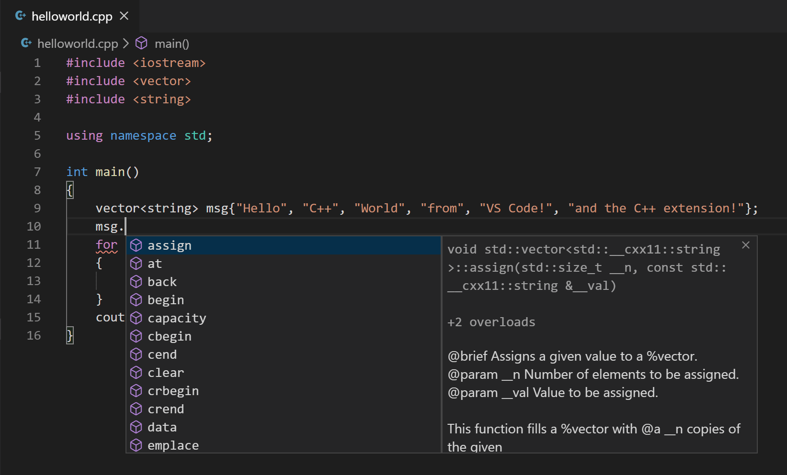
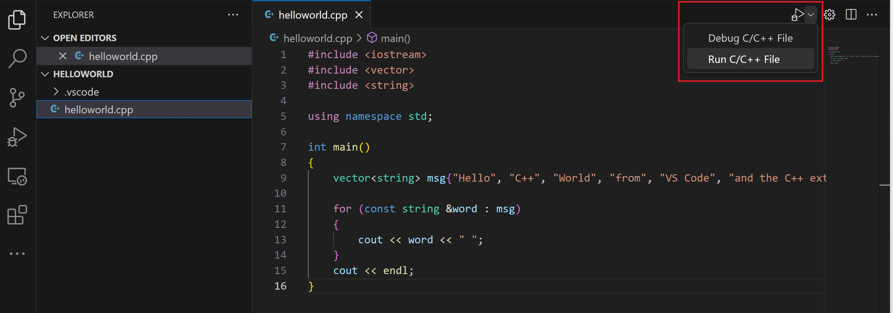
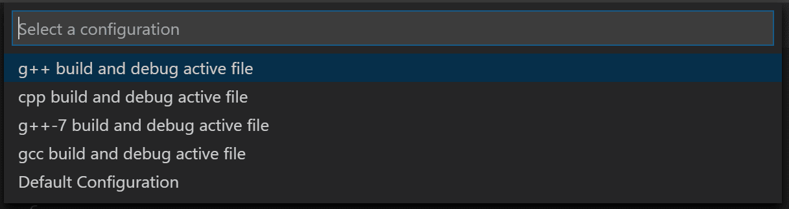
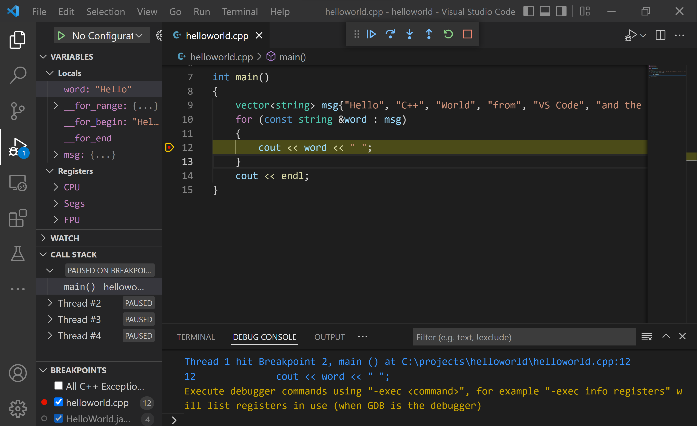
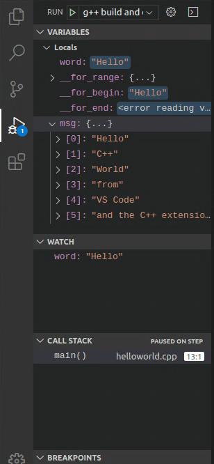

+++
title = "GCC on Windows Subsystem for Linux"
date = 2024-01-12T22:36:24+08:00
weight = 30
type = "docs"
description = ""
isCJKLanguage = true
draft = false
+++

> 原文: [https://code.visualstudio.com/docs/cpp/config-wsl](https://code.visualstudio.com/docs/cpp/config-wsl)

# Using C++ and WSL in VS Code 在 VS Code 中使用 C++ 和 WSL


In this tutorial, you will configure Visual Studio Code to use the GCC C++ compiler (g++) and GDB debugger on Ubuntu in the [Windows Subsystem for Linux](https://learn.microsoft.com/windows/wsl/install) (WSL). GCC stands for GNU Compiler Collection; GDB is the GNU debugger. WSL is a Linux environment within Windows that runs directly on the machine hardware, not in a virtual machine.

​​​	在本教程中，您将配置 Visual Studio Code 以在 Windows 子系统 Linux (WSL) 中的 Ubuntu 上使用 GCC C++ 编译器 (g++) 和 GDB 调试器。GCC 代表 GNU 编译器集合；GDB 是 GNU 调试器。WSL 是 Windows 中的 Linux 环境，它直接在机器硬件上运行，而不在虚拟机中运行。

> **Note**: Much of this tutorial is applicable to working with C++ and VS Code directly on a Linux machine.
>
> ​​​	注意：本教程的大部分内容适用于直接在 Linux 机器上使用 C++ 和 VS Code。

Visual Studio Code has support for working directly in WSL with the [WSL extension](https://marketplace.visualstudio.com/items?itemName=ms-vscode-remote.remote-wsl). We recommend this mode of [WSL development](), where all your source code files, in addition to the compiler, are hosted on the Linux distro. For more background, see [VS Code Remote Development]().

​​​	Visual Studio Code 支持通过 WSL 扩展直接在 WSL 中工作。我们推荐这种 WSL 开发模式，其中除了编译器之外，您的所有源代码文件都托管在 Linux 发行版上。有关更多背景信息，请参阅 VS Code 远程开发。

After completing this tutorial, you will be ready to create and configure your own C++ project, and to explore the VS Code documentation for further information about its many features. This tutorial does not teach you about GCC or Linux or the C++ language. For those subjects, there are many good resources available on the Web.

​​​	完成本教程后，您将准备好创建和配置自己的 C++ 项目，并浏览 VS Code 文档以进一步了解其众多功能。本教程不会教您有关 GCC、Linux 或 C++ 语言的知识。对于这些主题，网络上有很多很好的资源可用。

If you have any problems, feel free to file an issue for this tutorial in the [VS Code documentation repository](https://github.com/microsoft/vscode-docs/issues).

​​​	如果您遇到任何问题，请随时在 VS Code 文档存储库中为此教程提交问题。

## [Prerequisites 先决条件]()

To successfully complete this tutorial, you must do the following steps:

​​​	要成功完成本教程，您必须执行以下步骤：

1. Install [Visual Studio Code](https://code.visualstudio.com/download).

   ​​​	安装 Visual Studio Code。

2. Install the [WSL extension](https://marketplace.visualstudio.com/items?itemName=ms-vscode-remote.remote-wsl).

   ​​​	安装 WSL 扩展。

3. Install [Windows Subsystem for Linux](https://learn.microsoft.com/windows/wsl/install) and then use the links on that same page to install your Linux distribution of choice. This tutorial uses Ubuntu. During installation, remember your Linux user password because you'll need it to install additional software.

   ​​​	安装适用于 Linux 的 Windows 子系统，然后使用同一页面上的链接安装您选择的 Linux 发行版。本教程使用 Ubuntu。在安装过程中，请记住您的 Linux 用户密码，因为您需要它来安装其他软件。

## [Set up your Linux environment 设置您的 Linux 环境]()

1. Open the Bash shell for WSL. If you installed an Ubuntu distro, type "Ubuntu" in the Windows search box and then click on it in the result list. For Debian, type "Debian", and so on.

   ​​​	打开适用于 WSL 的 Bash shell。如果您安装了 Ubuntu 发行版，请在 Windows 搜索框中键入“Ubuntu”，然后在结果列表中单击它。对于 Debian，请键入“Debian”，依此类推。

   

   The shell appears with a command prompt that by default consists of your user name and computer name, and puts you in your home directory. For Ubuntu it looks like this:

   ​​​	Shell 会显示一个命令提示符，该提示符默认由您的用户名和计算机名组成，并将您置于您的主目录中。对于 Ubuntu，它看起来像这样：

   

2. Make a directory called `projects` and then subdirectory under that called `helloworld`:

   ​​​	创建一个名为 `projects` 的目录，然后在该目录下创建一个名为 `helloworld` 的子目录：

   ```
   mkdir projects
   cd projects
   mkdir helloworld
   ```

3. Although you will be using VS Code to edit your source code, you'll be compiling the source code on Linux using the g++ compiler. You'll also debug on Linux using GDB. These tools are not installed by default on Ubuntu, so you have to install them. Fortunately, that task is quite easy!

   ​​​	虽然您将使用 VS Code 编辑源代码，但您将在 Linux 上使用 g++ 编译器编译源代码。您还将在 Linux 上使用 GDB 进行调试。这些工具在 Ubuntu 上默认未安装，因此您必须安装它们。幸运的是，这项任务非常简单！

4. From the WSL command prompt, first run `apt-get update` to update the Ubuntu package lists. An out-of-date distro can sometimes interfere with attempts to install new packages.

   ​​​	首先从 WSL 命令提示符运行 `apt-get update` 以更新 Ubuntu 软件包列表。过时的发行版有时会干扰安装新软件包的尝试。

   ```
   sudo apt-get update
   ```

   If you like, you can run `sudo apt-get update && sudo apt-get dist-upgrade` to also download the latest versions of the system packages, but this can take significantly longer depending on your connection speed.

   ​​​	如果您愿意，可以运行 `sudo apt-get update && sudo apt-get dist-upgrade` 以同时下载系统软件包的最新版本，但这可能需要花费更长时间，具体取决于您的连接速度。

5. From the command prompt, install the GNU compiler tools and the GDB debugger by typing:

   ​​​	在命令提示符下，通过键入以下内容安装 GNU 编译器工具和 GDB 调试器：

   ```
   sudo apt-get install build-essential gdb
   ```

6. Verify that the install succeeded by locating g++ and gdb. If the filenames are not returned from the `whereis` command, try running the update command again.

   ​​​	通过查找 g++ 和 gdb 来验证安装是否成功。如果 `whereis` 命令未返回文件名，请尝试再次运行 update 命令。

   ```
   whereis g++
   whereis gdb
   ```

> **Note**: The setup steps for installing the g++ compiler and GDB debugger apply if you are working directly on a Linux machine rather than in WSL. Running VS Code in your helloworld project, as well as the editing, building, and debugging steps are the same.
>
> ​​​	注意：如果您直接在 Linux 机器上工作而不是在 WSL 中工作，则安装 g++ 编译器和 GDB 调试器的设置步骤适用。在您的 helloworld 项目中运行 VS Code，以及编辑、构建和调试步骤是相同的。

## [Run VS Code in WSL 在 WSL 中运行 VS Code]()

Navigate to your helloworld project folder and launch VS Code from the WSL terminal with `code .`:

​​​	导航到您的 helloworld 项目文件夹，并使用 `code .` 从 WSL 终端启动 VS Code：

```
cd $HOME/projects/helloworld
code .
```

You'll see a message about "Installing VS Code Server". VS Code is downloading and installing a small server on the Linux side that the desktop VS Code will then talk to. VS Code will then start and open the `helloWorld` folder. The File Explorer shows that VS Code is now running in the context of WSL with the title bar **WSL: Ubuntu**.

​​​	您将看到一条关于“正在安装 VS Code Server”的消息。VS Code 正在下载并安装一个小型服务器到 Linux 端，然后桌面 VS Code 将与其通信。然后，VS Code 将启动并打开 `helloWorld` 文件夹。文件资源管理器显示 VS Code 现在在 WSL 的上下文中运行，标题栏为 WSL：Ubuntu。


You can also tell the remote context from the Status bar.

​​​	您还可以从状态栏中了解远程上下文。


If you click on the Remote Status bar item, you will see a dropdown of Remote commands appropriate for the session. For example, if you want to end your session running in WSL, you can select the **Close Remote Connection** command from the dropdown. Running `code .` from your WSL command prompt will restart VS Code running in WSL.

​​​	如果单击“远程状态”栏项目，您将看到适用于该会话的远程命令的下拉列表。例如，如果您想结束在 WSL 中运行的会话，则可以选择下拉列表中的“关闭远程连接”命令。从 WSL 命令提示符运行 `code .` 将重新启动在 WSL 中运行的 VS Code。

The **code .** command opened VS Code in the current working folder, which becomes your "workspace". As you go through the tutorial, you will see three files created in a `.vscode` folder in the workspace:

​​​	. 命令在当前工作文件夹中打开了 VS Code，该文件夹将成为您的“工作区”。在您完成本教程时，您将看到在工作区中的 `.vscode` 文件夹中创建了三个文件：

- `c_cpp_properties.json` (compiler path and IntelliSense settings)
  `c_cpp_properties.json` （编译器路径和 IntelliSense 设置）
- `tasks.json` (build instructions)
  `tasks.json` （构建说明）
- `launch.json` (debugger settings)
  `launch.json` （调试器设置）

## [Add a source code file 添加源代码文件]()

In the File Explorer title bar, select the **New File** button and name the file `helloworld.cpp`.

​​​	在文件资源管理器标题栏中，选择“新建文件”按钮，并将文件命名为 `helloworld.cpp` 。


### [Install the C/C++ extension 安装 C/C++ 扩展]()

Once you create the file and VS Code detects it is a C++ language file, you may be prompted to install the [Microsoft C/C++ extension](https://marketplace.visualstudio.com/items?itemName=ms-vscode.cpptools) if you don't already have it installed.

​​​	一旦您创建了文件，并且 VS Code 检测到它是一个 C++ 语言文件，如果您尚未安装 Microsoft C/C++ 扩展，则可能会提示您安装它。


Choose **Install** and then **Reload Required** when the button is displayed in the Extensions view to complete installing the C/C++ extension.

​​​	在扩展视图中显示按钮时，选择“安装”，然后选择“重新加载必需”，以完成 C/C++ 扩展的安装。

If you already have C/C++ language extensions installed locally in VS Code, you'll need to go to the Extensions view (Ctrl+Shift+X) and install those extensions into WSL. Locally installed extensions can be installed into WSL by selecting the **Install in WSL** button and then **Reload Required**.

​​​	如果您已经在 VS Code 中本地安装了 C/C++ 语言扩展，则需要转到“扩展”视图 (Ctrl+Shift+X) 并将这些扩展安装到 WSL 中。可以通过选择“在 WSL 中安装”按钮，然后选择“重新加载必需”来将本地安装的扩展安装到 WSL 中。


### [Add hello world source code 添加 hello world 源代码]()

Now paste in this source code:

​​​	现在粘贴此源代码：

```
#include <iostream>
#include <vector>
#include <string>

using namespace std;

int main()
{
   vector<string> msg {"Hello", "C++", "World", "from", "VS Code", "and the C++ extension!"};

   for (const string& word : msg)
   {
      cout << word << " ";
   }
   cout << endl;
}
```

Now press Ctrl+S to save the file. Notice how the file you just added appears in the **File Explorer** view (Ctrl+Shift+E) in the side bar of VS Code:

​​​	现在按 Ctrl+S 保存文件。请注意，您刚刚添加的文件如何显示在 VS Code 侧边栏中的文件资源管理器视图（Ctrl+Shift+E）中：


You can also enable [Auto Save]() to automatically save your file changes, by checking **Auto Save** in the main **File** menu.

​​​	您还可以通过选中主文件菜单中的“自动保存”来启用“自动保存”，以自动保存您的文件更改。

The Activity Bar on the far left lets you open different views such as **Search**, **Source Control**, and **Run**. You'll look at the **Run** view later in this tutorial. You can find out more about the other views in the VS Code [User Interface documentation]().

​​​	最左侧的活动栏允许您打开不同的视图，例如搜索、源代码管理和运行。您将在本教程的后面部分了解运行视图。您可以在 VS Code 用户界面文档中了解有关其他视图的更多信息。

## [Explore IntelliSense 探索 IntelliSense]()

In your new `helloworld.cpp` file, hover over `vector` or `string` to see type information. After the declaration of the `msg` variable, start typing `msg.` as you would when calling a member function. You should immediately see a completion list that shows all the member functions, and a window that shows the type information for the `msg` object:

​​​	在您的新 `helloworld.cpp` 文件中，将鼠标悬停在 `vector` 或 `string` 上以查看类型信息。在声明 `msg` 变量后，开始键入 `msg.` ，就像调用成员函数一样。您应该会立即看到一个完成列表，其中显示所有成员函数，以及一个显示 `msg` 对象的类型信息的窗口：



You can press the Tab key to insert the selected member; then, when you add the opening parenthesis, you will see information about any arguments that the function requires.

​​​	您可以按 Tab 键插入选定的成员；然后，当您添加左括号时，您将看到有关函数所需任何参数的信息。

## [Run helloworld.cpp 运行 helloworld.cpp]()

Remember, the C++ extension uses the C++ compiler you have installed on your machine to build your program. Make sure you have a C++ compiler installed before attempting to run and debug `helloworld.cpp` in VS Code.

​​​	请记住，C++ 扩展使用您计算机上安装的 C++ 编译器来构建您的程序。在尝试在 VS Code 中运行和调试 `helloworld.cpp` 之前，请确保已安装 C++ 编译器。

1. Open `helloworld.cpp` so that it is the active file.

   ​​​	打开 `helloworld.cpp` ，使其成为活动文件。

2. Press the play button in the top right corner of the editor.

   ​​​	按编辑器右上角的播放按钮。

   

3. Choose **g++ build and debug active file** from the list of detected compilers on your system.

   ​​​	从系统上检测到的编译器列表中选择 g++ 构建并调试活动文件。

   

You'll only be asked to choose a compiler the first time you run `helloworld.cpp`. This compiler will be set as the "default" compiler in `tasks.json` file.

​​​	您只会在第一次运行 `helloworld.cpp` 时被要求选择编译器。此编译器将被设置为 `tasks.json` 文件中的“默认”编译器。

1. After the build succeeds, your program's output will appear in the integrated **Terminal**.

   ​​​	构建成功后，程序的输出将显示在集成终端中。

   

The first time you run your program, the C++ extension creates `tasks.json`, which you'll find in your project's `.vscode` folder. `tasks.json` stores build configurations.

​​​	第一次运行程序时，C++ 扩展会创建 `tasks.json` ，您可以在项目的 `.vscode` 文件夹中找到它。 `tasks.json` 存储构建配置。

Your new `tasks.json` file should look similar to the JSON below:

​​​	您的新 `tasks.json` 文件应类似于下面的 JSON：

```
{
  "version": "2.0.0",
  "tasks": [
    {
      "type": "shell",
      "label": "C/C++: g++ build active file",
      "command": "/usr/bin/g++",
      "args": ["-g", "${file}", "-o", "${fileDirname}/${fileBasenameNoExtension}"],
      "options": {
        "cwd": "/usr/bin"
      },
      "problemMatcher": ["$gcc"],
      "group": {
        "kind": "build",
        "isDefault": true
      },
      "detail": "Task generated by Debugger."
    }
  ]
}
```

> **Note**: You can learn more about `tasks.json` variables in the [variables reference](https://code.visualstudio.com/docs/editor/variables-reference).
>
> ​​​	注意：您可以在变量参考中了解有关 `tasks.json` 变量的更多信息。

The `command` setting specifies the program to run; in this case that is g++. The `args` array specifies the command-line arguments that will be passed to g++. These arguments must be specified in the order expected by the compiler.

​​​	 `command` 设置指定要运行的程序；在本例中，该程序是 g++。 `args` 数组指定将传递给 g++ 的命令行参数。这些参数必须按照编译器预期的顺序指定。

This task tells g++ to take the active file (`${file}`), compile it, and create an executable file in the current directory (`${fileDirname}`) with the same name as the active file but without an extension (`${fileBasenameNoExtension}`), resulting in `helloworld` for our example.

​​​	此任务告诉 g++ 获取活动文件 ( `${file}` )，对其进行编译，并在当前目录 ( `${fileDirname}` ) 中创建一个可执行文件，该文件的名称与活动文件相同，但没有扩展名 ( `${fileBasenameNoExtension}` )，在我们的示例中，结果为 `helloworld` 。

The `label` value is what you will see in the tasks list; you can name this whatever you like.

​​​	 `label` 值是您将在任务列表中看到的内容；您可以随意命名。

The `detail` value is what you will as the description of the task in the tasks list. It's highly recommended to rename this value to differentiate it from similar tasks.

​​​	 `detail` 值是您将在任务列表中作为任务描述的内容。强烈建议重命名此值，以使其与类似任务区分开来。

From now on, the play button will read from `tasks.json` to figure out how to build and run your program. You can define multiple build tasks in `tasks.json`, and whichever task is marked as the default will be used by the play button. In case you need to change the default compiler, you can run **Tasks: Configure default build task**. Alternatively you can modify the `tasks.json` file and remove the default by replacing this segment:

​​​	从现在开始，播放按钮将从 `tasks.json` 读取以了解如何构建和运行您的程序。您可以在 `tasks.json` 中定义多个构建任务，而标记为默认的任务将由播放按钮使用。如果您需要更改默认编译器，则可以运行任务：配置默认构建任务。或者，您可以修改 `tasks.json` 文件，并通过用此段替换来删除默认值：

```
    "group": {
        "kind": "build",
        "isDefault": true
    },
```

with this:

```
    "group": "build",
```

### [Modifying tasks.json 修改 tasks.json]()

You can modify your `tasks.json` to build multiple C++ files by using an argument like `"${workspaceFolder}/*.cpp"` instead of `"${file}"`.This will build all `.cpp` files in your current folder. You can also modify the output filename by replacing `"${fileDirname}/${fileBasenameNoExtension}"` with a hard-coded filename (for example 'helloworld.out').

​​​	您可以通过使用 `"${workspaceFolder}/*.cpp"` 这样的参数而不是 `"${file}"` 来修改您的 `tasks.json` 以构建多个 C++ 文件。这将构建您当前文件夹中的所有 `.cpp` 文件。您还可以通过用硬编码文件名（例如“helloworld.out”）替换 `"${fileDirname}/${fileBasenameNoExtension}"` 来修改输出文件名。

## [Debug helloworld.cpp 调试 helloworld.cpp]()

To debug your code,

​​​	要调试您的代码，

1. Go back to `helloworld.cpp` so that it is the active file.
   返回 `helloworld.cpp` ，使其成为活动文件。
2. Set a breakpoint by clicking on the editor margin or using F9 on the current line.
   通过单击编辑器边距或在当前行上使用 F9 来设置断点。
3. From the drop-down next to the play button, select **Debug C/C++ File**.
   从播放按钮旁边的下拉列表中，选择调试 C/C++ 文件。
4. Choose **C/C++: g++ build and debug active file** from the list of detected compilers on your system (you'll only be asked to choose a compiler the first time you run ordebug `helloworld.cpp`).
   从系统上检测到的编译器列表中选择 C/C++: g++ build and debug active file（您只会在第一次运行或调试 `helloworld.cpp` 时被要求选择编译器）。

The play button has two modes: **Run C/C++ File** and **Debug C/C++ File**. It will default to the last-used mode. If you see the debug icon in the play button, you can select the play button to debug, instead of selecting the drop-down menu item.

​​​	播放按钮有两种模式：运行 C/C++ 文件和调试 C/C++ 文件。它将默认为上次使用的模式。如果您在播放按钮中看到调试图标，则可以选择播放按钮进行调试，而不是选择下拉菜单项。

## [Explore the debugger 探索调试器]()

Before you start stepping through the code, let's take a moment to notice several changes in the user interface:

​​​	在开始逐步执行代码之前，我们花点时间注意用户界面中的几个更改：

- The Integrated Terminal appears at the bottom of the source code editor. In the **Debug Output** tab, you see output that indicates the debugger is up and running.

  ​​​	集成终端出现在源代码编辑器的底部。在“调试输出”选项卡中，您会看到指示调试器已启动并正在运行的输出。

- The editor highlights line 12, which is a breakpoint that you set before starting the debugger:

  ​​​	编辑器突出显示第 12 行，这是您在启动调试器之前设置的断点：

  

- The **Run and Debug** view on the left shows debugging information. You'll see an example later in the tutorial.

  ​​​	左侧的“运行和调试”视图显示调试信息。您将在本教程的后面看到一个示例。

- At the top of the code editor, a debugging control panel appears. You can move this around the screen by grabbing the dots on the left side.

  ​​​	在代码编辑器的顶部，出现一个调试控制面板。您可以通过抓取左侧的点来在屏幕上移动它。

  

If you already have a launch.json file in your workspace, the play button will read from it when figuring out how run and debug your C++ file. If you don’t have launch.json, the play button will create a temporary “quick debug” configuration on the fly, eliminating the need for launch.json altogether!

​​​	如果您的工作区中已有 launch.json 文件，则播放按钮将在确定如何运行和调试 C++ 文件时从中读取。如果您没有 launch.json，则播放按钮将临时创建一个“快速调试”配置，从而完全无需 launch.json！

## [Step through the code 逐步执行代码]()

Now you're ready to start stepping through the code.

​​​	现在，您可以开始逐步执行代码了。

1. Click or press the **Step over** icon in the debugging control panel.

   ​​​	单击或按下调试控制面板中的“单步执行”图标。

   

   This will advance program execution to the first line of the for loop, and skip over all the internal function calls within the `vector` and `string` classes that are invoked when the `msg` variable is created and initialized. Notice the change in the **Variables** window on the side.

   ​​​	这会将程序执行推进到 for 循环的第一行，并跳过在创建和初始化 `vector` 变量时调用的 `vector` 和 `string` 类中的所有内部函数调用。注意侧面的“变量”窗口中的变化。

   

2. Press **Step over** again to advance to the next statement in this program (skipping over all the internal code that is executed to initialize the loop). Now, the **Variables** window shows information about the loop variables.

   ​​​	再次按“单步执行”以推进到此程序中的下一条语句（跳过执行以初始化循环的所有内部代码）。现在，“变量”窗口显示有关循环变量的信息。

3. Press **Step over** again to execute the `cout` statement. (Note that the C++ extension does not print any output to the **Debug Console** until the last cout executes.)

   ​​​	再次按“单步执行”以执行 `cout` 语句。（请注意，C++ 扩展不会在最后一个 cout 执行之前向调试控制台打印任何输出。）

4. If you like, you can keep pressing **Step over** until all the words in the vector have been printed to the console. But if you are curious, try pressing the **Step Into** button to step through source code in the C++ standard library!

   ​​​	如果您愿意，可以一直按“单步执行”，直到向量中的所有单词都已打印到控制台。但如果您好奇，请尝试按“单步进入”按钮以逐步执行 C++ 标准库中的源代码！

   

   To return to your own code, one way is to keep pressing **Step over**. Another way is to set a breakpoint in your code by switching to the `helloworld.cpp` tab in the code editor, putting the insertion point somewhere on the `cout` statement inside the loop, and pressing F9. A red dot appears in the gutter on the left to indicate that a breakpoint has been set on this line.

   ​​​	要返回您自己的代码，一种方法是不断按步过。另一种方法是在代码编辑器中切换到 `helloworld.cpp` 选项卡，将插入点放在循环内的 `cout` 语句的某个位置，然后按F9来在代码中设置一个断点。左边的边距中会出现一个红点，表示已在此行上设置了一个断点。

   

   Then press F5 to start execution from the current line in the standard library header. Execution will break on `cout`. If you like, you can press F9 again to toggle off the breakpoint.

   ​​​	然后按F5从标准库头文件中的当前行开始执行。执行将在 `cout` 处中断。如果您愿意，可以再次按F9来切换断点。

   When the loop has completed, you can see the output in the **Debug Console** tab of the integrated terminal, along with some other diagnostic information that is output by GDB.

   ​​​	循环完成后，您可以在集成终端的“调试控制台”选项卡中看到输出，以及GDB输出的一些其他诊断信息。

   

## [Set a watch 设置监视]()

To keep track of the value of a variable as your program executes, set a **watch** on the variable.

​​​	要跟踪程序执行时变量的值，请对该变量设置监视。

1. Place the insertion point inside the loop. In the **Watch** window, click the plus sign and in the text box, type `word`, which is the name of the loop variable. Now view the Watch window as you step through the loop.

   ​​​	将插入点放在循环内。在“监视”窗口中，单击加号，然后在文本框中键入 `word` ，它是循环变量的名称。现在，在您逐步执行循环时查看“监视”窗口。

   

2. To quickly view the value of any variable while execution is paused on a breakpoint, you can hover over it with the mouse pointer.

   ​​​	要在执行在断点处暂停时快速查看任何变量的值，您可以将鼠标指针悬停在其上。

   

Next, you'll create a `tasks.json` file to tell VS Code how to build (compile) the program. This task will invoke the g++ compiler to create an executable file from the source code.

​​​	接下来，您将创建一个 `tasks.json` 文件，以告诉 VS Code 如何构建（编译）程序。此任务将调用 g++ 编译器，以从源代码创建可执行文件。

It's important to have `helloworld.cpp` open in the editor because the next step uses the active file in the editor for context to create the build task in the next step.

​​​	在编辑器中打开 `helloworld.cpp` 非常重要，因为下一步使用编辑器中的活动文件作为上下文，以便在下一步中创建构建任务。

## [Customize debugging with launch.json 使用 launch.json 自定义调试]()

When you debug with the play button or F5, the C++ extension creates a dynamic debug configuration on the fly.

​​​	当您使用播放按钮或 F5 调试时，C++ 扩展将动态创建调试配置。

There are cases where you'd want to customize your debug configuration, such as specifying arguments to pass to the program at runtime. You can define custom debug configurations in a `launch.json` file.

​​​	在某些情况下，您需要自定义调试配置，例如指定在运行时传递给程序的参数。您可以在 `launch.json` 文件中定义自定义调试配置。

To create `launch.json`, choose **Add Debug Configuration** from the play button drop-down menu.

​​​	要创建 `launch.json` ，请从播放按钮下拉菜单中选择“添加调试配置”。


You'll then see a dropdown for various predefined debugging configurations. Choose **g++ build and debug active file**.

​​​	然后，您将看到一个用于各种预定义调试配置的下拉菜单。选择 g++ 构建并调试活动文件。


VS Code creates a `launch.json` file, which looks something like this:

​​​	VS Code 创建一个 `launch.json` 文件，如下所示：

```
{
  "version": "0.2.0",
  "configurations": [
    {
      "name": "C/C++: g++ build and debug active file",
      "type": "cppdbg",
      "request": "launch",
      "program": "${fileDirname}/${fileBasenameNoExtension}",
      "args": [],
      "stopAtEntry": false,
      "cwd": "${workspaceFolder}",
      "environment": [],
      "externalConsole": false,
      "MIMode": "gdb",
      "miDebuggerPath": "/usr/bin/gdb",
      "setupCommands": [
        {
          "description": "Enable pretty-printing for gdb",
          "text": "-enable-pretty-printing",
          "ignoreFailures": true
        }
      ],
      "preLaunchTask": "C/C++: g++ build active file"
    }
  ]
}
```

In the JSON above, `program` specifies the program you want to debug. Here it is set to the active file folder `${fileDirname}` and active filename without an extension `${fileBasenameNoExtension}`, which if `helloworld.cpp` is the active file will be `helloworld`. The `args` property is an array of arguments to pass to the program at runtime.

​​​	在上面的 JSON 中， `program` 指定要调试的程序。此处将其设置为活动文件文件夹 `${fileDirname}` 和不带扩展名的活动文件名 `${fileBasenameNoExtension}` ，如果 `helloworld.cpp` 是活动文件，则为 `helloworld` 。 `args` 属性是一个参数数组，用于在运行时传递给程序。

By default, the C++ extension won't add any breakpoints to your source code and the `stopAtEntry` value is set to `false`.

​​​	默认情况下，C++ 扩展不会向源代码添加任何断点，并且 `stopAtEntry` 值设置为 `false` 。

Change the `stopAtEntry` value to `true` to cause the debugger to stop on the `main` method when you start debugging.

​​​	将 `stopAtEntry` 值更改为 `true` 以便在开始调试时使调试器在 `main` 方法上停止。

> From now on, the play button and F5 will read from your `launch.json` file when launching your program for debugging.
>
> ​​​	从现在开始，播放按钮和 F5 将在启动程序进行调试时从 `launch.json` 文件中读取。

## [C/C++ configurations C/C++ 配置]()

If you want more control over the C/C++ extension, you can create a `c_cpp_properties.json` file, which will allow you to change settings such as the path to the compiler, include paths, C++ standard (default is C++17), and more.

​​​	如果您想对 C/C++ 扩展进行更多控制，可以创建一个 `c_cpp_properties.json` 文件，该文件允许您更改设置，例如编译器路径、包含路径、C++ 标准（默认为 C++17）等。

You can view the C/C++ configuration UI by running the command **C/C++: Edit Configurations (UI)** from the Command Palette (Ctrl+Shift+P).

​​​	您可以通过从命令面板 (Ctrl+Shift+P) 运行命令 C/C++: 编辑配置 (UI) 来查看 C/C++ 配置 UI。


This opens the **C/C++ Configurations** page. When you make changes here, VS Code writes them to a file called `c_cpp_properties.json` in the `.vscode` folder.

​​​	这将打开 C/C++ 配置页面。当您在此处进行更改时，VS Code 会将它们写入 `.vscode` 文件夹中名为 `c_cpp_properties.json` 的文件中。


You only need to modify the **Include path** setting if your program includes header files that are not in your workspace or in the standard library path.

​​​	如果您的程序包含不在工作区或标准库路径中的头文件，则只需修改 Include 路径设置。

Visual Studio Code places these settings in `.vscode/c_cpp_properties.json`. If you open that file directly, it should look something like this:

​​​	Visual Studio Code 将这些设置放在 `.vscode/c_cpp_properties.json` 中。如果您直接打开该文件，它应该看起来像这样：

```
{
  "configurations": [
    {
      "name": "Linux",
      "includePath": ["${workspaceFolder}/**"],
      "defines": [],
      "compilerPath": "/usr/bin/gcc",
      "cStandard": "c11",
      "cppStandard": "c++17",
      "intelliSenseMode": "clang-x64"
    }
  ],
  "version": 4
}
```

## [Closing the WSL session 关闭 WSL 会话]()

When you are done working in WSL, you can close your remote session with the **Close Remote Connection** command available in the main **File** menu and the Command Palette (Ctrl+Shift+P). This will restart VS Code running locally. You can easily reopen your WSL session from the **File** > **Open Recent** list by selecting folders with the **[WSL]** suffix.

​​​	在 WSL 中完成工作后，您可以使用主文件菜单和命令面板 (Ctrl+Shift+P) 中提供的“关闭远程连接”命令关闭远程会话。这将重新启动本地运行的 VS Code。您可以通过从文件 > 最近打开列表中选择带有 [WSL] 后缀的文件夹轻松重新打开 WSL 会话。

## [Next steps 后续步骤]()

- Explore the [VS Code User Guide]().
  浏览 VS Code 用户指南。
- Review the [Overview of the C++ extension]().
  查看 C++ 扩展概述。
- Create a new workspace, copy your .json files to it, adjust the necessary settings for the new workspace path, program name, and so on, and start coding!
  创建一个新工作区，将您的 .json 文件复制到其中，调整新工作区路径、程序名称等必要的设置，然后开始编码！
