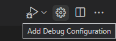

+++
title = "Microsoft C++ on Windows"
date = 2024-01-12T22:36:24+08:00
weight = 50
type = "docs"
description = ""
isCJKLanguage = true
draft = false
+++

> 原文: [https://code.visualstudio.com/docs/cpp/config-msvc](https://code.visualstudio.com/docs/cpp/config-msvc)

# Configure VS Code for Microsoft C++ 配置 VS Code 以使用 Microsoft C++


In this tutorial, you configure Visual Studio Code to use the Microsoft Visual C++ compiler and debugger on Windows.

​​​	在本教程中，您将配置 Visual Studio Code 以在 Windows 上使用 Microsoft Visual C++ 编译器和调试器。

After configuring VS Code, you will compile and debug a simple Hello World program in VS Code. This tutorial does not teach you details about the Microsoft C++ toolset or the C++ language. For those subjects, there are many good resources available on the Web.

​​​	配置 VS Code 后，您将在 VS Code 中编译和调试一个简单的 Hello World 程序。本教程不会教您有关 Microsoft C++ 工具集或 C++ 语言的详细信息。对于这些主题，网上有很多很好的资源。

If you have any problems, feel free to file an issue for this tutorial in the [VS Code documentation repository](https://github.com/microsoft/vscode-docs/issues).

​​​	如果您遇到任何问题，请随时在 VS Code 文档存储库中为此教程提交问题。

## [Prerequisites 先决条件](https://code.visualstudio.com/docs/cpp/config-msvc#_prerequisites)

To successfully complete this tutorial, you must do the following:

​​​	要成功完成本教程，您必须执行以下操作：

1. Install [Visual Studio Code](https://code.visualstudio.com/download).

   ​​​	安装 Visual Studio Code。

2. Install the [C/C++ extension for VS Code](https://marketplace.visualstudio.com/items?itemName=ms-vscode.cpptools). You can install the C/C++ extension by searching for 'c++' in the Extensions view (Ctrl+Shift+X).

   ​​​	为 VS Code 安装 C/C++ 扩展。您可以通过在扩展视图 (Ctrl+Shift+X) 中搜索“c++”来安装 C/C++ 扩展。

   

3. Install the Microsoft Visual C++ (MSVC) compiler toolset.

   ​​​	安装 Microsoft Visual C++ (MSVC) 编译器工具集。

   If you have a recent version of Visual Studio, open the Visual Studio Installer from the Windows Start menu and verify that the C++ workload is checked. If it's not installed, then check the box and select the **Modify** button in the installer.

   ​​​	如果您有较新版本的 Visual Studio，请从 Windows 开始菜单中打开 Visual Studio 安装程序，并验证是否已选中 C++ 工作负载。如果尚未安装，请选中该框，然后在安装程序中选择“修改”按钮。

   You can also install the **Desktop development with C++** workload without a full Visual Studio IDE installation. From the Visual Studio [Downloads](https://visualstudio.microsoft.com/downloads/#remote-tools-for-visual-studio-2022) page, scroll down until you see **Tools for Visual Studio** under the **All Downloads** section and select the download for **Build Tools for Visual Studio 2022**.

   ​​​	您还可以在没有完整 Visual Studio IDE 安装的情况下安装使用 C++ 的桌面开发工作负载。在 Visual Studio 下载页面上，向下滚动直到在“所有下载”部分下看到 Visual Studio 工具，然后选择 Visual Studio 2022 的生成工具下载。

   

   This will launch the Visual Studio Installer, which will bring up a dialog showing the available Visual Studio Build Tools workloads. Check the **Desktop development with C++** workload and select **Install**.

   ​​​	这将启动 Visual Studio 安装程序，它将显示一个对话框，其中显示可用的 Visual Studio Build Tools 工作负载。选中“使用 C++ 进行桌面开发”工作负载，然后选择“安装”。

   

> **Note**: You can use the C++ toolset from Visual Studio Build Tools along with Visual Studio Code to compile, build, and verify any C++ codebase as long as you also have a valid Visual Studio license (either Community, Pro, or Enterprise) that you are actively using to develop that C++ codebase.
>
> ​​​	注意：只要您还拥有有效的 Visual Studio 许可证（社区版、专业版或企业版），并且您正在积极使用该许可证来开发该 C++ 代码库，就可以将 Visual Studio Build Tools 中的 C++ 工具集与 Visual Studio Code 配合使用来编译、构建和验证任何 C++ 代码库。

### [Check your Microsoft Visual C++ installation 检查您的 Microsoft Visual C++ 安装](https://code.visualstudio.com/docs/cpp/config-msvc#_check-your-microsoft-visual-c-installation)

To use MSVC from a command line or VS Code, you must run from a **Developer Command Prompt for Visual Studio**. An ordinary shell such as PowerShell, Bash, or the Windows command prompt does not have the necessary path environment variables set.

​​​	要从命令行或 VS Code 使用 MSVC，您必须从 Visual Studio 的开发人员命令提示符运行。PowerShell、Bash 或 Windows 命令提示符等普通外壳没有设置必要的路径环境变量。

To open the Developer Command Prompt for VS, start typing 'developer' in the Windows Start menu, and you should see it appear in the list of suggestions. The exact name depends on which version of Visual Studio or the Visual Studio Build Tools you have installed. Select the item to open the prompt.

​​​	要打开 VS 的开发人员命令提示符，请开始在 Windows 开始菜单中键入“developer”，您应该会看到它出现在建议列表中。确切的名称取决于您已安装的 Visual Studio 或 Visual Studio Build Tools 的版本。选择该项以打开提示符。


You can test that you have the C++ compiler, `cl.exe`, installed correctly by typing 'cl' and you should see a copyright message with the version and basic usage description.

​​​	您可以通过键入“cl”来测试您是否正确安装了 C++ 编译器 `cl.exe` ，您应该会看到包含版本和基本用法说明的版权消息。


If the Developer Command Prompt is using the BuildTools location as the starting directory (you wouldn't want to put projects there), navigate to your user folder (`C:\users\{your username}\`) before you start creating new projects.

​​​	如果 Developer Command Prompt 使用 BuildTools 位置作为起始目录（您不想将项目放在那里），请在开始创建新项目之前导航到您的用户文件夹 ( `C:\users\{your username}\` )。

> **Note**: If for some reason you can't run VS Code from a **Developer Command Prompt**, you can find a workaround for building C++ projects with VS Code in [Run VS Code outside a Developer Command Prompt](https://code.visualstudio.com/docs/cpp/config-msvc#_run-vs-code-outside-the-developer-command-prompt).
>
> ​​​	注意：如果您出于某种原因无法从 Developer Command Prompt 运行 VS Code，您可以在在 Developer Command Prompt 外部运行 VS Code 中找到用于构建 C++ 项目的解决方法。

## [Create Hello World 创建 Hello World](https://code.visualstudio.com/docs/cpp/config-msvc#_create-hello-world)

From the Developer Command Prompt, create an empty folder called "projects" where you can store all your VS Code projects, then create a subfolder called "helloworld", navigate into it, and open VS Code (`code`) in that folder (`.`) by entering the following commands:

​​​	在 Developer Command Prompt 中，创建一个名为“projects”的空文件夹，您可以在其中存储所有 VS Code 项目，然后创建一个名为“helloworld”的子文件夹，导航到其中，并通过输入以下命令在该文件夹 ( `.` ) 中打开 VS Code ( `code` )：

```
mkdir projects
cd projects
mkdir helloworld
cd helloworld
code .
```

The "code ." command opens VS Code in the current working folder, which becomes your "workspace". As you go through the tutorial, you will see three files created in a `.vscode` folder in the workspace:

​​​	“code .”命令在当前工作文件夹中打开 VS Code，该文件夹成为您的“工作区”。在您完成本教程时，您将看到在工作区中的 `.vscode` 文件夹中创建了三个文件：

- `tasks.json` (build instructions)
  `tasks.json` （构建说明）
- `launch.json` (debugger settings)
  `launch.json` （调试器设置）
- `c_cpp_properties.json` (compiler path and IntelliSense settings)
  `c_cpp_properties.json` （编译器路径和 IntelliSense 设置）

### [Add a source code file 添加源代码文件](https://code.visualstudio.com/docs/cpp/config-msvc#_add-a-source-code-file)

In the File Explorer title bar, select the **New File** button and name the file `helloworld.cpp`.

​​​	在文件资源管理器标题栏中，选择“新建文件”按钮，并将文件命名为 `helloworld.cpp` 。


### [Add hello world source code 添加 hello world 源代码](https://code.visualstudio.com/docs/cpp/config-msvc#_add-hello-world-source-code)

Now paste in this source code:

​​​	现在粘贴此源代码：

```
#include <iostream>
#include <vector>
#include <string>

using namespace std;

int main()
{
    vector<string> msg {"Hello", "C++", "World", "from", "VS Code", "and the C++ extension!"};

    for (const string& word : msg)
    {
        cout << word << " ";
    }
    cout << endl;
}
```

Now press Ctrl+S to save the file. Notice how the file you just added appears in the **File Explorer** view (Ctrl+Shift+E) in the side bar of VS Code:

​​​	现在按 Ctrl+S 保存文件。请注意，您刚刚添加的文件如何显示在 VS Code 侧边栏中的文件资源管理器视图（Ctrl+Shift+E）中：


You can also enable [Auto Save](https://code.visualstudio.com/docs/editor/codebasics#_save-auto-save) to automatically save your file changes, by checking **Auto Save** in the main **File** menu.

​​​	您还可以通过选中主文件菜单中的“自动保存”来启用“自动保存”，以自动保存您的文件更改。

The Activity Bar on the far left lets you open different views such as **Search**, **Source Control**, and **Run**. You'll look at the **Run** view later in this tutorial. You can find out more about the other views in the VS Code [User Interface documentation](https://code.visualstudio.com/docs/getstarted/userinterface).

​​​	最左侧的活动栏允许您打开不同的视图，例如搜索、源代码管理和运行。您将在本教程的后面部分了解运行视图。您可以在 VS Code 用户界面文档中了解有关其他视图的更多信息。

> **Note**: When you save or open a C++ file, you may see a notification from the C/C++ extension about the availability of an Insiders version, which lets you test new features and fixes. You can ignore this notification by selecting the `X` (**Clear Notification**).
>
> ​​​	注意：当您保存或打开 C++ 文件时，您可能会看到来自 C/C++ 扩展的通知，其中包含有关 Insider 版本可用性的信息，该版本允许您测试新功能和修复程序。您可以通过选择 `X` （清除通知）来忽略此通知。

## [Explore IntelliSense 探索 IntelliSense](https://code.visualstudio.com/docs/cpp/config-msvc#_explore-intellisense)

In your new `helloworld.cpp` file, hover over `vector` or `string` to see type information. After the declaration of the `msg` variable, start typing `msg.` as you would when calling a member function. You should immediately see a completion list that shows all the member functions, and a window that shows the type information for the `msg` object:

​​​	在您的新 `helloworld.cpp` 文件中，将鼠标悬停在 `vector` 或 `string` 上以查看类型信息。在声明 `msg` 变量后，开始键入 `msg.` ，就像调用成员函数一样。您应该会立即看到一个完成列表，其中显示所有成员函数，以及一个显示 `msg` 对象的类型信息的窗口：


You can press the Tab key to insert the selected member; then, when you add the opening parenthesis, you will see information about any arguments that the function requires.

​​​	您可以按 Tab 键插入选定的成员；然后，当您添加左括号时，您将看到有关函数所需任何参数的信息。

## [Run helloworld.cpp 运行 helloworld.cpp](https://code.visualstudio.com/docs/cpp/config-msvc#_run-helloworldcpp)

Remember, the C++ extension uses the C++ compiler you have installed on your machine to build your program. Make sure you have a C++ compiler installed before attempting to run and debug `helloworld.cpp` in VS Code.

​​​	请记住，C++ 扩展使用您计算机上安装的 C++ 编译器来构建您的程序。在尝试在 VS Code 中运行和调试 `helloworld.cpp` 之前，请确保已安装 C++ 编译器。

1. Open `helloworld.cpp` so that it is the active file.

   ​​​	打开 `helloworld.cpp` ，使其成为活动文件。

2. Press the play button in the top right corner of the editor.

   ​​​	按编辑器右上角的播放按钮。

   

3. Choose **C/C++: cl.exe build and debug active file** from the list of detected compilers on your system.

   ​​​	从系统上检测到的编译器列表中选择 C/C++：cl.exe 构建并调试活动文件。

   

You'll only be asked to choose a compiler the first time you run `helloworld.cpp`. This compiler will be set as the "default" compiler in `tasks.json` file.

​​​	您只会在第一次运行 `helloworld.cpp` 时被要求选择编译器。此编译器将被设置为 `tasks.json` 文件中的“默认”编译器。

1. After the build succeeds, your program's output will appear in the integrated **Terminal**.

   ​​​	构建成功后，程序的输出将显示在集成终端中。

   

If you get an error trying to build and debug with cl.exe, make sure you have [started VS Code from the Developer Command Prompt for Visual Studio](https://code.visualstudio.com/docs/cpp/config-msvc#_check-your-microsoft-visual-c-installation) using the `code .` shortcut.

​​​	如果在尝试使用 cl.exe 构建和调试时遇到错误，请确保已使用 `code .` 快捷方式从 Visual Studio 的开发人员命令提示符启动 VS Code。


The first time you run your program, the C++ extension creates `tasks.json`, which you'll find in your project's `.vscode` folder. `tasks.json` stores build configurations.

​​​	第一次运行程序时，C++ 扩展会创建 `tasks.json` ，您可以在项目的 `.vscode` 文件夹中找到它。 `tasks.json` 存储构建配置。

Your new `tasks.json` file should look similar to the JSON below:

​​​	您的新 `tasks.json` 文件应类似于下面的 JSON：

```
{
  "version": "2.0.0",
  "tasks": [
    {
      "type": "shell",
      "label": "C/C++: cl.exe build active file",
      "command": "cl.exe",
      "args": [
        "/Zi",
        "/EHsc",
        "/Fe:",
        "${fileDirname}\\${fileBasenameNoExtension}.exe",
        "${file}"
      ],
      "problemMatcher": ["$msCompile"],
      "group": {
        "kind": "build",
        "isDefault": true
      },
      "detail": "Task generated by Debugger."
    }
  ]
}
```

> **Note**: You can learn more about `tasks.json` variables in the [variables reference](https://code.visualstudio.com/docs/editor/variables-reference).
>
> ​​​	注意：您可以在变量参考中了解有关 `tasks.json` 变量的更多信息。

The `command` setting specifies the program to run; in this case that is "cl.exe". The `args` array specifies the command-line arguments that will be passed to cl.exe. These arguments must be specified in the order expected by the compiler.

​​​	 `command` 设置指定要运行的程序；在本例中为“cl.exe”。 `args` 数组指定将传递给 cl.exe 的命令行参数。必须按编译器预期的顺序指定这些参数。

This task tells the C++ compiler to take the active file (`${file}`), compile it, and create an executable file (`/Fe:` switch) in the current directory (`${fileDirname}`) with the same name as the active file but with the `.exe` extension (`${fileBasenameNoExtension}.exe`), resulting in `helloworld.exe` for our example.

​​​	此任务告诉 C++ 编译器获取活动文件 ( `${file}` )，对其进行编译，并在当前目录 ( `${fileDirname}` ) 中创建一个可执行文件 ( `/Fe:` 开关)，其名称与活动文件相同，但扩展名为 `.exe` ( `${fileBasenameNoExtension}.exe` )，在我们的示例中结果为 `helloworld.exe` 。

The `label` value is what you will see in the tasks list; you can name this whatever you like.

​​​	 `label` 值是您将在任务列表中看到的内容；您可以随意命名。

The `detail` value is what you will as the description of the task in the tasks list. It's highly recommended to rename this value to differentiate it from similar tasks.

​​​	 `detail` 值是您将在任务列表中作为任务描述的内容。强烈建议重命名此值，以使其与类似任务区分开来。

The `problemMatcher` value selects the output parser to use for finding errors and warnings in the compiler output. For cl.exe, you'll get the best results if you use the `$msCompile` problem matcher.

​​​	 `problemMatcher` 值选择用于在编译器输出中查找错误和警告的输出解析器。对于 cl.exe，如果您使用 `$msCompile` 问题匹配器，您将获得最佳结果。

From now on, the play button will read from `tasks.json` to figure out how to build and run your program. You can define multiple build tasks in `tasks.json`, and whichever task is marked as the default will be used by the play button. In case you need to change the default compiler, you can run **Tasks: Configure default build task**. Alternatively you can modify the `tasks.json` file and remove the default by replacing this segment:

​​​	从现在开始，播放按钮将从 `tasks.json` 读取以了解如何构建和运行您的程序。您可以在 `tasks.json` 中定义多个构建任务，而标记为默认的任务将由播放按钮使用。如果您需要更改默认编译器，则可以运行任务：配置默认构建任务。或者，您可以修改 `tasks.json` 文件，并通过用此段替换来删除默认值：

```
    "group": {
        "kind": "build",
        "isDefault": true
    },
```

with this:

```
    "group": "build",
```

### [Modifying tasks.json 修改 tasks.json](https://code.visualstudio.com/docs/cpp/config-msvc#_modifying-tasksjson)

You can modify your `tasks.json` to build multiple C++ files by using an argument like `"${workspaceFolder}/*.cpp"` instead of `"${file}"`.This will build all `.cpp` files in your current folder. You can also modify the output filename by replacing `"${fileDirname}\\${fileBasenameNoExtension}.exe"` with a hard-coded filename (for example `"${workspaceFolder}\\myProgram.exe"`).

​​​	您可以修改 `tasks.json` ，以使用 `"${workspaceFolder}/*.cpp"` 这样的参数而不是 `"${file}"` 来构建多个 C++ 文件。这将构建您当前文件夹中的所有 `.cpp` 文件。您还可以通过将 `"${fileDirname}\\${fileBasenameNoExtension}.exe"` 替换为硬编码的文件名（例如 `"${workspaceFolder}\\myProgram.exe"` ）来修改输出文件名。

## [Debug helloworld.cpp 调试 helloworld.cpp](https://code.visualstudio.com/docs/cpp/config-msvc#_debug-helloworldcpp)

To debug your code,

​​​	要调试您的代码，

1. Go back to `helloworld.cpp` so that it is the active file.
   返回 `helloworld.cpp` ，使其成为活动文件。
2. Set a breakpoint by clicking on the editor margin or using F9 on the current line.
   通过单击编辑器边距或在当前行上使用 F9 来设置断点。
3. From the drop-down next to the play button, select **Debug C/C++ File**.
   从播放按钮旁边的下拉列表中，选择调试 C/C++ 文件。
4. Choose **C/C++: cl.exe build and debug active file** from the list of detected compilers on your system (you'll only be asked to choose a compiler the first time you run or debug `helloworld.cpp`).
   从系统上检测到的编译器列表中选择 C/C++: cl.exe 构建并调试活动文件（仅在您首次运行或调试 `helloworld.cpp` 时才会要求您选择编译器）。

The play button has two modes: **Run C/C++ File** and **Debug C/C++ File**. It will default to the last-used mode. If you see the debug icon in the play button, you can select the play button to debug, instead of selecting the drop-down menu item.

​​​	播放按钮有两种模式：运行 C/C++ 文件和调试 C/C++ 文件。它将默认为上次使用的模式。如果您在播放按钮中看到调试图标，则可以选择播放按钮进行调试，而不是选择下拉菜单项。

If you get an error trying to build and debug with cl.exe, make sure you have [started VS Code from the Developer Command Prompt for Visual Studio](https://code.visualstudio.com/docs/cpp/config-msvc#_check-your-microsoft-visual-c-installation) using the `code .` shortcut.

​​​	如果尝试使用 cl.exe 构建和调试时出现错误，请确保已使用 `code .` 快捷方式从 Visual Studio 的开发人员命令提示符启动 VS Code。


## [Explore the debugger 探索调试器](https://code.visualstudio.com/docs/cpp/config-msvc#_explore-the-debugger)

Before you start stepping through the code, let's take a moment to notice several changes in the user interface:

​​​	在开始逐步执行代码之前，我们花点时间注意用户界面中的几个更改：

- The Integrated Terminal appears at the bottom of the source code editor. In the **Debug Output** tab, you see output that indicates the debugger is up and running.

  ​​​	集成终端出现在源代码编辑器的底部。在“调试输出”选项卡中，您会看到指示调试器已启动并正在运行的输出。

- The editor highlights the line where you set a breakpoint before starting the debugger:

  ​​​	编辑器突出显示您在启动调试器之前设置断点的行：

  

- The **Run and Debug** view on the left shows debugging information. You'll see an example later in the tutorial.

  ​​​	左侧的“运行和调试”视图显示调试信息。您将在本教程的后面看到一个示例。

- At the top of the code editor, a debugging control panel appears. You can move this around the screen by grabbing the dots on the left side.

  ​​​	在代码编辑器的顶部，出现一个调试控制面板。您可以通过抓取左侧的点来在屏幕上移动它。

  

## [Step through the code 逐步执行代码](https://code.visualstudio.com/docs/cpp/config-msvc#_step-through-the-code)

Now you're ready to start stepping through the code.

​​​	现在，您可以开始逐步执行代码了。

1. Click or press the **Step over** icon in the debugging control panel.

   ​​​	单击或按下调试控制面板中的“单步执行”图标。

   

   This will advance program execution to the first line of the for loop, and skip over all the internal function calls within the `vector` and `string` classes that are invoked when the `msg` variable is created and initialized. Notice the change in the **Variables** window on the left.

   ​​​	这会将程序执行推进到 for 循环的第一行，并跳过在创建和初始化 `vector` 变量时调用的 `string` 和 `msg` 类中的所有内部函数调用。注意左侧“变量”窗口中的变化。

   

   In this case, the errors are expected because, although the variable names for the loop are now visible to the debugger, the statement has not executed yet, so there is nothing to read at this point. The contents of `msg` are visible, however, because that statement has completed.

   ​​​	在这种情况下，出现错误是预期的，因为虽然循环的变量名现在对调试器可见，但语句尚未执行，因此此时没有任何内容可供读取。 `msg` 的内容是可见的，因为该语句已完成。

2. Press **Step over** again to advance to the next statement in this program (skipping over all the internal code that is executed to initialize the loop). Now, the **Variables** window shows information about the loop variables.

   ​​​	再次按“单步执行”以推进到此程序中的下一条语句（跳过执行以初始化循环的所有内部代码）。现在，“变量”窗口显示有关循环变量的信息。

3. Press **Step over** again to execute the `cout` statement. (Note that the C++ extension does not print any output to the **Debug Console** until the loop exits.)

   ​​​	再次按“单步执行”以执行 `cout` 语句。（请注意，C++ 扩展不会在循环退出之前向“调试控制台”打印任何输出。）

4. If you like, you can keep pressing **Step over** until all the words in the vector have been printed to the console. But if you are curious, try pressing the **Step Into** button to step through source code in the C++ standard library!

   ​​​	如果您愿意，可以一直按“单步执行”，直到向量中的所有单词都已打印到控制台。但如果您好奇，请尝试按“单步进入”按钮以逐步执行 C++ 标准库中的源代码！

   

   To return to your own code, one way is to keep pressing **Step over**. Another way is to set a breakpoint in your code by switching to the `helloworld.cpp` tab in the code editor, putting the insertion point somewhere on the `cout` statement inside the loop, and pressing F9. A red dot appears in the gutter on the left to indicate that a breakpoint has been set on this line.

   ​​​	要返回您自己的代码，一种方法是不断按步过。另一种方法是在代码编辑器中切换到 `helloworld.cpp` 选项卡，将插入点放在循环内的 `cout` 语句的某个位置，然后按F9来在代码中设置一个断点。左边的边距中会出现一个红点，表示已在此行上设置了一个断点。

   

   Then press F5 to start execution from the current line in the standard library header. Execution will break on `cout`. If you like, you can press F9 again to toggle off the breakpoint.

   ​​​	然后按F5从标准库头文件中的当前行开始执行。执行将在 `cout` 处中断。如果您愿意，可以再次按F9来切换断点。

## [Set a watch 设置监视](https://code.visualstudio.com/docs/cpp/config-msvc#_set-a-watch)

Sometimes you might want to keep track of the value of a variable as your program executes. You can do this by setting a **watch** on the variable.

​​​	有时您可能希望在程序执行时跟踪变量的值。您可以通过设置变量监视来做到这一点。

1. Place the insertion point inside the loop. In the **Watch** window, select the plus sign and in the text box, type `word`, which is the name of the loop variable. Now view the Watch window as you step through the loop.

   ​​​	将插入点放在循环内。在监视窗口中，选择加号并在文本框中键入 `word` ，这是循环变量的名称。现在，在您逐步执行循环时查看监视窗口。

   

2. Add another watch by adding this statement before the loop: `int i = 0;`. Then, inside the loop, add this statement: `++i;`. Now add a watch for `i` as you did in the previous step.

   ​​​	通过在循环前添加此语句来添加另一个监视： `int i = 0;` 。然后，在循环内，添加此语句： `++i;` 。现在，像您在上一步中所做的那样为 `i` 添加一个监视。

3. To quickly view the value of any variable while execution is paused on a breakpoint, you can hover over it with the mouse pointer.

   ​​​	要在执行在断点处暂停时快速查看任何变量的值，您可以将鼠标指针悬停在其上。

   

## [Customize debugging with launch.json 使用 launch.json 自定义调试](https://code.visualstudio.com/docs/cpp/config-msvc#_customize-debugging-with-launchjson)

When you debug with the play button or F5, the C++ extension creates a dynamic debug configuration on the fly.

​​​	当您使用播放按钮或 F5 调试时，C++ 扩展将动态创建调试配置。

There are cases where you'd want to customize your debug configuration, such as specifying arguments to pass to the program at runtime. You can define custom debug configurations in a `launch.json` file.

​​​	在某些情况下，您需要自定义调试配置，例如指定在运行时传递给程序的参数。您可以在 `launch.json` 文件中定义自定义调试配置。

To create `launch.json`, choose **Add Debug Configuration** from the play button drop-down menu.

​​​	要创建 `launch.json` ，请从播放按钮下拉菜单中选择“添加调试配置”。



You'll then see a dropdown for various predefined debugging configurations. Choose **C/C++: cl.exe build and debug active file**.

​​​	然后，您将看到一个下拉菜单，其中包含各种预定义的调试配置。选择 C/C++：cl.exe 构建并调试活动文件。


VS Code creates a `launch.json` file, which looks something like this:

​​​	VS Code 创建一个 `launch.json` 文件，如下所示：

```
{
  "version": "0.2.0",
  "configurations": [
    {
      "name": "C/C++: cl.exe build and debug active file",
      "type": "cppvsdbg",
      "request": "launch",
      "program": "${fileDirname}\\${fileBasenameNoExtension}.exe",
      "args": [],
      "stopAtEntry": false,
      "cwd": "${workspaceFolder}",
      "environment": [],
      "externalConsole": false,
      "preLaunchTask": "C/C++: cl.exe build active file"
    }
  ]
}
```

In the JSON above, `program` specifies the program you want to debug. Here it is set to the active file folder (`${fileDirname}`) and active filename with the `.exe` extension (`${fileBasenameNoExtension}.exe`), which if `helloworld.cpp` is the active file will be `helloworld.exe`. The `args` property is an array of arguments to pass to the program at runtime.

​​​	在上面的 JSON 中， `program` 指定您要调试的程序。此处将其设置为活动文件文件夹 ( `${fileDirname}` ) 和具有 `.exe` 扩展名的活动文件名 ( `${fileBasenameNoExtension}.exe` )，如果 `helloworld.cpp` 是活动文件，则为 `helloworld.exe` 。 `args` 属性是一个数组，用于在运行时将参数传递给程序。

By default, the C++ extension won't add any breakpoints to your source code and the `stopAtEntry` value is set to `false`.

​​​	默认情况下，C++ 扩展不会向源代码添加任何断点，并且 `stopAtEntry` 值设置为 `false` 。

Change the `stopAtEntry` value to `true` to cause the debugger to stop on the `main` method when you start debugging.

​​​	将 `stopAtEntry` 值更改为 `true` 以便在开始调试时使调试器在 `main` 方法上停止。

> From now on, the play button and F5 will read from your `launch.json` file when launching your program for debugging.
>
> ​​​	从现在开始，播放按钮和 F5 将在启动程序进行调试时从 `launch.json` 文件中读取。

## [C/C++ configurations C/C++ 配置](https://code.visualstudio.com/docs/cpp/config-msvc#_cc-configurations)

If you want more control over the C/C++ extension, you can create a `c_cpp_properties.json` file, which will allow you to change settings such as the path to the compiler, include paths, C++ standard (default is C++17), and more.

​​​	如果您想对 C/C++ 扩展进行更多控制，可以创建一个 `c_cpp_properties.json` 文件，该文件允许您更改设置，例如编译器路径、包含路径、C++ 标准（默认为 C++17）等。

You can view the C/C++ configuration UI by running the command **C/C++: Edit Configurations (UI)** from the Command Palette (Ctrl+Shift+P).

​​​	您可以通过从命令面板 (Ctrl+Shift+P) 运行命令 C/C++: 编辑配置 (UI) 来查看 C/C++ 配置 UI。


This opens the **C/C++ Configurations** page. When you make changes here, VS Code writes them to a file called `c_cpp_properties.json` in the `.vscode` folder.

​​​	这将打开 C/C++ 配置页面。当您在此处进行更改时，VS Code 会将它们写入 `.vscode` 文件夹中名为 `c_cpp_properties.json` 的文件中。


Visual Studio Code places these settings in `.vscode\c_cpp_properties.json`. If you open that file directly, it should look something like this:

​​​	Visual Studio Code 将这些设置放在 `.vscode\c_cpp_properties.json` 中。如果您直接打开该文件，它应该看起来像这样：

```
{
  "configurations": [
    {
      "name": "Win32",
      "includePath": ["${workspaceFolder}/**"],
      "defines": ["_DEBUG", "UNICODE", "_UNICODE"],
      "windowsSdkVersion": "10.0.18362.0",
      "compilerPath": "C:/Program Files (x86)/Microsoft Visual Studio/2019/BuildTools/VC/Tools/MSVC/14.24.28314/bin/Hostx64/x64/cl.exe",
      "cStandard": "c11",
      "cppStandard": "c++17",
      "intelliSenseMode": "msvc-x64"
    }
  ],
  "version": 4
}
```

You only need to add to the **Include path** array setting if your program includes header files that are not in your workspace or in the standard library path.

​​​	仅当程序包含不在工作区或标准库路径中的头文件时，才需要添加到包含路径数组设置中。

### [Compiler path 编译器路径](https://code.visualstudio.com/docs/cpp/config-msvc#_compiler-path)

The `compilerPath` setting is an important setting in your configuration. The extension uses it to infer the path to the C++ standard library header files. When the extension knows where to find those files, it can provide useful features like smart completions and **Go to Definition** navigation.

​​​	 `compilerPath` 设置是配置中的一个重要设置。扩展使用它来推断 C++ 标准库头文件的路径。当扩展知道在哪里查找这些文件时，它可以提供有用的功能，如智能完成和转到定义导航。

The C/C++ extension attempts to populate `compilerPath` with the default compiler location based on what it finds on your system. The extension looks in several common compiler locations.

​​​	C/C++ 扩展尝试根据在系统中找到的内容使用默认编译器位置填充 `compilerPath` 。扩展在几个常见的编译器位置中查找。

The `compilerPath` search order is:

​​​	 `compilerPath` 搜索顺序为：

- First check for the Microsoft Visual C++ compilerOpe
  首先检查 Microsoft Visual C++ 编译器Ope
- Then look for g++ on Windows Subsystem for Linux (WSL)
  然后在 Windows Subsystem for Linux (WSL) 上查找 g++
- Then g++ for Mingw-w64.
  然后检查 Mingw-w64 的 g++。

If you have g++ or WSL installed, you might need to change `compilerPath` to match the preferred compiler for your project. For Microsoft C++, the path should look something like this, depending on which specific version you have installed: "C:/Program Files (x86)/Microsoft Visual Studio/2017/BuildTools/VC/Tools/MSVC/14.16.27023/bin/Hostx64/x64/cl.exe".

​​​	如果您已安装 g++ 或 WSL，您可能需要更改 `compilerPath` 以匹配项目的首选编译器。对于 Microsoft C++，路径应如下所示，具体取决于您已安装的特定版本：“C:/Program Files (x86)/Microsoft Visual Studio/2017/BuildTools/VC/Tools/MSVC/14.16.27023/bin/Hostx64/x64/cl.exe”。

## [Reusing your C++ configuration 重用 C++ 配置](https://code.visualstudio.com/docs/cpp/config-msvc#_reusing-your-c-configuration)

VS Code is now configured to use the Microsoft C++ compiler. The configuration applies to the current workspace. To reuse the configuration, just copy the JSON files to a `.vscode` folder in a new project folder (workspace) and change the names of the source file(s) and executable as needed.

​​​	VS Code 现已配置为使用 Microsoft C++ 编译器。该配置适用于当前工作区。若要重复使用该配置，只需将 JSON 文件复制到新项目文件夹（工作区）中的 `.vscode` 文件夹，并根据需要更改源文件和可执行文件的名称。

## [Run VS Code outside the Developer Command Prompt 在 Developer Command Prompt 外部运行 VS Code](https://code.visualstudio.com/docs/cpp/config-msvc#_run-vs-code-outside-the-developer-command-prompt)

In certain circumstances, it isn't possible to run VS Code from **Developer Command Prompt for Visual Studio** (for example, in Remote Development through SSH scenarios). In that case, you can automate initialization of **Developer Command Prompt for Visual Studio** during the build using the following `tasks.json` configuration:

​​​	在某些情况下，无法从 Visual Studio 的 Developer Command Prompt 运行 VS Code（例如，在通过 SSH 进行远程开发的情况下）。在这种情况下，可以使用以下 `tasks.json` 配置在构建期间自动初始化 Visual Studio 的 Developer Command Prompt：

```
{
  "version": "2.0.0",
  "windows": {
    "options": {
      "shell": {
        "executable": "cmd.exe",
        "args": [
          "/C",
          // The path to VsDevCmd.bat depends on the version of Visual Studio you have installed.
          "\"C:/Program Files (x86)/Microsoft Visual Studio/2019/Community/Common7/Tools/VsDevCmd.bat\"",
          "&&"
        ]
      }
    }
  },
  "tasks": [
    {
      "type": "shell",
      "label": "cl.exe build active file",
      "command": "cl.exe",
      "args": [
        "/Zi",
        "/EHsc",
        "/Fe:",
        "${fileDirname}\\${fileBasenameNoExtension}.exe",
        "${file}"
      ],
      "problemMatcher": ["$msCompile"],
      "group": {
        "kind": "build",
        "isDefault": true
      }
    }
  ]
}
```

> **Note**: The path to `VsDevCmd.bat` might be different depending on the Visual Studio version or installation path. You can find the path to `VsDevCmd.bat` by opening a Command Prompt and running `dir "\VsDevCmd*" /s`.
>
> ​​​	注意： `VsDevCmd.bat` 的路径可能因 Visual Studio 版本或安装路径而异。您可以通过打开命令提示符并运行 `dir "\VsDevCmd*" /s` 来查找 `VsDevCmd.bat` 的路径。

## [Troubleshooting 故障排除](https://code.visualstudio.com/docs/cpp/config-msvc#_troubleshooting)

### [The term 'cl.exe' is not recognized 术语“cl.exe”无法识别](https://code.visualstudio.com/docs/cpp/config-msvc#_the-term-clexe-is-not-recognized)

If you see the error "The term 'cl.exe' is not recognized as the name of a cmdlet, function, script file, or operable program.", this usually means you are running VS Code outside of a **Developer Command Prompt for Visual Studio** and VS Code doesn't know the path to the `cl.exe` compiler.

​​​	如果您看到错误“术语“cl.exe”无法识别为 cmdlet、函数、脚本文件或可操作程序的名称。”，这通常意味着您在 Visual Studio 的 Developer Command Prompt 外部运行 VS Code，并且 VS Code 不知道 `cl.exe` 编译器的路径。

VS Code must either be started from the Developer Command Prompt for Visual Studio, or the task must be configured to [run outside a Developer Command Prompt](https://code.visualstudio.com/docs/cpp/config-msvc#_run-vs-code-outside-the-developer-command-prompt).

​​​	VS Code 必须从 Visual Studio 的开发者命令提示符启动，或者必须将任务配置为在开发者命令提示符之外运行。

You can always check that you are running VS Code in the context of the Developer Command Prompt by opening a new Terminal (Ctrl+Shift+`) and typing 'cl' to verify `cl.exe` is available to VS Code.

​​​	您可以始终通过打开一个新的终端 (Ctrl+Shift+`) 并键入“cl”来验证 `cl.exe` 是否可用于 VS Code，从而检查您是否在开发者命令提示符的上下文中运行 VS Code。

### [fatal error C1034: assert.h: no include path set 致命错误 C1034：assert.h：未设置包含路径](https://code.visualstudio.com/docs/cpp/config-msvc#_fatal-error-c1034-asserth-no-include-path-set)

In this case, `cl.exe` is available to VS Code through the `PATH` environment variable, but VS Code still needs to either be started from the **Developer Command Prompt for Visual Studio**, or be configured to [run outside the Developer Command Prompt](https://code.visualstudio.com/docs/cpp/config-msvc#_run-vs-code-outside-the-developer-command-prompt). Otherwise, `cl.exe` does not have access to important environment variables such as `INCLUDE`.

​​​	在这种情况下， `cl.exe` 可通过 `PATH` 环境变量供 VS Code 使用，但 VS Code 仍需要从 Visual Studio 的开发者命令提示符启动，或配置为在开发者命令提示符之外运行。否则， `cl.exe` 无法访问重要的环境变量，例如 `INCLUDE` 。

## [Next steps 后续步骤](https://code.visualstudio.com/docs/cpp/config-msvc#_next-steps)

- Explore the [VS Code User Guide](https://code.visualstudio.com/docs/editor/codebasics).
  浏览 VS Code 用户指南。
- Review the [Overview of the C++ extension](https://code.visualstudio.com/docs/languages/cpp).
  查看 C++ 扩展概述。
- Create a new workspace, copy your `.vscode` JSON files to it, adjust the necessary settings for the new workspace path, program name, and so on, and start coding!
  创建一个新的工作区，将 `.vscode` JSON 文件复制到其中，调整新工作区路径、程序名称等必要的设置，然后开始编码！
