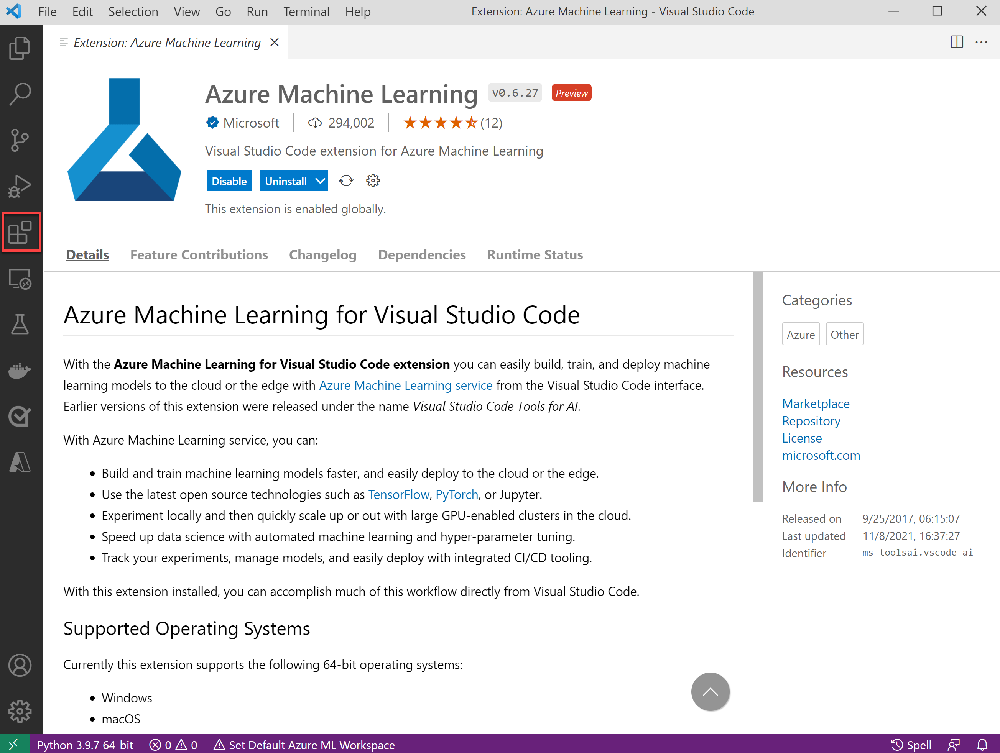
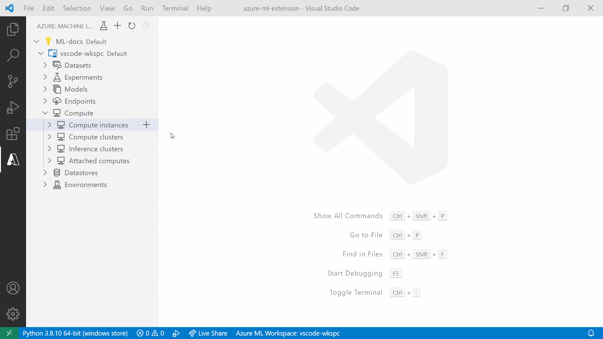
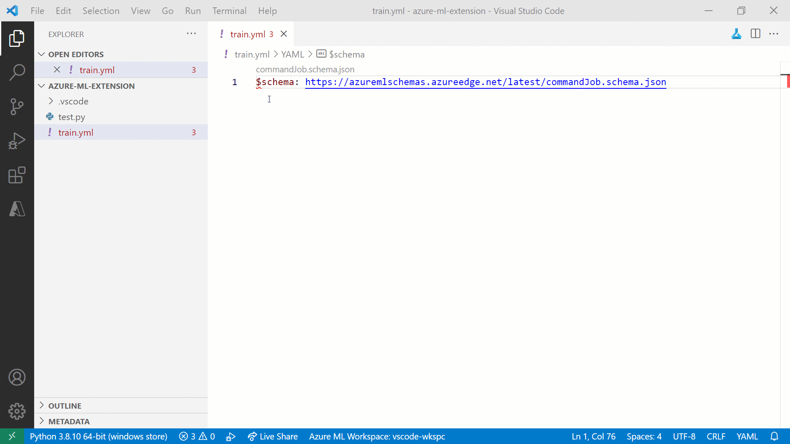
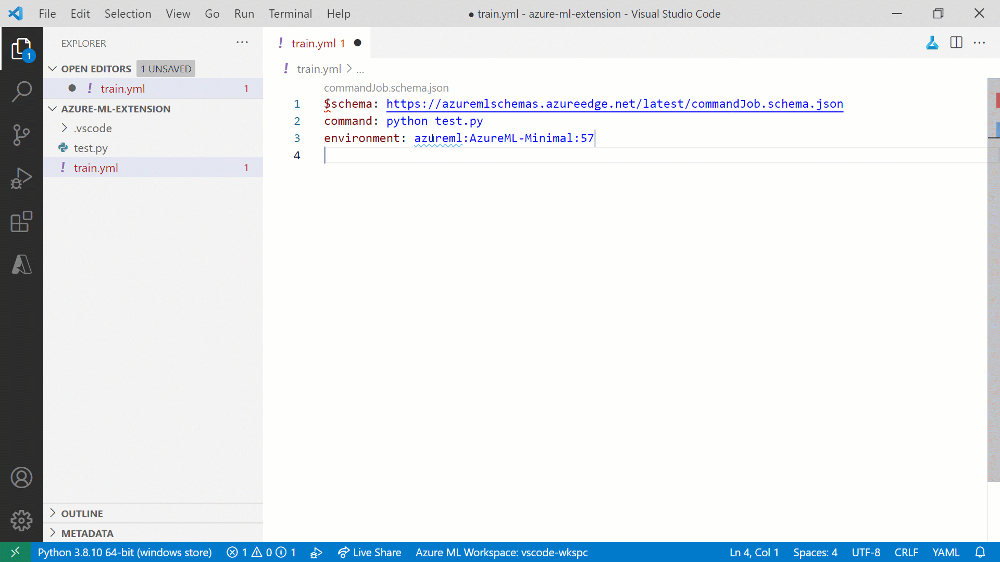

+++
title = "Azure Machine Learning"
date = 2024-01-12T22:36:24+08:00
weight = 50
type = "docs"
description = ""
isCJKLanguage = true
draft = false
+++

> 原文: [https://code.visualstudio.com/docs/datascience/azure-machine-learning](https://code.visualstudio.com/docs/datascience/azure-machine-learning)

# Azure Machine Learning in VS Code VS Code 中的 Azure 机器学习

Azure Machine Learning is a cloud-based environment you can use to train, deploy, automate, manage, and track machine learning models. For more information on Azure Machine Learning, see [What is Azure Machine Learning?](https://learn.microsoft.com/azure/machine-learning/overview-what-is-azure-machine-learning)

​​	Azure Machine Learning 是一个基于云的环境，可用于训练、部署、自动化、管理和跟踪机器学习模型。有关 Azure Machine Learning 的详细信息，请参阅什么是 Azure Machine Learning？

The [Azure Machine Learning](https://marketplace.visualstudio.com/items?itemName=ms-toolsai.vscode-ai) VS Code extension lets you use the features you're used to in Visual Studio Code for developing your machine learning applications.

​​	Azure Machine Learning VS Code 扩展使您能够在 Visual Studio Code 中使用您习惯的功能来开发机器学习应用程序。

## [Desktop or web 桌面或网络](https://code.visualstudio.com/docs/datascience/azure-machine-learning#_desktop-or-web)

You can use Azure Machine Learning in VS Code Desktop or [VS Code for the Web](https://code.visualstudio.com/docs/editor/vscode-web). VS Code for the Web provides a free, zero-install VS Code experience running entirely in your browser at [https://vscode.dev](https://vscode.dev/). Check out the [guide on launching Azure Machine Learning](https://learn.microsoft.com/azure/machine-learning/how-to-launch-vs-code-remote?view=azureml-api-2&tabs=vscode-web) to learn more.

​​	您可以在 VS Code 桌面或 VS Code for the Web 中使用 Azure Machine Learning。VS Code for the Web 提供免费的零安装 VS Code 体验，完全在您的浏览器中运行，网址为 https://vscode.dev。查看有关启动 Azure Machine Learning 的指南以了解更多信息。

## [Connect to remote compute instances 连接到远程计算实例](https://code.visualstudio.com/docs/datascience/azure-machine-learning#_connect-to-remote-compute-instances)

[Compute instances](https://learn.microsoft.com/azure/machine-learning/concept-compute-instance) are a managed cloud-based workstation for developing machine learning applications.

​​	计算实例是用于开发机器学习应用程序的托管云端工作站。

The Azure Machine Learning VS Code extension makes it easy to connect to and access resources in compute instances in real time. For more information, see [connect to an Azure Machine Learning compute instance](https://learn.microsoft.com/azure/machine-learning/how-to-set-up-vs-code-remote?tabs=extension).

​​	Azure Machine Learning VS Code 扩展使您可以轻松连接到计算实例中的资源并实时访问这些资源。有关详细信息，请参阅连接到 Azure Machine Learning 计算实例。

## [Azure Machine Learning 2.0 CLI support (preview) Azure Machine Learning 2.0 CLI 支持（预览版）](https://code.visualstudio.com/docs/datascience/azure-machine-learning#_azure-machine-learning-20-cli-support-preview)

The Azure Machine Learning 2.0 CLI enables you to train and deploy models from the command line. Its features accelerate scaling data science up and out while tracking the model lifecycle.

​​	Azure Machine Learning 2.0 CLI 使您能够从命令行训练和部署模型。其功能可加速扩展数据科学并跟踪模型生命周期。

When working with Azure Machine Learning specification files, the VS Code extension provides support for the following features:

​​	在使用 Azure Machine Learning 规范文件时，VS Code 扩展支持以下功能：

- Specification file authoring
  规范文件创作
- Language support
  语言支持
- Resource autocompletion
  资源自动完成

### [Specification file authoring 规范文件创作](https://code.visualstudio.com/docs/datascience/azure-machine-learning#_specification-file-authoring)

Use the **Azure ML** command in the Command Palette (Ctrl+Shift+P) or the Azure Machine Learning View in VS Code to simplify the specification file authoring process.

​​	在 VS Code 中使用“命令面板”(Ctrl+Shift+P) 或“Azure Machine Learning”视图中的 Azure ML 命令，以简化规范文件创作过程。

### [Language support 语言支持](https://code.visualstudio.com/docs/datascience/azure-machine-learning#_language-support)

The Azure Machine Learning extension cross-references all values with resources in your default workspace. If the extension detects an incorrectly specified resource or missing property, an inline error is displayed.

​​	Azure Machine Learning 扩展会将所有值与默认工作区中的资源进行交叉引用。如果扩展检测到错误指定的资源或缺少的属性，则会显示内联错误。

### [Resource autocompletion 资源自动完成](https://code.visualstudio.com/docs/datascience/azure-machine-learning#_resource-autocompletion)

As you begin working with resources, you'll find that the Azure Machine Learning extension can inspect the specification files. The extension uses the default workspace you've specified to provide autocompletion support for resources in that workspace.

​​	随着您开始使用资源，您会发现 Azure 机器学习扩展可以检查规范文件。该扩展使用您指定的默认工作区，以便为该工作区中的资源提供自动完成支持。

## [Train machine learning models 训练机器学习模型](https://code.visualstudio.com/docs/datascience/azure-machine-learning#_train-machine-learning-models)

In Azure Machine Learning, you can use popular frameworks for training machine learning models such as scikit-learn, PyTorch, TensorFlow, and many more. The extension makes it easy to submit and track the lifecycle of those models.

​​	在 Azure 机器学习中，您可以使用流行的框架来训练机器学习模型，例如 scikit-learn、PyTorch、TensorFlow 等。该扩展可以轻松提交和跟踪这些模型的生命周期。

For more information, see the [train a machine learning model tutorial](https://learn.microsoft.com/azure/machine-learning/tutorial-train-deploy-image-classification-model-vscode).

​​	有关详细信息，请参阅训练机器学习模型教程。

## [Manage resources 管理资源](https://code.visualstudio.com/docs/datascience/azure-machine-learning#_manage-resources)

You can create and manage Azure Machine Learning resources directly from VS Code. For more information, see [how to manage resources in VS Code](https://learn.microsoft.com/azure/machine-learning/how-to-manage-resources-vscode).

​​	您可以直接从 VS Code 创建和管理 Azure 机器学习资源。有关详细信息，请参阅如何在 VS Code 中管理资源。

## [Remote Jupyter servers 远程 Jupyter 服务器](https://code.visualstudio.com/docs/datascience/azure-machine-learning#_remote-jupyter-servers)

VS Code offers great support for development using Jupyter notebooks. For more information, see [Jupyter Notebooks in VS Code](https://code.visualstudio.com/docs/datascience/jupyter-notebooks).

​​	VS Code 为使用 Jupyter 笔记本进行开发提供了极好的支持。有关详细信息，请参阅 VS Code 中的 Jupyter 笔记本。

The Azure Machine Learning leverages the strong Jupyter notebooks support in VS Code. It makes connecting to a remote compute instance and using them as remote Jupyter servers seamless. For more information, see [Configure a compute instance as a remote notebook server](https://learn.microsoft.com/azure/machine-learning/how-to-set-up-vs-code-remote?tabs=extension).

​​	Azure 机器学习利用了 VS Code 中强大的 Jupyter 笔记本支持。它可以无缝连接到远程计算实例并将其用作远程 Jupyter 服务器。有关详细信息，请参阅将计算实例配置为远程笔记本服务器。

## [Git integration Git 集成](https://code.visualstudio.com/docs/datascience/azure-machine-learning#_git-integration)

By using the Azure Machine Learning VS Code extension to connect to a remote compute instance, you'll be able to use VS Code's built-in Git support.

​​	通过使用 Azure Machine Learning VS Code 扩展连接到远程计算实例，您将能够使用 VS Code 的内置 Git 支持。

## [Next steps 后续步骤](https://code.visualstudio.com/docs/datascience/azure-machine-learning#_next-steps)

- [Set up the Azure Machine Learning extension
  设置 Azure Machine Learning 扩展](https://learn.microsoft.com/azure/machine-learning/how-to-setup-vs-code)
- [Interact with Azure Machine Learning (in the desktop or web)
  与 Azure Machine Learning 交互（在桌面或 Web 中）](https://learn.microsoft.com/azure/machine-learning/how-to-launch-vs-code-remote?view=azureml-api-2&tabs=vscode-web)
