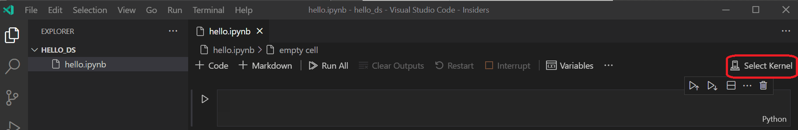
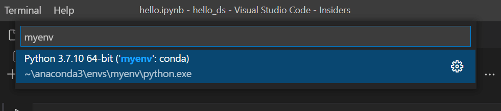
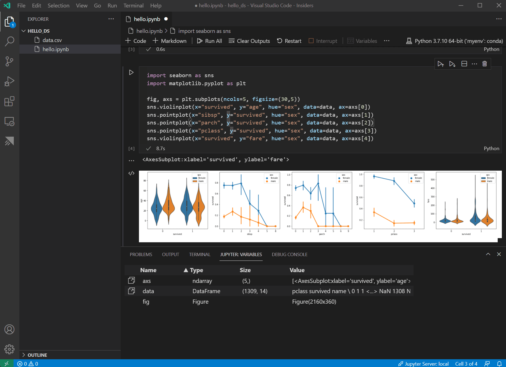
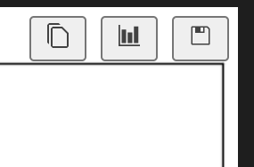
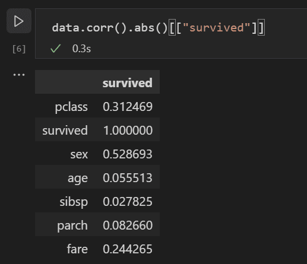
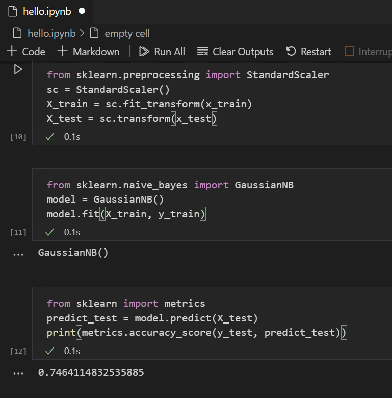
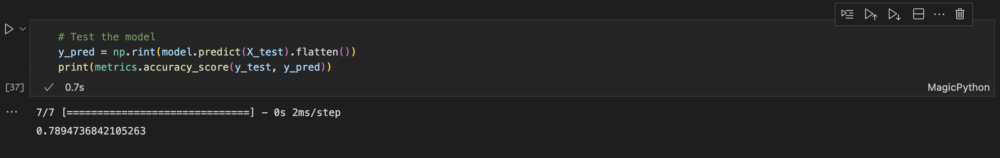

+++
title = "Data Science Tutorial"
date = 2024-01-12T22:36:24+08:00
weight = 20
type = "docs"
description = ""
isCJKLanguage = true
draft = false
+++

> 原文: [https://code.visualstudio.com/docs/datascience/data-science-tutorial](https://code.visualstudio.com/docs/datascience/data-science-tutorial)

# Data Science in VS Code tutorial VS Code 教程中的数据科学


This tutorial demonstrates using Visual Studio Code and the Microsoft Python extension with common data science libraries to explore a basic data science scenario. Specifically, using passenger data from the Titanic, you will learn how to set up a data science environment, import and clean data, create a machine learning model for predicting survival on the Titanic, and evaluate the accuracy of the generated model.

​​	本教程演示如何使用 Visual Studio Code 和 Microsoft Python 扩展以及常见数据科学库来探索基本数据科学场景。具体来说，使用泰坦尼克号的乘客数据，您将学习如何设置数据科学环境、导入和清理数据、创建机器学习模型来预测泰坦尼克号上的生存情况，以及评估生成模型的准确性。

## [Prerequisites 先决条件](https://code.visualstudio.com/docs/datascience/data-science-tutorial#_prerequisites)

The following installations are required for the completion of this tutorial. Make sure to install them if you haven't already.

​​	完成本教程需要以下安装。如果您尚未安装，请务必安装它们。

- [Visual Studio Code](https://code.visualstudio.com/)

- The [Python extension for VS Code](https://marketplace.visualstudio.com/items?itemName=ms-python.python) and [Jupyter extension for VS Code](https://marketplace.visualstudio.com/items?itemName=ms-toolsai.jupyter) from the Visual Studio Marketplace. For more details on installing extensions, see [Extension Marketplace](https://code.visualstudio.com/docs/editor/extension-marketplace). Both extensions are published by Microsoft.

  ​​	Visual Studio Marketplace 中的 VS Code 的 Python 扩展和 VS Code 的 Jupyter 扩展。有关安装扩展的更多详细信息，请参阅扩展市场。这两个扩展均由 Microsoft 发布。

- [Miniconda with latest Python
  带有最新 Python 的 Miniconda](https://docs.conda.io/en/latest/miniconda.html)

  > **Note**: If you already have the full Anaconda distribution installed, you don't need to install Miniconda. Alternatively, if you'd prefer not to use Anaconda or Miniconda, you can create a Python virtual environment and install the packages needed for the tutorial using pip. If you go this route, you will need to install the following packages: pandas, jupyter, seaborn, scikit-learn, keras, and tensorflow.
  >
  > ​​	注意：如果您已经安装了完整的 Anaconda 发行版，则无需安装 Miniconda。或者，如果您不想使用 Anaconda 或 Miniconda，则可以创建一个 Python 虚拟环境，并使用 pip 安装本教程所需的软件包。如果您选择此途径，则需要安装以下软件包：pandas、jupyter、seaborn、scikit-learn、keras 和 tensorflow。

## [Set up a data science environment 设置数据科学环境](https://code.visualstudio.com/docs/datascience/data-science-tutorial#_set-up-a-data-science-environment)

Visual Studio Code and the Python extension provide a great editor for data science scenarios. With native support for Jupyter notebooks combined with Anaconda, it's easy to get started. In this section, you will create a workspace for the tutorial, create an Anaconda environment with the data science modules needed for the tutorial, and create a Jupyter notebook that you'll use for creating a machine learning model.

​​	Visual Studio Code 和 Python 扩展为数据科学场景提供了一个出色的编辑器。结合 Anaconda，对 Jupyter 笔记本提供本机支持，因此很容易上手。在本部分中，您将为本教程创建一个工作区，创建一个包含本教程所需数据科学模块的 Anaconda 环境，并创建一个 Jupyter 笔记本，用于创建机器学习模型。

1. Begin by creating an Anaconda environment for the data science tutorial. Open an Anaconda command prompt and run `conda create -n myenv python=3.10 pandas jupyter seaborn scikit-learn keras tensorflow` to create an environment named **myenv**. For additional information about creating and managing Anaconda environments, see the [Anaconda documentation](https://docs.conda.io/projects/conda/en/latest/user-guide/tasks/manage-environments.html).

   ​​	首先，为数据科学教程创建一个 Anaconda 环境。打开 Anaconda 命令提示符并运行 `conda create -n myenv python=3.10 pandas jupyter seaborn scikit-learn keras tensorflow` 以创建一个名为 myenv 的环境。有关创建和管理 Anaconda 环境的其他信息，请参阅 Anaconda 文档。

2. Next, create a folder in a convenient location to serve as your VS Code workspace for the tutorial, name it `hello_ds`.

   ​​	接下来，在方便的位置创建一个文件夹，作为教程的 VS Code 工作区，将其命名为 `hello_ds` 。

3. Open the project folder in VS Code by running VS Code and using the **File** > **Open Folder** command. You can safely trust opening the folder, since you created it.

   ​​	通过运行 VS Code 并使用“文件”>“打开文件夹”命令，在 VS Code 中打开项目文件夹。您可以安全地信任打开该文件夹，因为您创建了它。

4. Once VS Code launches, create the Jupyter notebook that will be used for the tutorial. Open the Command Palette (Ctrl+Shift+P) and select **Create: New Jupyter Notebook**.

   ​​	VS Code 启动后，创建将用于本教程的 Jupyter 笔记本。打开命令面板 (Ctrl+Shift+P)，然后选择“创建：新建 Jupyter 笔记本”。

   

   > **Note**: Alternatively, from the VS Code File Explorer, you can use the New File icon to create a Notebook file named `hello.ipynb`.
   >
   > ​​	注意：或者，您可以从 VS Code 文件资源管理器中使用“新建文件”图标来创建名为 `hello.ipynb` 的笔记本文件。

5. Save the file as `hello.ipynb` using **File** > **Save As...**.

   ​​	使用“文件”>“另存为...”将文件另存为 `hello.ipynb` 。

6. After your file is created, you should see the open [Jupyter notebook](https://jupyter.org/) in the notebook editor. For additional information about native Jupyter notebook support, you can read the [Jupyter Notebooks](https://code.visualstudio.com/docs/datascience/jupyter-notebooks) topic.

   ​​	创建文件后，您应该在笔记本编辑器中看到打开的 Jupyter 笔记本。有关本机 Jupyter 笔记本支持的更多信息，您可以阅读 Jupyter 笔记本主题。

   

7. Now select **Select Kernel** at the top right of the notebook.

   ​​	现在，选择笔记本右上角的“选择内核”。

   

8. Choose the Python environment you created above in which to run your kernel.

   ​​	选择您在上面创建的用于运行内核的 Python 环境。

   

9. To manage your environment from VS Code's integrated terminal, open it up with (Ctrl+`). If your environment is not activated, you can do so as you would in your terminal (`conda activate myenv`).

   ​​	要从 VS Code 的集成终端管理您的环境，请使用 (Ctrl+`) 打开它。如果您的环境未激活，您可以像在终端中一样激活它 ( `conda activate myenv` )。

## [Prepare the data 准备数据](https://code.visualstudio.com/docs/datascience/data-science-tutorial#_prepare-the-data)

This tutorial uses the [Titanic dataset](https://hbiostat.org/data/repo/titanic.html) available on [OpenML.org](https://www.openml.org/d/40945), which is obtained from Vanderbilt University's Department of Biostatistics at https://hbiostat.org/data. The Titanic data provides information about the survival of passengers on the Titanic and characteristics about the passengers such as age and ticket class. Using this data, the tutorial will establish a model for predicting whether a given passenger would have survived the sinking of the Titanic. This section shows how to load and manipulate data in your Jupyter notebook.

​​	本教程使用 OpenML.org 上提供的泰坦尼克号数据集，该数据集来自范德堡大学的生物统计学系，网址为 https://hbiostat.org/data。泰坦尼克号数据提供了有关泰坦尼克号乘客生存情况的信息以及乘客的特征，例如年龄和船票等级。利用这些数据，本教程将建立一个模型来预测给定乘客是否能在泰坦尼克号沉没中幸存。本节说明如何在 Jupyter 笔记本中加载和处理数据。

1. To begin, download the Titanic data from [hbiostat.org](https://hbiostat.org/data/repo/titanic3.csv) as a CSV file (download links in the upper right) named `titanic3.csv` and save it to the `hello_ds` folder that you created in the previous section.

   ​​	首先，从 hbiostat.org 下载泰坦尼克号数据，保存为名为 `titanic3.csv` 的 CSV 文件（右上角的下载链接），并将其保存到上一节中创建的 `hello_ds` 文件夹中。

2. If you haven't already opened the file in VS Code, open the `hello_ds` folder and the Jupyter notebook (`hello.ipynb`), by going to **File** > **Open Folder**.

   ​​	如果您尚未在 VS Code 中打开该文件，请通过转到文件 > 打开文件夹来打开 `hello_ds` 文件夹和 Jupyter 笔记本 ( `hello.ipynb` )。

3. Within your Jupyter notebook, begin by importing the [pandas](https://pandas.pydata.org/) and [numpy](https://numpy.org/) libraries, two common libraries used for manipulating data, and loading the Titanic data into a pandas [DataFrame](https://pandas.pydata.org/pandas-docs/stable/reference/api/pandas.DataFrame.html). To do so, copy the code below into the first cell of the notebook. For more guidance about working with Jupyter notebooks in VS Code, see the [Working with Jupyter Notebooks](https://code.visualstudio.com/docs/datascience/jupyter-notebooks) documentation.

   ​​	在 Jupyter 笔记本中，首先导入 pandas 和 numpy 库，这两个库通常用于处理数据，并将泰坦尼克号数据加载到 pandas DataFrame 中。为此，将以下代码复制到笔记本的第一个单元格中。有关在 VS Code 中使用 Jupyter 笔记本的更多指导，请参阅使用 Jupyter 笔记本文档。

   ```
   import pandas as pd
   import numpy as np
   data = pd.read_csv('titanic3.csv')
   ```

4. Now, run the cell using the Run cell icon or the Shift+Enter shortcut.

   ​​	现在，使用“运行单元格”图标或 Shift+Enter 快捷方式运行单元格。

   

5. After the cell finishes running, you can view the data that was loaded using the Variables Explorer and Data Viewer. First select the **Variables** icon in the notebook's upper toolbar.

   ​​	单元格运行完毕后，可以使用变量资源管理器和数据查看器查看已加载的数据。首先选择笔记本上部工具栏中的“变量”图标。

   

6. A **JUPYTER: VARIABLES** pane will open at the bottom of VS Code. It contains a list of the variables defined so far in your running kernel.

   ​​	JUPYTER: VARIABLES 窗格将在 VS Code 底部打开。其中包含在正在运行的内核中到目前为止定义的变量列表。

   

7. To view the data in the Pandas DataFrame previously loaded, select the Data Viewer icon to the left of the `data` variable.

   ​​	若要查看先前加载的 Pandas DataFrame 中的数据，请选择 `data` 变量左侧的数据查看器图标。

   

8. Use the Data Viewer to view, sort, and filter the rows of data. After reviewing the data, it can then be helpful to graph some aspects of it to help visualize the relationships between the different variables.

   ​​	使用数据查看器查看、排序和筛选数据行。查看数据后，绘制某些方面的数据以帮助可视化不同变量之间的关系可能会有所帮助。

   

9. Before the data can be graphed, you need to make sure that there aren't any issues with it. If you look at the Titanic csv file, one thing you'll notice is that a question mark ("?") was used to identify cells where data wasn't available.

   ​​	在对数据进行绘图之前，您需要确保其中没有任何问题。如果您查看 Titanic csv 文件，您会注意到的一件事是，问号 (“?”) 用于标识数据不可用的单元格。

   While Pandas can read this value into a DataFrame, the result for a column like **age** is that its data type will be set to **object** instead of a numeric data type, which is problematic for graphing.

   ​​	虽然 Pandas 可以将此值读入 DataFrame，但对于像年龄这样的列，其数据类型将被设置为对象而不是数字数据类型，这对于绘图来说是有问题的。

   This problem can be corrected by replacing the question mark with a missing value that pandas is able to understand. Add the following code to the next cell in your notebook to replace the question marks in the **age** and **fare** columns with the [numpy NaN](https://docs.scipy.org/doc/numpy/reference/constants.html?highlight=nan#numpy.nan) value. Notice that we also need to update the column's data type after replacing the values.

   ​​	可以通过将问号替换为 pandas 能够理解的缺失值来纠正此问题。将以下代码添加到笔记本中的下一个单元格，以将年龄和票价列中的问号替换为 numpy NaN 值。请注意，在替换值后，我们还需要更新列的数据类型。

   > **Tip**: To add a new cell you can use the insert cell icon that's in the bottom left corner of an existing cell. Alternatively, you can also use the Esc to enter command mode, followed by the B key.
   >
   > ​​	提示：要添加新单元格，可以使用现有单元格左下角的插入单元格图标。或者，您还可以使用 Esc 进入命令模式，然后按 B 键。

   ```
   data.replace('?', np.nan, inplace= True)
   data = data.astype({"age": np.float64, "fare": np.float64})
   ```

   > **Note**: If you ever need to see the data type that has been used for a column, you can use the [DataFrame dtypes](https://pandas.pydata.org/pandas-docs/stable/reference/api/pandas.DataFrame.dtypes.html#pandas.DataFrame.dtypes) attribute.
   >
   > ​​	注意：如果您需要查看已用于列的数据类型，可以使用 DataFrame dtypes 属性。

10. Now that the data is in good shape, you can use [seaborn](https://seaborn.pydata.org/) and [matplotlib](https://matplotlib.org/) to view how certain columns of the dataset relate to survivability. Add the following code to the next cell in your notebook and run it to see the generated plots.

    ​​	现在数据已经整理好，您可以使用 seaborn 和 matplotlib 查看数据集的某些列与生存率的关系。将以下代码添加到笔记本中的下一个单元格并运行它以查看生成的绘图。

    ```
    import seaborn as sns
    import matplotlib.pyplot as plt
    
    fig, axs = plt.subplots(ncols=5, figsize=(30,5))
    sns.violinplot(x="survived", y="age", hue="sex", data=data, ax=axs[0])
    sns.pointplot(x="sibsp", y="survived", hue="sex", data=data, ax=axs[1])
    sns.pointplot(x="parch", y="survived", hue="sex", data=data, ax=axs[2])
    sns.pointplot(x="pclass", y="survived", hue="sex", data=data, ax=axs[3])
    sns.violinplot(x="survived", y="fare", hue="sex", data=data, ax=axs[4])
    ```

    

    > **Tip**: To quickly copy your graph, you can hover over the upper right corner of your graph and click on the **Copy to Clipboard** button that appears. You can also better view details of your graph by clicking the **Expand image** button.
    >
    > ​​	提示：要快速复制图形，您可以将鼠标悬停在图形的右上角，然后单击出现的“复制到剪贴板”按钮。您还可以通过单击“展开图像”按钮更好地查看图形的详细信息。

    

11. These graphs are helpful in seeing some of the relationships between survival and the input variables of the data, but it's also possible to use **pandas** to calculate correlations. To do so, all the variables used need to be numeric for the correlation calculation and currently gender is stored as a string. To convert those string values to integers, add and run the following code.

    ​​	这些图形有助于了解生存与数据输入变量之间的一些关系，但也可以使用 pandas 计算相关性。为此，所有用于相关性计算的变量都需要是数字，而性别目前存储为字符串。要将这些字符串值转换为整数，请添加并运行以下代码。

    ```
    data.replace({'male': 1, 'female': 0}, inplace=True)
    ```

12. Now, you can analyze the correlation between all the input variables to identify the features that would be the best inputs to a machine learning model. The closer a value is to 1, the higher the correlation between the value and the result. Use the following code to correlate the relationship between all variables and survival.

    ​​	现在，您可以分析所有输入变量之间的相关性，以识别最适合机器学习模型的输入特征。值越接近 1，值与结果之间的相关性就越高。使用以下代码关联所有变量与生存之间的关系。

    ```
    data.corr(numeric_only=True).abs()[["survived"]]
    ```

    

13. Looking at the correlation results, you'll notice that some variables like gender have a fairly high correlation to survival, while others like relatives (sibsp = siblings or spouse, parch = parents or children) seem to have little correlation.

    ​​	查看相关性结果，您会注意到一些变量（如性别）与生存率具有相当高的相关性，而另一些变量（如亲属关系（sibsp = 兄弟姐妹或配偶，parch = 父母或子女））似乎几乎没有相关性。

    Let's hypothesize that **sibsp** and **parch** are related in how they affect survivability, and group them into a new column called "relatives" to see whether the combination of them has a higher correlation to survivability. To do this, you will check if for a given passenger, the number of **sibsp** and **parch** is greater than 0 and, if so, you can then say that they had a relative on board.

    ​​	让我们假设 sibsp 和 parch 在影响生存能力方面相关，并将它们组合到一个名为“亲属关系”的新列中，以查看它们的组合是否与生存能力具有更高的相关性。为此，您将检查对于给定的乘客，sibsp 和 parch 的数量是否大于 0，如果是，那么您可以说他们在船上有亲属。

    Use the following code to create a new variable and column in the dataset called `relatives` and check the correlation again.

    ​​	使用以下代码在名为 `relatives` 的数据集中创建一个新变量和列，并再次检查相关性。

    ```
    data['relatives'] = data.apply (lambda row: int((row['sibsp'] + row['parch']) > 0), axis=1)
    data.corr(numeric_only=True).abs()[["survived"]]
    ```

    

14. You'll notice that in fact when looked at from the standpoint of whether a person had relatives, versus how many relatives, there is a higher correlation with survival. With this information in hand, you can now drop from the dataset the low value **sibsp** and **parch** columns, as well as any rows that had **NaN** values, to end up with a dataset that can be used for training a model.

    ​​	您会注意到，事实上，从一个人是否有亲属的角度来看，而不是有多少亲属，与生存率的相关性更高。有了这些信息，您现在可以从数据集中删除值较低的 sibsp 和 parch 列，以及任何具有 NaN 值的行，最终得到一个可用于训练模型的数据集。

    ```
    data = data[['sex', 'pclass','age','relatives','fare','survived']].dropna()
    ```

    > **Note**: Although age had a low direct correlation, it was kept because it seems reasonable that it might still have correlation in conjunction with other inputs.
    >
    > ​​	注意：虽然年龄具有较低的直接相关性，但保留它是因为它似乎可能与其他输入结合使用时仍具有相关性。

## [Train and evaluate a model 训练并评估模型](https://code.visualstudio.com/docs/datascience/data-science-tutorial#_train-and-evaluate-a-model)

With the dataset ready, you can now begin creating a model. For this section, you'll use the [scikit-learn](https://scikit-learn.org/stable/) library (as it offers some useful helper functions) to do pre-processing of the dataset, train a classification model to determine survivability on the Titanic, and then use that model with test data to determine its accuracy.

​​	数据集准备就绪后，您现在可以开始创建模型。对于本部分，您将使用 scikit-learn 库（因为它提供了一些有用的帮助器函数）来对数据集进行预处理，训练一个分类模型来确定泰坦尼克号上的生存能力，然后使用该模型和测试数据来确定其准确性。

1. A common first step to training a model is to divide up the dataset into training and validation data. This allows you to use a portion of the data to train the model and a portion of the data to test the model. If you used all your data to train the model, you wouldn't have a way to estimate how well it would actually perform against data the model hasn't yet seen. A benefit of the scikit-learn library is that it provides a method specifically for splitting a dataset into training and test data.

   ​​	训练模型的常见第一步是将数据集划分为训练数据和验证数据。这允许您使用一部分数据来训练模型，并使用一部分数据来测试模型。如果您使用所有数据来训练模型，那么您将无法估计它对模型尚未看到的数据的实际执行情况。scikit-learn 库的一个好处是它提供了一种专门用于将数据集拆分为训练数据和测试数据的方法。

   Add and run a cell with the following code to the notebook to split up the data.

   ​​	将包含以下代码的单元格添加到笔记本中并运行，以拆分数据。

   ```
   from sklearn.model_selection import train_test_split
   x_train, x_test, y_train, y_test = train_test_split(data[['sex','pclass','age','relatives','fare']], data.survived, test_size=0.2, random_state=0)
   ```

2. Next, you'll normalize the inputs such that all features are treated equally. For example, within the dataset the values for age range from ~0-100, while gender is only a 1 or 0. By normalizing all the variables, you can ensure that the ranges of values are all the same. Use the following code in a new code cell to scale the input values.

   ​​	接下来，您将对输入进行标准化，以便对所有特征进行同等处理。例如，在数据集中，年龄范围的值约为 0-100，而性别仅为 1 或 0。通过对所有变量进行标准化，您可以确保值范围都相同。在新的代码单元格中使用以下代码缩放输入值。

   ```
   from sklearn.preprocessing import StandardScaler
   sc = StandardScaler()
   X_train = sc.fit_transform(x_train)
   X_test = sc.transform(x_test)
   ```

3. There are many different machine learning algorithms that you could choose from to model the data. The scikit-learn library also provides support for many of [them](https://scikit-learn.org/stable/user_guide.html) and a [chart](https://scikit-learn.org/stable/tutorial/machine_learning_map/index.html) to help select the one that's right for your scenario. For now, use the [Naïve Bayes algorithm](https://scikit-learn.org/stable/modules/naive_bayes.html), a common algorithm for classification problems. Add a cell with the following code to create and train the algorithm.

   ​​	您可以选择许多不同的机器学习算法来对数据建模。scikit-learn 库还为其中许多算法提供了支持，并提供了一个图表来帮助您选择适合您方案的算法。现在，请使用朴素贝叶斯算法，这是一种常见的分类问题算法。添加一个单元格，其中包含以下代码以创建和训练算法。

   ```
   from sklearn.naive_bayes import GaussianNB
   model = GaussianNB()
   model.fit(X_train, y_train)
   ```

4. With a trained model, you can now try it against the test data set that was held back from training. Add and run the following code to predict the outcome of the test data and calculate the accuracy of the model.

   ​​	使用训练好的模型，您现在可以针对从训练中保留的测试数据集对其进行尝试。添加并运行以下代码以预测测试数据的结果并计算模型的准确性。

   ```
   from sklearn import metrics
   predict_test = model.predict(X_test)
   print(metrics.accuracy_score(y_test, predict_test))
   ```

   

   Looking at the result of the test data, you'll see that the trained algorithm had a ~75% success rate at estimating survival.

   ​​	查看测试数据的结果，您会看到训练好的算法在估计生存率方面的成功率约为 75%。

## [(Optional) Use a neural network （可选）使用神经网络](https://code.visualstudio.com/docs/datascience/data-science-tutorial#_optional-use-a-neural-network)

A neural network is a model that uses weights and activation functions, modeling aspects of human neurons, to determine an outcome based on provided inputs. Unlike the machine learning algorithm you looked at previously, neural networks are a form of deep learning wherein you don't need to know an ideal algorithm for your problem set ahead of time. It can be used for many different scenarios and classification is one of them. For this section, you'll use the [Keras](https://keras.io/) library with [TensorFlow](https://www.tensorflow.org/) to construct the neural network, and explore how it handles the Titanic dataset.

​​	神经网络是一种使用权重和激活函数的模型，模拟人类神经元，以根据提供的输入确定结果。与您之前看到的机器学习算法不同，神经网络是一种深度学习形式，您无需提前知道问题集的理想算法。它可以用于许多不同的场景，分类就是其中之一。在本节中，您将使用带有 TensorFlow 的 Keras 库构建神经网络，并探索它如何处理泰坦尼克号数据集。

1. The first step is to import the required libraries and to create the model. In this case, you'll use a [Sequential](https://keras.io/getting-started/sequential-model-guide/) neural network, which is a layered neural network wherein there are multiple layers that feed into each other in sequence.

   ​​	第一步是导入所需的库并创建模型。在这种情况下，您将使用顺序神经网络，它是一种分层神经网络，其中有多个层按顺序相互馈送。

   ```
   from keras.models import Sequential
   from keras.layers import Dense
   
   model = Sequential()
   ```

2. After defining the model, the next step is to add the layers of the neural network. For now, let's keep things simple and just use three layers. Add the following code to create the layers of the neural network.

   ​​	定义模型后，下一步是添加神经网络的层。现在，让我们保持简单，只使用三层。添加以下代码以创建神经网络的层。

   ```
   model.add(Dense(5, kernel_initializer = 'uniform', activation = 'relu', input_dim = 5))
   model.add(Dense(5, kernel_initializer = 'uniform', activation = 'relu'))
   model.add(Dense(1, kernel_initializer = 'uniform', activation = 'sigmoid'))
   ```

   - The first layer will be set to have a dimension of 5, since you have five inputs: sex, pclass, age, relatives, and fare.
     第一层将设置为具有 5 个维度，因为您有五个输入：性别、舱位等级、年龄、亲属和票价。
   - The last layer must output 1, since you want a 1-dimensional output indicating whether a passenger would survive.
     最后一层必须输出 1，因为您想要一个一维输出，指示乘客是否会存活。
   - The middle layer was kept at 5 for simplicity, although that value could have been different.
     为了简单起见，中间层保持为 5，尽管该值可能不同。

   The rectified linear unit (relu) activation function is used as a good general activation function for the first two layers, while the sigmoid activation function is required for the final layer as the output you want (of whether a passenger survives or not) needs to be scaled in the range of 0-1 (the probability of a passenger surviving).

   ​​	整流线性单元 (relu) 激活函数用作前两层的良好通用激活函数，而 sigmoid 激活函数是最后一层所必需的，因为您想要的输出（乘客是否存活）需要按 0-1 的范围进行缩放（乘客存活的概率）。

   You can also look at the summary of the model you built with this line of code:

   ​​	您还可以查看使用此代码行构建的模型的摘要：

   ```
   model.summary()
   ```

   

3. Once the model is created, it needs to be compiled. As part of this, you need to define what type of optimizer will be used, how loss will be calculated, and what metric should be optimized for. Add the following code to build and train the model. You'll notice that after training, the accuracy is ~61%.

   ​​	创建模型后，需要对其进行编译。在此过程中，您需要定义将使用哪种优化器、如何计算损失以及应该针对哪个指标进行优化。添加以下代码以构建和训练模型。您会注意到，在训练后，准确率约为 61%。

   > **Note**: This step may take anywhere from a few seconds to a few minutes to run depending on your machine.
   >
   > ​​	注意：此步骤可能需要几秒到几分钟才能运行，具体取决于您的机器。

   ```
   model.compile(optimizer="adam", loss='binary_crossentropy', metrics=['accuracy'])
   model.fit(X_train, y_train, batch_size=32, epochs=50)
   ```

   

4. Now that the model is built and trained, we can see how it works against the test data.

   ​​	现在模型已构建并训练完毕，我们可以看看它对测试数据的表现如何。

   ```
   y_pred = np.rint(model.predict(X_test).flatten())
   print(metrics.accuracy_score(y_test, y_pred))
   ```

   

   Similar to the training, you'll notice that you now have 79% accuracy in predicting survival of passengers. Using this simple neural network, the result is better than the 75% accuracy from the Naive Bayes Classifier tried previously.

   ​​	与训练类似，您会注意到您现在在预测乘客生存率方面具有 79% 的准确率。使用这个简单的神经网络，结果比之前尝试的朴素贝叶斯分类器的 75% 准确率更好。

## [Next steps 后续步骤](https://code.visualstudio.com/docs/datascience/data-science-tutorial#_next-steps)

Now that you're familiar with the basics of performing machine learning within Visual Studio Code, here are some other Microsoft resources and tutorials to check out.

​​	现在您已经熟悉了在 Visual Studio Code 中执行机器学习的基础知识，这里有一些其他 Microsoft 资源和教程供您查看。

- [Data Science profile template](https://code.visualstudio.com/docs/editor/profiles#_data-science-profile-template) - Create a new [profile](https://code.visualstudio.com/docs/editor/profiles) with a curated set of extensions, settings, and snippets.
  数据科学配置文件模板 - 使用精选的扩展、设置和代码段创建新配置文件。
- Learn more about working with [Jupyter Notebooks in Visual Studio Code](https://youtu.be/FSdIoJdSnig) (video).
  详细了解在 Visual Studio Code 中使用 Jupyter Notebooks（视频）。
- [Get started with Azure Machine Learning for VS Code](https://learn.microsoft.com/azure/machine-learning/how-to-setup-vs-code) to deploy and optimize your model using the power of Azure.
  开始使用 Azure Machine Learning for VS Code，利用 Azure 的强大功能部署和优化您的模型。
- Find more data to explore on [Azure Open Data Sets](https://azure.microsoft.com/services/open-datasets/).
  在 Azure 开放数据集上查找更多要探索的数据。
