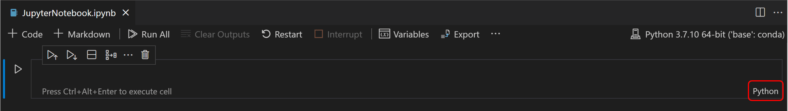

+++
title = "Jupyter Notebooks"
date = 2024-01-12T22:36:24+08:00
weight = 10
type = "docs"
description = ""
isCJKLanguage = true
draft = false
+++

> 原文: [https://code.visualstudio.com/docs/datascience/jupyter-notebooks](https://code.visualstudio.com/docs/datascience/jupyter-notebooks)

# Jupyter Notebooks in VS Code VS Code 中的 Jupyter Notebooks


[Jupyter](https://jupyter-notebook.readthedocs.io/en/latest/) (formerly IPython Notebook) is an open-source project that lets you easily combine Markdown text and executable Python source code on one canvas called a **notebook**. Visual Studio Code supports working with Jupyter Notebooks natively, and through [Python code files](https://code.visualstudio.com/docs/python/jupyter-support-py). This topic covers the native support available for Jupyter Notebooks and demonstrates how to:

​​	Jupyter（以前称为 IPython Notebook）是一个开源项目，它允许您轻松地在一个称为笔记本的画布上组合 Markdown 文本和可执行 Python 源代码。Visual Studio Code 原生地支持使用 Jupyter Notebooks 和通过 Python 代码文件进行工作。本主题介绍了 Jupyter Notebooks 可用的原生支持，并演示了如何：

- Create, open, and save Jupyter Notebooks
  创建、打开和保存 Jupyter Notebooks
- Work with Jupyter code cells
  使用 Jupyter 代码单元格
- View, inspect, and filter variables using the Variable Explorer and Data Viewer
  使用变量资源管理器和数据查看器查看、检查和筛选变量
- Connect to a remote Jupyter server
  连接到远程 Jupyter 服务器
- Debug a Jupyter Notebook
  调试 Jupyter Notebook

## [Setting up your environment 设置您的环境](https://code.visualstudio.com/docs/datascience/jupyter-notebooks#_setting-up-your-environment)

To work with Python in Jupyter Notebooks, you must activate an Anaconda environment in VS Code, or another Python environment in which you've installed the [Jupyter package](https://pypi.org/project/jupyter/). To select an environment, use the **Python: Select Interpreter** command from the Command Palette (Ctrl+Shift+P).

​​	要在 Jupyter Notebooks 中使用 Python，您必须在 VS Code 中激活一个 Anaconda 环境，或激活您已安装 Jupyter 包的另一个 Python 环境。若要选择一个环境，请使用命令面板（Ctrl+Shift+P）中的 Python: 选择解释器命令。

Once the appropriate environment is activated, you can create and open a Jupyter Notebook, connect to a remote Jupyter server for running code cells, and export a Jupyter Notebook as a Python file.

​​	一旦激活了适当的环境，您就可以创建和打开 Jupyter Notebook，连接到远程 Jupyter 服务器以运行代码单元格，并将 Jupyter Notebook 导出为 Python 文件。

## [Workspace Trust 工作区信任](https://code.visualstudio.com/docs/datascience/jupyter-notebooks#_workspace-trust)

When getting started with Jupyter Notebooks, you'll want to make sure that you are working in a trusted workspace. Harmful code can be embedded in notebooks and the [Workspace Trust](https://code.visualstudio.com/docs/editor/workspace-trust) feature allows you to indicate which folders and their contents should allow or restrict automatic code execution.

​​	在开始使用 Jupyter Notebooks 时，您需要确保您在受信任的工作区中工作。有害代码可以嵌入到笔记本中，而工作区信任功能允许您指示哪些文件夹及其内容应该允许或限制自动代码执行。

If you attempt to open a notebook when VS Code is in an untrusted workspace running [Restricted Mode](https://code.visualstudio.com/docs/editor/workspace-trust#_restricted-mode), you will not be able to execute cells and rich outputs will be hidden.

​​	如果您尝试在 VS Code 处于运行受限模式的非受信任工作区中打开笔记本，您将无法执行单元格，并且富输出将被隐藏。

## [Create or open a Jupyter Notebook 创建或打开 Jupyter Notebook](https://code.visualstudio.com/docs/datascience/jupyter-notebooks#_create-or-open-a-jupyter-notebook)

You can create a Jupyter Notebook by running the **Create: New Jupyter Notebook** command from the Command Palette (Ctrl+Shift+P) or by creating a new `.ipynb` file in your workspace.

​​	您可以通过从命令面板 (Ctrl+Shift+P) 运行创建：新建 Jupyter Notebook 命令或在工作区中创建新的 `.ipynb` 文件来创建 Jupyter Notebook。


Next, select a kernel using the kernel picker in the top right.

​​	接下来，使用右上角的内核选择器选择内核。


After selecting a kernel, the language picker located in the bottom right of each code cell will automatically update to the language supported by the kernel.

​​	选择内核后，每个代码单元格右下角的语言选择器将自动更新为内核支持的语言。



If you have an existing Jupyter Notebook, you can open it by right-clicking on the file and opening with VS Code, or through the VS Code File Explorer.

​​	如果您有现有的 Jupyter Notebook，您可以通过右键单击该文件并使用 VS Code 打开，或通过 VS Code 文件资源管理器来打开它。

## [Running cells 运行单元格](https://code.visualstudio.com/docs/datascience/jupyter-notebooks#_running-cells)

Once you have a notebook, you can run a code cell using the **Run** icon to the left of the cell and the output will appear directly below the code cell.

​​	一旦您拥有一个笔记本，您可以使用单元格左侧的运行图标运行一个代码单元格，输出将直接显示在代码单元格下方。

To run code, you can also use keyboard shortcuts in both command and edit mode. To run the current cell, use Ctrl+Enter. To run the current cell and advance to the next, use Shift+Enter.

​​	要运行代码，您还可以在命令和编辑模式下使用键盘快捷键。要运行当前单元格，请使用 Ctrl+Enter。要运行当前单元格并进入下一个单元格，请使用 Shift+Enter。


You can run multiple cells by selecting **Run All**, **Run All Above**, or **Run All Below**.

​​	您可以通过选择“全部运行”、“全部运行以上”或“全部运行以下”来运行多个单元格。


## [Save your Jupyter Notebook 保存您的 Jupyter 笔记本](https://code.visualstudio.com/docs/datascience/jupyter-notebooks#_save-your-jupyter-notebook)

You can save your Jupyter Notebook using the keyboard shortcut Ctrl+S or **File** > **Save**.

​​	您可以使用键盘快捷键 Ctrl+S 或“文件”>“保存”来保存您的 Jupyter 笔记本。

## [Export your Jupyter Notebook 导出您的 Jupyter 笔记本](https://code.visualstudio.com/docs/datascience/jupyter-notebooks#_export-your-jupyter-notebook)

You can export a Jupyter Notebook as a Python file (`.py`), a PDF, or an HTML file. To export, select the **Export** action on the main toolbar. You'll then be presented with a dropdown of file format options.

​​	您可以将 Jupyter 笔记本导出为 Python 文件 ( `.py` )、PDF 或 HTML 文件。要导出，请在主工具栏上选择“导出”操作。然后，系统会向您显示一个文件格式选项的下拉列表。


> **Note:** For PDF export, you must have [TeX installed](https://nbconvert.readthedocs.io/en/latest/install.html#installing-tex). If you don't, you will be notified that you need to install it when you select the PDF option. Also, be aware that if you have SVG-only output in your Notebook, they will not be displayed in the PDF. To have SVG graphics in a PDF, either ensure that your output includes a non-SVG image format or else you can first export to HTML and then save as PDF using your browser.
>
> ​​	注意：对于 PDF 导出，您必须安装 TeX。如果您没有安装，当您选择 PDF 选项时，系统会通知您需要安装它。此外，请注意，如果您在笔记本中只有 SVG 输出，它们将不会显示在 PDF 中。要在 PDF 中显示 SVG 图形，请确保您的输出包含非 SVG 图像格式，或者您可以先导出为 HTML，然后使用浏览器另存为 PDF。

## [Work with code cells in the Notebook Editor 在 Notebook 编辑器中使用代码单元格](https://code.visualstudio.com/docs/datascience/jupyter-notebooks#_work-with-code-cells-in-the-notebook-editor)

The Notebook Editor makes it easy to create, edit, and run code cells within your Jupyter Notebook.

​​	Notebook 编辑器可以轻松地在 Jupyter Notebook 中创建、编辑和运行代码单元格。

### [Create a code cell 创建代码单元格](https://code.visualstudio.com/docs/datascience/jupyter-notebooks#_create-a-code-cell)

By default, a blank notebook will have an empty code cell for you to start with and an existing notebook will place one at the bottom. Add your code to the empty code cell to get started.

​​	默认情况下，空白笔记本将为您提供一个空白代码单元格以供您开始，现有笔记本将在底部放置一个代码单元格。将您的代码添加到空白代码单元格中以开始。

```
msg = "Hello world"
print(msg)
```


### [Code cell modes 代码单元格模式](https://code.visualstudio.com/docs/datascience/jupyter-notebooks#_code-cell-modes)

While working with code cells, a cell can be in three states: unselected, command mode, and edit mode. A vertical bar to the left of a code cell and editor border shows the current state of a cell. When no bar is visible, the cell is unselected. When a cell is selected, it can be in command mode or in edit mode.

​​	在使用代码单元格时，单元格可以处于三种状态：未选择、命令模式和编辑模式。代码单元格左侧的垂直栏和编辑器边框显示单元格的当前状态。当没有可见的栏时，单元格未被选中。当选择单元格时，它可以处于命令模式或编辑模式。


In command mode, a solid vertical bar will appear to the left of the cell. The cell can be operated on and accepts keyboard commands.

​​	在命令模式下，单元格左侧将出现一个实心垂直栏。可以对单元格进行操作并接受键盘命令。


In edit mode, a solid vertical bar is joined by a border around the cell editor. The cell's contents (code or Markdown) can be modified.

​​	在编辑模式下，单元格编辑器周围的边框会与实心垂直栏连接。可以修改单元格的内容（代码或 Markdown）。


To switch modes, you can use your keyboard or mouse. On your keyboard, press the Enter key to move to edit mode or the Esc key to move to command mode. With your mouse, click the vertical bar to the left of the cell or out of the code/Markdown region in the code cell.

​​	要切换模式，可以使用键盘或鼠标。在键盘上，按 Enter 键切换到编辑模式，或按 Esc 键切换到命令模式。使用鼠标，单击单元格左侧的竖线或代码单元格中代码/Markdown 区域之外的位置。

### [Add additional code cells 添加其他代码单元格](https://code.visualstudio.com/docs/datascience/jupyter-notebooks#_add-additional-code-cells)

You can add code cells using the main toolbar, a cell's add cell toolbar (visible with hover), and through keyboard commands.

​​	可以使用主工具栏、单元格的添加单元格工具栏（悬停时可见）和键盘命令添加代码单元格。


To add a new cell below the currently selected cell, use the plus icon in the main toolbar or a cell's hover toolbar.

​​	要在当前选定单元格下方添加新单元格，请使用主工具栏中的加号图标或单元格的悬停工具栏。

When a code cell is in command mode, use the A key to add a cell above and the B key to add a cell below the selected cell.

​​	当代码单元格处于命令模式时，使用 A 键在选定单元格上方添加单元格，使用 B 键在选定单元格下方添加单元格。

### [Select a code cell 选择代码单元格](https://code.visualstudio.com/docs/datascience/jupyter-notebooks#_select-a-code-cell)

You can change a selected code cell using the mouse or the up/down arrow keys on the keyboard. When a code cell is in command mode, you can also use the J key (down) and K key (up).

​​	可以使用鼠标或键盘上的向上/向下箭头键更改选定的代码单元格。当代码单元格处于命令模式时，还可以使用 J 键（向下）和 K 键（向上）。

### [Select multiple code cells 选择多个代码单元格](https://code.visualstudio.com/docs/datascience/jupyter-notebooks#_select-multiple-code-cells)

To select multiple cells, start with one cell in selected mode. A filled background indicates selected cells. To select consecutive cells, hold down the Shift key and click the last cell you want to select. To select any group of cells, hold down the Ctrl key and click the cells you'd like to add to your selection.

​​	要选择多个单元格，请从一个处于选中模式的单元格开始。填充的背景表示选中的单元格。要选择连续的单元格，请按住 Shift 键并单击要选择的最后一个单元格。要选择任意一组单元格，请按住 Ctrl 键并单击要添加到选择内容的单元格。


### [Run a single code cell 运行单个代码单元格](https://code.visualstudio.com/docs/datascience/jupyter-notebooks#_run-a-single-code-cell)

Once your code is added, you can run a cell using the **Run** icon to the left of the cell and the output will be displayed below the code cell.

​​	添加代码后，您可以使用单元格左侧的运行图标运行单元格，输出将显示在代码单元格下方。


To run a selected code cell, you can also use keyboard shortcuts in both command and edit mode. Ctrl+Enter runs the currently selected cell. Shift+Enter runs the currently selected cell and inserts a new cell immediately below (focus moves to new cell). Alt+Enter runs the currently selected cell and inserts a new cell immediately below (focus remains on current cell).

​​	要运行选定的代码单元格，您还可以在命令和编辑模式下使用键盘快捷键。Ctrl+Enter 运行当前选定的单元格。Shift+Enter 运行当前选定的单元格并在其正下方插入一个新单元格（焦点移至新单元格）。Alt+Enter 运行当前选定的单元格并在其正下方插入一个新单元格（焦点停留在当前单元格）。

### [Run multiple code cells 运行多个代码单元格](https://code.visualstudio.com/docs/datascience/jupyter-notebooks#_run-multiple-code-cells)

Running multiple code cells can be accomplished in many ways. You can use the double arrow in the main toolbar of the Notebook Editor to run all cells within the Notebook or the **Run** icons with directional arrows in the cell toolbar to run all cells above or below the current code cell.

​​	可以通过多种方式运行多个代码单元格。您可以使用笔记本编辑器主工具栏中的双箭头运行笔记本中的所有单元格，或使用单元格工具栏中带方向箭头的运行图标运行当前代码单元格上方或下方的所有单元格。


### [Move a code cell 移动代码单元格](https://code.visualstudio.com/docs/datascience/jupyter-notebooks#_move-a-code-cell)

You can move cells up or down within a notebook via dragging and dropping. For code cells, the drag and drop area is to the left of the cell editor as indicated below. For rendered Markdown cells, you may click anywhere to drag and drop cells.

​​	您可以通过拖放来在笔记本中向上或向下移动单元格。对于代码单元格，拖放区域位于单元格编辑器的左侧，如下所示。对于呈现的 Markdown 单元格，您可以单击任意位置来拖放单元格。


To move multiple cells, you can use the same drag and drop areas in any cell included in the selection.

​​	要移动多个单元格，您可以在所选内容中的任何单元格中使用相同的拖放区域。

The keyboard shortcut Alt+Arrow also moves one or multiple selected cells.

​​	键盘快捷键 Alt+箭头键也会移动一个或多个选定的单元格。

### [Delete a code cell 删除代码单元格](https://code.visualstudio.com/docs/datascience/jupyter-notebooks#_delete-a-code-cell)

To delete code, you can use the **Delete** icon in the code cell toolbar. When the selected code cell is in command mode, you can use the keyboard shortcut dd.

​​	要删除代码，您可以在代码单元格工具栏中使用“删除”图标。当选定的代码单元格处于命令模式时，您可以使用键盘快捷键 dd。


### [Undo your last change 撤消上一次更改](https://code.visualstudio.com/docs/datascience/jupyter-notebooks#_undo-your-last-change)

You can use the z key to undo your previous change, for example, if you've made an accidental edit, you can undo it to the previous correct state, or if you've deleted a cell accidentally, you can recover it.

​​	您可以使用 z 键撤消上一次更改，例如，如果您进行了意外编辑，您可以将其撤消到上一个正确状态，或者如果您意外删除了单元格，您可以恢复它。

### [Switch between code and Markdown 在代码和 Markdown 之间切换](https://code.visualstudio.com/docs/datascience/jupyter-notebooks#_switch-between-code-and-markdown)

The Notebook Editor allows you to easily change code cells between Markdown and code. Selecting the language picker in the bottom right of a cell will allow you to switch between Markdown and, if applicable, any other language supported by the selected kernel.

​​	笔记本编辑器允许您轻松地在 Markdown 和代码之间更改代码单元格。选择单元格右下角的语言选择器，您可以在 Markdown 和（如果适用）所选内核支持的任何其他语言之间切换。


You can also use the keyboard to change the cell type. When a cell is selected and in command mode, the M key switches the cell type to Markdown and the Y key switches the cell type to code.

​​	您还可以使用键盘来更改单元格类型。当单元格被选中且处于命令模式时，M 键将单元格类型切换为 Markdown，Y 键将单元格类型切换为代码。

Once Markdown is set, you can enter Markdown formatted content to the code cell.

​​	一旦设置了 Markdown，您就可以在代码单元格中输入 Markdown 格式的内容。


To render Markdown cells, you can select the check mark in the cell toolbar, or use the keyboard shortcuts Ctrl+Enter and Shift+Enter.

​​	要渲染 Markdown 单元格，您可以选择单元格工具栏中的复选标记，或使用键盘快捷键 Ctrl+Enter 和 Shift+Enter。


### [Clear output or restart/interrupt the kernel 清除输出或重新启动/中断内核](https://code.visualstudio.com/docs/datascience/jupyter-notebooks#_clear-output-or-restartinterrupt-the-kernel)

If you'd like to clear all code cell outputs or restart/interrupt the kernel, you can accomplish that using the main Notebook Editor toolbar.

​​	如果您想清除所有代码单元格输出或重新启动/中断内核，可以使用主笔记本编辑器工具栏来完成。


### [Enable/disable line numbers 启用/禁用行号](https://code.visualstudio.com/docs/datascience/jupyter-notebooks#_enabledisable-line-numbers)

When you are in command mode, you can enable or disable line numbering within a single code cell by using the L key.

​​	当您处于命令模式时，可以使用 L 键在单个代码单元格内启用或禁用行号。


To toggle line numbering for the entire notebook, use Shift+L when in command mode on any cell.

​​	要在整个笔记本中切换行号，请在任何单元格上处于命令模式时使用 Shift+L。


## [Table of Contents 目录](https://code.visualstudio.com/docs/datascience/jupyter-notebooks#_table-of-contents)

To navigate through your notebook, open the File Explorer in the Activity bar. Then open the **Outline** tab in the Side bar.

​​	要浏览您的笔记本，请在活动栏中打开文件资源管理器。然后在侧边栏中打开大纲选项卡。


> **Note:** By default, the outline will only show Markdown. To show code cells, enable the following setting: **Notebook > Outline: Show Code Cells**.
>
> ​​	注意：默认情况下，大纲只会显示 Markdown。若要显示代码单元格，请启用以下设置：笔记本 > 大纲：显示代码单元格。

## [IntelliSense support in the Jupyter Notebook Editor Jupyter Notebook 编辑器中的 IntelliSense 支持](https://code.visualstudio.com/docs/datascience/jupyter-notebooks#_intellisense-support-in-the-jupyter-notebook-editor)

The Python Jupyter Notebook Editor window has full IntelliSense – code completions, member lists, quick info for methods, and parameter hints. You can be just as productive typing in the Notebook Editor window as you are in the code editor.

​​	Python Jupyter Notebook 编辑器窗口具有完整的 IntelliSense - 代码补全、成员列表、方法的快速信息和参数提示。您在 Notebook 编辑器窗口中的键入效率与在代码编辑器中一样高。


## [Variable Explorer and Data Viewer 变量资源管理器和数据查看器](https://code.visualstudio.com/docs/datascience/jupyter-notebooks#_variable-explorer-and-data-viewer)

Within a Python Notebook, it's possible to view, inspect, sort, and filter the variables within your current Jupyter session. By selecting the **Variables** icon in the main toolbar after running code and cells, you'll see a list of the current variables, which will automatically update as variables are used in code. The variables pane will open at the bottom of the notebook.

​​	在 Python Notebook 中，可以查看、检查、排序和筛选当前 Jupyter 会话中的变量。在运行代码和单元格后，通过选择主工具栏中的“变量”图标，您将看到当前变量的列表，该列表会随着代码中使用变量而自动更新。变量窗格将在笔记本的底部打开。


### [Data Viewer 数据查看器](https://code.visualstudio.com/docs/datascience/jupyter-notebooks#_data-viewer)

For additional information about your variables, you can also double-click a row or use the **Show variable in data viewer** button next to the variable for a more detailed view of a variable in the Data Viewer.

​​	有关变量的其他信息，您还可以双击一行或使用变量旁边的“在数据查看器中显示变量”按钮，以在数据查看器中更详细地查看变量。


### [Filtering rows 过滤行](https://code.visualstudio.com/docs/datascience/jupyter-notebooks#_filtering-rows)

Filtering rows in the data viewer can be done by typing in the textbox at the top of each column. Type a string you want to search for and any row that has that string in the column will be found:

​​	可以通过在每列顶部文本框中输入内容来过滤数据查看器中的行。输入要搜索的字符串，将找到列中包含该字符串的任何行：


If you want to find an exact match, prefix your filter with '=':

​​	如果要查找完全匹配，请在过滤器前加上“=”：


More complex filtering can be done by typing a [regular expression](https://developer.mozilla.org/en-US/docs/Web/JavaScript/Guide/Regular_Expressions):

​​	可以通过输入正则表达式来进行更复杂的过滤：


## [Saving plots 保存绘图](https://code.visualstudio.com/docs/datascience/jupyter-notebooks#_saving-plots)

To save a plot from your notebook, simply hover over the output and select the **Save** icon in the top right.

​​	要从笔记本中保存绘图，只需将鼠标悬停在输出上，然后选择右上角的“保存”图标。


> **Note:** There is support for rendering plots created with [matplotlib](https://matplotlib.org/) and [Altair](https://altair-viz.github.io/index.html).
>
> ​​	注意：支持使用 matplotlib 和 Altair 创建的绘图的渲染。

## [Custom notebook diffing 自定义笔记本差异](https://code.visualstudio.com/docs/datascience/jupyter-notebooks#_custom-notebook-diffing)

Under the hood, Jupyter Notebooks are JSON files. The segments in a JSON file are rendered as cells that are comprised of three components: input, output, and metadata. Comparing changes made in a notebook using lined-based diffing is difficult and hard to parse. The rich diffing editor for notebooks allows you to easily see changes for each component of a cell.

​​	从本质上讲，Jupyter 笔记本是 JSON 文件。JSON 文件中的段被渲染为由输入、输出和元数据三个组件组成的单元格。使用基于行的差异比较笔记本中所做的更改很困难且难以解析。笔记本的丰富差异编辑器允许您轻松查看单元格每个组件的更改。

You can even customize what types of changes you want displayed within your diffing view. In the top right, select the overflow menu item in the toolbar to customize what cell components you want included. Input differences will always be shown.

​​	您甚至可以自定义差异视图中要显示的更改类型。在右上角，选择工具栏中的溢出菜单项，以自定义要包含的单元格组件。始终会显示输入差异。


To learn more about Git integration within VS Code, visit [Source Control in VS Code](https://code.visualstudio.com/docs/sourcecontrol/overview).

​​	若要详细了解 VS Code 中的 Git 集成，请访问 VS Code 中的源代码管理。

## [Debug a Jupyter Notebook 调试 Jupyter Notebook](https://code.visualstudio.com/docs/datascience/jupyter-notebooks#_debug-a-jupyter-notebook)

There are two different ways to debug a Jupyter notebook: a simpler mode called "Run by Line", and full debugging mode.

​​	有两种不同的方法可以调试 Jupyter Notebook：一种更简单的模式称为“按行运行”，另一种是完全调试模式。

> **Note:** Both of these features require ipykernel 6+. See [this wiki page](https://github.com/microsoft/vscode-jupyter/wiki/Setting-Up-Run-by-Line-and-Debugging-for-Notebooks) for details about installing or upgrading ipykernel.
>
> ​​	注意：这两个功能都需要 ipykernel 6+。请参阅此 wiki 页面了解有关安装或升级 ipykernel 的详细信息。

### [Run by Line 按行运行](https://code.visualstudio.com/docs/datascience/jupyter-notebooks#_run-by-line)

Run by Line lets you execute a cell one line at a time, without being distracted by other VS Code debug features. To start, select the **Run by Line** button in the cell toolbar:

​​	按行运行允许您一次执行一个单元格，而不会被其他 VS Code 调试功能分散注意力。要开始，请在单元格工具栏中选择“按行运行”按钮：


Use the same button to advance by one statement. You can select the cell **Stop** button to stop early, or the **Continue** button in the toolbar to continue running to the end of the cell.

​​	使用相同的按钮逐个语句前进。您可以选择单元格“停止”按钮提前停止，或选择工具栏中的“继续”按钮继续运行到单元格末尾。

### [Debug Cell 调试单元格](https://code.visualstudio.com/docs/datascience/jupyter-notebooks#_debug-cell)

If you want to use the full set of debugging features supported in VS Code, such as breakpoints and the ability to step in to other cells and modules, you can use the full VS Code debugger.

​​	如果您想使用 VS Code 中支持的全套调试功能，例如断点以及进入其他单元格和模块的能力，则可以使用完整的 VS Code 调试器。

1. Start by setting any breakpoints you need by clicking in the left margin of a notebook cell.
   首先，通过单击笔记本单元格的左边缘来设置所需的任何断点。
2. Then select the **Debug Cell** button in the menu next to the **Run** button. This will run the cell in a debug session, and will pause on your breakpoints in any code that runs, even if it is in a different cell or a `.py` file.
   然后选择“运行”按钮旁边的菜单中的“调试单元格”按钮。这将在调试会话中运行单元格，并将暂停在运行的任何代码中的断点上，即使它位于不同的单元格或 `.py` 文件中。
3. You can use the Debug view, Debug Console, and all the buttons in the Debug Toolbar as you normally would in VS Code.
   您可以像在 VS Code 中通常那样使用“调试”视图、“调试控制台”以及“调试工具栏”中的所有按钮。


### [Search through notebook 在笔记本中搜索](https://code.visualstudio.com/docs/datascience/jupyter-notebooks#_search-through-notebook)

You can search through a notebook (or parts of it by filtering the search options) by using the keyboard shortcut Ctrl/Cmd + F. Click the Filter option (funnel icon) to search across:

​​	您可以通过使用键盘快捷键 Ctrl/Cmd + F 来搜索笔记本（或通过筛选搜索选项来搜索笔记本的各个部分）。单击“筛选”选项（漏斗图标）以在以下位置进行搜索：

- Markdown cell input (**Markdown Source**)
  Markdown 单元格输入（Markdown 源）
- Markdown cell output (**Rendered Markdown**)
  Markdown 单元格输出（呈现的 Markdown）
- Code cell input (**Code Cell Source**)
  代码单元格输入（代码单元格源）
- Code cell output (**Cell Output**)
  代码单元格输出（单元格输出）

Notebook searches are filtered cell inputs only by default.

​​	默认情况下，笔记本搜索仅筛选单元格输入。


## [Connect to a remote Jupyter server 连接到远程 Jupyter 服务器](https://code.visualstudio.com/docs/datascience/jupyter-notebooks#_connect-to-a-remote-jupyter-server)

You can offload intensive computation in a Jupyter Notebook to other computers by connecting to a remote Jupyter server. Once connected, code cells run on the remote server rather than the local computer.

​​	您可以通过连接到远程 Jupyter 服务器，将 Jupyter Notebook 中的密集计算卸载到其他计算机。连接后，代码单元格将在远程服务器上运行，而不是在本地计算机上运行。

To connect to a remote Jupyter server:

​​	要连接到远程 Jupyter 服务器：

1. Open the Kernel Picker button on the top right-hand side of the notebook (or run the **Notebook: Select Notebook Kernel** command from the Command Palette).

   ​​	打开笔记本右上角的内核选择器按钮（或从命令面板运行笔记本：选择笔记本内核命令）。

   

2. Select the **Existing Jupyter Server** option to connect to an existing Jupyter server.

   ​​	选择现有 Jupyter 服务器选项以连接到现有 Jupyter 服务器。

   

3. To connect to an existing server for the first time, select **Enter the URL of the running Jupyter server**.

   ​​	要首次连接到现有服务器，请选择输入正在运行的 Jupyter 服务器的 URL。

   

4. When prompted to **Enter the URL of the running Jupyter server**, provide the server's URI (hostname) with the authentication token included with a `?token=` URL parameter. (If you start the server in the VS Code terminal with an authentication token enabled, the URL with the token typically appears in the terminal output from where you can copy it.) Alternatively, you can specify a username and password after providing the URI.

   ​​	当系统提示您输入正在运行的 Jupyter 服务器的 URL 时，请提供服务器的 URI（主机名），其中包含带有 `?token=` URL 参数的身份验证令牌。（如果您在启用了身份验证令牌的情况下在 VS Code 终端中启动服务器，则带有令牌的 URL 通常会显示在终端输出中，您可从中复制它。）或者，您可以在提供 URI 后指定用户名和密码。

   

> **Note:** For added security, Microsoft recommends configuring your Jupyter server with security precautions such as SSL and token support. This helps ensure that requests sent to the Jupyter server are authenticated and connections to the remote server are encrypted. For guidance about securing a notebook server, refer to the [Jupyter documentation](https://jupyter-notebook.readthedocs.io/en/stable/public_server.html#securing-a-notebook-server).
>
> ​​	注意：为了增加安全性，Microsoft 建议使用 SSL 和令牌支持等安全预防措施来配置 Jupyter 服务器。这有助于确保发送到 Jupyter 服务器的请求经过身份验证，并且与远程服务器的连接已加密。有关保护笔记本服务器安全的指导，请参阅 Jupyter 文档。

## [Data Science profile template 数据科学配置文件模板](https://code.visualstudio.com/docs/datascience/jupyter-notebooks#_data-science-profile-template)

[Profiles](https://code.visualstudio.com/docs/editor/profiles) let you quickly switch your extensions, settings, and UI layout depending on your current project or task. To help you get started with Jupyter Notebooks, you can use the [Data Science profile template](https://code.visualstudio.com/docs/editor/profiles#_data-science-profile-template), which is a curated profile with useful extensions, settings, and snippets. You can use a profile template as is or use it as a starting point to customize further for you own workflows.

​​	配置文件允许您根据当前项目或任务快速切换扩展、设置和 UI 布局。为了帮助您开始使用 Jupyter Notebooks，您可以使用 Data Science 配置文件模板，这是一个经过策划的配置文件，其中包含有用的扩展、设置和代码段。您可以按原样使用配置文件模板，也可以将其用作起点，以便进一步自定义以适应您自己的工作流。

You select a profile template through the **Profiles** > **Create Profile...** dropdown:

​​	您可以通过“配置文件”>“创建配置文件...”下拉列表选择配置文件模板：


Once you select a profile template, you can review the settings and extensions, and remove individual items if you don't want to include them in your new profile. After creating the new profile based on the template, changes made to settings, extensions, or UI are persisted in your profile.

​​	选择配置文件模板后，您可以查看设置和扩展，并删除不想包含在新配置文件中的各个项目。根据模板创建新配置文件后，对设置、扩展或 UI 所做的更改将保留在您的配置文件中。
