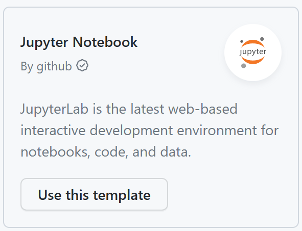
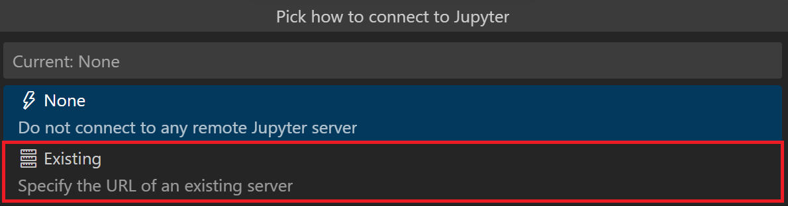
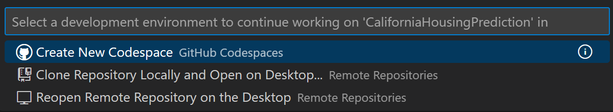
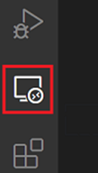

+++
title = "Jupyter Notebooks on the web"
date = 2024-01-12T22:36:24+08:00
weight = 70
type = "docs"
description = ""
isCJKLanguage = true
draft = false
+++

> 原文: [https://code.visualstudio.com/docs/datascience/notebooks-web](https://code.visualstudio.com/docs/datascience/notebooks-web)

# Jupyter Notebooks on the web Web 上的 Jupyter 笔记本

Visual Studio Code supports working with [Jupyter Notebooks](https://jupyter-notebook.readthedocs.io/en/latest/) on the desktop, and extends to various browser-based platforms like [GitHub Codespaces](https://github.com/features/codespaces) and [VS Code for the Web](https://code.visualstudio.com/docs/editor/vscode-web).

​​	Visual Studio Code 支持在桌面上使用 Jupyter Notebooks，并扩展到各种基于浏览器的平台，如 GitHub Codespaces 和 VS Code for the Web。

Using these browser-based platforms enables you to work on your notebooks (and beyond!) without having to install anything on your machine. You can read more about each of options and how to get started below:

​​	使用这些基于浏览器的平台，您无需在计算机上安装任何内容即可处理笔记本（以及其他内容！）。您可以在下面阅读有关每个选项的更多信息以及如何开始：

- [Jupyter notebooks on **GitHub Codespaces**
  GitHub Codespaces 上的 Jupyter 笔记本](https://code.visualstudio.com/docs/datascience/notebooks-web#_jupyter-notebooks-on-codespaces)
- [Remote tunneling with **VS Code Server** on VS Code for the Web
  VS Code for the Web 上的 VS Code Server 远程隧道](https://code.visualstudio.com/docs/datascience/notebooks-web#_remote-tunneling-with-vs-code-server)
- [Connect to a remote **Jupyter server** on VS Code for the Web
  在 VS Code for the Web 上连接到远程 Jupyter 服务器](https://code.visualstudio.com/docs/datascience/notebooks-web#_connect-to-a-remote-jupyter-server)

## [Jupyter notebooks on Codespaces Codespaces 上的 Jupyter 笔记本](https://code.visualstudio.com/docs/datascience/notebooks-web#_jupyter-notebooks-on-codespaces)

Developing Jupyter notebooks in VS Code can be done entirely through a web-based interface using [GitHub Codespaces](https://github.com/features/codespaces), a cloud-hosted development environment that is secure and configurable with free compute resources (more on Codespaces [monthly usage quotas](https://docs.github.com/billing/managing-billing-for-github-codespaces/about-billing-for-github-codespaces)). This means you can take advantage of all VS Code functionalities, including Jupyter notebooks support, without installing anything on your machine. To get started quickly:

​​	完全可以通过基于 Web 的界面在 VS Code 中开发 Jupyter 笔记本，方法是使用 GitHub Codespaces，这是一个云托管的开发环境，安全且可配置，并提供免费的计算资源（有关 Codespaces 每月使用配额的更多信息）。这意味着您可以利用所有 VS Code 功能，包括 Jupyter 笔记本支持，而无需在计算机上安装任何内容。快速入门：

1. Navigate to https://github.com/codespaces.

   ​​	导航到 https://github.com/codespaces。

2. Under **Explore quick start templates**, select **Use this template** for **Jupyter Notebook**. If you don't see the **Jupyter Notebook** template, select **See all** and search for the template.

   ​​	在“浏览快速入门模板”下，选择“对 Jupyter Notebook 使用此模板”。如果您看不到 Jupyter Notebook 模板，请选择“查看全部”并搜索该模板。

   

3. That's it! A codespace will be created for you to get started!

   ​​	就是这样！将为您创建一个代码空间以供您开始！

   > **Tip**: You can customize your project by committing [configuration files](https://docs.github.com/codespaces/setting-up-your-project-for-codespaces/introduction-to-dev-containers) to your repository (often known as Configuration-as-Code), which creates a repeatable codespace configuration for all users of your project. You can also see examples of predefined configurations on the [devcontainers/images repository](https://github.com/devcontainers/images/tree/main/src) to use and/or amend as needed for your project.
   >
   > ​​	提示：您可以通过将配置文件提交到您的存储库（通常称为“配置即代码”）来自定义您的项目，这会为您的项目的所有用户创建一个可重复的代码空间配置。您还可以在 devcontainers/images 存储库上查看预定义配置的示例，以便根据需要使用和/或修改您的项目。

## [Jupyter notebooks on VS Code for the Web 适用于 Web 的 VS Code 上的 Jupyter 笔记本](https://code.visualstudio.com/docs/datascience/notebooks-web#_jupyter-notebooks-on-vs-code-for-the-web)

You can also use [VS Code for the Web](https://code.visualstudio.com/docs/editor/vscode-web) by going to [https://vscode.dev](https://vscode.dev/) or [https://github.dev](https://github.dev/) (available by typing '.' when viewing a repo on GitHub). With VS Code for the Web, you have two options to connect to the following types of kernels for your notebook:

​​	您还可以通过访问 https://vscode.dev 或 https://github.dev（在 GitHub 上查看存储库时键入“.” 可用）来使用适用于 Web 的 VS Code。使用适用于 Web 的 VS Code，您可以选择两种方式来连接到笔记本的以下内核类型：

1. [Remote tunneling with VS Code Server
   使用 VS Code Server 进行远程隧道传输](https://code.visualstudio.com/docs/datascience/notebooks-web#_remote-tunneling-with-vs-code-server)
2. [Connect to a remote Jupyter server
   连接到远程 Jupyter 服务器](https://code.visualstudio.com/docs/datascience/notebooks-web#_connect-to-a-remote-jupyter-server)

## [Remote tunneling with VS Code Server 使用 VS Code Server 进行远程隧道传输](https://code.visualstudio.com/docs/datascience/notebooks-web#_remote-tunneling-with-vs-code-server)

You can securely connect to a remote machine without the requirement of SSH by installing the [VS Code Server](https://code.visualstudio.com/docs/remote/vscode-server) on your remote machine and accessing it through VS Code for the Web (you can also connect to the server on VS Code Desktop). To do so:

​​	通过在远程计算机上安装 VS Code Server 并通过 VS Code for the Web 访问它，您可以在无需 SSH 的情况下安全地连接到远程计算机（您还可以连接到 VS Code Desktop 上的服务器）。为此，请执行以下操作：

1. Install the `code` [CLI](https://code.visualstudio.com/download) on your remote machine.

   ​​	在远程计算机上安装 `code` CLI。

   > **Note**: You can skip this step if VS Code Desktop is already installed on the remote machine as the `code` CLI is built into VS Code Desktop.
   >
   > ​​	注意：如果已在远程计算机上安装 VS Code Desktop，则可以跳过此步骤，因为 `code` CLI 已内置于 VS Code Desktop 中。

2. Create a [secure tunnel](https://code.visualstudio.com/docs/remote/tunnels) with the tunnel command: `code tunnel` (you can also run `code-insiders tunnel` if you wish to use the [daily release](https://code.visualstudio.com/insiders) of VS Code) and follow the prompts to grant access to the server. This will download and start the VS Code Server on your remote machine and then create a tunnel to it.

   ​​	使用 tunnel 命令创建安全隧道： `code tunnel` （如果您希望使用 VS Code 的每日发布版本，也可以运行 `code-insiders tunnel` ），然后按照提示授予对服务器的访问权限。这将在您的远程计算机上下载并启动 VS Code Server，然后创建一条隧道以连接到它。

3. Use the CLI's output vscode.dev URL tied to this remote machine, such as

   ​​	使用 CLI 输出的与该远程计算机绑定的 vscode.dev URL，例如
   `https://vscode.dev/tunnel/<machine_name>/<folder_name>`
   for access to this remote machine on any client.

   ​​	，以便在任何客户端上访问此远程计算机。

4. Open a notebook file and select any Jupyter kernel or Python environment to run your code.

   ​​	打开一个笔记本文件并选择任何 Jupyter 内核或 Python 环境来运行您的代码。

## [Connect to a remote Jupyter server 连接到远程 Jupyter 服务器](https://code.visualstudio.com/docs/datascience/notebooks-web#_connect-to-a-remote-jupyter-server)

You can also connect to any remote Jupyter server by pasting the URL with the format:

​​	您还可以通过粘贴格式为以下内容的 URL 来连接到任何远程 Jupyter 服务器：
`http://<ip-address>:<port>/?token=<token>`.

To do so, select the **Jupyter: Specify Jupyter Server for Connections** command and then paste the URL for your remote Jupyter server.

​​	为此，请选择 Jupyter：指定用于连接的 Jupyter 服务器命令，然后粘贴远程 Jupyter 服务器的 URL。

To enter your remote Jupyter server URL with older versions of VS Code and Jupyter extension:

​​	要使用旧版本的 VS Code 和 Jupyter 扩展输入远程 Jupyter 服务器 URL：

1. Click **Jupyter Server:** on the Status bar.

   ​​	单击状态栏上的 Jupyter 服务器：。

   

2. Select **Existing**.

   ​​	选择现有。

   

When you're starting your remote server, be sure to:

​​	启动远程服务器时，请务必：

1. Allow all origins (for example `--NotebookApp.allow_origin='*'`) to allow your servers to be accessed externally.
   允许所有来源（例如 `--NotebookApp.allow_origin='*'` ）以允许外部访问您的服务器。
2. Set the notebook to listen on all IPs (`--NotebookApp.ip='0.0.0.0'`).
   将笔记本设置为侦听所有 IP（ `--NotebookApp.ip='0.0.0.0'` ）。

### [Limitations 局限性](https://code.visualstudio.com/docs/datascience/notebooks-web#_limitations)

Since VS Code for the Web runs entirely in your web browser, there are some limitations compared to the desktop and Codespaces experiences.

​​	由于 VS Code for the Web 完全在您的网络浏览器中运行，因此与桌面和 Codespaces 体验相比存在一些局限性。

- No access the VS Code terminal (though you can run [magic commands](https://ipython.readthedocs.io/en/stable/interactive/magics.html) from your notebook cells)
  无法访问 VS Code 终端（尽管您可以从笔记本单元格运行魔术命令）
- Limited debugging
  有限的调试
- Partial Python IntelliSense support
  部分 Python IntelliSense 支持
- No [isort](https://marketplace.visualstudio.com/items?itemName=ms-python.isort) extension support
  不支持 isort 扩展

## [Continue working on Codespaces 继续在 Codespaces 上工作](https://code.visualstudio.com/docs/datascience/notebooks-web#_continue-working-on-codespaces)

As with VS Code Desktop, you can easily continue your work from VS Code for the Web ([https://vscode.dev](https://vscode.dev/) or [https://github.dev](https://github.dev/)) on Codespaces. When you choose to **Continue Working On** in a new codespace, your uncommitted changes will travel with you. To do so:

​​	与 VS Code Desktop 一样，您可以在 Codespaces 上轻松地继续在 VS Code for the Web（https://vscode.dev 或 https://github.dev）中开展工作。当您选择在新的 Codespace 中继续工作时，未提交的更改将与您同行。为此，请执行以下操作：

1. Open the Command Palette (Ctrl+Shift+P) and select **Continue Working On...**.

   ​​	打开命令面板 (Ctrl+Shift+P)，然后选择继续处理....

2. Select **Create New Codespace**.

   ​​	选择创建新的 Codespace。

   

3. Follow the prompts to store your working changes in the cloud and to sign into Codespaces.

   ​​	按照提示将工作更改存储在云中并登录到 Codespaces。

4. Select the instance type for your codespace (number of cores, RAM, and storage).

   ​​	选择 Codespace 的实例类型（内核数、RAM 和存储）。

You can also manually commit your changes and create a codespace through the **Remote Explorer**:

​​	您还可以手动提交更改并通过远程资源管理器创建 Codespace：

1. Sign into Codespaces by opening the Command Palette (Ctrl+Shift+P) and selecting **Codespaces: Sign in**.

   ​​	通过打开命令面板 (Ctrl+Shift+P) 并选择 Codespaces：登录来登录到 Codespaces。

2. Navigate to the **Remote Explorer** view from the Activity bar.

   ​​	从活动栏导航到远程资源管理器视图。

   

From the **Remote Explorer** view, you can either connect to an existing codespace or create a new one. This will open up a new window for you to continue working on your project on Codespaces.

​​	在远程资源管理器视图中，您可以连接到现有 Codespace 或创建一个新的 Codespace。这将为您打开一个新窗口，以便您继续在 Codespaces 上处理项目。

## [Questions or feedback 问题或反馈](https://code.visualstudio.com/docs/datascience/notebooks-web#_questions-or-feedback)

You can add a [feature request](https://github.com/microsoft/vscode-jupyter/issues/new?assignees=&labels=feature-request&template=3_feature_request.md) or [report a problem](https://github.com/microsoft/vscode-jupyter/issues/new?assignees=&labels=bug&template=1_bug_report.md) by creating an issue in our repository, which is actively being monitored and managed by our engineering team.

​​	您可以通过在我们的存储库中创建问题来添加功能请求或报告问题，我们的工程团队会积极监控和管理该存储库。
