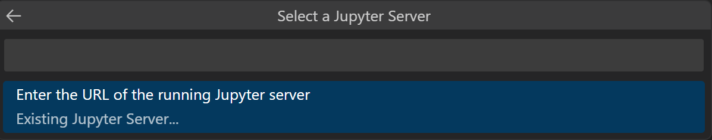

+++
title = "Manage Jupyter Kernels"
date = 2024-01-12T22:36:24+08:00
weight = 60
type = "docs"
description = ""
isCJKLanguage = true
draft = false
+++

> 原文: [https://code.visualstudio.com/docs/datascience/jupyter-kernel-management](https://code.visualstudio.com/docs/datascience/jupyter-kernel-management)

# Manage Jupyter Kernels in VS Code 在 VS Code 中管理 Jupyter 内核

The Visual Studio Code notebooks' kernel picker helps you to pick specific kernels for your notebooks. You can open the kernel picker by clicking on **Select Kernel** on the upper right-hand corner of your notebook or through the Command Palette with the **Notebook: Select Notebook Kernel** command.

​​	Visual Studio Code 笔记本的内核选择器可帮助您为笔记本选择特定的内核。您可以通过单击笔记本右上角的“选择内核”或通过使用“笔记本：选择笔记本内核”命令的命令面板来打开内核选择器。

Once you open the Kernel Picker, VS Code shows the most recently used (MRU) kernel(s):

​​	打开内核选择器后，VS Code 将显示最近使用 (MRU) 的内核：

> **Note**: In the previous versions of VS Code (version <1.76), VS Code used to show all available kernels by default.
>
> ​​	注意：在以前版本的 VS Code（版本 <1.76）中，VS Code 默认显示所有可用的内核。

To see other kernels, you can click **Select Another Kernel...**. All existing kernels are categorized into kernel source options, with these sources supported by the Jupyter extension out of the box:

​​	要查看其他内核，可以单击“选择其他内核...”。所有现有内核都归类为内核源选项，Jupyter 扩展开箱即用地支持这些源：

- [Jupyter Kernels
  Jupyter 内核]()
- [Python Environments
  Python 环境]()
- [Existing Jupyter Server
  现有 Jupyter 服务器]()

By default, VS Code will recommend the one you've previously used with your notebook, but you can choose to connect to any other Jupyter kernels as shown below. VS Code will also remember the last selected kernel for your notebooks, and will automatically select them the next time you open your notebook.

​​	默认情况下，VS Code 会推荐您之前在笔记本中使用过的内核，但您可以选择连接到任何其他 Jupyter 内核，如下所示。VS Code 还将记住您为笔记本选择的最后一个内核，并在您下次打开笔记本时自动选择该内核。

## [Jupyter Kernels Jupyter 内核]()

The **Jupyter Kernels** category lists all Jupyter kernels that VS Code detects in the context of the compute system it's operating in (your desktop, [GitHub Codespaces](https://github.com/features/codespaces), remote server, etc.). Each Jupyter kernel has a Jupyter [kernel specification](https://jupyter-client.readthedocs.io/en/stable/kernels.html#kernel-specs), or Jupyter kernelspec, which contains a JSON file (`kernel.json`) with details about the kernel—name, description, and CLI information required to launch a process as a kernel.

​​	Jupyter Kernels 类别列出 VS Code 在其运行的计算系统（您的桌面、GitHub Codespaces、远程服务器等）的上下文中检测到的所有 Jupyter 内核。每个 Jupyter 内核都有一个 Jupyter 内核规范，或 Jupyter kernelspec，其中包含一个 JSON 文件 ( `kernel.json` )，其中包含有关内核的详细信息，包括名称、说明和启动进程作为内核所需的 CLI 信息。

## [Python Environments Python 环境]()

The **Python Environments** category lists the Python environments that VS Code detects from the compute system it's operating in (your desktop, Codespaces, remote server, etc.). It shows all Python environments grouped by type (for example, conda, venv)—whether the [IPyKernel](https://ipython.readthedocs.io/en/stable/install/kernel_install.html) is installed or not.

​​	Python 环境类别列出 VS Code 从其运行的计算系统（您的桌面、Codespaces、远程服务器等）中检测到的 Python 环境。它按类型（例如，conda、venv）显示所有 Python 环境，无论是否安装了 IPyKernel。

> **Note**: You **do not** need to install [jupyter](https://pypi.org/project/jupyter/) into the Python environment you want to use. Only the IPyKernel package is required to launch a Python process as a kernel and execute code against your notebook (`pip install ipykernel`). Visit the [Jupyter extension wiki](https://github.com/microsoft/vscode-jupyter/wiki/Kernels-(Architecture)) to learn more.
>
> ​​	注意：您无需将 jupyter 安装到要使用的 Python 环境中。只需 IPyKernel 包即可启动 Python 进程作为内核，并针对您的笔记本执行代码 ( `pip install ipykernel` )。访问 Jupyter 扩展 wiki 以了解更多信息。

## [Existing Jupyter Server 现有 Jupyter 服务器]()

The **Existing Jupyter Server** category lists remote Jupyter servers previously connected. You can also use this option to connect to an existing Jupyter server running remotely or locally. Find the URL for your Jupyter server, for example, `http://<ip-address>:<port>/?token=<token>` and paste it in the **Enter the URL of the running Jupyter server** option to connect to the remote server and execute code against your notebook using that server.

​​	现有 Jupyter 服务器类别列出先前连接的远程 Jupyter 服务器。您还可以使用此选项连接到远程或本地运行的现有 Jupyter 服务器。找到 Jupyter 服务器的 URL，例如 `http://<ip-address>:<port>/?token=<token>` ，并将其粘贴到“输入正在运行的 Jupyter 服务器的 URL”选项中，以连接到远程服务器并使用该服务器对笔记本执行代码。

When you're starting your remote server, be sure to:

​​	启动远程服务器时，请务必：

1. Allow all origins (for example `--NotebookApp.allow_origin='*'`) to allow your servers to be accessed externally.
   允许所有来源（例如 `--NotebookApp.allow_origin='*'` ）以允许外部访问您的服务器。
2. Set the notebook to listen on all IPs (`--NotebookApp.ip='0.0.0.0'`).
   将笔记本设置为侦听所有 IP（ `--NotebookApp.ip='0.0.0.0'` ）。

Once connected, all active Jupyter sessions will appear on this list.

​​	连接后，所有活动的 Jupyter 会话都将出现在此列表中。

You can create a new session from the server's kernelspec by:

​​	您可以通过以下方式从服务器的 kernelspec 创建新会话：

1. Running the **Notebook: Select Notebook Kernel** command.
   运行笔记本：选择笔记本内核命令。
2. Choose **Select Another Kernel**.
   选择选择其他内核。
3. Choose **Existing Jupyter Server**.
   选择现有 Jupyter 服务器。
4. Select your server.
   选择您的服务器。

## [Codespaces Jupyter Server Codespaces Jupyter 服务器]()

The **Connect to Codespace** category contains a special type of Jupyter server where you can use remote Jupyter servers powered by [GitHub Codespaces](https://docs.github.com/codespaces/overview), a cloud resource that you get [up to 60 hours free](https://github.com/features/codespaces) each month. To use the Codespaces Jupyter server:

​​	“连接到 Codespace”类别包含一种特殊类型的 Jupyter 服务器，您可以在其中使用由 GitHub Codespaces 提供支持的远程 Jupyter 服务器，这是一项云资源，您每月可免费获得最多 60 小时的使用时间。要使用 Codespaces Jupyter 服务器：

1. Install the [GitHub Codespaces extension](https://marketplace.visualstudio.com/items?itemName=GitHub.codespaces).

   ​​	安装 GitHub Codespaces 扩展。

   > **Note**: If you're on VS Code for the Web ([vscode.dev](https://vscode.dev/) or [github.dev](https://github.dev/)), this extension is already installed for you. Also ensure that the [Jupyter extension](https://marketplace.visualstudio.com/items?itemName=ms-toolsai.jupyter) is also installed.
   >
   > ​​	注意：如果您使用的是 VS Code for the Web (vscode.dev 或 github.dev)，则已为您安装此扩展。还要确保已安装 Jupyter 扩展。

2. Go to the Command Palette (Ctrl+Shift+P), select **Codespaces: Sign In** and follow the steps to sign into Codespaces.

   ​​	转到命令面板 (Ctrl+Shift+P)，选择 Codespaces: 登录，然后按照步骤登录 Codespaces。

3. Open the kernel picker by clicking on **Select Kernel** on the upper right-hand corner of your notebook, select **Connect to Codespace**.

   ​​	通过单击笔记本右上角的“选择内核”打开内核选择器，选择“连接到 Codespace”。

   > **Tip**: If you don't see the **Connect to Codespace** option, go to the Command Palette (Ctrl+Shift+P), select **Developer: Reload Window** to reload the window and try again.
   >
   > ​​	提示：如果您看不到“连接到 Codespace”选项，请转到命令面板 (Ctrl+Shift+P)，选择“开发人员：重新加载窗口”以重新加载窗口，然后重试。

It is not required, but you can also manage all your Codespaces and Codespaces Jupyter servers on the [GitHub Codespaces page](https://github.com/codespaces). To learn more, you can read the [GitHub Codespaces documentation](https://docs.github.com/codespaces/getting-started/understanding-the-codespace-lifecycle).

​​	这不是必需的，但您还可以在 GitHub Codespaces 页面上管理您的所有 Codespaces 和 Codespaces Jupyter 服务器。要了解更多信息，您可以阅读 GitHub Codespaces 文档。

## [Adding Kernel Options 添加内核选项]()

If you do not have any Jupyter kernel or Python environment on your machine, VS Code can help you set up: go to the Command Palette (Ctrl+Shift+P), select **Python: Create Environment**, and follow the prompts. You can also add additional ways to select kernels, by installing additional extensions like [Azure Machine Learning](https://marketplace.visualstudio.com/items?itemName=ms-toolsai.vscode-ai).

​​	如果您计算机上没有任何 Jupyter 内核或 Python 环境，VS Code 可以帮助您进行设置：转到命令面板 (Ctrl+Shift+P)，选择 Python: 创建环境，然后按照提示进行操作。您还可以通过安装其他扩展（如 Azure 机器学习）来添加其他选择内核的方法。

## [Questions or feedback 问题或反馈]()

You can add a [feature request](https://github.com/microsoft/vscode-jupyter/issues/new?assignees=&labels=feature-request&template=3_feature_request.md) or [report a problem](https://github.com/microsoft/vscode-jupyter/issues/new?assignees=&labels=bug&template=1_bug_report.md) by creating an issue in our repository, which is actively being monitored and managed by our engineering team.

​​	您可以通过在我们的存储库中创建问题来添加功能请求或报告问题，我们的工程团队会积极监控和管理该存储库。
