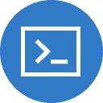

+++
title = "Overview"
date = 2024-01-12T22:36:24+08:00
weight = 1
type = "docs"
description = ""
isCJKLanguage = true
draft = false
+++

> 原文: [https://code.visualstudio.com/docs/datascience/overview](https://code.visualstudio.com/docs/datascience/overview)

# Data Science in Visual Studio Code Visual Studio Code 中的数据科学

You can do all of your data science work within VS Code. Use Jupyter Notebooks and the [Interactive Window](https://code.visualstudio.com/docs/python/jupyter-support-py) to start analyzing and visualizing your data in minutes! Power your Python coding experience with IntelliSense support and build, train, and deploy machine learning models to the cloud or the edge with Azure Machine Learning service.

​​	您可以在 VS Code 中完成所有数据科学工作。使用 Jupyter Notebooks 和交互式窗口，即可在数分钟内开始分析和可视化数据！利用 IntelliSense 支持增强您的 Python 编码体验，并使用 Azure 机器学习服务构建、训练和部署机器学习模型到云或边缘。

## [Extensions 扩展](https://code.visualstudio.com/docs/datascience/overview#_extensions)

The VS Code Marketplace offers a family of extensions that provide a first-class data science experience for Python data science. In order to get started with Python, Microsoft recommends the following extensions:

​​	VS Code Marketplace 提供一系列扩展，可为 Python 数据科学提供一流的数据科学体验。为了开始使用 Python，Microsoft 建议使用以下扩展：

Python

109.0M

ms-python

Jupyter

73.9M
7390 万

ms-toolsai

Remote - SSH

18.7M
1870 万

ms-vscode-remote

Azure Machine Learning

2.1M
210 万

ms-toolsai

### [Build an extension for notebooks 为笔记本构建扩展](https://code.visualstudio.com/docs/datascience/overview#_build-an-extension-for-notebooks)

We welcome (and encourage you to!) build Visual Studio Code extensions for your favorite notebooks tools. After going through [Your First Extension](https://code.visualstudio.com/api/get-started/your-first-extension) tutorial, check out some of the extensions that augment the notebooks development experience in VS Code:

​​	我们欢迎（并鼓励您！）为您的最爱笔记本工具构建 Visual Studio Code 扩展。在完成您的第一个扩展教程后，请查看一些在 VS Code 中增强笔记本开发体验的扩展：

Jupyter Keymap

55.7M

ms-toolsai

Jupyter Cell Tags
Jupyter 单元格标记

35.7M

ms-toolsai

Jupyter Slide Show
Jupyter 幻灯片

35.7M

ms-toolsai

Kusto Notebooks

9.6K

donjayamanne

You can explore the source code for these extensions by selecting the repository link under the **Project Details** section in the Visual Studio Marketplace.

​​	您可以在 Visual Studio Marketplace 中的“项目详细信息”部分下选择存储库链接，以浏览这些扩展的源代码。

You can also contribute directly to the [Jupyter extension](https://github.com/microsoft/vscode-jupyter).

​​	您还可以直接为 Jupyter 扩展做出贡献。

## [Data Science profile template 数据科学配置文件模板](https://code.visualstudio.com/docs/datascience/overview#_data-science-profile-template)

[Profiles](https://code.visualstudio.com/docs/editor/profiles) let you quickly switch your extensions, settings, and UI layout depending on your current project or task. To help you get started with Data Science in VS Code, you can use the [Data Science profile template](https://code.visualstudio.com/docs/editor/profiles#_data-science-profile-template), which is a curated profile with useful extensions, settings, and snippets. You can use a profile template as is or use it as a starting point to customize further for your own workflows.

​​	配置文件允许您根据当前项目或任务快速切换扩展、设置和 UI 布局。为了帮助您开始在 VS Code 中使用数据科学，您可以使用数据科学配置文件模板，这是一个经过策划的配置文件，其中包含有用的扩展、设置和代码段。您可以按原样使用配置文件模板，或将其用作起点，以便进一步自定义以适应您自己的工作流。

You select a profile template through the **Profiles** > **Create Profile...** dropdown:

​​	您可以通过“配置文件”>“创建配置文件...”下拉列表选择配置文件模板：

Once you select a profile template, you can review the settings and extensions, and remove individual items if you don't want to include them in your new profile. After creating the new profile based on the template, changes made to settings, extensions, or UI are persisted in your profile.

​​	选择配置文件模板后，您可以查看设置和扩展，并删除不想包含在新配置文件中的各个项目。根据模板创建新配置文件后，对设置、扩展或 UI 所做的更改将保留在您的配置文件中。

## [What else can you use notebooks for? 您还可以将笔记本用于什么？](https://code.visualstudio.com/docs/datascience/overview#_what-else-can-you-use-notebooks-for)

The support for mixing executable code, equations, visualizations, and rich Markdown makes notebooks useful for breaking down new concepts in a storytelling form. This makes notebooks an exceptional tool for educators and students!

​​	支持混合可执行代码、方程式、可视化和丰富的 Markdown，使笔记本非常适合以讲故事的形式分解新概念。这使得笔记本成为教育工作者和学生们的绝佳工具！

Learn C#, F#, Powershell, JavaScript, HTML, SQL, KQL (Kusto Query Language), and [Mermaid](https://mermaid.js.org/intro/) with the [Polyglot Notebooks](https://marketplace.visualstudio.com/items?itemName=ms-dotnettools.dotnet-interactive-vscode) extension.

​​	使用 Polyglot Notebooks 扩展学习 C#、F#、Powershell、JavaScript、HTML、SQL、KQL（Kusto 查询语言）和 Mermaid。

