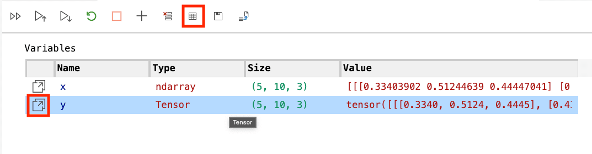
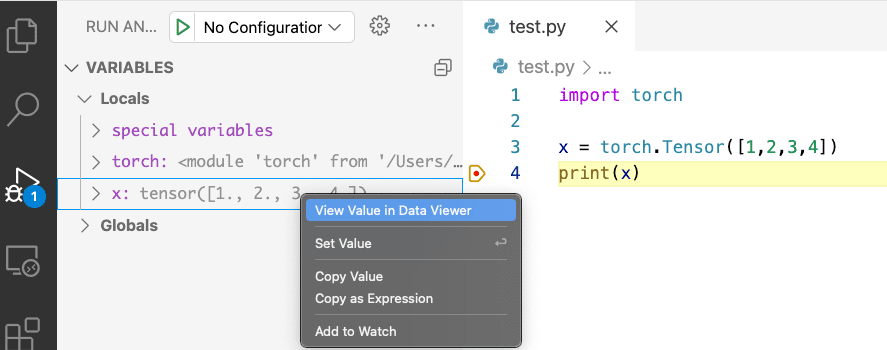
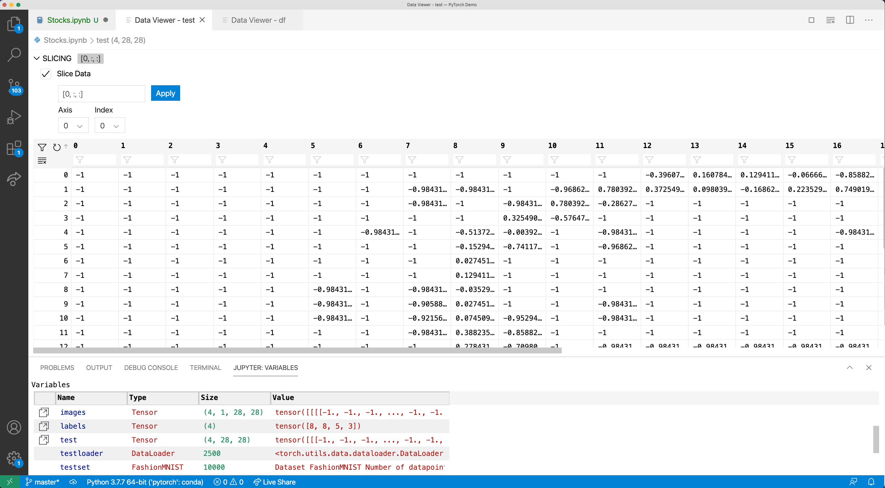
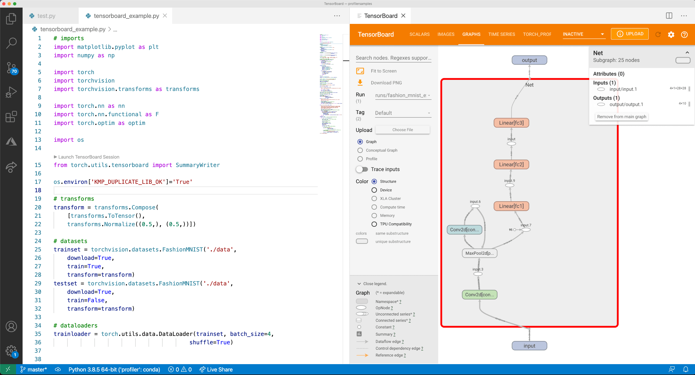
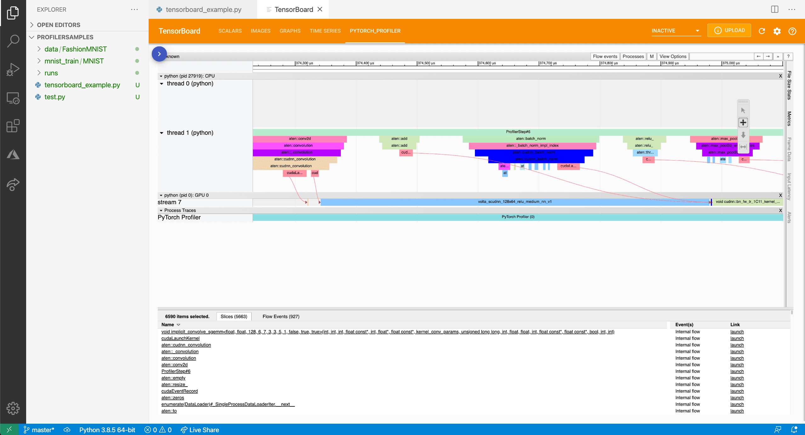
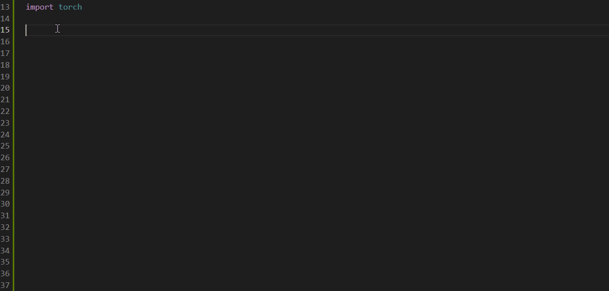

+++
title = "PyTorch Support"
date = 2024-01-12T22:36:24+08:00
weight = 40
type = "docs"
description = ""
isCJKLanguage = true
draft = false
+++

> 原文: [https://code.visualstudio.com/docs/datascience/pytorch-support](https://code.visualstudio.com/docs/datascience/pytorch-support)

# PyTorch support in Visual Studio Code Visual Studio Code 中的 PyTorch 支持

Along with support for [Jupyter Notebooks](), Visual Studio Code offers many features of particular interest for PyTorch developers. This article covers some of those features and illustrates how they can help you in your projects. If you're unfamiliar with PyTorch development, Microsoft Learn offers a [Get started with PyTorch](https://learn.microsoft.com/training/paths/pytorch-fundamentals) learning path that covers the fundamentals of deep learning with PyTorch.

​​	除了对 Jupyter Notebooks 的支持外，Visual Studio Code 还提供了许多对 PyTorch 开发人员特别有用的功能。本文介绍了其中一些功能，并说明了它们如何帮助你进行项目。如果你不熟悉 PyTorch 开发，Microsoft Learn 提供了一个入门 PyTorch 学习路径，其中介绍了使用 PyTorch 进行深度学习的基础知识。

## [Data Viewer support for Tensors and data slices 数据查看器支持张量和数据切片]()

VS Code provides a [Data Viewer]() that allows you to explore the variables within your code and notebooks, including PyTorch and TensorFlow `Tensor` data types. Along with that the Data Viewer has support for slicing data, allowing you to view any 2D slice of your higher dimensional data.

​​	VS Code 提供了一个数据查看器，允许你浏览代码和笔记本中的变量，包括 PyTorch 和 TensorFlow `Tensor` 数据类型。除此之外，数据查看器还支持切片数据，允许你查看高维数据的任何 2D 切片。

To access the Data Viewer, you can open it from the Notebook Variable Explorer by clicking the Data Viewer icon that shows up beside any Tensor variable. You'll also notice that the Variable Explorer shows the shape/dimensions of the Tensor as well.

​​	要访问数据查看器，你可以通过单击任何张量变量旁边的“数据查看器”图标，从笔记本变量资源管理器中将其打开。你还会注意到变量资源管理器也显示了张量的形状/维度。

Or you can open it from a Python debugging session by right-clicking any Tensor variable in the debugger and selecting **View Value in Data Viewer**.

​​	或者，你也可以通过右键单击调试器中的任何张量变量并选择“在数据查看器中查看值”来从 Python 调试会话中将其打开。

If you have three-dimensional or greater data (numpy `ndarray`, PyTorch `Tensor`, or TensorFlow `EagerTensor` types) a data slicing panel will open in the Data Viewer by default. Using the panel, you can either use the input box to programmatically specify your slice using Python slice syntax or you can use the interactive **Axis** and **Index** dropdowns to slice as well.

​​	如果您有三个维度或更多维度的数据（numpy `ndarray` 、PyTorch `Tensor` 或 TensorFlow `EagerTensor` 类型），则数据切片面板将默认在数据查看器中打开。使用该面板，您可以使用输入框使用 Python 切片语法以编程方式指定切片，也可以使用交互式轴和索引下拉列表进行切片。

Along with slicing, you can search for values of interest such as "inf's" or "NaN's" by searching for those keywords in the filter under each column name.

​​	除了切片之外，您还可以通过在每列名称下的筛选器中搜索“inf”或“NaN”等关键字来搜索感兴趣的值。

## [TensorBoard integration TensorBoard 集成]()

[TensorBoard](https://www.tensorflow.org/tensorboard) is a data science companion dashboard that helps [PyTorch](https://pytorch.org/) and [TensorFlow](https://www.tensorflow.org/) developers visualize datasets and model training. With TensorBoard directly integrated in VS Code, you can spot check your models predictions, view the architecture of your model, analyze your model's loss and accuracy over time, and profile your code to find out where it's the slowest.

​​	TensorBoard 是一个数据科学辅助仪表板，可帮助 PyTorch 和 TensorFlow 开发人员可视化数据集和模型训练。通过直接在 VS Code 中集成 TensorBoard，您可以检查模型预测、查看模型的架构、分析模型的损失和准确性随时间的变化，以及分析代码以找出最慢的部分。

To start a TensorBoard session, open the **Command Palette** (Ctrl+Shift+P) and search for the command **Python: Launch TensorBoard**. Afterwards, you'll be prompted to select the folder where your TensorBoard log files are located. By default, VS Code uses your current working directory and automatically detects your TensorBoard log files within any subdirectories. However, you can also specify your own directory. VS Code will then open a new tab with TensorBoard and manage its lifecycle as you work.

​​	要启动 TensorBoard 会话，请打开命令面板 (Ctrl+Shift+P) 并搜索命令 Python: 启动 TensorBoard。之后，系统会提示您选择 TensorBoard 日志文件所在的文件夹。默认情况下，VS Code 使用您当前的工作目录，并在任何子目录中自动检测您的 TensorBoard 日志文件。但是，您也可以指定自己的目录。然后，VS Code 将打开一个包含 TensorBoard 的新选项卡，并在您工作时管理其生命周期。

You can also use the setting `python.tensorboard.logDirectory` to set a default TensorBoard log directory for your folder/workspace.

​​	您还可以使用设置 `python.tensorboard.logDirectory` 为您的文件夹/工作区设置默认的 TensorBoard 日志目录。

## [PyTorch Profiler integration PyTorch Profiler 集成]()

Along with TensorBoard, VS Code and the Python extension also integrate the PyTorch Profiler, allowing you to better analyze your PyTorch models in one place. For more information about the profiler, see the [PyTorch Profiler documentation](https://pytorch.org/blog/introducing-pytorch-profiler-the-new-and-improved-performance-tool/).

​​	除了 TensorBoard，VS Code 和 Python 扩展还集成了 PyTorch Profiler，允许您在一个地方更好地分析 PyTorch 模型。有关分析器的更多信息，请参阅 PyTorch Profiler 文档。

## [IntelliSense through the Pylance language server 通过 Pylance 语言服务器进行 IntelliSense]()

The Python editing experience in VS Code, enhanced with the power of Pylance, provides completions and other rich features for PyTorch. For the best experience, update PyTorch to 1.10.1 to get improved completions for submodules, such as nn, cuda, and optim.

​​	VS Code 中的 Python 编辑体验通过 Pylance 的强大功能得到增强，为 PyTorch 提供了代码补全和其他丰富功能。为了获得最佳体验，请将 PyTorch 更新到 1.10.1，以获得针对子模块（例如 nn、cuda 和 optim）的改进代码补全。

