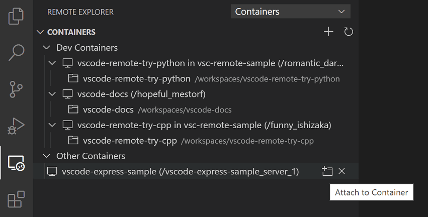
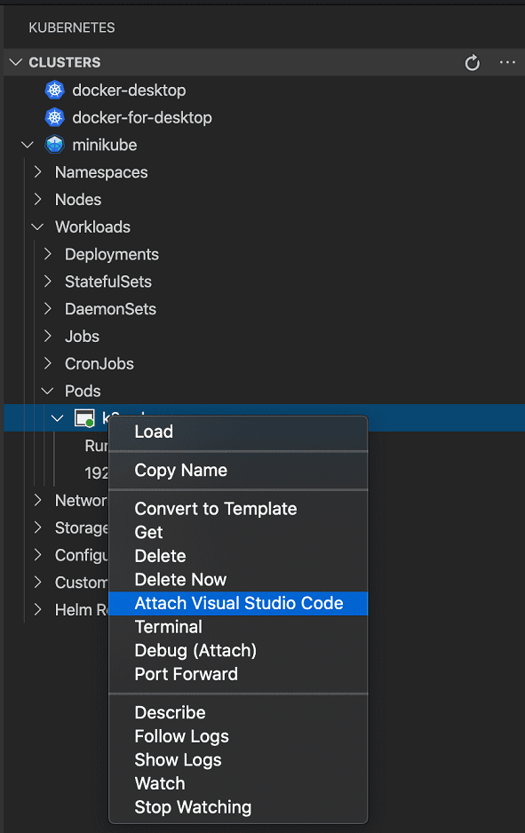

+++
title = "Attach to Container"
date = 2024-01-12T22:36:24+08:00
weight = 20
type = "docs"
description = ""
isCJKLanguage = true
draft = false
+++

> 原文: [https://code.visualstudio.com/docs/devcontainers/attach-container](https://code.visualstudio.com/docs/devcontainers/attach-container)

# Attach to a running container 附加到正在运行的容器


Visual Studio Code can create and start containers for you but that may not match your workflow and you may prefer to "attach" VS Code to an already running Docker container - regardless of how it was started. Once attached, you can install extensions, edit, and debug like you can when you open a folder in a container using [devcontainer.json](https://containers.dev/implementors/json_reference).

​​	Visual Studio Code 可以为您创建并启动容器，但这可能与您的工作流不匹配，您可能更喜欢将 VS Code “附加”到已运行的 Docker 容器 - 无论它是如何启动的。附加后，您可以安装扩展、编辑和调试，就像使用 devcontainer.json 在容器中打开文件夹时一样。

## [Attach to a Docker container 附加到 Docker 容器]()

To attach to a Docker container, either select **Dev Containers: Attach to Running Container...** from the Command Palette (F1) or use the **Remote Explorer** in the Activity Bar and from the **Containers** view, select the **Attach to Container** inline action on the container you want to connect to.

​​	要附加到 Docker 容器，请从命令面板 (F1) 中选择“开发容器：附加到正在运行的容器...”或使用“活动栏”中的“远程资源管理器”，然后从“容器”视图中选择要连接到的容器上的“附加到容器”内联操作。



> **Note:** When using Alpine Linux containers, some extensions may not work due to `glibc` dependencies in native code inside the extension.
>
> ​​	注意：在使用 Alpine Linux 容器时，某些扩展可能无法工作，因为扩展内部的本机代码中存在 `glibc` 依赖项。

## [Attached container configuration files 附加容器配置文件]()

VS Code supports image or container name-level configuration files to speed up setup when you repeatedly connect to a given Docker container. Once attached, anytime you open a folder, [install an extension](), or [forward a port](), a local image-specific configuration file will automatically be updated to remember your settings so that when you attach again, everything is back to the right place.

​​	VS Code 支持映像或容器名称级别的配置文件，以便在您重复连接到给定的 Docker 容器时加快设置速度。附加后，无论何时打开文件夹、安装扩展或转发端口，本地特定于映像的配置文件都会自动更新以记住您的设置，以便在您再次附加时，所有内容都恢复到正确的位置。

- By default, an **image-level** configuration is used. To view or update it after attaching, select **Dev Containers: Open Container Configuration File** from the Command Palette (F1).

  ​​	默认情况下，使用映像级配置。若要在附加后查看或更新它，请从命令面板 (F1) 中选择“开发容器：打开容器配置文件”。

- If you would prefer to tie your configuration to a **container name**, select **Dev Containers: Open Named Configuration File** from the Command Palette (F1) after attaching. Any updates from this point forward will apply to this name-level configuration rather than at the image level.

  ​​	如果您希望将配置绑定到容器名称，请在附加后从命令面板 (F1) 中选择“开发容器：打开命名配置文件”。从此时起，任何更新都将应用于此名称级配置，而不是映像级配置。

Both of these files support a subset of `devcontainer.json` properties:

​​	这两个文件都支持 `devcontainer.json` 属性的子集：

```
{
  // Default path to open when attaching to a new container.
  "workspaceFolder": "/path/to/code/in/container/here",

  // Set *default* container specific settings.json values on container create.
  "settings": {
    "terminal.integrated.defaultProfile.linux": "bash"
  },

  // Add the IDs of extensions you want installed when the container is created.
  "extensions": ["dbaeumer.vscode-eslint"],

  // An array port numbers to forward
  "forwardPorts": [8000],

  // Container user VS Code should use when connecting
  "remoteUser": "vscode",

  // Set environment variables for VS Code and sub-processes
  "remoteEnv": { "MY_VARIABLE": "some-value" }
}
```

See the [attached container config reference]() for a complete list of properties and their uses.

​​	有关属性及其用途的完整列表，请参阅附加的容器配置参考。

Once saved, whenever you open a container for the first time with the same image / container name, these properties will be used to configure the environment.

​​	保存后，每当您首次使用相同的映像/容器名称打开容器时，这些属性都将用于配置环境。

> **Tip:** If something is wrong with your configuration, you can also edit it when not attached to the container by selecting **Dev Containers: Open Attached Container Configuration File...** from the Command Palette (F1) and then picking the image / container name from the presented list.
>
> ​​	提示：如果配置出现问题，您还可以在未附加到容器时通过从命令面板 (F1) 中选择“开发容器：打开附加容器配置文件...”并从显示的列表中选择映像/容器名称来编辑它。

Finally, if you have extensions you want installed regardless of the container you attach to, you can update `settings.json` to specify a list of [extensions that should always be installed]().

​​	最后，如果您有无论附加到哪个容器都希望安装的扩展，您可以更新 `settings.json` 以指定始终应安装的扩展列表。

## [Attached container configuration reference 附加容器配置参考]()

Attached container configuration files are similar to [devcontainer.json](https://containers.dev/implementors/json_reference) and supports a subset of its properties.

​​	附加容器配置文件类似于 devcontainer.json，并支持其属性的子集。

| Property 属性          | Type 类型                   | Description 说明                                             |
| :--------------------- | :-------------------------- | :----------------------------------------------------------- |
| `workspaceFolder`      | string                      | Sets the default path that VS Code should open when connecting to the container (which is often the path to a volume mount where the source code can be found in the container). Not set by default (an empty window is opened). 设置 VS Code 在连接到容器时应打开的默认路径（通常是可以在容器中找到源代码的卷装入点的路径）。默认情况下未设置（打开一个空窗口）。 |
| `extensions`           | array                       | An array of extension IDs that specify the extensions that should be installed inside the container when it is created. Defaults to `[]`. 指定在创建容器时应在容器内安装的扩展的扩展 ID 数组。默认为 `[]` 。 |
| `settings`             | object                      | Adds default `settings.json` values into a container/machine specific settings file. 将默认 `settings.json` 值添加到容器/机器特定设置文件中。 |
| `forwardPorts`         | array                       | A list of ports that should be forwarded from inside the container to the local machine. 应从容器内部转发到本地计算机的端口列表。 |
| `portsAttributes`      | object                      | Object that maps a port number, `"host:port"` value, range, or regular expression to a set of default options. See [port attributes](https://containers.dev/implementors/json_reference/#port-attributes) for available options. For example: 将端口号、 `"host:port"` 值、范围或正则表达式映射到一组默认选项的对象。有关可用选项，请参阅端口属性。例如： `"portsAttributes": {"3000": {"label": "Application port"}}` |
| `otherPortsAttributes` | object                      | Default options for ports, port ranges, and hosts that aren't configured using `portsAttributes`. See [port attributes](https://containers.dev/implementors/json_reference/#port-attributes) for available options. For example: 未使用 `portsAttributes` 配置的端口、端口范围和主机的默认选项。有关可用选项，请参阅端口属性。例如： `"otherPortsAttributes": {"onAutoForward": "silent"}` |
| `remoteEnv`            | object                      | A set of name-value pairs that sets or overrides environment variables for VS Code (or sub-processes like terminals) but not the container as a whole. Environment and [pre-defined variables]() may be referenced in the values. 一组名称-值对，用于设置或覆盖 VS Code（或子进程，如终端）的环境变量，但不包括整个容器。可以在值中引用环境和预定义变量。 For example: `"remoteEnv": { "PATH": "${containerEnv:PATH}:/some/other/path" }` 例如： `"remoteEnv": { "PATH": "${containerEnv:PATH}:/some/other/path" }` |
| `remoteUser`           | string                      | Overrides the user that VS Code runs as in the container (along with sub-processes like terminals, tasks, or debugging). Defaults to the user the container as a whole is running as (often `root`). 覆盖 VS Code 在容器中作为哪个用户运行（以及子进程，如终端、任务或调试）。默认为容器作为整体运行的用户（通常为 `root` ）。 |
| `userEnvProbe`         | enum 枚举                   | Indicates the type of shell to use to "probe" for user environment variables to include in VS Code or other connected tool's processes: `none`, `interactiveShell`, `loginShell`, or `loginInteractiveShell` (default). The specific shell used is based on the default shell for the user (typically bash). For example, bash interactive shells will typically include variables set in `/etc/bash.bashrc` and `~/.bashrc` while login shells usually include variables from `/etc/profile` and `~/.profile`. Setting this property to `loginInteractiveShell` will get variables from all four files. 指示用于“探测”要包含在 VS Code 或其他连接工具进程中的用户环境变量的 shell 类型： `none` 、 `interactiveShell` 、 `loginShell` 或 `loginInteractiveShell` （默认）。所使用的特定 shell 基于用户的默认 shell（通常为 bash）。例如，bash 交互式 shell 通常会包含在 `/etc/bash.bashrc` 和 `~/.bashrc` 中设置的变量，而登录 shell 通常包含来自 `/etc/profile` 和 `~/.profile` 的变量。将此属性设置为 `loginInteractiveShell` 将从所有四个文件中获取变量。 |
| `postAttachCommand`    | string, 字符串， array 数组 | A command string or list of command arguments to run after VS Code attaches to the container. Use `&&` in a string to execute multiple commands. For example, `"yarn install"` or `"apt-get update && apt-get install -y curl"`. The array syntax `["yarn", "install"]` will invoke the command (in this case `yarn`) directly without using a shell. Not set by default. VS Code 附加到容器后要运行的命令字符串或命令参数列表。在字符串中使用 `&&` 来执行多个命令。例如， `"yarn install"` 或 `"apt-get update && apt-get install -y curl"` 。数组语法 `["yarn", "install"]` 将直接调用命令（在本例中为 `yarn` ），而不使用 shell。默认情况下未设置。 Note that the array syntax will execute the command without a shell. You can [learn more](https://containers.dev/implementors/json_reference/#formatting-string-vs-array-properties) about formatting string vs array properties. 请注意，数组语法将在没有 shell 的情况下执行命令。您可以详细了解如何设置字符串与数组属性。 |

### [Variables in attached container configuration files 附加容器配置文件中的变量]()

Variables can be referenced in certain string values in attached configuration files in the following format: **${variableName}**. The following table is a list of available variables you can use.

​​	在附加的配置文件中，变量可以按以下格式引用某些字符串值：${variableName}。下表列出了您可以使用的可用变量的列表。

| Variable 变量              | Properties 属性 | Description 说明                                             |
| :------------------------- | :-------------- | :----------------------------------------------------------- |
| `${containerEnv:VAR_NAME}` | `remoteEnv`     | Value of an existing environment variable inside the container (in this case, `VAR_NAME`) once it is up and running. For example: `"remoteEnv": { "PATH": "${containerEnv:PATH}:/some/other/path" }` 容器内现有环境变量的值（在本例中为 `VAR_NAME` ），一旦启动并运行。例如： `"remoteEnv": { "PATH": "${containerEnv:PATH}:/some/other/path" }` |

## [Attach to a container in a Kubernetes cluster 附加到 Kubernetes 集群中的容器]()

To attach to a container in a Kubernetes cluster, first install the [Kubernetes extension](https://marketplace.visualstudio.com/items?itemName=ms-kubernetes-tools.vscode-kubernetes-tools) and `kubectl` along with the Dev Containers extension. Then select the Kubernetes explorer from the Activity bar and expand the cluster and Pod where the container you want to attach to resides. Finally, right-click on the container and select **Attach Visual Studio Code** from context menu.

​​	要附加到 Kubernetes 集群中的容器，首先安装 Kubernetes 扩展和 `kubectl` 以及 Dev Containers 扩展。然后从活动栏中选择 Kubernetes 资源管理器，并展开容器所在的集群和 Pod。最后，右键单击容器，然后从上下文菜单中选择“附加 Visual Studio Code”。

> **Note:** Attached container configuration files are not yet supported for containers in a Kubernetes cluster.
>
> ​​	注意：附加容器配置文件尚不支持 Kubernetes 集群中的容器。



## [Next steps 后续步骤]()

- [Create a Dev Container]() - Create a custom container for your work environment.
  创建 Dev 容器 - 为您的工作环境创建自定义容器。
- [Advanced Containers]() - Find solutions to advanced container scenarios.
  高级容器 - 查找高级容器方案的解决方案。
- [devcontainer.json reference](https://containers.dev/implementors/json_reference) - Review the `devcontainer.json` schema.
  devcontainer.json 参考 - 查看 `devcontainer.json` 架构。
