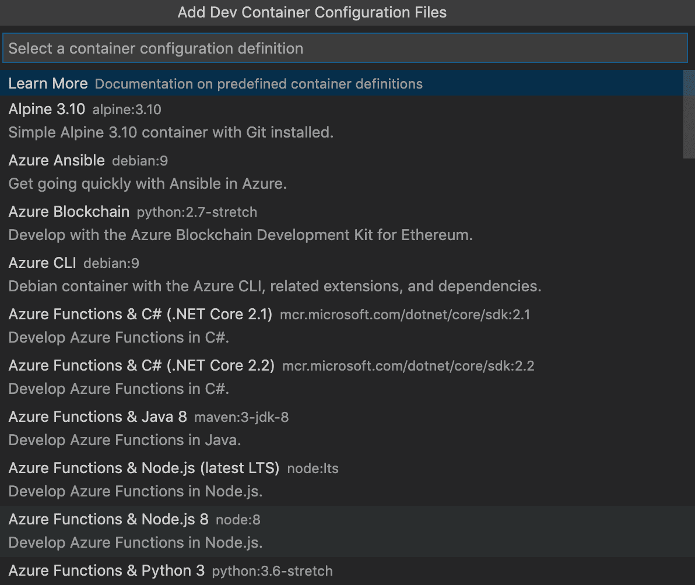
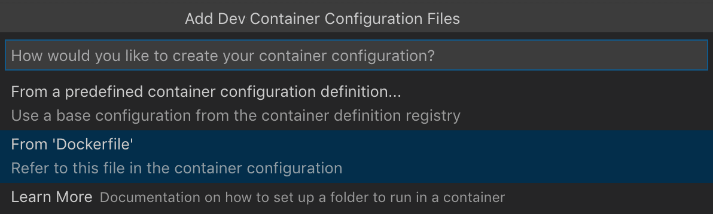
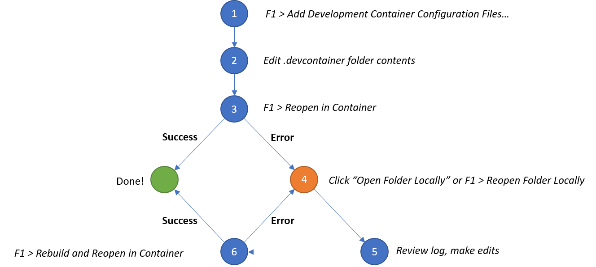
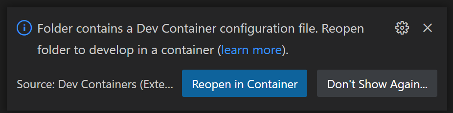
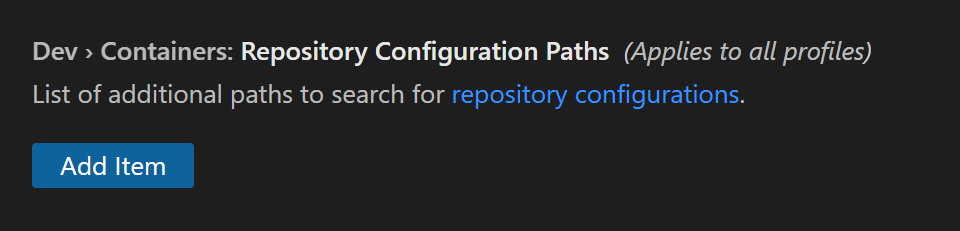

+++
title = "Create a Dev Container"
date = 2024-01-12T22:36:24+08:00
weight = 30
type = "docs"
description = ""
isCJKLanguage = true
draft = false
+++

> 原文: [https://code.visualstudio.com/docs/devcontainers/create-dev-container](https://code.visualstudio.com/docs/devcontainers/create-dev-container)

# Create a Dev Container 创建开发容器


The **Visual Studio Code Dev Containers** extension lets you use a [Docker container](https://docker.com/) as a full-featured development environment. It allows you to open any folder or repository inside a container and take advantage of Visual Studio Code's full feature set. A `devcontainer.json` file in your project tells VS Code how to access (or create) a **development container** with a well-defined tool and runtime stack. This container can be used to run an application or to provide separate tools, libraries, or runtimes needed for working with a codebase.

​​	Visual Studio Code Dev Containers 扩展允许您将 Docker 容器用作功能齐全的开发环境。它允许您在容器内打开任何文件夹或存储库，并利用 Visual Studio Code 的全套功能。项目中的 `devcontainer.json` 文件告诉 VS Code 如何访问（或创建）具有明确定义的工具和运行时堆栈的开发容器。此容器可用于运行应用程序或提供处理代码库所需的单独工具、库或运行时。

## [Path to creating a dev container 创建开发容器的路径](https://code.visualstudio.com/docs/devcontainers/create-dev-container#_path-to-creating-a-dev-container)

In this document, we'll go through the steps for creating a development (dev) container in VS Code:

​​	在此文档中，我们将介绍在 VS Code 中创建开发 (dev) 容器的步骤：

1. Create a `devcontainer.json`, which describes how VS Code should start the container and what to do after it connects.
   创建 `devcontainer.json` ，其中描述了 VS Code 如何启动容器以及连接后要执行的操作。
2. Make and persist changes to the dev container, such as installation of new software, through use of a Dockerfile.
   通过使用 Dockerfile 对开发容器进行更改并使其持久化，例如安装新软件。
3. Configure multiple containers through Docker Compose.
   通过 Docker Compose 配置多个容器。
4. As you make changes, build your dev container to ensure changes take effect.
   在进行更改时，构建开发容器以确保更改生效。

After any of the steps above, you'll have a fully functioning dev container, and you can either continue to the next step of this tutorial to add more features, or stop and begin working in the dev environment you currently have.

​​	在完成上述任何步骤后，您将拥有一个功能齐全的开发容器，您可以继续执行本教程的下一步以添加更多功能，或停止并开始在您当前拥有的开发环境中工作。

> Note: The Dev Containers extension has a **Dev Containers: Add Dev Container Configuration Files...** command that lets you pick a pre-defined container configuration from a list. If you'd prefer to have a complete dev container immediately rather than building up the `devcontainer.json` and Dockerfile step-by-step, you can skip ahead to [Automate dev container creation](https://code.visualstudio.com/docs/devcontainers/create-dev-container#_automate-dev-container-creation).
>
> ​​	注意：Dev Containers 扩展程序有一个 Dev Containers：添加 Dev Container 配置文件... 命令，可让您从列表中选择预定义的容器配置。如果您希望立即拥有一个完整的开发容器，而不是逐步构建 `devcontainer.json` 和 Dockerfile，则可以跳到自动执行开发容器创建。

## [Create a devcontainer.json file 创建 devcontainer.json 文件](https://code.visualstudio.com/docs/devcontainers/create-dev-container#_create-a-devcontainerjson-file)

VS Code's container configuration is stored in a [devcontainer.json](https://containers.dev/implementors/json_reference) file. This file is similar to the `launch.json` file for debugging configurations, but is used for launching (or attaching to) your development container instead. The dev container configuration is either located under `.devcontainer/devcontainer.json` or stored as a `.devcontainer.json` file (note the dot-prefix) in the root of your project.

​​	VS Code 的容器配置存储在 devcontainer.json 文件中。此文件类似于用于调试配置的 `launch.json` 文件，但用于启动（或附加到）您的开发容器。开发容器配置位于 `.devcontainer/devcontainer.json` 下或存储为 `.devcontainer.json` 文件（注意点前缀）在项目的根目录中。

You can use an image as a starting point for your `devcontainer.json`. An image is like a mini-disk drive with various tools and an operating system pre-installed. You can pull images from a container registry, which is a collection of repositories that store images. Here is a simple example `devcontainer.json` that uses a pre-built TypeScript and Node.js VS Code Development Container [image](https://github.com/devcontainers/images):

​​	您可以使用映像作为 `devcontainer.json` 的起点。映像就像一个迷你磁盘驱动器，预装了各种工具和操作系统。您可以从容器注册表中提取映像，容器注册表是存储映像的存储库集合。这是一个简单的示例 `devcontainer.json` ，它使用预构建的 TypeScript 和 Node.js VS Code 开发容器映像：

```
{
  "image": "mcr.microsoft.com/devcontainers/typescript-node:0-18"
}
```

You can alter your configuration to do things such as:

​​	您可以更改配置以执行以下操作：

- Install additional tools such as Git in the container.
  在容器中安装其他工具，例如 Git。
- Automatically install extensions.
  自动安装扩展。
- Forward or publish additional ports.
  转发或发布其他端口。
- Set runtime arguments.
  设置运行时参数。
- Reuse or [extend your existing Docker Compose setup](https://aka.ms/vscode-remote/containers/docker-compose/extend).
  重复使用或扩展现有的 Docker Compose 设置。
- Add more [Advanced container configuration](https://code.visualstudio.com/remote/advancedcontainers/overview).
  添加更高级的容器配置。

For this example, if you'd like to install the [Code Spell Checker extension](https://marketplace.visualstudio.com/items?itemName=streetsidesoftware.code-spell-checker) into your container and automatically forward port 3000, your `devcontainer.json` would look like:

​​	对于此示例，如果您想将 Code Spell Checker 扩展安装到容器中并自动转发端口 3000，则您的 `devcontainer.json` 将如下所示：

```
{
  "image": "mcr.microsoft.com/devcontainers/typescript-node",

  "customizations": {
    "vscode": {
      "extensions": ["streetsidesoftware.code-spell-checker"]
    }
  },
  "forwardPorts": [3000]
}
```

> **Note:** Additional configuration will already be added to the container based on what's in the base image. For example, we add the `streetsidesoftware.code-spell-checker` extension above, and the container will also include `"dbaeumer.vscode-eslint"` as [that's part of `mcr.microsoft.com/devcontainers/typescript-node`](https://github.com/devcontainers/images/blob/main/src/javascript-node/.devcontainer/devcontainer.json#L27). This happens automatically when pre-building using devcontainer.json, which you may read more about in the [pre-build section](https://code.visualstudio.com/docs/devcontainers/containers#_prebuilding-dev-container-images).
>
> ​​	注意：其他配置将根据基本映像中的内容添加到容器中。例如，我们在上面添加了 `streetsidesoftware.code-spell-checker` 扩展，容器还将包含 `"dbaeumer.vscode-eslint"` ，因为它是 `mcr.microsoft.com/devcontainers/typescript-node` 的一部分。使用 devcontainer.json 预构建时会自动发生这种情况，您可以在预构建部分中阅读更多相关信息。

With the above `devcontainer.json`, your dev container is functional, and you can connect to and start developing within it. Try it out with the **Dev Containers: Reopen in Container** command:

​​	通过上述 `devcontainer.json` ，您的开发容器已正常运行，您可以连接到其中并开始在其中进行开发。使用“开发容器：在容器中重新打开”命令试一试：


After running this command, when VS Code restarts, you're now within a Node.js and TypeScript dev container with port 3000 forwarded and the ESLint extension installed. Once you're connected, notice the green remote indicator on the left of the Status bar to show you are connected to your dev container:

​​	运行此命令后，当 VS Code 重新启动时，您现在处于 Node.js 和 TypeScript 开发容器中，端口 3000 已转发，并且已安装 ESLint 扩展。连接后，请注意状态栏左侧的绿色远程指示符，以显示您已连接到开发容器：


### [Additional dev container scenarios 其他开发容器方案](https://code.visualstudio.com/docs/devcontainers/create-dev-container#_additional-dev-container-scenarios)

Through a `devcontainer.json` file, you can:

​​	通过 `devcontainer.json` 文件，您可以：

- Spin up a stand-alone container to isolate your toolchain or speed up setup.
  启动一个独立容器来隔离您的工具链或加快设置速度。
- Work with a container deployed application defined by an image, [Dockerfile](https://code.visualstudio.com/docs/devcontainers/create-dev-container#_dockerfile), or [Docker Compose](https://code.visualstudio.com/docs/devcontainers/create-dev-container#_use-docker-compose).
  使用由映像、Dockerfile 或 Docker Compose 定义的容器部署的应用程序。
- [Use Docker or Kubernetes](https://code.visualstudio.com/remote/advancedcontainers/use-docker-kubernetes) from inside a dev container to build and deploy your app.
  从开发容器内部使用 Docker 或 Kubernetes 来构建和部署您的应用。

If `devcontainer.json`'s supported workflows do not meet your needs, you can also [attach to an already running container instead](https://code.visualstudio.com/docs/devcontainers/attach-container).

​​	如果 `devcontainer.json` 支持的工作流无法满足您的需求，您还可以附加到已运行的容器。

> **Tip:** Want to use a remote Docker host? See the [Develop on a remote Docker host](https://code.visualstudio.com/remote/advancedcontainers/develop-remote-host) article for details on setup.
>
> ​​	提示：想要使用远程 Docker 主机？请参阅在远程 Docker 主机上进行开发一文，了解有关设置的详细信息。

## [Install additional software 安装其他软件](https://code.visualstudio.com/docs/devcontainers/create-dev-container#_install-additional-software)

You may want to install additional software in your dev container. Once VS Code is connected to the container, you can open a VS Code terminal and execute any command against the OS inside the container. This allows you to install new command-line utilities and spin up databases or application services from inside the Linux container.

​​	您可能希望在开发容器中安装其他软件。一旦 VS Code 连接到容器，您就可以打开 VS Code 终端并对容器内的操作系统执行任何命令。这允许您安装新的命令行实用程序，并从 Linux 容器内部启动数据库或应用程序服务。

Most container images are based on Debian or Ubuntu, where the `apt` or `apt-get` command is used to install new packages. You can learn more about the command [in Ubuntu's documentation](https://help.ubuntu.com/lts/serverguide/apt.html). Alpine images include a [similar `apk` command](https://wiki.alpinelinux.org/wiki/Alpine_Linux_package_management) while CentOS / RHEL / Oracle SE / Fedora images [use `yum`](https://access.redhat.com/documentation/en-us/red_hat_enterprise_linux/6/html/deployment_guide/ch-yum) or [more recently `dnf`](https://fedoraproject.org/wiki/DNF?rd=Dnf).

​​	大多数容器映像都基于 Debian 或 Ubuntu，其中 `apt` 或 `apt-get` 命令用于安装新软件包。您可以在 Ubuntu 的文档中了解有关该命令的更多信息。Alpine 映像包含类似的 `apk` 命令，而 CentOS / RHEL / Oracle SE / Fedora 映像使用 `yum` 或最近的 `dnf` 。

Documentation for the software you want to install will usually provide specific instructions, but you may not need to prefix commands with `sudo` if you are running as root in the container.

​​	您要安装的软件的文档通常会提供具体说明，但如果您在容器中以 root 身份运行，则可能不需要在命令前加上 `sudo` 。

For example:

​​	例如：

```
# If running as root
apt-get update
apt-get install <package>
```

If you are running as root, you can install software as long as `sudo` is configured in your container. All predefined containers have `sudo` set up, but the [Add a non-root user to a container](https://code.visualstudio.com/remote/advancedcontainers/add-nonroot-user) article can help you set this up for your own containers. Regardless, if you install and configure `sudo`, you'll be able to use it when running as any user including root.

​​	如果以 root 身份运行，只要在容器中配置了 `sudo` ，就可以安装软件。所有预定义容器都设置了 `sudo` ，但向容器添加非 root 用户一文可以帮助您为自己的容器设置此项。无论如何，如果您安装并配置了 `sudo` ，您就可以在以包括 root 在内的任何用户身份运行时使用它。

```
# If sudo is installed and configured
sudo apt-get update
sudo apt-get install <package>
```

Let's say you want to install Git. You could run the following commands in the integrated terminal in VS Code:

​​	假设您想安装 Git。您可以在 VS Code 中的集成终端中运行以下命令：

```
# If sudo is installed and configured
sudo apt-get update
# Install Git
sudo apt-get install git
```

You may also use the `"features"` property in the `devcontainer.json` to install tools and languages from a pre-defined set of [Features](https://github.com/devcontainers/features) or even your own.

​​	您还可以使用 `devcontainer.json` 中的 `"features"` 属性从预定义的功能集甚至您自己的功能集中安装工具和语言。

For example, you could install the latest version of the Azure CLI with the following:

​​	例如，您可以使用以下命令安装最新版本的 Azure CLI：

```
"features": {
    "ghcr.io/devcontainers/features/azure-cli:1": {
        "version": "latest"
    }
  }
```

See the [Dev Container Features specification](https://containers.dev/implementors/features/) for more details.

​​	有关更多详细信息，请参阅 Dev Container 功能规范。

### [Rebuild 重新生成](https://code.visualstudio.com/docs/devcontainers/create-dev-container#_rebuild)

When editing the contents of the `.devcontainer` folder, you'll need to rebuild for changes to take effect. Use the **Dev Containers: Rebuild Container** command for your container to update.

​​	编辑 `.devcontainer` 文件夹的内容时，您需要重新生成才能使更改生效。对容器使用 Dev Containers：重新生成容器命令进行更新。

However, if you **rebuild** the container, you will have to **reinstall** anything you've installed manually. To avoid this problem, you can use the `postCreateCommand` property in `devcontainer.json` or a custom `Dockerfile`.

​​	但是，如果您重新生成容器，则必须重新安装您手动安装的所有内容。若要避免此问题，您可以在 `devcontainer.json` 中使用 `postCreateCommand` 属性或自定义 `Dockerfile` 。

A custom `Dockerfile` will benefit from Docker's build cache and result in faster rebuilds than `postCreateCommand`. However, the `Dockerfile` runs before the dev container is created and the workspace folder is mounted and therefore does not have access to the files in the workspace folder. A `Dockerfile` is most suitable for installing packages and tools independent of your workspace files.

​​	自定义 `Dockerfile` 将受益于 Docker 的构建缓存，并比 `postCreateCommand` 带来更快的重建速度。但是， `Dockerfile` 在创建开发容器和装载工作区文件夹之前运行，因此无法访问工作区文件夹中的文件。 `Dockerfile` 最适合安装独立于工作区文件的软件包和工具。

The `postCreateCommand` actions are run once the container is created, so you can also use the property to run commands like `npm install` or to execute a shell script in your source tree (if you have mounted it).

​​	在创建容器后运行 `postCreateCommand` 操作，因此您还可以使用该属性来运行诸如 `npm install` 的命令或在源树中执行 shell 脚本（如果您已装载该脚本）。

```
"postCreateCommand": "bash scripts/install-dependencies.sh"
```

You can also use an interactive bash shell so that your `.bashrc` is picked up, automatically customizing your shell for your environment:

​​	您还可以使用交互式 bash shell，以便获取 `.bashrc` ，自动根据您的环境自定义您的 shell：

```
"postCreateCommand": "bash -i scripts/install-dependencies.sh"
```

Tools like NVM won't work without using `-i` to put the shell in interactive mode:

​​	如果不使用 `-i` 将 shell 置于交互模式，则诸如 NVM 之类的工具将无法运行：

```
"postCreateCommand": "bash -i -c 'nvm install --lts'"
```

The command needs to exit or the container won't start. For instance, if you add an application start to `postCreateCommand`, the command wouldn't exit.

​​	该命令需要退出，否则容器不会启动。例如，如果您将应用程序启动添加到 `postCreateCommand` ，则该命令不会退出。

There is also a `postStartCommand` that executes every time the container starts. The parameters behave exactly like `postCreateCommand`, but the commands execute on start rather than create.

​​	还有一个 `postStartCommand` ，它会在每次容器启动时执行。这些参数的行为与 `postCreateCommand` 完全相同，但这些命令在启动时执行，而不是在创建时执行。

Rather than referencing an image directly in `devcontainer.json` or installing software via the `postCreateCommand` or `postStartCommand`, an even more efficient practice is to use a Dockerfile.

​​	与其直接在 `devcontainer.json` 中引用图像或通过 `postCreateCommand` 或 `postStartCommand` 安装软件，更有效的方法是使用 Dockerfile。

## [Dockerfile](https://code.visualstudio.com/docs/devcontainers/create-dev-container#_dockerfile)

A Dockerfile will also live in the `.devcontainer` folder. You can replace the `image` property in `devcontainer.json` with `dockerfile`:

​​	Dockerfile 也将位于 `.devcontainer` 文件夹中。您可以在 `devcontainer.json` 中用 `dockerfile` 替换 `image` 属性：

```
{
  "build": { "dockerfile": "Dockerfile" },

  "customizations": {
    "vscode": {
      "extensions": ["dbaeumer.vscode-eslint"]
    }
  },

  "forwardPorts": [3000]
}
```

When you make changes like installing new software, changes made in the Dockerfile will persist even upon a rebuild of the dev container.

​​	当您进行安装新软件等更改时，即使重新构建开发容器，在 Dockerfile 中进行的更改也会保留。

In your Dockerfile, use `FROM` to designate the image, and the `RUN` instruction to install any software. You can use `&&` to string together multiple commands.

​​	在您的 Dockerfile 中，使用 `FROM` 指定图像，并使用 `RUN` 指令安装任何软件。您可以使用 `&&` 将多个命令串联在一起。

```
FROM mcr.microsoft.com/devcontainers/javascript-node:0-18
RUN apt-get update && export DEBIAN_FRONTEND=noninteractive \
    && apt-get -y install git
```

> Note: The `DEBIAN_FRONTEND` export avoids warnings when you go on to work with your container.
>
> ​​	注意：当您继续使用容器时， `DEBIAN_FRONTEND` 导出可避免出现警告。

### [Automate dev container creation 自动化开发容器创建](https://code.visualstudio.com/docs/devcontainers/create-dev-container#_automate-dev-container-creation)

Rather than creating a `.devcontainer` by hand, selecting the **Dev Containers: Add Dev Container Configuration Files...** command from the Command Palette (F1) will add the needed files to your project as a starting point, which you can further customize for your needs.

​​	无需手动创建 `.devcontainer` ，从命令面板 (F1) 中选择“开发容器：添加开发容器配置文件...”命令会将所需文件作为起点添加到您的项目中，您可以根据需要进一步自定义这些文件。

The command lets you pick a pre-defined container configuration from a list based on your folder's contents:

​​	该命令允许您根据文件夹的内容从列表中选择预定义的容器配置：



The predefined container configurations you can pick from come from our [first-party and community index](https://containers.dev/templates), which is part of the [Dev Container Specification](https://containers.dev/). We host a set of Templates as part of the spec in the [devcontainers/templates repository](https://github.com/devcontainers/templates). You can browse the `src` folder of that repository to see the contents of each Template.

​​	您可以从中进行选择的预定义容器配置来自我们的第一方和社区索引，这是 Dev Container 规范的一部分。我们在 devcontainers/templates 存储库中作为规范的一部分托管了一组模板。您可以浏览该存储库的 `src` 文件夹以查看每个模板的内容。

At the end of using **Dev Containers: Add Dev Container Configuration Files...**, you'll be shown the list of available features, which are tools and languages you can easily drop into your dev container. **Dev Containers: Configure Container Features** allows you to update an existing configuration.

​​	在使用 Dev Containers: Add Dev Container Configuration Files... 之后，您将看到可用功能的列表，这些工具和语言可以轻松放入您的开发容器中。Dev Containers: Configure Container Features 允许您更新现有配置。


You can also reuse an existing Dockerfile:

​​	您还可以重复使用现有的 Dockerfile:



Now that you have a `devcontainer.json` and Dockerfile, let's see the general process for editing container configuration files.

​​	现在您已经有了 `devcontainer.json` 和 Dockerfile，让我们看看编辑容器配置文件的一般过程。

### [Full configuration edit loop 完整的配置编辑循环](https://code.visualstudio.com/docs/devcontainers/create-dev-container#_full-configuration-edit-loop)

Editing your container configuration is easy. Since rebuilding a container will "reset" the container to its starting contents (with the exception of your local source code), VS Code does not automatically rebuild if you edit a container configuration file (`devcontainer.json`, `Dockerfile`, and `docker-compose.yml`). Instead, there are several commands that can be used to make editing your configuration easier.

​​	编辑容器配置非常简单。由于重建容器会将容器“重置”为其起始内容（本地源代码除外），因此如果您编辑容器配置文件（ `devcontainer.json` 、 `Dockerfile` 和 `docker-compose.yml` ），VS Code 不会自动重建。相反，可以使用多个命令来简化配置编辑。

Here is the typical edit loop using these commands:

​​	以下是使用这些命令的典型编辑循环：



1. Start with **Dev Containers: Add Dev Container Configuration Files...** in the Command Palette (F1).
   从 Dev Containers 开始：在命令面板（F1）中添加 Dev Container 配置文件...。
2. Edit the contents of the `.devcontainer` folder as required.
   根据需要编辑 `.devcontainer` 文件夹的内容。
3. Try it with **Dev Containers: Reopen in Container**.
   使用 Dev Containers 试用：在容器中重新打开。
4. If you see an error, select **Open Folder Locally** in the dialog that appears.
   如果看到错误，请在出现的对话框中选择在本地打开文件夹。
5. After the window reloads, a copy of the **build log** will appear in the console so you can investigate the problem. Edit the contents of the `.devcontainer` folder as required. (You can also use the **Dev Containers: Show Container Log** command to see the log again if you close it.)
   窗口重新加载后，控制台中将显示构建日志的副本，以便您可以调查问题。根据需要编辑 `.devcontainer` 文件夹的内容。（如果关闭日志，您还可以使用 Dev Containers：显示容器日志命令再次查看日志。）
6. Run **Dev Containers: Rebuild and Reopen in Container** and jump to step 4 if needed.
   运行 Dev Containers：在容器中重建并重新打开，并在需要时跳转到步骤 4。

If you already have a successful build, you can still edit the contents of the `.devcontainer` folder as required when connected to the container and then select **Dev Containers: Rebuild Container** in the Command Palette (F1) so the changes take effect.

​​	如果您已有成功的构建，您仍可在连接到容器时根据需要编辑 `.devcontainer` 文件夹的内容，然后在命令面板（F1）中选择“开发容器：重新构建容器”，以便更改生效。

You can also iterate on your container when using the **Dev Containers: Clone Repository in Container Volume** command.

​​	您还可以在使用“开发容器：在容器卷中克隆存储库”命令时迭代容器。

1. Start with **Dev Containers: Clone Repository in Container Volume** in the Command Palette (F1). If the repository you enter does not have a `devcontainer.json` in it, you'll be asked to select a starting point.
   从命令面板（F1）中的“开发容器：在容器卷中克隆存储库”开始。如果您输入的存储库中没有 `devcontainer.json` ，系统会要求您选择一个起点。
2. Edit the contents of the `.devcontainer` folder as required.
   根据需要编辑 `.devcontainer` 文件夹的内容。
3. Try it with **Dev Containers: Rebuild Container**.
   使用“开发容器：重新构建容器”试一试。
4. If you see an error, select **Open in Recovery Container** in the dialog that appears.
   如果您看到错误，请在出现的对话框中选择“在恢复容器中打开”。
5. Edit the contents of the `.devcontainer` folder as required in this "recovery container."
   在此“恢复容器”中根据需要编辑 `.devcontainer` 文件夹的内容。
6. Use **Dev Containers: Reopen in Container** and jump to step 4 if you still hit problems.
   如果仍遇到问题，请使用“开发容器：在容器中重新打开”并跳转到步骤 4。

## [Use Docker Compose 使用 Docker Compose](https://code.visualstudio.com/docs/devcontainers/create-dev-container#_use-docker-compose)

In some cases, a single container environment isn't sufficient. Let's say you'd like to add another complex component to your configuration, like a database. You could attempt to add it to the Dockerfile directly, or you could add it through an additional container. Fortunately, Dev Containers supports [Docker Compose](https://docs.docker.com/compose/) managed multi-container configurations.

​​	在某些情况下，单个容器环境并不够用。假设您想在配置中添加另一个复杂组件，例如数据库。您可以尝试直接将其添加到 Dockerfile，也可以通过其他容器添加。幸运的是，Dev Containers 支持 Docker Compose 管理的多容器配置。

You can either:

​​	您可以：

1. Work with a service defined in an existing, unmodified `docker-compose.yml`.
   使用现有未修改的 `docker-compose.yml` 中定义的服务。
2. Create a new `docker-compose.yml` (or make a copy of an existing one) that you use to develop a service.
   创建一个新的 `docker-compose.yml` （或复制现有 `docker-compose.yml` ），用于开发服务。
3. [Extend your existing Docker Compose configuration](https://code.visualstudio.com/docs/devcontainers/create-dev-container#_extend-your-docker-compose-file-for-development) to develop the service.
   扩展现有的 Docker Compose 配置以开发服务。
4. Use separate VS Code windows to [work with multiple Docker Compose-defined services](https://code.visualstudio.com/remote/advancedcontainers/connect-multiple-containers) at once.
   使用单独的 VS Code 窗口同时处理多个 Docker Compose 定义的服务。

> **Note:** When using Alpine Linux containers, some extensions may not work due to `glibc` dependencies in native code inside the extension.
>
> ​​	注意：在使用 Alpine Linux 容器时，某些扩展可能无法工作，因为扩展内部的本机代码中存在 `glibc` 依赖项。

VS Code can be configured to **automatically start any needed containers** for a particular service in a Docker Compose file. If you've already started the configured containers using the command line, VS Code will **attach to the running service** you've specified instead. This gives your multi-container workflow the same quick setup advantages described for the Docker image and Dockerfile workflows above, while still allowing you to use the command line if you prefer.

​​	可以将 VS Code 配置为自动启动 Docker Compose 文件中特定服务所需的任何容器。如果您已使用命令行启动配置的容器，VS Code 将附加到您指定的正在运行的服务。这为您的多容器工作流提供了与上面描述的 Docker 映像和 Dockerfile 工作流相同的快速设置优势，同时仍允许您在喜欢时使用命令行。

To get started quickly, **open the folder** you want to work with in VS Code and run the **Dev Containers: Add Dev Container Configuration Files...** command in the Command Palette (F1).

​​	要快速入门，请在 VS Code 中打开要处理的文件夹，然后在命令面板 (F1) 中运行 Dev Containers: Add Dev Container Configuration Files... 命令。

You'll be prompted to pick a pre-defined container configuration from our [first-party and community index](https://containers.dev/templates) in a filterable list sorted based on your folder's contents. From the VS Code UI, you may select one of the following Templates as a starting point for Docker Compose:

​​	系统会提示您从我们的第一方和社区索引中选择一个预定义的容器配置，这些配置会根据文件夹的内容进行排序，并显示在一个可筛选的列表中。在 VS Code UI 中，您可以选择以下模板之一作为 Docker Compose 的起点：

- [Existing Docker Compose](https://github.com/devcontainers/templates/tree/main/src/docker-existing-docker-compose) - Includes a set of files that you can drop into an existing project that will reuse a `docker-compose.yml` file in the root of your project.
  现有 Docker Compose - 包含一组文件，您可以将这些文件放入现有项目中，这些文件将重用项目根目录中的 `docker-compose.yml` 文件。
- [Node.js & MongoDB](https://github.com/devcontainers/templates/tree/main/src/javascript-node-mongo) - A Node.js container that connects to a MongoDB database in a different container.
  Node.js 和 MongoDB - 一个 Node.js 容器，连接到另一个容器中的 MongoDB 数据库。
- [Python & PostgreSQL](https://github.com/devcontainers/templates/tree/main/src/postgres) - A Python container that connects to PostgreSQL in a different container.
  Python 和 PostgreSQL - 一个 Python 容器，连接到另一个容器中的 PostgreSQL。
- [Docker-from-Docker Compose](https://github.com/devcontainers/templates/tree/main/src/docker-from-docker-compose) - Includes the Docker CLI and illustrates how you can use it to access your local Docker install from inside a dev container by volume mounting the Docker Unix socket.
  Docker-from-Docker Compose - 包含 Docker CLI，并说明如何通过卷装载 Docker Unix 套接字，从开发容器内部访问本地 Docker 安装。

After you make your selection, VS Code will add the appropriate `.devcontainer/devcontainer.json` (or `.devcontainer.json`) file to the folder.

​​	在您做出选择后，VS Code 会将相应的 `.devcontainer/devcontainer.json` （或 `.devcontainer.json` ）文件添加到文件夹中。

You can also create your configuration manually. To reuse a Docker Compose file unmodified, you can use the `dockerComposeFile` and `service` properties in `.devcontainer/devcontainer.json`.

​​	您也可以手动创建配置。要原样重复使用 Docker Compose 文件，您可以在 `.devcontainer/devcontainer.json` 中使用 `dockerComposeFile` 和 `service` 属性。

For example:

​​	例如：

```
{
  "name": "[Optional] Your project name here",
  "dockerComposeFile": "../docker-compose.yml",
  "service": "the-name-of-the-service-you-want-to-work-with-in-vscode",
  "workspaceFolder": "/default/workspace/path/in/container/to/open",
  "shutdownAction": "stopCompose"
}
```

See the [devcontainer.json reference](https://containers.dev/implementors/json_reference) for information other available properties such as the `workspaceFolder` and `shutdownAction`.

​​	请参阅 devcontainer.json 参考信息，了解其他可用属性，例如 `workspaceFolder` 和 `shutdownAction` 。

Once you have added a `.devcontainer/devcontainer.json` file to your folder, run the **Dev Containers: Reopen in Container** command (or **Dev Containers: Open Folder in Container...** if you are not yet in a container) from the Command Palette (F1).

​​	将 `.devcontainer/devcontainer.json` 文件添加到文件夹后，从命令面板 (F1) 运行“Dev Containers: 在容器中重新打开”命令（如果您尚未在容器中，则运行“Dev Containers: 在容器中打开文件夹...”）。

If the containers are not already running, VS Code will call `docker-compose -f ../docker-compose.yml up` in this example. The `service` property indicates which service in your Docker Compose file VS Code should connect to, not which service should be started. If you started them by hand, VS Code will attach to the service you specified.

​​	如果容器尚未运行，VS Code 将在此示例中调用 `docker-compose -f ../docker-compose.yml up` 。 `service` 属性指示 VS Code 应连接到 Docker Compose 文件中的哪个服务，而不是应启动哪个服务。如果您手动启动了它们，VS Code 将附加到您指定的服务。

You can also create a development copy of your Docker Compose file. For example, if you had `.devcontainer/docker-compose.devcontainer.yml`, you would just change the following line in `devcontainer.json`:

​​	您还可以创建 Docker Compose 文件的开发副本。例如，如果您有 `.devcontainer/docker-compose.devcontainer.yml` ，您只需更改 `devcontainer.json` 中的以下行：

```
"dockerComposeFile": "docker-compose.devcontainer.yml"
```

However, a better approach is often to avoid making a copy of your Docker Compose file by **extending it with another one**. We'll cover [extend a Docker Compose file](https://code.visualstudio.com/docs/devcontainers/create-dev-container#_extend-your-docker-compose-file-for-development) in the next section.

​​	但是，更好的方法通常是通过使用另一个文件扩展 Docker Compose 文件来避免复制它。我们将在下一部分介绍如何扩展 Docker Compose 文件。

To avoid having the container shut down if the default container command fails or exits, you can modify your Docker Compose file for the service you have specified in `devcontainer.json` as follows:

​​	要避免在默认容器命令失败或退出时关闭容器，您可以按照以下方式修改 Docker Compose 文件，以获取您在 `devcontainer.json` 中指定的服务：

```
# Overrides default command so things don't shut down after the process ends.
command: /bin/sh -c "while sleep 1000; do :; done"
```

If you have not done so already, you can **"bind" mount your local source code** into the container using the [volumes list in your Docker Compose file](https://docs.docker.com/compose/compose-file/#volumes).

​​	如果您尚未执行此操作，可以使用 Docker Compose 文件中的 volumes 列表将本地源代码“绑定”挂载到容器中。

For example:

​​	例如：

```
volumes:
  # Mounts the project folder to '/workspace'. The target path inside the container
  # should match what your application expects. In this case, the compose file is
  # in a sub-folder, so you will mount '..'. You would then reference this path as the
  # 'workspaceFolder' in '.devcontainer/devcontainer.json' so VS Code starts here.
  - ..:/workspace:cached
```

However, on Linux you may need to set up and **specify a non-root user** when using a bind mount or any files you create will be root. See [Adding a non-root user to your dev container](https://code.visualstudio.com/remote/advancedcontainers/add-nonroot-user) for details. To have VS Code run as a different user, add this to `devcontainer.json`:

​​	但是，在 Linux 上，您可能需要在使用绑定挂载时设置并指定非 root 用户，否则您创建的任何文件都将是 root。有关详细信息，请参阅将非 root 用户添加到您的 dev 容器。要让 VS Code 作为其他用户运行，请将此内容添加到 `devcontainer.json` ：

```
"remoteUser": "your-user-name-here"
```

If you want all processes to run as a different user, add this to the appropriate service in your Docker Compose file:

​​	如果您希望所有进程都作为其他用户运行，请将此内容添加到 Docker Compose 文件中的相应服务：

```
user: your-user-name-here
```

If you aren't creating a custom Dockerfile for development, you may want to install additional developer tools such as `curl` inside the service's container. While less efficient than adding these tools to the container image, you can also use the `postCreateCommand` property for this purpose.

​​	如果您没有为开发创建自定义 Dockerfile，您可能希望在服务容器中安装其他开发人员工具，例如 `curl` 。虽然不如将这些工具添加到容器映像中有效，但您也可以为此目的使用 `postCreateCommand` 属性。

See [install additional software](https://code.visualstudio.com/docs/devcontainers/create-dev-container#_install-additional-software) for more information on installing software and the [devcontainer.json reference](https://containers.dev/implementors/json_reference) for more information about the `postCreateCommand` property.

​​	请参阅安装其他软件以获取有关安装软件的更多信息，并参阅 devcontainer.json 参考以获取有关 `postCreateCommand` 属性的更多信息。

If your application was built using C++, Go, or Rust, or another language that uses a ptrace-based debugger, you will also need to add the following settings to your Docker Compose file:

​​	如果您的应用程序使用 C++、Go 或 Rust 构建，或使用基于 ptrace 的调试器的其他语言，您还需要将以下设置添加到 Docker Compose 文件中：

```
# Required for ptrace-based debuggers like C++, Go, and Rust
cap_add:
- SYS_PTRACE
security_opt:
- seccomp:unconfined
```

After you create your container for the first time, you will need to run the **Dev Containers: Rebuild Container** command for updates to `devcontainer.json`, your Docker Compose files, or related Dockerfiles to take effect.

​​	首次创建容器后，您需要运行 Dev Containers：重建容器命令，以便对 `devcontainer.json` 、Docker Compose 文件或相关的 Dockerfile 进行的更新生效。

### [Using localhost in Docker Compose 在 Docker Compose 中使用 localhost](https://code.visualstudio.com/docs/devcontainers/create-dev-container#_using-localhost-in-docker-compose)

You can add other services to your `docker-compose.yml` file as described in [Docker's documentation](https://docs.docker.com/compose/compose-file/#service-configuration-reference). However, if you want anything running in this service to be available in the container on localhost, or want to forward the service locally, be sure to add this line to the service config:

​​	您可以按照 Docker 文档中的说明将其他服务添加到 `docker-compose.yml` 文件中。但是，如果您希望在此服务中运行的任何内容在 localhost 上的容器中可用，或希望在本地转发服务，请务必将此行添加到服务配置中：

```
# Runs the service on the same network as the database container, allows "forwardPorts" in devcontainer.json function.
network_mode: service:db
```

You can see an example of `network_mode: service:db` in the [Node.js and MongoDB example dev container](https://github.com/devcontainers/templates/tree/main/src/javascript-node-mongo).

​​	您可以在 Node.js 和 MongoDB 示例开发容器中看到 `network_mode: service:db` 的示例。

### [Extend your Docker Compose file for development 扩展 Docker Compose 文件以进行开发](https://code.visualstudio.com/docs/devcontainers/create-dev-container#_extend-your-docker-compose-file-for-development)

Referencing an existing deployment / non-development focused `docker-compose.yml` has some potential downsides.

​​	引用现有的部署/非开发重点 `docker-compose.yml` 有一些潜在的缺点。

For example:

​​	例如：

- Docker Compose will shut down a container if its entry point shuts down. This is problematic for situations where you are debugging and need to restart your app on a repeated basis.
  如果容器的入口点关闭，Docker Compose 将关闭该容器。对于您正在调试并且需要反复重新启动应用程序的情况，这是个问题。
- You also may not be mapping the local filesystem into the container or exposing ports to other resources like databases you want to access.
  您可能也没有将本地文件系统映射到容器中，或者没有将端口公开给您想要访问的其他资源（如数据库）。
- You may want to copy the contents of your local `.ssh` folder into the container or set the ptrace options described above in [Use Docker Compose](https://code.visualstudio.com/docs/devcontainers/create-dev-container#_use-docker-compose).
  您可能需要将本地 `.ssh` 文件夹的内容复制到容器中，或在“使用 Docker Compose”中设置上面描述的 ptrace 选项。

You can solve these and other issues like them by extending your entire Docker Compose configuration with [multiple `docker-compose.yml` files](https://docs.docker.com/compose/extends/#multiple-compose-files) that override or supplement your primary one.

​​	您可以通过使用多个 `docker-compose.yml` 文件扩展整个 Docker Compose 配置来解决这些问题和其他类似问题，这些文件会覆盖或补充您的主文件。

For example, consider this additional `.devcontainer/docker-compose.extend.yml` file:

​​	例如，考虑此附加 `.devcontainer/docker-compose.extend.yml` 文件：

```
version: '3'
services:
  your-service-name-here:
    volumes:
      # Mounts the project folder to '/workspace'. While this file is in .devcontainer,
      # mounts are relative to the first file in the list, which is a level up.
      - .:/workspace:cached

    # [Optional] Required for ptrace-based debuggers like C++, Go, and Rust
    cap_add:
      - SYS_PTRACE
    security_opt:
      - seccomp:unconfined

    # Overrides default command so things don't shut down after the process ends.
    command: /bin/sh -c "while sleep 1000; do :; done"
```

This same file can provide additional settings, such as port mappings, as needed. To use it, reference your original `docker-compose.yml` file in addition to `.devcontainer/docker-compose.extend.yml` in a specific order:

​​	同一个文件可以根据需要提供其他设置，例如端口映射。要使用它，请按特定顺序引用您的原始 `docker-compose.yml` 文件以及 `.devcontainer/docker-compose.extend.yml` ：

```
{
  "name": "[Optional] Your project name here",

  // The order of the files is important since later files override previous ones
  "dockerComposeFile": ["../docker-compose.yml", "docker-compose.extend.yml"],

  "service": "your-service-name-here",
  "workspaceFolder": "/workspace",
  "shutdownAction": "stopCompose"
}
```

VS Code will then **automatically use both files** when starting up any containers. You can also start them yourself from the command line as follows:

​​	然后，VS Code 在启动任何容器时都会自动使用这两个文件。您还可以从命令行自行启动它们，如下所示：

```
docker-compose -f docker-compose.yml -f .devcontainer/docker-compose.extend.yml up
```

While the `postCreateCommand` property allows you to install additional tools inside your container, in some cases you may want to have a specific Dockerfile for development. You can also use this same approach to reference a custom `Dockerfile` specifically for development without modifying your existing Docker Compose file. For example, you can update `.devcontainer/devcontainer.extend.yml` as follows:

​​	虽然 `postCreateCommand` 属性允许您在容器内安装其他工具，但在某些情况下，您可能希望为开发工作提供一个特定的 Dockerfile。您还可以使用这种相同的方法来引用一个自定义 `Dockerfile` ，专门用于开发，而无需修改现有的 Docker Compose 文件。例如，您可以按如下方式更新 `.devcontainer/devcontainer.extend.yml` ：

```
version: '3'
services:
  your-service-name-here:
      # Note that the path of the Dockerfile and context is relative to the *primary*
      # docker-compose.yml file (the first in the devcontainer.json "dockerComposeFile"
      # array). The sample below assumes your primary file is in the root of your project.
      build:
        context: .
        dockerfile: .devcontainer/Dockerfile
      volumes:
        - .:/workspace:cached
      command: /bin/sh -c "while sleep 1000; do :; done"
```

Congratulations! You've now configured a dev container in Visual Studio Code. Continue reading to learn how to share container configurations among teammates and various projects.

​​	恭喜！您现在已在 Visual Studio Code 中配置了一个开发容器。继续阅读以了解如何与队友和各种项目共享容器配置。

## [Add configuration files to a repository 将配置文件添加到存储库](https://code.visualstudio.com/docs/devcontainers/create-dev-container#_add-configuration-files-to-a-repository)

You can easily share a customized Dev Container Template for your project by adding `devcontainer.json` files to source control. By including these files in your repository, anyone that opens a local copy of your repo in VS Code will be automatically prompted to reopen the folder in a container, provided they have the Dev Containers extension installed.

​​	您可以通过将 `devcontainer.json` 文件添加到源代码管理来轻松共享项目のカスタマイズされた開発コンテナー テンプレート。通过将这些文件包含在存储库中，任何在 VS Code 中打开本地副本的用户都将自动收到重新在容器中打开文件夹的提示，前提是他们已安装了开发容器扩展。



Beyond the advantages of having your team use a consistent environment and tool-chain, this also makes it easier for new contributors or team members to be productive quickly. First-time contributors will require less guidance and hit fewer issues related to environment setup.

​​	除了让您的团队使用一致的环境和工具链的优势之外，这也让新贡献者或团队成员能够快速提高工作效率。首次贡献者将需要更少的指导，并且会遇到更少与环境设置相关的问题。

### [Add an open in dev container badge 添加“在开发容器中打开”徽章](https://code.visualstudio.com/docs/devcontainers/create-dev-container#_add-an-open-in-dev-container-badge)

You may also add a badge or link in your repository so that users can easily open your project in Dev Containers. It will install the Dev Containers extension if necessary, clone the repo into a container [volume](https://code.visualstudio.com/remote/advancedcontainers/improve-performance#_use-clone-repository-in-container-volume), and start up the dev container.

​​	您还可以在存储库中添加徽章或链接，以便用户可以轻松地在开发容器中打开您的项目。它将在必要时安装开发容器扩展，将存储库克隆到容器卷，并启动开发容器。

As an example, a badge to open https://github.com/microsoft/vscode-remote-try-java would look like:

​​	例如，打开 https://github.com/microsoft/vscode-remote-try-java 的徽章如下所示：

```
[](https://vscode.dev/redirect?url=vscode://ms-vscode-remote.remote-containers/cloneInVolume?url=https://github.com/microsoft/vscode-remote-try-java)
```

You can also include an `open in dev container` link directly:

​​	您还可以直接包含一个 `open in dev container` 链接：

```
If you already have VS Code and Docker installed, you can click the badge above or [here](https://vscode.dev/redirect?url=vscode://ms-vscode-remote.remote-containers/cloneInVolume?url=https://github.com/microsoft/vscode-remote-try-java) to get started. Clicking these links will cause VS Code to automatically install the Dev Containers extension if needed, clone the source code into a container volume, and spin up a dev container for use.
```

### [Alternative: Repository configuration folders 备选方案：存储库配置文件夹](https://code.visualstudio.com/docs/devcontainers/create-dev-container#_alternative-repository-configuration-folders)

In some cases, you may want to create a configuration for a repository that you do not control or that you would prefer didn't have a configuration included in the repository itself. To handle this situation, you can configure a location on your local filesystem to store configuration files that will be picked up automatically based on the repository.

​​	在某些情况下，您可能希望为不受您控制或您希望其在存储库本身中不包含配置的存储库创建配置。要处理这种情况，您可以配置本地文件系统上的一个位置来存储配置，这些配置将根据存储库自动选取。

First, update the **Dev > Containers: Repository Configuration Paths** [User setting](https://code.visualstudio.com/docs/getstarted/settings) with the local folder you want to use to store your repository container configuration files.

​​	首先，使用您想要用来存储您的存储库容器配置文件的本地文件夹更新 Dev > 容器：存储库配置路径用户设置。在设置编辑器中，您可以搜索“dev containers repo”以查找该设置：

In the Settings editor, you can search for 'dev containers repo' to find the setting:

​​	接下来，将您的 （及相关文件）放在一个子文件夹中，该子文件夹镜像存储库的远程位置。例如，如果您想为 创建一个配置，您将创建以下文件夹结构：



Next, place your `.devcontainer/devcontainer.json` (and related files) in a sub folder that mirrors the remote location of the repository. For example, if you wanted to create a configuration for `github.com/devcontainers/templates`, you would create the following folder structure:

​​	一旦到位，在使用任何 Dev 容器命令时，该配置将被自动选取。一旦在容器中，您还可以从命令面板（F1）中选择 Dev 容器：打开容器配置文件以打开相关的 `.devcontainer/devcontainer.json` 文件并进行进一步编辑。

```
📁 github.com
    📁 devcontainers
        📁 templates
           📁 .devcontainer
```

Once in place, the configuration will be automatically picked up when using any of the Dev Containers commands. Once in the container, you can also select **Dev Containers: Open Container Configuration File** from the Command Palette (F1) to open the related `devcontainer.json` file and make further edits.

​​	用于查找配置的路径派生自 `devcontainer.json` 的输出。如果您在尝试在容器中重新打开文件夹时未找到配置，请检查命令面板（F1）中的日志 Dev 容器：显示容器日志以获取已检查的路径列表。

The path used for looking up the configuration is derived from the output of `git remote -v`. If the configuration is not found when you attempt to reopen the folder in a container, check the log **Dev Containers: Show Container Log** in the Command Palette (F1) for the list of the paths that were checked.

​​	创建 dev 容器的路径

## [Next steps 后续步骤](https://code.visualstudio.com/docs/devcontainers/create-dev-container#_next-steps)

- [Attach to a Running Container](https://code.visualstudio.com/docs/devcontainers/attach-container) - Attach to an already running Docker container.
  附加到正在运行的容器 - 附加到已在运行的 Docker 容器。
- [Advanced Containers](https://code.visualstudio.com/remote/advancedcontainers/overview) - Find solutions to advanced container scenarios.
  高级容器 - 查找高级容器方案的解决方案。
- [devcontainer.json reference](https://containers.dev/implementors/json_reference) - Review the `devcontainer.json` schema.
  devcontainer.json 参考 - 查看 `devcontainer.json` 架构。
