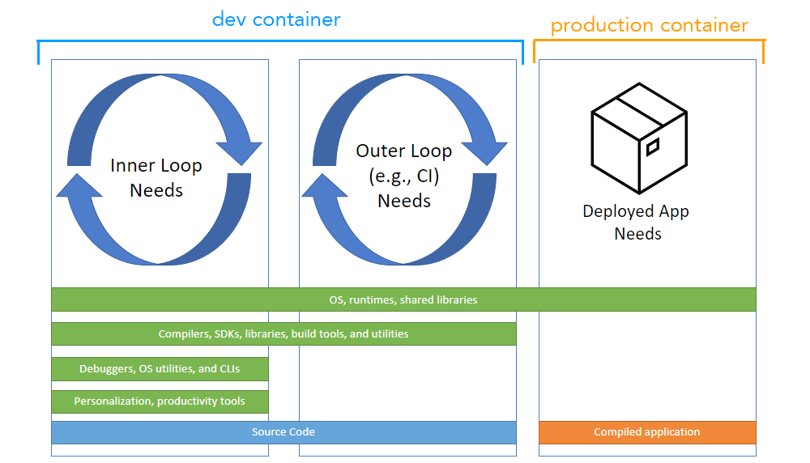

+++
title = "Dev Container CLI"
date = 2024-01-12T22:36:24+08:00
weight = 60
type = "docs"
description = ""
isCJKLanguage = true
draft = false
+++

> 原文: [https://code.visualstudio.com/docs/devcontainers/devcontainer-cli](https://code.visualstudio.com/docs/devcontainers/devcontainer-cli)

# Dev Container CLI


This topic covers the development container command-line interface (dev container CLI), which allows you to build and manage development containers, and is a companion to the [Development Containers Specification](https://containers.dev/).

​​	本主题介绍了开发容器命令行界面 (dev container CLI)，它允许您构建和管理开发容器，并且是开发容器规范的配套工具。

## [Development containers 开发容器]()

A consistent, predictable environment is key to a productive and enjoyable software development experience.

​​	一致且可预测的环境是高效且愉快的软件开发体验的关键。

Containers (for example [Docker](https://www.docker.com/) containers) have historically been used to standardize apps when they're deployed, but there's a great opportunity to support additional scenarios, including continuous integration (CI), test automation, and full-featured coding environments. A **development container** provides this working environment and ensures your project has the tools and software it needs, whether it's complex and distributed or just has a few requirements.

​​	容器（例如 Docker 容器）历来用于在部署应用时对其进行标准化，但支持其他方案（包括持续集成 (CI)、测试自动化和全功能编码环境）是一个很好的机会。开发容器提供了这种工作环境，并确保您的项目拥有所需的工具和软件，无论它是复杂且分布式的，还是仅有一些要求。



Development containers are supported in Visual Studio Code via the [Dev Containers](https://marketplace.visualstudio.com/items?itemName=ms-vscode-remote.remote-containers) extension and in [GitHub Codespaces](https://docs.github.com/codespaces/setting-up-your-project-for-codespaces/introduction-to-dev-containers). This support is backed by [devcontainer.json](https://containers.dev/implementors/json_reference), a structured JSON with Comments (jsonc) metadata format to configure a containerized environment.

​​	开发容器通过 Dev Containers 扩展在 Visual Studio Code 中受支持，并在 GitHub Codespaces 中受支持。此支持由 devcontainer.json 提供支持，devcontainer.json 是一种结构化的 JSON 带有注释 (jsonc) 元数据格式，用于配置容器化环境。

As containerizing production workloads becomes commonplace, dev containers have become broadly useful for scenarios beyond VS Code. To promote dev containers in any environment, work has started on the [Development Containers Specification](https://containers.dev/), which empowers anyone in any tool to configure a consistent dev environment. The open-source **dev container CLI** serves as the reference implementation of the specification.

​​	随着容器化生产工作负载变得司空见惯，开发容器已广泛适用于 VS Code 之外的场景。为了在任何环境中推广开发容器，已开始着手制定开发容器规范，该规范使任何人在任何工具中都能配置一致的开发环境。开源开发容器 CLI 充当该规范的参考实现。

## [The dev container CLI 开发容器 CLI]()

When tools like VS Code and Codespaces detect a `devcontainer.json` file in a user's project, they use a CLI to configure a dev container. The dev container CLI is a reference implementation so that individual users and other tools can read in `devcontainer.json` metadata and create dev containers from it.

​​	当 VS Code 和 Codespaces 等工具在用户的项目中检测到 `devcontainer.json` 文件时，它们会使用 CLI 来配置开发容器。开发容器 CLI 是一个参考实现，以便各个用户和其他工具可以读入 `devcontainer.json` 元数据并从中创建开发容器。

This CLI can either be used directly or integrated into product experiences, similar to how it's integrated with Dev Containers and Codespaces today. It currently supports both a simple single container option and integrates with [Docker Compose](https://docs.docker.com/compose/) for multi-container scenarios.

​​	此 CLI 可以直接使用，也可以集成到产品体验中，类似于它目前与 Dev Containers 和 Codespaces 集成的方式。它目前既支持简单的单容器选项，也与 Docker Compose 集成以用于多容器场景。

The CLI is available in the [devcontainers/cli](https://github.com/devcontainers/cli) repository.

​​	CLI 可在 devcontainers/cli 代码库中获得。

## [Installation 安装]()

You can quickly try out the CLI through the Dev Containers extension. Select the **Dev Containers: Install devcontainer CLI** command from the Command Palette (F1).

​​	您可以通过 Dev Containers 扩展快速试用 CLI。从命令面板（F1）中选择 Dev Containers：安装 devcontainer CLI 命令。

## [Alternate installation 备用安装]()

There are additional options for using the CLI elsewhere:

​​	还有其他选项可以在其他地方使用 CLI：

- Install its npm package
  安装其 npm 包

- Use the GitHub Action or Azure DevOps Task

  
  使用 GitHub Action 或 Azure DevOps Task

  - You may find these in [devcontainers/ci](https://github.com/devcontainers/ci)
    您可以在 devcontainers/ci 中找到这些

- Build the CLI repo from sources

  
  从源代码构建 CLI 存储库

  - You may learn more about building from sources in the [CLI repo's README](https://github.com/devcontainers/cli#try-it-out)
    您可以在 CLI 存储库的自述文件中了解有关从源代码构建的更多信息

On this page, we'll focus on using the npm package.

​​	在此页面中，我们将重点介绍如何使用 npm 包。

### [npm install]()

To install the npm package, you will need Python, Node.js (version 14 or greater), and C/C++ installed to build one of the dependencies. The VS Code [How to Contribute](https://github.com/microsoft/vscode/wiki/How-to-Contribute) wiki has details about the recommended toolsets.

​​	要安装 npm 包，您需要安装 Python、Node.js（版本 14 或更高版本）和 C/C++ 以构建其中一个依赖项。VS Code 如何贡献 wiki 中详细介绍了推荐的工具集。

```
npm install -g @devcontainers/cli
```

Verify you can run the CLI and see its help text:

​​	验证您可以运行 CLI 并查看其帮助文本：

```
devcontainer <command>

Commands:
  devcontainer up                   Create and run dev container
  devcontainer build [path]         Build a dev container image
  devcontainer run-user-commands    Run user commands
  devcontainer read-configuration   Read configuration
  devcontainer features             Features commands
  devcontainer templates            Templates commands
  devcontainer exec <cmd> [args..]  Execute a command on a running dev container

Options:
  --help     Show help                                                 [boolean]
  --version  Show version number                                       [boolean]
```

> **Note:** The `open` command to open your dev container will be listed if you installed the CLI via VS Code.
>
> ​​	注意：如果您通过 VS Code 安装了 CLI，则会列出打开开发容器的 `open` 命令。

## [Running the CLI 运行 CLI]()

Once you have the CLI, you can try it out with a sample project, like this [Rust sample](https://github.com/microsoft/vscode-remote-try-rust).

​​	获得 CLI 后，您可以使用示例项目（如此 Rust 示例）试用它。

Clone the Rust sample to your machine, and start a dev container with the CLI's `up` command:

​​	将 Rust 示例克隆到您的计算机，并使用 CLI 的 `up` 命令启动开发容器：

```
git clone https://github.com/microsoft/vscode-remote-try-rust
devcontainer up --workspace-folder <path-to-vscode-remote-try-rust>
```

This will download the container image from a container registry and start the container. Your Rust container should now be running:

​​	这会从容器注册表下载容器映像并启动容器。您的 Rust 容器现在应该正在运行：

```
[88 ms] dev-containers-cli 0.1.0.
[165 ms] Start: Run: docker build -f /home/node/vscode-remote-try-rust/.devcontainer/Dockerfile -t vsc-vscode-remote-try-rust-89420ad7399ba74f55921e49cc3ecfd2 --build-arg VARIANT=bullseye /home/node/vscode-remote-try-rust/.devcontainer
[+] Building 0.5s (5/5) FINISHED
 => [internal] load build definition from Dockerfile                       0.0s
 => => transferring dockerfile: 38B                                        0.0s
 => [internal] load .dockerignore                                          0.0s
 => => transferring context: 2B                                            0.0s
 => [internal] load metadata for mcr.microsoft.com/vscode/devcontainers/r  0.4s
 => CACHED [1/1] FROM mcr.microsoft.com/vscode/devcontainers/rust:1-bulls  0.0s
 => exporting to image                                                     0.0s
 => => exporting layers                                                    0.0s
 => => writing image sha256:39873ccb81e6fb613975e11e37438eee1d49c963a436d  0.0s
 => => naming to docker.io/library/vsc-vscode-remote-try-rust-89420ad7399  0.0s
[1640 ms] Start: Run: docker run --sig-proxy=false -a STDOUT -a STDERR --mount type=bind,source=/home/node/vscode-remote-try-rust,target=/workspaces/vscode-remote-try-rust -l devcontainer.local_folder=/home/node/vscode-remote-try-rust --cap-add=SYS_PTRACE --security-opt seccomp=unconfined --entrypoint /bin/sh vsc-vscode-remote-try-rust-89420ad7399ba74f55921e49cc3ecfd2-uid -c echo Container started
Container started
{"outcome":"success","containerId":"f0a055ff056c1c1bb99cc09930efbf3a0437c54d9b4644695aa23c1d57b4bd11","remoteUser":"vscode","remoteWorkspaceFolder":"/workspaces/vscode-remote-try-rust"}
```

You can then run commands in this dev container:

​​	然后，您可以在此开发容器中运行命令：

```
devcontainer exec --workspace-folder <path-to-vscode-remote-try-rust> cargo run
```

This will compile and run the Rust sample, outputting:

​​	这会编译并运行 Rust 示例，输出：

```
[33 ms] dev-containers-cli 0.1.0.
   Compiling hello_remote_world v0.1.0 (/workspaces/vscode-remote-try-rust)
    Finished dev [unoptimized + debuginfo] target(s) in 1.06s
     Running `target/debug/hello_remote_world`
Hello, VS Code Dev Containers!
{"outcome":"success"}
```

These steps above are also provided in the CLI repo's [README](https://github.com/devcontainers/cli/blob/main/README.md).

​​	上述步骤也在 CLI 存储库的自述文件中提供。

## [Automation 自动化]()

If you'd like to use the dev container CLI in your CI/CD builds or test automation, you can find examples of GitHub Actions and Azure DevOps Tasks in the [devcontainers/ci](https://github.com/devcontainers/ci) repository.

​​	如果您想在 CI/CD 构建或测试自动化中使用 dev 容器 CLI，可以在 devcontainers/ci 存储库中找到 GitHub Actions 和 Azure DevOps 任务的示例。

## [Pre-building 预构建]()

The `devcontainer build` command allows you to quickly build a dev container image following the same steps as used by the Dev Containers extension or GitHub Codespaces. This is particularly useful when you want to pre-build a dev container image using a CI or DevOps product like GitHub Actions.

​​	 `devcontainer build` 命令允许您按照 Dev Containers 扩展或 GitHub Codespaces 使用的相同步骤快速构建 dev 容器映像。当您想使用 CI 或 DevOps 产品（如 GitHub Actions）预构建 dev 容器映像时，这尤其有用。

`build` accepts a path to the folder containing a `.devcontainer` folder or `.devcontainer.json` file. For example, `devcontainer build --workspace-folder <my_repo>` will build the container image for `my_repo`.

​​	 `build` 接受包含 `.devcontainer` 文件夹或 `.devcontainer.json` 文件的文件夹的路径。例如， `devcontainer build --workspace-folder <my_repo>` 将为 `my_repo` 构建容器映像。

### [Example of building and publishing an image 构建和发布映像的示例]()

For example, you may want to pre-build a number of images that you then reuse across multiple projects or repositories. To do so, follow these steps:

​​	例如，您可能希望预构建一些映像，然后在多个项目或存储库中重复使用它们。为此，请按照以下步骤操作：

1. [Create]() a source code repository.

   ​​	创建源代码存储库。

2. Create dev container configuration for each image you want to pre-build, customizing as you wish (including [dev container Features]()). For example, consider this `devcontainer.json` file:

   ​​	为要预构建的每个映像创建 dev 容器配置，并根据需要进行自定义（包括 dev 容器功能）。例如，考虑此 `devcontainer.json` 文件：

   ```
   {
     "build": {
       "dockerfile": "Dockerfile"
     },
     "features": {
       "ghcr.io/devcontainers/features/docker-in-docker:1": {
         "version": "latest"
       }
     }
   }
   ```

3. Use the `devcontainer build` command to build the image and [push](https://docs.docker.com/engine/reference/commandline/push/) it to your image registry. See documentation for your image registry (such as [Azure Container Registry](https://learn.microsoft.com/azure/container-registry/container-registry-get-started-docker-cli?tabs=azure-cli), [GitHub Container Registry](https://docs.github.com/packages/working-with-a-github-packages-registry/working-with-the-container-registry#pushing-container-images), or [Docker Hub](https://docs.docker.com/engine/reference/commandline/push)) for information on image naming and additional steps like authentication.

   ​​	使用 `devcontainer build` 命令构建镜像并将其推送到您的镜像注册表。有关镜像命名和身份验证等其他步骤的信息，请参阅您的镜像注册表（例如 Azure 容器注册表、GitHub 容器注册表或 Docker Hub）的文档。

   ```
   devcontainer build --workspace-folder <my_repo> --push true --image-name <my_image_name>:<optional_image_version>
   ```

## [Avoiding problems with images built using Docker 避免使用 Docker 构建的映像出现问题]()

Given Dockerfiles and Docker Compose files can be used without VS Code or the `devcontainer` CLI, you may want to let users know that they should not try to build the image directly. You may learn more in the [advanced dev container documentation]().

​​	鉴于 Dockerfile 和 Docker Compose 文件可以在没有 VS Code 或 `devcontainer` CLI 的情况下使用，您可能希望让用户知道他们不应尝试直接构建镜像。您可以在高级开发容器文档中了解更多信息。

## [Templates and Features 模板和功能]()

You can work with dev container [Templates](https://containers.dev/implementors/templates/) and [Features](https://containers.dev/implementors/features/) using the dev container CLI. As you create and use Templates, you may want to publish them for others, which you may learn more about in the [dev container spec](https://containers.dev/implementors/templates-distribution/).

​​	您可以使用开发容器 CLI 来处理开发容器模板和功能。在创建和使用模板时，您可能希望将它们发布给其他人，您可以在开发容器规范中了解更多相关信息。

## [Feedback 反馈]()

The dev container CLI and specification are under active development and we welcome your feedback, which you can provide in [this issue](https://github.com/devcontainers/cli/issues/7), or through new issues and pull requests in the [devcontainers/cli](https://github.com/devcontainers/cli) repository.

​​	开发容器 CLI 和规范正在积极开发中，我们欢迎您的反馈，您可以在此问题中提供反馈，也可以在 devcontainers/cli 存储库中通过新问题和拉取请求提供反馈。

## [Next steps 后续步骤]()

- [Dev container specification repository](https://containers.dev/) - Read and contribute to the open specification.
  开发容器规范存储库 - 阅读并为开放规范做出贡献。
- [devcontainer.json reference](https://containers.dev/implementors/json_reference) - Review the `devcontainer.json` schema.
  devcontainer.json 参考 - 查看 `devcontainer.json` 架构。
- [Create a Development Container]() - Create a custom container for your work environment.
  创建开发容器 - 为您的工作环境创建一个自定义容器。
- [Advanced Containers]() - Find solutions to advanced container scenarios.
  高级容器 - 查找高级容器方案的解决方案。
