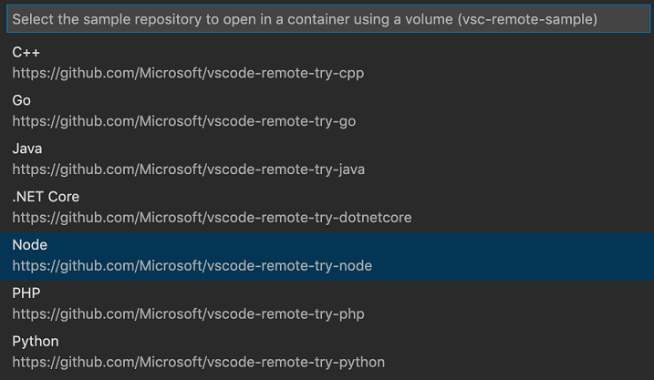

+++
title = "Overview"
date = 2024-01-12T22:36:24+08:00
weight = 1
type = "docs"
description = ""
isCJKLanguage = true
draft = false
+++

> 原文: [https://code.visualstudio.com/docs/devcontainers/containers](https://code.visualstudio.com/docs/devcontainers/containers)

# Developing inside a Container 容器内开发


The **Visual Studio Code Dev Containers** extension lets you use a container as a full-featured development environment. It allows you to open any folder inside (or mounted into) a container and take advantage of Visual Studio Code's full feature set. A [devcontainer.json file]() in your project tells VS Code how to access (or create) a **development container** with a well-defined tool and runtime stack. This container can be used to run an application or to separate tools, libraries, or runtimes needed for working with a codebase.

​​	Visual Studio Code Dev Containers 扩展允许您将容器用作全功能开发环境。它允许您在容器内（或挂载到容器内）打开任何文件夹，并利用 Visual Studio Code 的全套功能。项目中的 devcontainer.json 文件告诉 VS Code 如何访问（或创建）具有明确定义的工具和运行时堆栈的开发容器。此容器可用于运行应用程序或分离处理代码库所需工具、库或运行时。

Workspace files are mounted from the local file system or copied or cloned into the container. Extensions are installed and run inside the container, where they have full access to the tools, platform, and file system. This means that you can seamlessly switch your entire development environment just by connecting to a different container.

​​	工作区文件从本地文件系统挂载或复制或克隆到容器中。扩展安装并运行在容器内，在容器内它们可以完全访问工具、平台和文件系统。这意味着您只需连接到不同的容器，即可无缝切换整个开发环境。


This lets VS Code provide a **local-quality development experience** including full IntelliSense (completions), code navigation, and debugging **regardless of where your tools (or code) are located**.

​​	这使 VS Code 能够提供本地质量的开发体验，包括完整的 IntelliSense（完成）、代码导航和调试，而不管您的工具（或代码）位于何处。

The Dev Containers extension supports two primary operating models:

​​	Dev Containers 扩展支持两种主要的操作模型：

- You can use a container as your full-time development environment
  您可以将容器用作全职开发环境
- You can [attach to a running container]() to inspect it.
  您可以附加到正在运行的容器以检查它。

> **Note**: The Dev Containers extension supports the open Dev Containers Specification, which empowers anyone in any tool to configure a consistent dev environment. You can learn more in our [dev container FAQ]() and on the specification's site [containers.dev](https://containers.dev/).
>
> ​​	注意：Dev Containers 扩展支持开放的 Dev Containers 规范，该规范使任何工具中的任何人都能够配置一致的开发环境。您可以在我们的 dev 容器常见问题解答和规范网站 containers.dev 中了解更多信息。

## [Getting started 入门]()

> **Note**: You can learn how to get up-and-running quickly with dev containers in the introductory [Dev Containers tutorial]().
>
> ​​	注意：您可以在入门 Dev Containers 教程中了解如何快速启动并运行 dev 容器。

### [System requirements 系统要求]()

**Local / Remote Host:
本地/远程主机：**

You can use Docker with the Dev Containers extension in a few ways, including:

​​	您可以通过以下几种方式将 Docker 与 Dev Containers 扩展一起使用，包括：

- Docker installed locally.
  本地安装的 Docker。

- Docker installed on a remote environment.
  安装在远程环境中的 Docker。

- Other Docker compliant CLIs, installed locally or remotely.

  
  其他 Docker 兼容的 CLI，本地或远程安装。

  - While other CLIs may work, they are not officially supported. Note that [attaching to a Kubernetes cluster]() only requires a properly configured [kubectl CLI](https://kubernetes.io/docs/reference/kubectl/overview/).
    虽然其他 CLI 可能有效，但它们并未得到官方支持。请注意，附加到 Kubernetes 集群只需要正确配置的 kubectl CLI。

You can learn more in the [alternative Docker options doc]().

​​	您可以在替代 Docker 选项文档中了解更多信息。

Below are some specific ways you can configure Docker on a local or remote host:

​​	以下是一些在本地或远程主机上配置 Docker 的具体方法：

- **Windows:** [Docker Desktop](https://www.docker.com/products/docker-desktop) 2.0+ on Windows 10 Pro/Enterprise. Windows 10 Home (2004+) requires Docker Desktop 2.3+ and the [WSL 2 back-end](https://aka.ms/vscode-remote/containers/docker-wsl2). (Docker Toolbox is not supported. Windows container images are not supported.)
  Windows：Windows 10 专业版/企业版上的 Docker Desktop 2.0+。Windows 10 家庭版 (2004+) 需要 Docker Desktop 2.3+ 和 WSL 2 后端。（不支持 Docker Toolbox。不支持 Windows 容器映像。）
- **macOS**: [Docker Desktop](https://www.docker.com/products/docker-desktop) 2.0+.
  macOS：Docker Desktop 2.0+。
- **Linux**: [Docker CE/EE](https://docs.docker.com/install/#supported-platforms) 18.06+ and [Docker Compose](https://docs.docker.com/compose/install) 1.21+. (The Ubuntu snap package is not supported.)
  Linux：Docker CE/EE 18.06+ 和 Docker Compose 1.21+。（不支持 Ubuntu snap 软件包。）
- **Remote hosts:** 1 GB RAM is required, but at least 2 GB RAM and a 2-core CPU is recommended.
  远程主机：需要 1 GB RAM，但建议至少 2 GB RAM 和 2 核 CPU。

**Containers**:

​​	容器：

- x86_64 / ARMv7l (AArch32) / ARMv8l (AArch64) Debian 9+, Ubuntu 16.04+, CentOS / RHEL 7+
- x86_64 Alpine Linux 3.9+

Other `glibc` based Linux containers may work if they have [needed Linux prerequisites](https://code.visualstudio.com/docs/remote/linux).

​​	其他 `glibc` 基于 Linux 的容器可能有效，前提是它们具有所需的 Linux 先决条件。

### [Installation 安装]()

To get started, follow these steps:

​​	要开始，请按照以下步骤操作：

1. Install and configure [Docker](https://www.docker.com/get-started) for your operating system, using one of the paths below or an [alternative Docker option](), like Docker on a remote host or Docker compliant CLI.

   ​​	使用以下路径之一或备用 Docker 选项（如远程主机上的 Docker 或兼容 Docker 的 CLI）为您的操作系统安装并配置 Docker。

   **Windows / macOS**:

   ​​	Windows/macOS：

   1. Install [Docker Desktop for Windows/Mac](https://www.docker.com/products/docker-desktop).

      ​​	为 Windows/Mac 安装 Docker Desktop。

   2. If you are using WSL 2 on Windows, to ensure the [WSL 2 back-end](https://aka.ms/vscode-remote/containers/docker-wsl2) is enabled: Right-click on the Docker taskbar item and select **Settings**. Check **Use the WSL 2 based engine** and verify your distribution is enabled under **Resources > WSL Integration**.

      ​​	如果您在 Windows 上使用 WSL 2，请执行以下操作以确保启用 WSL 2 后端：右键单击 Docker 任务栏项并选择“设置”。选中“使用基于 WSL 2 的引擎”，并在“资源”>“WSL 集成”下验证您的发行版是否已启用。

   3. When not using the WSL 2 back-end, right-click on the Docker task bar item, select **Settings** and update **Resources > File Sharing** with any locations your source code is kept. See [tips and tricks]() for troubleshooting.

      ​​	不使用 WSL 2 后端时，右键单击 Docker 任务栏项，选择“设置”，然后使用源代码所在的任何位置更新“资源”>“文件共享”。请参阅疑难解答技巧和窍门。

   **Linux**:

   ​​	Linux：

   1. Follow the [official install instructions for Docker CE/EE for your distribution](https://docs.docker.com/install/#supported-platforms). If you are using Docker Compose, follow the [Docker Compose directions](https://docs.docker.com/compose/install/) as well.

      ​​	按照适用于您发行版的 Docker CE/EE 的官方安装说明进行操作。如果您使用 Docker Compose，也请按照 Docker Compose 说明进行操作。

   2. Add your user to the `docker` group by using a terminal to run: `sudo usermod -aG docker $USER`

      ​​	使用终端运行以下命令将您的用户添加到 `docker` 组： `sudo usermod -aG docker $USER`

   3. Sign out and back in again so your changes take effect.

      ​​	注销并重新登录，以便您的更改生效。

2. Install [Visual Studio Code](https://code.visualstudio.com/) or [Visual Studio Code Insiders](https://code.visualstudio.com/insiders/).

   ​​	安装 Visual Studio Code 或 Visual Studio Code Insiders。

3. Install the [Dev Containers extension](https://marketplace.visualstudio.com/items?itemName=ms-vscode-remote.remote-containers). If you plan to work with other remote extensions in VS Code, you may choose to install the [Remote Development extension pack](https://aka.ms/vscode-remote/download/extension).

   ​​	安装 Dev Containers 扩展。如果您计划在 VS Code 中使用其他远程扩展，可以选择安装远程开发扩展包。

### [Working with Git? 使用 Git？]()

Here are two tips to consider:

​​	这里有两个提示供您考虑：

- If you are working with the same repository both locally in Windows and inside a container, be sure to set up consistent line endings. See [tips and tricks]() for details.
  如果您在 Windows 本地和容器内使用同一个存储库，请务必设置一致的行尾。有关详细信息，请参阅提示和技巧。
- If you clone using a Git credential manager, your container should already have access to your credentials! If you use SSH keys, you can also opt in to sharing them. See [Sharing Git credentials with your container]() for details.
  如果您使用 Git 凭据管理器进行克隆，您的容器应该已经可以访问您的凭据！如果您使用 SSH 密钥，您还可以选择共享它们。有关详细信息，请参阅与容器共享 Git 凭据。

## [Picking your quick start 选择快速入门]()

This document includes 3 quick starts - we recommend starting with the one that fits your workflow and interests the best:

​​	本文档包含 3 个快速入门 - 我们建议您从最适合您的工作流且最能引起您兴趣的那个开始：

1. Want to try out a dev container in a quick sample repo? Check out [Quick start 1: Try a development container]().
   想在快速示例存储库中试用开发容器？请查看快速入门 1：试用开发容器。
2. Want to add a dev container to one of your existing locally cloned projects? Check out [Quick start 2: Open an existing folder in a container]().
   想为现有本地克隆项目之一添加开发容器？查看快速入门 2：在容器中打开现有文件夹。
3. Want to work with an isolated copy of a repo, i.e. to review a PR or investigate a branch without impacting your local work? Check out [Quick start 3: Open a git repo or PR in an isolated container volume]().
   想使用存储库的隔离副本，即查看 PR 或调查分支而不影响本地工作？查看快速入门 3：在隔离容器卷中打开 git 存储库或 PR。

## [Quick start: Try a development container 快速入门：试用开发容器]()

The easiest way to get started is to try one of the sample development containers. The [Containers tutorial]() will walk you through setting up Docker and the Dev Containers extension and let you select a sample:

​​	最简单的入门方法是试用其中一个示例开发容器。容器教程将指导您设置 Docker 和 Dev Containers 扩展，并让您选择一个示例：



> Note: If you already have VS Code and Docker installed, then you may use [open in dev container](https://vscode.dev/redirect?url=vscode://ms-vscode-remote.remote-containers/cloneInVolume?url=https://github.com/microsoft/vscode-remote-try-python). You can learn more about this and how to add it to your repos in the [create a dev container guide]().
>
> ​​	注意：如果您已安装 VS Code 和 Docker，则可以使用在开发容器中打开。您可以在创建开发容器指南中了解有关此功能的更多信息以及如何将其添加到您的存储库。

## [Quick start: Open an existing folder in a container 快速入门：在容器中打开现有文件夹]()

This quick start covers how to set up a dev container for an existing project to use as your full-time development environment using existing source code on your filesystem. Follow these steps:

​​	此快速入门介绍了如何为现有项目设置开发容器，以便使用文件系统上的现有源代码作为全职开发环境。请按照以下步骤操作：

1. Start VS Code, run the **Dev Containers: Open Folder in Container...** command from the Command Palette (F1) or quick actions Status bar item, and select the project folder you would like to set up the container for.

   ​​	启动 VS Code，从命令面板 (F1) 或快速操作状态栏项运行 Dev Containers：在容器中打开文件夹... 命令，然后选择要为其设置容器的项目文件夹。

   > **Tip:** If you want to edit the container's contents or settings before opening the folder, you can run **Dev Containers: Add Dev Container Configuration Files...** instead.
   >
   > ​​	提示：如果要在打开文件夹之前编辑容器的内容或设置，可以改为运行 Dev Containers：添加 Dev Container 配置文件...。

   

2. Now pick a starting point for your dev container. You can either select a base **Dev Container Template** from a filterable list, or use an existing [Dockerfile](https://docs.docker.com/engine/reference/builder/) or [Docker Compose file](https://docs.docker.com/compose/compose-file/#compose-file-structure-and-examples) if one exists in the folder you selected.

   ​​	现在为你的 dev 容器选择一个起点。你可以从可筛选列表中选择一个基本 Dev Container 模板，或者使用现有的 Dockerfile 或 Docker Compose 文件（如果在所选文件夹中存在）。

   > **Note:** When using Alpine Linux containers, some extensions may not work due to `glibc` dependencies in native code inside the extension.
   >
   > ​​	注意：在使用 Alpine Linux 容器时，某些扩展可能无法工作，因为扩展内部的本机代码中存在 `glibc` 依赖项。

   

   The list will be automatically sorted based on the contents of the folder you open.

   ​​	列表将根据你打开的文件夹的内容自动排序。

   You may be able to customize your dev container with additional Features, which [you can read more about below]().

   ​​	你可以使用其他功能来自定义你的 dev 容器，你可以在下面阅读更多相关信息。

   The dev container Templates displayed come from our [first-party and community index](https://containers.dev/templates), which is part of the [Dev Container Specification](https://containers.dev/). We host a set of Templates as part of the spec in the [devcontainers/templates repository](https://github.com/devcontainers/templates). You can browse the `src` folder of that repository to see the contents of each Template.

   ​​	显示的开发容器模板来自我们的第一方和社区索引，它是 Dev Container 规范的一部分。我们在 devcontainers/templates 存储库中作为规范的一部分托管了一组模板。您可以浏览该存储库的 `src` 文件夹以查看每个模板的内容。

   You can also choose to publish and distribute your own dev container Templates using the [dev container CLI](https://containers.dev/implementors/templates-distribution/).

   ​​	您还可以选择使用 dev container CLI 发布和分发您自己的 dev container 模板。

3. After picking the starting point for your container, VS Code will add the dev container configuration files to your project (`.devcontainer/devcontainer.json`).

   ​​	在为容器选择起点后，VS Code 会将 dev container 配置文件添加到您的项目 ( `.devcontainer/devcontainer.json` ) 中。

4. The VS Code window will reload and start building the dev container. A progress notification provides status updates. You only have to build a dev container the first time you open it; opening the folder after the first successful build will be much quicker.

   ​​	VS Code 窗口将重新加载并开始构建 dev container。进度通知提供状态更新。您只需在首次打开 dev container 时构建它；在首次成功构建后打开文件夹会快得多。

   

5. After the build completes, VS Code will automatically connect to the container.

   ​​	构建完成后，VS Code 将自动连接到容器。

You can now interact with your project in VS Code just as you could when opening the project locally. From now on, when you open the project folder, VS Code will automatically pick up and reuse your dev container configuration.

​​	您现在可以在 VS Code 中与您的项目进行交互，就像在本地打开项目时一样。从现在开始，当您打开项目文件夹时，VS Code 将自动获取并重新使用您的 dev container 配置。

> **Tip:** Want to use a remote Docker host? See the section on [opening a folder on a remote SSH host in a container]() for information.
>
> ​​	提示：想要使用远程 Docker 主机？请参阅有关在容器中打开远程 SSH 主机上的文件夹的部分以获取信息。

While using this approach to [bind mount](https://docs.docker.com/storage/bind-mounts/) the local filesystem into a container is convenient, it does have some performance overhead on Windows and macOS. There are [some techniques]() that you can apply to improve disk performance, or you can [open a repository in a container using an isolated container volume]() instead.

​​	虽然使用这种方法将本地文件系统绑定挂载到容器中很方便，但它确实会在 Windows 和 macOS 上产生一些性能开销。有一些技术可以应用于提高磁盘性能，或者您可以使用隔离容器卷在容器中打开存储库。

### [Open a WSL 2 folder in a container on Windows 在 Windows 上的容器中打开 WSL 2 文件夹]()

If you are using [Windows Subsystem for Linux v2 (WSL 2)](https://learn.microsoft.com/windows/wsl/wsl2-about) and have enabled [Docker Desktop's WSL 2 back-end](https://aka.ms/vscode-remote/containers/docker-wsl2), you can work with source code stored inside WSL!

​​	如果您正在使用适用于 Linux v2 的 Windows 子系统 (WSL 2) 并已启用 Docker Desktop 的 WSL 2 后端，则可以处理存储在 WSL 中的源代码！

Once the WSL 2 engine is enabled, you can either:

​​	启用 WSL 2 引擎后，您可以：

- Use the **Dev Containers: Reopen in Container** command from a folder already opened using the [WSL](https://aka.ms/vscode-remote/download/wsl) extension.
  使用“开发容器：重新在容器中打开”命令从已使用 WSL 扩展打开的文件夹中打开。
- Select **Dev Containers: Open Folder in Container...** from the Command Palette (F1) and choose a WSL folder using the local `\\wsl$` share (from the Windows side).
  从命令面板 (F1) 中选择“开发容器：在容器中打开文件夹...”并使用本地 `\\wsl$` 共享（从 Windows 端）选择 WSL 文件夹。

The rest of the quick start applies as-is! You can learn more about the [WSL extension in its documentation]().

​​	其余的快速入门照常适用！您可以在其文档中了解有关 WSL 扩展的更多信息。

### [Open a folder on a remote SSH host in a container 在容器中打开远程 SSH 主机上的文件夹]()

If you are using a Linux or macOS SSH host, you can use the [Remote - SSH]() and Dev Containers extensions together. You do not even need to have a Docker client installed locally.

​​	如果您使用的是 Linux 或 macOS SSH 主机，则可以同时使用 Remote - SSH 和 Dev Containers 扩展。您甚至无需在本地安装 Docker 客户端。

To do so:

​​	要执行此操作，请执行以下操作：

1. Follow the [installation]() and SSH [host setup]() steps for the Remote - SSH extension.
   按照 Remote - SSH 扩展的安装和 SSH 主机设置步骤操作。
2. **Optional:** Set up SSH [key based authentication]() to the server so you do not need to enter your password multiple times.
   可选：设置基于 SSH 密钥的身份验证到服务器，以便您无需多次输入密码。
3. [Install Docker]() on your SSH host. You do not need to install Docker locally.
   在您的 SSH 主机上安装 Docker。您无需在本地安装 Docker。
4. Follow the [quick start]() for the Remote - SSH extension to connect to a host and open a folder there.
   按照 Remote - SSH 扩展的快速入门指南连接到主机并在其中打开文件夹。
5. Use the **Dev Containers: Reopen in Container** command from the Command Palette (F1, Ctrl+Shift+P).
   从命令面板（F1、Ctrl+Shift+P）中使用 Dev Containers：在容器中重新打开命令。

The rest of the Dev Containers quick start applies as-is. You can learn more about the [Remote - SSH extension in its documentation](). You can also see the [Develop on a remote Docker host]() article for other options if this model does not meet your needs.

​​	Dev Containers 快速入门指南的其余部分照常适用。您可以在其文档中了解有关 Remote - SSH 扩展的更多信息。如果您不满足此模型的需求，还可以参阅在远程 Docker 主机上进行开发一文，了解其他选项。

### [Open a folder on a remote Tunnel host in a container 在容器中打开远程 Tunnel 主机上的文件夹]()

You can use the [Remote - Tunnels]() and Dev Containers extensions together to open a folder on your remote host inside of a container. You do not even need to have a Docker client installed locally. This is similar to the SSH host scenario above, but uses Remote - Tunnels instead.

​​	您可以同时使用 Remote - Tunnels 和 Dev Containers 扩展，以便在容器中打开远程主机上的文件夹。您甚至无需在本地安装 Docker 客户端。这类似于上述 SSH 主机方案，但使用的是 Remote - Tunnels。

To do so:

​​	要执行此操作，请执行以下操作：

1. Follow the [Getting Started]() instructions for the Remote - Tunnels extension.
   按照 Remote - Tunnels 扩展的入门说明进行操作。
2. [Install Docker]() on your tunnel host. You do not need to install Docker locally.
   在您的隧道主机上安装 Docker。您无需在本地安装 Docker。
3. Follow the [steps]() for the Remote - Tunnels extension to connect to a tunnel host and open a folder there.
   按照 Remote - Tunnels 扩展的步骤操作，以连接到隧道主机并在其中打开文件夹。
4. Use the **Dev Containers: Reopen in Container** command from the Command Palette (F1, Ctrl+Shift+P).
   从命令面板（F1、Ctrl+Shift+P）中使用 Dev Containers：在容器中重新打开命令。

The rest of the Dev Containers quick start applies as-is. You can learn more about the [Remote - Tunnels extension in its documentation](). You can also see the [Develop on a remote Docker host]() article for other options if this model does not meet your needs.

​​	Dev Containers 快速入门其余部分照常适用。您可以在其文档中了解有关 Remote - Tunnels 扩展的更多信息。如果您需要其他选项，也可以参阅在远程 Docker 主机上进行开发一文，以了解其他选项。

### [Open an existing workspace in a container 在容器中打开现有工作区]()

You can also follow a similar process to open a [VS Code multi-root workspace]() in a **single container** if the workspace only **references relative paths to sub-folders of the folder the `.code-workspace` file is in (or the folder itself).**

​​	如果工作区仅引用 `.code-workspace` 文件所在文件夹的子文件夹的相对路径（或文件夹本身），您还可以按照类似的过程在单个容器中打开 VS Code 多根工作区。

You can either:

​​	您可以：

- Use the **Dev Containers: Open Workspace in Container...** command.
  使用 Dev Containers: Open Workspace in Container... 命令。
- Use **File > Open Workspace...** once you have opened a folder that contains a `.code-workspace` file in a container.
  在容器中打开包含 `.code-workspace` 文件的文件夹后，使用文件 > 打开工作区...。

Once connected, you may want to **add the `.devcontainer` folder** to the workspace so you can easily edit its contents if it is not already visible.

​​	连接后，您可能希望将 `.devcontainer` 文件夹添加到工作区，以便在尚未显示该文件夹的情况下轻松编辑其内容。

Also note that, while you cannot use multiple containers for the same workspace in the same VS Code window, you can use [multiple Docker Compose managed containers at once]() from separate windows.

​​	另请注意，虽然您无法在同一个 VS Code 窗口中为同一个工作区使用多个容器，但您可以从不同的窗口同时使用多个 Docker Compose 管理的容器。

## [Quick start: Open a Git repository or GitHub PR in an isolated container volume 快速入门：在隔离的容器卷中打开 Git 存储库或 GitHub PR]()

While you can [open a locally cloned repository in a container](), you may want to work with an isolated copy of a repository for a PR review or to investigate another branch without impacting your work.

​​	虽然您可以在容器中打开本地克隆的存储库，但您可能希望使用存储库的隔离副本进行公关审查或调查另一个分支，而不会影响您的工作。

Repository Containers use isolated, local Docker volumes instead of binding to the local filesystem. In addition to not polluting your file tree, local volumes have the added benefit of improved performance on Windows and macOS. (See Advanced Configuration [Improve disk performance]() article for information on how to use these types of volumes in other scenarios.)

​​	存储库容器使用隔离的本地 Docker 卷，而不是绑定到本地文件系统。除了不会污染您的文件树之外，本地卷还具有在 Windows 和 macOS 上提高性能的额外好处。（请参阅高级配置改进磁盘性能文章，了解如何在其他场景中使用这些类型的卷。）

For example, follow these steps to open one of the "try" repositories in a Repository Container:

​​	例如，按照以下步骤在存储库容器中打开一个“try”存储库：

1. Start VS Code and run **Dev Containers: Clone Repository in Container Volume...** from the Command Palette (F1).

   ​​	启动 VS Code 并运行开发容器：从命令面板（F1）中克隆容器卷中的存储库...。

2. Enter `microsoft/vscode-remote-try-node` (or one of the other "try" repositories), a Git URI, a GitHub branch URL, or a GitHub PR URL in the input box that appears and press Enter.

   ​​	在出现的输入框中输入 `microsoft/vscode-remote-try-node` （或其他“try”存储库）、Git URI、GitHub 分支 URL 或 GitHub 公关 URL，然后按 Enter。

   

   > **Tip:** If you choose a private repository, you may want to setup a credential manager or add your SSH keys to your SSH agent. See [Sharing Git credentials with your container]().
   >
   > ​​	提示：如果您选择私有存储库，您可能希望设置凭据管理器或将 SSH 密钥添加到 SSH 代理。请参阅与容器共享 Git 凭据。

3. If your repository does not have a `.devcontainer/devcontainer.json` file in it, you'll be asked to pick a starting point from a filterable list or an existing [Dockerfile](https://docs.docker.com/engine/reference/builder/) or [Docker Compose file](https://docs.docker.com/compose/compose-file/#compose-file-structure-and-examples) (if one exists).

   ​​	如果您的存储库中没有 `.devcontainer/devcontainer.json` 文件，系统会要求您从可筛选列表或现有 Dockerfile 或 Docker Compose 文件（如果存在）中选择一个起始点。

   > **Note:** When using Alpine Linux containers, some extensions may not work due to `glibc` dependencies in native code inside the extension.
   >
   > ​​	注意：在使用 Alpine Linux 容器时，某些扩展可能无法工作，因为扩展内部的本机代码中存在 `glibc` 依赖项。

   

   The list will be automatically sorted based on the contents of the folder you open. The dev container Templates displayed come from our [first-party and community index](https://containers.dev/templates), which is part of the [Dev Container Specification](https://containers.dev/). We host a set of Templates as part of the spec in the [devcontainers/templates repository](https://github.com/devcontainers/templates). You can browse the `src` folder of that repository to see the contents of each Template.

   ​​	列表会根据您打开的文件夹的内容自动排序。显示的开发容器模板来自我们的第一方和社区索引，它是开发容器规范的一部分。我们作为规范的一部分在 devcontainers/templates 存储库中托管一组模板。您可以浏览该存储库的 `src` 文件夹以查看每个模板的内容。

4. The VS Code window (instance) will reload, clone the source code, and start building the dev container. A progress notification provides status updates.

   ​​	VS Code 窗口（实例）将重新加载、克隆源代码并开始构建开发容器。进度通知提供状态更新。

   

   If you pasted in a GitHub pull request URL in step 2, the PR will be automatically checked out and the [GitHub Pull Requests](https://marketplace.visualstudio.com/items?itemName=GitHub.vscode-pull-request-github) extension will be installed in the container. The extension provides additional PR related features like a PR explorer, interacting with PR comments inline, and status bar visibility.

   ​​	如果您在步骤 2 中粘贴了 GitHub 拉取请求 URL，系统会自动签出 PR，并且 GitHub 拉取请求扩展将安装在容器中。该扩展提供其他 PR 相关功能，例如 PR 浏览器、与 PR 评论进行交互以及状态栏可见性。

   

5. After the build completes, VS Code will automatically connect to the container. You can now work with the repository source code in this independent environment as you would if you had cloned the code locally.

   ​​	构建完成后，VS Code 将自动连接到容器。您现在可以在此独立环境中使用存储库源代码，就像在本地克隆代码一样。

Note that if the container fails to come up due to something like a Docker build error, you can select **Reopen in Recovery Container** in the dialog that appears to go into a "recovery container" that allows you to edit your Dockerfile or other content. This opens the docker volume with the cloned repository in a minimal container and shows you the creation log. Once you are done fixing, use **Reopen in Container** to retry.

​​	请注意，如果由于 Docker 构建错误等原因导致容器无法启动，则可以选择在出现的对话框中选择“在恢复容器中重新打开”，以进入“恢复容器”，以便您编辑 Dockerfile 或其他内容。这将在极简容器中打开克隆存储库的 docker 卷，并向您显示创建日志。修复完成后，使用“在容器中重新打开”重试。

> **Tip:** Want to use a remote Docker host? See the section on [opening a folder on a remote SSH host in a container]() for information.
>
> ​​	提示：想要使用远程 Docker 主机？请参阅有关在容器中打开远程 SSH 主机上的文件夹的部分以获取信息。

## [Trusting your Workspace 信任您的工作区]()

Visual Studio Code takes security seriously and wants to help you safely browse and edit code no matter the source or original authors. The [Workspace Trust feature]() lets you decide whether your project folders should allow or restrict automatic code execution.

​​	Visual Studio Code 非常重视安全性，并希望帮助您安全地浏览和编辑代码，无论其来源或原始作者是谁。工作区信任功能可让您决定项目文件夹是否应允许或限制自动代码执行。

The Dev Containers extension has adopted Workspace Trust. Depending on how you open and interact with your source code, you'll be prompted to decide if you trust the code you're editing or executing at different points.

​​	Dev Containers 扩展已采用工作区信任。根据您打开和与源代码交互的方式，系统会提示您决定是否信任您在不同时间点编辑或执行的代码。

### [Reopen folder in container 在容器中重新打开文件夹]()

[Setting up a dev container for an existing project]() requires trusting the local (or WSL) folder. You will be asked to trust the local (or WSL) folder before the window reloads.

​​	为现有项目设置开发容器需要信任本地（或 WSL）文件夹。在窗口重新加载之前，系统会要求您信任本地（或 WSL）文件夹。

There are a couple of exceptions to this flow:

​​	此流程有几个例外：

1. When clicking on a recent entry.
   单击最近的条目时。
2. Using the **Open Folder in Container** command will ask for trust after the window reloads, if trust is not already given.
   使用“在容器中打开文件夹”命令将在窗口重新加载后询问信任，如果尚未给予信任。

### [Attach to existing container 附加到现有容器]()

When [attaching to an existing container](), you will be asked to confirm that attaching means you trust the container. This is only confirmed once.

​​	附加到现有容器时，系统会要求您确认附加意味着您信任该容器。仅确认一次。


### [Clone repository in a volume 在卷中克隆存储库]()

When [cloning a repository in a container volume](), you are asked to confirm that cloning a repository means you trust the repository. This is only confirmed once.

​​	在容器卷中克隆存储库时，系统会要求您确认克隆存储库意味着您信任该存储库。仅确认一次。


### [Inspect volume 检查卷]()

[Inspecting a volume]() starts in [Restricted Mode](), and you can trust the folder inside the container.

​​	检查卷时会以受限模式启动，您可信任容器内的文件夹。

### [Docker daemon running remotely Docker 守护程序远程运行]()

This implies trusting [the machine the Docker daemon runs on](). There are no additional prompts to confirm (only those listed for the local/WSL case above).

​​	这意味着信任运行 Docker 守护程序的计算机。没有其他确认提示（仅有上面列出的适用于本地/WSL 的提示）。

## [Create a devcontainer.json file 创建 devcontainer.json 文件]()

VS Code's container configuration is stored in a [devcontainer.json](https://containers.dev/implementors/json_reference) file. This file is similar to the `launch.json` file for debugging configurations, but is used for launching (or attaching to) your development container instead. You can also specify any extensions to install once the container is running or post-create commands to prepare the environment. The dev container configuration is either located under `.devcontainer/devcontainer.json` or stored as a `.devcontainer.json` file (note the dot-prefix) in the root of your project.

​​	VS Code 的容器配置存储在 devcontainer.json 文件中。此文件类似于用于调试配置的 `launch.json` 文件，但用于启动（或附加到）您的开发容器。您还可以指定在容器运行后要安装的任何扩展或准备环境的后创建命令。开发容器配置位于 `.devcontainer/devcontainer.json` 下或存储为 `.devcontainer.json` 文件（注意点前缀）在项目的根目录中。

Selecting the **Dev Containers: Add Dev Container Configuration Files...** command from the Command Palette (F1) will add the needed files to your project as a starting point, which you can further customize for your needs. The command lets you pick a pre-defined container configuration from a list based on your folder's contents, reuse an existing Dockerfile, or reuse an existing Docker Compose file.

​​	从命令面板（F1）中选择“开发容器：添加开发容器配置文件...”命令将把所需的文件作为起点添加到您的项目中，您可以进一步根据您的需要自定义这些文件。该命令允许您根据文件夹的内容从列表中选择预定义的容器配置，重复使用现有的 Dockerfile 或重复使用现有的 Docker Compose 文件。


You can also create a devcontainer.json by hand and use any image, Dockerfile, or set of Docker Compose files as a starting point. Here is a simple example that uses one of the pre-built [Development Container images](https://github.com/devcontainers/images/tree/main/src/typescript-node):

​​	您还可以手动创建一个 devcontainer.json，并使用任何映像、Dockerfile 或一组 Docker Compose 文件作为起点。以下是一个使用预构建的开发容器映像之一的简单示例：

```
{
  "image": "mcr.microsoft.com/devcontainers/typescript-node",
  "forwardPorts": [3000],
  "customizations": {
    // Configure properties specific to VS Code.
    "vscode": {
      // Add the IDs of extensions you want installed when the container is created.
      "extensions": ["streetsidesoftware.code-spell-checker"]
    }
  }
}
```

> **Note:** Additional configuration will already be added to the container based on what's in the base image. For example, we add the `streetsidesoftware.code-spell-checker` extension above, and the container will also include `"dbaeumer.vscode-eslint"` as [that's part of `mcr.microsoft.com/devcontainers/typescript-node`](https://github.com/devcontainers/images/blob/main/src/javascript-node/.devcontainer/devcontainer.json#L27). This happens automatically when pre-building using `devcontainer.json`, which you may read more about in the [pre-build section]().
>
> ​​	注意：将根据基本映像中的内容向容器添加其他配置。例如，我们在上面添加了 `streetsidesoftware.code-spell-checker` 扩展，并且容器还将包含 `"dbaeumer.vscode-eslint"` ，因为它是 `mcr.microsoft.com/devcontainers/typescript-node` 的一部分。在使用 `devcontainer.json` 预构建时会自动发生这种情况，您可以在预构建部分中阅读更多相关信息。

To learn more about creating `devcontainer.json` files, see [Create a Development Container]().

​​	要了解有关创建 `devcontainer.json` 文件的更多信息，请参阅创建开发容器。

## [Dev Container Features 开发容器功能]()

Development container "Features" are self-contained, shareable units of installation code and dev container configuration. The name comes from the idea that referencing one of them allows you to quickly and easily add more tooling, runtime, or library "Features" into your development container for use by you or your collaborators.

​​	开发容器“功能”是独立的、可共享的安装代码和开发容器配置单元。其名称源自这样一个理念：引用其中一个功能可以让您快速轻松地将更多工具、运行时或库“功能”添加到您的开发容器中，供您或您的协作者使用。

When you use **Dev Containers: Add Dev Container Configuration Files**, you're presented a list of scripts to customize the existing dev container configurations, such as installing Git or the Azure CLI:

​​	当您使用“开发容器：添加开发容器配置文件”时，您会看到一个脚本列表，用于自定义现有的开发容器配置，例如安装 Git 或 Azure CLI：


When you rebuild and reopen in your container, the Features you selected will be available in your `devcontainer.json`:

​​	在容器中重新生成并重新打开后，您选择的“功能”将可在您的 `devcontainer.json` 中使用：

```
"features": {
    "ghcr.io/devcontainers/features/github-cli:1": {
        "version": "latest"
    }
}
```

You'll get IntelliSense when editing the `"features"` property in the `devcontainer.json` directly:

​​	在 `devcontainer.json` 中直接编辑 `"features"` 属性时，您将获得 IntelliSense：


The **Dev Containers: Configure Container Features** command allows you to update an existing configuration.

​​	“开发容器：配置容器功能”命令允许您更新现有配置。

The Features sourced in VS Code UI now come from a central index, which you can also contribute to. See the [Dev Containers specification site](https://containers.dev/features) for the current list, and to [learn how to publish and distribute Features](https://containers.dev/implementors/features-distribution/).

​​	VS Code UI 中获取的功能现在来自一个中心索引，您也可以对此索引做出贡献。请参阅“开发容器”规范网站以获取当前列表，并了解如何发布和分发功能。

### ["Always installed" Features “始终安装”的功能]()

Similar to how you can [set extensions to always be installed]() in your dev container, you can use the `dev.containers.defaultFeatures` User [setting]() to set Features you'd always like installed:

​​	与您可以设置扩展以始终安装在您的开发容器中类似，您可以使用 `dev.containers.defaultFeatures` 用户设置来设置您始终希望安装的功能：

```
"dev.containers.defaultFeatures": {
    "ghcr.io/devcontainers/features/github-cli:1": {}
},
```

### [Creating your own Feature 创建您自己的功能]()

It's also easy to create and publish your own Dev Container Features. Published Features can be stored and shared as [OCI Artifacts](https://github.com/opencontainers/artifacts) from any supporting public or private container registry. You can see the list of current published Features on [containers.dev](https://containers.dev/features).

​​	创建和发布您自己的开发容器功能也很容易。已发布的功能可以存储在任何支持的公共或私有容器注册表中并作为 OCI 工件进行共享。您可以在 containers.dev 上查看当前已发布功能的列表。

A Feature is a self contained entity in a folder with at least a `devcontainer-feature.json` and `install.sh` entrypoint script:

​​	功能是一个独立的实体，位于至少包含 `devcontainer-feature.json` 和 `install.sh` 入口点脚本的文件夹中：

```
+-- feature
|    +-- devcontainer-feature.json
|    +-- install.sh
|    +-- (other files)
```

Check out the [feature/starter](https://github.com/devcontainers/feature-starter) repository for instructions on using the dev container CLI to publish your own public or private Features.

​​	查看 feature/starter 存储库，了解有关使用开发容器 CLI 发布您自己的公共或私有功能的说明。

### [Features specification and distribution 功能规范和分发]()

Features are a key part of the open-source [Development Containers Specification](https://containers.dev/). You can review [more information about how Features work](https://containers.dev/implementors/features) and their [distribution](https://containers.dev/implementors/features-distribution).

​​	功能是开源开发容器规范的关键部分。您可以查看有关功能的工作方式及其分发的更多信息。

## [Pre-building dev container images 预构建开发容器映像]()

We recommend pre-building images with the tools you need rather than creating and building a container image each time you open your project in a dev container. Using pre-built images will result in a faster container startup, simpler configuration, and allows you to pin to a specific version of tools to improve supply-chain security and avoid potential breaks. You can automate pre-building your image by scheduling the build using a DevOps or continuous integration (CI) service like GitHub Actions.

​​	我们建议预先构建包含您所需工具的映像，而不是在每次在开发容器中打开项目时创建和构建容器映像。使用预构建的映像将导致容器启动更快、配置更简单，并允许您固定到特定版本的工具以提高供应链安全性并避免潜在中断。您可以通过使用 DevOps 或持续集成 (CI) 服务（如 GitHub Actions）安排构建来自动预构建映像。

Even better - pre-built images can contain Dev Container metadata so when you reference an image, settings will be pulled across automatically.

​​	更好的是 - 预构建的映像可以包含开发容器元数据，因此当您引用映像时，设置将自动提取。

We recommend using the [Dev Container CLI]() (or other [specification](https://containers.dev/) supporting utilities like the [GitHub Action](https://github.com/marketplace/actions/devcontainers-ci)) to pre-build your images since it is kept in sync with the Dev Containers extension's latest capabilities - including [dev container Features](). Once you've built your image, you can push it to a container registry (like the [Azure Container Registry](https://learn.microsoft.com/azure/container-registry/container-registry-get-started-docker-cli?tabs=azure-cli), [GitHub Container Registry](https://docs.github.com/packages/working-with-a-github-packages-registry/working-with-the-container-registry#pushing-container-images), or [Docker Hub](https://docs.docker.com/engine/reference/commandline/push)) and reference it directly.

​​	我们建议使用开发容器 CLI（或其他支持规范的实用程序，如 GitHub Action）来预构建映像，因为它与开发容器扩展的最新功能（包括开发容器功能）保持同步。构建映像后，您可以将其推送到容器注册表（如 Azure 容器注册表、GitHub 容器注册表或 Docker Hub）并直接引用它。

You can use the GitHub Action in the [devcontainers/ci](https://github.com/devcontainers/ci) repository to help you reuse dev containers in your workflows.

​​	您可以在 devcontainers/ci 存储库中使用 GitHub Action 来帮助您在工作流中重复使用开发容器。

Go to the [dev container CLI article on pre-building images]() for more information.

​​	有关更多信息，请参阅 dev 容器 CLI 文章，了解如何预构建映像。

### [Inheriting metadata 继承元数据]()

You can include Dev Container configuration and Feature metadata in prebuilt images via [image labels](https://docs.docker.com/config/labels-custom-metadata/). This makes the image self-contained since these settings are automatically picked up when the image is referenced - whether directly, in a `FROM` in a referenced Dockerfile, or in a Docker Compose file. This helps prevent your Dev Container config and image contents from getting out of sync, and allows you to push updates of the same configuration to multiple repositories through a simple image reference.

​​	您可以通过映像标签在预构建映像中包含 Dev 容器配置和功能元数据。这使得映像自包含，因为在引用映像时会自动选取这些设置 - 无论是直接引用、在引用的 Dockerfile 中的 `FROM` 中引用，还是在 Docker Compose 文件中引用。这有助于防止您的 Dev 容器配置和映像内容不同步，并允许您通过简单的映像引用将同一配置的更新推送到多个存储库。

This metadata label is **automatically added** when you pre-build using the [Dev Container CLI]() (or other [specification](https://containers.dev/) supporting utilities like the [GitHub Action](https://github.com/marketplace/actions/devcontainers-ci) or [Azure DevOps task](https://marketplace.visualstudio.com/items?itemName=devcontainers.ci)) and includes settings from `devcontainer.json` and any referenced Dev Container Features.

​​	当您使用 Dev 容器 CLI（或其他支持规范的实用程序，如 GitHub Action 或 Azure DevOps 任务）进行预构建时，会自动添加此元数据标签，其中包括 `devcontainer.json` 和任何引用的 Dev 容器功能的设置。

This allows you to have a separate **more complex** `devcontainer.json` you use to pre-build your image, and then a dramatically **simplified one** in one or more repositories. The contents of the image will be merged with this simplified `devcontainer.json` content at the time you create the container (go to [the spec](https://containers.dev/implementors/spec/#merge-logic) for information on merge logic). But at its simplest, you can just reference the image directly in `devcontainer.json` for the settings to take effect:

​​	这允许您拥有一个单独的更复杂的 `devcontainer.json` ，用于预构建您的映像，然后在多个存储库中拥有一个显著简化的映像。在您创建容器时，映像的内容将与这个简化的 `devcontainer.json` 内容合并（请转到规范以获取有关合并逻辑的信息）。但最简单的方法是，您只需在 `devcontainer.json` 中直接引用映像，即可使设置生效：

```
{
  "image": "mcr.microsoft.com/devcontainers/go:1"
}
```

Note that you can also opt to manually add metadata to an image label instead. These properties will be picked up even if you didn't use the Dev Container CLI to build (and can be updated by the CLI even if you do). For example, consider this Dockerfile snippet:

​​	请注意，您还可以选择手动向映像标签添加元数据。即使您没有使用 Dev Container CLI 进行构建（并且即使您使用，也可以由 CLI 更新），这些属性也会被选取。例如，考虑以下 Dockerfile 代码段：

```
LABEL devcontainer.metadata='[{ \
  "capAdd": [ "SYS_PTRACE" ], \
  "remoteUser": "devcontainer", \
  "postCreateCommand": "yarn install" \
}]'
```

## [Inspecting volumes 检查卷]()

Occasionally you may run into a situation where you are using a Docker named volume that you want to inspect or make changes in. You can use VS Code to work with these contents without creating or modifying `devcontainer.json` file by selecting the **Dev Containers: Explore a Volume in a Dev Container...** from the Command Palette (F1).

​​	有时，您可能会遇到使用 Docker 命名卷的情况，您希望检查或更改该卷。您可以使用 VS Code 处理这些内容，而无需创建或修改 `devcontainer.json` 文件，方法是从命令面板 (F1) 中选择“Dev Containers: 在 Dev Container 中浏览卷...” 。

You can also inspect your volumes in the Remote Explorer. Make sure you have Containers selected in the dropdown, then you'll notice a **Dev Volumes** section. You can right-click on a volume to inspect its creation information, like when the volume was created, what repository was cloned into it, and the mountpoint. You can also explore it in a dev container.

​​	您还可以在远程资源管理器中检查您的卷。确保在下拉列表中选择了容器，然后您会注意到一个开发卷部分。您可以右键单击卷以检查其创建信息，例如卷的创建日期、克隆到其中的存储库以及装入点。您还可以在开发容器中对其进行浏览。


If you have the [Docker extension](https://marketplace.visualstudio.com/items?itemName=ms-azuretools.vscode-docker) installed, you can right-click on a volume in the **Volumes** section of the **Docker Explorer** and select **Explore in a Development Container**.

​​	如果您安装了 Docker 扩展，则可以在 Docker Explorer 的卷部分右键单击卷，然后选择在开发容器中浏览。


## [Managing extensions 管理扩展]()

VS Code runs extensions in one of two places: locally on the UI / client side, or in the container. While extensions that affect the VS Code UI, like themes and snippets, are installed locally, most extensions will reside inside a particular container. This allows you to install only the extensions you need for a given task in a container and seamlessly switch your entire tool-chain just by connecting to a new container.

​​	VS Code 在两个位置之一运行扩展：本地 UI/客户端或容器中。虽然影响 VS Code UI 的扩展（如主题和代码段）是本地安装的，但大多数扩展将驻留在特定容器中。这允许您仅安装容器中给定任务所需的扩展，并且只需连接到新容器即可无缝切换整个工具链。

If you install an extension from the Extensions view, it will automatically be installed in the correct location. You can tell where an extension is installed based on the category grouping. There will be a **Local - Installed** category and also one for your container.

​​	如果您从扩展视图安装扩展，它将自动安装在正确的位置。您可以根据类别分组来判断扩展安装在何处。将有一个本地 - 已安装类别，还有一个用于您的容器的类别。


> **Note:** If you are an extension author and your extension is not working properly or installs in the wrong place, see [Supporting Remote Development](https://code.visualstudio.com/api/advanced-topics/remote-extensions) for details.
>
> ​​	注意：如果您是扩展作者，并且您的扩展无法正常工作或安装在错误的位置，请参阅支持远程开发以了解详细信息。

Local extensions that actually need to run remotely will appear **Disabled** in the **Local - Installed** category. Select **Install** to install an extension on your remote host.

​​	实际上需要远程运行的本地扩展将显示在本地 - 已安装类别中已禁用。选择安装以在您的远程主机上安装扩展。


You can also install all locally installed extensions inside the Dev Container by going to the Extensions view and selecting **Install Local Extensions in Dev Container: {Name}** using the cloud button at the right of the **Local - Installed** title bar. This will display a dropdown where you can select which locally installed extensions to install in your container.

​​	您还可以通过转到扩展视图并使用本地 - 已安装标题栏右侧的云按钮选择在开发容器中安装本地扩展：{名称}来安装开发容器内所有本地安装的扩展。这将显示一个下拉菜单，您可以在其中选择要在容器中安装哪些本地安装的扩展。


However, some extensions may require you to [install additional software]() in the container. Consult extension documentation for details if you encounter issues.

​​	但是，某些扩展可能要求您在容器中安装其他软件。如果您遇到问题，请查阅扩展文档以了解详细信息。

### [Adding an extension to devcontainer.json 将扩展添加到 devcontainer.json]()

While you can edit your [devcontainer.json]() file by hand to add a list of extension IDs, you can also right-click on any extension in the Extensions view and select **Add to devcontainer.json**.

​​	虽然您可以手动编辑 devcontainer.json 文件以添加扩展 ID 列表，但您也可以在“扩展”视图中右键单击任何扩展，然后选择“添加到 devcontainer.json”。


### ["Always installed" extensions “始终安装”扩展]()

If there are extensions that you would like always installed in any container, you can update the `dev.containers.defaultExtensions` User [setting](). For example, if you wanted to install the [GitLens](https://marketplace.visualstudio.com/items?itemName=eamodio.gitlens) and [Resource Monitor](https://marketplace.visualstudio.com/items?itemName=mutantdino.resourcemonitor) extensions, you would specify their extension IDs as follows:

​​	如果您希望始终在任何容器中安装扩展，则可以更新 `dev.containers.defaultExtensions` 用户设置。例如，如果您想安装 GitLens 和资源监视器扩展，则可以按如下方式指定它们的扩展 ID：

```
"dev.containers.defaultExtensions": [
    "eamodio.gitlens",
    "mutantdino.resourcemonitor"
]
```

### [Advanced: Forcing an extension to run locally or remotely 高级：强制扩展在本地或远程运行]()

Extensions are typically designed and tested to either run locally or remotely, not both. However, if an extension supports it, you can force it to run in a particular location in your `settings.json` file.

​​	扩展通常被设计和测试为在本地或远程运行，而不是两者兼而有之。但是，如果扩展支持，您可以在 `settings.json` 文件中强制它在特定位置运行。

For example, the setting below will force the [Docker](https://marketplace.visualstudio.com/items?itemName=ms-azuretools.vscode-docker) extension to run locally and [Remote - SSH: Editing Configuration Files](https://marketplace.visualstudio.com/items?itemName=ms-vscode-remote.remote-ssh-edit) extension to run remotely instead of their defaults:

​​	例如，以下设置将强制 Docker 扩展在本地运行，而远程 - SSH：编辑配置文件扩展在远程运行，而不是其默认设置：

```
"remote.extensionKind": {
    "ms-azuretools.vscode-docker": [ "ui" ],
    "ms-vscode-remote.remote-ssh-edit": [ "workspace" ]
}
```

A value of `"ui"` instead of `"workspace"` will force the extension to run on the local UI/client side instead. Typically, this should only be used for testing unless otherwise noted in the extension's documentation since it **can break extensions**. See the section on [preferred extension location](https://code.visualstudio.com/api/advanced-topics/extension-host#preferred-extension-location) for details.

​​	值 `"ui"` 而不是 `"workspace"` 将强制扩展在本地 UI/客户端端运行。通常，除非扩展的文档中另有说明，否则仅应将其用于测试，因为它可能会破坏扩展。有关详细信息，请参阅首选扩展位置部分。

## [Forwarding or publishing a port 转发或发布端口]()

Containers are separate environments, so if you want to access a server, service, or other resource inside your container, you will need to either "forward" or "[publish](https://stackoverflow.com/a/22150099)" the port to your host. You can either configure your container to always expose these ports or just forward them temporarily.

​​	容器是独立的环境，因此，如果您想访问容器内的服务器、服务或其他资源，则需要将端口“转发”或“发布”到您的主机。您可以将容器配置为始终公开这些端口，也可以暂时转发这些端口。

### [Always forwarding a port 始终转发端口]()

You can specify a list of ports you **always** want to forward when attaching or opening a folder in container by using the `forwardPorts` property in `devcontainer.json`.

​​	您可以在容器中附加或打开文件夹时，使用 `devcontainer.json` 中的 `forwardPorts` 属性指定始终要转发的端口列表。

```
"forwardPorts": [3000, 3001]
```

Simply reload / reopen the window and the setting will be applied when VS Code connects to the container.

​​	只需重新加载/重新打开窗口，当 VS Code 连接到容器时，该设置将被应用。

### [Temporarily forwarding a port 临时转发端口]()

If you need to access a port that you didn't add to `devcontainer.json` or publish in your Docker Compose file, you can **temporarily forward** a new port for the duration of the session by running the **Forward a Port** command from the Command Palette (F1).

​​	如果您需要访问未添加到 `devcontainer.json` 或未在 Docker Compose 文件中发布的端口，您可以通过从命令面板 (F1) 运行转发端口命令，在会话期间临时转发新端口。


After selecting a port, a notification will tell you the localhost port you should use to access the port in the container. For example, if you forwarded an HTTP server listening on port 3000, the notification may tell you that it was mapped to port 4123 on localhost. You can then connect to this remote HTTP server using `http://localhost:4123`.

​​	选择端口后，通知会告诉您应该使用哪个 localhost 端口来访问容器中的端口。例如，如果您转发了一个侦听端口 3000 的 HTTP 服务器，通知可能会告诉您它已映射到 localhost 上的端口 4123。然后，您可以使用 `http://localhost:4123` 连接到此远程 HTTP 服务器。

This same information is available in the **Forwarded Ports** section of the Remote Explorer if you need to access it later.

​​	如果您以后需要访问此信息，则可以在“远程资源管理器”的“已转发端口”部分中找到相同的信息。

If you would like VS Code to remember any ports you have forwarded, check **Remote: Restore Forwarded Ports** in the Settings editor (Ctrl+,) or set `"remote.restoreForwardedPorts": true` in `settings.json`.

​​	如果您希望 VS Code 记住所转发的任何端口，请在“设置”编辑器中选中“远程：还原已转发的端口”（Ctrl+,）或在 `settings.json` 中设置 `"remote.restoreForwardedPorts": true` 。


### [Publishing a port 发布端口]()

Docker has the concept of "publishing" ports when the container is created. Published ports behave very much like ports you make available to your local network. If your application only accepts calls from `localhost`, it will reject connections from published ports just as your local machine would for network calls. Forwarded ports, on the other hand, actually look like `localhost` to the application. Each can be useful in different situations.

​​	在创建容器时，Docker 有“发布”端口的概念。已发布的端口的行为非常类似于您向本地网络提供的端口。如果您的应用程序仅接受来自 `localhost` 的调用，它将拒绝来自已发布端口的连接，就像您的本地计算机对网络调用所做的那样。另一方面，转发端口实际上看起来像 `localhost` 应用程序。每种方法在不同情况下都很有用。

To publish a port, you can:

​​	要发布端口，您可以：

1. **Use the appPort property:** If you reference an image or Dockerfile in `devcontainer.json`, you can use the `appPort` property to publish ports to the host.

   ​​	使用 appPort 属性：如果您在 `devcontainer.json` 中引用映像或 Dockerfile，则可以使用 `appPort` 属性将端口发布到主机。

   ```
   "appPort": [ 3000, "8921:5000" ]
   ```

2. **Use the Docker Compose ports mapping:** The [ports mapping](https://docs.docker.com/compose/compose-file#ports) can easily be added your `docker-compose.yml` file to publish additional ports.

   ​​	使用 Docker Compose 端口映射：端口映射可以轻松添加到您的 `docker-compose.yml` 文件中以发布其他端口。

   ```
   ports:
   - "3000"
   - "8921:5000"
   ```

In each case, you'll need to rebuild your container for the setting to take effect. You can do this by running the **Dev Containers: Rebuild Container** command in the Command Palette (F1) when you are connected to the container.

​​	在每种情况下，您都需要重新构建容器才能使设置生效。当您连接到容器时，可以通过在命令面板 (F1) 中运行“开发容器：重新构建容器”命令来执行此操作。

## [Opening a terminal 打开终端]()

Opening a terminal in a container from VS Code is simple. Once you've opened a folder in a container, **any terminal window** you open in VS Code (**Terminal > New Terminal**) will automatically run in the container rather than locally.

​​	在容器中打开终端在 VS Code 中很简单。在容器中打开文件夹后，在 VS Code 中打开的任何终端窗口（终端 > 新建终端）都会自动在容器中运行，而不是在本地运行。

You can also use the `code` command line from this same terminal window to perform a number of operations such as opening a new file or folder in the container. Type `code --help` to learn what options are available from the command line.

​​	您还可以从同一个终端窗口使用 `code` 命令行执行许多操作，例如在容器中打开新文件或文件夹。键入 `code --help` 以了解命令行中提供了哪些选项。


## [Debugging in a container 在容器中调试]()

Once you've opened a folder in a container, you can use VS Code's debugger in the same way you would when running the application locally. For example, if you select a launch configuration in `launch.json` and start debugging (F5), the application will start on the remote host and attach the debugger to it.

​​	在容器中打开文件夹后，您可以像在本地运行应用程序时一样使用 VS Code 的调试器。例如，如果您在 `launch.json` 中选择启动配置并开始调试（F5），应用程序将在远程主机上启动并将调试器附加到它。

See the [debugging]() documentation for details on configuring VS Code's debugging features in `.vscode/launch.json`.

​​	有关在 `.vscode/launch.json` 中配置 VS Code 的调试功能的详细信息，请参阅调试文档。

## [Container specific settings 容器特定设置]()

VS Code's local user settings are also reused when you are connected to a dev container. While this keeps your user experience consistent, you may want to vary some of these settings between your local machine and each container. Fortunately, once you have connected to a container, you can also set container-specific settings by running the **Preferences: Open Remote Settings** command from the Command Palette (F1) or by selecting the **Remote** tab in the Settings editor. These will override any local settings you have in place whenever you connect to the container.

​​	连接到开发容器时，VS Code 的本地用户设置也会被重新使用。虽然这保持了用户体验的一致性，但您可能希望在本地计算机和每个容器之间改变其中一些设置。幸运的是，一旦连接到容器，您还可以通过从命令面板 (F1) 运行“首选项：打开远程设置”命令或在“设置”编辑器中选择“远程”选项卡来设置特定于容器的设置。每当您连接到容器时，这些设置都会覆盖您设置的任何本地设置。


### [Default container specific settings 默认容器特定设置]()

You can include defaults for container specific settings in `devcontainer.json` using the `settings` property. These values will be automatically placed in the container specific settings file inside the container once it is created.

​​	您可以使用 `devcontainer.json` 中的 `settings` 属性包含容器特定设置的默认值。这些值将在容器创建后自动放入容器内的容器特定设置文件中。

For example, adding this to `.devcontainer/devcontainer.json` will set the Java home path:

​​	例如，将此内容添加到 `.devcontainer/devcontainer.json` 将设置 Java 主目录路径：

```
// Configure tool-specific properties.
"customizations": {
    // Configure properties specific to VS Code.
    "vscode": {
        "settings": {
            "java.home": "/docker-java-home"
        }
    }
}
```

Since this just establishes the default, you are still able to change the settings as needed once the container is created.

​​	由于这只是建立默认值，因此您仍然可以在创建容器后根据需要更改设置。

## [Managing containers 管理容器]()

By default, the Dev Containers extension automatically starts the containers mentioned in the `devcontainer.json` when you open the folder. When you close VS Code, the extension automatically shuts down the containers you've connected to. You can change this behavior by adding `"shutdownAction": "none"` to `devcontainer.json`.

​​	默认情况下，当您打开文件夹时，Dev Containers 扩展会自动启动 `devcontainer.json` 中提到的容器。当您关闭 VS Code 时，该扩展会自动关闭您已连接的容器。您可以通过将 `"shutdownAction": "none"` 添加到 `devcontainer.json` 来更改此行为。

While you can use the command line to manage your containers, you can also use the **Remote Explorer**. To stop a container, select Containers from the dropdown (if present), right-click on a running container, and select **Stop Container**. You can also start exited containers, remove containers, and remove recent folders. From the Details view, you can forward ports and open already forwarded ports in the browser.

​​	虽然您可以使用命令行来管理容器，但也可以使用远程资源管理器。要停止容器，请从下拉列表中选择“容器”（如果存在），右键单击正在运行的容器，然后选择“停止容器”。您还可以启动已退出的容器、删除容器以及删除最近的文件夹。在“详细信息”视图中，您可以在浏览器中转发端口并打开已转发的端口。


If you want to clean out images or mass-delete containers, see [Cleaning out unused containers and images]() for different options.

​​	如果您想清理映像或批量删除容器，请参阅清理未使用的容器和映像以了解不同的选项。

## [Personalizing with dotfile repositories 使用 dotfile 存储库进行个性化]()

Dotfiles are files whose filename begins with a dot (`.`) and typically contain configuration information for various applications. Since development containers can cover a wide range of application types, it can be useful to store these files somewhere so that you can easily copy them into a container once it is up and running.

​​	点文件是文件名以点号 ( `.` ) 开头的文件，通常包含各种应用程序的配置信息。由于开发容器可以涵盖广泛的应用程序类型，因此将这些文件存储在某个位置以便在容器启动并运行后轻松地将它们复制到容器中非常有用。

A common way to do this is to store these dotfiles in a GitHub repository and then use a utility to clone and apply them. The Dev Containers extension has built-in support for using these with your own containers. If you are new to the idea, take a look at the different [dotfiles bootstrap repositories](https://dotfiles.github.io/) that exist.

​​	执行此操作的常用方法是将这些点文件存储在 GitHub 存储库中，然后使用实用工具克隆并应用它们。Dev Containers 扩展内置了对将这些文件与您自己的容器配合使用提供支持的功能。如果您不熟悉此概念，请查看现有的不同点文件引导存储库。

To use it, add your dotfiles GitHub repository to VS Code's User Settings (Ctrl+,) as follows:

​​	要使用它，请将您的点文件 GitHub 存储库添加到 VS Code 的用户设置 (Ctrl+,) 中，如下所示：


Or in `settings.json`:

​​	或在 `settings.json` 中：

```
{
  "dotfiles.repository": "your-github-id/your-dotfiles-repo",
  "dotfiles.targetPath": "~/dotfiles",
  "dotfiles.installCommand": "install.sh"
}
```

From this point forward, the dotfiles repository will be used whenever a container is created.

​​	从现在开始，每当创建容器时，都将使用点文件存储库。

## [Known limitations 已知限制]()

### [Dev Containers limitations Dev Containers 限制]()

- Windows container images are **not** supported.
  不支持 Windows 容器映像。
- All roots/folders in a multi-root workspace will be opened in the same container, regardless of whether there are configuration files at lower levels.
  多根工作区中的所有根/文件夹都将在同一容器中打开，无论较低级别是否存在配置文件。
- The unofficial Ubuntu Docker **snap** package for Linux is **not** supported. Follow the [official Docker install instructions for your distribution](https://docs.docker.com/install/#supported-platforms).
  Linux 上非官方的 Ubuntu Docker snap 软件包不受支持。请按照发行版的官方 Docker 安装说明进行操作。
- Docker Toolbox on Windows is not supported.
  Windows 上的 Docker Toolbox 不受支持。
- If you clone a Git repository using SSH and your SSH key has a passphrase, VS Code's pull and sync features may hang when running remotely. Either use an SSH key without a passphrase, clone using HTTPS, or run `git push` from the command line to work around the issue.
  如果您使用 SSH 克隆 Git 存储库，并且您的 SSH 密钥有密码，则在远程运行时 VS Code 的拉取和同步功能可能会挂起。使用没有密码的 SSH 密钥，使用 HTTPS 克隆，或从命令行运行 `git push` 来解决此问题。
- Local proxy settings are not reused inside the container, which can prevent extensions from working unless the appropriate proxy information is configured (for example global `HTTP_PROXY` or `HTTPS_PROXY` environment variables with the appropriate proxy information).
  本地代理设置不会在容器内重复使用，这可能会阻止扩展工作，除非配置了适当的代理信息（例如带有适当代理信息的全局 `HTTP_PROXY` 或 `HTTPS_PROXY` 环境变量）。
- There is an incompatibility between OpenSSH versions on Windows when the ssh-agent runs with version <= 8.8 and the SSH client (on any platform) runs version >= 8.9. The workaround is to upgrade OpenSSH on Windows to 8.9 or later, either using winget or an installer from [Win32-OpenSSH/releases](https://github.com/PowerShell/Win32-OpenSSH/releases). (Note that `ssh-add -l` will work correctly, but `ssh <ssh-server>` will fail with `<ssh-server>: Permission denied (publickey)`. This also affects Git when using SSH to connect to the repository.)
  当 ssh-agent 运行的版本 <= 8.8，而 SSH 客户端（在任何平台上）运行的版本 >= 8.9 时，Windows 上的 OpenSSH 版本之间存在不兼容性。解决方法是使用 winget 或 Win32-OpenSSH/releases 中的安装程序将 Windows 上的 OpenSSH 升级到 8.9 或更高版本。（请注意， `ssh-add -l` 将正常工作，但 `ssh <ssh-server>` 将失败并显示 `<ssh-server>: Permission denied (publickey)` 。当使用 SSH 连接到存储库时，这也影响 Git。）

See [here for a list of active issues](https://aka.ms/vscode-remote/containers/issues) related to Containers.

​​	请参阅此处以获取与容器相关的活动问题列表。

### [Docker limitations Docker 限制]()

See the Docker troubleshooting guide for [Windows](https://docs.docker.com/docker-for-windows/troubleshoot) or [Mac](https://docs.docker.com/docker-for-mac/troubleshoot), consult [Docker Support Resources](https://success.docker.com/article/best-support-resources) for more information.

​​	请参阅适用于 Windows 或 Mac 的 Docker 故障排除指南，查阅 Docker 支持资源以获取更多信息。

### [Docker Extension limitations Docker 扩展限制]()

If you are using the Docker or Kubernetes extension from a WSL or Remote - SSH window, you will not be able to use the right-click **Attach to Container** option. This will only work if you are using it from your local machine.

​​	如果您从 WSL 或远程 - SSH 窗口使用 Docker 或 Kubernetes 扩展，您将无法使用右键单击“附加到容器”选项。这仅在您从本地计算机使用时有效。

### [Extension limitations 扩展限制]()

At this point, most extensions will work inside Dev Containers without modification. However, in some cases, certain features may require changes. If you run into an extension issue, see [here for a summary of common problems and solutions]() that you can mention to the extension author when reporting the issue.

​​	此时，大多数扩展将在 Dev Containers 中无需修改即可工作。但是，在某些情况下，某些功能可能需要更改。如果您遇到扩展问题，请参阅此处以了解常见问题和解决方案的摘要，您可以在报告问题时向扩展作者提及这些摘要。

In addition, while Alpine support is available, some extensions installed in the container may not work due to `glibc` dependencies in native code inside the extension. See the [Remote Development with Linux](https://code.visualstudio.com/docs/remote/linux) article for details.

​​	此外，虽然支持 Alpine，但由于扩展中本机代码中的 `glibc` 依赖项，容器中安装的某些扩展可能无法工作。有关详细信息，请参阅使用 Linux 进行远程开发一文。

## [Advanced container configuration 高级容器配置]()

See the [Advanced container configuration]() articles for information on the following topics:

​​	请参阅高级容器配置文章以了解以下主题的信息：

- [Adding environment variables
  添加环境变量]()
- [Adding another local file mount
  添加另一个本地文件装入点]()
- [Changing or removing the default source code mount
  更改或删除默认源代码装入点]()
- [Improving container disk performance
  提高容器磁盘性能]()
- [Adding a non-root user to your dev container
  向您的开发容器添加非根用户]()
- [Setting the project name for Docker Compose
  为 Docker Compose 设置项目名称]()
- [Using Docker or Kubernetes from inside a container
  在容器内使用 Docker 或 Kubernetes]()
- [Connecting to multiple containers at once
  同时连接到多个容器]()
- [Developing inside a container on a remote Docker Machine or SSH host
  在远程 Docker Machine 或 SSH 主机上的容器内进行开发]()
- [Reducing Dockerfile build warnings
  减少 Dockerfile 构建警告]()
- [Sharing git credentials with your container
  与容器共享 git 凭据]()

## [devcontainer.json reference devcontainer.json 参考]()

There is a full [devcontainer.json reference](https://containers.dev/implementors/json_reference), where you can review the file schema to help you customize your development containers and control how you attach to running containers.

​​	有一个完整的 devcontainer.json 参考，您可以在其中查看文件架构，以帮助您自定义开发容器并控制如何连接到正在运行的容器。

## [Questions or feedback 问题或反馈]()

- See [Tips and Tricks]() or the [FAQ]().
  请参阅提示和技巧或常见问题解答。
- Search on [Stack Overflow](https://stackoverflow.com/questions/tagged/vscode-remote).
  在 Stack Overflow 上搜索。
- Add a [feature request](https://aka.ms/vscode-remote/feature-requests) or [report a problem](https://aka.ms/vscode-remote/issues/new).
  添加功能请求或报告问题。
- Create a [Dev Container Template](https://containers.dev/templates) or [Feature](https://containers.dev/features) for others to use.
  为他人创建 Dev 容器模板或功能以供使用。
- Review and provide feedback on the [Development Containers Specification](https://containers.dev/).
  查看并提供有关开发容器规范的反馈。
- Contribute to [our documentation](https://github.com/microsoft/vscode-docs) or [VS Code itself](https://github.com/microsoft/vscode).
  为我们的文档或 VS Code 本身做出贡献。
- See our [CONTRIBUTING](https://aka.ms/vscode-remote/contributing) guide for details.
  有关详细信息，请参阅我们的 CONTRIBUTING 指南。

## [Next steps 后续步骤]()

- [Attach to a Running Container]() - Attach to an already running Docker container.
  附加到正在运行的容器 - 附加到已在运行的 Docker 容器。
- [Create a Development Container]() - Create a custom container for your work environment.
  创建开发容器 - 为您的工作环境创建一个自定义容器。
- [Advanced Containers]() - Find solutions to advanced container scenarios.
  高级容器 - 查找高级容器方案的解决方案。
- [devcontainer.json reference](https://containers.dev/implementors/json_reference) - Review the `devcontainer.json` schema.
  devcontainer.json 参考 - 查看 `devcontainer.json` 架构。
