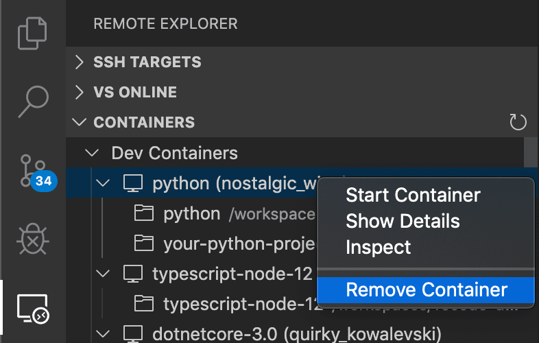
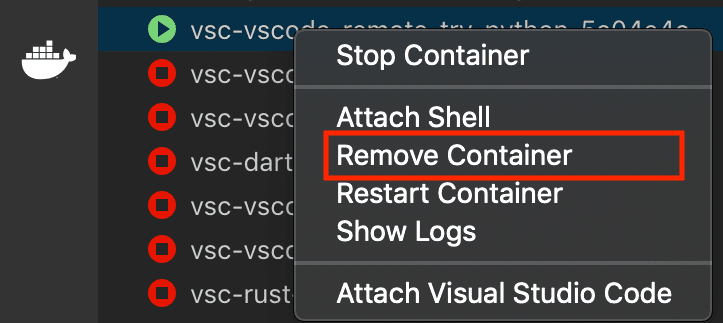

+++
title = "Tips and Tricks"
date = 2024-01-12T22:36:24+08:00
weight = 70
type = "docs"
description = ""
isCJKLanguage = true
draft = false
+++

> 原文: [https://code.visualstudio.com/docs/devcontainers/tips-and-tricks](https://code.visualstudio.com/docs/devcontainers/tips-and-tricks)

# Dev Containers Tips and Tricks Dev Containers 的提示和技巧


This article includes some tips and tricks for getting the Dev Containers extension up and running in different environments.

​​	本文包含一些提示和技巧，可帮助您在不同环境中启动并运行 Dev Containers 扩展。

## [Alternate ways to install Docker 安装 Docker 的其他方式](https://code.visualstudio.com/docs/devcontainers/tips-and-tricks#_alternate-ways-to-install-docker)

You can use Docker with the Dev Containers extension in a few ways, including:

​​	您可以通过以下几种方式将 Docker 与 Dev Containers 扩展一起使用，包括：

- Docker installed locally.
  本地安装的 Docker。

- Docker installed on a remote environment.
  安装在远程环境中的 Docker。

- Other Docker compliant CLIs, installed locally or remotely.

  
  其他 Docker 兼容的 CLI，本地或远程安装。

  - While other CLIs may work, they are not officially supported. Note that [attaching to a Kubernetes cluster](https://code.visualstudio.com/docs/devcontainers/attach-container#_attach-to-a-container-in-a-kubernetes-cluster) only requires a properly configured [kubectl CLI](https://kubernetes.io/docs/reference/kubectl/overview/).
    虽然其他 CLI 可能有效，但它们并未得到官方支持。请注意，附加到 Kubernetes 集群只需要正确配置的 kubectl CLI。

You can learn more in the [alternative Docker options doc](https://code.visualstudio.com/remote/advancedcontainers/docker-options).

​​	您可以在替代 Docker 选项文档中了解更多信息。

## [Docker Desktop for Windows tips Docker Desktop for Windows 提示](https://code.visualstudio.com/docs/devcontainers/tips-and-tricks#_docker-desktop-for-windows-tips)

[Docker Desktop](https://www.docker.com/products/docker-desktop) for Windows works well in most setups, but there are a few "gotchas" that can cause problems. Here are some tips on avoiding them:

​​	Docker Desktop for Windows 在大多数设置中运行良好，但有一些“陷阱”可能会导致问题。以下是一些避免这些陷阱的提示：

1. **Consider using the new Docker WSL 2 back-end on Windows 10 (2004+).** If you are using [Docker Desktop's WSL 2 back-end](https://aka.ms/vscode-remote/containers/docker-wsl2), you can use it to open folders inside WSL as well as locally. Containers are also shared between Windows and inside WSL and this new engine is less susceptible to file sharing issues. See the [quick start](https://code.visualstudio.com/docs/devcontainers/containers#_open-a-wsl-2-folder-in-a-container-on-windows) for details.

   ​​	考虑在 Windows 10（2004+）上使用新的 Docker WSL 2 后端。如果您使用的是 Docker Desktop 的 WSL 2 后端，则可以使用它在 WSL 中打开文件夹以及在本地打开文件夹。容器也在 Windows 和 WSL 内部共享，并且此新引擎不太容易出现文件共享问题。有关详细信息，请参阅快速入门。

2. **Switch out of "Linux Containers on Windows (LCOW)" mode.** While disabled by default, recent versions of Docker support [Linux Containers on Windows (LCOW)](https://learn.microsoft.com/virtualization/windowscontainers/deploy-containers/linux-containers) that can allow you to use both Windows and Linux containers at the same time. However, this is a new feature, so you may encounter issues and the Dev Containers extension only supports Linux containers currently. You can switch out of LCOW mode at any time by right-clicking on the Docker task bar item and selecting **Switch to Linux Containers...** from the context menu.

   ​​	退出“Windows 上的 Linux 容器 (LCOW)”模式。虽然默认情况下已禁用，但最新版本的 Docker 支持 Windows 上的 Linux 容器 (LCOW)，这允许您同时使用 Windows 和 Linux 容器。但是，这是一个新功能，因此您可能会遇到问题，并且 Dev Containers 扩展目前仅支持 Linux 容器。您可以随时通过右键单击 Docker 任务栏项并从上下文菜单中选择“切换到 Linux 容器...”来退出 LCOW 模式。

3. **Make sure your firewall allows Docker to set up a shared drive.** Docker only needs to connect between two machine local IPs, but some firewall software may still block any drive sharing or the needed ports. See [this Docker KB article](https://success.docker.com/article/error-a-firewall-is-blocking-file-sharing-between-windows-and-the-containers) for next steps on resolving this problem.

   ​​	确保防火墙允许 Docker 设置共享驱动器。Docker 只需在两个机器本地 IP 之间建立连接，但某些防火墙软件仍可能阻止任何驱动器共享或所需的端口。请参阅此 Docker KB 文章，了解解决此问题的后续步骤。

Here are some tips that applied to older versions of Docker for Windows but should now be resolved. If you run into strange behaviors due to a possible regression, these tips have solved problems in the past.

​​	以下是一些适用于旧版 Docker for Windows 的技巧，但现在应该已解决。如果您遇到因可能的回归而导致的奇怪行为，这些技巧在过去已解决过问题。

1. **Use an AD domain account or local administrator account when sharing drives. Do not use an AAD (email-based) account.** AAD (email-based) accounts have well-known issues, as documented in Docker [issue #132](https://github.com/docker/for-win/issues/132) and [issue #1352](https://github.com/docker/for-win/issues/1352). If you must use an AAD account, create a separate local administrator account on your machine that you use purely for the purpose of sharing drives. Follow the [steps in this blog post](https://blogs.msdn.microsoft.com/stevelasker/2016/06/14/configuring-docker-for-windows-volumes/) to get everything set up.

   ​​	共享驱动器时，请使用 AD 域帐户或本地管理员帐户。请勿使用 AAD（基于电子邮件）帐户。AAD（基于电子邮件）帐户存在众所周知的问题，如 Docker 问题 #132 和问题 #1352 中所述。如果您必须使用 AAD 帐户，请在您的计算机上创建一个单独的本地管理员帐户，您仅使用该帐户共享驱动器。按照此博客文章中的步骤进行操作，以完成所有设置。

2. **Stick with alphanumeric passwords to avoid drive sharing problems.** When asked to share your drives on Windows, you will be prompted for the username and password of an account with admin privileges on the machine. If you are warned about an incorrect username or password, this may be due to special characters in the password. For example, `!`, `[` and `]` are known to cause issues. Change your password to alphanumeric characters to resolve. See this issue about [Docker volume mounting problems](https://github.com/moby/moby/issues/23992#issuecomment-234979036) for details.

   ​​	坚持使用字母数字密码以避免驱动器共享问题。当被要求在 Windows 上共享您的驱动器时，系统会提示您输入具有该计算机管理员权限的帐户的用户名和密码。如果您收到有关用户名或密码不正确的警告，这可能是由于密码中存在特殊字符。例如，已知 `!` 、 `[` 和 `]` 会导致问题。将您的密码更改为字母数字字符以解决此问题。有关详细信息，请参阅此有关 Docker 卷装载问题的议题。

3. **Use your Docker ID to sign in to Docker (not your email).** The Docker CLI only supports using your Docker ID, so using your email can cause problems. See Docker [issue #935](https://github.com/docker/hub-feedback/issues/935#issuecomment-300361781) for details.

   ​​	使用您的 Docker ID 登录 Docker（而非您的电子邮件）。Docker CLI 仅支持使用您的 Docker ID，因此使用您的电子邮件可能会导致问题。有关详细信息，请参阅 Docker 议题 #935。

If you are still having trouble, see the [Docker Desktop for Windows troubleshooting guide](https://docs.docker.com/docker-for-windows/troubleshoot/#volumes).

​​	如果您仍然遇到问题，请参阅 Docker Desktop for Windows 故障排除指南。

## [Enabling file sharing in Docker Desktop 在 Docker Desktop 中启用文件共享](https://code.visualstudio.com/docs/devcontainers/tips-and-tricks#_enabling-file-sharing-in-docker-desktop)

The VS Code [Dev Containers](https://aka.ms/vscode-remote/download/containers) extension can only automatically mount your source code into a container if your code is in a folder or drive shared with Docker. If you open a dev container from a non-shared location, the container will successfully start but the workspace will be empty.

​​	VS Code Dev Containers 扩展只能在您的代码位于与 Docker 共享的文件夹或驱动器中时自动将您的源代码装载到容器中。如果您从非共享位置打开开发容器，容器将成功启动，但工作区将为空。

Note that this step is **not required** with [Docker Desktop's WSL 2 engine](https://aka.ms/vscode-remote/containers/docker-wsl2).

​​	请注意，Docker Desktop 的 WSL 2 引擎不需要此步骤。

To change Docker's drive and folder sharing settings:

​​	要更改 Docker 的驱动器和文件夹共享设置：

**Windows:
Windows：**

1. Right-click on the Docker task bar item and select **Settings**.
   右键单击 Docker 任务栏项并选择“设置”。
2. Go to **Resources > File Sharing** and check the drive(s) where your source code is located.
   转到“资源”>“文件共享”，并选中源代码所在驱动器。
3. If you see a message about your local firewall blocking the sharing action, see [this Docker KB article](https://success.docker.com/article/error-a-firewall-is-blocking-file-sharing-between-windows-and-the-containers) for next steps.
   如果您看到有关本地防火墙阻止共享操作的消息，请参阅此 Docker KB 文章以了解后续步骤。

**macOS:
macOS：**

1. Click on the Docker menu bar item and select **Preferences**.
   单击 Docker 菜单栏项并选择“首选项”。
2. Go to **Resources > File Sharing**. Confirm that the folder containing your source code is under one of the shared folders listed.
   转到“资源”>“文件共享”。确认包含源代码的文件夹位于列出的共享文件夹之一下。

## [Resolving Git line ending issues in containers (resulting in many modified files) 解决容器中的 Git 换行符问题（导致许多文件被修改）](https://code.visualstudio.com/docs/devcontainers/tips-and-tricks#_resolving-git-line-ending-issues-in-containers-resulting-in-many-modified-files)

Since Windows and Linux use different default line endings, Git may report a large number of modified files that have no differences aside from their line endings. To prevent this from happening, you can disable line ending conversion using a `.gitattributes` file or globally on the Windows side.

​​	由于 Windows 和 Linux 使用不同的默认换行符，因此 Git 可能会报告大量修改过的文件，除了换行符之外没有其他差异。为防止这种情况发生，您可以使用 `.gitattributes` 文件或在 Windows 端全局禁用换行符转换。

Typically adding or modifying a `.gitattributes` file in your repository is the most reliable way to solve this problem. Committing this file to source control will help others and allows you to vary behaviors by repository as appropriate. For example, adding the following to `.gitattributes` file to the root of your repository will force everything to be LF, except for Windows batch files that require CRLF:

​​	通常，在存储库中添加或修改 `.gitattributes` 文件是解决此问题的最可靠方法。将此文件提交到源代码管理将对其他人有所帮助，并允许您根据需要按存储库更改行为。例如，将以下内容添加到存储库根目录的 `.gitattributes` 文件中，将强制所有内容为 LF，但需要 CRLF 的 Windows 批处理文件除外：

```
* text=auto eol=lf
*.{cmd,[cC][mM][dD]} text eol=crlf
*.{bat,[bB][aA][tT]} text eol=crlf
```

Note that this works in **Git v2.10+**, so if you are running into problems, be sure you've got a recent Git client installed. You can add other file types in your repository that require CRLF to this same file.

​​	请注意，此方法适用于 Git v2.10+，因此如果您遇到问题，请确保已安装最新的 Git 客户端。您可以在存储库中添加其他需要 CRLF 的文件类型到此相同的文件。

If you would prefer to still always upload Unix-style line endings (LF), you can use the `input` option.

​​	如果您仍希望始终上传 Unix 风格的换行符 (LF)，可以使用 `input` 选项。

```
git config --global core.autocrlf input
```

If you'd prefer to disable line-ending conversion entirely, run the following instead:

​​	如果您更愿意完全禁用行尾转换，请改而运行以下命令：

```
git config --global core.autocrlf false
```

Finally, you may need to clone the repository again for these settings to take effect.

​​	最后，您可能需要再次克隆存储库，才能使这些设置生效。

## [Avoid setting up Git in a container when using Docker Compose 在使用 Docker Compose 时避免在容器中设置 Git](https://code.visualstudio.com/docs/devcontainers/tips-and-tricks#_avoid-setting-up-git-in-a-container-when-using-docker-compose)

See [Sharing Git credentials with your container](https://code.visualstudio.com/remote/advancedcontainers/sharing-git-credentials) in the main containers article for information on resolving this issue.

​​	请参阅主容器文章中的“与容器共享 Git 凭据”以了解有关解决此问题的信息。

## [Resolving hangs when doing a Git push or sync from a Container 在容器中执行 Git 推送或同步时解决挂起问题](https://code.visualstudio.com/docs/devcontainers/tips-and-tricks#_resolving-hangs-when-doing-a-git-push-or-sync-from-a-container)

If you clone a Git repository using SSH and your SSH key has a passphrase, VS Code's pull and sync features may hang when running remotely.

​​	如果您使用 SSH 克隆 Git 存储库，并且您的 SSH 密钥具有密码，则在远程运行时，VS Code 的拉取和同步功能可能会挂起。

Either use an SSH key without a passphrase, clone using HTTPS, or run `git push` from the command line to work around the issue.

​​	要解决此问题，可以使用没有密码的 SSH 密钥、使用 HTTPS 克隆或从命令行运行 `git push` 。

## [Resolving errors about missing Linux dependencies 解决有关缺少 Linux 依赖项的错误](https://code.visualstudio.com/docs/devcontainers/tips-and-tricks#_resolving-errors-about-missing-linux-dependencies)

Some extensions rely on libraries not found in the certain Docker images. See the [Containers](https://code.visualstudio.com/docs/devcontainers/create-dev-container#_install-additional-software) article for a few options on resolving this issue.

​​	某些扩展依赖于在特定 Docker 映像中找不到的库。请参阅容器文章，了解解决此问题的一些选项。

## [Speeding up containers in Docker Desktop 加快 Docker Desktop 中的容器速度](https://code.visualstudio.com/docs/devcontainers/tips-and-tricks#_speeding-up-containers-in-docker-desktop)

By default, Docker Desktop only gives containers a fraction of your machine capacity. In most cases, this is enough, but if you are doing something that requires more capacity, you can increase memory, CPU, or disk use.

​​	默认情况下，Docker Desktop 仅为容器提供机器容量的一小部分。在大多数情况下，这已经足够了，但如果您正在执行需要更多容量的操作，则可以增加内存、CPU 或磁盘使用量。

First, try [stopping any running containers](https://code.visualstudio.com/docs/devcontainers/containers#_managing-containers) you are no longer using.

​​	首先，尝试停止不再使用的任何正在运行的容器。

If this doesn't solve your problem, you may want to see if CPU usage is actually the issue or if there is something else going on. An easy way to check this is to install the [Resource Monitor extension](https://marketplace.visualstudio.com/items?itemName=mutantdino.resourcemonitor&ssr=false#overview). When installed in a container, it provides information about capacity for your containers in the Status bar.

​​	如果这不能解决您的问题，您可能需要查看 CPU 使用率是否确实是问题所在，或者是否还有其他问题。检查此问题的简单方法是安装资源监视器扩展。当安装在容器中时，它会在状态栏中提供有关容器容量的信息。


If you'd like this extension to always be installed, add this to your `settings.json`:

​​	如果您希望始终安装此扩展，请将其添加到您的 `settings.json` 中：

```
"dev.containers.defaultExtensions": [
    "mutantdino.resourcemonitor"
]
```

If you determine that you need to give your container more of your machine's capacity, follow these steps:

​​	如果您确定需要为容器提供更多机器容量，请按照以下步骤操作：

1. Right-click on the Docker task bar item and select **Settings** / **Preferences**.
   右键单击 Docker 任务栏项，然后选择设置/首选项。
2. Go to **Advanced** to increase CPU, Memory, or Swap.
   转到“高级”以增加 CPU、内存或交换。
3. On macOS, go to **Disk** to increase the amount of disk Docker is allowed to consume on your machine. On Windows, this is located under Advanced with the other settings.
   在 macOS 上，转到“磁盘”以增加 Docker 允许在您的计算机上使用的磁盘量。在 Windows 上，此设置与其他设置一起位于“高级”下。

Finally, if your container is **doing disk intensive** operations or you are just looking for faster response times, see [Improving container disk performance](https://code.visualstudio.com/remote/advancedcontainers/improve-performance) for tips. VS Code's defaults optimize for convenience and universal support, but can be optimized.

​​	最后，如果您的容器正在执行磁盘密集型操作，或者您只是在寻找更快的响应时间，请参阅改善容器磁盘性能以获取提示。VS Code 的默认设置经过优化，以实现便利性和通用支持，但可以进行优化。

## [Cleaning out unused containers and images 清理未使用的容器和映像](https://code.visualstudio.com/docs/devcontainers/tips-and-tricks#_cleaning-out-unused-containers-and-images)

If you see an error from Docker reporting that you are out of disk space, you can typically resolve this by cleaning out unused containers and images. There are a few ways to do this:

​​	如果您看到 Docker 报告的错误消息称您磁盘空间不足，通常可以通过清理未使用的容器和映像来解决此问题。有几种方法可以做到这一点：

### [Option 1: Use the Remote Explorer 选项 1：使用远程资源管理器](https://code.visualstudio.com/docs/devcontainers/tips-and-tricks#_option-1-use-the-remote-explorer)

You can delete containers by selecting the **Remote Explorer**, right-click on the container you want to remove, and select **Remove Container**.

​​	您可以通过选择远程资源管理器、右键单击要删除的容器并选择“删除容器”来删除容器。



However, this does not clean up any images you may have downloaded, which can clutter up your system.

​​	但是，这不会清理您可能已下载的任何映像，这些映像可能会使您的系统杂乱无章。

### [Option 2: Use the Docker extension 选项 2：使用 Docker 扩展](https://code.visualstudio.com/docs/devcontainers/tips-and-tricks#_option-2-use-the-docker-extension)

1. Open a **local** window in VS Code (**File > New Window**).

   ​​	在 VS Code 中打开一个本地窗口（文件 > 新窗口）。

2. Install the [Docker extension](https://marketplace.visualstudio.com/items?itemName=ms-azuretools.vscode-docker) from the Extensions view if not already present.

   ​​	如果尚未安装，请从扩展视图中安装 Docker 扩展。

3. You can then go to the Docker view and expand the **Containers** or **Images** node, right-click, and select **Remove Container / Image**.

   ​​	然后，您可以转到 Docker 视图并展开容器或映像节点，右键单击并选择删除容器/映像。

   

### [Option 3: Use the Docker CLI to pick containers to delete 选项 3：使用 Docker CLI 选择要删除的容器](https://code.visualstudio.com/docs/devcontainers/tips-and-tricks#_option-3-use-the-docker-cli-to-pick-containers-to-delete)

1. Open a **local** terminal/command prompt (or use a local window in VS Code).
   打开本地终端/命令提示符（或在 VS Code 中使用本地窗口）。
2. Type `docker ps -a` to see a list of all containers.
   键入 `docker ps -a` 以查看所有容器的列表。
3. Type `docker rm <Container ID>` from this list to remove a container.
   从该列表中键入 `docker rm <Container ID>` 以删除容器。
4. Type `docker image prune` to remove any unused images.
   键入 `docker image prune` 以删除所有未使用的映像。

If `docker ps` does not provide enough information to identify the container you want to delete, the following command will list all development containers managed by VS Code and the folder used to generate them.

​​	如果 `docker ps` 未提供足够的信息来标识您要删除的容器，则以下命令将列出 VS Code 管理的所有开发容器以及用于生成它们的文件夹。

```
docker ps -a --filter="label=vsch.quality" --format "table {{.ID}}\t{{.Status}}\t{{.Image}}\tvscode-{{.Label \"vsch.quality\"}}\t{{.Label \"vsch.local.folder\"}}"
```

### [Option 4: Use Docker Compose 选项 4：使用 Docker Compose](https://code.visualstudio.com/docs/devcontainers/tips-and-tricks#_option-4-use-docker-compose)

1. Open a **local** terminal/command prompt (or use a local window in VS Code).
   打开本地终端/命令提示符（或在 VS Code 中使用本地窗口）。
2. Go to the directory with your `docker-compose.yml` file.
   转到包含 `docker-compose.yml` 文件的目录。
3. Type `docker-compose down` to stop and delete the containers. If you have more than one Docker Compose file, you can specify additional Docker Compose files with the `-f` argument.
   键入 `docker-compose down` 以停止并删除容器。如果您有多个 Docker Compose 文件，可以使用 `-f` 参数指定其他 Docker Compose 文件。

**Option 4: Delete all containers and images that are not running:
选项 4：删除所有未运行的容器和映像：**

1. Open a **local** terminal/command prompt (or use a local window in VS Code).
   打开本地终端/命令提示符（或在 VS Code 中使用本地窗口）。
2. Type `docker system prune --all`.
   键入 `docker system prune --all` 。

## [Resolving Dockerfile build failures for images using Debian 8 解决使用 Debian 8 的映像的 Dockerfile 构建失败](https://code.visualstudio.com/docs/devcontainers/tips-and-tricks#_resolving-dockerfile-build-failures-for-images-using-debian-8)

When building containers that use images based on Debian 8/Jessie — such as older versions of the `node:8` image — you may encounter the following error:

​​	在构建使用基于 Debian 8/Jessie 的映像的容器时（例如旧版本的 `node:8` 映像），您可能会遇到以下错误：

```
...
W: Failed to fetch http://deb.debian.org/debian/dists/jessie-updates/InRelease  Unable to find expected entry 'main/binary-amd64/Packages' in Release file (Wrong sources.list entry or malformed file)
E: Some index files failed to download. They have been ignored, or old ones used instead.
...
```

This is a [well known issue](https://github.com/debuerreotype/docker-debian-artifacts/issues/66) caused by the Debian 8 being "archived". More recent versions of images typically resolve this problem, often by upgrading to Debian 9/Stretch.

​​	这是一个众所周知的由 Debian 8 被“存档”而导致的问题。较新版本的映像通常会解决此问题，通常是通过升级到 Debian 9/Stretch。

There are two ways to resolve this error:

​​	有两种方法可以解决此错误：

- **Option 1**: Remove any containers that depend on the image, remove the image, and then try building again. This should download an updated image that is not affected by the problem. See [cleaning out unused containers and images](https://code.visualstudio.com/docs/devcontainers/tips-and-tricks#_cleaning-out-unused-containers-and-images) for details.

  ​​	选项 1：删除依赖于该映像的所有容器，删除该映像，然后尝试重新构建。这应该下载不受此问题影响的更新映像。有关详细信息，请参阅清理未使用的容器和映像。

- **Option 2**: If you don't want to delete your containers or images, add this line into your Dockerfile before any `apt` or `apt-get` command. It adds the needed source lists for Jessie:

  ​​	选项 2：如果您不想删除容器或镜像，请在任何 `apt` 或 `apt-get` 命令之前将此行添加到 Dockerfile 中。它添加了 Jessie 所需的源列表：

  ```
  # Add archived sources to source list if base image uses Debian 8 / Jessie
  RUN cat /etc/*-release | grep -q jessie && printf "deb http://archive.debian.org/debian/ jessie main\ndeb-src http://archive.debian.org/debian/ jessie main\ndeb http://security.debian.org jessie/updates main\ndeb-src http://security.debian.org jessie/updates main" > /etc/apt/sources.list
  ```

## [Resolving Docker Hub sign in errors when an email is used 解决使用电子邮件时 Docker Hub 登录错误](https://code.visualstudio.com/docs/devcontainers/tips-and-tricks#_resolving-docker-hub-sign-in-errors-when-an-email-is-used)

The Docker CLI only supports using your Docker ID, so using your email to sign in can cause problems. See Docker [issue #935](https://github.com/docker/hub-feedback/issues/935#issuecomment-300361781) for details.

​​	Docker CLI 仅支持使用您的 Docker ID，因此使用您的电子邮件登录可能会导致问题。有关详细信息，请参阅 Docker 问题 #935。

As a workaround, use your Docker ID to sign in to Docker rather than your email.

​​	作为解决方法，请使用您的 Docker ID 登录 Docker，而不是您的电子邮件。

## [High CPU utilization of Hyperkit on macOS macOS 上 Hyperkit 的高 CPU 利用率](https://code.visualstudio.com/docs/devcontainers/tips-and-tricks#_high-cpu-utilization-of-hyperkit-on-macos)

There is [known issue with Docker for Mac](https://github.com/docker/for-mac/issues/1759) that can drive high CPU spikes. In particular, high CPU usage occurring when watching files and building. If you see high CPU usage for `com.docker.hyperkit` in Activity Monitor while very little is going on in your dev container, you are likely hitting this issue. Follow the [Docker issue](https://github.com/docker/for-mac/issues/1759) for updates and fixes.

​​	已知 Docker for Mac 存在一个问题，可能会导致高 CPU 峰值。特别是，在监视文件和构建时会发生高 CPU 使用率。如果您在活动监视器中看到 `com.docker.hyperkit` 的高 CPU 使用率，而开发容器中几乎没有发生任何事情，则很可能会遇到此问题。关注 Docker 问题以获取更新和修复。

## [Using an SSH tunnel to connect to a remote Docker host 使用 SSH 隧道连接到远程 Docker 主机](https://code.visualstudio.com/docs/devcontainers/tips-and-tricks#_using-an-ssh-tunnel-to-connect-to-a-remote-docker-host)

The [Develop inside a container on a remote Docker Machine or SSH host](https://code.visualstudio.com/remote/advancedcontainers/develop-remote-host) article covers how to setup VS Code when working with a remote Docker host. This is often as simple as setting the [Docker extension](https://marketplace.visualstudio.com/items?itemName=ms-azuretools.vscode-docker) `docker.environment` property in `settings.json` or the `DOCKER_HOST` environment variable to a `ssh://` or `tcp://` URI.

​​	在远程 Docker 机器或 SSH 主机上进行容器内开发一文介绍了在使用远程 Docker 主机时如何设置 VS Code。这通常只需在 `settings.json` 或 `DOCKER_HOST` 环境变量中将 Docker 扩展 `docker.environment` 属性设置为 `ssh://` 或 `tcp://` URI 即可。

However, you may run into situations where this does not work in your environment due to SSH configuration complexity or other limitations. In this case, an SSH tunnel can be used as a fallback.

​​	但是，由于 SSH 配置复杂或其他限制，您可能会遇到在您的环境中不起作用的情况。在这种情况下，可以使用 SSH 隧道作为后备。

### [Using an SSH tunnel as a fallback option 使用 SSH 隧道作为后备选项](https://code.visualstudio.com/docs/devcontainers/tips-and-tricks#_using-an-ssh-tunnel-as-a-fallback-option)

You can set up an SSH tunnel and forward the Docker socket from your remote host to your local machine.

​​	您可以设置 SSH 隧道并将 Docker 套接字从远程主机转发到本地计算机。

Follow these steps:

​​	请按照以下步骤操作：

1. Install an [OpenSSH compatible SSH client](https://code.visualstudio.com/docs/remote/troubleshooting#_installing-a-supported-ssh-client).

   ​​	安装兼容 OpenSSH 的 SSH 客户端。

2. Update the [Docker extension](https://marketplace.visualstudio.com/items?itemName=ms-azuretools.vscode-docker) `docker.environment` property in your user or workspace `settings.json` as follows:

   ​​	按照以下步骤更新用户或工作区 `settings.json` 中的 Docker 扩展 `docker.environment` 属性：

   ```
   "docker.environment": {
       "DOCKER_HOST": "tcp://localhost:23750"
   }
   ```

3. Run the following command from a local terminal / PowerShell (replacing `user@hostname` with the remote user and hostname / IP for your server):

   ​​	在本地终端/PowerShell 中运行以下命令（将 `user@hostname` 替换为服务器的远程用户和主机名/IP）：

   ```
   ssh -NL localhost:23750:/var/run/docker.sock user@hostname
   ```

VS Code will now be able to [attach to any running container](https://code.visualstudio.com/docs/devcontainers/attach-container) on the remote host. You can also [use specialized, local `devcontainer.json` files to create / connect to a remote dev container](https://code.visualstudio.com/remote/advancedcontainers/develop-remote-host#_converting-an-existing-or-predefined-devcontainerjson).

​​	VS Code 现在将能够连接到远程主机上正在运行的任何容器。您还可以使用专门的本地 `devcontainer.json` 文件来创建/连接到远程开发容器。

Once you are done, press Ctrl+C in the terminal / PowerShell to close the tunnel.

​​	完成后，按 Ctrl+C 在终端/PowerShell 中关闭隧道。

> **Note:** If the `ssh` command fails, you may need to `AllowStreamLocalForwarding` on your SSH host.
>
> ​​	注意：如果 `ssh` 命令失败，您可能需要在 SSH 主机上 `AllowStreamLocalForwarding` 。在 SSH 主机上（而非本地）使用编辑器（如 Vim、nano 或 Pico）
>
> 1. Open `/etc/ssh/sshd_config` in an editor (like Vim, nano, or Pico) on the **SSH host** (not locally).
>    打开 `/etc/ssh/sshd_config` 。
> 2. Add the setting `AllowStreamLocalForwarding yes`.
>    添加设置 `AllowStreamLocalForwarding yes` 。
> 3. Restart the SSH server (on Ubuntu, run `sudo systemctl restart sshd`).
>    重新启动 SSH 服务器（在 Ubuntu 上，运行 `sudo systemctl restart sshd` ）。
> 4. Retry.
>    重试。

## [Persisting user profile 持久化用户配置文件](https://code.visualstudio.com/docs/devcontainers/tips-and-tricks#_persisting-user-profile)

You can use the `mounts` property to persist the user profile (to keep things like shell history) in your dev container across rebuilds.

​​	您可以使用 `mounts` 属性来持久化用户配置文件（以便在重建过程中保留 shell 历史记录等内容）在您的开发容器中。

```
    "mounts": [
        "source=profile,target=/root,type=volume",
        "target=/root/.vscode-server,type=volume"
    ],
```

The above code first creates a named volume called `profile` mounted to `/root`, which will survive a rebuild. It next creates an anonymous volume mounted to `/root/.vscode-server` that gets destroyed on rebuild, which allows VS Code to reinstall extensions and dotfiles.

​​	上面的代码首先创建一个名为 `profile` 的命名卷，并将其装载到 `/root` ，这将在重建后继续存在。接下来，它创建一个匿名卷，并将其装载到 `/root/.vscode-server` ，该卷在重建时被销毁，这允许 VS Code 重新安装扩展和 dotfile。

## [Advanced container configuration tips 高级容器配置提示](https://code.visualstudio.com/docs/devcontainers/tips-and-tricks#_advanced-container-configuration-tips)

See the [Advanced container configuration](https://code.visualstudio.com/remote/advancedcontainers/overview) articles for information on the following topics:

​​	请参阅高级容器配置文章以了解以下主题的信息：

- [Adding environment variables
  添加环境变量](https://code.visualstudio.com/remote/advancedcontainers/environment-variables)
- [Adding another local file mount
  添加另一个本地文件装入点](https://code.visualstudio.com/remote/advancedcontainers/add-local-file-mount)
- [Changing or removing the default source code mount
  更改或删除默认源代码装入点](https://code.visualstudio.com/remote/advancedcontainers/change-default-source-mount)
- [Improving container disk performance
  提高容器磁盘性能](https://code.visualstudio.com/remote/advancedcontainers/improve-performance)
- [Adding a non-root user to your dev container
  向您的开发容器添加非根用户](https://code.visualstudio.com/remote/advancedcontainers/add-nonroot-user)
- [Setting the project name for Docker Compose
  为 Docker Compose 设置项目名称](https://code.visualstudio.com/remote/advancedcontainers/set-docker-compose-project-name)
- [Using Docker or Kubernetes from inside a container
  在容器内使用 Docker 或 Kubernetes](https://code.visualstudio.com/remote/advancedcontainers/use-docker-kubernetes)
- [Connecting to multiple containers at once
  同时连接到多个容器](https://code.visualstudio.com/remote/advancedcontainers/connect-multiple-containers)
- [Developing inside a container on a remote Docker Machine or SSH host
  在远程 Docker Machine 或 SSH 主机上的容器内进行开发](https://code.visualstudio.com/remote/advancedcontainers/develop-remote-host)
- [Reducing Dockerfile build warnings
  减少 Dockerfile 构建警告](https://code.visualstudio.com/remote/advancedcontainers/reduce-docker-warnings)
- [Sharing git credentials with your container
  与容器共享 git 凭据](https://code.visualstudio.com/remote/advancedcontainers/sharing-git-credentials)

## [Extension tips 扩展技巧](https://code.visualstudio.com/docs/devcontainers/tips-and-tricks#_extension-tips)

While many extensions will work unmodified, there are a few issues that can prevent certain features from working as expected. In some cases, you can use another command to work around the issue, while in others, the extension may need to be modified. The [Remote Extensions Tips](https://code.visualstudio.com/docs/remote/troubleshooting#_extension-tips) section provides a quick reference for common issues and tips on resolving them. You can also refer to the main extension article on [Supporting Remote Development](https://code.visualstudio.com/api/advanced-topics/remote-extensions) for an in-depth guide on modifying extensions to support remote extension hosts.

​​	虽然许多扩展无需修改即可工作，但有一些问题可能会阻止某些功能按预期工作。在某些情况下，您可以使用另一个命令来解决此问题，而在其他情况下，可能需要修改扩展。远程扩展提示部分提供了常见问题和解决问题的提示的快速参考。您还可以参阅有关支持远程开发的主要扩展文章，以获取有关修改扩展以支持远程扩展主机的深入指南。

## [Questions and feedback 问题和反馈](https://code.visualstudio.com/docs/devcontainers/tips-and-tricks#_questions-and-feedback)

### [Reporting issues 报告问题](https://code.visualstudio.com/docs/devcontainers/tips-and-tricks#_reporting-issues)

If you run into an issue with the Dev Containers extension, it's important to collect the correct logs so that we'll be able to help [diagnose your issue](https://aka.ms/vscode-remote/issues/new). You can get the Dev Containers extension logs with **Dev Containers: Show Container Log**.

​​	如果您在使用 Dev Containers 扩展时遇到问题，收集正确的日志非常重要，以便我们能够帮助诊断您的问题。您可以使用 Dev Containers: 显示容器日志获取 Dev Containers 扩展日志。

If you're experiencing issues using other extensions remotely (for example, other extensions aren't loading or installing properly in a remote context), it's helpful to grab the log from the **Remote Extension Host** output channel (**Output: Focus on Output View**), and select **Log (Remote Extension Host)** from the dropdown.

​​	如果您在远程使用其他扩展时遇到问题（例如，其他扩展在远程上下文中无法正确加载或安装），则从“远程扩展主机”输出通道（输出：关注输出视图）中获取日志并从下拉列表中选择“日志（远程扩展主机）”会有所帮助。

> **Note**: If you only see **Log (Extension Host)**, this is the local extension host, and the remote extension host didn't launch. This is because the log channel is created only after the log file is created, so if the remote extension host does not launch, the remote extension host log file was not created and is not shown in the Output view. This is still helpful information to include in your issue.
>
> ​​	注意：如果您只看到日志（扩展主机），则这是本地扩展主机，并且远程扩展主机未启动。这是因为日志通道仅在创建日志文件后才创建，因此，如果远程扩展主机未启动，则不会创建远程扩展主机日志文件，并且不会在输出视图中显示。这仍然是包含在您的问题中的有用信息。

### [Remote question and feedback resources 远程问题和反馈资源](https://code.visualstudio.com/docs/devcontainers/tips-and-tricks#_remote-question-and-feedback-resources)

We have a variety of other remote resources:

​​	我们还有各种其他远程资源：

- Search on [Stack Overflow](https://stackoverflow.com/questions/tagged/vscode-remote).
  在 Stack Overflow 上搜索。
- Add a [feature request](https://aka.ms/vscode-remote/feature-requests) or [report a problem](https://aka.ms/vscode-remote/issues/new).
  添加功能请求或报告问题。
