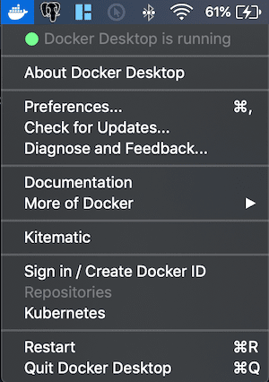
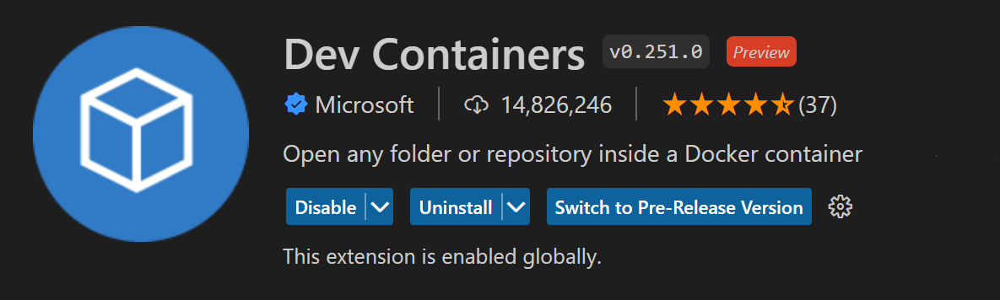
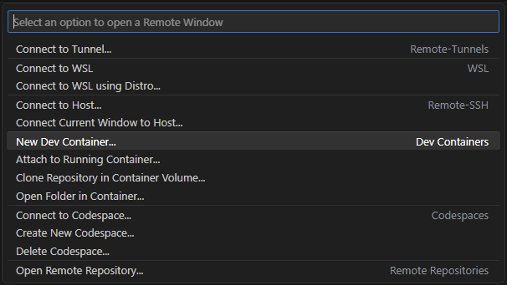
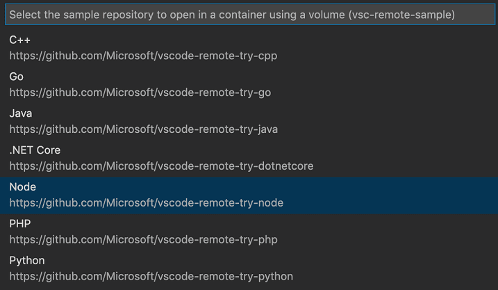
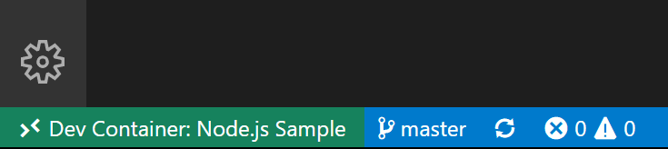
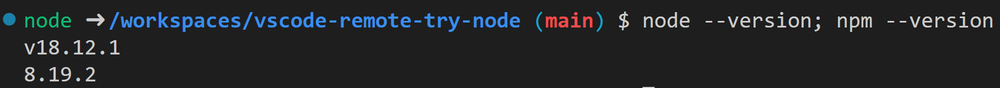
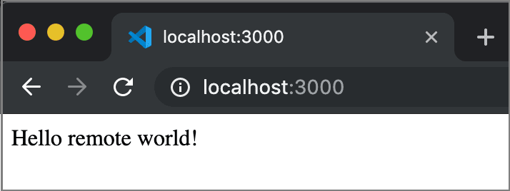

+++
title = "Tutorial"
date = 2024-01-12T22:36:24+08:00
weight = 10
type = "docs"
description = ""
isCJKLanguage = true
draft = false
+++

> 原文: [https://code.visualstudio.com/docs/devcontainers/tutorial](https://code.visualstudio.com/docs/devcontainers/tutorial)

# Dev Containers tutorial Dev Containers 教程


This tutorial walks you through running Visual Studio Code in a [Docker](https://www.docker.com/) container using the [Dev Containers](https://marketplace.visualstudio.com/items?itemName=ms-vscode-remote.remote-containers) extension. You need no prior knowledge of Docker to complete this tutorial.

​​	本教程将指导您使用 Dev Containers 扩展在 Docker 容器中运行 Visual Studio Code。您无需任何 Docker 预备知识即可完成本教程。

Running VS Code **inside** a Docker container can be useful for many reasons, but in this walkthrough we'll focus on using a Docker container to set up a development environment that is separate from your local environment.

​​	出于多种原因，在 Docker 容器中运行 VS Code 可能很有用，但在本演练中，我们将重点介绍使用 Docker 容器来设置一个独立于本地环境的开发环境。

## [Prerequisites 先决条件](https://code.visualstudio.com/docs/devcontainers/tutorial#_prerequisites)

You need [Visual Studio Code](https://code.visualstudio.com/) installed.

​​	您需要安装 Visual Studio Code。

## [Install Docker 安装 Docker](https://code.visualstudio.com/docs/devcontainers/tutorial#_install-docker)

Docker is needed to create and manage your containers.

​​	需要 Docker 来创建和管理您的容器。

### [Docker Desktop](https://code.visualstudio.com/docs/devcontainers/tutorial#_docker-desktop)

Download and install [Docker Desktop](https://www.docker.com/products/docker-desktop), or an [alternative Docker option](https://code.visualstudio.com/remote/advancedcontainers/docker-options), like Docker on a remote host or Docker compliant CLI.

​​	下载并安装 Docker Desktop 或其他 Docker 选项，例如远程主机上的 Docker 或兼容 Docker 的 CLI。

### [Start Docker 启动 Docker](https://code.visualstudio.com/docs/devcontainers/tutorial#_start-docker)

Run the Docker Desktop application to start Docker. You will know it's running if you look in the activity tray and see the Docker whale icon.

​​	运行 Docker Desktop 应用程序以启动 Docker。如果您查看活动托盘并看到 Docker 鲸鱼图标，您将知道它正在运行。

Docker might take a few minutes to start. If the whale icon is animated, it is probably still in the process of starting. You can click on the icon to see the status.

​​	Docker 可能需要几分钟才能启动。如果鲸鱼图标是动画的，则它可能仍在启动过程中。您可以单击该图标以查看状态。



### [Check Docker 检查 Docker](https://code.visualstudio.com/docs/devcontainers/tutorial#_check-docker)

Once Docker is running, you can confirm that everything is working by opening a **new** terminal window and typing the command:

​​	Docker 运行后，您可以通过打开一个新的终端窗口并键入以下命令来确认一切正常：

```
docker --version
# Docker version 18.09.2, build 6247962
```

## [Install the extension 安装扩展](https://code.visualstudio.com/docs/devcontainers/tutorial#_install-the-extension)

The Dev Containers extension lets you run Visual Studio Code inside a Docker container.

​​	Dev Containers 扩展允许您在 Docker 容器内运行 Visual Studio Code。

> [Install the Dev Containers extension
> 安装 Dev Containers 扩展](vscode:extension/ms-vscode-remote.remote-containers)



### [Check installation 检查安装](https://code.visualstudio.com/docs/devcontainers/tutorial#_check-installation)

With the Dev Containers extension installed, you will see a new Status bar item at the far left.

​​	安装 Dev Containers 扩展后，您将在最左侧看到一个新的状态栏项。


The Remote Status bar item can quickly show you in which context VS Code is running (local or remote) and clicking on the item will bring up the Dev Containers commands.

​​	远程状态栏项可以快速向您显示 VS Code 在哪个上下文中运行（本地或远程），单击该项将显示 Dev Containers 命令。



## [Get the sample 获取示例](https://code.visualstudio.com/docs/devcontainers/tutorial#_get-the-sample)

To create a Docker container, we are going to open a GitHub repository with a Node.js project.

​​	为了创建一个 Docker 容器，我们将打开一个包含 Node.js 项目的 GitHub 存储库。

Open the Command Palette (`F1`) to run the command **Dev Containers: Try a Dev Container Sample...** and select the Node sample from the list.

​​	打开命令面板 ( `F1` ) 以运行命令开发容器：尝试开发容器示例...，然后从列表中选择 Node 示例。



**Note**: There are other dev container samples such as `vscode-remote-try-python` or `vscode-remote-try-java`, but this tutorial will use `vscode-remote-try-node`.

​​	注意：还有其他开发容器示例，例如 `vscode-remote-try-python` 或 `vscode-remote-try-java` ，但本教程将使用 `vscode-remote-try-node` 。

### [Wait for the container to build 等待容器构建](https://code.visualstudio.com/docs/devcontainers/tutorial#_wait-for-the-container-to-build)

The window will then reload, but since the container does not exist yet, VS Code will create one and clone the sample repository into an isolated [container volume](https://docs.docker.com/storage/volumes/). This may take some time, and a progress notification will provide status updates. Fortunately, this step isn't necessary the next time you open the folder since the container will already exist.

​​	然后窗口将重新加载，但由于容器尚不存在，因此 VS Code 将创建一个容器并将示例存储库克隆到隔离的容器卷中。这可能需要一些时间，进度通知将提供状态更新。幸运的是，下次打开文件夹时，由于容器已经存在，因此无需执行此步骤。


After the container is built, VS Code automatically connects to it and maps the project folder from your local file system into the container.

​​	容器构建完成后，VS Code 会自动连接到它，并将项目文件夹从本地文件系统映射到容器中。

### [Check the container 检查容器](https://code.visualstudio.com/docs/devcontainers/tutorial#_check-the-container)

Once the container is running and you're connected, you should see your remote context change in the bottom left of the Status bar:

​​	容器正在运行并且您已连接后，您应该会看到状态栏左下角的远程上下文发生变化：



## [Check your environment 检查您的环境](https://code.visualstudio.com/docs/devcontainers/tutorial#_check-your-environment)

One of the useful things about developing in a container is that you can use specific versions of dependencies that your application needs without impacting your local development environment.

​​	在容器中进行开发的一项好处是，您可以使用应用程序所需的特定版本的依赖项，而不会影响本地开发环境。

The specific container for this tutorial has Node.js v18 installed, which you can check by opening a new terminal **Terminal** > **New Terminal** (Ctrl+Shift+`) and entering:

​​	本教程的特定容器已安装 Node.js v18，您可以通过打开新终端（终端 > 新建终端 (Ctrl+Shift+`)）并输入以下内容来检查：

```
node --version; npm --version
```

This should show the following versions:

​​	这应显示以下版本：



### [Run the application 运行应用程序](https://code.visualstudio.com/docs/devcontainers/tutorial#_run-the-application)

We can now hit F5, which will run the application inside the container. Once the process starts, navigate to [http://localhost:3000](http://localhost:3000/) and you should see the simple Node.js server running!

​​	我们现在可以按 F5，这将在容器内运行应用程序。进程启动后，导航到 http://localhost:3000，您应该会看到正在运行的简单 Node.js 服务器！



### [Ending your container connection 结束容器连接](https://code.visualstudio.com/docs/devcontainers/tutorial#_ending-your-container-connection)

You can end your session in the container and go back to running VS Code locally with **File** > **Close Remote Connection**.

​​	您可以结束在容器中的会话，并通过“文件”>“关闭远程连接”返回在本地运行 VS Code。

## [How it works 工作原理](https://code.visualstudio.com/docs/devcontainers/tutorial#_how-it-works)

This next section describes in more detail how the Dev Containers extension sets up and configures your containers.

​​	下一部分将更详细地介绍 Dev Containers 扩展如何设置和配置容器。

The Dev Containers extension uses the files in the `.devcontainer` folder, namely `devcontainer.json`, and an optional `Dockerfile` or `docker-compose.yml`, to create your dev containers.

​​	Dev Containers 扩展使用 `.devcontainer` 文件夹中的文件，即 `devcontainer.json` ，以及可选的 `Dockerfile` 或 `docker-compose.yml` ，来创建开发容器。

In the example we just explored, the project has a `.devcontainer` folder with a `devcontainer.json` inside. The `devcontainer.json` uses the image `mcr.microsoft.com/devcontainers/javascript-node:0-18`. You can explore this image in greater detail in the [devcontainers/images](https://github.com/devcontainers/images/tree/main/src/javascript-node) repo.

​​	在刚刚探讨的示例中，该项目有一个包含 `devcontainer.json` 的 `.devcontainer` 文件夹。 `devcontainer.json` 使用图像 `mcr.microsoft.com/devcontainers/javascript-node:0-18` 。您可以在 devcontainers/images 存储库中更详细地浏览此图像。

First, your image is built from the supplied Dockerfile or image name, which would be `mcr.microsoft.com/devcontainers/javascript-node:0-18` in this example. Then a container is created and started using some of the settings in the `devcontainer.json`. Finally your Visual Studio Code environment is installed and configured again according to settings in the `devcontainer.json`. For example, the dev container in this example installs the `streetsidesoftware.code-spell-checker` extension.

​​	首先，您的图像将根据提供的 Dockerfile 或图像名称构建，在本示例中为 `mcr.microsoft.com/devcontainers/javascript-node:0-18` 。然后，使用 `devcontainer.json` 中的一些设置创建并启动容器。最后，您的 Visual Studio Code 环境将根据 `devcontainer.json` 中的设置再次安装并配置。例如，此示例中的开发容器将安装 `streetsidesoftware.code-spell-checker` 扩展。

> **Note:** Additional configuration will already be added to the container based on what's in the base image. For example, we see the `streetsidesoftware.code-spell-checker` extension above, and the container will also include `"dbaeumer.vscode-eslint"` as [that's part of `mcr.microsoft.com/devcontainers/typescript-node`](https://github.com/devcontainers/images/blob/main/src/javascript-node/.devcontainer/devcontainer.json#L27). This happens automatically when pre-building using devcontainer.json, which you may read more about in the [pre-build section](https://code.visualstudio.com/docs/devcontainers/containers#_prebuilding-dev-container-images).
>
> ​​	注意：根据基本图像中的内容，其他配置将已添加到容器中。例如，我们看到上面的 `streetsidesoftware.code-spell-checker` 扩展，并且容器还将包含 `"dbaeumer.vscode-eslint"` ，因为它是 `mcr.microsoft.com/devcontainers/typescript-node` 的一部分。使用 devcontainer.json 预构建时会自动发生这种情况，您可以在预构建部分中阅读更多相关信息。

Once all of this is done, your local copy of Visual Studio Code connects to the Visual Studio Code Server running inside of your new dev container.

​​	完成所有这些操作后，您本地副本的 Visual Studio Code 将连接到在新开发容器中运行的 Visual Studio Code Server。


### [devcontainer.json](https://code.visualstudio.com/docs/devcontainers/tutorial#_devcontainerjson)

The `devcontainer.json` is basically a config file that determines how your dev container gets built and started.

​​	基本上， `devcontainer.json` 是一个配置文件，用于确定如何构建和启动开发容器。

```
//devcontainer.json
{
  "name": "Node.js",

  // Or use a Dockerfile or Docker Compose file. More info: https://containers.dev/guide/dockerfile
  "image": "mcr.microsoft.com/devcontainers/javascript-node:0-18",

  // Features to add to the dev container. More info: https://containers.dev/features.
  // "features": {},

  "customizations": {
    "vscode": {
      "settings": {},
      "extensions": ["streetsidesoftware.code-spell-checker"]
    }
  },

  // "forwardPorts": [3000],

  "portsAttributes": {
    "3000": {
      "label": "Hello Remote World",
      "onAutoForward": "notify"
    }
  },

  "postCreateCommand": "yarn install"

  // "remoteUser": "root"
}
```

The above example is extracted from the `vscode-remote-try-node` repo we used in the tutorial.

​​	上面的示例是从我们在教程中使用的 `vscode-remote-try-node` 存储库中提取的。

| Option 选项         | Description 说明                                             |
| :------------------ | :----------------------------------------------------------- |
| `image`             | The name of an image in a container registry ([Docker Hub](https://hub.docker.com/), [GitHub Container Registry](https://docs.github.com/packages/guides/about-github-container-registry), [Azure Container Registry](https://azure.microsoft.com/services/container-registry/)) VS Code should use to create the dev container. 容器注册表（Docker Hub、GitHub 容器注册表、Azure 容器注册表）中映像的名称，VS Code 应使用该名称创建开发容器。 |
| `dockerfile`        | Rather than referencing an `image`, you may instead use the `dockerfile` property, which is the relative path to a `Dockerfile` that you want to use as your image. 您也可以使用 `dockerfile` 属性（这是您想要用作映像的 `Dockerfile` 的相对路径）来引用 `image` 。 |
| `features`          | An object of [Dev Container Feature](https://code.visualstudio.com/docs/devcontainers/containers#_dev-container-features) IDs and related options to be added. 要添加的开发容器功能 ID 和相关选项的对象。 |
| `customizations`    | Configure tool-specific properties, like `settings` and `extensions` properties for VS Code. 配置特定于工具的属性，例如 VS Code 的 `settings` 和 `extensions` 属性。 |
| `settings`          | Adds default `settings.json` values into a container/machine specific settings file, such as `"terminal.integrated.defaultProfile.linux": "bash"`. 将默认 `settings.json` 值添加到特定于容器/计算机的设置文件中，例如 `"terminal.integrated.defaultProfile.linux": "bash"` 。 |
| `extensions`        | An array of extension IDs that specify the extensions that should be installed inside the container when it is created. 指定在创建容器时应在容器内安装的扩展的扩展 ID 数组。 |
| `forwardPorts`      | Make a list of ports inside the container available locally. 使容器内的端口在本地可用。 |
| `portsAttributes`   | Set default properties for specific forwarded ports. 为特定转发端口设置默认属性。 |
| `postCreateCommand` | A command string or list of command arguments to run after the container is created. 容器创建后要运行的命令字符串或命令参数列表。 |
| `remoteUser`        | Overrides the user that VS Code runs as in the container (along with sub-processes). Defaults to the `containerUser`. 覆盖 VS Code 在容器中运行的用户（以及子进程）。默认为 `containerUser` 。 |

You can review the [full list](https://containers.dev/implementors/json_reference) of `devcontainer.json` options.

​​	您可以查看 `devcontainer.json` 选项的完整列表。

### [Congratulations 恭喜](https://code.visualstudio.com/docs/devcontainers/tutorial#_congratulations)

Congratulations, you've successfully completed this tutorial!

​​	恭喜，您已成功完成本教程！

This has been a brief overview of what is possible using dev containers. As a next step, we recommend checking out how you can [open an existing folder from your machine in a container](https://code.visualstudio.com/docs/devcontainers/containers#_quick-start-open-an-existing-folder-in-a-container) or [opening a GitHub repository or PR in a container](https://code.visualstudio.com/docs/devcontainers/containers#_quick-start-open-a-git-repository-or-github-pr-in-an-isolated-container-volume).

​​	这是使用开发容器可以实现的功能的简要概述。作为下一步，我们建议您了解如何从计算机中的现有文件夹或在容器中打开 GitHub 存储库或 PR。

Check out the other Remote Development extensions.

​​	查看其他远程开发扩展。

- [Remote - SSH](https://marketplace.visualstudio.com/items?itemName=ms-vscode-remote.remote-ssh)
- [WSL](https://marketplace.visualstudio.com/items?itemName=ms-vscode-remote.remote-wsl)

Or get them all by installing the [Remote Development](https://marketplace.visualstudio.com/items?itemName=ms-vscode-remote.vscode-remote-extensionpack) Extension Pack.

​​	或通过安装远程开发扩展包获取所有扩展。

## [Troubleshooting 故障排除](https://code.visualstudio.com/docs/devcontainers/tutorial#_troubleshooting)

### [Verify Docker context 验证 Docker 上下文](https://code.visualstudio.com/docs/devcontainers/tutorial#_verify-docker-context)

If you are not using a fresh Docker install and the **Dev Containers: Try a Dev Container Sample...** sample encounters issues with the current context, you should check your Docker context. Fresh installs will have a 'default' context and you can set it back as the current context.

​​	如果您未使用全新安装的 Docker，并且开发容器：尝试开发容器示例... 示例遇到当前上下文的问题，则应检查 Docker 上下文。全新安装将具有“默认”上下文，您可以将其重新设置为当前上下文。

```
# Displays the list of contexts, '*' denotes the current context
docker context list

# Switches the list to the 'default' context
docker context use default
```
