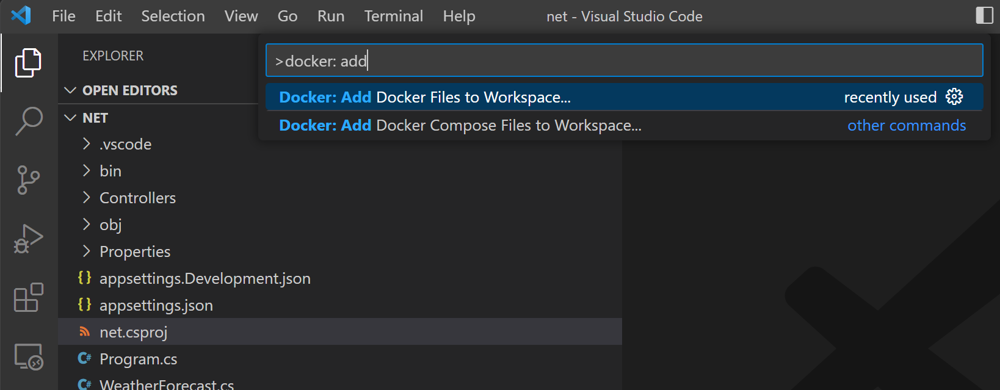
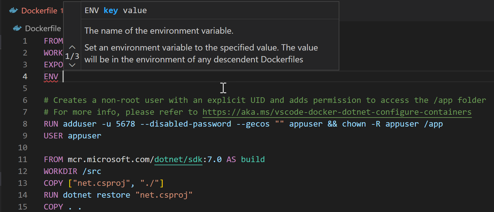
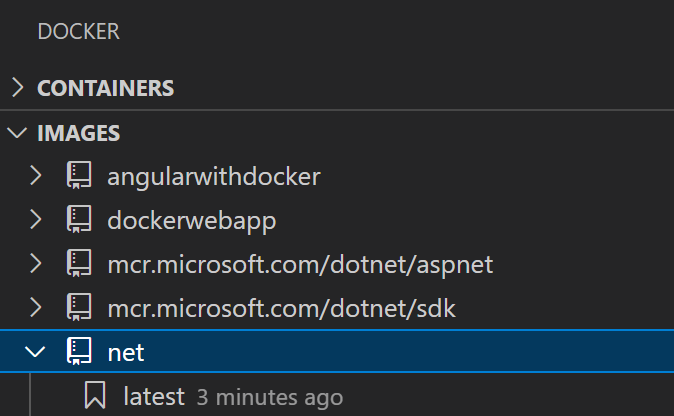
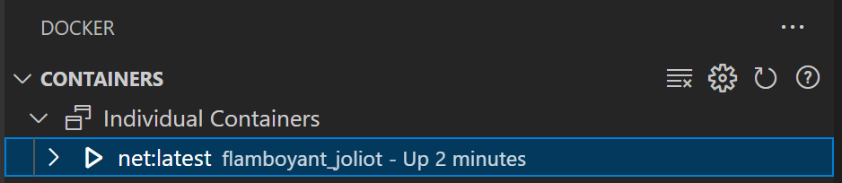
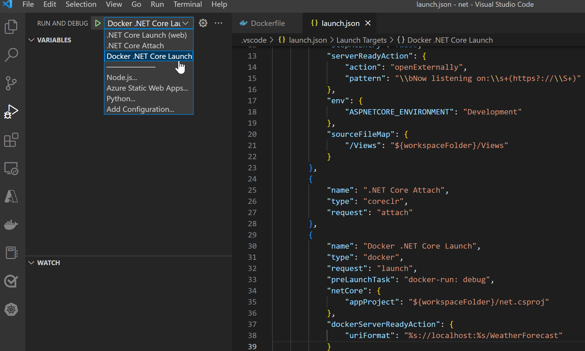

+++
title = "ASP.NET Core"
date = 2024-01-12T22:36:24+08:00
weight = 30
type = "docs"
description = ""
isCJKLanguage = true
draft = false
+++

> 原文: [https://code.visualstudio.com/docs/containers/quickstart-aspnet-core](https://code.visualstudio.com/docs/containers/quickstart-aspnet-core)

# ASP.NET Core in a container 容器中的 ASP.NET Core


In this guide you will learn how to:

​​	在本指南中，您将学习如何：

- Create a `Dockerfile` file describing a simple .NET Core service container.
  创建一个 `Dockerfile` 文件，描述一个简单的.NET Core服务容器。
- Build, run, and verify the functionality of the service.
  构建、运行并验证服务的运行状况。
- Debug the service running as a container.
  调试作为容器运行的服务。

## [Prerequisites 先决条件](https://code.visualstudio.com/docs/containers/quickstart-aspnet-core#_prerequisites)

- Docker and the VS Code Docker extension must be installed as described on the [overview](https://code.visualstudio.com/docs/containers/overview#_installation).
  必须按照概述中所述安装 Docker 和 VS Code Docker 扩展。
- For .NET development, install [.NET SDK](https://dotnet.microsoft.com/download).
  对于 .NET 开发，请安装 .NET SDK。
- Microsoft [C# for Visual Studio Code](https://marketplace.visualstudio.com/items?itemName=ms-dotnettools.csharp) extension.
  适用于 Visual Studio Code 的 Microsoft C# 扩展。

## [Create a .NET Web API project 创建 .NET Web API 项目](https://code.visualstudio.com/docs/containers/quickstart-aspnet-core#_create-a-net-web-api-project)

1. Create a folder for the project.

   ​​	为项目创建一个文件夹。

2. Open developer command prompt in the project folder and initialize the project:

   ​​	在项目文件夹中打开开发人员命令提示符并初始化项目：

   ```
   dotnet new webapi --no-https
   ```

## [Add Docker files to the project 将 Docker 文件添加到项目](https://code.visualstudio.com/docs/containers/quickstart-aspnet-core#_add-docker-files-to-the-project)

1. Open the project folder in VS Code.

   ​​	在 VS Code 中打开项目文件夹。

2. Wait for the C# extension to prompt you to add required assets for build and debug, and choose **Yes**. You can also open the Command Palette (Ctrl+Shift+P) and use the **.NET: Generate Assets for Build and Debug** command.

   ​​	等待 C# 扩展提示您添加构建和调试所需的资产，然后选择“是”。您还可以打开命令面板 (Ctrl+Shift+P) 并使用 .NET: Generate Assets for Build and Debug 命令。

3. Open Command Palette (Ctrl+Shift+P) and use **Docker: Add Docker Files to Workspace...** command:

   ​​	打开命令面板 (Ctrl+Shift+P) 并使用 Docker: Add Docker Files to Workspace... 命令：

   

4. Use **.NET: ASP.NET Core** when prompted for application platform.

   ​​	在提示应用程序平台时使用 .NET: ASP.NET Core。

5. Choose **Windows** or **Linux** when prompted to choose the operating system.

   ​​	在提示选择操作系统时选择 Windows 或 Linux。

   > Windows is only applicable if your Docker installation is configured to use Windows containers.
   >
   > ​​	仅当您的 Docker 安装配置为使用 Windows 容器时，Windows 才适用。

6. You will be asked if you want to add Docker Compose files. We will not use Docker Compose in this tutorial, so both "Yes" and "No" answers are fine.

   ​​	系统会询问您是否要添加 Docker Compose 文件。在本教程中，我们不会使用 Docker Compose，因此“是”和“否”的回答都可以。

7. Change the port for application endpoint to `5000`.

   ​​	将应用程序端点的端口更改为 `5000` 。

8. `Dockerfile` and `.dockerignore` files are added to the workspace.

   ​​	文件 `Dockerfile` 和 `.dockerignore` 已添加到工作区。

   The extension will also create a set of **VS Code tasks** for building and running the container (in both debug- and release configuration, four tasks in total), and a **debugging configuration** for launching the container in debug mode.

   ​​	该扩展程序还将创建一组 VS Code 任务，用于构建和运行容器（在调试和发布配置中，总共四个任务），以及一个用于在调试模式下启动容器的调试配置。

## [Build the application 构建应用程序](https://code.visualstudio.com/docs/containers/quickstart-aspnet-core#_build-the-application)

1. Open terminal prompt (Ctrl+`).

   ​​	打开终端提示符 (Ctrl+`)。

2. Issue `dotnet build` command to build the application:

   ​​	发出 `dotnet build` 命令以构建应用程序：

   ```
   PS C:\source\repos\net> dotnet build
   MSBuild version 17.4.0-preview-22470-08+6521b1591 for .NET
     Determining projects to restore...
     All projects are up-to-date for restore.
     net -> C:\source\repos\net\bin\Debug\net7.0\net.dll
   
   Build succeeded.
       0 Warning(s)
       0 Error(s)
   
   Time Elapsed 00:00:08.96
   ```

## [Add an environment variable to the image 向镜像添加环境变量](https://code.visualstudio.com/docs/containers/quickstart-aspnet-core#_add-an-environment-variable-to-the-image)

You can use the Docker extension to author Docker files. The extension provides completions and contextual help. To see these capabilities add an environment variable to your service image by following these steps:

​​	您可以使用 Docker 扩展程序创作 Docker 文件。该扩展程序提供完成和上下文帮助。若要查看这些功能，请按照以下步骤将环境变量添加到您的服务映像：

1. Open the `Dockerfile` file.

   ​​	打开 `Dockerfile` 文件。

2. Use `ENV` instruction to add an environment variable to the service container image. The instruction should be placed in the `base` stage of the `Dockerfile` (the first stage in the file). Set the `ASPNETCORE_URLS` variable to `http://*:5000`:

   ​​	使用 `ENV` 指令将环境变量添加到服务容器映像。该指令应放置在 `base` 阶段的 `Dockerfile` 中（文件中的第一个阶段）。将 `ASPNETCORE_URLS` 变量设置为 `http://*:5000` ：

   

   Note how the Docker extension lists all available Dockerfile instructions and describes the syntax.

   ​​	请注意 Docker 扩展如何列出所有可用的 Dockerfile 指令并描述语法。

   > The Docker extension uses the `base` stage of the `Dockerfile` to create a debug version of the container image for your service. Put the `ASPNETCORE_URLS` environment variable definition in the `base` stage to have this variable available in both debug and release versions of the container image.
   >
   > ​​	Docker 扩展使用 `Dockerfile` 的 `base` 阶段为您的服务创建容器映像的调试版本。将 `ASPNETCORE_URLS` 环境变量定义放在 `base` 阶段中，以便在容器映像的调试版本和发布版本中都可以使用此变量。

3. Save the `Dockerfile` file.

   ​​	保存 `Dockerfile` 文件。

## [Build the image 构建映像](https://code.visualstudio.com/docs/containers/quickstart-aspnet-core#_build-the-image)

1. Open Command Palette (Ctrl+Shift+P) and issue **Docker Images: Build Image...** command.

   ​​	打开命令面板 (Ctrl+Shift+P) 并发出 Docker Images: Build Image... 命令。

2. Open Docker Explorer and verify that the new image is visible in the Images tree:

   ​​	打开 Docker Explorer 并验证新映像是否在 Images 树中可见：

   

## [Test the service container 测试服务容器](https://code.visualstudio.com/docs/containers/quickstart-aspnet-core#_test-the-service-container)

1. Right-click on the image built in previous step and choose **Run** or **Run Interactive**. The container should start and you should be able to see it in the "Containers" pane of the Docker Explorer:

   ​​	右键单击在上一步中构建的映像，然后选择 Run 或 Run Interactive。容器应启动，您应该能够在 Docker Explorer 的“Containers”窗格中看到它：

   

2. Open the web browser and navigate to http://localhost:5000/WeatherForecast. You should see weather data in JSON format, similar to following:

   ​​	打开 Web 浏览器并导航到 http://localhost:5000/WeatherForecast。您应该会看到 JSON 格式的天气数据，类似于以下内容：

   ```
   [
       {"date":"2019-11-07T23:31:57.0527092+00:00","temperatureC":4,"temperatureF":39,"summary":"Bracing"},
       {"date":"2019-11-08T23:31:57.0539243+00:00","temperatureC":-19,"temperatureF":-2,"summary":"Freezing"},
       {"date":"2019-11-09T23:31:57.0539269+00:00","temperatureC":2,"temperatureF":35,"summary":"Freezing"},
       {"date":"2019-11-10T23:31:57.0539275+00:00","temperatureC":-4,"temperatureF":25,"summary":"Freezing"},
       {"date":"2019-11-11T23:31:57.053928+00:00","temperatureC":9,"temperatureF":48,"summary":"Bracing"}
    ]
   ```

   > By default Docker will assign a randomly chosen **host port** to a port exposed by a container (the **container port**). In our application the exposed (container) port is 5000. When you issue **Run** command for an image, VS Code will try to use the same port number for the host port and container port. This makes it easy to remember which port to use to communicate with the container, but it won't work if the host port is already in use.
   >
   > ​​	默认情况下，Docker 会将随机选择的宿主机端口分配给容器公开的端口（容器端口）。在我们的应用程序中，公开的（容器）端口是 5000。当您为映像发出 Run 命令时，VS Code 会尝试为宿主机端口和容器端口使用相同的端口号。这样便于记住用于与容器通信的端口，但如果宿主机端口已在使用，则此方法将不起作用。
   >
   > If you cannot see the data from the container in your browser, make sure there are no errors reported by the `docker run` command (look at the command output in the terminal window). You can also verify which host port is using by the container by right-clicking the container in the Docker Explorer and choosing **Inspect**. This will open a JSON document that describes the container in detail. Search for `PortBindings` element, for example:
   >
   > ​​	如果您在浏览器中看不到来自容器的数据，请确保 `docker run` 命令未报告任何错误（查看终端窗口中的命令输出）。您还可以通过在 Docker Explorer 中右键单击容器并选择“检查”来验证容器正在使用哪个宿主机端口。这将打开一个详细描述容器的 JSON 文档。搜索 `PortBindings` 元素，例如：
   >
   > ```
   > "PortBindings": {
   >   "5000/tcp": [
   >     {
   >       "HostIp": "",
   >       "HostPort": "5000"
   >     }
   >   ]
   > },
   > ```

3. When done testing, right-click the container in the Docker Explorer and choose **Stop**.

   ​​	测试完成后，在 Docker Explorer 中右键单击容器并选择“停止”。

## [Debug in container 在容器中调试](https://code.visualstudio.com/docs/containers/quickstart-aspnet-core#_debug-in-container)

When Docker files were added to the application, the Docker extension also added a **VS Code debugger configuration** for debugging the service when it is running inside a container. The extension will automatically detect the protocol and port that the service is using and point the browser to the service, but we need to tell it what URL path to use.

​​	当 Docker 文件添加到应用程序时，Docker 扩展还会添加一个 VS Code 调试器配置，用于在容器内运行服务时对其进行调试。该扩展将自动检测服务正在使用的协议和端口，并将浏览器指向该服务，但我们需要告诉它要使用哪个 URL 路径。

1. Set a breakpoint at the beginning of the code for the `Get()` method of the `Controllers/WeatherForecastController.cs` file.

   ​​	在 `Controllers/WeatherForecastController.cs` 文件的 `Get()` 方法的代码开头设置一个断点。

2. Open `.vscode/launch.json` file and find `Docker .NET Core Launch` debug configuration.

   ​​	打开 `.vscode/launch.json` 文件并查找 `Docker .NET Core Launch` 调试配置。

3. Add `dockerServerReadyAction` to `Docker .NET Core Launch` configuration:

   ​​	将 `dockerServerReadyAction` 添加到 `Docker .NET Core Launch` 配置中：

   ```
   "dockerServerReadyAction": {
       "uriFormat": "%s://localhost:%s/WeatherForecast"
   }
   ```

4. Make sure the configuration is selected as active:

   ​​	确保将该配置选为活动配置：

   

5. Start debugging (F5).

   ​​	开始调试 (F5)。

   - The debug version of the service container builds and starts.
     服务容器的调试版本构建并启动。
   - The browser opens to request a new weather forecast.
     浏览器打开以请求新的天气预报。
   - The breakpoint in the `WeatherForecastController` is hit.
     命中 `WeatherForecastController` 中的断点。

You can use specific port on the host by changing the Docker run options used by `docker-run: debug` task (defined in `.vscode/tasks.json` file). For example, if you want to use the same port (5000) to expose the service, the `docker-run: debug` task definition would look like this:

​​	您可以通过更改 `docker-run: debug` 任务（在 `.vscode/tasks.json` 文件中定义）使用的 Docker 运行选项来使用主机上的特定端口。例如，如果您想使用相同的端口 (5000) 来公开服务，则 `docker-run: debug` 任务定义将如下所示：

```
 {
    "type": "docker-run",
    "label": "docker-run: debug",
    "dependsOn": [
        "docker-build: debug"
    ],
    "dockerRun": {
        "ports": [
            { "hostPort": 5000, "containerPort": 5000 }
        ]
    },
    "netCore": {
        "appProject": "${workspaceFolder}/netcorerest.csproj",
        "enableDebugging": true
    }
```

## [Next steps 后续步骤](https://code.visualstudio.com/docs/containers/quickstart-aspnet-core#_next-steps)

You're done! Now that your container is ready, you may want to:

​​	您已完成！现在您的容器已准备就绪，您可能需要：

- [Learn about debugging .NET in a container
  了解如何在容器中调试 .NET](https://code.visualstudio.com/docs/containers/debug-netcore)
- [Customize your Docker build and run tasks
  自定义 Docker 构建并运行任务](https://code.visualstudio.com/docs/containers/reference)
- [Push your image to a container registry
  将您的镜像推送到容器注册表](https://code.visualstudio.com/docs/containers/quickstart-container-registries#_push-an-image-to-a-container-registry)
- [Deploy a containerized app to Azure App Service or Azure Container Apps
  将容器化应用部署到 Azure 应用服务或 Azure 容器应用](https://code.visualstudio.com/docs/containers/app-service)
- [Learn about using Docker Compose
  了解如何使用 Docker Compose](https://code.visualstudio.com/docs/containers/docker-compose)
