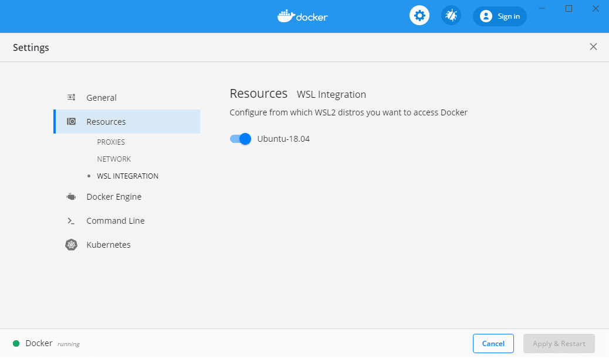
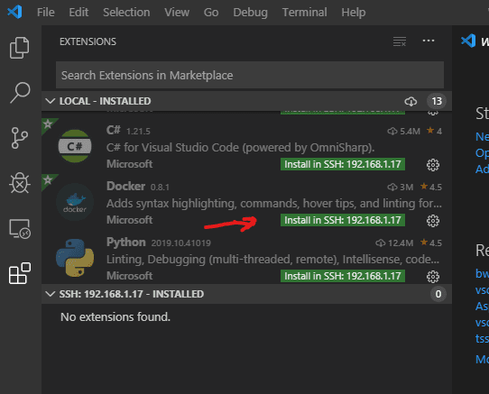

+++
title = "Choose a dev environment"
date = 2024-01-12T22:36:24+08:00
weight = 80
type = "docs"
description = ""
isCJKLanguage = true
draft = false
+++

> 原文: [https://code.visualstudio.com/docs/containers/choosing-dev-environment](https://code.visualstudio.com/docs/containers/choosing-dev-environment)

# Your development environment 您的开发环境


You can choose whether to develop a container-based service in the **local environment**, or in a **remote environment**. The local environment is the operating system of your developer workstation; using the local environment means you build and run your service container(s) using Docker installed on your workstation. Docker is supported on Windows, macOS, and various Linux distributions; for system and hardware requirements, refer to [Docker installation page](https://docs.docker.com/get-docker/).

​​	您可以选择在本地环境或远程环境中开发基于容器的服务。本地环境是您的开发人员工作站的操作系统；使用本地环境意味着您使用安装在工作站上的 Docker 构建和运行服务容器。Docker 支持 Windows、macOS 和各种 Linux 发行版；有关系统和硬件要求，请参阅 Docker 安装页面。

[A remote development environment]() is different from your developer workstation. It can be a remote machine accessible via SSH, a virtual machine running on your developer workstation, or a development container. A remote environment can have advantages over the local environment, the main one being the ability to use the same operating system during development, and when your service is running in production. To use a remote environment, you need to ensure that `docker` command (Docker CLI) [is available and functional within that environment]().

​​	远程开发环境不同于您的开发人员工作站。它可以是通过 SSH 访问的远程计算机、在您的开发人员工作站上运行的虚拟机或开发容器。远程环境可能优于本地环境，主要优点是能够在开发期间和服务在生产中运行时使用相同的操作系统。要使用远程环境，您需要确保 `docker` 命令（Docker CLI）在该环境中可用且可运行。

The second important choice is whether to debug your service running as an ordinary process, or debug your service running in a container.

​​	第二个重要选择是调试作为普通进程运行的服务，还是调试在容器中运行的服务。

## [Guidelines for choosing a development environment 选择开发环境的准则]()

1. Use the local environment when you are not concerned about:

   ​​	在您不关心以下情况时，请使用本地环境：

   - Using the same OS for development and inside the service container.
     在开发和服务容器内使用相同的操作系统。
   - Installing necessary tools and dependencies on top of your local environment.
     在本地环境之上安装必要的工具和依赖项。

2. Consider using a [development container]() first, if you need a remote environment.

   ​​	如果您需要远程环境，请考虑首先使用开发容器。

   - On Windows, using [Windows Subsystem for Linux (WSL)]() is good option.
     在 Windows 上，使用适用于 Linux 的 Windows 子系统 (WSL) 是一个不错的选择。

3. Debugging your service running in a container is possible, but brings additional complexity. Use normal debugging by default, and debugging in the container when you need it.

   ​​	调试在容器中运行的服务是可能的，但会带来额外的复杂性。默认情况下使用常规调试，并在需要时在容器中进行调试。

> The Docker extension natively supports container debugging for .NET-, Node.js-, and Python-based services.
>
> ​​	Docker 扩展本机支持基于 .NET、Node.js 和 Python 的服务的容器调试。

## [Enabling Docker CLI inside a remote development environment 在远程开发环境中启用 Docker CLI]()

The way to enable Docker CLI inside a remote development environment varies depending on the type of remote environment you choose.

​​	在远程开发环境中启用 Docker CLI 的方法取决于您选择的远程环境类型。

### [Development container 开发容器]()

For a development container, you should redirect the Docker CLI inside the container to the Docker daemon running on the local machine.

​​	对于开发容器，您应该将容器内的 Docker CLI 重定向到本地计算机上运行的 Docker 守护程序。

First, make sure Docker CLI is installed into your development container. The exact steps [depend on the Linux distribution the container is using](https://docs.docker.com/install/).

​​	首先，确保已将 Docker CLI 安装到您的开发容器中。具体步骤取决于容器使用的 Linux 发行版。

Here is an example for Ubuntu-based distros (from a `.devcontainer/Dockerfile`):

​​	以下是一个适用于基于 Ubuntu 的发行版的示例（来自 `.devcontainer/Dockerfile` ）：

```
    ...
    && apt-get -y install software-properties-common \
    && curl -fsSL https://download.docker.com/linux/ubuntu/gpg | apt-key add - 2>/dev/null \
    && add-apt-repository "deb [arch=amd64] https://download.docker.com/linux/ubuntu bionic stable" \
    && apt-get update -y \
    && apt-get install -y docker-ce-cli \
    && apt-get install -y python python-pip \
    && pip install docker-compose \
    ...
```

Next, ensure that Docker socket is mapped into the development container (in `.devcontainer/devcontainer.json`):

​​	接下来，确保将 Docker 套接字映射到开发容器中（在 `.devcontainer/devcontainer.json` 中）：

```
    ...
    "runArgs": [ "-v", "/var/run/docker.sock:/var/run/docker.sock"]
    ...
```

### [Windows Subsystem for Linux 适用于 Linux 的 Windows 子系统]()

Windows Subsystem for Linux represents a great choice for container-based service development on Windows. [Windows Subsystem for Linux version 2 (WSL 2)](https://learn.microsoft.com/windows/wsl/compare-versions#whats-new-in-wsl-2) is strongly recommended. Docker Desktop for Windows has been updated to work with WSL 2 and has a graphical setting to enable Docker CLI inside WSL 2 distribution(s):

​​	适用于 Linux 的 Windows 子系统是 Windows 上基于容器的服务开发的绝佳选择。强烈建议使用适用于 Linux 的 Windows 子系统版本 2 (WSL 2)。适用于 Windows 的 Docker Desktop 已更新为可与 WSL 2 配合使用，并具有图形设置，可在 WSL 2 发行版中启用 Docker CLI：



> To use WSL 2 for Docker development you will need Windows 10 version 2004 or newer, and Docker Desktop for Windows version 2.2.0.5 or newer.
>
> ​​	要将 WSL 2 用于 Docker 开发，您需要 Windows 10 版本 2004 或更高版本，以及适用于 Windows 的 Docker Desktop 版本 2.2.0.5 或更高版本。
>
> The old version of WSL (WSL 1) does not provide an easy way to connect to the Docker daemon on the host.
>
> ​​	旧版本的 WSL（WSL 1）不提供一种简单的方法来连接到主机上的 Docker 守护程序。

### [Remote machine 远程计算机]()

The recommended way to enable container development with a remote machine is to do [a full Docker installation](https://docs.docker.com/install/) on the machine, including Docker daemon.

​​	启用使用远程计算机进行容器开发的建议方法是在计算机上进行完整的 Docker 安装，包括 Docker 守护程序。

> **Note**: Docker Desktop product is supported only on physical Windows and macOS machines, not virtual machines. If you want to use a virtual machine as a remote development environment, we recommend to use a Linux VM with [Docker Engine](https://docs.docker.com/engine/).
>
> ​​	注意：Docker Desktop 产品仅在物理 Windows 和 macOS 机器上受支持，不支持虚拟机。如果您想使用虚拟机作为远程开发环境，我们建议使用带有 Docker Engine 的 Linux VM。

After Docker is installed and working on the remote machine, you can use VS Code's [Remote - SSH](https://marketplace.visualstudio.com/items?itemName=ms-vscode-remote.remote-ssh) extension from the [Remote Development](https://marketplace.visualstudio.com/items?itemName=ms-vscode-remote.vscode-remote-extensionpack) extension pack to connect to your remote machine and work there.

​​	在远程机器上安装并运行 Docker 后，您可以使用“远程开发”扩展包中的 VS Code 的“远程 - SSH”扩展连接到远程机器并在其上工作。

1. Open VS Code Command Palette (Ctrl+Shift+P) and run command **Remote-SSH: Add new SSH host...**. Follow the prompts to set up a connection to the target host.

   ​​	打开 VS Code 命令面板 (Ctrl+Shift+P) 并运行命令“远程 - SSH：添加新的 SSH 主机...” 。按照提示设置与目标主机的连接。

2. Run command **Remote-SSH: Connect to host...** and connect to the host.

   ​​	运行命令“远程 - SSH：连接到主机...” 并连接到主机。

3. A new VS Code window opens, running in the context of the target machine. If you're using password authentication, the password will be prompted here. We strongly recommend that you set up [SSH key authentication](https://www.ssh.com/ssh/public-key-authentication), for ease of use.

   ​​	将打开一个新的 VS Code 窗口，在目标机器的上下文中运行。如果您使用的是密码身份验证，则会在此处提示输入密码。我们强烈建议您设置 SSH 密钥身份验证，以便于使用。

4. In the Extensions view, install the Docker extension (on the remote host) (a reload may be required after this step):

   ​​	在“扩展”视图中，安装 Docker 扩展（在远程主机上）（此步骤后可能需要重新加载）：

   

> **Note**: If you are using the Docker extension to build Docker images and have source code, the approach above probably means you have your source enlistment on the remote host, rather than on your developer workstation. If you are just using the Docker extension for the Docker Explorer features, then you can disregard this.
>
> ​​	注意：如果您使用 Docker 扩展来构建 Docker 映像并具有源代码，则上述方法可能意味着您的源征用在远程主机上，而不是在您的开发人员工作站上。如果您仅将 Docker 扩展用于 Docker Explorer 功能，则可以忽略此内容。

### [Local Linux VM 本地 Linux VM]()

To use a Linux virtual machine running on your developer workstation, you should [install Docker](https://docs.docker.com/install/) on the VM in the same way as you would install it on a remote machine, and use the [VS Code Remote-SSH](https://marketplace.visualstudio.com/items?itemName=ms-vscode-remote.remote-ssh) extension to connect to the VM.

​​	若要使用在开发人员工作站上运行的 Linux 虚拟机，您应在 VM 上安装 Docker，安装方式与在远程计算机上安装相同，并使用 VS Code Remote-SSH 扩展连接到 VM。

Alternatively, you can install just the Docker CLI inside your development environment and point the CLI to the Docker host (engine) running on the developer workstation using the [Docker context mechanism](https://docs.docker.com/engine/context/working-with-contexts/). The main concern with this approach is to ensure network connectivity from the VM to the Docker engine on the host, and to do so in a secure way. One option is to use [SSH tunneling](https://code.visualstudio.com/docs/containers/ssh) or [Remote - Tunnels]() to the developer workstation. Another option is to [have the Docker engine listen on an HTTPS port](https://docs.docker.com/engine/security/https/). You need to be proficient with SSH and public-key infrastructure (PKI) to use the host Docker engine from the Docker CLI running inside the VM. For most users, we recommend full Docker installation inside the virtual machine.

​​	或者，您可以在开发环境中仅安装 Docker CLI，并使用 Docker 上下文机制将 CLI 指向在开发人员工作站上运行的 Docker 主机（引擎）。这种方法的主要问题是确保从 VM 到主机上的 Docker 引擎的网络连接，并以安全的方式进行。一种选择是使用 SSH 隧道或远程隧道到开发人员工作站。另一种选择是让 Docker 引擎侦听 HTTPS 端口。您需要精通 SSH 和公钥基础设施 (PKI) 才能从在 VM 中运行的 Docker CLI 使用主机 Docker 引擎。对于大多数用户，我们建议在虚拟机中进行完全的 Docker 安装。

## [Debugging in a container 在容器中调试]()

The Docker extension supports debugging .NET and Node.js-based services running inside a container. Other programming languages are not supported at this time.

​​	Docker 扩展支持调试在容器中运行的基于 .NET 和 Node.js 的服务。目前不支持其他编程语言。

Debugging in a container may be harder to set up than regular debugging because a container is a stronger isolation mechanism than a process. In particular:

​​	在容器中调试可能比常规调试更难设置，因为容器比进程更强大的隔离机制。特别是：

- The debug engine running inside VS Code process needs to communicate with the service process being debugged. In the case of a service running inside a container, this implies network communication via a common network (typically Docker host network). The container needs to have appropriate ports exposed via the Docker host network for the debug engine to connect to the service process (Node.js), or debugger proxy running inside the container (.NET).
  在 VS Code 进程中运行的调试引擎需要与正在调试的服务进程进行通信。对于在容器中运行的服务，这意味着通过公共网络（通常是 Docker 主机网络）进行网络通信。容器需要通过 Docker 主机网络公开适当的端口，以便调试引擎连接到服务进程（Node.js）或在容器中运行的调试器代理（.NET）。
- Source file information generated during build time is valid in the context of the build environment (where VS Code is running). The container filesystem is different from the build environment filesystem, and paths to source files need to be re-mapped in order for the debugger to display correct source file when a breakpoint is hit.
  在生成时生成的源文件信息在生成环境（VS Code 正在运行的环境）的上下文中有效。容器文件系统不同于生成环境文件系统，需要重新映射源文件的路径，以便调试器在命中断点时显示正确的源文件。

Because of the concerns above, it is generally recommended to use regular debugging, and employ debugging in a container when necessary.

​​	由于上述问题，通常建议使用常规调试，并在必要时在容器中使用调试。

For more information about how to set up debugging inside a container see [ASP.NET Core quickstart](), [Node.js quickstart](), and [Docker extension task properties]() (`docker-build` and `docker-run` tasks).

​​	有关如何在容器中设置调试的详细信息，请参阅 ASP.NET Core 快速入门、Node.js 快速入门和 Docker 扩展任务属性（ `docker-build` 和 `docker-run` 任务）。

## [Next steps 后续步骤]()

Read on to learn more about

​​	继续阅读以详细了解

- [Build and run a Node.js app in a container
  在容器中构建并运行 Node.js 应用]()
- [Build and run a ASP.NET Core app in a container
  在容器中生成并运行 ASP.NET Core 应用]()
