+++
title = "Deploy to Azure"
date = 2024-01-12T22:36:24+08:00
weight = 70
type = "docs"
description = ""
isCJKLanguage = true
draft = false
+++

> 原文: [https://code.visualstudio.com/docs/containers/app-service](https://code.visualstudio.com/docs/containers/app-service)

# Deploy a containerized app to Azure 将容器化应用部署到 Azure

In this guide you will learn how to:

​​	在本指南中，您将学习如何：

- Create a container image for your application.
  为您的应用程序创建一个容器映像。
- Push the image to a container registry.
  将映像推送到容器注册表。
- Deploy the image to Azure App Service or Azure Container Apps.
  将映像部署到 Azure App Service 或 Azure Container Apps。

## [Prerequisites 先决条件](https://code.visualstudio.com/docs/containers/app-service#_prerequisites)

- An Azure subscription.
  Azure 订阅。
- [Docker](https://marketplace.visualstudio.com/items?itemName=ms-azuretools.vscode-docker) and [Azure App Service](https://marketplace.visualstudio.com/items?itemName=ms-azuretools.vscode-azureappservice) extensions must be installed.
  必须安装 Docker 和 Azure App Service 扩展。
- A [**web** application](https://learn.microsoft.com/azure/app-service/tutorial-custom-container) that produces a docker image. You could also follow [Create a sample ASP .NET Core application](https://code.visualstudio.com/docs/containers/quickstart-aspnet-core) to create such application.
  生成 docker 映像的 Web 应用程序。您还可以按照创建 ASP .NET Core 示例应用程序来创建此类应用程序。
- You need a [Docker Hub](https://hub.docker.com/) account or an instance of [Azure Container Registry (ACR)](https://learn.microsoft.com/azure/container-registry/container-registry-get-started-portal).
  您需要一个 Docker Hub 帐户或 Azure 容器注册表 (ACR) 实例。

## [Create the application image 创建应用程序映像](https://code.visualstudio.com/docs/containers/app-service#_create-the-application-image)

If you already have an image, skip this step and proceed to [Push the image to a container registry](https://code.visualstudio.com/docs/containers/app-service#_push-the-image-to-a-container-registry) step.

​​	如果您已有映像，请跳过此步骤并继续执行将映像推送到容器注册表步骤。

1. Open the application folder in VS Code.

   ​​	在 VS Code 中打开应用程序文件夹。

2. Open Command Palette (Ctrl+Shift+P) and use **Docker Images: Build Image...** command to build the image.

   ​​	打开命令面板 (Ctrl+Shift+P) 并使用 Docker Images: Build Image... 命令来构建映像。

   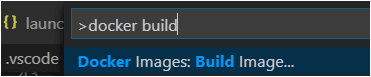

   You can find the image name in the output of the Build Image command, the same can be found in the Images pane of the Docker Explorer.

   ​​	您可以在 Build Image 命令的输出中找到映像名称，也可以在 Docker Explorer 的 Images 窗格中找到它。

   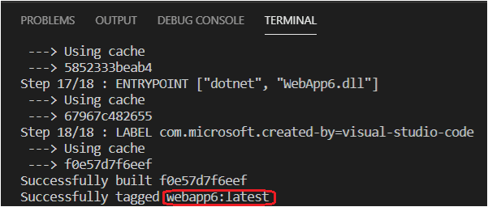

## [Push the image to a container registry 将映像推送到容器注册表](https://code.visualstudio.com/docs/containers/app-service#_push-the-image-to-a-container-registry)

Before deploying the image to an App Service or a Container App, the image must be uploaded to a container registry. The image can be uploaded to either [Azure Container Registry (ACR)](https://learn.microsoft.com/azure/container-registry/container-registry-get-started-portal) or [Docker Hub](https://hub.docker.com/).

​​	在将映像部署到应用服务或容器应用之前，必须将映像上传到容器注册表。可以将映像上传到 Azure 容器注册表 (ACR) 或 Docker Hub。

1. Open the Docker Explorer and select **Connect Registry...** icon under **Registries** group and follow the prompt. Choose the provider (Azure or Docker Hub) and provide the credential to connect to the registry.

   ​​	打开 Docker Explorer，然后选择“注册表”组下的“连接注册表...”图标，并按照提示进行操作。选择提供程序（Azure 或 Docker Hub）并提供凭据以连接到注册表。

   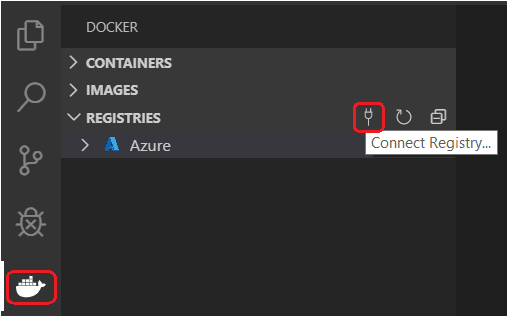

2. Now the registry will be visible under Registries.

   ​​	现在，注册表将在“注册表”下可见。

   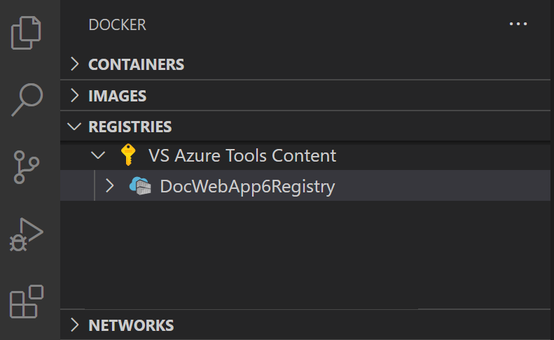

3. Optionally, tag the image. In order to upload an image to a registry, the image needs to be tagged with registry name so that the docker push will upload it to the right registry.

   ​​	还可以选择标记映像。为了将映像上传到注册表，需要使用注册表名称标记映像，以便 docker push 将其上传到正确的注册表。

   - To create a registry in Azure ACR, open the **Registries** section of the Docker view, sign in to Azure if not already signed in, and then right-click on the subscription you want to use, and choose **Create Registry**.

     ​​	若要创建 Azure ACR 中的注册表，请打开 Docker 视图的“注册表”部分，如果尚未登录 Azure，请登录，然后右键单击要使用的订阅，并选择“创建注册表”。

   - The image built in previous section will appear in the Docker Explorer under Images section. Right-click and choose **Tag...**.

     ​​	上一部分中构建的映像将出现在 Docker Explorer 的“映像”部分下。右键单击并选择“标记...”

     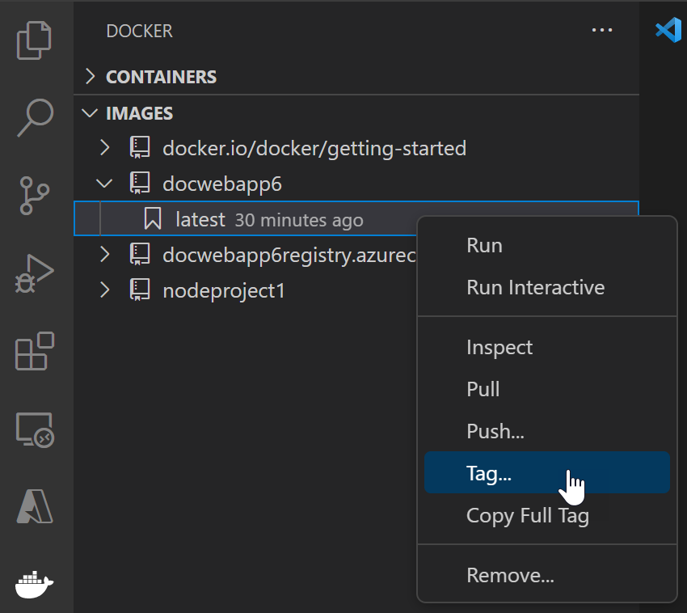

   - Specify the new name `<your registry or username>/<image name>:<tag>` and complete the tag action. For example, new image name for ACR named WebApp6 would be 'webapp6.azurecr.io/webapp6:latest' and for Docker Hub it would be 'myusername/webapp6:latest'.

     ​​	指定新名称 `<your registry or username>/<image name>:<tag>` 并完成标记操作。例如，名为 WebApp6 的 ACR 的新映像名称将是“webapp6.azurecr.io/webapp6:latest”，而 Docker Hub 的新映像名称将是“myusername/webapp6:latest”。

4. The image will show up in the Docker Explorer under the registry that the image tag points to. Select this image and choose **Push**. If the image has not yet been tagged, you will be prompted to choose a registry to push to, and the image will be tagged based on the selection.

   ​​	映像将显示在 Docker Explorer 中，位于映像标记所指向的注册表下。选择此映像并选择“推送”。如果尚未标记映像，系统将提示您选择要推送到的注册表，并且将根据选择标记映像。

   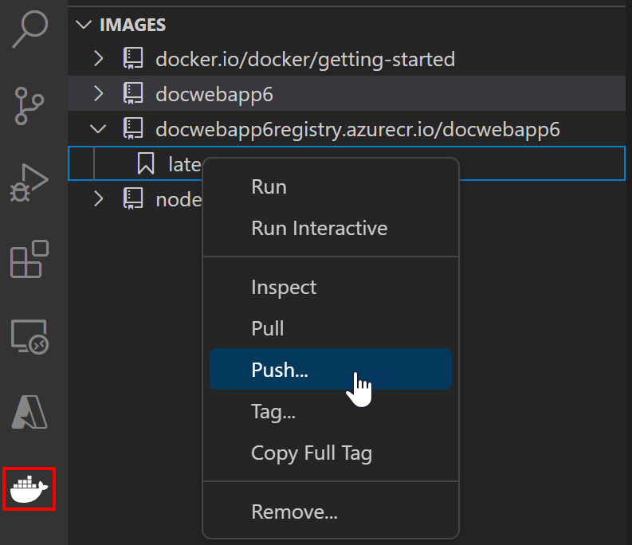

5. Once the push command is completed. Refresh the registry node where the image is pushed to and the uploaded image will show up.

   ​​	推送命令完成后。刷新已将映像推送到其中的注册表节点，上传的映像将显示出来。

   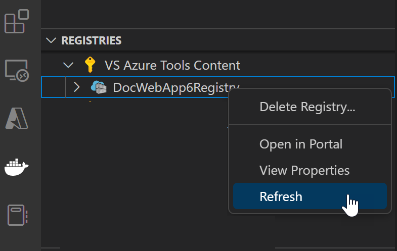

## [Deploy the image to Azure 将映像部署到 Azure](https://code.visualstudio.com/docs/containers/app-service#_deploy-the-image-to-azure)

In the previous section, the image is pushed to a remote container registry. Now deploy this image to Azure App Service or Azure Container Apps.

​​	在上一部分中，映像被推送到远程容器注册表。现在将此映像部署到 Azure App Service 或 Azure Container Apps。

1. In Docker Explorer, navigate to your image under Registries, right-click on the tag, and select **Deploy Image To Azure App Service...** or **Deploy Image to Azure Container Apps...**.

   ​​	在 Docker Explorer 中，导航到“注册表”下的映像，右键单击该标记，然后选择“将映像部署到 Azure App Service...”或“将映像部署到 Azure Container Apps...”

   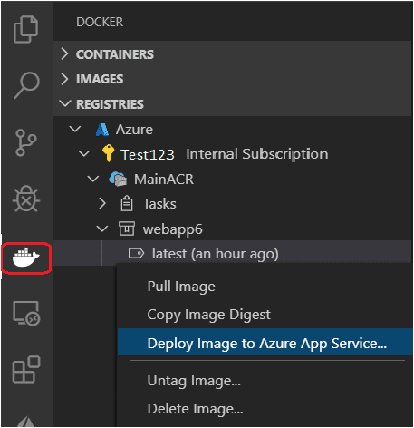

2. When prompted, provide the values for the App Service or Container App.

   ​​	出现提示时，提供 App Service 或 Container App 的值。

   - New web app name: The name must be unique across Azure.
     新的 Web 应用名称：该名称在 Azure 中必须唯一。
   - Resource group: Select an existing resource group or create a new one.
     资源组：选择一个现有的资源组或创建一个新的资源组。
   - App Service plan: Select an existing App Service Plan or create a new one. (An App Service Plan defines the physical resources that host the website; you can use a basic or free plan tier for this tutorial).
     应用服务计划：选择一个现有的应用服务计划或创建一个新的应用服务计划。（应用服务计划定义托管网站的物理资源；您可以为此教程使用基本或免费计划层）。

3. When deployment is complete, Visual Studio Code shows a notification with the website URL.

   ​​	部署完成后，Visual Studio Code 会显示一个包含网站 URL 的通知。

   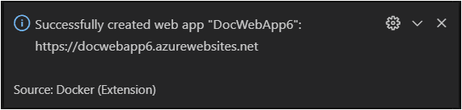

4. You can also see the results in the Output panel of Visual Studio Code, in the Docker section.

   ​​	您还可以在 Visual Studio Code 的“输出”面板中，在 Docker 部分看到结果。

   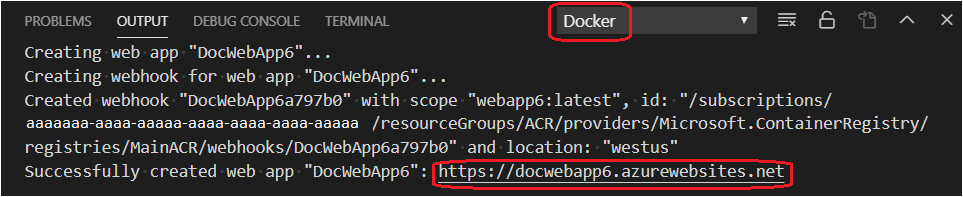

5. To browse the deployed website, you can use Ctrl+click to open the URL in the Output panel. You might need to wait a little while for the app to be live in Azure. The new App Service or Container App also appears in the Azure view in Visual Studio Code, where you can right-click the website and select **Browse Website**.

   ​​	要浏览已部署的网站，您可以使用 Ctrl+单击在“输出”面板中打开 URL。您可能需要稍等片刻，以便应用在 Azure 中上线。新的应用服务或容器应用也会显示在 Visual Studio Code 中的 Azure 视图中，您可以在其中右键单击网站并选择“浏览网站”。

   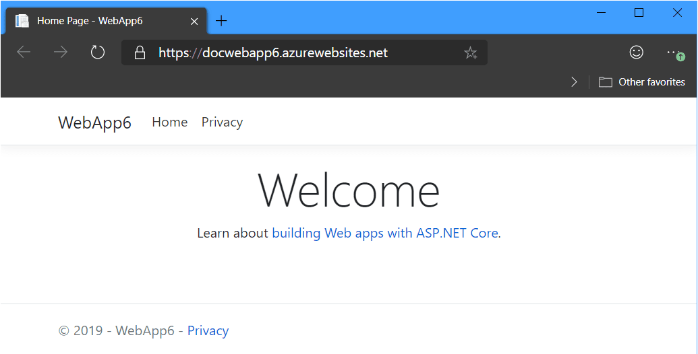

## [Next steps 后续步骤](https://code.visualstudio.com/docs/containers/app-service#_next-steps)

Read on to learn more about

​​	继续阅读以详细了解

- [Azure Extensions](https://code.visualstudio.com/docs/azure/extensions) - The VS Code Marketplace has hundreds of extensions for Azure and the cloud.
  Azure 扩展 - VS Code Marketplace 拥有数百个适用于 Azure 和云的扩展。
- [Deploying to Azure](https://code.visualstudio.com/docs/azure/deployment) - Learn step-by-step how to deploy your application to Azure.
  在 Azure 中部署 - 逐步了解如何将应用程序部署到 Azure。
- [Working with MongoDB](https://code.visualstudio.com/docs/azure/mongodb) - Create, manage, and query MongoDB databases from within VS Code.
  使用 MongoDB - 在 VS Code 中创建、管理和查询 MongoDB 数据库。
