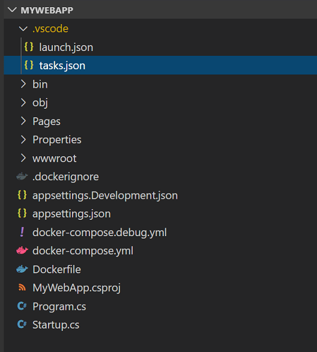
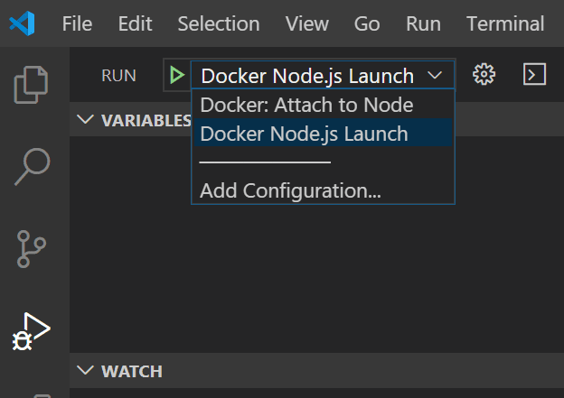
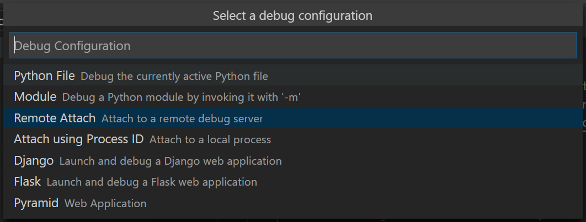
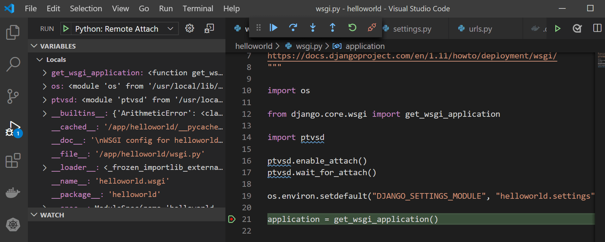
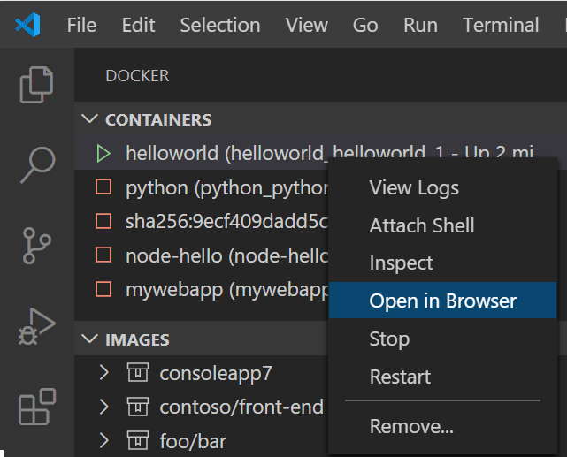
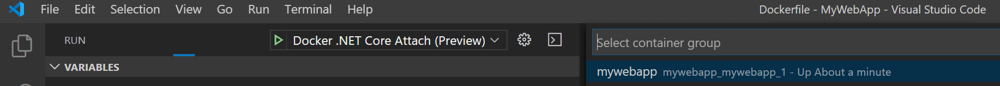
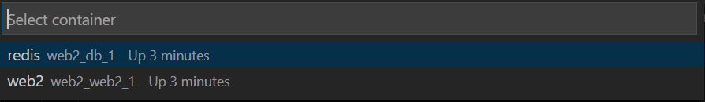
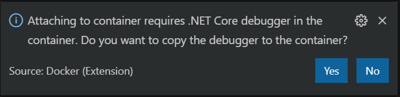
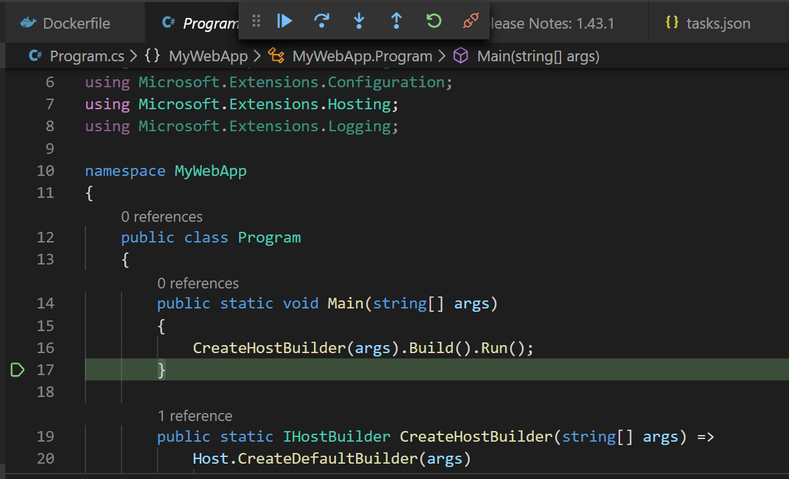

+++
title = "Docker Compose"
date = 2024-01-12T22:36:24+08:00
weight = 50
type = "docs"
description = ""
isCJKLanguage = true
draft = false
+++

> 原文: [https://code.visualstudio.com/docs/containers/docker-compose](https://code.visualstudio.com/docs/containers/docker-compose)

# Use Docker Compose 使用 Docker Compose


Docker Compose provides a way to orchestrate multiple containers that work together. Examples include a service that processes requests and a front-end web site, or a service that uses a supporting function such as a Redis cache. If you are using the microservices model for your app development, you can use Docker Compose to factor the app code into several independently running services that communicate using web requests. This article helps you enable Docker Compose for your apps, whether they are Node.js, Python, or .NET, and also helps you configure debugging in Visual Studio Code for these scenarios.

​​	Docker Compose 提供了一种编排协同工作的多个容器的方法。示例包括处理请求的服务和前端网站，或使用支持功能（如 Redis 缓存）的服务。如果您正在为应用开发使用微服务模型，则可以使用 Docker Compose 将应用代码分解为几个独立运行的服务，这些服务使用 Web 请求进行通信。本文帮助您为应用启用 Docker Compose，无论它们是 Node.js、Python 还是 .NET，还帮助您为这些方案配置 Visual Studio Code 中的调试。

Also, for single-container scenarios, using Docker Compose provides tool-independent configuration in a way that a single Dockerfile does not. Configuration settings such as volume mounts for the container, port mappings, and environment variables can be declared in the docker-compose YML files.

​​	此外，对于单容器方案，使用 Docker Compose 可以提供独立于工具的配置，而单个 Dockerfile 无法做到这一点。可以在 docker-compose YML 文件中声明配置设置，例如容器的卷装载、端口映射和环境变量。

To use Docker Compose in VS Code using the Docker extension, you should already be familiar with the basics of [Docker Compose](https://docs.docker.com/compose/).

​​	若要使用 Docker 扩展在 VS Code 中使用 Docker Compose，您应该已经熟悉 Docker Compose 的基本知识。

## [Adding Docker Compose support to your project 为项目添加 Docker Compose 支持](https://code.visualstudio.com/docs/containers/docker-compose#_adding-docker-compose-support-to-your-project)

If you already have one or more Dockerfiles, you can add Docker Compose files by opening the **Command Palette** (Ctrl+Shift+P), and using the **Docker: Add Docker Compose Files to Workspace** command. Follow the prompts.

​​	如果您已经有一个或多个 Dockerfile，可以通过打开命令面板 (Ctrl+Shift+P) 并使用 Docker: 将 Docker Compose 文件添加到工作区命令来添加 Docker Compose 文件。按照提示进行操作。

You can add Docker Compose files to your workspace at the same time you add a Dockerfile by opening the **Command Palette** (Ctrl+Shift+P) and using the **Docker: Add Docker Files to Workspace** command. You'll be asked if you want to add Docker Compose files. If you want to keep your existing Dockerfile, choose **No** when prompted to overwrite the Dockerfile.

​​	您可以在向工作区添加 Dockerfile 的同时添加 Docker Compose 文件，方法是打开命令面板 (Ctrl+Shift+P) 并使用 Docker: 将 Docker 文件添加到工作区命令。系统会询问您是否要添加 Docker Compose 文件。如果您想保留现有的 Dockerfile，则在系统提示您覆盖 Dockerfile 时选择否。

The Docker extension adds the `docker-compose.yml` file to your workspace. This file contains the configuration to bring up the containers as expected in production. In some cases, a `docker-compose.debug.yml` is also generated. This file provides a simplified mode for starting that enables the debugger.

​​	Docker 扩展会将 `docker-compose.yml` 文件添加到您的工作区。此文件包含在生产环境中按预期启动容器的配置。在某些情况下，还会生成 `docker-compose.debug.yml` 。此文件提供了一种简化的启动模式，可启用调试器。



The VS Code Docker extension generates files that work out of the box, but you can also customize them to optimize for your scenario. You can then use the **Docker Compose Up** command (right-click on the `docker-compose.yml` file, or find the command in the **Command Palette**) to get everything started at once. You can also use the `docker-compose up` command from the command prompt or terminal window in VS Code to start the containers. Refer to the [Docker Compose documentation](https://docs.docker.com/compose/reference/up) about how to configure the Docker Compose behavior and what command-line options are available.

​​	VS Code Docker 扩展会生成开箱即用的文件，但你也可以自定义它们以针对你的方案进行优化。然后，你可以使用 Docker Compose Up 命令（右键单击 `docker-compose.yml` 文件，或在命令面板中查找该命令）来一次性启动所有内容。你还可以使用 VS Code 中命令提示符或终端窗口中的 `docker-compose up` 命令来启动容器。请参阅 Docker Compose 文档，了解如何配置 Docker Compose 行为以及有哪些命令行选项可用。

With the docker-compose files, you can now specify port mappings in the docker-compose files, rather than in the .json configuration files. For examples, see the [Docker Compose documentation](https://docs.docker.com/compose/compose-file/#ports).

​​	使用 docker-compose 文件，你现在可以在 docker-compose 文件中指定端口映射，而不是在 .json 配置文件中指定。有关示例，请参阅 Docker Compose 文档。

> **Tip**: When using Docker Compose, don't specify a host port. Instead, let the Docker pick a random available port to automatically avoid port conflict issues.
>
> ​​	提示：使用 Docker Compose 时，不要指定主机端口。相反，让 Docker 选择一个随机可用的端口以自动避免端口冲突问题。

## [Add new containers to your projects 向项目添加新容器](https://code.visualstudio.com/docs/containers/docker-compose#_add-new-containers-to-your-projects)

If you want to add another app or service, you can run **Add Docker Compose Files to Workspace** again, and choose to overwrite the existing docker-compose files, but you'll lose any customization in those files. If you want to preserve changes to the compose files, you can manually modify the `docker-compose.yml` file to add the new service. Typically, you can copy the existing service section, paste it to create a new entry, and change the names as appropriate for the new service.

​​	如果您想添加另一个应用或服务，您可以再次运行将 Docker Compose 文件添加到工作区，并选择覆盖现有的 docker-compose 文件，但您将丢失这些文件中的任何自定义设置。如果您想保留对 compose 文件的更改，您可以手动修改 `docker-compose.yml` 文件以添加新服务。通常，您可以复制现有的服务部分，将其粘贴以创建新条目，并根据新服务的需要更改名称。

You can run the **Add Docker Files to Workspace** command again to generate the `Dockerfile` for a new app. While each app or service has its own Dockerfile, there's typically one `docker-compose.yml` and one `docker-compose.debug.yml` file per workspace.

​​	您可以再次运行将 Docker 文件添加到工作区命令，以针对新应用生成 `Dockerfile` 。虽然每个应用或服务都有其自己的 Dockerfile，但每个工作区通常有一个 `docker-compose.yml` 和一个 `docker-compose.debug.yml` 文件。

In Python projects, you have the `Dockerfile`, `.dockerignore`, `docker-compose*.yml` files all in the root folder of the workspace. When you add another app or service, move the Dockerfile into the app's folder.

​​	在 Python 项目中，您在工作区的根文件夹中拥有 `Dockerfile` 、 `.dockerignore` 、 `docker-compose*.yml` 文件。当您添加另一个应用或服务时，将 Dockerfile 移至应用的文件夹中。

In Node.js projects, the `Dockerfile` and `.dockerignore` files will be next to the `package.json` for that service.

​​	在 Node.js 项目中， `Dockerfile` 和 `.dockerignore` 文件将位于该服务的 `package.json` 旁边。

For .NET, the folder structure is already set up to handle multiple projects when you create the Docker Compose files, `.dockerignore` and `docker-compose*.yml` are placed in the workspace root (for example, if the project is in `src/project1`, then the files are in `src`), so when you add another service, you create another project in a folder, say `project2`, and recreate or modify the docker-compose files as described previously.

​​	对于 .NET，在创建 Docker Compose 文件时，文件夹结构已经设置为处理多个项目， `.dockerignore` 和 `docker-compose*.yml` 位于工作区根目录（例如，如果项目位于 `src/project1` ，则文件位于 `src` ），因此，当您添加另一个服务时，您会在文件夹中创建一个另一个项目，比如说 `project2` ，并按照前面所述重新创建或修改 docker-compose 文件。

## [Debug 调试](https://code.visualstudio.com/docs/containers/docker-compose#_debug)

First, refer to the debugging documentation for your target platform, to understand the basics on debugging in containers with VS Code:

​​	首先，请参阅目标平台的调试文档，以了解有关在容器中使用 VS Code 进行调试的基础知识：

- [Node.js debugging
  Node.js 调试](https://code.visualstudio.com/docs/containers/debug-node)
- [Python Docker debugging
  Python Docker 调试](https://code.visualstudio.com/docs/containers/debug-python)
- [.NET debugging
  .NET 调试](https://code.visualstudio.com/docs/containers/debug-netcore)

If you want to debug in Docker Compose, run the command **Docker Compose Up** using one of the two Docker Compose files as described in the previous section, and then attach using the appropriate **Attach** launch configuration. Launching directly using the normal launch configuration does not use Docker Compose.

​​	如果您想在 Docker Compose 中进行调试，请使用上一节中所述的两个 Docker Compose 文件之一运行命令 Docker Compose Up，然后使用相应的附加启动配置进行附加。直接使用常规启动配置启动不会使用 Docker Compose。

Create an **Attach** [launch configuration](https://code.visualstudio.com/docs/editor/debugging#_launch-configurations). This is a section in `launch.json`. The process is mostly manual, but in some cases, the Docker extension can help by adding a pre-configured launch configuration that you can use as a template and customize. The process for each platform (Node.js, Python, and .NET) is described in the following sections.

​​	创建附加启动配置。这是 `launch.json` 中的一个部分。该过程大部分是手动的，但在某些情况下，Docker 扩展可以通过添加一个预先配置的启动配置来提供帮助，您可以将其用作模板并进行自定义。每个平台（Node.js、Python 和 .NET）的过程在以下部分中进行了说明。

### [Node.js](https://code.visualstudio.com/docs/containers/docker-compose#_nodejs)

1. On the **Debug** tab, choose the **Configuration** dropdown, choose **New Configuration** and select the `Docker Attach` configuration template **Node.js Docker Attach (Preview)**.

   ​​	在“调试”选项卡上，选择“配置”下拉列表，选择“新建配置”，然后选择 `Docker Attach` 配置模板 Node.js Docker 附加（预览）。

2. Configure the debugging port in `docker-compose.debug.yml`. This is set when you create the file, so you might not need to change it. In the example below, port 9229 is used for debugging on both the host and the container.

   ​​	在 `docker-compose.debug.yml` 中配置调试端口。这是在创建文件时设置的，因此您可能不需要更改它。在下面的示例中，端口 9229 用于在主机和容器上进行调试。

   ```
    version: '3.4'
   
    services:
      node-hello:
        image: node-hello
        build: .
        environment:
          NODE_ENV: development
        ports:
          - 3000
          - 9229:9229
        command: node --inspect=0.0.0.0:9229 ./bin/www
   ```

3. If you have multiple apps, you need to change the port for some of them, so that each app has a unique port. You can point to the right debugging port in the `launch.json`, and save the file. If you omit this, the port will be chosen automatically.

   ​​	如果您有多个应用，则需要为其中一些应用更改端口，以便每个应用都有一个唯一的端口。您可以在 `launch.json` 中指向正确的调试端口，然后保存文件。如果您省略此操作，则会自动选择端口。

   Here's an example that shows the Node.js launch configuration - Attach:

   ​​	以下是一个显示 Node.js 启动配置 - 附加的示例：

   ```
    "configurations": [
        {
            "type": "node",
            "request": "attach",
            "name": "Docker: Attach to Node",
            "remoteRoot": "/usr/src/app",
            "port": 9229 // Optional; otherwise inferred from the docker-compose.debug.yml.
        },
        // ...
    ]
   ```

4. When done editing the **Attach** configuration, save `launch.json`, and select your new launch configuration as the active configuration. In the **Debug** tab, find the new configuration in the **Configuration** dropdown.

   ​​	编辑完“附加”配置后，保存 `launch.json` ，并将新的启动配置选为活动配置。在“调试”选项卡中，在“配置”下拉列表中找到新配置。

   

5. Right-click on the `docker-compose.debug.yml` file and choose **Compose Up**.

   ​​	右键单击 `docker-compose.debug.yml` 文件，然后选择“Compose Up”。

6. When you attach to a service that exposes an HTTP endpoint that returns HTML, the web browser doesn't open automatically. To open the app in the browser, choose the container in the sidebar, right-click and choose **Open in Browser**. If multiple ports are configured, you'll be asked to choose the port.

   ​​	当您附加到公开返回 HTML 的 HTTP 端点的服务时，Web 浏览器不会自动打开。若要在浏览器中打开应用，请选择侧边栏中的容器，右键单击并选择“在浏览器中打开”。如果配置了多个端口，系统会要求您选择端口。

7. Launch the debugger in the usual way. From the **Debug** tab, choose the green arrow (**Start** button) or use F5.

   ​​	以通常的方式启动调试器。在“调试”选项卡中，选择绿色箭头（“启动”按钮）或使用 F5。

### [Python](https://code.visualstudio.com/docs/containers/docker-compose#_python)

For debugging Python with Docker Compose, follow these steps:

​​	要使用 Docker Compose 调试 Python，请按照以下步骤操作：

1. On the **Debug** tab, choose the **Configuration** dropdown, choose **New Configuration**, choose **Python**, and select the `Remote Attach` configuration template.

   ​​	在 Debug 选项卡中，选择 Configuration 下拉列表，选择 New Configuration，选择 Python，然后选择 `Remote Attach` 配置模板。

   

2. You're prompted to choose the host machine (for example, localhost) and port you want to use for debugging. The default debugging port for Python is 5678. If you have multiple apps, you need to change the port for one of them, so that each app has a unique port. You can point to the right debugging port in the `launch.json`, and save the file. If you omit this, the port will be chosen automatically.

   ​​	系统会提示您选择主机（例如，localhost）和您想要用于调试的端口。Python 的默认调试端口为 5678。如果您有多个应用，则需要为其中一个应用更改端口，以便每个应用都有一个唯一的端口。您可以在 `launch.json` 中指向正确的调试端口，然后保存文件。如果您省略此操作，系统会自动选择端口。

   ```
        "configurations": [
        {
           "name": "Python: Remote Attach",
           "type": "python",
           "request": "attach",
           "port": 5678,
           "host": "localhost",
           "pathMappings": [
               {
                   "localRoot": "${workspaceFolder}",
                   "remoteRoot": "/app"
               }
           ]
       }
   ```

3. When done editing the **Attach** configuration, save the `launch.json`. Navigate to the **Debug** tab and select **Python: Remote Attach** as the active configuration.

   ​​	编辑完附加配置后，保存 `launch.json` 。导航到“调试”选项卡，然后选择 Python：远程附加作为活动配置。

4. If you already have a valid Dockerfile, we recommend running the command **Docker: Add Docker Compose Files to Workspace**. This will create a `docker-compose.yml` file and also a `docker-compose.debug.yml`, which volume maps and starts the Python debugger in the container. If you do not have a Dockerfile already, we recommend running **Docker: Add Docker Files to Workspace** and selecting **Yes** to include Docker Compose files.

   ​​	如果您已有有效的 Dockerfile，我们建议您运行命令 Docker：将 Docker Compose 文件添加到工作区。这将创建一个 `docker-compose.yml` 文件，还会创建一个 `docker-compose.debug.yml` ，该文件会对卷进行映射并在容器中启动 Python 调试器。如果您还没有 Dockerfile，我们建议您运行 Docker：将 Docker 文件添加到工作区，然后选择是来包含 Docker Compose 文件。

   > **Note**: By default, when using **Docker: Add Docker Files to Workspace**, choosing the Django and Flask options will scaffold a Dockerfile configured for Gunicorn. Follow the instructions in the [Python in a container quickstart](https://code.visualstudio.com/docs/containers/quickstart-python#_gunicorn-modifications-for-django-and-flask-apps) to ensure it is configured properly before proceeding.
   >
   > ​​	注意：默认情况下，在使用 Docker 时：将 Docker 文件添加到工作区，选择 Django 和 Flask 选项将构建一个为 Gunicorn 配置的 Dockerfile。在继续之前，请按照容器中的 Python 快速入门中的说明确保其配置正确。

5. Right-click on the `docker-compose.debug.yml` file (example shown below) and choose **Compose Up**.

   ​​	右键单击 `docker-compose.debug.yml` 文件（如下所示示例），然后选择 Compose Up。

   ```
   version: '3.4'
   
   services:
     pythonsamplevscodedjangotutorial:
       image: pythonsamplevscodedjangotutorial
       build:
         context: .
         dockerfile: ./Dockerfile
       command: ["sh", "-c", "pip install debugpy -t /tmp && python /tmp/debugpy --wait-for-client --listen 0.0.0.0:5678 manage.py runserver 0.0.0.0:8000 --nothreading --noreload"]
       ports:
         - 8000:8000
         - 5678:5678
   ```

6. Once your container is built and running, attach the debugger by hitting F5 with the **Python: Remote Attach** launch configuration selected.

   ​​	容器构建并运行后，通过按 F5 并选择 Python: Remote Attach 启动配置来附加调试器。

   

   > **Note:** If you would like to import the Python debugger into a specific file, more information can be found in the [debugpy README](https://github.com/microsoft/debugpy#debugpy-import-usage).
   >
   > ​​	注意：如果您想将 Python 调试器导入到特定文件中，可以在 debugpy 自述文件中找到更多信息。

7. When you attach to a service that exposes an HTTP endpoint and returns HTML, the web browser may not open automatically. To open the app in the browser, right-click the container in the Docker Explorer and choose **Open in Browser**. If multiple ports are configured, you'll be asked to choose the port.

   ​​	当您附加到公开 HTTP 端点并返回 HTML 的服务时，Web 浏览器可能不会自动打开。要浏览器中打开应用，请在 Docker Explorer 中右键单击容器，然后选择在浏览器中打开。如果配置了多个端口，系统会要求您选择端口。

   

   You're now debugging your running app in the container.

   ​​	您现在正在容器中调试正在运行的应用。

### [.NET](https://code.visualstudio.com/docs/containers/docker-compose#_net)

1. On the **Debug** tab, choose the **Configuration** dropdown, choose **New Configuration** and select the `Docker Attach` configuration template **.NET Core Docker Attach (Preview)**.

   ​​	在“调试”选项卡上，选择“配置”下拉列表，选择“新建配置”，然后选择 `Docker Attach` 配置模板 .NET Core Docker Attach（预览版）。

2. VS Code tries to copy `vsdbg` from the host machine to the target container using a default path. You can also provide a path to an existing instance of `vsdbg` in the **Attach** configuration.

   ​​	VS Code 尝试使用默认路径将 `vsdbg` 从主机复制到目标容器。您还可以在“附加”配置中提供 `vsdbg` 的现有实例的路径。

   ```
    "netCore": {
        "debuggerPath": "/remote_debugger/vsdbg"
    }
   ```

3. When done editing the **Attach** configuration, save `launch.json`, and select your new launch configuration as the active configuration. In the **Debug** tab, find the new configuration in the **Configuration** dropdown.

   ​​	编辑完“附加”配置后，保存 `launch.json` ，并将新的启动配置选为活动配置。在“调试”选项卡中，在“配置”下拉列表中找到新配置。

4. Right-click on the `docker-compose.debug.yml` file and choose **Compose Up**.

   ​​	右键单击 `docker-compose.debug.yml` 文件，然后选择“Compose Up”。

5. When you attach to a service that exposes an HTTP endpoint that returns HTML, the web browser doesn't open automatically. To open the app in the browser, choose the container in the sidebar, right-click and choose **Open in Browser**. If multiple ports are configured, you'll be asked to choose the port.

   ​​	当您附加到公开返回 HTML 的 HTTP 端点的服务时，Web 浏览器不会自动打开。若要在浏览器中打开应用，请选择侧边栏中的容器，右键单击并选择“在浏览器中打开”。如果配置了多个端口，系统会要求您选择端口。

6. Launch the debugger in the usual way. From the **Debug** tab, choose the green arrow (**Start** button) or use F5.

   ​​	以通常的方式启动调试器。在“调试”选项卡中，选择绿色箭头（“启动”按钮）或使用 F5。

   

7. If you try to attach to a .NET app running in a container, you'll see a prompt ask to select your app's container.

   ​​	如果您尝试附加到在容器中运行的 .NET 应用，您会看到一个提示，要求您选择应用的容器。

   

   To skip this step, specify the container name in the **Attach** configuration in launch.json:

   ​​	若要跳过此步骤，请在 launch.json 中的“附加”配置中指定容器名称：

   ```
       "containerName": "Your ContainerName"
   ```

   Next, you're asked if you want to copy the debugger (`vsdbg`) into the container. Choose **Yes**.

   ​​	接下来，系统会询问您是否要将调试器 ( `vsdbg` ) 复制到容器中。选择“是”。

   

If everything is configured correctly, the debugger should be attached to your .NET app.

​​	如果一切配置正确，调试器应附加到您的 .NET 应用。



## [Volume mounts 卷装载](https://code.visualstudio.com/docs/containers/docker-compose#_volume-mounts)

By default, the Docker extension does not do any volume mounting for debugging components. There's no need for it in .NET or Node.js, since the required components are built into the runtime. If your app requires volume mounts, specify them by using the `volumes` tag in the `docker-compose*.yml` files.

​​	默认情况下，Docker 扩展不会为调试组件执行任何卷装载。在 .NET 或 Node.js 中不需要这样做，因为所需的组件已内置到运行时中。如果您的应用需要卷装载，请使用 `volumes` 标记在 `docker-compose*.yml` 文件中指定它们。

```
volumes:
    - /host-folder-path:/container-folder-path
```

## [Docker Compose with multiple Compose files 具有多个 Compose 文件的 Docker Compose](https://code.visualstudio.com/docs/containers/docker-compose#_docker-compose-with-multiple-compose-files)

Workspaces can have multiple docker-compose files to handle different environments like development, test, and production. The content of the configuration can be split into multiple files. For example, a base compose file that defines the common information for all environments and separate override files that define environment-specific information. When these files are passed as input to the `docker-compose` command, it combines these files into a single configuration. By default, the **Docker: Compose Up** command passes a single file as input to the compose command, but you can customize the `compose up` command to pass in multiple files using [command customization](https://code.visualstudio.com/docs/containers/reference#_command-customization). Or, you can use a [custom task](https://code.visualstudio.com/docs/editor/tasks#_custom-tasks) to invoke the `docker-compose` command with the desired parameters.

​​	工作区可以有多个 docker-compose 文件来处理不同的环境，如开发、测试和生产。配置的内容可以拆分为多个文件。例如，一个定义所有环境的通用信息的基准 compose 文件和定义特定于环境的信息的单独覆盖文件。当这些文件作为输入传递给 `docker-compose` 命令时，它会将这些文件合并为单个配置。默认情况下，Docker: Compose Up 命令将单个文件作为输入传递给 compose 命令，但您可以自定义 `compose up` 命令以使用命令自定义功能传入多个文件。或者，您可以使用自定义任务来调用具有所需参数的 `docker-compose` 命令。

> **Note**: If your workspace has `docker-compose.yml` and `docker-compose.override.yml` and no other compose files, then the `docker-compose` command is invoked with no input files and it implicitly uses these files. In this case, no customization is needed.
>
> ​​	注意：如果您的工作区具有 `docker-compose.yml` 和 `docker-compose.override.yml` 且没有其他 compose 文件，则 `docker-compose` 命令将不带任何输入文件被调用，并且它会隐式使用这些文件。在这种情况下，无需自定义。

## [Command customization 命令自定义](https://code.visualstudio.com/docs/containers/docker-compose#_command-customization)

[Command customization](https://code.visualstudio.com/docs/containers/reference#_command-customization) provides various ways to customize the `compose up` command based on your requirements. The following are few sample command customization for the `compose up` command.

​​	命令自定义提供了多种方法来根据您的要求自定义 `compose up` 命令。以下是 `compose up` 命令的一些示例命令自定义。

### [Base file and an override file 基本文件和覆盖文件](https://code.visualstudio.com/docs/containers/docker-compose#_base-file-and-an-override-file)

Let's assume your workspace has a base compose file (`docker-compose.yml`) and an override file for each environment (`docker-compose.dev.yml`, `docker-compose.test.yml` and `docker-compose.prod.yml`) and you always run `docker compose up` with the base file and an override file. In this case, the `compose up` command can be customized as in the following example. When the `compose up` command is invoked, the `${configurationFile}` is replaced by the selected file.

​​	假设您的工作区具有基本 compose 文件 ( `docker-compose.yml` ) 和每个环境的覆盖文件 ( `docker-compose.dev.yml` 、 `docker-compose.test.yml` 和 `docker-compose.prod.yml` )，并且您始终使用基本文件和覆盖文件运行 `docker compose up` 。在这种情况下，可以按以下示例自定义 `compose up` 命令。调用 `compose up` 命令时， `${configurationFile}` 将被选定文件替换。

```
"docker.commands.composeUp": [
    {
        "label": "override",
        "template": "docker-compose -f docker-compose.yml ${configurationFile}  up -d --build",
    }
]
```

### [Template matching 模板匹配](https://code.visualstudio.com/docs/containers/docker-compose#_template-matching)

Let's assume you have a different set of input files for each environment. You could define multiple templates with regular expression match, and the selected file name will be matched against this `match` property and the corresponding template will be used.

​​	假设您为每个环境都有一组不同的输入文件。您可以使用正则表达式匹配定义多个模板，并将选定的文件名与该 `match` 属性进行匹配，然后使用相应的模板。

```
"docker.commands.composeUp": [
    {
        "label": "dev-match",
        "template": "docker-compose -f docker-compose.yml -f docker-compose.debug.yml -f docker-compose.dev.yml up -d --build",
        "match": "dev"
    },
    {
        "label": "test-match",
        "template": "docker-compose -f docker-compose.yml -f docker-compose.debug.yml -f docker-compose.test.yml up -d --build",
        "match": "test"
    },
    {
        "label": "prod-match",
        "template": "docker-compose -f docker-compose.yml -f docker-compose.release.yml -f docker-compose.prod.yml up -d --build",
        "match": "prod"
    }
]
```

### [Pick a template when the command is invoked 在调用命令时选择模板](https://code.visualstudio.com/docs/containers/docker-compose#_pick-a-template-when-the-command-is-invoked)

If you omit the `match` property from command templates, you're asked which template to use each time `compose up` command is invoked. For example:

​​	如果从命令模板中省略 `match` 属性，则每次调用 `compose up` 命令时都会询问您要使用哪个模板。例如：

```
"docker.commands.composeUp": [
    {
        "label": "dev",
        "template": "docker-compose -f docker-compose.yml -f docker-compose.common.dev.yml ${configurationFile} up -d --build"
    },
    {
        "label": "test",
        "template": "docker-compose -f docker-compose.yml -f docker-compose.common.test.yml ${configurationFile} up -d --build"
    },
    {
        "label": "prod",
        "template": "docker-compose -f docker-compose.yml -f docker-compose.common.prod.yml ${configurationFile} up -d --build"
    },
],
```

## [Custom tasks 自定义任务](https://code.visualstudio.com/docs/containers/docker-compose#_custom-tasks)

Rather than use command customization, you can also define a task like the following to invoke a `docker-compose` command. Please refer [custom task](https://code.visualstudio.com/docs/editor/tasks#_custom-tasks) for more detail on this option.

​​	除了使用命令自定义之外，您还可以定义类似于以下内容的任务来调用 `docker-compose` 命令。有关此选项的更多详细信息，请参阅自定义任务。

```
{
  "type": "shell",
  "label": "compose-up-dev",
  "command": "docker-compose -f docker-compose.yml -f docker-compose.Common.yml -f docker-compose.dev.yml up -d --build",
  "presentation": {
    "reveal": "always",
    "panel": "new"
  }
}
```

## [Next steps 后续步骤](https://code.visualstudio.com/docs/containers/docker-compose#_next-steps)

- [Overview of Docker Compose in the Docker documentation
  Docker 文档中的 Docker Compose 概述](https://docs.docker.com/compose/)
- [Troubleshooting
  故障排除](https://code.visualstudio.com/docs/containers/troubleshooting)
