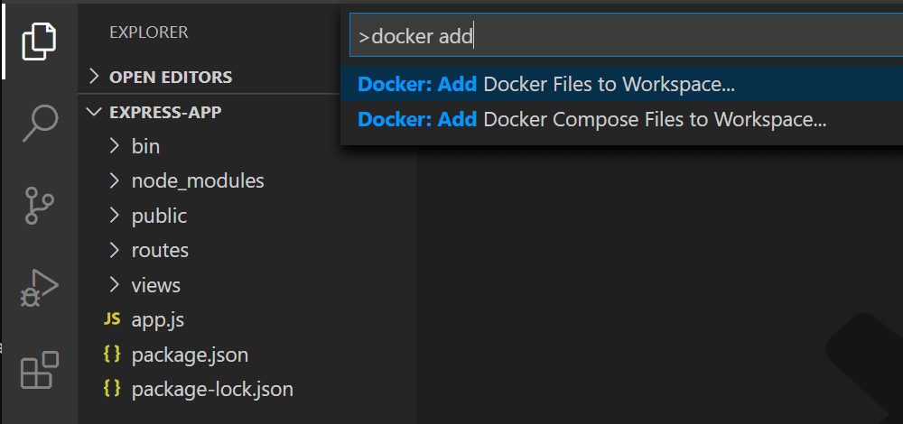
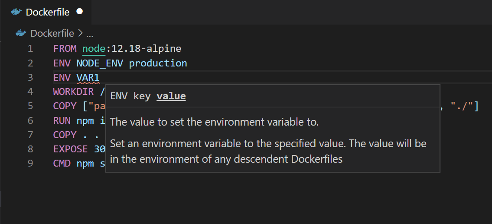
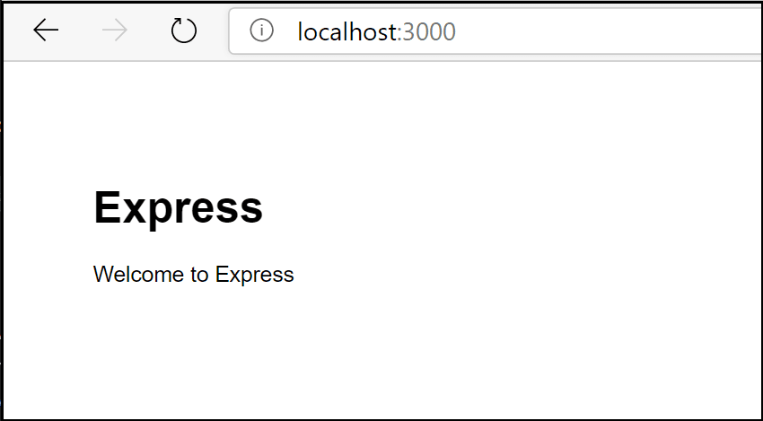
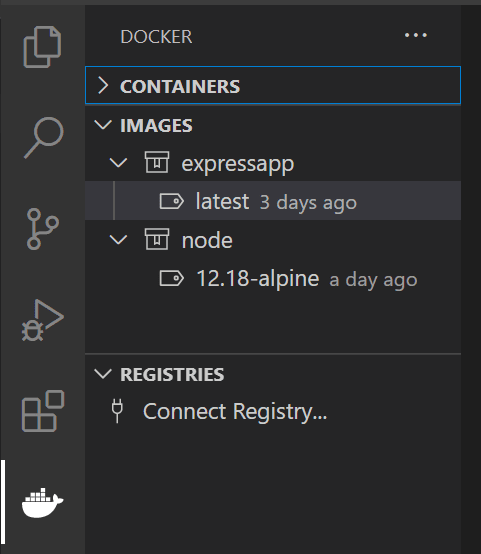
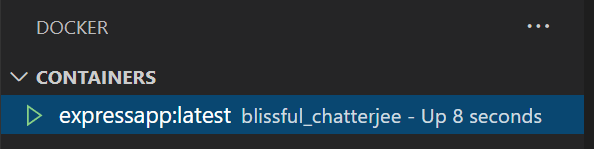
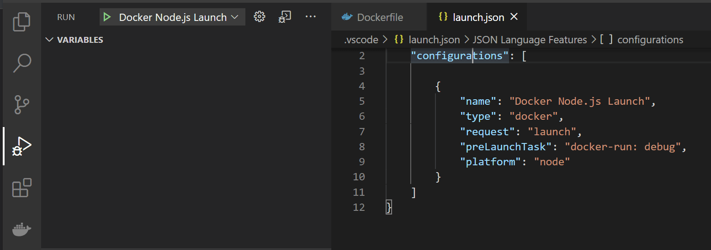
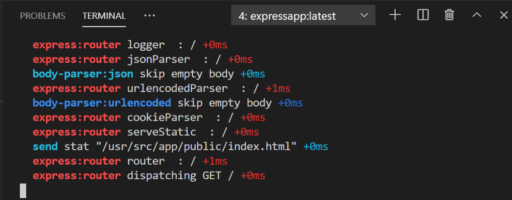

+++
title = "Node.js"
date = 2024-01-12T22:36:24+08:00
weight = 10
type = "docs"
description = ""
isCJKLanguage = true
draft = false
+++

> 原文: [https://code.visualstudio.com/docs/containers/quickstart-node](https://code.visualstudio.com/docs/containers/quickstart-node)

# Node.js in a container 容器中的 Node.js


In this guide you will learn how to:

​​	在本指南中，您将学习如何：

- Create a `Dockerfile` file for an [Express](https://expressjs.com/) Node.js service container
  为 Express Node.js 服务容器创建 `Dockerfile` 文件
- Build, run, and verify the functionality of the service
  构建、运行和验证服务的运行状况
- Debug the service running within a container
  调试在容器内运行的服务

## [Prerequisites 先决条件](https://code.visualstudio.com/docs/containers/quickstart-node#_prerequisites)

- Both Docker and the VS Code Docker extension must be installed as described in the [overview](https://code.visualstudio.com/docs/containers/overview#_installation)
  必须按照概述中所述安装 Docker 和 VS Code Docker 扩展
- [Node.js](https://nodejs.org/) version 10 or later
  Node.js 版本 10 或更高版本

## [Create an Express Node.js application 创建 Express Node.js 应用程序](https://code.visualstudio.com/docs/containers/quickstart-node#_create-an-express-nodejs-application)

1. Create a folder for the project.

   ​​	为项目创建一个文件夹。

2. Open a development command prompt in the project folder and create the project:

   ​​	在项目文件夹中打开开发命令提示符并创建项目：

   ```
   npx express-generator
   npm install
   ```

## [Add Docker files to the project 将 Docker 文件添加到项目](https://code.visualstudio.com/docs/containers/quickstart-node#_add-docker-files-to-the-project)

1. Open the project folder in VS Code.

   ​​	在 VS Code 中打开项目文件夹。

2. Open the Command Palette (Ctrl+Shift+P) and use **Docker: Add Docker Files to Workspace...** command:

   ​​	打开命令面板 (Ctrl+Shift+P) 并使用 Docker: Add Docker Files to Workspace... 命令：

   

3. Select **Node.js** when prompted for the application platform.

   ​​	在提示应用程序平台时选择 Node.js。

4. Choose the default **package.json** file.

   ​​	选择默认的 package.json 文件。

5. Enter `3000` when prompted for the application port.

   ​​	在提示应用程序端口时输入 `3000` 。

6. Select either **Yes** or **No** when prompted to include Docker Compose files. Compose is typically used when running multiple containers at once.

   ​​	在提示是否包含 Docker Compose 文件时选择是或否。Compose 通常用于一次运行多个容器。

The extension creates `Dockerfile` and `.dockerignore` files. If you elected to include Docker Compose files, `docker-compose.yml` and `docker-compose.debug.yml` will be generated as well. Finally, the extension will create a set of **VS Code tasks** in `.vscode/tasks.json` for building and running the container (in both debug- and release-configurations) and a **launch debug configuration** in `.vscode/launch.json` for debugging the service within the container.

​​	扩展将创建 `Dockerfile` 和 `.dockerignore` 文件。如果您选择包含 Docker Compose 文件，还将生成 `docker-compose.yml` 和 `docker-compose.debug.yml` 。最后，扩展将在 `.vscode/tasks.json` 中创建一组 VS Code 任务，用于构建和运行容器（在调试和发布配置中），并在 `.vscode/launch.json` 中创建启动调试配置，用于调试容器内的服务。

## [Add an environment variable to the image 向映像添加环境变量](https://code.visualstudio.com/docs/containers/quickstart-node#_add-an-environment-variable-to-the-image)

The Docker extension helps you author Dockerfiles by using [IntelliSense](https://code.visualstudio.com/docs/editor/intellisense) to provide auto-completions and contextual help. To see this feature in action, add an environment variable to your service image by following these steps:

​​	Docker 扩展通过使用 IntelliSense 提供自动完成和上下文帮助，帮助您编写 Dockerfile。要查看此功能的实际操作，请按照以下步骤向服务映像添加环境变量：

1. Open the `Dockerfile` file.

   ​​	打开 `Dockerfile` 文件。

2. Use `ENV` instruction to add an environment variable to the service container image.

   ​​	使用 `ENV` 指令向服务容器映像添加环境变量。

   

   Note how the Docker extension lists all available Dockerfile instructions and describes the syntax.

   ​​	请注意 Docker 扩展如何列出所有可用的 Dockerfile 指令并描述语法。

   > The Docker extension uses the `base` stage of the `Dockerfile` to create a debug version of the container image for your service. Put the environment variable definition in the `base` stage to have this variable available in both debug and release versions of the container image.
   >
   > ​​	Docker 扩展使用 `Dockerfile` 的 `base` 阶段为您的服务创建容器映像的调试版本。将环境变量定义放在 `base` 阶段，以便在容器映像的调试版本和发布版本中都可以使用此变量。

3. Save the `Dockerfile` file.

   ​​	保存 `Dockerfile` 文件。

## [Run the service locally 在本地运行服务](https://code.visualstudio.com/docs/containers/quickstart-node#_run-the-service-locally)

1. Open a terminal (Ctrl+`).

   ​​	打开终端 (Ctrl+`)。

2. Enter `npm run start` to start the application:

   ​​	输入 `npm run start` 以启动应用程序：

   ```
   > express-app@0.0.0 start /Users/user/code/scratch/express-app
   > node ./bin/www
   ```

3. Open the web browser and navigate to [http://localhost:3000](http://localhost:3000/). You should see a page similar to the following:

   ​​	打开 Web 浏览器并导航到 http://localhost:3000。您应该会看到类似于以下内容的页面：

   

4. When done testing, type Ctrl+C in the terminal.

   ​​	测试完成后，在终端中键入 Ctrl+C。

## [Build the service image 构建服务映像](https://code.visualstudio.com/docs/containers/quickstart-node#_build-the-service-image)

1. Open the Command Palette (Ctrl+Shift+P) and select the **Docker Images: Build Image...** command.

   ​​	打开命令面板 (Ctrl+Shift+P) 并选择 Docker 映像：构建映像... 命令。

2. Open the Docker Explorer and verify that the new image is visible in the Images tree:

   ​​	打开 Docker 资源管理器并验证新映像是否在映像树中可见：

   

## [Run the service container 运行服务容器](https://code.visualstudio.com/docs/containers/quickstart-node#_run-the-service-container)

1. Right-click on the image built in the previous section and select **Run** or **Run Interactive**. The container should start and you should be able to see it in the Docker Containers tree:

   ​​	右键单击在上一步中构建的映像，然后选择运行或运行交互式。容器应启动，您应该能够在 Docker 容器树中看到它：

   

2. Open the web browser and navigate to [http://localhost:3000](http://localhost:3000/). You should see a page similar to the following:

   ​​	打开 Web 浏览器并导航至 http://localhost:3000。您应该会看到类似于以下内容的页面：

   

3. When done testing, right-click the container in the Containers tree and select **Stop**.

   ​​	测试完成后，右键单击容器树中的容器并选择停止。

## [Debug in the service container 在服务容器中调试](https://code.visualstudio.com/docs/containers/quickstart-node#_debug-in-the-service-container)

When the Docker extension adds files to the application, it also adds a **VS Code debugger configuration** in `.vscode/launch.json` for debugging the service when running inside a container. The extension detects the protocol and port used by the service and points the browser to the service.

​​	当 Docker 扩展将文件添加到应用程序时，它还会在 `.vscode/launch.json` 中添加一个 VS Code 调试器配置，以便在容器内运行时调试服务。该扩展检测服务使用的协议和端口，并将浏览器指向该服务。

1. Set a breakpoint in the `get()` handler for the `'/'` route in `routes/index.js`.

   ​​	在 `routes/index.js` 中的 `'/'` 路由的 `get()` 处理程序中设置断点。

2. Make sure the **Docker Node.js Launch** debugger configuration is selected.

   ​​	确保已选择 Docker Node.js 启动调试器配置。

   

3. Start debugging (use the F5 key).

   ​​	开始调试（使用 F5 键）。

   - The Docker image for the service builds.
     构建服务的 Docker 映像。
   - The Docker container for the service runs.
     运行服务的 Docker 容器。
   - The browser opens to the (random) port mapped to the service container.
     浏览器会打开映射到服务容器的（随机）端口。
   - The debugger stops at the breakpoint in `index.js`.
     调试器在 `index.js` 中的断点处停止。

   > Note that, because the debugger attaches *after* the application starts, the breakpoint may be missed the first time around; you might have to refresh the browser to see the debugger break on the second try.
   >
   > ​​	请注意，由于调试器在应用程序启动后附加，因此第一次可能会错过断点；您可能需要刷新浏览器才能在第二次尝试时看到调试器中断。
   >
   > You can configure the application to wait for the debugger to attach before starting execution by setting the [inspectMode](https://code.visualstudio.com/docs/containers/reference#_node-object-properties-dockerrun-task) property to `break` in the `docker-run: debug` task in `tasks.json` under the `node` object.
   >
   > ​​	您可以通过在 `tasks.json` 下的 `node` 对象中的 `docker-run: debug` 任务中将 inspectMode 属性设置为 `break` 来配置应用程序，使其在启动执行之前等待调试器附加。

## [View the application logs 查看应用程序日志](https://code.visualstudio.com/docs/containers/quickstart-node#_view-the-application-logs)

You can view the logs in VS Code by using the **View Logs** command on the container:

​​	您可以在 VS Code 中使用容器上的查看日志命令来查看日志：

1. Navigate to the Docker Explorer.

   ​​	导航到 Docker Explorer。

2. In the **Containers** tab, right-click on your container and choose **View Logs**.

   ​​	在容器选项卡中，右键单击容器并选择查看日志。

   

3. The output will be displayed in the terminal.

   ​​	输出将显示在终端中。

## [Next steps 后续步骤](https://code.visualstudio.com/docs/containers/quickstart-node#_next-steps)

You're done! Now that your container is ready, you may want to:

​​	您已完成！现在您的容器已准备就绪，您可能需要：

- [Learn about debugging Node.js in a container
  了解如何在容器中调试 Node.js](https://code.visualstudio.com/docs/containers/debug-node)
- [Customize your Docker build and run tasks
  自定义 Docker 构建并运行任务](https://code.visualstudio.com/docs/containers/reference)
- [Push your image to a container registry
  将您的镜像推送到容器注册表](https://code.visualstudio.com/docs/containers/quickstart-container-registries#_push-an-image-to-a-container-registry)
- [Learn about using Docker Compose
  了解如何使用 Docker Compose](https://code.visualstudio.com/docs/containers/docker-compose)
