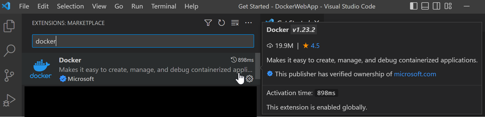
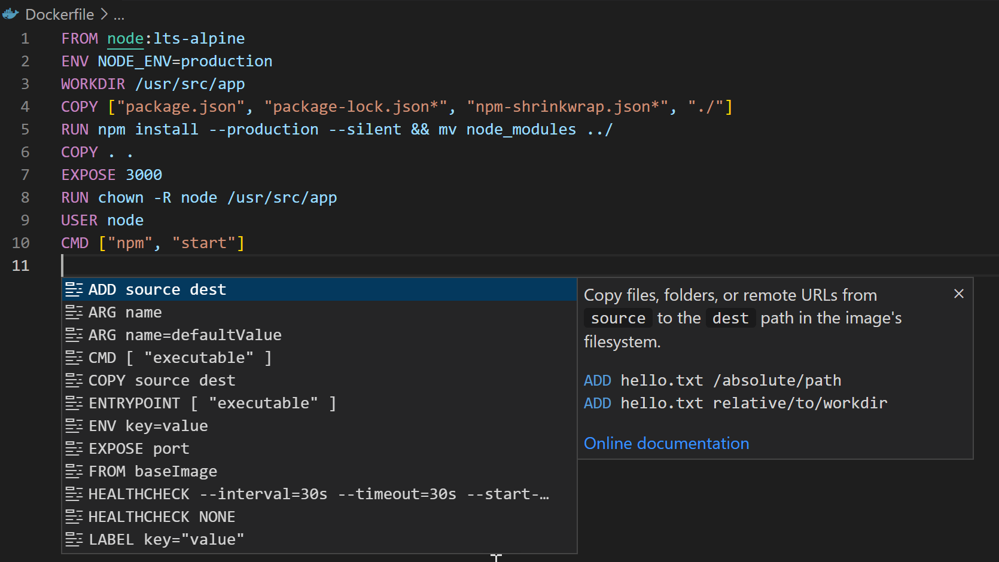
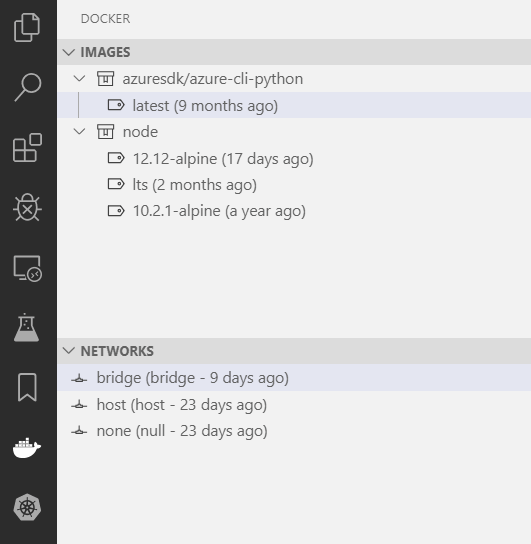
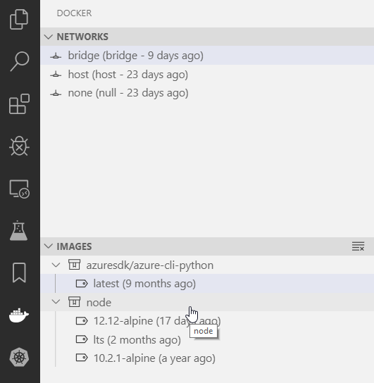
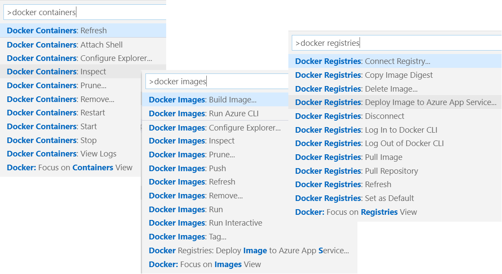
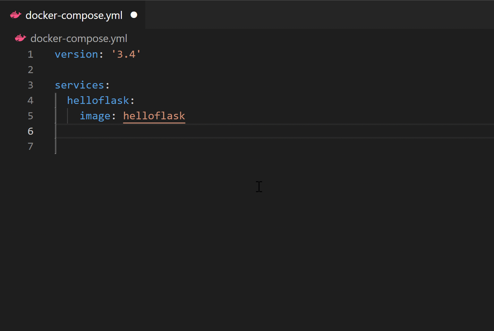
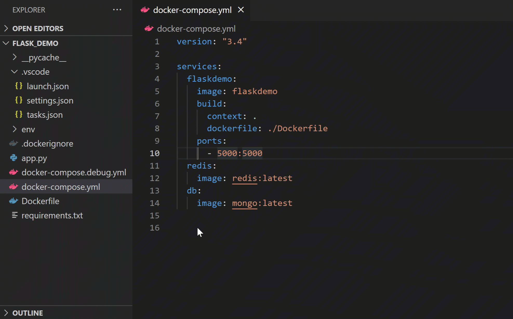
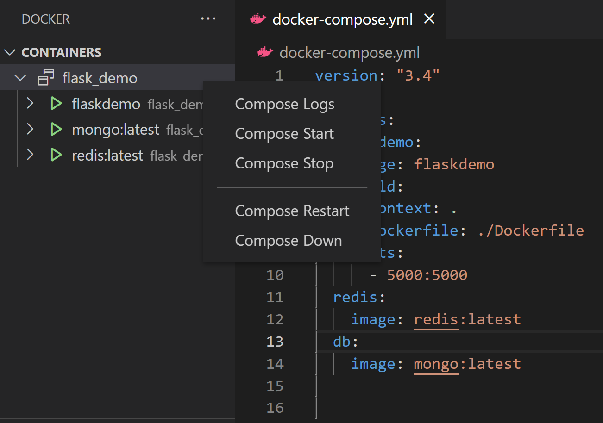

+++
title = "Overview"
date = 2024-01-12T22:36:24+08:00
weight = 1
type = "docs"
description = ""
isCJKLanguage = true
draft = false
+++

> 原文: [https://code.visualstudio.com/docs/containers/overview](https://code.visualstudio.com/docs/containers/overview)

# Docker in Visual Studio Code Visual Studio Code 中的 Docker

The [Docker](https://marketplace.visualstudio.com/items?itemName=ms-azuretools.vscode-docker) extension makes it easy to build, manage, and deploy containerized applications in Visual Studio Code.

​​	Docker 扩展使在 Visual Studio Code 中构建、管理和部署容器化应用程序变得容易。

This page provides an overview of the Docker extension capabilities; use the side menu to learn more about topics of interest. If you are just getting started with Docker development, try the [Docker tutorial](https://learn.microsoft.com/visualstudio/docker/tutorials/docker-tutorial) first to understand key Docker concepts.

​​	此页面概述了 Docker 扩展功能；使用侧边菜单了解有关感兴趣主题的更多信息。如果您刚开始使用 Docker 开发，请先尝试 Docker 教程以了解 Docker 的主要概念。

## [Installation 安装](https://code.visualstudio.com/docs/containers/overview#_installation)

[Install Docker](https://docs.docker.com/install/) on your machine and add it to the system path.

​​	在您的计算机上安装 Docker 并将其添加到系统路径。

On Linux, you should also [enable Docker CLI for the non-root user account](https://docs.docker.com/install/linux/linux-postinstall/#manage-docker-as-a-non-root-user) that will be used to run VS Code.

​​	在 Linux 上，您还应为将用于运行 VS Code 的非根用户帐户启用 Docker CLI。

To install the extension, open the Extensions view (Ctrl+Shift+X), search for `docker` to filter results and select Docker extension authored by Microsoft.

​​	要安装扩展，请打开“扩展”视图 (Ctrl+Shift+X)，搜索 `docker` 以筛选结果，然后选择 Microsoft 编写的 Docker 扩展。

## [Editing Docker files 编辑 Docker 文件](https://code.visualstudio.com/docs/containers/overview#_editing-docker-files)

You can get [IntelliSense](https://code.visualstudio.com/docs/editor/intellisense) by clicking Ctrl+Space when editing your `Dockerfile` and `docker-compose.yml` files, with completions and syntax help for common commands.

​​	编辑 `Dockerfile` 和 `docker-compose.yml` 文件时，单击 Ctrl+Space 即可获得 IntelliSense，其中包含常见命令的补全和语法帮助。

In addition, you can use the Problems panel (Ctrl+Shift+M) to view common errors for `Dockerfile` and `docker-compose.yml` files.

​​	此外，您可以使用“问题”面板 (Ctrl+Shift+M) 查看 `Dockerfile` 和 `docker-compose.yml` 文件的常见错误。

## [Generating Docker files 生成 Docker 文件](https://code.visualstudio.com/docs/containers/overview#_generating-docker-files)

You can add Docker files to your workspace by opening the Command Palette (Ctrl+Shift+P) and using **Docker: Add Docker Files to Workspace** command. The command will generate `Dockerfile` and `.dockerignore` files and add them to your workspace. The command will also ask you if you want to add Docker Compose files as well, but this is optional.

​​	您可以通过打开命令面板 (Ctrl+Shift+P) 并使用 Docker: 将 Docker 文件添加到工作区命令将 Docker 文件添加到工作区。该命令将生成 `Dockerfile` 和 `.dockerignore` 文件并将它们添加到您的工作区。该命令还会询问您是否还要添加 Docker Compose 文件，但这只是可选操作。

The extension can scaffold Docker files for most popular development languages (C#, Node.js, Python, Ruby, Go, and Java) and customizes the generated Docker files accordingly. When these files are created, we also create the necessary artifacts to provide debugging support for Node.js, Python, and .NET (C#).

​​	该扩展可以为最流行的开发语言（C#、Node.js、Python、Ruby、Go 和 Java）构建 Docker 文件，并相应地自定义生成的 Docker 文件。创建这些文件时，我们还会创建必要的工件，以提供对 Node.js、Python 和 .NET (C#) 的调试支持。

## [Docker Explorer Docker 资源管理器](https://code.visualstudio.com/docs/containers/overview#_docker-explorer)

The Docker extension contributes a Docker Explorer view to VS Code. The Docker Explorer lets you examine and manage Docker assets: containers, images, volumes, networks, and container registries. If you are signed in to your Microsoft account and it has access to Azure subscriptions, you can browse your Azure Container Registries as well.

​​	Docker 扩展为 VS Code 提供了一个 Docker 资源管理器视图。Docker 资源管理器允许您检查和管理 Docker 资产：容器、映像、卷、网络和容器注册表。如果您已登录到 Microsoft 帐户并且它可以访问 Azure 订阅，您还可以浏览 Azure 容器注册表。

The right-click menu provides access to commonly used commands for each type of asset.

​​	右键单击菜单提供对每种类型的资产的常用命令的访问权限。

You can rearrange the Docker Explorer panes by dragging them up or down with a mouse and use the context menu to hide or show them.

​​	您可以通过用鼠标向上或向下拖动来重新排列 Docker Explorer 窗格，并使用上下文菜单来隐藏或显示它们。

## [Docker commands Docker 命令](https://code.visualstudio.com/docs/containers/overview#_docker-commands)

Many of the most common Docker commands are built right into the Command Palette:

​​	许多最常见的 Docker 命令都内置在命令面板中：

You can run Docker commands to manage [images](https://docs.docker.com/engine/reference/commandline/image/), [networks](https://docs.docker.com/engine/reference/commandline/network/), [volumes](https://docs.docker.com/engine/reference/commandline/volume/), [image registries](https://docs.docker.com/engine/reference/commandline/push/), and [Docker Compose](https://docs.docker.com/compose/reference/overview/). In addition, the **Docker: Prune System** command will remove stopped containers, dangling images, and unused networks and volumes.

​​	您可以运行 Docker 命令来管理映像、网络、卷、映像注册表和 Docker Compose。此外，Docker：清理系统命令将删除已停止的容器、孤立的映像以及未使用的网络和卷。

## [Docker Compose](https://code.visualstudio.com/docs/containers/overview#_docker-compose)

[Docker Compose](https://docs.docker.com/compose/) lets you define and run multi-container applications with Docker. Our [Compose Language Service](https://github.com/microsoft/compose-language-service) in the Docker extension gives you IntelliSense and tab completions when authoring `docker-compose.yml` files. Press Ctrl+Space to see a list of valid Compose directives.

​​	Docker Compose 允许您使用 Docker 定义和运行多容器应用程序。Docker 扩展中的 Compose 语言服务在编写 `docker-compose.yml` 文件时为您提供 IntelliSense 和制表符补全。按 Ctrl+空格键可查看有效的 Compose 指令列表。

We also provide tooltips when you hover over a Docker Compose YAML attribute.

​​	当您将鼠标悬停在 Docker Compose YAML 属性上时，我们还会提供工具提示。

While `Compose Up` allows you to run all of your services at once, our new feature `Compose Up - Select Services` lets you select any combination of the services you want to run.

​​	虽然 `Compose Up` 允许您一次运行所有服务，但我们的新功能 `Compose Up - Select Services` 允许您选择要运行的任何服务组合。

Once your `Compose Up` command completes, navigate to the Docker Explorer to view your services as a Compose Group. This allows you to start, stop, and view the logs of each service as a group.

​​	一旦您的 `Compose Up` 命令完成，请导航到 Docker Explorer 以将您的服务作为 Compose 组进行查看。这允许您以组的形式启动、停止和查看每个服务的日志。

## [Using image registries 使用映像注册表](https://code.visualstudio.com/docs/containers/overview#_using-image-registries)

You can display the content and push, pull, or delete images from [Azure Container Registry](https://learn.microsoft.com/azure/container-registry), [Docker Hub](https://hub.docker.com/), [GitHub](https://github.com/), and more:

​​	您可以在 Azure 容器注册表、Docker Hub、GitHub 等中显示内容并推送、拉取或删除图像：

An image in an Azure Container Registry can be deployed to Azure App Service or Azure Container Apps directly from VS Code. See [Deploy to Azure](https://code.visualstudio.com/docs/containers/app-service) to get started. For more information about how to authenticate to and work with registries, see [Using container registries](https://code.visualstudio.com/docs/containers/quickstart-container-registries).

​​	Azure 容器注册表中的图像可以直接从 VS Code 部署到 Azure 应用服务或 Azure 容器应用。请参阅部署到 Azure 以开始。有关如何向注册表进行身份验证并使用注册表工作的详细信息，请参阅使用容器注册表。

## [Debugging services running inside a container 调试在容器内运行的服务](https://code.visualstudio.com/docs/containers/overview#_debugging-services-running-inside-a-container)

You can debug services built using .NET (C#) and Node.js that are running inside a container. The extension offers custom tasks that help with launching a service under the debugger and with attaching the debugger to a running service instance. For more information, see [Debug containerized apps](https://code.visualstudio.com/docs/containers/debug-common) and [Customize the Docker extension](https://code.visualstudio.com/docs/containers/reference).

​​	您可以调试在容器内运行的、使用 .NET (C#) 和 Node.js 构建的服务。该扩展提供自定义任务，帮助在调试器下启动服务，并将调试器附加到正在运行的服务实例。有关详细信息，请参阅调试容器化应用和自定义 Docker 扩展。

## [Azure CLI integration Azure CLI 集成](https://code.visualstudio.com/docs/containers/overview#_azure-cli-integration)

You can start Azure CLI (command-line interface) in a standalone, Linux-based container with **Docker Images: Run Azure CLI** command. This gives you access to the full Azure CLI command set in an isolated environment. For more information on available commands, see [Get started with Azure CLI](https://learn.microsoft.com/cli/azure/get-started-with-azure-cli).

​​	您可以在独立的基于 Linux 的容器中使用 Docker 图像启动 Azure CLI（命令行界面）：运行 Azure CLI 命令。这使您能够在隔离的环境中访问完整的 Azure CLI 命令集。有关可用命令的详细信息，请参阅 Azure CLI 入门。

## [Next steps 后续步骤](https://code.visualstudio.com/docs/containers/overview#_next-steps)

Read on to learn more about

​​	继续阅读以详细了解

- [Choosing your development environment
  选择您的开发环境](https://code.visualstudio.com/docs/containers/choosing-dev-environment)
- [Build and run a Node.js app in a container
  在容器中构建并运行 Node.js 应用](https://code.visualstudio.com/docs/containers/quickstart-node)
- [Build and run a .NET app in a container
  在容器中构建并运行 .NET 应用](https://code.visualstudio.com/docs/containers/quickstart-aspnet-core)
- [Debug apps within Docker containers
  在 Docker 容器中调试应用](https://code.visualstudio.com/docs/containers/debug-common)
- [Docker application development
  Docker 应用程序开发](https://docs.docker.com/develop)
- [Troubleshooting
  故障排除](https://code.visualstudio.com/docs/containers/troubleshooting)
