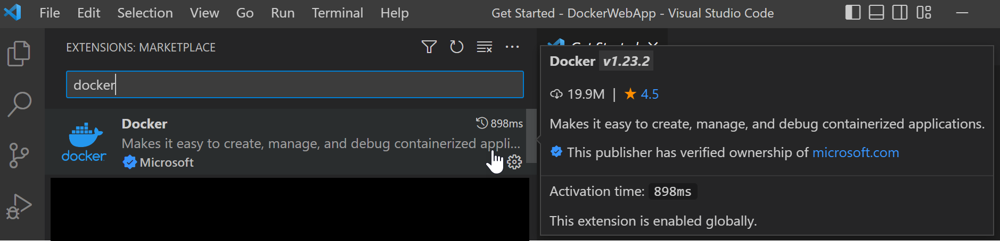

+++
title = "Python"
date = 2024-01-12T22:36:24+08:00
weight = 20
type = "docs"
description = ""
isCJKLanguage = true
draft = false
+++

> 原文: [https://code.visualstudio.com/docs/containers/quickstart-python](https://code.visualstudio.com/docs/containers/quickstart-python)

# Python in a container 容器中的 Python


In this tutorial, you will learn how to:

​​	在本教程中，您将学习如何：

- Create a `Dockerfile` file describing a simple Python container.
  创建描述简单 Python 容器的 `Dockerfile` 文件。
- Build, run, and verify the functionality of a [Django](https://www.djangoproject.com/), [Flask](https://flask.palletsprojects.com/en/1.1.x), or General Python app.
  构建、运行和验证 Django、Flask 或通用 Python 应用程序的功能。
- Debug the app running in a container.
  调试在容器中运行的应用程序。

## [Prerequisites 先决条件]()

- [Install Docker](https://docs.docker.com/install/) on your machine and add it to the system path.

  ​​	在您的计算机上安装 Docker 并将其添加到系统路径。

- On Linux, you should also [enable Docker CLI for the non-root user account](https://docs.docker.com/install/linux/linux-postinstall/#manage-docker-as-a-non-root-user) that will be used to run VS Code.

  ​​	在 Linux 上，您还应为将用于运行 VS Code 的非根用户帐户启用 Docker CLI。

- The Docker extension. To install the extension, open the Extensions view (Ctrl+Shift+X), search for `docker` to filter results and select Docker extension authored by Microsoft.

  ​​	Docker 扩展。若要安装扩展，请打开“扩展”视图 (Ctrl+Shift+X)，搜索 `docker` 以筛选结果，然后选择 Microsoft 编写的 Docker 扩展。

  

### [Create a Python project 创建 Python 项目]()

If you don't have a Python project already, follow the tutorial [Getting started with Python]().

​​	如果您还没有 Python 项目，请按照 Python 入门教程进行操作。

> **Note**: If you want to containerize a complete Django or Flask web app, you can start with one of the following samples:
>
> ​​	注意：如果您想将完整的 Django 或 Flask Web 应用程序容器化，可以从以下示例之一开始：
>
> - [python-sample-vscode-django-tutorial](https://github.com/microsoft/python-sample-vscode-django-tutorial/), which is the result of following the [Django Tutorial]()
>
>   ​​	python-sample-vscode-django-tutorial，这是按照 Django 教程进行操作的结果
>
> - [python-sample-vscode-flask-tutorial](https://github.com/microsoft/python-sample-vscode-flask-tutorial/), which is the result of following the [Flask Tutorial]()
>
>   ​​	python-sample-vscode-flask-tutorial，这是按照 Flask 教程进行操作的结果

> **Note**: For this tutorial, be sure to use the **tutorial** branch of the sample repos.
>
> ​​	注意：对于本教程，请务必使用示例仓库的教程分支。

After verifying your app runs properly, you can now containerize your application.

​​	在验证您的应用正常运行后，您现在可以将您的应用容器化。

## [Add Docker files to the project 将 Docker 文件添加到项目]()

1. Open the project folder in VS Code.

   ​​	在 VS Code 中打开项目文件夹。

2. Open the **Command Palette** (Ctrl+Shift+P) and choose **Docker: Add Docker Files to Workspace...**:

   ​​	打开命令面板 (Ctrl+Shift+P) 并选择 Docker: 将 Docker 文件添加到工作区...：

   

3. When prompted for the app type, select **Python: Django**, **Python: Flask**, or **Python: General** as the app type. For this tutorial, we'll focus on the **Python: General** case, but will also include notes for Django and Flask.

   ​​	在提示您输入应用类型时，选择 Python: Django、Python: Flask 或 Python: General 作为应用类型。对于本教程，我们将重点关注 Python: General 案例，但也会包含有关 Django 和 Flask 的说明。

4. Enter the relative path to the app's entry point. This excludes the workspace folder you start from. If you created a python app with `hello.py` according to the [Getting Started with Python]() tutorial, choose that.

   ​​	输入应用入口点的相对路径。这会排除您开始使用的工作区文件夹。如果您按照 Python 入门教程使用 `hello.py` 创建了 Python 应用，请选择该应用。

   **Django**: Choose `manage.py` (root folder) or `subfolder_name/manage.py`. See the [official Django documentation](https://docs.djangoproject.com/en/3.0/intro/tutorial01/#creating-a-project).

   ​​	Django：选择 `manage.py` （根文件夹）或 `subfolder_name/manage.py` 。请参阅官方 Django 文档。

   **Flask**: Choose the path to where you create your Flask instance. See the [official Flask documentation](https://flask.palletsprojects.com/en/1.1.x/api/).

   ​​	Flask：选择您创建 Flask 实例的路径。请参阅官方 Flask 文档。

   > **Tip**: You may also enter the path to a folder name as long as this folder includes a `__main__.py` file.
   >
   > ​​	提示：只要此文件夹包含 `__main__.py` 文件，您也可以输入文件夹名称的路径。

5. Select the port number. We recommend selecting port 1024 or above to mitigate security concerns from [running as a root user](). Any unused will port, but Django and Flask use standard default ports.

   ​​	选择端口号。我们建议选择 1024 或更高的端口，以减轻以 root 用户身份运行的安全问题。任何未使用的端口都可以，但 Django 和 Flask 使用标准默认端口。

   **Django**: The default port 8000.

   ​​	Django：默认端口 8000。

   **Flask**: The default port is 5000.

   ​​	Flask：默认端口为 5000。

6. When prompted to include Docker Compose, select **No** if you do not want a Docker Compose file. If you select **Yes**, you will need to verify the path to your `wsgi.py` file in the `Dockerfile` to run the **Compose Up** command successfully. Compose is typically used when running multiple containers at once.

   ​​	在提示是否包含 Docker Compose 时，如果您不想要 Docker Compose 文件，请选择否。如果您选择是，您将需要验证 `Dockerfile` 中 `wsgi.py` 文件的路径，以便成功运行 Compose Up 命令。通常在一次运行多个容器时使用 Compose。

7. With all this information, the Docker extension creates the following files:

   ​​	有了所有这些信息，Docker 扩展将创建以下文件：

   - A `Dockerfile`. To learn more about IntelliSense in this file, refer to the [overview]().

     ​​	一个 `Dockerfile` 。若要详细了解此文件中的 IntelliSense，请参阅概述。

   - A `.dockerignore` file to reduce the image size by excluding files and folders that aren't needed such as `.git`, `.vscode`, and `__pycache__`.

     ​​	一个 `.dockerignore` 文件，通过排除不需要的文件和文件夹（例如 `.git` 、 `.vscode` 和 `__pycache__` ）来减小映像大小。

   - If you're using Docker Compose, a `docker-compose.yml` and `docker-compose.debug.yml` file.

     ​​	如果您使用 Docker Compose，则有一个 `docker-compose.yml` 和 `docker-compose.debug.yml` 文件。

   - If one does not already exist, a `requirements.txt` file for capturing all app dependencies.

     ​​	如果尚未存在，则有一个 `requirements.txt` 文件，用于捕获所有应用依赖项。

   > **Important Note**: To use our setup, the Python framework (Django/Flask) and Gunicorn **must be included** in the `requirements.txt` file. If the virtual environment/host machine already has these prerequisites installed and is supposed to be identical to the container environment, ensure app dependencies are ported over by running `pip freeze > requirements.txt` in the terminal. **This will overwrite your current `requirements.txt` file.**
   >
   > ​​	重要说明：若要使用我们的设置，Python 框架（Django/Flask）和 Gunicorn 必须包含在 `requirements.txt` 文件中。如果虚拟环境/主机已安装这些先决条件，并且应该与容器环境相同，请确保通过在终端中运行 `pip freeze > requirements.txt` 来移植应用依赖项。这将覆盖您当前的 `requirements.txt` 文件。

### [(Optional) Add an environment variable to the image （可选）向映像添加环境变量]()

This step is not required, but it is included to help you understand how to add environment variables that need to be set in the container's environment.

​​	此步骤不是必需的，但包含此步骤是为了帮助您了解如何添加需要在容器环境中设置的环境变量。

The Docker Extension helps you author Dockerfiles by using [IntelliSense]() to provide auto-completions and contextual help. To see this feature in action:

​​	Docker 扩展通过使用 IntelliSense 提供自动完成和上下文帮助，帮助您编写 Dockerfile。若要查看此功能的操作：

1. Open the `Dockerfile`.

   ​​	打开 `Dockerfile` 。

2. Underneath the `EXPOSE` statement, type Ctrl+Space to trigger IntelliSense and scroll to `ENV`.

   ​​	在 `EXPOSE` 语句下方，键入 Ctrl+Space 触发 IntelliSense 并滚动到 `ENV` 。

   

3. Press Tab or Enter to complete the statement, then set the `key` to the name of the variable, and set the `value`.

   ​​	按 Tab 或 Enter 完成语句，然后将 `key` 设置为变量的名称，并将 `value` 设置为值。

For more information about setting and using environment variables in the Dockerfile, see the [ENV](https://docs.docker.com/engine/reference/builder/#env) instruction and [Environment replacement](https://docs.docker.com/engine/reference/builder/#environment-replacement) section in the Docker documentation.

​​	有关在 Dockerfile 中设置和使用环境变量的详细信息，请参阅 Docker 文档中的 ENV 指令和环境替换部分。

## [Gunicorn modifications for Django and Flask apps 针对 Django 和 Flask 应用的 Gunicorn 修改]()

To give Python web developers a great starting point, we chose to use [Gunicorn](https://gunicorn.org/#docs) as the default web server. Since it is referenced in the default Dockerfile, it is included as a dependency in the `requirements.txt` file. If you don't see it in `requirements.txt`, run `pip install gunicorn` and then run `pip freeze > requirements.txt` to regenerate the `requirements.txt` file.

​​	为了给 Python Web 开发人员提供一个良好的起点，我们选择使用 Gunicorn 作为默认 Web 服务器。由于它在默认 Dockerfile 中被引用，因此它作为依赖项包含在 `requirements.txt` 文件中。如果您在 `requirements.txt` 中看不到它，请运行 `pip install gunicorn` ，然后运行 `pip freeze > requirements.txt` 以重新生成 `requirements.txt` 文件。

- **Django**: To use Gunicorn, it must bind to an application callable (what the application server uses to communicate with your code) as an entry point. This callable is declared in the `wsgi.py` file of a Django application. To accomplish this binding, the final line in the Dockerfile says:

  ​​	Django：要使用 Gunicorn，它必须绑定到应用程序可调用对象（应用程序服务器用来与您的代码通信的内容）作为入口点。此可调用对象在 Django 应用程序的 `wsgi.py` 文件中声明。要完成此绑定，Dockerfile 中的最后一行写道：

  ```
  CMD ["gunicorn", "--bind", "0.0.0.0:8000", "{workspace_folder_name}.wsgi"]
  ```

  If your project does not follow Django's default project structure (that is, a workspace folder and a wsgi.py file >within a subfolder named the same as the workspace) you must overwrite the Gunicorn entry point in the Dockerfile to locate the correct `wsgi.py` file.

  ​​	如果您的项目不遵循 Django 的默认项目结构（即工作区文件夹和子文件夹中名为与工作区相同的 wsgi.py 文件），您必须覆盖 Dockerfile 中的 Gunicorn 入口点以找到正确的 `wsgi.py` 文件。

  If your `wsgi.py` file is in the root folder, the final argument in the command above will be `"wsgi"`. Within subfolders, the argument would be `"subfolder1_name.subfolder2_name.wsgi"`.

  ​​	如果您的 `wsgi.py` 文件位于根文件夹中，则上述命令中的最后一个参数将是 `"wsgi"` 。在子文件夹中，参数将是 `"subfolder1_name.subfolder2_name.wsgi"` 。

- **Flask**: To use Gunicorn, it must bind to an application callable (what the application server uses to communicate with your code) as an entry point. This callable corresponds with the **file location** and **variable name** of your created Flask instance. According to [official Flask Documentation](https://flask.palletsprojects.com/en/1.1.x/api/), users generally create a Flask instance in the main module or in the `__init__.py` file of their package in this manner:

  ​​	Flask：要使用 Gunicorn，它必须绑定到应用程序可调用对象（应用程序服务器用来与您的代码通信的内容）作为入口点。此可调用对象与您创建的 Flask 实例的文件位置和变量名相对应。根据官方 Flask 文档，用户通常以这种方式在主模块或其包的 `__init__.py` 文件中创建 Flask 实例：

  ```
  from flask import Flask
  app = Flask(__name__) # Flask instance named app
  ```

  To accomplish this binding, the final line in the Dockerfile says:

  ​​	要完成此绑定，Dockerfile 中的最后一行写道：

  ```
  CMD ["gunicorn", "--bind", "0.0.0.0:5000", "{subfolder}.{module_file}:app"]
  ```

  During the **Docker: Add Docker Files to Workspace...** command, you configure the path to the Flask instance, however, the Docker extension assumes your Flask instance variable is named `app`. If this is not the case, you must change the variable name in the Dockerfile.

  ​​	在 Docker: 将 Docker 文件添加到工作区... 命令期间，您配置了 Flask 实例的路径，但是，Docker 扩展假定您的 Flask 实例变量名为 `app` 。如果不是这种情况，您必须更改 Dockerfile 中的变量名称。

  If your main module was in the root folder as a file named `main.py` and had a Flask instance variable was named `myapp`, the final argument in the command above will be `"main:myapp"`. Within subfolders, the argument would be `"subfolder1_name.subfolder2_name.main:myapp"`.

  ​​	如果您的主模块位于根文件夹中，作为名为 `main.py` 的文件，并且 Flask 实例变量名为 `myapp` ，则上述命令中的最终参数将为 `"main:myapp"` 。在子文件夹中，参数将为 `"subfolder1_name.subfolder2_name.main:myapp"` 。

## [Build, run, and debug the container 构建、运行和调试容器]()

The **Docker: Add Docker Files to Workspace...** command automatically creates a Docker launch configuration to build and run your container in debug mode. To debug your Python app container:

​​	Docker: 将 Docker 文件添加到工作区... 命令自动创建一个 Docker 启动配置，以在调试模式下构建和运行您的容器。要调试您的 Python 应用程序容器：

1. Navigate to the file that contains your app's startup code, and set a breakpoint.

   ​​	导航到包含应用程序启动代码的文件，并设置断点。

2. Navigate to **Run and Debug** and select **Docker: Python - General**, **Docker: Python - Django**, or **Docker: Python - Flask**, as appropriate.

   ​​	导航到运行和调试，并根据需要选择 Docker: Python - 通用、Docker: Python - Django 或 Docker: Python - Flask。

   

3. Start debugging using the F5 key.

   ​​	使用 F5 键开始调试。

   - The Docker image builds.
     Docker 映像构建。
   - The Docker container runs.
     Docker 容器运行。
   - The python debugger stops at the breakpoint.
     python 调试器在断点处停止。

4. Step over this line once.

   ​​	跨过此行一次。

5. When ready, press continue.

   ​​	准备就绪时，按继续。

The Docker extension will launch your browser to a randomly mapped port:

​​	Docker 扩展程序将启动您的浏览器，进入随机映射的端口：


> **Tip**: To modify your Docker build settings, such as changing the image tag, navigate to `.vscode -> tasks.json` under the `dockerBuild` attribute in the `docker-build` task. Use IntelliSense within the file (Ctrl+Space) to display all other valid directives.
>
> ​​	提示：若要修改 Docker 构建设置，例如更改映像标记，请导航到 `docker-build` 任务中 `dockerBuild` 属性下的 `.vscode -> tasks.json` 。在文件中使用 IntelliSense（Ctrl+空格）以显示所有其他有效指令。

## [Use the Docker Explorer 使用 Docker Explorer]()

The Docker Explorer provides an interactive experience to examine and manage Docker assets such as containers, images, and so on. To see an example:

​​	Docker Explorer 提供交互式体验，用于检查和管理 Docker 资产，例如容器、映像等。要查看示例：

1. Navigate to the Docker Explorer.

   ​​	导航到 Docker Explorer。

2. In the **Containers** tab, right-click on your container and choose **View Logs**.

   ​​	在容器选项卡中，右键单击容器并选择查看日志。

   

3. The output will be displayed in the terminal.

   ​​	输出将显示在终端中。

## [Build the image in Azure 在 Azure 中构建映像]()

You can use the command **Azure Container Registry: Build Image in Azure** to build an image that you can then deploy to Azure App Service or Azure Container Apps.

​​	您可以使用命令 Azure 容器注册表：在 Azure 中构建映像来构建映像，然后可以将其部署到 Azure 应用服务或 Azure 容器应用。

1. Install the [Azure Resources extension](https://marketplace.visualstudio.com/items?itemName=ms-azuretools.vscode-azureresourcegroups). Open the **Command Palette** (Ctrl+Shift+P) and search for the command **Azure: Sign In**. If you don't have an Azure account, you can sign up for a [free trial](https://azure.microsoft.com/free/?utm_source=campaign&utm_campaign=vscode-azure-account&mktingSource=vscode-azure-account).

   ​​	安装 Azure 资源扩展。打开命令面板 (Ctrl+Shift+P) 并搜索命令 Azure：登录。如果您没有 Azure 帐户，可以注册免费试用。

2. There are two ways to invoke the build in Azure command. You can right-click on the Dockerfile, and choose **Build Image in Azure**. You can also use the **Command Palette** (Ctrl+Shift+P) and search for the command **Azure Container Registry: Build Image in Azure**.

   ​​	有两种方法可以调用在 Azure 中构建命令。您可以右键单击 Dockerfile，然后选择在 Azure 中构建映像。您还可以使用命令面板 (Ctrl+Shift+P) 并搜索命令 Azure 容器注册表：在 Azure 中构建映像。

   

3. Choose the name and tag for the built image. You'll use this to identify it in the container registry.

   ​​	选择构建的映像的名称和标记。您将使用此名称和标记在容器注册表中标识它。

   

4. Choose the Azure subscription you want to use.

   ​​	选择要使用的 Azure 订阅。

5. Choose an existing Azure Container Registry, or create a new one. When you create a new one, you're asked to provide the name, resource group, location, and an option for pricing, such as Basic, Standard, or Premium. You can read about the costs of these options at [Pricing - Container Registry](https://azure.microsoft.com/pricing/details/container-registry/).

   ​​	选择现有的 Azure 容器注册表，或创建一个新的注册表。创建新注册表时，系统会要求您提供名称、资源组、位置以及定价选项，例如基本版、标准版或高级版。您可以在定价 - 容器注册表中了解这些选项的成本。

6. Specify the base OS, Linux or Windows. This choice must be consistent with the Dockerfile.

   ​​	指定基本操作系统，Linux 或 Windows。此选择必须与 Dockerfile 一致。

   

The process of building the image might take a few minutes. You can track progress in the terminal. If you encounter an error (`Error: failed to download context.`), try using the **Refresh** option on the container registry and then request another build. Before rebuilding, manually delete the old image.

​​	构建映像的过程可能需要几分钟。您可以在终端中跟踪进度。如果您遇到错误 ( `Error: failed to download context.` )，请尝试在容器注册表中使用“刷新”选项，然后请求重新构建。在重新构建之前，请手动删除旧映像。

## [Deploy to Azure App Service or Azure Container Apps 部署到 Azure 应用服务或 Azure 容器应用]()

Once the container image is built, it should appear in the Container Registry with the tag you specified. Now that it's built, you can deploy it to Azure App Service or Azure Container Apps. The [Azure App Service](https://marketplace.visualstudio.com/items?itemName=ms-azuretools.vscode-azureappservice) extension is recommended for deployments to Azure App Service, and the [Azure Container Apps](https://marketplace.visualstudio.com/items?itemName=ms-azuretools.vscode-azurecontainerapps) extension is required for deployments to Azure Container Apps. You can obtain both if you install the [Azure Tools extension pack](https://marketplace.visualstudio.com/items?itemName=ms-vscode.vscode-node-azure-pack), which includes a package of tools for a wide range of Azure development scenarios.

​​	构建容器映像后，它应出现在容器注册表中，并带有您指定的标记。现在已构建，您可以将其部署到 Azure 应用服务或 Azure 容器应用。建议将 Azure 应用服务扩展用于部署到 Azure 应用服务，并且将 Azure 容器应用扩展用于部署到 Azure 容器应用。如果您安装 Azure 工具扩展包，则可以同时获取这两个扩展，该扩展包包含适用于各种 Azure 开发方案的工具包。

1. Right-click on the image tag and choose **Deploy Image to Azure App Service** or **Deploy Image to Azure Container Apps**.

   ​​	右键单击映像标记，然后选择“将映像部署到 Azure 应用服务”或“将映像部署到 Azure 容器应用”。

   

2. Provide the name of the web site. This must be a unique name, and for Django apps, it must also be listed as a valid host name in the `ALLOWED_HOSTS` list in the `settings.py` file.

   ​​	提供网站的名称。这必须是唯一名称，对于 Django 应用，还必须在 `settings.py` 文件中的 `ALLOWED_HOSTS` 列表中将其列为有效主机名。

3. Provide a resource group, location, and App Service Plan. If you're just getting started, you can choose the free plan.

   ​​	提供资源组、位置和应用服务计划。如果您刚开始使用，可以选择免费计划。

4. The image is deployed; the process might take a few minutes. Once it's deployed, a notification appears with a button you can use to access the site. You can also use the site's address, `{appname}.azurewebsites.net` where `{appname}` is the name you gave when creating it. If it doesn't work at first, try again in a few minutes. It's not uncommon for the first few attempts to time out or return an error. It just means the App Service isn't ready yet to receive requests.

   ​​	该映像已部署；此过程可能需要几分钟。部署完成后，将显示一条通知，其中包含一个可用于访问该网站的按钮。您还可以使用网站地址 `{appname}.azurewebsites.net` ，其中 `{appname}` 是您在创建网站时指定的名称。如果一开始不起作用，请在几分钟后重试。前几次尝试超时或返回错误的情况并不少见。这仅仅意味着应用服务尚未准备好接收请求。

5. Make a small change in the application code that's visible on one of the pages, and save the file.

   ​​	在其中一个页面上对应用程序代码进行可见的小更改，然后保存文件。

6. Use the Azure icon to open the **Resources** view, and expand the node for your subscription to find the App Service that you deployed in the previous step.

   ​​	使用 Azure 图标打开“资源”视图，然后展开订阅的节点以查找您在上一步中部署的应用服务。

7. Right-click on the App Service node and look at the available options. Choose **Deploy to Web App**, and then specify your app folder to deploy it.

   ​​	右键单击应用服务节点并查看可用选项。选择“部署到 Web 应用”，然后指定要部署的应用文件夹。

   

   When warned that this will overwrite the previous deployment, choose **Deploy** to confirm.

   ​​	当收到警告称这将覆盖以前的部署时，选择“部署”以确认。

   This might take a few minutes; you can monitor progress in the terminal window. When it finishes, a button with access to the site is given.

   ​​	这可能需要几分钟；您可以在终端窗口中监视进度。完成后，将提供一个可用于访问该网站的按钮。

   

   Use the button and verify that your change is reflected on the site.

   ​​	使用该按钮并验证您的更改是否反映在网站上。

Congratulations, you've used Python in VS Code to create an deploy a web site that's hosted in the cloud and live on the internet!

​​	恭喜您，您已在 VS Code 中使用 Python 创建并部署了一个托管在云中并在互联网上运行的网站！

## [Free up resources 释放资源]()

In the [Azure portal](https://portal.azure.com/), delete the Resource Group to free up all resources that you created during this exercise.

​​	在 Azure 门户中，删除资源组以释放您在此练习中创建的所有资源。

## [Next steps 后续步骤]()

You're done! Now that your container is ready, you may want to:

​​	您已完成！现在您的容器已准备就绪，您可能需要：

- [Learn about using Docker Compose
  了解如何使用 Docker Compose]()
- [Debug with Docker Compose
  使用 Docker Compose 调试]()
- [Customize how you debug Python apps in a container
  自定义在容器中调试 Python 应用的方式](https://code.visualstudio.com/docs/containers/debug-python)
- [Customize your Docker build and run tasks
  自定义 Docker 构建并运行任务]()
- [Push your Django image to an Azure Container Registry
  将 Django 映像推送到 Azure 容器注册表](https://code.visualstudio.com/docs/containers/tutorial-django-push-to-registry)
- [Deploy to Azure Container Apps
  部署到 Azure 容器应用](https://learn.microsoft.com/azure/container-apps/deploy-visual-studio-code)
