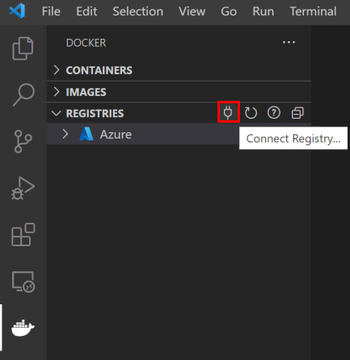
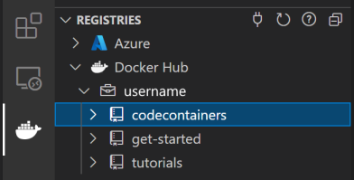
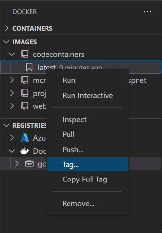
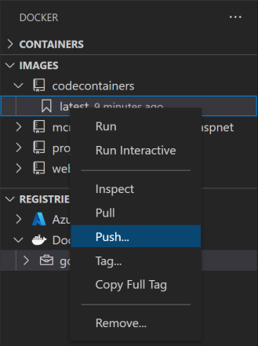
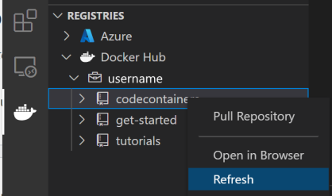
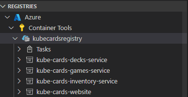
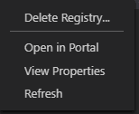
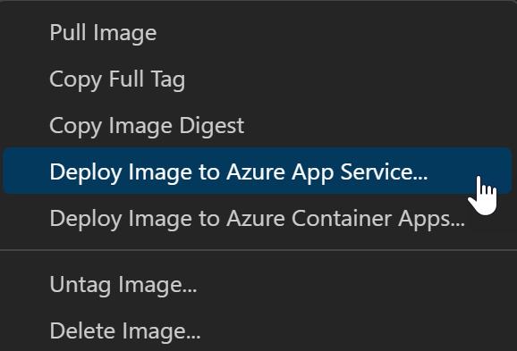
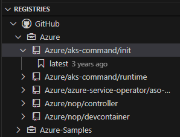

+++
title = "Registries"
date = 2024-01-12T22:36:24+08:00
weight = 60
type = "docs"
description = ""
isCJKLanguage = true
draft = false
+++

> 原文: [https://code.visualstudio.com/docs/containers/quickstart-container-registries](https://code.visualstudio.com/docs/containers/quickstart-container-registries)

# Using container registries 使用容器注册表

A container registry is a storage and content delivery system, holding named Docker images, available in different tagged versions.

​​	容器注册表是一个存储和内容交付系统，它保存命名的 Docker 映像，这些映像以不同的标记版本提供。

Users can connect to Docker registries from the following sources:

​​	用户可以从以下来源连接到 Docker 注册表：

- [Azure Container Registry
  Azure 容器注册表](https://learn.microsoft.com/azure/container-registry)
- [Docker Hub](https://hub.docker.com/)
- [GitHub](https://github.com/) container registry
  GitHub 容器注册表
- Any generic private registry that supports the [Docker V2 api](https://docs.docker.com/registry/spec/api/)
  支持 Docker V2 api 的任何通用私有注册表

## [Push an image to a container registry 将映像推送到容器注册表](https://code.visualstudio.com/docs/containers/quickstart-container-registries#_push-an-image-to-a-container-registry)

Before you can deploy a Docker image, the image must be uploaded to a container registry. The image can be uploaded to [Docker Hub](https://hub.docker.com/), [Azure Container Registry (ACR)](https://learn.microsoft.com/azure/container-registry/container-registry-get-started-portal) or another registry. You can follow the same steps to push the image regardless of whether you're pushing to Docker Hub, Azure Container Registries, or any other registry. If you don't already have an Azure Container Registry, you can create one during the **Push** step.

​​	在部署 Docker 映像之前，必须将该映像上传到容器注册表。可以将该映像上传到 Docker Hub、Azure 容器注册表 (ACR) 或其他注册表。无论将映像推送到 Docker Hub、Azure 容器注册表还是任何其他注册表，都可以按照相同的步骤进行推送。如果您还没有 Azure 容器注册表，可以在推送步骤中创建一个。

1. Open the Docker Explorer, select **Connect Registry...** icon under the **Registries** group, and follow the prompt. Choose the provider (for example, Azure or Docker Hub) and provide the credential to connect to the registry. If prompted, install the [Azure Resources](https://marketplace.visualstudio.com/items?itemName=ms-azuretools.vscode-azureresourcegroups) extension.

   ​​	打开 Docker Explorer，选择“注册表”组下的“连接注册表...”图标，然后按照提示进行操作。选择提供程序（例如，Azure 或 Docker Hub），并提供凭据以连接到注册表。如果出现提示，请安装 Azure 资源扩展。

   

2. Now the registry will be visible under **Registries**.

   ​​	现在，该注册表将在“注册表”下可见。

   

3. Optionally, tag the image. In order to upload an image to a registry, the image needs to be tagged with registry name so that the docker push will upload it to the right registry. If the image isn't tagged when you try to push it, VS Code asks you what registry you want to associate with the image.

   ​​	还可以选择标记该映像。为了将映像上传到注册表，需要使用注册表名称标记该映像，以便 docker push 将其上传到正确的注册表。如果您在尝试推送映像时未标记该映像，VS Code 会询问您要将哪个注册表与该映像关联。

   - Images you previously built appear in the Docker Explorer under the **Images** tab. Right-click and choose **Tag...**.

     ​​	您之前构建的映像会显示在 Docker Explorer 的“映像”选项卡下的“映像”中。右键单击并选择“标记...”

     

   - Specify the new name `<your registry or username>/<image name>:<tag>` and complete the tag action. For example, new image name for ACR would be `mainacr.azurecr.io/webapp6:latest` and for Docker Hub it would be `myusername/webapp6:latest`.

     ​​	指定新名称 `<your registry or username>/<image name>:<tag>` 并完成标记操作。例如，ACR 的新映像名称将是 `mainacr.azurecr.io/webapp6:latest` ，而 Docker Hub 的新映像名称将是 `myusername/webapp6:latest` 。

4. The image shows up in the Docker Explorer in the **Images** tab under the registry that the image tag points to. Select this image and choose **Push**. If the image has not yet been tagged, you're prompted to choose a registry to push to, or create a new registry, and the image is tagged based on the selection.

   ​​	映像会显示在 Docker Explorer 的“映像”选项卡中，位于映像标记所指向的注册表下。选择此映像并选择“推送”。如果尚未标记映像，系统会提示您选择要推送到的注册表或创建新注册表，并且会根据选择标记映像。

   

5. Once the push command is completed, refresh the registry node where the image is pushed to and the uploaded image will show up.

   ​​	推送命令完成后，刷新已将映像推送到的注册表节点，上传的映像将显示出来。

   

## [Docker Hub](https://code.visualstudio.com/docs/containers/quickstart-container-registries#_docker-hub)

This connects to [Docker Hub](https://hub.docker.com/) and lists all of the repositories and images under the given account. Once you select this option, you will be required to type in your Docker Hub credentials.

​​	这会连接到 Docker Hub 并列出给定帐户下的所有存储库和映像。选择此选项后，您需要输入 Docker Hub 凭据。

For each repository in the Docker Hub registry, here are the actions that can be performed:

​​	对于 Docker Hub 注册表中的每个存储库，可以执行以下操作：

- **Pull repository**: copies all of the images in a given repository locally
  提取存储库：将给定存储库中的所有映像本地复制一份
- **Open in browser**: opens the browser and navigates to the given repository on Docker Hub
  在浏览器中打开：打开浏览器并导航到 Docker Hub 上的给定存储库
- **Refresh**: refreshes the repository to reflect changes
  刷新：刷新存储库以反映更改

For each tagged image in a repository, here are the actions that can be performed:

​​	对于存储库中的每个标记的映像，可以执行以下操作：

- **Pull image**: copies the latest version of the image locally
  拉取映像：将映像的最新版本复制到本地
- **Copy Full Tag**: copies the full tag to the clipboard
  复制完整标记：将完整标记复制到剪贴板
- **Deploy Image to Azure App Service**: deploys the image to Azure App Service, see [Deploy images to Azure](https://code.visualstudio.com/docs/containers/app-service) page
  将映像部署到 Azure 应用服务：将映像部署到 Azure 应用服务，请参阅部署映像到 Azure 页面
- **Deploy Image to Azure Container Apps**: deploys the image to Azure Container Apps, see [Deploy images to Azure](https://code.visualstudio.com/docs/containers/app-service) page
  将映像部署到 Azure 容器应用：将映像部署到 Azure 容器应用，请参阅部署映像到 Azure 页面
- **Open in browser**: opens the browser and navigates to the given image on Docker Hub
  在浏览器中打开：打开浏览器并导航到 Docker Hub

## [Azure Container Registry Azure 容器注册表](https://code.visualstudio.com/docs/containers/quickstart-container-registries#_azure-container-registry)

This option requires the [Azure Resources](https://marketplace.visualstudio.com/items?itemName=ms-azuretools.vscode-azureresourcegroups) extension to be able to connect to your Azure account and display all of the different subscriptions and registries. Once authenticated, the node **Azure** will display the subscriptions along with registries each have:

​​	上的给定映像此选项需要 Azure 资源扩展才能连接到您的 Azure 帐户并显示所有不同的订阅和注册表。经过身份验证后，Azure 节点将显示订阅以及每个注册表具有的内容：

For each registry, users have different actions that can be performed using the context menu:

​​	对于每个注册表，用户可以使用上下文菜单执行不同的操作：

- **Delete Registry**: deletes the registry permanently
  删除注册表：永久删除注册表
- **Open in Portal**: opens the browser and navigates to the registry in Azure Portal
  在门户中打开：打开浏览器并导航到 Azure 门户中的注册表
- **View Properties**: opens the registry properties in a json format
  查看属性：以 json 格式打开注册表属性
- **Refresh**: refreshes the registry to reflect changes
  刷新：刷新注册表以反映更改

For each repository in a given registry, here are the actions that can be performed:

​​	对于给定注册表中的每个存储库，可以执行以下操作：

- **Pull Repository**: copies all of the images in a given repository locally
  提取存储库：将给定存储库中的所有映像本地复制
- **Delete Repository**: deletes the repository permanently
  删除存储库：永久删除存储库
- **Refresh**: refreshes the repository to reflect changes
  刷新：刷新存储库以反映更改

For each tagged image in a repository, here are the actions that can be performed:

​​	对于存储库中的每个标记映像，可以执行以下操作：

- **Pull Image**: copies the latest version of the image locally
  提取映像：将映像的最新版本本地复制
- **Copy Full Tag**: copies the full tag to the clipboard
  复制完整标记：将完整标记复制到剪贴板
- **Copy Image Digest**: copies the image digest, which is a SHA256 hash identifier that Docker uses, to the clipboard. See [Docker Docs](https://docs.docker.com/engine/reference/commandline/images/#list-image-digests) for more info on image digests
  复制映像摘要：将映像摘要（Docker 使用的 SHA256 哈希标识符）复制到剪贴板。有关映像摘要的更多信息，请参阅 Docker 文档
- **Inspect Image Manifest**: inspects the image's registry manifest. This is not the same as inspecting the image when it is pulled locally.
  检查映像清单：检查映像的注册表清单。这与在本地拉取映像时检查映像不同。
- **Deploy Image to Azure App Service**: deploys the image to Azure App Service, see [Deploy images to Azure](https://code.visualstudio.com/docs/containers/app-service) page
  将映像部署到 Azure 应用服务：将映像部署到 Azure 应用服务，请参阅将映像部署到 Azure 页面
- **Deploy Image to Azure Container Apps**: deploys the image to Azure Container Apps, see [Deploy images to Azure](https://code.visualstudio.com/docs/containers/app-service) page
  将映像部署到 Azure 容器应用：将映像部署到 Azure 容器应用，请参阅将映像部署到 Azure 页面
- **Untag Image**: untags the image
  取消标记映像：取消标记映像
- **Delete Image**: deletes the image permanently
  删除映像：永久删除映像

## [GitHub](https://code.visualstudio.com/docs/containers/quickstart-container-registries#_github)

This connects to Docker registries in your [GitHub](https://github.com/) account. Once you select this option, you are asked to type in your GitHub account credentials.

​​	这会连接到 GitHub 帐户中的 Docker 注册表。选择此选项后，系统会要求您输入 GitHub 帐户凭据。

For each repository in the GitHub registry, here are the actions that can be performed:

​​	对于 GitHub 注册表中的每个存储库，可以执行以下操作：

- **Pull Repository**: copies all of the images in a given repository locally
  拉取存储库：将给定存储库中的所有映像本地复制
- **Refresh**: refreshes the repository to reflect changes
  刷新：刷新存储库以反映更改

For each tagged image in a repository, here are the actions that can be performed:

​​	对于存储库中的每个标记映像，可以执行以下操作：

- **Pull Image**: copies the latest version of the image locally
  拉取映像：将映像的最新版本复制到本地
- **Copy Full Tag**: copies the full tag to the clipboard
  复制完整标记：将完整标记复制到剪贴板
- **Copy Image Digest**: copies the image digest, which is a SHA256 hash identifier that Docker uses, to the clipboard. See [Docker Docs](https://docs.docker.com/engine/reference/commandline/images/#list-image-digests) for more info on image digests
  复制映像摘要：将映像摘要（Docker 使用的 SHA256 哈希标识符）复制到剪贴板。有关映像摘要的更多信息，请参阅 Docker 文档
- **Inspect Image Manifest**: inspects the image's registry manifest. This is not the same as inspecting the image when it is pulled locally.
  检查映像清单：检查映像的注册表清单。这与在本地拉取映像时检查映像不同。
- **Deploy Image to Azure App Service**: deploys the image to Azure App Service, see [Deploy images to Azure](https://code.visualstudio.com/docs/containers/app-service) page
  将映像部署到 Azure 应用服务：将映像部署到 Azure 应用服务，请参阅将映像部署到 Azure 页面
- **Deploy Image to Azure Container Apps**: deploys the image to Azure Container Apps, see [Deploy images to Azure](https://code.visualstudio.com/docs/containers/app-service) page
  将映像部署到 Azure 容器应用：将映像部署到 Azure 容器应用，请参阅将映像部署到 Azure 页面

## [Next steps 后续步骤](https://code.visualstudio.com/docs/containers/quickstart-container-registries#_next-steps)

- [Deploy to Azure
  部署到 Azure](https://code.visualstudio.com/docs/containers/app-service)
