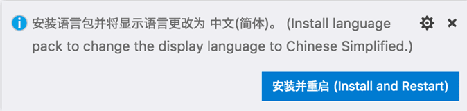
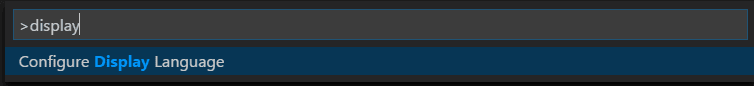
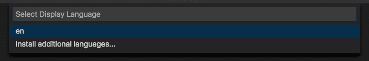
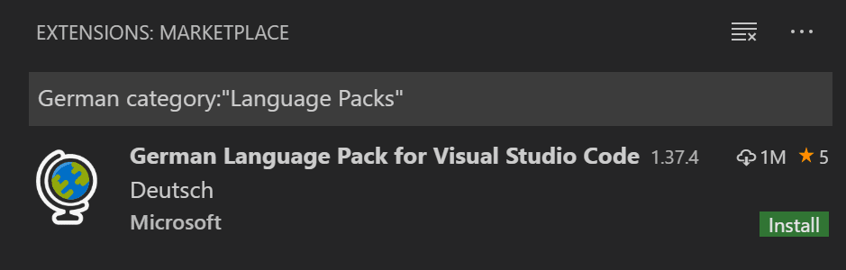

+++
title = "Display Language"
date = 2024-01-12T22:36:24+08:00
weight = 60
type = "docs"
description = ""
isCJKLanguage = true
draft = false
+++

> 原文: [https://code.visualstudio.com/docs/getstarted/locales](https://code.visualstudio.com/docs/getstarted/locales)

# Display Language 显示语言


Visual Studio Code ships by default with English as the display language and other [languages]() rely on Language Pack [extensions]() available from the [Marketplace](https://marketplace.visualstudio.com/search?target=VSCode&category=Language Packs&sortBy=Installs).

​​	Visual Studio Code 默认以英语作为显示语言，其他语言依赖于市场中提供的语言包扩展。

VS Code detects the operating system's UI language and will prompt you to install the appropriate Language Pack, if available on the Marketplace. Below is an example recommending a Simplified Chinese Language Pack:

​	VS Code 检测操作系统的 UI 语言，如果市场上有相应的语言包，它会提示您安装该语言包。以下是一个推荐简体中文语言包的示例：



After installing the Language Pack extension and following the prompt to restart, VS Code will use the Language Pack matching your operating system's UI language.

​​	安装语言包扩展并按照提示重新启动后，VS Code 将使用与您的操作系统 UI 语言匹配的语言包。

> **Note**: This topic explains how to change the display language in the VS Code UI via Language Packs such as French or Chinese. If you want to add programming language support, for example for C++ or Java, refer to the [Programming Languages]() section of the documentation.
>
> ​​	注意：本主题介绍如何通过语言包（如法语或中文）更改 VS Code UI 中的显示语言。如果您想添加编程语言支持，例如 C++ 或 Java，请参阅文档的编程语言部分。

## [Changing the Display Language 更改显示语言]()

You can also override the default UI language by explicitly setting the VS Code display language using the **Configure Display Language** command.

​​	您还可以通过使用“配置显示语言”命令显式设置 VS Code 显示语言来覆盖默认 UI 语言。

Press Ctrl+Shift+P to bring up the **Command Palette** then start typing "display" to filter and display the **Configure Display Language** command.

​​	按 Ctrl+Shift+P 调出命令面板，然后开始键入“显示”以筛选并显示“配置显示语言”命令。



Press Enter and a list of installed languages by [locale]() is displayed, with the current `locale` highlighted.

​​	按 Enter，将显示按区域设置安装的语言列表，其中当前 `locale` 突出显示。



Use the **Install additional languages...** option to install more Language Packs from the [Marketplace](https://marketplace.visualstudio.com/search?target=VSCode&category=Language Packs&sortBy=Installs), or select a different `locale` from the list. Changing the `locale` requires a restart of VS Code. You will be prompted to restart when you select a `locale`.

​​	使用安装其他语言...选项从 Marketplace 安装更多语言包，或从列表中选择其他 `locale` 。更改 `locale` 需要重新启动 VS Code。选择 `locale` 时，系统将提示您重新启动。

The **Configure Display Language** command writes to the Runtime Configuration Arguments file `argv.json` in your user VS Code folder (`.vscode`).

​​	配置显示语言命令会写入用户 VS Code 文件夹（ `.vscode` ）中的运行时配置参数文件 `argv.json` 。

The `locale` can also be changed by editing the `argv.json` file directly (**Preferences: Configure Runtime Arguments**) and restarting VS Code.

​​	还可以通过直接编辑 `argv.json` 文件（首选项：配置运行时参数）并重新启动 VS Code 来更改 `locale` 。

## [Available locales 可用区域设置]()

| Display Language 显示语言            | Locale 区域设置 |
| :----------------------------------- | :-------------- |
| English (US) 英语（美国）            | `en`            |
| Simplified Chinese 简体中文          | `zh-cn`         |
| Traditional Chinese 繁体中文         | `zh-tw`         |
| French 法语                          | `fr`            |
| German 德语                          | `de`            |
| Italian 意大利语                     | `it`            |
| Spanish 西班牙语                     | `es`            |
| Japanese 日语                        | `ja`            |
| Korean 韩语                          | `ko`            |
| Russian 俄语                         | `ru`            |
| Portuguese (Brazil) 葡萄牙语（巴西） | `pt-br`         |
| Turkish 土耳其语                     | `tr`            |
| Polish 波兰语                        | `pl`            |
| Czech 捷克语                         | `cs`            |
| Hungarian 匈牙利语                   | `hu`            |

## [Marketplace Language Packs 市场语言包]()

As described above, VS Code ships with English as the default display language, but other languages are available through [Marketplace Language Packs](https://marketplace.visualstudio.com/search?target=VSCode&category=Language Packs&sortBy=Installs).

​​	如上所述，VS Code 附带英语作为默认显示语言，但其他语言可通过市场语言包获得。

You can search for Language Packs in the Extensions view (Ctrl+Shift+X) by typing the language you are looking for along with `category:"Language Packs"`.

​​	您可以在扩展视图（Ctrl+Shift+X）中搜索语言包，方法是输入您要查找的语言以及 `category:"Language Packs"` 。



You can have multiple Language Packs installed and select the current display language with the **Configure Display Language** command.

​​	您可以安装多个语言包，并使用“配置显示语言”命令选择当前显示语言。

## [Setting the Language 设置语言]()

If you want to use a specific language for a VS Code session, you can use the command-line switch `--locale` to specify a locale when you launch VS Code.

​​	如果您想对 VS Code 会话使用特定语言，可以使用命令行开关 `--locale` 在启动 VS Code 时指定语言环境。

Below is an example of using the `--locale` command-line switch to set the VS Code display language to French:

​​	以下是使用 `--locale` 命令行开关将 VS Code 显示语言设置为法语的示例：

```
code . --locale=fr
```

**Note**: You must have the appropriate Language Pack installed for the language you specify with the command-line switch. If the matching Language Pack is not installed, VS Code will display English.

​​	注意：您必须为使用命令行开关指定的语言安装相应的语言包。如果未安装匹配的语言包，VS Code 将显示英语。

## [Common questions 常见问题]()

### [Unable to write to file because the file is dirty 无法写入文件，因为文件已修改]()

This notification may mean that your `argv.json` file wasn't saved after a previous change. Check if there are any errors in the file (**Preferences: Configure Runtime Arguments**), make sure the file is saved, and try to install the Language Pack again.

​​	此通知可能意味着您的 `argv.json` 文件在上次更改后未保存。检查文件中是否有任何错误（首选项：配置运行时参数），确保文件已保存，然后尝试再次安装语言包。

### [Can I contribute to a language pack's translations? 我可以为语言包的翻译做出贡献吗？]()

Yes, the [Visual Studio Code Community Localization Project](https://aka.ms/vscodeloc) is open to anyone, where contributors can provide new translations, vote on existing translations, or suggest process improvements.

​​	是的，Visual Studio Code 社区本地化项目对所有人开放，贡献者可以提供新的翻译、对现有翻译进行投票或建议改进流程。

### [How can I enable a programming language like Python? 如何启用像 Python 这样的编程语言？]()

Refer to the [Programming Languages]() section to learn how to install support for programming languages, such as PHP, Python, and Java.

​​	请参阅编程语言部分，了解如何安装对编程语言（如 PHP、Python 和 Java）的支持。
