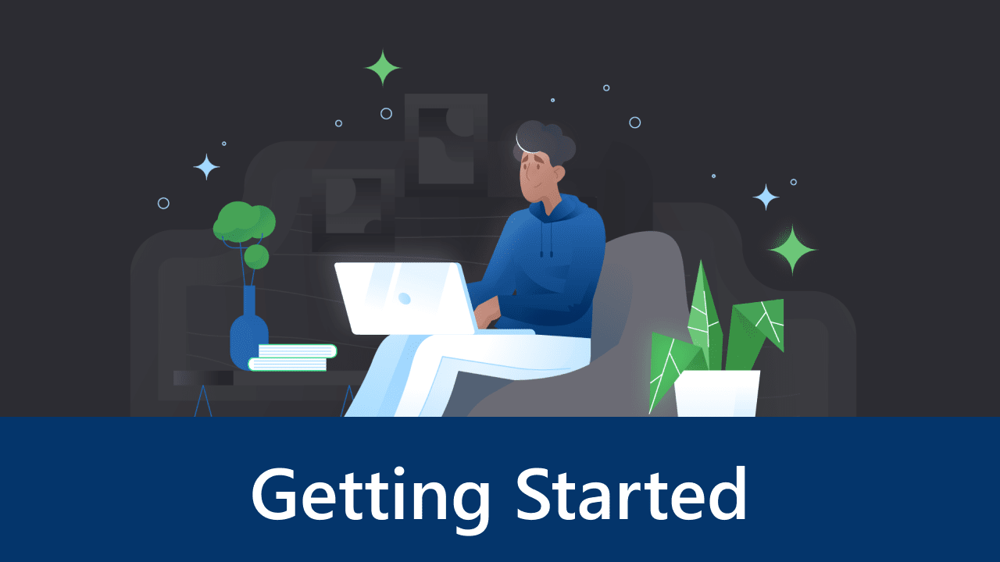
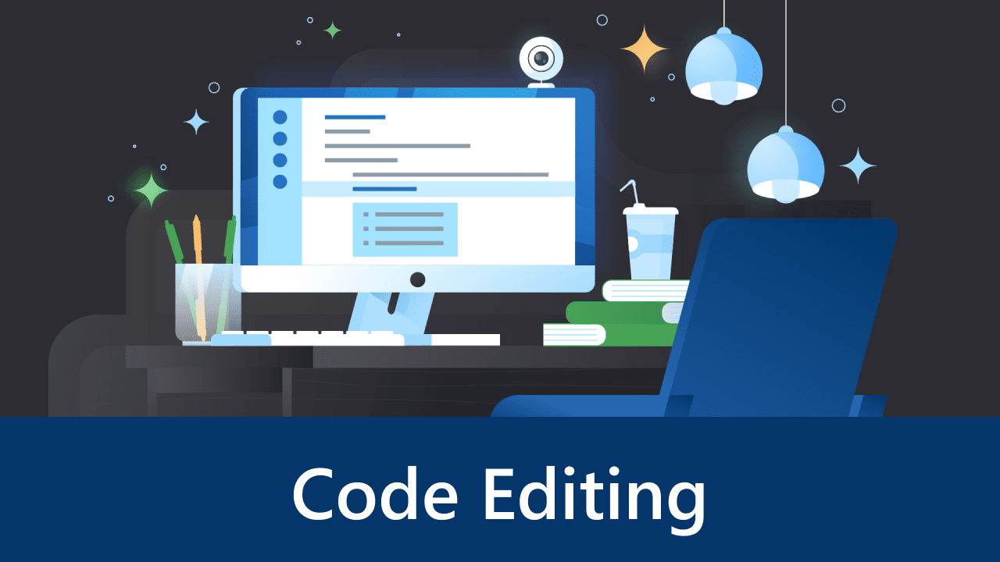
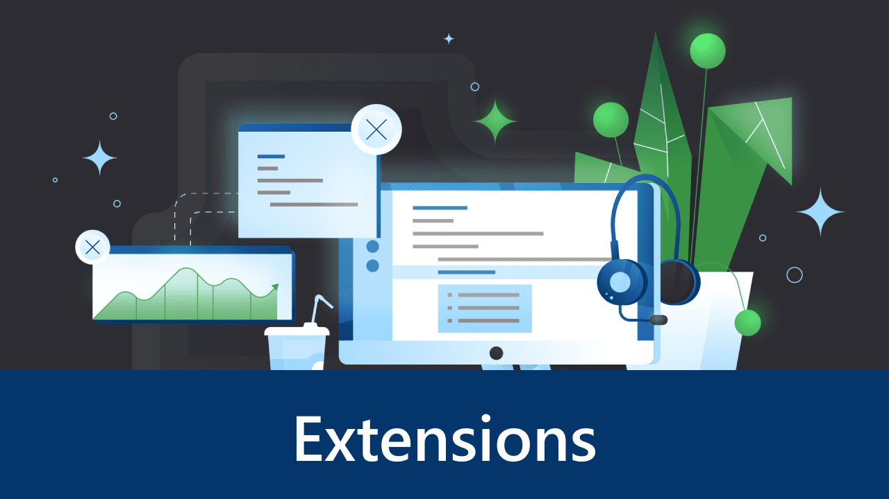
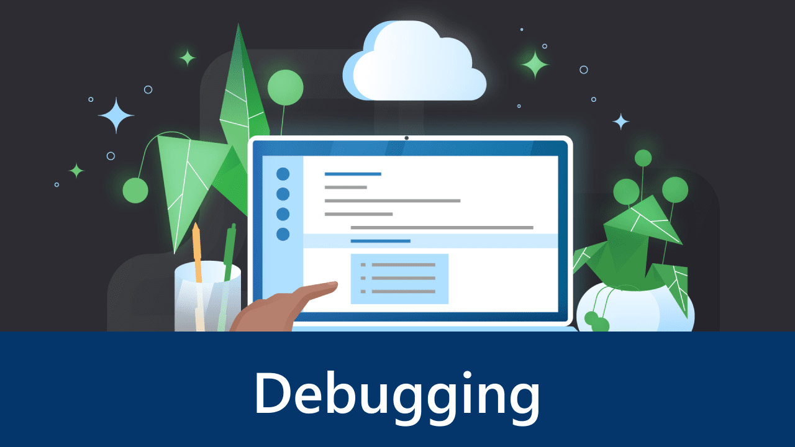
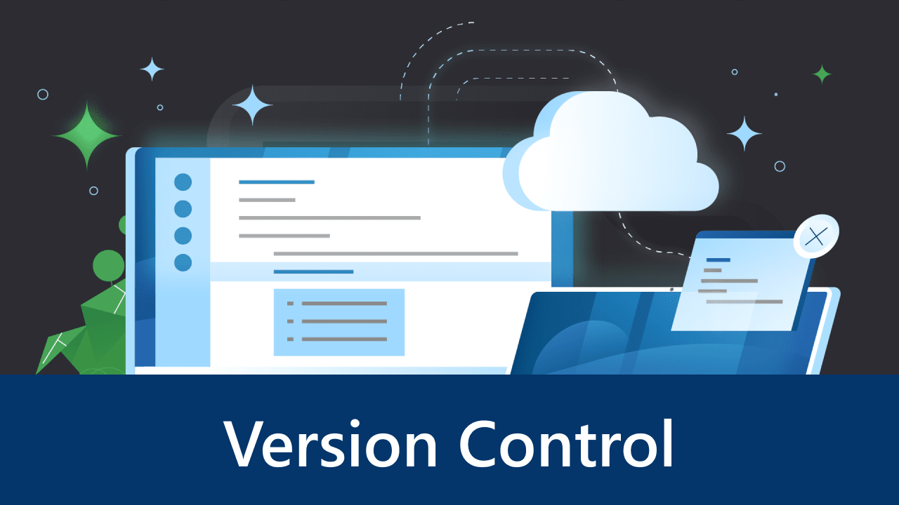

+++
title = "Intro Videos"
date = 2024-01-12T22:36:24+08:00
weight = 1
type = "docs"
description = ""
isCJKLanguage = true
draft = false
+++

> 原文: [https://code.visualstudio.com/docs/getstarted/introvideos](https://code.visualstudio.com/docs/getstarted/introvideos)

# Introductory Videos 入门视频

Start your journey using Visual Studio Code with this set of introductory videos! These videos are designed to give you an overview of VS Code's various features and quickly get you familiar with them.

​​	使用这套入门视频开始您的 Visual Studio Code 之旅！这些视频旨在让您概览 VS Code 的各种功能，并快速熟悉它们。

> **Linux users**: Make sure you have the correct multimedia codecs installed for your Linux distribution. For example, on Ubuntu, you may need to install `ubuntu-restricted-extras` to get the necessary codecs to play the videos.
>
> ​​	Linux 用户：确保已为您的 Linux 发行版安装了正确的多媒体编解码器。例如，在 Ubuntu 上，您可能需要安装 `ubuntu-restricted-extras` 以获取播放视频所需的编解码器。

- 

  ## Getting Started 入门

  Set up and learn the basics of Visual Studio Code.

  ​​	设置并学习 Visual Studio Code 的基础知识。

  Duration5 min
  5 分钟minutes

- 

  ## Code Editing 代码编辑

  Learn how to edit and run code in VS Code.

  ​​	了解如何在 VS Code 中编辑和运行代码。

  Duration3 min
  3 分钟minutes

- 

  ## Productivity Tips 提高工作效率的技巧

  Become a VS Code power user with these productivity tips.

  ​​	通过这些提高工作效率的技巧成为 VS Code 的高级用户。

  Duration4 min
  4 分钟minutes

- 

  ## Personalize 个性化

  Personalize VS Code to make it yours with themes.

  ​​	使用主题个性化 VS Code，使其成为您的专属工具。

  Duration2 min
  2 分钟minutes

- 

  ## Extensions 扩展

  Add features, themes, and more to VS Code with extensions!

  ​​	使用扩展为 VS Code 添加功能、主题等！

  Duration4 min
  4 分钟minutes

- 

  ## Debugging 调试

  Get started with debugging in VS Code.

  ​​	开始在 VS Code 中调试。

  Duration6 min
  6 分钟minutes

- 

  ## Version Control 版本控制

  Learn how to use Git version control in VS Code.

  ​​	了解如何在 VS Code 中使用 Git 版本控制。

  Duration3 min
  3 分钟minutes

- 

  ## Customize 自定义

  Learn how to customize your settings and keyboard shortcuts in VS Code.

  ​​	了解如何在 VS Code 中自定义设置和键盘快捷方式。

  Duration6 min
  6 分钟minutes

## [Troubleshooting 故障排除]()

### [Videos won't play on Linux 视频无法在 Linux 上播放]()

You may not have the correct multimedia codecs installed for your Linux distribution. For example, on Ubuntu, you may need to install `ubuntu-restricted-extras` to get the necessary codecs to play the videos.

​​	您的 Linux 发行版可能没有安装正确的多媒体编解码器。例如，在 Ubuntu 上，您可能需要安装 `ubuntu-restricted-extras` 以获取播放视频所需的编解码器。
