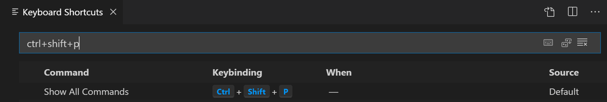

+++
title = "Key Bindings"
date = 2024-01-12T22:36:24+08:00
weight = 50
type = "docs"
description = ""
isCJKLanguage = true
draft = false
+++

> 原文: [https://code.visualstudio.com/docs/getstarted/keybindings](https://code.visualstudio.com/docs/getstarted/keybindings)

# Key Bindings for Visual Studio Code Visual Studio Code 的按键绑定


Visual Studio Code lets you perform most tasks directly from the keyboard. This page lists out the default bindings (keyboard shortcuts) and describes how you can update them.

​​	Visual Studio Code 让你可以直接通过键盘执行大多数任务。此页面列出了默认绑定（键盘快捷键）并说明如何更新它们。

> **Note:** If you visit this page on a Mac, you will see the key bindings for the Mac. If you visit using Windows or Linux, you will see the keys for that platform. If you need the key bindings for another platform, hover your mouse over the key you are interested in.
>
> ​​	注意：如果你在 Mac 上访问此页面，你将看到 Mac 的按键绑定。如果你使用 Windows 或 Linux 访问，你将看到该平台的按键。如果你需要其他平台的按键绑定，将鼠标悬停在你感兴趣的按键上。

## [Keyboard Shortcuts editor 键盘快捷键编辑器](https://code.visualstudio.com/docs/getstarted/keybindings#_keyboard-shortcuts-editor)

Visual Studio Code provides a rich and easy keyboard shortcuts editing experience using **Keyboard Shortcuts** editor. It lists all available commands with and without keybindings and you can easily change / remove / reset their keybindings using the available actions. It also has a search box on the top that helps you in finding commands or keybindings. You can open this editor by going to the menu under **File** > **Preferences** > **Keyboard Shortcuts**.

​​	Visual Studio Code 使用键盘快捷键编辑器提供丰富且简单的键盘快捷键编辑体验。它列出了所有可用的命令（带或不带按键绑定），你可以使用可用操作轻松更改/删除/重置它们的按键绑定。它顶部还有一个搜索框，可帮助你查找命令或按键绑定。你可以通过转到“文件”>“首选项”>“键盘快捷键”下的菜单来打开此编辑器。


Most importantly, you can see keybindings according to your keyboard layout. For example, key binding Cmd+\ in US keyboard layout will be shown as Ctrl+Shift+Alt+Cmd+7 when layout is changed to German. The dialog to enter key binding will assign the correct and desired key binding as per your keyboard layout.

​​	最重要的是，您可以根据键盘布局查看按键绑定。例如，当布局更改为德语时，美国键盘布局中的按键绑定 Cmd+\ 将显示为 Ctrl+Shift+Alt+Cmd+7。输入按键绑定的对话框将根据您的键盘布局分配正确且所需的按键绑定。

For doing more advanced keyboard shortcut customization, read [Advanced Customization](https://code.visualstudio.com/docs/getstarted/keybindings#_advanced-customization).

​​	要执行更高级的键盘快捷方式自定义，请阅读高级自定义。

## [Keymap extensions 按键映射扩展](https://code.visualstudio.com/docs/getstarted/keybindings#_keymap-extensions)

Keyboard shortcuts are vital to productivity and changing keyboarding habits can be tough. To help with this, **File** > **Preferences** > **Migrate Keyboard Shortcuts from...** shows you a list of popular keymap extensions. These extensions modify the VS Code shortcuts to match those of other editors so you don't need to learn new keyboard shortcuts. There is also a [Keymaps category](https://marketplace.visualstudio.com/search?target=VSCode&category=Keymaps&sortBy=Installs) of extensions in the Marketplace.

​​	键盘快捷方式对于提高工作效率至关重要，而改变键盘习惯可能很困难。为了帮助解决这个问题，文件 > 首选项 > 从...迁移键盘快捷方式会向您显示一个流行的按键映射扩展列表。这些扩展修改了 VS Code 快捷方式，使其与其他编辑器的快捷方式相匹配，因此您无需学习新的键盘快捷方式。市场中还有一个按键映射扩展类别。


Vim

5.8M
580 万

vscodevim


Sublime Text Keymap and Settings Importer
Sublime Text 按键映射和设置导入器

2.1M
210 万

ms-vscode


Atom Keymap
Atom 按键映射

1.0M
100 万

ms-vscode


Brackets Keymap

164.8K

ms-vscode

> Tip: Click on an extension tile above to read the description and reviews to decide which extension is best for you. See more in the [Marketplace](https://marketplace.visualstudio.com/vscode).
>
> ​​	提示：单击上方的扩展磁贴以阅读说明和评论，以决定哪个扩展最适合您。在 Marketplace 中查看更多内容。

## [Keyboard Shortcuts Reference 键盘快捷键参考](https://code.visualstudio.com/docs/getstarted/keybindings#_keyboard-shortcuts-reference)

We also have a printable version of these keyboard shortcuts. **Help** > **Keyboard Shortcut Reference** displays a condensed PDF version suitable for printing as an easy reference.

​​	我们还提供了这些键盘快捷键的可打印版本。帮助 > 键盘快捷键参考显示适合打印的浓缩 PDF 版本，以便轻松参考。

Below are links to the three platform-specific versions (US English keyboard):

​​	以下是三个特定于平台的版本（美国英语键盘）的链接：

- [Windows](https://go.microsoft.com/fwlink/?linkid=832145)
- [macOS](https://go.microsoft.com/fwlink/?linkid=832143)
- [Linux](https://go.microsoft.com/fwlink/?linkid=832144)

## [Detecting keybinding conflicts 检测键绑定冲突](https://code.visualstudio.com/docs/getstarted/keybindings#_detecting-keybinding-conflicts)

If you have many extensions installed or you have [customized](https://code.visualstudio.com/docs/getstarted/keybindings#_advanced-customization) your keyboard shortcuts, you can sometimes have keybinding conflicts where the same keyboard shortcut is mapped to several commands. This can result in confusing behavior, especially if different keybindings are going in and out of scope as you move around the editor.

​​	如果您安装了许多扩展或自定义了键盘快捷键，有时可能会遇到键绑定冲突，其中相同的键盘快捷键映射到多个命令。这可能会导致令人困惑的行为，尤其是当您在编辑器中移动时，不同的键绑定进入和退出范围时。

The **Keyboard Shortcuts** editor has a context menu command **Show Same Keybindings**, which will filter the keybindings based on a keyboard shortcut to display conflicts.

​​	键盘快捷键编辑器有一个上下文菜单命令“显示相同键绑定”，它将根据键盘快捷键过滤键绑定以显示冲突。


Pick a command with the keybinding you think is overloaded and you can see if multiple commands are defined, the source of the keybindings and when they are active.

​​	选择一个您认为有问题的键绑定的命令，您可以查看是否定义了多个命令、键绑定的来源以及它们何时处于活动状态。


## [Troubleshooting keybindings 故障排除键绑定](https://code.visualstudio.com/docs/getstarted/keybindings#_troubleshooting-keybindings)

To troubleshoot keybindings problems, you can execute the command **Developer: Toggle Keyboard Shortcuts Troubleshooting**. This will activate logging of dispatched keyboard shortcuts and will open an output panel with the corresponding log file.

​​	要对键绑定问题进行故障排除，可以执行命令“开发人员：切换键盘快捷键故障排除”。这将激活已分派键盘快捷键的日志记录，并将打开一个包含相应日志文件的输出面板。

You can then press your desired keybinding and check what keyboard shortcut VS Code detects and what command is invoked.

​​	然后，可以按所需的键绑定并检查 VS Code 检测到的键盘快捷键以及调用的命令。

For example, when pressing `cmd+/` in a code editor on macOS, the logging output would be:

​​	例如，在 macOS 上的代码编辑器中按 `cmd+/` 时，日志输出将为：

```
[KeybindingService]: / Received  keydown event - modifiers: [meta], code: MetaLeft, keyCode: 91, key: Meta
[KeybindingService]: | Converted keydown event - modifiers: [meta], code: MetaLeft, keyCode: 57 ('Meta')
[KeybindingService]: \ Keyboard event cannot be dispatched.
[KeybindingService]: / Received  keydown event - modifiers: [meta], code: Slash, keyCode: 191, key: /
[KeybindingService]: | Converted keydown event - modifiers: [meta], code: Slash, keyCode: 85 ('/')
[KeybindingService]: | Resolving meta+[Slash]
[KeybindingService]: \ From 2 keybinding entries, matched editor.action.commentLine, when: editorTextFocus && !editorReadonly, source: built-in.
```

The first keydown event is for the `MetaLeft` key (`cmd`) and cannot be dispatched. The second keydown event is for the `Slash` key (`/`) and is dispatched as `meta+[Slash]`. There were two keybinding entries mapped from `meta+[Slash]` and the one that matched was for the command `editor.action.commentLine`, which has the `when` condition `editorTextFocus && !editorReadonly` and is a built-in keybinding entry.

​​	第一个 keydown 事件是针对 `MetaLeft` 键 ( `cmd` )，无法分派。第二个 keydown 事件是针对 `Slash` 键 ( `/` )，并分派为 `meta+[Slash]` 。有两个键绑定项从 `meta+[Slash]` 映射，匹配项是针对命令 `editor.action.commentLine` ，它具有 `when` 条件 `editorTextFocus && !editorReadonly` ，并且是内置键绑定项。

## [Viewing modified keybindings 查看已修改的键绑定](https://code.visualstudio.com/docs/getstarted/keybindings#_viewing-modified-keybindings)

You can view any user modified keyboard shortcuts in VS Code in the **Keyboard Shortcuts** editor with the **Show User Keybindings** command in the **More Actions** (**...**) menu. This applies the `@source:user` filter to the **Keyboard Shortcuts** editor (**Source** is 'User').

​​	可以在 VS Code 中的“键盘快捷键”编辑器中查看任何用户修改的键盘快捷键，方法是在“更多操作 (...)”菜单中使用“显示用户键绑定”命令。这会将 `@source:user` 筛选器应用于“键盘快捷键”编辑器（源为“用户”）。


## [Advanced customization 高级自定义](https://code.visualstudio.com/docs/getstarted/keybindings#_advanced-customization)

All keyboard shortcuts in VS Code can be customized via the `keybindings.json` file.

​​	VS Code 中的所有键盘快捷键都可以通过 `keybindings.json` 文件自定义。

- To configure keyboard shortcuts through the JSON file, open **Keyboard Shortcuts** editor and select the **Open Keyboard Shortcuts (JSON)** button on the right of the editor title bar.
  要通过 JSON 文件配置键盘快捷键，请打开键盘快捷键编辑器，然后选择编辑器标题栏右侧的“打开键盘快捷键 (JSON)”按钮。
- This will open your `keybindings.json` file where you can overwrite the [Default Keyboard Shortcuts](https://code.visualstudio.com/docs/getstarted/keybindings#_default-keyboard-shortcuts).
  这将打开 `keybindings.json` 文件，您可以在其中覆盖默认键盘快捷键。


You can also open the `keybindings.json` file from the Command Palette (Ctrl+Shift+P) with the **Preferences: Open Keyboard Shortcuts (JSON)** command.

​​	您还可以使用“首选项：打开键盘快捷键 (JSON)”命令从命令面板 (Ctrl+Shift+P) 中打开 `keybindings.json` 文件。

## [Keyboard rules 键盘规则](https://code.visualstudio.com/docs/getstarted/keybindings#_keyboard-rules)

Each rule consists of:

​​	每条规则包括：

- a `key` that describes the pressed keys.
  描述所按按键的 `key` 。
- a `command` containing the identifier of the command to execute.
  包含要执行的命令的标识符的 `command` 。
- an **optional** `when` clause containing a boolean expression that will be evaluated depending on the current **context**.
  包含布尔表达式的可选 `when` 子句，该布尔表达式将根据当前上下文进行评估。

Chords (two separate keypress actions) are described by separating the two keypresses with a space. For example, Ctrl+K Ctrl+C.

​​	和弦（两个单独的按键操作）通过用空格分隔两个按键来描述。例如，Ctrl+K Ctrl+C。

When a key is pressed:

​​	当按下某个键时：

- the rules are evaluated from **bottom** to **top**.
  规则从下到上进行评估。
- the first rule that matches, both the `key` and in terms of `when`, is accepted.
  第一个匹配的规则（无论是 `key` 还是 `when` ）都会被接受。
- no more rules are processed.
  不会再处理更多规则。
- if a rule is found and has a `command` set, the `command` is executed.
  如果找到一条规则并且设置了 `command` ，则会执行 `command` 。

The additional `keybindings.json` rules are appended at runtime to the bottom of the default rules, thus allowing them to overwrite the default rules. The `keybindings.json` file is watched by VS Code so editing it while VS Code is running will update the rules at runtime.

​​	其他 `keybindings.json` 规则会在运行时追加到默认规则的底部，从而允许它们覆盖默认规则。

The keyboard shortcuts dispatching is done by analyzing a list of rules that are expressed in JSON. Here are some examples:

​​	VS Code 会监视 文件，因此在 VS Code 运行时对其进行编辑会更新运行时的规则。

```
// Keybindings that are active when the focus is in the editor
{ "key": "home",            "command": "cursorHome",                  "when": "editorTextFocus" },
{ "key": "shift+home",      "command": "cursorHomeSelect",            "when": "editorTextFocus" },

// Keybindings that are complementary
{ "key": "f5",              "command": "workbench.action.debug.continue", "when": "inDebugMode" },
{ "key": "f5",              "command": "workbench.action.debug.start",    "when": "!inDebugMode" },

// Global keybindings
{ "key": "ctrl+f",          "command": "actions.find" },
{ "key": "alt+left",        "command": "workbench.action.navigateBack" },
{ "key": "alt+right",       "command": "workbench.action.navigateForward" },

// Global keybindings using chords (two separate keypress actions)
{ "key": "ctrl+k enter",    "command": "workbench.action.keepEditor" },
{ "key": "ctrl+k ctrl+w",   "command": "workbench.action.closeAllEditors" },
```

## [Accepted keys 键盘快捷键的分派是通过分析以 JSON 表示的一系列规则来完成的。以下是一些示例：](https://code.visualstudio.com/docs/getstarted/keybindings#_accepted-keys)

The `key` is made up of modifiers and the key itself.

​​	已接受的键

The following modifiers are accepted:

由修饰符和键本身组成。

| Platform 接受以下修饰符： | Modifiers 修饰符           |
| :------------------------ | :------------------------- |
| macOS                     | Ctrl+, Shift+, Alt+, Cmd+  |
| Windows                   | Ctrl+, Shift+, Alt+, Win+  |
| Linux                     | Ctrl+, Shift+, Alt+, Meta+ |

The following keys are accepted:

​​	接受以下键：

- f1-f19, a-z, 0-9
  f1-f19、a-z、0-9
- `, -, =, [, ], \, ;, ', ,, ., /
- left, up, right, down, pageup, pagedown, end, home
  左、上、右、下、向上翻页、向下翻页、结束、主页
- tab, enter, escape, space, backspace, delete
  制表符、回车、转义、空格、退格、删除
- pausebreak, capslock, insert
  暂停中断、大写锁定、插入
- numpad0-numpad9, numpad_multiply, numpad_add, numpad_separator
  数字键盘0-数字键盘9、数字键盘乘号、数字键盘加号、数字键盘分隔符
- numpad_subtract, numpad_decimal, numpad_divide
  数字键盘减号、数字键盘小数点、数字键盘除号

## [Command arguments 命令参数](https://code.visualstudio.com/docs/getstarted/keybindings#_command-arguments)

You can invoke a command with arguments. This is useful if you often perform the same operation on a specific file or folder. You can add a custom keyboard shortcut to do exactly what you want.

​​	您可以使用参数调用命令。如果您经常对特定文件或文件夹执行相同操作，这会很有用。您可以添加自定义键盘快捷键来执行您想要的操作。

The following is an example overriding the Enter key to print some text:

​​	以下是一个覆盖 Enter 键以打印一些文本的示例：

```
{
  "key": "enter",
  "command": "type",
  "args": { "text": "Hello World" },
  "when": "editorTextFocus"
}
```

The type command will receive `{"text": "Hello World"}` as its first argument and add "Hello World" to the file instead of producing the default command.

​​	type 命令会将 `{"text": "Hello World"}` 作为其第一个参数接收，并将“Hello World”添加到文件中，而不是生成默认命令。

For more information on commands that take arguments, refer to [Built-in Commands](https://code.visualstudio.com/api/references/commands).

​​	有关接受参数的命令的更多信息，请参阅内置命令。

## [Running multiple commands 运行多个命令](https://code.visualstudio.com/docs/getstarted/keybindings#_running-multiple-commands)

It is possible to create a keybinding that runs several other commands sequentially using the command `runCommands`.

​​	可以使用命令 `runCommands` 创建一个依次运行其他多个命令的键绑定。

1. Run several commands without arguments: copy current line down, mark the current line as comment, move cursor to copied line
   运行多个不带参数的命令：向下复制当前行，将当前行标记为注释，将光标移动到复制的行

```
{
  "key": "ctrl+alt+c",
  "command": "runCommands",
  "args": {
    "commands": [
      "editor.action.copyLinesDownAction",
      "cursorUp",
      "editor.action.addCommentLine",
      "cursorDown"
    ]
  }
},
```

1. It is also possible to pass arguments to commands: create a new untitled TypeScript file and insert a custom snippet
   也可以向命令传递参数：创建一个新的无标题 TypeScript 文件并插入一个自定义代码段

```
{
  "key": "ctrl+n",
  "command": "runCommands",
  "args": {
    "commands": [
      {
        "command": "workbench.action.files.newUntitledFile",
        "args": {
          "languageId": "typescript"
        }
      },
      {
        "command": "editor.action.insertSnippet",
        "args": {
          "langId": "typescript",
          "snippet": "class ${1:ClassName} {\n\tconstructor() {\n\t\t$0\n\t}\n}"
        }
      }
    ]
  }
},
```

Note that commands run by `runCommands` receive the value of `"args"` as the first argument. So in the example above, `workbench.action.files.newUntitledFile` receives `{"languageId": "typescript" }` as its first and only argument.

​​	请注意，由 `runCommands` 运行的命令将 `"args"` 的值作为第一个参数接收。因此，在上面的示例中， `workbench.action.files.newUntitledFile` 将 `{"languageId": "typescript" }` 作为其第一个也是唯一一个参数接收。

To pass several arguments, one needs to have `"args"` as an array:

​​	要传递多个参数，需要将 `"args"` 作为数组：

```
{
  "key": "ctrl+shift+e",
  "command": "runCommands",
  "args": {
    "commands": [
      {
        // command invoked with 2 arguments: vscode.executeCommand("myCommand", "arg1", "arg2")
        "command": "myCommand",
        "args": ["arg1", "arg2"]
      }
    ]
  }
}
```

To pass an array as the first argument, one needs to wrap the array in another array: `"args": [ [1, 2, 3] ]`.

​​	要将数组作为第一个参数传递，需要将数组包装在另一个数组中： `"args": [ [1, 2, 3] ]` 。

## [Removing a specific key binding rule 删除特定键绑定规则](https://code.visualstudio.com/docs/getstarted/keybindings#_removing-a-specific-key-binding-rule)

You can write a key binding rule that targets the removal of a specific default key binding. With the `keybindings.json`, it was always possible to redefine all the key bindings of VS Code, but it can be difficult to make a small tweak, especially around overloaded keys, such as Tab or Escape. To remove a specific key binding, add a `-` to the `command` and the rule will be a removal rule.

​​	您可以编写一个键绑定规则，以删除特定的默认键绑定。使用 `keybindings.json` ，始终可以重新定义 VS Code 的所有键绑定，但很难进行微小的调整，尤其是在 Tab 或 Escape 等重载键周围。要删除特定的键绑定，请将 `-` 添加到 `command` ，该规则将成为删除规则。

Here is an example:

​​	这是一个示例：

```
// In Default Keyboard Shortcuts
...
{ "key": "tab", "command": "tab", "when": ... },
{ "key": "tab", "command": "jumpToNextSnippetPlaceholder", "when": ... },
{ "key": "tab", "command": "acceptSelectedSuggestion", "when": ... },
...

// To remove the second rule, for example, add in keybindings.json:
{ "key": "tab", "command": "-jumpToNextSnippetPlaceholder" }
```

To override a specific key binding rule with an empty action, you can specify an empty command:

​​	要使用空操作覆盖特定的键绑定规则，您可以指定一个空命令：

```
// To override and disable any `tab` keybinding, for example, add in keybindings.json:
{ "key": "tab", "command": "" }
```

## [Keyboard layouts 键盘布局](https://code.visualstudio.com/docs/getstarted/keybindings#_keyboard-layouts)

> **Note:** This section relates only to key bindings, not to typing in the editor.
>
> ​​	注意：本节仅与键绑定相关，不与在编辑器中键入相关。

The keys above are string representations for virtual keys and do not necessarily relate to the produced character when they are pressed. More precisely:

​​	上面的键是虚拟键的字符串表示形式，并不一定与按下时产生的字符相关。更准确地说：

- Reference: [Virtual-Key Codes (Windows)](https://msdn.microsoft.com/library/windows/desktop/dd375731)
  参考：虚拟键代码（Windows）
- tab for `VK_TAB` (`0x09`)
  制表符为 `VK_TAB` ( `0x09` )
- ; for `VK_OEM_1` (`0xBA`)
  ；对于 `VK_OEM_1` ( `0xBA` )
- = for `VK_OEM_PLUS` (`0xBB`)
  = 对于 `VK_OEM_PLUS` ( `0xBB` )
- , for `VK_OEM_COMMA` (`0xBC`)
  ，对于 `VK_OEM_COMMA` ( `0xBC` )
- \- for `VK_OEM_MINUS` (`0xBD`)
  \- 对于 `VK_OEM_MINUS` ( `0xBD` )
- . for `VK_OEM_PERIOD` (`0xBE`)
  . 对于 `VK_OEM_PERIOD` ( `0xBE` )
- / for `VK_OEM_2` (`0xBF`)
  / 对于 `VK_OEM_2` ( `0xBF` )
- ` for `VK_OEM_3` (`0xC0`)
  ` 对于 `VK_OEM_3` ( `0xC0` )
- [ for `VK_OEM_4` (`0xDB`)
  [ 适用于 `VK_OEM_4` ( `0xDB` )
- \ for `VK_OEM_5` (`0xDC`)
  \ 适用于 `VK_OEM_5` ( `0xDC` )
- ] for `VK_OEM_6` (`0xDD`)
  ] 适用于 `VK_OEM_6` ( `0xDD` )
- ' for `VK_OEM_7` (`0xDE`)
  ' 适用于 `VK_OEM_7` ( `0xDE` )
- etc.
  等。

Different keyboard layouts usually reposition the above virtual keys or change the characters produced when they are pressed. When using a different keyboard layout than the standard US, Visual Studio Code does the following:

​​	不同的键盘布局通常会重新定位上述虚拟键或更改按下这些键时产生的字符。在使用与标准美国键盘布局不同的键盘布局时，Visual Studio Code 执行以下操作：

All the key bindings are rendered in the UI using the current system's keyboard layout. For example, `Split Editor` when using a French (France) keyboard layout is now rendered as Ctrl+*:

​​	所有键绑定均使用当前系统的键盘布局在 UI 中呈现。例如， `Split Editor` 在使用法语（法国）键盘布局时现在呈现为 Ctrl+*：


When editing `keybindings.json`, VS Code highlights misleading key bindings, those that are represented in the file with the character produced under the standard US keyboard layout, but that need pressing keys with different labels under the current system's keyboard layout. For example, here is how the **Default Keyboard Shortcuts** rules look like when using a French (France) keyboard layout:

​​	在编辑 `keybindings.json` 时，VS Code 会突出显示具有误导性的键绑定，这些键绑定在文件中用标准美国键盘布局下产生的字符表示，但在当前系统的键盘布局下需要按下具有不同标签的键。例如，以下是使用法语（法国）键盘布局时默认键盘快捷方式规则的外观：


There is also a widget that helps input the key binding rule when editing `keybindings.json`. To launch the **Define Keybinding** widget, press Ctrl+K Ctrl+K. The widget listens for key presses and renders the serialized JSON representation in the text box and below it, the keys that VS Code has detected under your current keyboard layout. Once you've typed the key combination you want, you can press Enter and a rule snippet will be inserted.

​​	在编辑 `keybindings.json` 时，还有一个帮助输入键绑定规则的小部件。要启动“定义键绑定”小部件，请按 Ctrl+K Ctrl+K。该小部件侦听按键并呈现文本框中的序列化 JSON 表示，以及 VS Code 在当前键盘布局下检测到的键。键入所需的组合键后，您可以按 Enter，然后将插入规则代码段。


> **Note:** On Linux, Visual Studio Code detects your current keyboard layout on start-up and then caches this information. For a good experience, we recommend restarting VS Code if you change your keyboard layout.
>
> ​​	注意：在 Linux 上，Visual Studio Code 在启动时检测当前键盘布局，然后缓存此信息。为了获得良好的体验，我们建议在更改键盘布局时重新启动 VS Code。

## [Keyboard layout-independent bindings 与键盘布局无关的绑定](https://code.visualstudio.com/docs/getstarted/keybindings#_keyboard-layoutindependent-bindings)

Using scan codes, it is possible to define keybindings which do not change with the change of the keyboard layout. For example:

​​	使用扫描码，可以定义不会随键盘布局更改而更改的键绑定。例如：

```
{ "key": "cmd+[Slash]", "command": "editor.action.commentLine", "when": "editorTextFocus" }
```

Accepted scan codes:

​​	可接受的扫描码：

- [F1]-[F19], [KeyA]-[KeyZ], [Digit0]-[Digit9]
- [Backquote], [Minus], [Equal], [BracketLeft], [BracketRight], [Backslash], [Semicolon], [Quote], [Comma], [Period], [Slash]
- [ArrowLeft], [ArrowUp], [ArrowRight], [ArrowDown], [PageUp], [PageDown], [End], [Home]
- [Tab], [Enter], [Escape], [Space], [Backspace], [Delete]
  制表符、回车、退出、空格、退格、删除
- [Pause], [CapsLock], [Insert]
  暂停、大写锁定、插入
- [Numpad0]-[Numpad9], [NumpadMultiply], [NumpadAdd], [NumpadComma]
  [数字键盘0]-[数字键盘9]、[数字键盘乘号]、[数字键盘加号]、[数字键盘逗号]
- [NumpadSubtract], [NumpadDecimal], [NumpadDivide]
  [NumpadSubtract]、[NumpadDecimal]、[NumpadDivide]

## [when clause contexts when 子句上下文](https://code.visualstudio.com/docs/getstarted/keybindings#_when-clause-contexts)

VS Code gives you fine control over when your key bindings are enabled through the optional `when` clause. If your key binding doesn't have a `when` clause, the key binding is globally available at all times. A `when` clause evaluates to either Boolean true or false for enabling key bindings.

​​	VS Code 通过可选的 `when` 子句，让您可以精细地控制何时启用键绑定。如果您的键绑定没有 `when` 子句，则该键绑定始终全局可用。 `when` 子句针对启用键绑定计算布尔值为 true 或 false。

VS Code sets various context keys and specific values depending on what elements are visible and active in the VS Code UI. For example, the built-in **Start Debugging** command has the keyboard shortcut F5, which is only enabled when there is an appropriate debugger available (context `debuggersAvailable` is true) and the editor isn't in debug mode (context `inDebugMode` is false):

​​	VS Code 会根据 VS Code UI 中可见和处于活动状态的元素设置各种上下文键和特定值。例如，内置的“开始调试”命令具有键盘快捷键 F5，该快捷键仅在有适当的调试器可用（上下文 `debuggersAvailable` 为 true）且编辑器不在调试模式下（上下文 `inDebugMode` 为 false）时启用：


You can also view a keybinding's when clause directly in the Default Keybindings JSON (**Preferences: Open Default Keyboard Shortcuts (JSON)**):

​​	您还可以在默认键绑定 JSON（首选项：打开默认键盘快捷键 (JSON)）中直接查看键绑定的 when 子句：

```
{ "key": "f5",  "command": "workbench.action.debug.start",
                   "when": "debuggersAvailable && !inDebugMode" },
```

### [Conditional operators 条件运算符](https://code.visualstudio.com/docs/getstarted/keybindings#_conditional-operators)

For when clause conditional expressions, the following conditional operators are useful for keybindings:

​​	对于 when 子句条件表达式，以下条件运算符对键绑定很有用：

| Operator 运算符   | Symbol 符号 | Example 示例                              |
| :---------------- | :---------- | :---------------------------------------- |
| Equality 相等性   | `==`        | `"editorLangId == typescript"`            |
| Inequality 不等性 | `!=`        | `"resourceExtname != .js"`                |
| Or                | `||`        | `"isLinux``||``isWindows"`                |
| And               | `&&`        | `"textInputFocus && !editorReadonly"`     |
| Matches 匹配      | `=~`        | `"resourceScheme =~ /^untitled$|^file$/"` |

You can find the full list of when clause conditional operators in the [when clause contexts](https://code.visualstudio.com/api/references/when-clause-contexts#_conditional-operators) reference.

​​	您可以在 when 子句上下文参考中找到 when 子句条件运算符的完整列表。

### [Available contexts 可用上下文](https://code.visualstudio.com/docs/getstarted/keybindings#_available-contexts)

You can find some of the available `when` clause contexts in the [when clause context reference](https://code.visualstudio.com/api/references/when-clause-contexts).

​​	您可以在 when 子句上下文参考中找到一些可用的 `when` 子句上下文。

The list there isn't exhaustive and you can find other `when` clause contexts by searching and filtering in the Keyboard Shortcuts editor (**Preferences: Open Keyboard Shortcuts** ) or reviewing the Default Keybindings JSON file (**Preferences: Open Default Keyboard Shortcuts (JSON)**).

​​	那里的列表并不详尽，您可以通过在键盘快捷键编辑器中搜索和过滤（首选项：打开键盘快捷键）或查看默认键盘快捷键 JSON 文件（首选项：打开默认键盘快捷键 (JSON)）来找到其他 `when` 子句上下文。

## [Custom keybindings for refactorings 重构的自定义键盘快捷键](https://code.visualstudio.com/docs/getstarted/keybindings#_custom-keybindings-for-refactorings)

The `editor.action.codeAction` command lets you configure keybindings for specific [Refactorings](https://code.visualstudio.com/docs/editor/refactoring) (Code Actions). For example, the keybinding below triggers the **Extract function** refactoring Code Actions:

​​	 `editor.action.codeAction` 命令允许您为特定重构（代码操作）配置键盘快捷键。例如，下面的键盘快捷键触发提取函数重构代码操作：

```
{
  "key": "ctrl+shift+r ctrl+e",
  "command": "editor.action.codeAction",
  "args": {
    "kind": "refactor.extract.function"
  }
}
```

This is covered in depth in the [Refactoring](https://code.visualstudio.com/docs/editor/refactoring#_keybindings-for-code-actions) topic where you can learn about different kinds of Code Actions and how to prioritize them in the case of multiple possible refactorings.

​​	这在重构主题中进行了详细介绍，您可以在其中了解不同类型的代码操作以及在多种可能的重构情况下如何对它们进行优先级排序。

## [Default Keyboard Shortcuts 默认键盘快捷键](https://code.visualstudio.com/docs/getstarted/keybindings#_default-keyboard-shortcuts)

You can view all default keyboard shortcuts in VS Code in the **Keyboard Shortcuts** editor with the **Show Default Keybindings** command in the **More Actions** (**...**) menu. This applies the `@source:default` filter to the **Keyboard Shortcuts** editor (**Source** is 'Default').

​​	您可以在“更多操作 (...)”菜单中使用“显示默认键绑定”命令在 VS Code 的键盘快捷键编辑器中查看所有默认键盘快捷键。这会将 `@source:default` 筛选器应用于键盘快捷键编辑器（源为“默认”）。


You can view the default keyboard shortcuts as a JSON file using the command **Preferences: Open Default Keyboard Shortcuts (JSON)**.

​​	您可以使用命令“首选项：打开默认键盘快捷键 (JSON)”将默认键盘快捷键作为 JSON 文件查看。

> **Note:** The following keys are rendered assuming a standard US keyboard layout. If you use a different keyboard layout, please [read below](https://code.visualstudio.com/docs/getstarted/keybindings#_keyboard-layouts). You can view the currently active keyboard shortcuts in VS Code in the **Command Palette** (**View** -> **Command Palette**) or in the **Keyboard Shortcuts** editor (**File** > **Preferences** > **Keyboard Shortcuts**).
>
> ​​	注意：以下键假定使用标准美国键盘布局。如果您使用不同的键盘布局，请阅读以下内容。您可以在命令面板（视图 -> 命令面板）或键盘快捷键编辑器（文件 > 首选项 > 键盘快捷键）中查看 VS Code 中当前处于活动状态的键盘快捷键。

Some commands included below do not have default keyboard shortcuts and so are displayed as unassigned but you can assign your own keybindings.

​​	下面包含的某些命令没有默认键盘快捷键，因此显示为未分配，但您可以分配自己的键绑定。

### [Basic Editing 基本编辑](https://code.visualstudio.com/docs/getstarted/keybindings#_basic-editing)

| Command 命令                                                 | Key                                                          | Command id 命令 ID                                  |
| :----------------------------------------------------------- | :----------------------------------------------------------- | :-------------------------------------------------- |
| Cut line (empty selection) 剪切行（空选择）                  | Ctrl+X                                                       | `editor.action.clipboardCutAction`                  |
| Copy line (empty selection) 复制行（空选择）                 | Ctrl+C                                                       | `editor.action.clipboardCopyAction`                 |
| Paste 粘贴                                                   | Ctrl+V                                                       | `editor.action.clipboardPasteAction`                |
| Delete Line 删除行                                           | Ctrl+Shift+K                                                 | `editor.action.deleteLines`                         |
| Insert Line Below 在下面插入行                               | Ctrl+Enter                                                   | `editor.action.insertLineAfter`                     |
| Insert Line Above 在上面插入行                               | Ctrl+Shift+Enter                                             | `editor.action.insertLineBefore`                    |
| Move Line Down 向下移动行                                    | Alt+Down Alt+向下                                            | `editor.action.moveLinesDownAction`                 |
| Move Line Up 向上移动行                                      | Alt+Up Alt+向上                                              | `editor.action.moveLinesUpAction`                   |
| Copy Line Down 向下复制行                                    | Shift+Alt+Down Shift+Alt+向下                                | `editor.action.copyLinesDownAction`                 |
| Copy Line Up 向上复制行                                      | Shift+Alt+Up Shift+Alt+向上                                  | `editor.action.copyLinesUpAction`                   |
| Undo 撤消                                                    | Ctrl+Z                                                       | `undo`                                              |
| Redo 重做                                                    | Ctrl+Y                                                       | `redo`                                              |
| Add Selection To Next Find Match 将选择添加到下一个查找匹配  | Ctrl+D                                                       | `editor.action.addSelectionToNextFindMatch`         |
| Move Last Selection To Next Find Match 将上次选择移动到下一个查找匹配 | Ctrl+K Ctrl+D                                                | `editor.action.moveSelectionToNextFindMatch`        |
| Undo last cursor operation 撤消上次光标操作                  | Ctrl+U                                                       | `cursorUndo`                                        |
| Insert cursor at end of each line selected 在所选每行的末尾插入光标 | Shift+Alt+I                                                  | `editor.action.insertCursorAtEndOfEachLineSelected` |
| Select all occurrences of current selection 选择当前选定内容的所有出现位置 | Ctrl+Shift+L                                                 | `editor.action.selectHighlights`                    |
| Select all occurrences of current word 选择当前单词的所有出现位置 | Ctrl+F2                                                      | `editor.action.changeAll`                           |
| Select current line 选择当前行                               | Ctrl+L                                                       | `expandLineSelection`                               |
| Insert Cursor Below 在下方插入光标                           | Ctrl+Alt+Down Ctrl+Alt+向下                                  | `editor.action.insertCursorBelow`                   |
| Insert Cursor Above 在上方插入光标                           | Ctrl+Alt+Up Ctrl+Alt+向上                                    | `editor.action.insertCursorAbove`                   |
| Jump to matching bracket 跳转到匹配的括号                    | Ctrl+Shift+\                                                 | `editor.action.jumpToBracket`                       |
| Indent Line 缩进行                                           | Ctrl+]                                                       | `editor.action.indentLines`                         |
| Outdent Line 缩进行                                          | Ctrl+[                                                       | `editor.action.outdentLines`                        |
| Go to Beginning of Line 转到行首                             | Home                                                         | `cursorHome`                                        |
| Go to End of Line 转到行尾                                   | End                                                          | `cursorEnd`                                         |
| Go to End of File 转到文件末尾                               | Ctrl+End                                                     | `cursorBottom`                                      |
| Go to Beginning of File 转到文件开头                         | Ctrl+Home                                                    | `cursorTop`                                         |
| Scroll Line Down 向下滚动一行                                | Ctrl+Down                                                    | `scrollLineDown`                                    |
| Scroll Line Up 向上滚动一行                                  | Ctrl+Up                                                      | `scrollLineUp`                                      |
| Scroll Page Down 向下滚动一页                                | Alt+PageDown                                                 | `scrollPageDown`                                    |
| Scroll Page Up 向上滚动一页                                  | Alt+PageUp                                                   | `scrollPageUp`                                      |
| Fold (collapse) region 折叠（收起）区域                      | Ctrl+Shift+[                                                 | `editor.fold`                                       |
| Unfold (uncollapse) region 展开（展开）区域                  | Ctrl+Shift+]                                                 | `editor.unfold`                                     |
| Fold (collapse) all subregions 折叠（收起）所有子区域        | Ctrl+K Ctrl+[                                                | `editor.foldRecursively`                            |
| Unfold (uncollapse) all subregions 展开（展开）所有子区域    | Ctrl+K Ctrl+]                                                | `editor.unfoldRecursively`                          |
| Fold (collapse) all regions 折叠（收起）所有区域             | Ctrl+K Ctrl+0                                                | `editor.foldAll`                                    |
| Unfold (uncollapse) all regions 展开（展开）所有区域         | Ctrl+K Ctrl+J                                                | `editor.unfoldAll`                                  |
| Add Line Comment 添加行注释                                  | Ctrl+K Ctrl+C                                                | `editor.action.addCommentLine`                      |
| Remove Line Comment 删除行注释                               | Ctrl+K Ctrl+U                                                | `editor.action.removeCommentLine`                   |
| Toggle Line Comment 切换行注释                               | Ctrl+/                                                       | `editor.action.commentLine`                         |
| Toggle Block Comment 切换块注释                              | Shift+Alt+A                                                  | `editor.action.blockComment`                        |
| Find 查找                                                    | Ctrl+F                                                       | `actions.find`                                      |
| Replace 替换                                                 | Ctrl+H                                                       | `editor.action.startFindReplaceAction`              |
| Find Next 查找下一个                                         | Enter                                                        | `editor.action.nextMatchFindAction`                 |
| Find Previous 查找上一个                                     | Shift+Enter                                                  | `editor.action.previousMatchFindAction`             |
| Select All Occurrences of Find Match 选择所有匹配项          | Alt+Enter Alt+Enter切换区分字母的大小写查找Alt+C切换正则表达式查找Alt+R切换查找完整单词Alt+W切换使用 Tab 键设置焦点Ctrl+M切换呈现空白 | `editor.action.selectAllMatches`                    |
| Toggle Find Case Sensitive                                   | Alt+C                                                        | `toggleFindCaseSensitive`                           |
| Toggle Find Regex                                            | Alt+R                                                        | `toggleFindRegex`                                   |
| Toggle Find Whole Word                                       | Alt+W                                                        | `toggleFindWholeWord`                               |
| Toggle Use of Tab Key for Setting Focus                      | Ctrl+M                                                       | `editor.action.toggleTabFocusMode`                  |
| Toggle Render Whitespace                                     | unassigned 未分配                                            | `toggleRenderWhitespace`                            |
| Toggle Word Wrap 切换自动换行                                | Alt+Z                                                        | `editor.action.toggleWordWrap`                      |

### [Rich Languages Editing 富语言编辑](https://code.visualstudio.com/docs/getstarted/keybindings#_rich-languages-editing)

| Command 命令                               | Key                              | Command id 命令 ID                           |
| :----------------------------------------- | :------------------------------- | :------------------------------------------- |
| Trigger Suggest 触发建议                   | Ctrl+Space Ctrl+空格             | `editor.action.triggerSuggest`               |
| Trigger Parameter Hints 触发参数提示       | Ctrl+Shift+Space Ctrl+Shift+空格 | `editor.action.triggerParameterHints`        |
| Format Document 格式化文档                 | Shift+Alt+F                      | `editor.action.formatDocument`               |
| Format Selection 格式化选定内容            | Ctrl+K Ctrl+F                    | `editor.action.formatSelection`              |
| Go to Definition 转到定义                  | F12                              | `editor.action.revealDefinition`             |
| Show Hover 显示悬停                        | Ctrl+K Ctrl+I                    | `editor.action.showHover`                    |
| Peek Definition 预览定义                   | Alt+F12                          | `editor.action.peekDefinition`               |
| Open Definition to the Side 在侧边打开定义 | Ctrl+K F12                       | `editor.action.revealDefinitionAside`        |
| Quick Fix 快速修复                         | Ctrl+.                           | `editor.action.quickFix`                     |
| Go to References 转到引用                  | Shift+F12                        | `editor.action.goToReferences`               |
| Rename Symbol 重命名符号                   | F2                               | `editor.action.rename`                       |
| Replace with Next Value 替换为下一个值     | Ctrl+Shift+.                     | `editor.action.inPlaceReplace.down`          |
| Replace with Previous Value 替换为上一个值 | Ctrl+Shift+,                     | `editor.action.inPlaceReplace.up`            |
| Expand AST Selection 展开 AST 选择         | Shift+Alt+Right Shift+Alt+右     | `editor.action.smartSelect.expand`           |
| Shrink AST Selection 收缩 AST 选择         | Shift+Alt+Left Shift+Alt+左      | `editor.action.smartSelect.shrink`           |
| Trim Trailing Whitespace 修剪尾随空格      | Ctrl+K Ctrl+X                    | `editor.action.trimTrailingWhitespace`       |
| Change Language Mode 更改语言模式          | Ctrl+K M                         | `workbench.action.editor.changeLanguageMode` |

### [Navigation 导航](https://code.visualstudio.com/docs/getstarted/keybindings#_navigation)

| Command 命令                                         | Key                                   | Command id 命令 id                                           |
| :--------------------------------------------------- | :------------------------------------ | :----------------------------------------------------------- |
| Show All Symbols 显示所有符号                        | Ctrl+T                                | `workbench.action.showAllSymbols`                            |
| Go to Line... 转到行...                              | Ctrl+G                                | `workbench.action.gotoLine`                                  |
| Go to File..., Quick Open 转到文件...，快速打开      | Ctrl+P                                | `workbench.action.quickOpen`                                 |
| Go to Symbol... 转到符号...                          | Ctrl+Shift+O                          | `workbench.action.gotoSymbol`                                |
| Show Problems 显示问题                               | Ctrl+Shift+M                          | `workbench.actions.view.problems`                            |
| Go to Next Error or Warning 转到下一个错误或警告     | F8                                    | `editor.action.marker.nextInFiles`                           |
| Go to Previous Error or Warning 转到上一个错误或警告 | Shift+F8                              | `editor.action.marker.prevInFiles`                           |
| Show All Commands 显示所有命令                       | Ctrl+Shift+P or F1 Ctrl+Shift+P 或 F1 | `workbench.action.showCommands`                              |
| Navigate Editor Group History 导航编辑器组历史记录   | Ctrl+Tab                              | `workbench.action.quickOpenPreviousRecentlyUsedEditorInGroup` |
| Go Back 返回                                         | Alt+Left Alt+左                       | `workbench.action.navigateBack`                              |
| Go back in Quick Input 在快速输入中返回              | Alt+Left Alt+左                       | `workbench.action.quickInputBack`                            |
| Go Forward 前进                                      | Alt+Right Alt+右                      | `workbench.action.navigateForward`                           |
| Focus Breadcrumbs 焦点面包屑                         | Ctrl+Shift+;                          | `breadcrumbs.focus`                                          |
| Focus and Select Breadcrumbs 焦点并选择面包屑        | Ctrl+Shift+.                          | `breadcrumbs.focusAndSelect`                                 |

### [Editor/Window Management 编辑器/窗口管理](https://code.visualstudio.com/docs/getstarted/keybindings#_editorwindow-management)

| Command 命令                                            | Key                        | Command id 命令 id                            |
| :------------------------------------------------------ | :------------------------- | :-------------------------------------------- |
| New Window 新建窗口                                     | Ctrl+Shift+N               | `workbench.action.newWindow`                  |
| Close Window 关闭窗口                                   | Alt+F4                     | `workbench.action.closeWindow`                |
| Close Editor 关闭编辑器                                 | Ctrl+W                     | `workbench.action.closeActiveEditor`          |
| Close Folder 关闭文件夹                                 | Ctrl+K F                   | `workbench.action.closeFolder`                |
| Cycle Between Editor Groups 在编辑器组之间循环          | unassigned 未分配          | `workbench.action.navigateEditorGroups`       |
| Split Editor 拆分编辑器                                 | Ctrl+\                     | `workbench.action.splitEditor`                |
| Focus into First Editor Group 聚焦到第一个编辑器组      | Ctrl+1                     | `workbench.action.focusFirstEditorGroup`      |
| Focus into Second Editor Group 聚焦到第二个编辑器组     | Ctrl+2                     | `workbench.action.focusSecondEditorGroup`     |
| Focus into Third Editor Group 聚焦到第三个编辑器组      | Ctrl+3                     | `workbench.action.focusThirdEditorGroup`      |
| Focus into Editor Group on the Left 聚焦到左侧编辑器组  | unassigned 未分配          | `workbench.action.focusPreviousGroup`         |
| Focus into Editor Group on the Right 聚焦到右侧编辑器组 | unassigned 未分配          | `workbench.action.focusNextGroup`             |
| Move Editor Left 向左移动编辑器                         | Ctrl+Shift+PageUp          | `workbench.action.moveEditorLeftInGroup`      |
| Move Editor Right 向右移动编辑器                        | Ctrl+Shift+PageDown        | `workbench.action.moveEditorRightInGroup`     |
| Move Active Editor Group Left 向左移动活动编辑器组      | Ctrl+K Left Ctrl+K 向左    | `workbench.action.moveActiveEditorGroupLeft`  |
| Move Active Editor Group Right 向右移动活动编辑器组     | Ctrl+K Right Ctrl+K 向右   | `workbench.action.moveActiveEditorGroupRight` |
| Move Editor into Next Group 将编辑器移入下一个组        | Ctrl+Alt+Right Ctrl+Alt+右 | `workbench.action.moveEditorToNextGroup`      |
| Move Editor into Previous Group 将编辑器移入前一个组    | Ctrl+Alt+Left Ctrl+Alt+左  | `workbench.action.moveEditorToPreviousGroup`  |

### [File Management 文件管理](https://code.visualstudio.com/docs/getstarted/keybindings#_file-management)

| Command 命令                                              | Key               | Command id 命令 ID                                 |
| :-------------------------------------------------------- | :---------------- | :------------------------------------------------- |
| New File 新建文件                                         | Ctrl+N            | `workbench.action.files.newUntitledFile`           |
| Open File... 打开文件...                                  | Ctrl+O            | `workbench.action.files.openFile`                  |
| Save 保存                                                 | Ctrl+S            | `workbench.action.files.save`                      |
| Save All 全部保存                                         | Ctrl+K S          | `saveAll`                                          |
| Save As... 另存为...                                      | Ctrl+Shift+S      | `workbench.action.files.saveAs`                    |
| Close 关闭                                                | Ctrl+W            | `workbench.action.closeActiveEditor`               |
| Close Others 关闭其他                                     | unassigned 未分配 | `workbench.action.closeOtherEditors`               |
| Close Group 关闭组                                        | Ctrl+K W          | `workbench.action.closeEditorsInGroup`             |
| Close Other Groups 关闭其他组                             | unassigned 未分配 | `workbench.action.closeEditorsInOtherGroups`       |
| Close Group to Left 关闭左侧组                            | unassigned 未分配 | `workbench.action.closeEditorsToTheLeft`           |
| Close Group to Right 关闭右侧组                           | unassigned 未分配 | `workbench.action.closeEditorsToTheRight`          |
| Close All 全部关闭                                        | Ctrl+K Ctrl+W     | `workbench.action.closeAllEditors`                 |
| Reopen Closed Editor 重新打开已关闭的编辑器               | Ctrl+Shift+T      | `workbench.action.reopenClosedEditor`              |
| Keep Open 保持打开                                        | Ctrl+K Enter      | `workbench.action.keepEditor`                      |
| Copy Path of Active File 复制活动文件的路径               | Ctrl+K P          | `workbench.action.files.copyPathOfActiveFile`      |
| Reveal Active File in Windows 在 Windows 中显示活动文件   | Ctrl+K R          | `workbench.action.files.revealActiveFileInWindows` |
| Show Opened File in New Window 在新窗口中显示已打开的文件 | Ctrl+K O          | `workbench.action.files.showOpenedFileInNewWindow` |
| Compare Opened File With 比较已打开的文件与               | unassigned 未分配 | `workbench.files.action.compareFileWith`           |

### [Display 显示](https://code.visualstudio.com/docs/getstarted/keybindings#_display)

| Command 命令                                         | Key                         | Command id 命令 ID                            |
| :--------------------------------------------------- | :-------------------------- | :-------------------------------------------- |
| Toggle Full Screen 切换全屏                          | F11                         | `workbench.action.toggleFullScreen`           |
| Toggle Zen Mode 切换禅模式                           | Ctrl+K Z                    | `workbench.action.toggleZenMode`              |
| Leave Zen Mode 退出禅模式                            | Escape Escape 退出 退出     | `workbench.action.exitZenMode`                |
| Zoom in 放大                                         | Ctrl+=                      | `workbench.action.zoomIn`                     |
| Zoom out 缩小                                        | Ctrl+-                      | `workbench.action.zoomOut`                    |
| Reset Zoom 重置缩放                                  | Ctrl+Numpad0 Ctrl+数字键盘0 | `workbench.action.zoomReset`                  |
| Toggle Sidebar Visibility 切换侧边栏可见性           | Ctrl+B                      | `workbench.action.toggleSidebarVisibility`    |
| Show Explorer / Toggle Focus 显示资源管理器/切换焦点 | Ctrl+Shift+E                | `workbench.view.explorer`                     |
| Show Search 显示搜索                                 | Ctrl+Shift+F                | `workbench.view.search`                       |
| Show Source Control 显示源代码管理                   | Ctrl+Shift+G                | `workbench.view.scm`                          |
| Show Run 显示运行                                    | Ctrl+Shift+D                | `workbench.view.debug`                        |
| Show Extensions 显示扩展                             | Ctrl+Shift+X                | `workbench.view.extensions`                   |
| Show Output 显示输出                                 | Ctrl+Shift+U                | `workbench.action.output.toggleOutput`        |
| Quick Open View 快速打开视图                         | Ctrl+Q                      | `workbench.action.quickOpenView`              |
| Open New Command Prompt 打开新的命令提示符           | Ctrl+Shift+C                | `workbench.action.terminal.openNativeConsole` |
| Toggle Markdown Preview 切换 Markdown 预览           | Ctrl+Shift+V                | `markdown.showPreview`                        |
| Open Preview to the Side 在侧边打开预览              | Ctrl+K V                    | `markdown.showPreviewToSide`                  |
| Toggle Integrated Terminal 切换集成终端              | Ctrl+`                      | `workbench.action.terminal.toggleTerminal`    |

### [Search 搜索](https://code.visualstudio.com/docs/getstarted/keybindings#_search)

| Command 命令                                     | Key          | Command id 命令 id                           |
| :----------------------------------------------- | :----------- | :------------------------------------------- |
| Show Search 显示搜索                             | Ctrl+Shift+F | `workbench.view.search`                      |
| Replace in Files 在文件中替换                    | Ctrl+Shift+H | `workbench.action.replaceInFiles`            |
| Toggle Match Case 切换匹配大小写                 | Alt+C        | `toggleSearchCaseSensitive`                  |
| Toggle Match Whole Word 切换匹配整个单词         | Alt+W        | `toggleSearchWholeWord`                      |
| Toggle Use Regular Expression 切换使用正则表达式 | Alt+R        | `toggleSearchRegex`                          |
| Toggle Search Details 切换搜索详细信息           | Ctrl+Shift+J | `workbench.action.search.toggleQueryDetails` |
| Focus Next Search Result 聚焦下一个搜索结果      | F4           | `search.action.focusNextSearchResult`        |
| Focus Previous Search Result 聚焦上一个搜索结果  | Shift+F4     | `search.action.focusPreviousSearchResult`    |
| Show Next Search Term 显示下一个搜索词           | Down 向下    | `history.showNext`                           |
| Show Previous Search Term 显示上一个搜索词       | Up           | `history.showPrevious`                       |

### [Search Editor 搜索编辑器](https://code.visualstudio.com/docs/getstarted/keybindings#_search-editor)

| Command 命令                                 | Key                  | Command id 命令 ID                             |
| :------------------------------------------- | :------------------- | :--------------------------------------------- |
| Open Results In Editor 在编辑器中打开结果    | Alt+Enter            | `search.action.openInEditor`                   |
| Focus Search Editor Input 聚焦搜索编辑器输入 | Escape               | `search.action.focusQueryEditorWidget`         |
| Search Again 再次搜索                        | Ctrl+Shift+R         | `rerunSearchEditorSearch`                      |
| Delete File Results 删除文件结果             | Ctrl+Shift+Backspace | `search.searchEditor.action.deleteFileResults` |

### [Preferences 首选项](https://code.visualstudio.com/docs/getstarted/keybindings#_preferences)

| Command 命令                            | Key               | Command id 命令 id                       |
| :-------------------------------------- | :---------------- | :--------------------------------------- |
| Open Settings 打开设置                  | Ctrl+,            | `workbench.action.openSettings`          |
| Open Workspace Settings 打开工作区设置  | unassigned 未分配 | `workbench.action.openWorkspaceSettings` |
| Open Keyboard Shortcuts 打开键盘快捷键  | Ctrl+K Ctrl+S     | `workbench.action.openGlobalKeybindings` |
| Open User Snippets 打开用户代码段       | unassigned 未分配 | `workbench.action.openSnippets`          |
| Select Color Theme 选择颜色主题         | Ctrl+K Ctrl+T     | `workbench.action.selectTheme`           |
| Configure Display Language 配置显示语言 | unassigned 未分配 | `workbench.action.configureLocale`       |

### [Debug 调试](https://code.visualstudio.com/docs/getstarted/keybindings#_debug)

| Command 命令                             | Key     | Command id 命令 ID                     |
| :--------------------------------------- | :------ | :------------------------------------- |
| Toggle Breakpoint 切换断点               | F9      | `editor.debug.action.toggleBreakpoint` |
| Start 启动                               | F5      | `workbench.action.debug.start`         |
| Continue 继续                            | F5      | `workbench.action.debug.continue`      |
| Start (without debugging) 启动（无调试） | Ctrl+F5 | `workbench.action.debug.run`           |
| Pause 暂停                               | F6      | `workbench.action.debug.pause`         |
| Step Into 单步进入                       | F11     | `workbench.action.debug.stepInto`      |

### [Tasks 任务](https://code.visualstudio.com/docs/getstarted/keybindings#_tasks)

| Command 命令                | Key               | Command id 命令 id             |
| :-------------------------- | :---------------- | :----------------------------- |
| Run Build Task 运行构建任务 | Ctrl+Shift+B      | `workbench.action.tasks.build` |
| Run Test Task 运行测试任务  | unassigned 未分配 | `workbench.action.tasks.test`  |

### [Extensions 扩展](https://code.visualstudio.com/docs/getstarted/keybindings#_extensions)

| Command 命令                               | Key               | Command id 命令 id                                      |
| :----------------------------------------- | :---------------- | :------------------------------------------------------ |
| Install Extension 安装扩展                 | unassigned 未分配 | `workbench.extensions.action.installExtension`          |
| Show Installed Extensions 显示已安装的扩展 | unassigned 未分配 | `workbench.extensions.action.showInstalledExtensions`   |
| Show Outdated Extensions 显示过时扩展      | unassigned 未分配 | `workbench.extensions.action.listOutdatedExtensions`    |
| Show Recommended Extensions 显示推荐扩展   | unassigned 未分配 | `workbench.extensions.action.showRecommendedExtensions` |
| Show Popular Extensions 显示热门扩展       | unassigned 未分配 | `workbench.extensions.action.showPopularExtensions`     |
| Update All Extensions 更新所有扩展         | unassigned 未分配 | `workbench.extensions.action.updateAllExtensions`       |

## [Next steps 后续步骤](https://code.visualstudio.com/docs/getstarted/keybindings#_next-steps)

Now that you know about our Key binding support, what's next...

​​	既然您已了解我们的按键绑定支持，接下来是什么...

- [Language Support](https://code.visualstudio.com/docs/languages/overview) - Our Good, Better, Best language grid to see what you can expect
  语言支持 - 我们的好、更好、最佳语言网格，看看您能期待什么
- [Debugging](https://code.visualstudio.com/docs/editor/debugging) - This is where VS Code really shines
  调试 - 这是 VS Code 真正出彩的地方
- [Node.js](https://code.visualstudio.com/docs/nodejs/nodejs-tutorial) - End to end Node.js scenario with a sample app
  Node.js - 带有示例应用程序的端到端 Node.js 场景

## [Common questions 常见问题](https://code.visualstudio.com/docs/getstarted/keybindings#_common-questions)

### [How can I find out what command is bound to a specific key? 如何找出绑定到特定键的命令？](https://code.visualstudio.com/docs/getstarted/keybindings#_how-can-i-find-out-what-command-is-bound-to-a-specific-key)

In the **Keyboard Shortcut** editor, you can filter on specific keystrokes to see which commands are bound to which keys. Below you can see that Ctrl+Shift+P is bound to **Show All Commands** to bring up the Command Palette.

​​	在键盘快捷键编辑器中，您可以根据特定击键进行筛选，以查看哪些命令绑定到哪些键。在下面您可以看到 Ctrl+Shift+P 绑定到显示所有命令以调出命令面板。



### [How to add a key binding to an action, for example, add Ctrl+D to Delete Lines 如何为操作添加键绑定，例如，将 Ctrl+D 添加到删除行](https://code.visualstudio.com/docs/getstarted/keybindings#_how-to-add-a-key-binding-to-an-action-for-example-add-ctrld-to-delete-lines)

Find a rule that triggers the action in the **Default Keyboard Shortcuts** and write a modified version of it in your `keybindings.json` file:

​​	在默认键盘快捷键中找到触发操作的规则，并在 `keybindings.json` 文件中编写其修改版本：

```
// Original, in Default Keyboard Shortcuts
{ "key": "ctrl+shift+k",          "command": "editor.action.deleteLines",
                                     "when": "editorTextFocus" },
// Modified, in User/keybindings.json, Ctrl+D now will also trigger this action
{ "key": "ctrl+d",                "command": "editor.action.deleteLines",
                                     "when": "editorTextFocus" },
```

### [How can I add a key binding for only certain file types? 如何仅为某些文件类型添加键绑定？](https://code.visualstudio.com/docs/getstarted/keybindings#_how-can-i-add-a-key-binding-for-only-certain-file-types)

Use the `editorLangId` context key in your `when` clause:

​​	在 `when` 子句中使用 `editorLangId` 上下文键：

```
{ "key": "shift+alt+a",           "command": "editor.action.blockComment",
                                     "when": "editorTextFocus && editorLangId == csharp" },
```

### [I have modified my key bindings in keybindings.json; why don't they work? 我已在 keybindings.json 中修改了键绑定；为什么它们不起作用？](https://code.visualstudio.com/docs/getstarted/keybindings#_i-have-modified-my-key-bindings-in-keybindingsjson-why-dont-they-work)

The most common problem is a syntax error in the file. Otherwise, try removing the `when` clause or picking a different `key`. Unfortunately, at this point, it is a trial and error process.

​​	最常见的问题是文件中的语法错误。否则，请尝试删除 `when` 子句或选择不同的 `key` 。遗憾的是，此时这是一个反复试验的过程。
